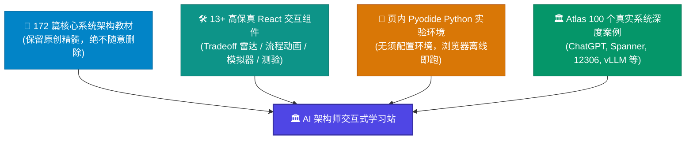
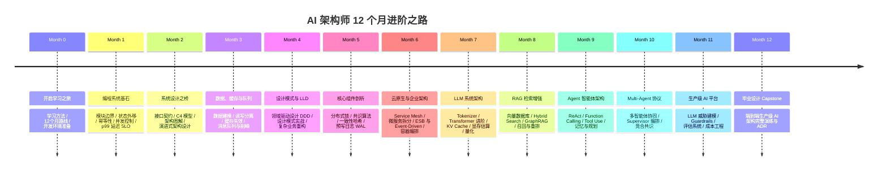

<div align="center">

# 🚀 AI 架构师交互式学习站 (AI Architect Interactive Platform)

**重交互 · 重图解 · 页内 Python 离线实验室 · 100 个真实顶级系统架构案例**

[](https://docusaurus.io/)
[](https://reactjs.org/)
[](https://www.typescriptlang.org/)
[](https://pyodide.org/)
[]()
[]()

---

<p align="center">
  <b>把 172 篇系统架构深度教材，建成本地完全离线部署、带 1100+ 完美架构图解与全套交互实验室的现代 AI 架构师成长站！</b>
</p>

</div>

---

## 🌟 核心特色与设计理念

本学习站打破传统“只读文档”的枯燥体验，采用 **“保护原文 + 交互增强 + 生产案例”** 三位一体设计：



### ✨ 5 大核心亮点

| 亮点维度 | 特色说明 |
| :--- | :--- |
| **全图解架构** | 全站包含 **1,100+ 张精准 Mermaid 架构图**（C4 容器图、时序图、思维导图、状态机），经过 AST 编译器 100% 零缺陷验证。 |
| **页内 Python 实验室** | 内置基于 Wasm/Pyodide 的 `<PyRunner />` 运行器，无需安装任何本地 Python 环境，直接在浏览器中跑一致性哈希、令牌桶算法与分布式事务仿真。 |
| **权衡探索与系统模拟** | 包含 `<TradeoffExplorer />`（架构维度雷达与条形取舍对比）、`<SystemSimulator />`（算法模拟）、`<CompareSlider />`（新旧架构滑动对比）等交互神器。 |
| **100 系统 Atlas 案例库** | 涵盖 **Tier1~Tier3 共 100 个业界经典与最新系统**（涵盖 LLM 基础设施、高并发电商、内核操作系统、分布式数据库等）。 |
| **100% 离线部署** | 所有静态资源、Pyodide 运行时与本地搜索索引均实现本地 Vendor 托管，断网也能秒开学习。 |

---

## 🗺️ 12 个月 AI 架构师全景路线图

学习站按循序渐进的体系划分为 13 个课程模块：



---

## 🏛️ Atlas 100 个真实系统架构案例库 (精选)

学习站配套了 **100 个生产级真实系统** 的深度架构拆解，每个案例统一遵守 11 段式深度剖析规范：

### 🤖 AI & 大模型基础设施
* **ChatGPT / Claude / Gemini**：千亿参数 LLM 推理集群与流式分发拓扑
* **vLLM / Megatron-LM / Triton**：PagedAttention 显存优化与张量/流水线并行
* **DeepSeek**：DeepSeek-V3 / R1 混合专家 (MoE) 与 MLA 极简注意力机制
* **Milvus / Perplexity / LangGraph**：海量向量检索、RAG 搜索引擎与多智能体状态图

### ⚡ 亿级高并发 & 分布式系统
* **12306 售票系统**：千万 QPS 余票查询与沿途站位图扣减引擎
* **WhatsApp / Telegram**：50 人扛 10 亿用户的极简 Erlang/BEAM 架构
* **Google Spanner / Cassandra / CockroachDB**：TrueTime 硬件时钟与全球分布式事务
* **Kafka / ClickHouse / Flink**：百万级吞吐事件流与实时 OLAP 引擎

### 💻 操作系统、内核与基础设施
* **Linux Kernel / Windows NT / macOS**：内核调度、虚拟内存与 VFS 文件系统
* **Docker / Kubernetes / Bazel**：容器隔离、Pod 状态机与大规模并行构建 DAG
* **FreeRTOS / QNX / ROS 2**：硬实时操作系统、微内核与机器人 Pub/Sub 通信

---

## 🧩 交互组件大观园 (Component Gallery)

### 1. 🐍 页内 Python 实验环境 (`PyRunner`)
直接在浏览器中编辑并运行 Python 代码，带有控制台输出和期望验证：

```jsx
<PyRunner
  expect="Consistent Hash Ring 节点分布均匀"
  rows={12}
  code={`import hashlib

class ConsistentHashRing:
    def __init__(self, replicas=3):
        self.replicas = replicas
        self.ring = {}

    def add_node(self, node):
        for i in range(self.replicas):
            key = int(hashlib.md5(f"{node}:{i}".encode()).hexdigest(), 16)
            self.ring[key] = node

ring = ConsistentHashRing()
ring.add_node("Redis-Node-1")
print("✅ Hash Ring 节点挂载完成，实体与虚拟节点已映射。")
`}
/>
```

### 2. ⚖️ 架构决策取舍探索器 (`TradeoffExplorer`)
通过条形/雷达评分图，动态对比不同架构选型在多维指标上的优劣：

```jsx
<TradeoffExplorer
  title="读写分离 vs 分库分表 架构取舍"
  dimensions={['扩展性', '运维复杂度', '数据一致性', '开发成本']}
  options={[
    { name: '主从读写分离', scores: [3, 4, 3, 5], note: '适合读多写少场景，改造成本低' },
    { name: 'Sharding 分库分表', scores: [5, 2, 2, 2], note: '适合海量写与容量瓶颈，需处理跨库JOIN' }
  ]}
/>
```

---

## 🚀 快速上手与本地运行

本项目基于 **Docusaurus 3 + React 18 + TypeScript**，提供极简的单命令管理。

### 1. 克隆项目与安装依赖

```bash
# 克隆仓库
git clone https://github.com/your-username/ai-architect-learning-hub.git
cd ai-architect-learning-hub

# 安装 Node.js 依赖
npm install
```

### 2. 启动本地实时预览服务器

```bash
npm start
```
> 启动成功后，浏览器会自动打开 `http://localhost:3000`。修改 Markdown/MDX 文件时支持热更新 (HMR)。

### 3. 生产环境打包构建

```bash
npm run build
```
> 在 `build/` 目录下产出编译后的纯静态文件，经过 Mermaid AST 与 MDX 严格校验，确保 0 Error。

### 4. 本地完全离线预览

```bash
npm run serve
# 或者
npx serve build
```
> 在断网环境下本地运行静态 Web 服务，验证全站离线搜索与离线 Pyodide 运行。

---

## 📁 目录结构

```text
AI架构师教程/
├── docs/                    # 172 篇系统架构课程与 100 Atlas 案例
│   ├── 00-start/            # Month 0: 开启学习之旅
│   ├── 01-foundations/      # Month 1: 编程系统基石
│   ├── ...
│   ├── 12-capstone/         # Month 12: 毕业设计 Capstone
│   ├── atlas/               # 100 个真实系统架构案例库
│   └── projects/            # 实战项目与作品集指南
├── src/
│   ├── components/          # 13+ 交互组件 (TypeScript + CSS Modules)
│   │   ├── PyRunner/        # 页内 Python 运行时
│   │   ├── TradeoffExplorer/# 架构取舍探索器
│   │   ├── SystemSimulator/ # 内置算法模拟器
│   │   └── ...
│   └── css/custom.css       # 统一设计系统与主题 Style
├── static/
│   └── pyodide/             # 本地 Vendor 的 Pyodide Wasm 运行时
├── scripts/
│   └── audit_quality_gates.py # 质量门槛自动检测工具
├── docusaurus.config.ts     # Docusaurus 配置文件
├── sidebars.ts              # 侧边栏层级配置
└── README.md                # 本文档
```

---

## 📜 质量门槛与贡献宪法

为了保障学习站的高质量与一致体验，所有代码和文档提交必须遵守以下**铁律**：

1. **保护原文**：已有 172 篇 MDX 正文“只增强、不重写、不删除”，插入组件与图表必须保持原汁原味。
2. **构建即验收**：提交前必须执行 `npm run build` 通过（0 Error），Mermaid 语法与链接断链均为 0。
3. **真实来源纪律**：所有架构案例均来源于公开工程博客、论文或官方文档，禁止无根据臆测。
4. **中文主讲、英文术语**：首次出现的专业术语统一使用 `<GlossaryTerm />` 组件包裹悬停显示释义。

---

<div align="center">

**⭐ 如果这个项目对你的系统架构学习有所帮助，欢迎在 GitHub 上点个 Star！⭐**

</div>
