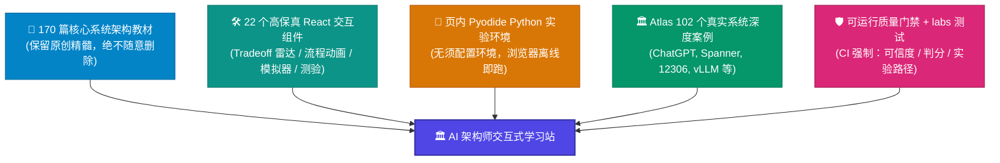
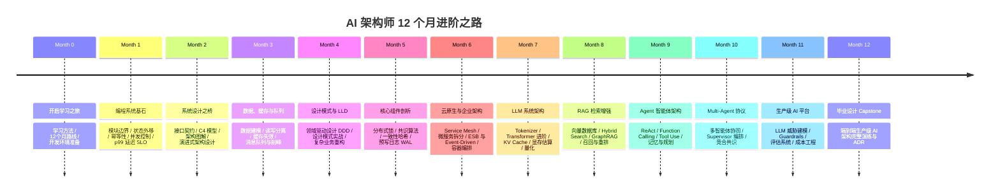

<div align="center">

# 🚀 AI 架构师交互式学习站 (AI Architect Interactive Platform)

**重交互 · 重图解 · 页内 Python 离线实验室 · 102 个真实顶级系统架构案例**

[](https://docusaurus.io/)
[](https://reactjs.org/)
[](https://www.typescriptlang.org/)
[](https://pyodide.org/)
[]()
[]()
[]()

---

<p align="center">
  <b>170 篇课程正文 + 102 个 Atlas 生产级案例（合计 270+ 篇深度文档），<br/>本地完全离线部署，配 1,107 张零缺陷架构图与全套可运行交互实验室。</b>
</p>

</div>

---

## 📌 30 秒了解这个 repo

> 一句话：**这不是一份"只读文档"，而是一个"边看图、边跑代码、边做取舍、边自测"的 AI 架构师训练场。**

- 🎓 **它教什么** —— 从编程基本功 → 分布式系统 → 云原生 → LLM/RAG/Agent，一条**12 个月**的完整成长路线。
- 🏛️ **它拿什么当教材** —— **102 个真实生产系统**的深度架构拆解（ChatGPT、Spanner、12306、vLLM、Signal、Kubernetes…），每个案例都是一道"系统设计题"的完整答案。
- 🐍 **它怎么让你练** —— 页内浏览器直接跑 Python（一致性哈希、令牌桶、Raft 选主…），外加 **154 个零依赖本地测试**，`python3` 一键验证。
- 🛡️ **凭什么可信** —— 每个案例 **≥2 条已核实的一手来源**、**0 编造引用**，并由**可在 CI 上运行的质量门禁**强制守护，回退即变红。

---

## 🌟 核心特色与设计理念

本学习站打破传统"只读文档"的枯燥体验，采用 **"保护原文 + 交互增强 + 生产案例 + 可信守护"** 四位一体设计：



### ✨ 6 大核心亮点

| 亮点维度 | 特色说明 |
| :--- | :--- |
| **全图解架构** | 全站包含 **1,107 张精准 Mermaid 架构图**（C4 容器图、时序图、思维导图、状态机），经过 AST 编译器 100% 零缺陷验证。 |
| **页内 Python 实验室** | 内置基于 Wasm/Pyodide 的 `<PyRunner />` 运行器，无需安装本地 Python，直接在浏览器中跑一致性哈希、令牌桶算法与分布式事务仿真。 |
| **本地可运行 labs** | `labs/` 下 **154 个零依赖 Python 测试**，跨 12 个月主题，`python3 labs/run_all.py` 一键跑通，把"看懂"变成"能跑通"。 |
| **权衡探索与系统模拟** | 包含 `<TradeoffExplorer />`（架构维度雷达与取舍对比）、`<SystemSimulator />`（算法模拟）、`<CompareSlider />`（新旧架构滑动对比）等交互神器。 |
| **102 系统 Atlas 案例库** | 涵盖 **Tier1~Tier3 共 102 个业界经典与最新系统**（LLM 基础设施、高并发电商、内核操作系统、分布式数据库等），每案配 `<ResearchNote />` 一手来源研究卡。 |
| **可信度硬门禁 + 100% 离线** | 每案 ≥2 条已核实一手来源、0 编造引用，由 CI 门禁守护；所有资源、Pyodide 运行时与搜索索引本地托管，断网秒开。 |

---

## 🎯 这个 repo 适合谁 · 你会得到什么

| 你是谁 | 建议学习路径 | 你将获得 |
| :--- | :--- | :--- |
| **后端 / 全栈工程师<br/>想转 AI 架构** | 快速过 Month 1–6 巩固分布式基本功 → 重点攻 Month 7–12（LLM/RAG/Agent）→ 精读 Atlas 的 AI 基础设施案例（vLLM / Triton / DeepSeek / LangGraph） | 把已有工程直觉迁移到 LLM 时代，看懂推理集群、显存分页、Agent 编排的真实架构 |
| **在校学生 / 转行者<br/>系统学架构** | 从 Month 0 顺序推进，每章**跑一遍 labs + 做 QuizCard 自测**，Atlas 当"拓展阅读"式故事读 | 一条不跳步的完整地基，从模块边界到共识算法，边学边有可运行的正反馈 |
| **面试冲刺<br/>（系统设计轮）** | 直接刷 Atlas —— 每个案例就是一道系统设计题的**满分答卷**；用 11 段式结构复述，配 `TradeoffExplorer` 练"取舍表达" | 高频系统设计题的成体系素材库 + "讲清楚为什么这样选"的表达训练 |
| **技术团队 / 布道者** | 拿 Atlas 案例做内部分享，用页内 `PyRunner` 现场演示算法 | 开箱即用的、图 + 代码 + 取舍俱全的教学材料 |

---

## 🗺️ 12 个月 AI 架构师全景路线图

学习站按循序渐进的体系划分为 13 个课程模块（Month 0–12）：



---

## 🏛️ Atlas —— 102 个真实系统架构案例库

学习站配套 **102 个生产级真实系统** 的深度拆解，是全站含金量最高的部分。

### 每个案例遵循统一的「11 段式深度解剖」结构

> 知道每篇里有什么，你就能带着问题去读、而不是被动浏览：


### 精选案例（按领域）

**🤖 AI & 大模型基础设施**
* **ChatGPT / Claude / Gemini**：千亿参数 LLM 推理集群与流式分发拓扑
* **vLLM / Megatron-LM / Triton**：PagedAttention 显存分页、张量/流水线并行、动态批处理
* **DeepSeek**：DeepSeek-V3 / R1 混合专家 (MoE) 与 MLA 极简注意力机制
* **Milvus / Perplexity / LangGraph**：海量向量检索、RAG 搜索引擎与多智能体状态图

**⚡ 亿级高并发 & 分布式系统**
* **12306 售票系统**：千万 QPS 余票查询、内存网格削峰与站位图扣减引擎
* **WhatsApp / Telegram / Signal**：极简架构扛十亿用户，双棘轮端到端加密
* **Google Spanner / Cassandra / CockroachDB**：TrueTime 硬件时钟与全球分布式事务
* **Kafka / ClickHouse / Flink**：百万级吞吐事件流与实时 OLAP 引擎

**💻 操作系统、内核与基础设施**
* **Linux Kernel / Windows NT / macOS**：内核调度、虚拟内存与混合内核架构
* **Docker / Kubernetes / Bazel**：namespace 视图隔离、Pod 状态机与大规模并行构建 DAG
* **FreeRTOS / QNX / ROS 2**：硬实时操作系统、微内核与机器人 Pub/Sub 通信

> 完整清单见 `docs/atlas/`，每个案例都带脑图、C4 图、时序图、取舍雷达、可跑模拟器、自测题与一手来源。

---

## 🧩 交互组件大观园 (共 22 个 Component)

全站自研 **22 个** TypeScript 交互组件，把静态知识变成"可操作"体验。核心几个：

| 组件 | 作用 |
| :--- | :--- |
| `<PyRunner />` | 页内 Pyodide Python 运行器，带控制台输出与 `expect` 期望校验 |
| `<TradeoffExplorer />` | 架构取舍雷达/条形图，多维度动态对比选型优劣 |
| `<SystemSimulator />` | 算法/系统行为交互模拟器 |
| `<CompareSlider />` | 新旧架构左右滑动对比 |
| `<QuizCard />` | 知识自测卡（选择题即时判分与解析） |
| `<ResearchNote />` | 一手来源研究卡：链接原始论文/官方文档 + 该案例专属洞见与架构启示 |
| `<CapacityEstimator />` / `<LatencyNumbers />` | 容量估算器 / 延迟数量级参照表 |
| `<FailureLab />` / `<PercentileLab />` | 故障注入实验 / p99 长尾延迟实验 |
| `<GlossaryTerm />` | 专业术语悬停释义 |
| `<MindMap />` / `<StepFlow />` / `<ArchitectureEvolution />` | 思维导图 / 步骤流程动画 / 架构演进时间线 |

### 示例 1 · 页内 Python 实验环境 (`PyRunner`)

```jsx
<PyRunner
  expect="Consistent Hash Ring 节点分布均匀"
  rows={12}
  code={`import hashlib

class ConsistentHashRing:
    def __init__(self, replicas=3):
        self.replicas = replicas
        self.ring = {}

    def add_node(self, node):
        for i in range(self.replicas):
            key = int(hashlib.md5(f"{node}:{i}".encode()).hexdigest(), 16)
            self.ring[key] = node

ring = ConsistentHashRing()
ring.add_node("Redis-Node-1")
print("✅ Hash Ring 节点挂载完成，实体与虚拟节点已映射。")
`}
/>
```

### 示例 2 · 架构决策取舍探索器 (`TradeoffExplorer`)

```jsx
<TradeoffExplorer
  title="读写分离 vs 分库分表 架构取舍"
  dimensions={['扩展性', '运维复杂度', '数据一致性', '开发成本']}
  options={[
    { name: '主从读写分离', scores: [3, 4, 3, 5], note: '适合读多写少场景，改造成本低' },
    { name: 'Sharding 分库分表', scores: [5, 2, 2, 2], note: '适合海量写与容量瓶颈，需处理跨库JOIN' }
  ]}
/>
```

---

## 🛡️ 质量保障体系 —— 为什么你可以信任这里的内容

学习内容最怕"看着很全、细看全是编的"。本站用**可在任意机器/CI 上运行的门禁**把质量变成可验证、不可回退的规则。

### 1. 可运行内容质量门禁 (`scripts/quality-gate.mjs`)

纯 Node 标准库实现、**无需 `npm install`**，分级校验的是"实质"而非"形式"：

| 级别 | 代表规则 | 守护什么 |
| :--- | :--- | :--- |
| **P0** | `LAB-REF` | 教材引用的 `labs/...` 实验路径必须真实存在（否则学员一上手就 404） |
| **P1** | `CITE-HOLLOW` / `CITE-THIN` | Atlas 案例禁止域名首页占位/编造引用，且须 ≥2 条具体一手来源 |
| **P1** | `QUIZ` / `TRADEOFF` / `GLOSSARY` | 测验判分、取舍图刻度、术语释义的组件约定不得漂移 |
| **P2** | `EXPECT-SOUND` / `STRUCT` | 运行校验串与章节结构的精细度提示 |

```bash
npm run quality-gate          # 严格模式：有 P0/P1 → 退出码 1（卡住 CI）
npm run quality-gate:report   # 只报告不阻断（存量治理用）
```

> 当前基线：**P0 = 0，P1 = 0**。规则与阈值详见 [`scripts/QUALITY_GATE.md`](scripts/QUALITY_GATE.md)。

### 2. 来源可信度纪律

- **102 / 102** 个 Atlas 案例均配 `<ResearchNote />`，每张卡片 `href` 指向**已核实的一手来源**（原始论文、官方工程博客、协议规范）。
- 全站 **0 条编造/占位引用**；权威官方单主题站在白名单内显式放行。
- 事实核查过程见 [`reports/atlas-factcheck.md`](reports/atlas-factcheck.md)。

### 3. labs 本地可运行实验室

`labs/` 下 **154 个零依赖测试**，覆盖 12 个月主题，用断言把知识点变成"能跑通/跑不通"的确定性反馈：

```bash
python3 labs/run_all.py            # 一键跑全部（逐个报告通过/失败）
python3 labs/run_all.py month05    # 只跑某个月
python3 labs/month05/m5l11_raft_election/test_election.py   # 或单跑某一个实验
```

### 4. CI 自动守护

`.github/workflows/quality-gate.yml` 在改动 `docs/**`、`labs/**` 或门禁自身时触发，任何新引入的上述缺陷都会让 PR 变红。

---

## 🚀 快速上手与本地运行

本项目基于 **Docusaurus 3 + React 18 + TypeScript**，提供极简的单命令管理。

### 1. 克隆项目与安装依赖

```bash
git clone https://github.com/koosai/AI-Architect-Learning.git
cd AI-Architect-Learning
npm install
```

### 2. 启动本地实时预览

```bash
npm start
```
> 启动后浏览器自动打开 `http://localhost:3000`，修改 Markdown/MDX 支持热更新 (HMR)。

### 3. 生产环境打包构建

```bash
npm run build
```
> 在 `build/` 产出编译后的纯静态文件，经过 Mermaid AST 与 MDX 严格校验，确保 0 Error。

### 4. 本地完全离线预览

```bash
npm run serve
```
> 断网环境下本地运行静态 Web 服务，验证全站离线搜索与离线 Pyodide 运行。

### 5. 内容贡献前自检（推荐）

```bash
npm run quality-gate   # 内容质量门禁
python3 labs/run_all.py # labs 全量自测
```

---

## 📁 目录结构

```text
AI-Architect-Learning/
├── docs/                        # 270+ 篇深度文档
│   ├── 00-start/                # Month 0: 开启学习之旅
│   ├── 01-foundations/          # Month 1: 编程系统基石
│   ├── ...                      # Month 2 ~ 11
│   ├── 12-capstone/             # Month 12: 毕业设计 Capstone
│   ├── atlas/                   # 🏛️ 102 个真实系统架构案例库
│   └── projects/                # 实战项目与作品集指南
├── labs/                        # 🐍 154 个零依赖 python3 可运行测试
│   ├── month01/ ... month12/    # 按月主题组织
│   ├── run_all.py               # 一键跑全部 labs
│   └── README.md                # labs 使用说明
├── src/
│   ├── components/              # 22 个交互组件 (TypeScript + CSS Modules)
│   │   ├── PyRunner/            # 页内 Python 运行时
│   │   ├── TradeoffExplorer/    # 架构取舍探索器
│   │   ├── ResearchNote/        # 一手来源研究卡
│   │   ├── SystemSimulator/     # 算法模拟器
│   │   └── ...
│   └── css/custom.css           # 统一设计系统与主题
├── static/pyodide/              # 本地 Vendor 的 Pyodide Wasm 运行时
├── scripts/
│   ├── quality-gate.mjs         # 🛡️ 可运行内容质量门禁 (纯 Node，无需安装)
│   └── QUALITY_GATE.md          # 门禁规则与基线文档
├── reports/atlas-factcheck.md   # Atlas 案例库事实核查报告
├── .github/workflows/
│   └── quality-gate.yml         # CI 门禁工作流
├── docusaurus.config.ts         # Docusaurus 配置
├── sidebars.ts                  # 侧边栏层级配置
└── README.md                    # 本文档
```

---

## 📜 质量门槛与贡献宪法

为保障学习站的高质量与一致体验，所有代码和文档提交必须遵守以下**铁律**：

1. **保护原文**：已有课程 MDX 正文"只增强、不重写、不删除"，插入组件与图表须保持原汁原味。
2. **构建即验收**：提交前必须 `npm run build` 通过（0 Error），Mermaid 语法与断链均为 0。
3. **门禁即验收**：`npm run quality-gate` 须 **P0 = P1 = 0**；新增 Atlas 案例须 ≥2 条一手来源并配 `<ResearchNote />`。
4. **真实来源纪律**：所有案例均出自公开工程博客、论文或官方文档，禁止无根据臆测与占位引用。
5. **中文主讲、英文术语**：首次出现的专业术语统一用 `<GlossaryTerm />` 包裹悬停释义。

---

<div align="center">

**⭐ 如果这个项目对你的系统架构学习有所帮助，欢迎在 GitHub 上点个 Star！⭐**

</div>
