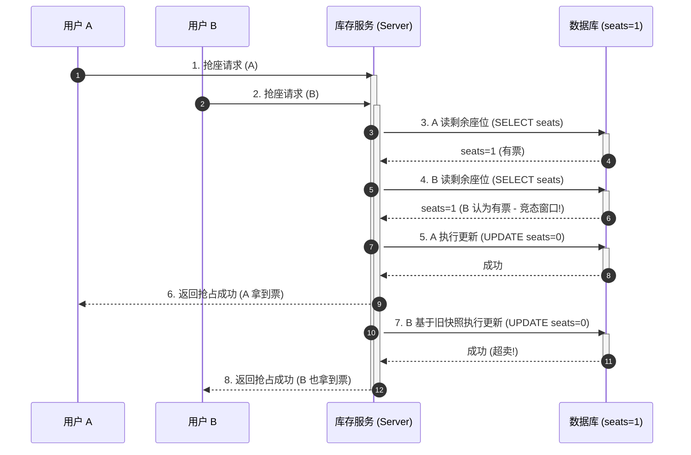
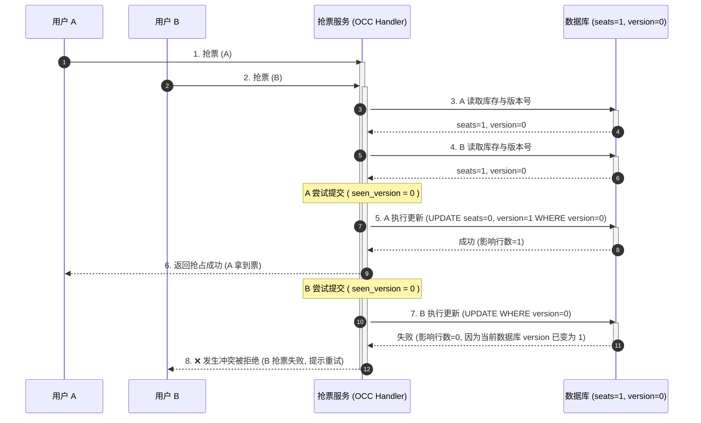
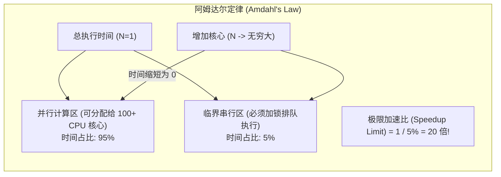

import GlossaryTerm from '@site/src/components/GlossaryTerm';
import GuidedExercise from '@site/src/components/GuidedExercise';
import ResearchNote from '@site/src/components/ResearchNote';
import ChapterMeta from '@site/src/components/ChapterMeta';
import PyRunner from '@site/src/components/PyRunner';
import TradeoffExplorer from '@site/src/components/TradeoffExplorer';
import QuizCard from '@site/src/components/QuizCard';

# L8 · 并发与竞态条件

<ChapterMeta
  time="约 2 小时"
  prereqs={[{label: 'L5 状态', href: './state-and-storage'}, {label: 'L6 幂等', href: './idempotency'}]}
  outcome="一个不会“超卖”的抢座功能：用乐观并发控制（版本号）让两个同时到达的请求只有一个成功。"
  howToUse="先跑那个“两人同时抢到最后一张票”的超卖演示，理解竞态窗口，再用版本号修好它。"
/>

:::tip 这一课最反直觉的地方
你的代码单独看每一行都对，但**两个请求同时跑**时就会出错。竞态条件是这样一类 bug：它不在某一行代码里，而在"两件事同时发生"的时序里——所以最难复现、最难调试。
:::

## 一、最后一张票，怎么卖给了两个人？

活动还剩 1 个名额。两个用户几乎同时点"报名"：

1. 请求 A 读库存：**剩 1**，判断"有票"。
2. 几乎同一瞬间，请求 B 也读库存：**还是剩 1**（A 还没来得及写回），也判断"有票"。
3. A 占座，库存写成 0。
4. B 基于它读到的"剩 1"也占座，库存又写成 0。

结果：**一张票卖给了两个人（超卖）**。每一步代码都没错，错在"读—判断—写"这三步之间，被另一个请求**插了队**。



> 这就是<GlossaryTerm term="Race Condition" definition="竞态条件：程序的正确性依赖于多个操作的执行时序，当它们交错执行时产生错误结果。典型是“读-改-写”不是原子操作时被并发打断。">竞态条件（race condition）</GlossaryTerm>。这一课学的就是怎么让"读—改—写"安全。

## 二、三个核心概念（分层）

### 基础：并发、并行、与"读-改-写"为什么危险

<GlossaryTerm term="Concurrency" definition="并发：多个任务在重叠的时间段内推进（不一定同时在跑），它们会交错访问共享资源。">并发</GlossaryTerm>是"多个任务交错推进"，<GlossaryTerm term="Parallelism" definition="并行：多个任务真的在同一时刻一起执行（需要多核/多机）。并行一定并发，并发不一定并行。">并行</GlossaryTerm>是"真的同时在跑"。只要有并发 + 共享状态，"读-改-写"（read-modify-write）这种非<GlossaryTerm term="Atomic Operation" definition="原子操作：不可被打断的操作，要么全做完、要么没做，中间状态对别人不可见。是避免竞态的基本武器。">原子</GlossaryTerm>的操作就危险——因为它可以在"读"和"写"之间被别人插队。

### 进阶：悲观锁 vs 乐观锁

两种思路防竞态：

- <GlossaryTerm term="Pessimistic Locking" definition="悲观锁：假设冲突常发生，操作前先加锁独占资源，别人必须等。简单可靠，但降低并发、可能死锁。">悲观锁</GlossaryTerm>：动手前先"锁住"资源，别人排队等。简单可靠，但并发低、可能死锁。
- <GlossaryTerm term="Optimistic Concurrency Control" definition="乐观并发控制：假设冲突很少，不加锁；提交时用版本号/CAS 检查数据有没有被别人改过，被改过就拒绝并重试。">乐观并发控制</GlossaryTerm>：不加锁，先干；提交时检查"我读它之后，有没有人改过它"（用版本号/CAS），改过就拒绝、让你重试。

抢座这种"冲突其实不多但要绝对正确"的场景，乐观锁很合适：给库存配一个**版本号**，每次成功修改版本号加一；提交时如果版本号变了，说明别人先改了，本次作废。



### 深入（选学）：原子操作、隔离级别与"干脆不共享"

更底层的武器是数据库的**原子操作**（如 `UPDATE seats=seats-1 WHERE seats>0`，一句话原子完成读改写）和**事务隔离级别**（从读未提交到可串行化，级别越高越安全也越慢）。

还有一条根本不同的路：**干脆不共享状态**。[WhatsApp 的 Actor 模型](../atlas/whatsapp.mdx)就是——每个连接是独立进程、不共享内存、只传消息，于是大量竞态从根上不存在。这也是 Erlang/Go 等语言推崇"用通信共享内存，而不是用共享内存通信"的原因。

<ResearchNote
  title="乐观并发控制：假设冲突很少，就别为它付锁的代价"
  source="Kung & Robinson (1981), On Optimistic Methods for Concurrency Control"
  href="https://dl.acm.org/doi/10.1145/319566.319567"
  insight="这篇经典论文提出：当冲突不频繁时，与其用锁让所有事务排队（悲观），不如让它们各自先做，在提交时验证有没有冲突、有冲突再回滚（乐观）。在低冲突负载下吞吐显著更高。"
  application="乐观并发控制是现代数据库（MVCC）、分布式系统、甚至前端状态同步的基础思想。判断用乐观还是悲观，关键问一句：冲突到底多不多？"
/>

## 三、跟我做一遍：超卖，然后用版本号修好

下面用"手动交错"模拟两个并发请求（Pyodide 是单线程，所以我们把时序摊开给你看）。

### 坏例子：读-改-写被插队 → 超卖

<PyRunner
  expect="卖出: 2"
  code={`seats = 1     # 只剩一张票
sold = 0

# 模拟两个请求并发：它们几乎同时"读"，此时都还没"写"
a_read = seats       # A 读到 1
b_read = seats       # B 也读到 1（A 还没写回——这就是竞态窗口）

if a_read > 0:                 # A 判断有票
    seats = a_read - 1
    sold += 1
    print("A 抢到票")

if b_read > 0:                 # B 基于它读到的旧值，也判断有票
    seats = b_read - 1
    sold += 1
    print("B 抢到票")

print("卖出:", sold, "（库存其实只有 1）")   # 卖出 2 → 超卖`}
/>

### 修好：乐观并发控制（版本号）

<PyRunner
  expect="卖出: 1"
  code={`seats = 1
version = 0      # 每次成功修改，版本号 +1
sold = 0

def try_reserve(read_seats, read_version):
    global seats, version, sold
    if read_seats <= 0:
        return "无票"
    if read_version != version:      # 我读它之后有人改过 → 冲突，作废
        return "冲突，请重试"
    seats = read_seats - 1           # 没人插队，安全提交
    version += 1
    sold += 1
    return "成功"

# A、B 都在 version=0、seats=1 时读取
print("A:", try_reserve(1, 0))   # 成功，version 变成 1
print("B:", try_reserve(1, 0))   # 冲突！因为 version 已经不是 0 了
print("卖出:", sold)              # 1：正确，没有超卖`}
/>

**试试**：让 B 在冲突后"重新读取再试一次"（read_seats=0, read_version=1），看它这次正确地得到"无票"。这就是乐观锁的完整循环：**读 → 试提交 → 冲突就重读重试**。

## 四、动手 Lab（必做）

打开 `labs/month01/l8_concurrency/`：

```bash
python labs/month01/l8_concurrency/test_seats.py
```

实现一个用版本号做乐观并发控制的 `reserve`，让交错的两个请求只有一个成功，绝不超卖。

<GuidedExercise
  title="练习指引：写一个不超卖的抢座"
  goal="把竞态条件和乐观并发控制变成肌肉记忆——这是几乎所有“抢/秒杀/扣库存”系统的核心。"
  hints={[
    '资源要带一个 version 字段，每次成功修改就 +1。',
    'reserve 接收调用方"读取时看到的 version"，提交前比对当前 version。',
    'version 不一致 = 有人插队了 = 拒绝本次（返回冲突），不要修改。',
    '一致才真正扣减并把 version+1。'
  ]}
  steps={[
    '用一个 dict 表示资源：{"seats": n, "version": v}。',
    '实现 read(resource) 返回当前 (seats, version) 的快照。',
    '实现 reserve(resource, seen_version)：若无票返回 "sold_out"；若 resource["version"] != seen_version 返回 "conflict"；否则 seats-1、version+1、返回 "ok"。',
    '写测试：两个请求都用同一个旧 version 提交，只有第一个 ok、第二个 conflict；座位最终不为负。',
    '跑到测试全过。'
  ]}
  checks={[
    '你能指出代码里的"竞态窗口"在哪（读和写之间）。',
    '你能解释版本号是怎么发现"有人插队"的。',
    '你能说出乐观锁和悲观锁分别适合什么场景。',
    '你能说出为什么 Actor/无共享模型能从根上避免这类 bug。'
  ]}
/>

## 架构师深潜（Staff+ 视角）

### 1. 竞态是分布式系统最贵的一类 bug

它在单机多线程里就存在，到了分布式（多进程、多机、多副本）只会更普遍、更难复现。生产事故里大量"偶尔出错、重启就好、查不出原因"的幽灵，根子都是竞态。架构师必须默认：**任何共享可变状态 + 并发 = 潜在竞态。**

### 2. 选哪种并发控制？

<TradeoffExplorer
  title="并发控制策略"
  dimensions={['高并发吞吐', '冲突下正确性', '实现复杂度', '死锁风险', '适合写热点']}
  options={[
    {
      name: '悲观锁（先锁后改）',
      scores: [2, 5, 3, 2, 4],
      note: '加锁独占，绝对安全，但别人要等，吞吐低，且可能死锁。',
      whenToUse: '冲突频繁、且必须强一致（如账户转账）的写热点。'
    },
    {
      name: '乐观锁（版本号/CAS）',
      scores: [5, 5, 3, 5, 2],
      note: '不加锁、吞吐高、无死锁；但冲突时要重试，写热点下重试会很多。',
      whenToUse: '冲突不频繁的绝大多数场景（库存、协同编辑、配置更新）。'
    },
    {
      name: '原子操作 / 单条 SQL',
      scores: [5, 5, 1, 5, 3],
      note: '把读改写压成一句原子操作（如 UPDATE ... WHERE seats>0），数据库保证原子性。',
      whenToUse: '逻辑能用一条原子语句表达时——最简单可靠，优先考虑。'
    },
    {
      name: '无共享 / Actor 模型',
      scores: [5, 5, 4, 5, 5],
      note: '根本不共享可变状态，按 key 路由到单一所有者串行处理，竞态从根上消失。',
      whenToUse: '能按实体分区、串行化处理的场景（如 WhatsApp 每连接一进程、Actor 系统）。'
    }
  ]}
/>

### 3. 并行不是免费的午餐：Amdahl 定律

加机器/加核就能线性变快吗？不能。<GlossaryTerm term="Amdahl's Law" definition="阿姆达尔定律：程序里串行（不能并行）的部分，决定了加再多处理器也突破不了的加速上限。若 5% 必须串行，加无限核最多也只快 20 倍。">Amdahl 定律</GlossaryTerm>说：只要有一部分必须串行，它就成了加速的天花板——比如 5% 串行，加无限多核也最多快 20 倍。而竞态的"锁"恰恰会制造串行段。所以架构上既要正确，又要尽量减少串行/锁竞争（回看 [L1 的尾延迟与扩展](./programming-systems-primer)）。




<ResearchNote
  title="并发控制的全景：锁、隔离级别与可串行化"
  source="Martin Kleppmann, DDIA 第 7 章（Transactions）"
  href="https://dataintensive.net/"
  insight="DDIA 系统梳理了事务隔离级别（读已提交、快照隔离/MVCC、可串行化）如何防止脏读、不可重复读、写偏斜等并发异常，以及每个级别的代价。"
  application="架构师要能根据业务对正确性的要求，选对隔离级别——而不是默认最高（太慢）或最低（出错）。理解这些异常，才能在『又快又对』之间做出有依据的取舍。"
/>

### 4. 架构师深问（给自己 30 分钟）

- 秒杀场景：100 万人抢 1000 件，你会用悲观锁、乐观锁、原子扣减还是排队串行？为什么？（提示：写热点 + 极高并发。）
- 乐观锁在"冲突很多"时会发生什么？（大量重试，反而比悲观锁还慢——所以要看冲突率。）
- 为什么说"用通信共享内存"（Actor/消息）比"用共享内存通信"（锁）在大规模下更不容易出竞态？

## 五、章末自测

<QuizCard
  questions={[
    {
      q: '在数据库高并发扣减库存（如秒杀）场景中，关于乐观锁（Version/CAS）与悲观锁（SELECT FOR UPDATE）的选择，以下说法哪项是正确的？',
      options: [
        '因为乐观锁不阻塞读写，因此在极端高冲突的秒杀热点（如 10 万人抢 1 件商品）下，其吞吐量和性能依然远远好于悲观锁。',
        '乐观锁适用于低冲突、低竞争的并发修改场景；在极端写热点/高冲突场景下，乐观锁会导致海量请求并发冲突并疯狂重试，产生巨大的 CPU 空转浪费，此时反而适合用悲观锁或者原子排队/扣减。',
        '悲观锁会导致系统发生死锁的概率降低为 0，因而应当作为所有业务的默认选择。'
      ],
      answer: 1,
      explain: '乐观锁的核心假设是“冲突很少发生”。在极高冲突的写热点下，大量并发会导致除一个请求外其余全部失败并进入 Retry 循环，造成严重的性能反噬。此时悲观排队或原子操作能保障有序与资源节约。'
    },
    {
      q: '根据阿姆达尔定律（Amdahl\'s Law），如果一个并行处理系统的业务逻辑中，有 10% 的时间段必须采用互斥锁进行串行化执行（如更新共享库存余额），那么该系统的最大极限加速比是多少？',
      options: [
        '可以通过无限增加服务器核心数来获得无限大的线性加速比。',
        '最大加速比上限被死死锁在 10 倍（1/0.10），即使增加一万个 CPU 核心也无法突破该加速极限。',
        '加速比上限取决于网络带宽和 CPU 主频，与串行占比没有绝对数学关系。'
      ],
      answer: 1,
      explain: '阿姆达尔定律数学公式为 S(N) = 1 / (s + (1-s)/N)。当 N 趋向于无穷大时，最大加速比为 1/s（其中 s 为串行比例）。若 s=10%，最大加速比极限为 10 倍。这警示架构师必须竭力减少临界区（串行段）的范围。'
    },
    {
      q: 'Erlang/OTP 或 Go 语言提倡的“不要通过共享内存来通信，而要通过通信来共享内存”的思想，在架构上是如何避免锁竞态的？',
      options: [
        '它通过在操作系统内核强制禁用多线程来实现真正的单线程运行。',
        '它让每个特定实体状态由单一自治协程/进程（主宰者）持有，外部请求只能转化为消息发往其信箱（Mailbox），由该协程串行化、排队处理，从而消灭了对多线程共享可变状态的并发修改竞态。',
        '它使用硬件级别的高速缓存一致性协议直接合并所有并发写动作。'
      ],
      answer: 1,
      explain: '无共享状态模型将并发冲突问题转化为了“消息排队问题”。由于持有状态的进程是单线程串行消费信箱消息的，不存在多线程并发读改写的竞态窗口，因此从根源上消除了死锁和内存竞态的风险。'
    }
  ]}
/>

## 自检清单

- [ ] 我能解释"每行代码都对，但并发就出错"是怎么回事。
- [ ] 我的 lab 抢座在交错请求下绝不超卖。
- [ ] 我能说出悲观锁、乐观锁、原子操作、无共享各自的适用场景。
- [ ] 我能用 Amdahl 定律解释"加机器为什么不能无限加速"。

## 常见误解

- **"我本地测没问题，那就没问题"**：竞态在低负载下几乎不出现，一上量就爆。
- **"加锁就万事大吉"**：锁带来死锁、串行化、吞吐下降，要用对、用少。
- **"乐观锁一定比悲观锁好"**：冲突多时乐观锁疯狂重试，反而更糟。看冲突率。

## 延伸阅读

- [Kung & Robinson (1981), On Optimistic Methods for Concurrency Control](https://dl.acm.org/doi/10.1145/319566.319567)
- [Martin Kleppmann, Designing Data-Intensive Applications（第 7 章 Transactions）](https://dataintensive.net/)
- [Go 谚语：Share memory by communicating](https://go.dev/blog/codelab-share)
