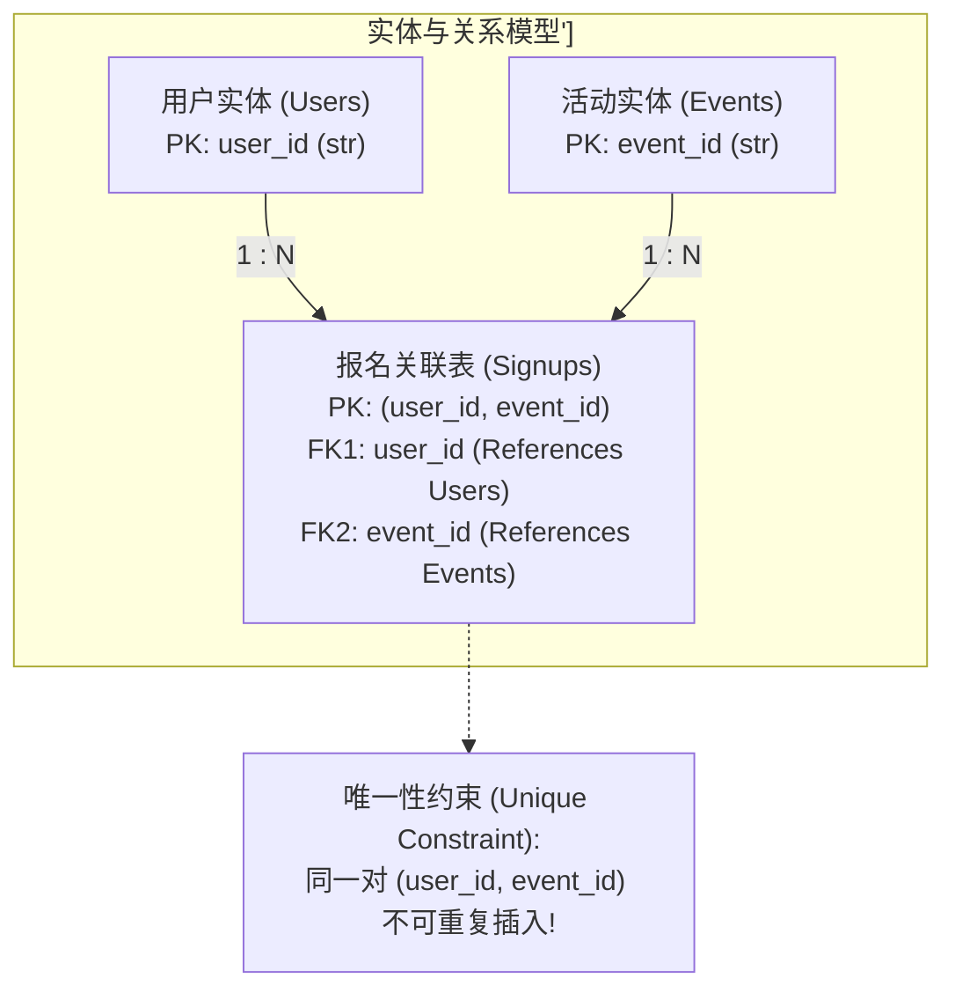
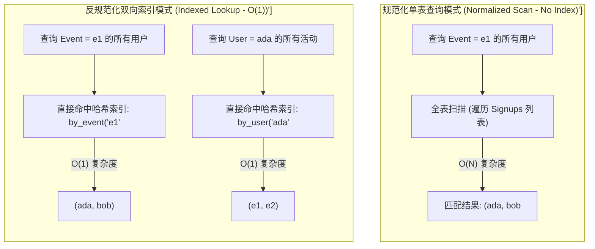
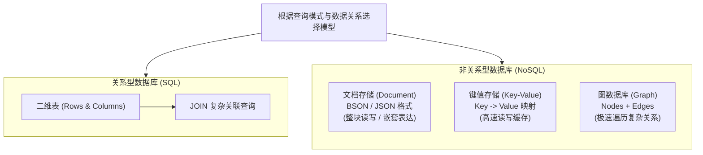

import GlossaryTerm from '@site/src/components/GlossaryTerm';
import GuidedExercise from '@site/src/components/GuidedExercise';
import ResearchNote from '@site/src/components/ResearchNote';
import ChapterMeta from '@site/src/components/ChapterMeta';
import PyRunner from '@site/src/components/PyRunner';
import TradeoffExplorer from '@site/src/components/TradeoffExplorer';
import QuizCard from '@site/src/components/QuizCard';

# L7 · 数据建模入门

<ChapterMeta
  time="约 1.5–2 小时"
  prereqs={[{label: 'L1 编程如何变成系统', href: './programming-systems-primer'}, {label: 'L5 状态放在哪里', href: './state-and-storage'}]}
  outcome="一个支持两类查询（按活动查报名、按用户查活动）都很快的数据结构，并能说清规范化与反规范化的取舍。"
  howToUse="先跑那个“全表扫描 vs 索引”的对比，建立“按查询模式建模”的直觉，再做 lab。"
/>

:::tip 这一课的核心一句话
**先想清楚"你会怎么查"，再决定"数据怎么存"。** 数据模型不是把字段堆在一起，而是为你的查询服务的结构。模型错了，再多机器也救不了慢查询。
:::

## 一、一个查起来要命的数据结构

L1 里报名记录我们随手存成一个大列表。现在产品要两个功能：

1. 看"某个活动的所有报名者"。
2. 看"某个用户报了哪些活动"。

你发现：每次查询都得**把整个列表从头扫到尾**。几百条还行，几百万条时，每次查询都卡好几秒。问题不在机器不够快，在于**数据的组织方式根本没为这两个查询设计**。

> 这一课学的就是：怎么按"你要怎么查"来组织数据，让查询从"扫描全表"变成"直接命中"。

## 二、三个核心概念（分层）

### 基础：实体、关系、主键、唯一约束

数据建模先识别**实体**（用户、活动）和它们之间的**关系**。报名其实是用户和活动之间的<GlossaryTerm term="Many-to-many" definition="多对多关系：一个用户可报多个活动，一个活动可有多个用户。通常用一张“关联表/连接表”来表达。">多对多</GlossaryTerm>关系：一个用户报多个活动，一个活动有多个用户。



两个关键约束：<GlossaryTerm term="Primary Key" definition="主键：唯一标识一条记录的字段（如 user_id）。是引用和查找一条记录的依据。">主键</GlossaryTerm>（唯一标识一条记录）和<GlossaryTerm term="Unique Constraint" definition="唯一约束：保证某字段（或字段组合）不重复，比如同一用户不能报名同一活动两次。是数据完整性的保障。">唯一约束</GlossaryTerm>（同一用户不能报同一活动两次——这把 L6 的幂等下沉到了数据层）。

### 进阶：规范化 vs 反规范化，以及索引

<GlossaryTerm term="Normalization" definition="规范化：把数据拆分、消除冗余，每个事实只存一处。好处是没有更新异常、数据一致；代价是查询常需 join 多张表。">规范化</GlossaryTerm>：每个事实只存一份，不冗余。好处是改一处就全对（没有更新异常），坏处是查询常要 join。

<GlossaryTerm term="Denormalization" definition="反规范化：故意冗余存储（同一数据存多份/预计算），用空间和写入复杂度换取读取速度。">反规范化</GlossaryTerm>：故意冗余、预计算，用"写麻烦、占空间"换"读飞快"。

而让查询变快的核心武器是<GlossaryTerm term="Index" definition="索引：一个额外的数据结构（如哈希表、B 树），把“按某字段查找”从全表扫描 O(n) 降到接近 O(1) 或 O(log n)。代价是额外空间和写入开销。">索引</GlossaryTerm>——本质就是"按查询模式预先组织一份查找结构"。



### 深入（选学）：按查询建模，而不是按"数据长什么样"建模

关系型数据库（SQL）鼓励你先规范化，再用 join 和索引应对查询。但在海量、特定查询模式下，现代做法常常反过来——**先看高频查询，再为它们专门设计（甚至冗余）数据结构**，这就是 NoSQL（文档/KV/列/图）的思维。

| 模型 | 擅长 | 例子 |
|---|---|---|
| 关系（SQL） | 复杂查询、强一致、事务 | 订单、账务 |
| 文档 | 整块读写、灵活 schema | 用户资料、内容 |
| 键值（KV） | 极快的按 key 读写 | 会话、缓存 |
| 图 | 关系遍历 | 社交网络、推荐 |




<ResearchNote
  title="关系模型：用数学把数据和查询分开"
  source="E. F. Codd (1970), A Relational Model of Data for Large Shared Data Banks"
  href="https://dl.acm.org/doi/10.1145/362384.362685"
  insight="Codd 提出用关系（表）和集合论来组织数据，让『数据怎么存』与『怎么查』解耦——用户用声明式查询描述要什么，由系统决定怎么取。这奠定了所有现代关系数据库。"
  application="这是计算机史上最有影响力的论文之一。它的核心思想——把逻辑数据模型和物理存储分离——至今仍是数据库设计的根。理解它，你才看得懂后来 NoSQL 是在放弃它的哪些部分来换什么。"
/>

## 三、跟我做一遍：全表扫描 vs 索引

### 坏模型：一个大列表，查询全靠扫

<PyRunner
  expect="['ada', 'bob']"
  code={`# 所有报名塞进一个列表
signups = [
    {"user": "ada", "event": "e1"},
    {"user": "bob", "event": "e1"},
    {"user": "ada", "event": "e2"},
]

def users_of_event(event):
    # 每次都要把整个列表扫一遍——O(n)
    return [s["user"] for s in signups if s["event"] == event]

print(users_of_event("e1"))   # 数据一多，这种扫描就会拖垮系统`}
/>

### 好模型：按查询模式建索引

<PyRunner
  expect="索引命中"
  code={`# 为两类查询各建一个索引（哈希表）
by_event = {}   # event -> [users]
by_user = {}    # user  -> [events]

def add(user, event):
    by_event.setdefault(event, []).append(user)
    by_user.setdefault(user, []).append(event)

add("ada", "e1")
add("bob", "e1")
add("ada", "e2")

# 两类查询都变成 O(1) 直接命中，不再扫描
print("e1 的报名者:", by_event["e1"])
print("ada 报的活动:", by_user["ada"])
print("索引命中")`}
/>

注意代价：我们存了**两份**索引、每次写要更新两处（这就是用"写复杂度 + 空间"换"读速度"——反规范化思维）。**试试**：再加一个 `by_event_count` 索引，O(1) 返回某活动的报名人数。

## 四、动手 Lab（必做）

打开 `labs/month01/l7_modeling/`：

```bash
python labs/month01/l7_modeling/test_index.py
```

实现一个 `SignupIndex`，让"按活动查"和"按用户查"都是 O(1)，并用唯一约束防止重复报名。

<GuidedExercise
  title="练习指引：为查询而建模"
  goal="练习『先看查询、再设计数据结构』，以及用索引把扫描变成命中。"
  hints={[
    '你有两类查询，就维护两个索引字典：by_event 和 by_user。',
    '唯一约束：同一 (user, event) 不能加两次——用一个 set 记已存在的对。',
    '每次 add 要同时更新两个索引，保持一致（这就是反规范化的写代价）。',
    '想想：如果还要"某活动报名人数"，是每次 len() 还是单独维护计数？各有什么取舍？'
  ]}
  steps={[
    '实现 SignupIndex，内部有 by_event、by_user 和一个 _pairs 集合。',
    'add(user, event)：若 (user,event) 已存在则返回 False（幂等/唯一）；否则更新两个索引并记入 _pairs，返回 True。',
    'users_of_event(event) 与 events_of_user(user) 都直接查字典返回。',
    '写测试：双查询正确、重复 add 被拒、不同用户/活动互不干扰。',
    '跑到测试全过。'
  ]}
  checks={[
    '你能说出你为哪两类查询各建了什么索引。',
    '你能解释维护两份索引是在用什么换什么（反规范化）。',
    '你能说出唯一约束如何把 L6 的幂等下沉到数据层。',
    '你能说出如果查询模式变了（要支持新查询），数据模型要怎么动。'
  ]}
/>

## 架构师深潜（Staff+ 视角）

### 1. OLTP vs OLAP：两类负载，两种建模

同一份业务数据，常常要服务两种完全不同的负载：<GlossaryTerm term="OLTP" definition="在线事务处理：大量短小的读写（下单、报名），要求低延迟、强一致。典型用规范化的关系模型。">OLTP</GlossaryTerm>（高频小事务，如报名下单）和 <GlossaryTerm term="OLAP" definition="在线分析处理：大范围聚合分析（报表、统计），扫描海量数据。常用列式存储和反规范化。">OLAP</GlossaryTerm>（大范围分析，如"过去一年各活动报名趋势"）。它们的建模、存储、甚至数据库都不同——这是为什么大公司有"业务库 + 数仓"两套体系。

### 2. 规范化与反规范化，是一场永恒的拉扯

<TradeoffExplorer
  title="规范化 vs 反规范化"
  dimensions={['读性能', '写一致性', '存储占用', '查询灵活性', '维护复杂度']}
  options={[
    {
      name: '高度规范化',
      scores: [2, 5, 5, 5, 4],
      note: '每个事实只存一份，无冗余。改一处即全对，但复杂查询要 join 多表，读较慢。',
      whenToUse: '写多、要强一致、查询多变的核心业务（订单、账务）。'
    },
    {
      name: '反规范化 / 预计算',
      scores: [5, 2, 2, 2, 2],
      note: '冗余存储、预计算结果，读极快。但一处数据改了要同步多处，易不一致。',
      whenToUse: '读远多于写、查询模式固定且对延迟敏感（feed、排行榜、统计卡片）。'
    },
    {
      name: '物化视图 / 缓存折中',
      scores: [4, 4, 3, 3, 3],
      note: '规范化做主存，另维护一份派生的物化视图/缓存供快速读，异步更新。',
      whenToUse: '想兼顾一致与读性能时的常见工程折中（接受派生数据短暂滞后）。'
    }
  ]}
/>

### 3. 分片键：一个会跟着你十年的决定

当单库存不下，要把数据**分片（sharding）**到多台时，"按什么字段分"（分片键）是极难逆转的决定。选不好会导致热点（某些分片被打爆）或跨分片查询（慢且复杂）。这把 L5 的"状态层怎么扩"和本课的"按查询建模"合在了一起。

<ResearchNote
  title="数据模型决定系统的可能性边界"
  source="Martin Kleppmann, DDIA 第 2–3 章（Data Models / Storage and Retrieval）"
  href="https://dataintensive.net/"
  insight="DDIA 指出：关系、文档、图各自适配不同的数据关系与查询模式；底层存储引擎（B 树 vs LSM 树）则决定了读写性能特性。模型与引擎的选择，从根上决定了系统擅长什么、不擅长什么。"
  application="架构师选数据库，本质是在选『这套系统天生擅长哪类查询』。先有查询模式，再选模型与引擎——而不是反过来被某个数据库绑架你的设计。"
/>

### 4. 真实案例预告：feed 与推荐

像信息流、推荐这类系统（后续案例库会做 TikTok/YouTube），核心就是极致的反规范化与按查询建模——为"刷一下就要秒出"的读路径，预先把数据组织/预计算好。等做到那些案例，回来对照本课。

### 5. 架构师深问（给自己 30 分钟）

- 报名系统再加一个查询"最近 24 小时最热门的 10 个活动"，你的数据模型要怎么变？（规范化扫描？还是维护一个排行榜索引？）
- 同一用户重复报名同一活动，你会在应用层挡（L6 幂等）还是数据层挡（唯一约束）？为什么两层都要？
- 如果报名数据要分片到 10 台库，你会用什么做分片键？按 user 还是按 event？各自牺牲了哪类查询？

## 五、章末自测

<QuizCard
  questions={[
    {
      q: '在设计大规模高并发系统时，为什么要强调“先根据查询模式建模，再决定物理存储形式”？',
      options: [
        '因为存储硬件介质的性能提升可以自动消除查询瓶颈，所以提前考虑只是一种优雅的习惯。',
        '因为单纯追求消除冗余的规范化会导致高频读取场景下发生昂贵的跨表多路 JOIN；按查询模式去反规范化或维护派生索引，能使核心读取路径的时间复杂度降为 O(1) 或 O(log n)。',
        '因为不提前考虑查询模式，数据库引擎在启动时就会因为编译错误而报错。'
      ],
      answer: 1,
      explain: '传统的范式设计关注数据写入一致性，但在大部分读多写少的分布式系统中，读延迟是最大瓶颈。优先保证高频查询可以通过建立专属索引或冗余预计算，用写的少许代价换取读的高效。'
    },
    {
      q: '在分布式数据库的分片（Sharding）实践中，选择“分片键（Sharding Key）”时最核心的权衡是什么？',
      options: [
        '因为分片键决定了数据在物理节点上的路由，如果选择不当，容易造成特定分片高负载（数据热点）或使大范围关联查询退化为跨所有节点的昂贵广播扫描。',
        '因为分片键会物理改变服务器网线的物理带宽，造成硬件故障。',
        '因为分片键必须选用长度极长的 UUID，否则分片路由表将无法对齐。'
      ],
      answer: 0,
      explain: '分片键是分片层路由的灵魂。如果按 user_id 分片，查某个用户的数据极快；但查某个活动的数据就必须跨所有分片做扇出广播，这会让系统的扩展性和查询效率大幅打折。所以选择分片键往往伴随着对核心查询模式的妥协。'
    },
    {
      q: '关于 OLTP 与 OLAP 两种典型负载的建模，以下说法哪项是正确的？',
      options: [
        '为了维持强一致性并最大限度节省硬件开销，系统应当在同一套数据库实例上混合运行大规模统计汇总与用户在线报名业务。',
        'OLTP 关注小事务和低时延，模型侧重规范化保障一致；OLAP 关注宽范围的统计分析，模型侧重反规范化和列式存储来加速大表扫描。由于对系统资源消耗截然相反，通常需要库仓分离。',
        'OLAP 的首要设计目标是为了防止用户点击产生并发扣减重复。'
      ],
      answer: 1,
      explain: 'OLTP 需要极速精确地修改单行；OLAP 需要扫描上亿行数据做聚合。如果在同一库上运行，OLAP 的大查询会占满 CPU 资源并触发大范围锁，导致 OLTP 在线服务瞬间不可用。因此两类建模与存储往往在物理上隔离。'
    }
  ]}
/>

## 自检清单

- [ ] 我能先列出查询模式，再据此设计数据结构。
- [ ] 我的 lab 两类查询都是 O(1)，且有唯一约束。
- [ ] 我能解释规范化与反规范化在用什么换什么。
- [ ] 我能说出 OLTP 和 OLAP 为什么要分开建模。

## 常见误解

- **"先把表建好，查询以后再说"**：反了。先有查询模式，才有好模型。
- **"反规范化更快所以更好"**：它用一致性和维护成本换读速度，是有代价的取舍。
- **"加索引总是好的"**：索引加速读、拖慢写、占空间。该为高频查询加，不是越多越好。

## 延伸阅读

- [E. F. Codd (1970), A Relational Model of Data](https://dl.acm.org/doi/10.1145/362384.362685)
- [Martin Kleppmann, Designing Data-Intensive Applications](https://dataintensive.net/)
- [Use The Index, Luke!（SQL 索引入门）](https://use-the-index-luke.com/)