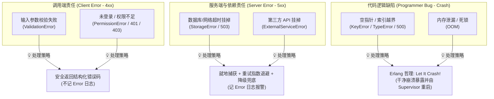
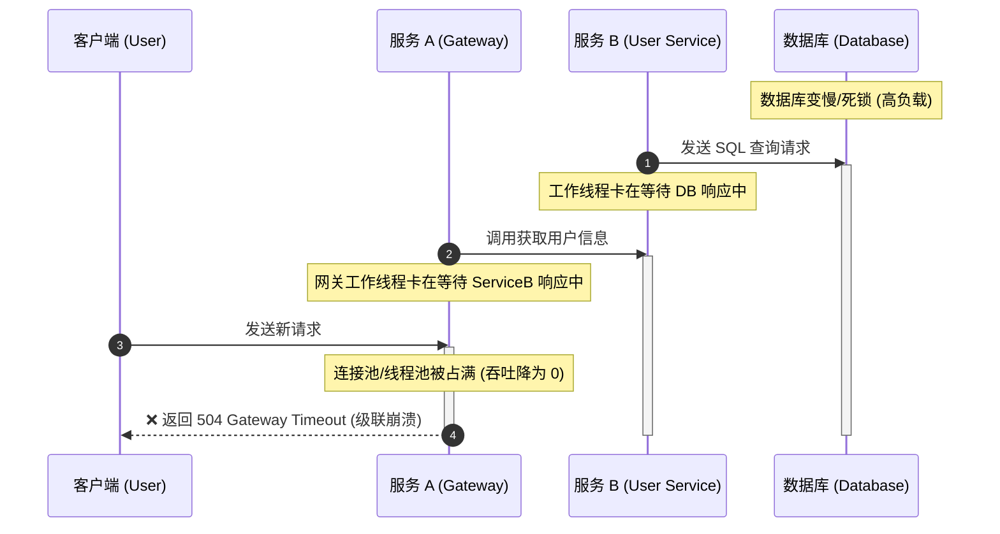
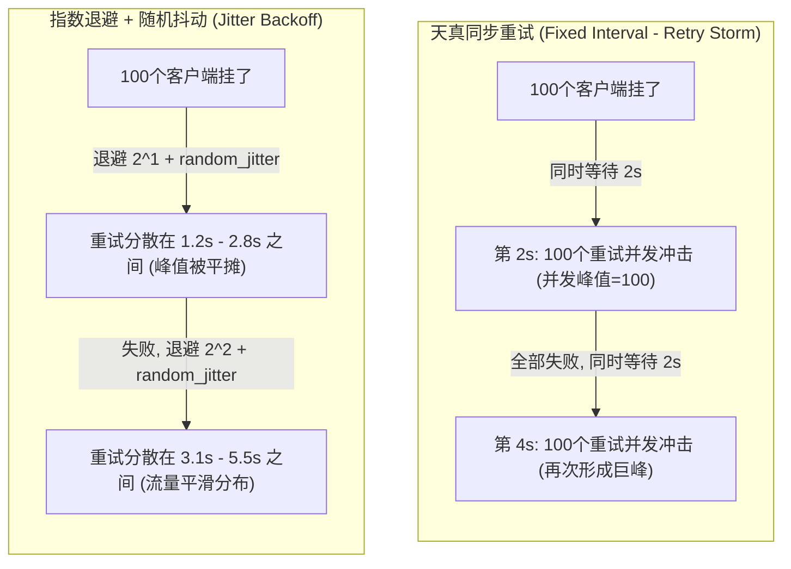

import GlossaryTerm from '@site/src/components/GlossaryTerm';
import GuidedExercise from '@site/src/components/GuidedExercise';
import ResearchNote from '@site/src/components/ResearchNote';
import ChapterMeta from '@site/src/components/ChapterMeta';
import PyRunner from '@site/src/components/PyRunner';
import TradeoffExplorer from '@site/src/components/TradeoffExplorer';
import QuizCard from '@site/src/components/QuizCard';

# L4 · 错误处理与异常设计

<ChapterMeta
  time="约 1.5–2 小时"
  prereqs={[{label: 'L3 输入校验', href: './input-validation'}]}
  outcome="一个能把各种异常分类、映射成“状态码 + 错误码 + 用户消息”的错误处理层，并知道什么时候该崩、什么时候该兜。"
  howToUse="先理解错误的三大类，再看怎么把异常翻译成调用方能懂的结构化错误，最后做 lab。"
/>

## 一、错误不是"意外"，而是系统的一部分

初学者写代码时，脑子里只有"成功的样子"。但在真实系统里，**失败和成功一样频繁、一样需要被设计**：用户填错、网络断、数据库满、第三方挂、代码有 bug……

更糟的是初学者处理错误的两个坏习惯：

```python
try:
    do_something()
except:
    pass            # 把错误吞掉，假装没发生——事故的温床
```

或者：

```python
except Exception as e:
    return str(e)   # 把内部错误细节直接抛给用户——泄露 + 体验差
```

> 这一课的目标：把"错误处理"从事后补丁，变成一开始就设计好的契约——**每种失败都有明确的分类、明确的传达方式、明确的责任归属。**

## 二、三个核心概念（分层）

### 基础：错误的三大类

不是所有错误都该被同样对待。先分清三类：

| 类别 | 谁的锅 | 例子 | 该怎么办 |
|---|---|---|---|
| 用户错误（client error） | 调用方 | 名字空、邮箱格式错 | 明确告诉对方哪里错（4xx） |
| 系统错误（server error） | 依赖/环境 | 数据库挂、超时 | 兜住、重试或降级（5xx），记日志 |
| 程序 bug（programmer error） | 你 | 空指针、数组越界 | 不要兜！让它崩，暴露出来去修 |



<GlossaryTerm term="Recoverable Error" definition="可预期、可处理的错误，比如输入非法、依赖暂时不可用。应当被显式捕获并转化为合理响应。">可恢复错误</GlossaryTerm> 要兜；而<GlossaryTerm term="Programmer Error" definition="代码逻辑缺陷导致的错误（如 KeyError、TypeError）。不应该用 try/except 掩盖，而应让它暴露、被修复。">程序 bug</GlossaryTerm> 不该兜——把 bug 藏进 `except: pass` 里，等于把"该修的问题"变成"找不到的幽灵"。

### 进阶：把错误翻译成结构化契约

调用方需要知道三件事：**HTTP 状态码**（机器判断）、**错误码**（程序分支）、**用户消息**（人能看懂）。把内部异常翻译成这样一个结构：

```json
{"status": 400, "code": "invalid_email", "message": "邮箱格式不正确"}
```

关键原则：
- **不要吞异常**：要么处理，要么让它往上传，绝不 `except: pass`。
- **不要泄露内部细节**：堆栈、SQL、文件路径只进日志，不进用户响应。
- **错误码是契约**：调用方会按 `code` 写分支逻辑，所以错误码要稳定、要有文档。

<ResearchNote
  title="把错误当作值来处理，而不是控制流的意外"
  source="Rob Pike, Errors are values (The Go Blog)"
  href="https://go.dev/blog/errors-are-values"
  insight="Go 的设计哲学：错误是普通的返回值，应当被显式检查和处理，而不是当成可以随手忽略的异常情况。这迫使开发者正视每一个失败路径。"
  application="无论你用异常还是返回值，核心是一样的：每个可能失败的调用，都要明确决定失败了怎么办。把失败路径当成一等公民，是可靠系统的分水岭。"
/>

### 深入（选学）：让它崩 vs 兜住它（Let It Crash）

什么时候该兜，什么时候该让它崩？Erlang 之父 Joe Armstrong 给了一个反直觉但极其深刻的答案：**对于程序 bug，与其写一堆防御代码假装能恢复，不如让这个进程干净地崩溃、然后由一个监督者（supervisor）把它重启到已知的良好状态。**

<ResearchNote
  title='Let it crash：用监督树代替到处兜底'
  source="Joe Armstrong (2003), Making reliable distributed systems in the presence of software errors"
  href="https://erlang.org/download/armstrong_thesis_2003.pdf"
  insight="Armstrong 论证：试图在每一处都捕获并恢复未知错误，会让代码充满无法测试的防御分支。更可靠的做法是隔离失败、让组件快速崩溃，由独立的监督者负责重启与恢复。"
  application="这套思想是 Erlang/OTP、Kubernetes 自愈、Actor 模型的根。它告诉你：可恢复错误就地兜，未知 bug 让它崩并在更高层恢复——而不是用 except: pass 把一切抹平。后面 Agent 的 guardrails、容器重启策略都是它的回声。"
/>

:::tip 真实案例：这套哲学撑起了数十亿用户
WhatsApp 正是用 Erlang 的"让它崩 + 监督树"，让几十个工程师扛住了数十亿用户。想看它怎么把这套思想做到极致，去 [案例库 · WhatsApp](../atlas/whatsapp)。
:::

## 三、跟我做一遍：异常 → 结构化错误

<PyRunner
  rows={26}
  expect="500"
  code={`# 领域异常：可预期、可恢复
class ValidationError(Exception):
    def __init__(self, code, message):
        super().__init__(message)
        self.code = code
        self.message = message

class StorageError(Exception):
    pass

# 错误处理层：把异常翻译成 {status, code, message}，并决定要不要记日志
def to_response(exc, log):
    if isinstance(exc, ValidationError):           # 用户错误 → 4xx
        return {"status": 400, "code": exc.code, "message": exc.message}
    if isinstance(exc, StorageError):              # 系统错误 → 5xx，记日志
        log.append({"level": "error", "kind": "storage", "detail": str(exc)})
        return {"status": 503, "code": "storage_unavailable", "message": "请稍后重试"}
    # 程序 bug → 不泄露细节给用户，但一定记日志
    log.append({"level": "critical", "kind": "bug", "detail": repr(exc)})
    return {"status": 500, "code": "internal_error", "message": "服务器开小差了"}

log = []
print(to_response(ValidationError("invalid_email", "邮箱格式不正确"), log))
print(to_response(StorageError("db connection refused"), log))
print(to_response(KeyError("user_id"), log))   # 模拟一个 bug
print("--- 日志（只有系统错误和 bug 进日志，用户错误不算事故）---")
for e in log:
    print(e)`}
/>

注意：用户错误（400）**没有进日志**——它不是事故，是日常。系统错误（503）和 bug（500）进了日志，因为它们需要你去看、去修。而且**没有任何一条把内部细节（`db connection refused`、`KeyError`）泄露到给用户的 message 里**。**试试**：再加一个 `PermissionError`，映射成 403。

## 四、动手 Lab（必做）

打开 `labs/month01/l4_errors/`：

```bash
python labs/month01/l4_errors/test_errors.py
```

补完 `errors.py` 的 `to_response`，让它正确分类四种情况（验证错误 / 存储错误 / 权限错误 / 未知 bug）并通过测试。

<GuidedExercise
  title="练习指引：写一个错误处理层"
  goal="练习错误分类、结构化传达、不吞不泄露，这是任何 API 的必备层。"
  hints={[
    '先按类型分支：每一类异常映射到不同的 status 和 code。',
    '用户错误（4xx）不进日志；系统错误和 bug（5xx）必须进日志。',
    '给用户的 message 永远是人话，绝不放堆栈、SQL、内部路径。',
    '未知异常要有兜底分支（500），但要把 repr(exc) 记进日志好排查。'
  ]}
  steps={[
    'TODO 1：ValidationError → status 400、code 用 exc.code、message 用 exc.message，不记日志。',
    'TODO 2：PermissionError → status 403、code forbidden。',
    'TODO 3：StorageError → status 503、code storage_unavailable，记 error 日志。',
    'TODO 4：其它任何异常 → status 500、code internal_error，记 critical 日志。',
    '跑测试，确认四类都对、且日志只在该记的时候记。'
  ]}
  checks={[
    '你能说出用户错误和系统错误为什么要用不同状态码。',
    '你能解释为什么用户错误不该进 error 日志（否则告警噪音淹没真事故）。',
    '你能确认给用户的 message 里没有任何内部细节。',
    '你能说出哪类错误应该让它崩而不是兜。'
  ]}
/>

## 架构师深潜（Staff+ 视角）

单机上一个 try/except 很简单。但在分布式系统里，**错误处理本身会变成新的故障源**——处理不当的重试和超时，是大规模事故最常见的放大器。这一节是真正区分"会写代码"和"能扛住线上"的地方。

### 1. 级联失败：一个慢服务怎么拖垮整个系统

服务 A 调 B，B 变慢了。A 的请求都卡在等 B 上，A 的线程/连接被占满，于是调用 A 的 C 也开始卡……慢，像多米诺骨牌一样**逆着调用链往上传**，最终整站瘫痪。这就是<GlossaryTerm term="Cascading Failure" definition="一个组件的故障或变慢，通过资源耗尽逐级传播，最终拖垮整个系统的连锁反应。">级联失败（Cascading Failure）</GlossaryTerm>。



<ResearchNote
  title="解决级联失败：超时、熔断、舱壁、降载"
  source="Google SRE Book, Addressing Cascading Failures"
  href="https://sre.google/sre-book/addressing-cascading-failures/"
  insight="Google SRE 系统总结了级联失败的成因（资源耗尽、重试放大）与对策：合理的超时、断路器（circuit breaker）、舱壁隔离（bulkhead）、优雅降级与主动降载（load shedding）。"
  application="这套词汇是架构师评审可靠性时的通用语言。核心思想：把故障“关在小盒子里”，不让它耗尽全局资源——这正是 L2 的边界思维 + L4 的失败思维的合体。"
/>

### 2. 重试是把双刃剑：重试风暴

直觉上"失败就重试"很合理。但当一个服务正因为过载而变慢时，所有客户端同时重试，等于**给一个快淹死的人再泼几桶水**——重试让负载翻几倍，把本可恢复的服务彻底打死。这叫重试风暴 / 重试放大。

正确的重试必须有三件套：**指数退避（exponential backoff）+ 抖动（jitter）+ 上限**，并且配合<GlossaryTerm term="Circuit Breaker" definition="断路器：当某依赖连续失败到阈值，就“跳闸”，一段时间内直接快速失败、不再调用它，给它喘息恢复的机会，之后再半开试探。">断路器</GlossaryTerm>，在依赖明显挂掉时干脆停止重试。




<ResearchNote
  title="超时、重试与带抖动的退避"
  source="Amazon Builders' Library: Timeouts, retries, and backoff with jitter"
  href="https://aws.amazon.com/builders-library/timeouts-retries-and-backoff-with-jitter/"
  insight="AWS 工程实践：没有抖动的指数退避会让所有客户端“同步”重试，制造周期性的负载尖峰；加入随机抖动能把重试摊平。重试还应配合超时预算和断路器，避免放大故障。"
  application="这是每个生产级客户端都该内建的模式。记住：重试不是“再试一次”那么简单，它是一个需要被设计的、有可能反噬的机制。"
/>

### 3. 超时预算：失败要快，不要拖

一个请求链路 A→B→C，如果 A 给 B 的超时是 10 秒、B 给 C 也是 10 秒，那 A 可能要等 20 秒才知道失败——用户早走了。架构师会做**超时预算分配**：整条链路总预算（比如 1 秒），逐层递减分配，越往里超时越短，**确保失败发生得足够快**，把资源尽早释放出来。

### 4. 决策框架：依赖失败时，到底怎么办？

<TradeoffExplorer
  title="一个依赖失败时的应对策略"
  dimensions={['用户体验', '系统保护', '数据正确性', '恢复速度', '实现复杂度']}
  options={[
    {
      name: '快速失败（fail fast）',
      scores: [2, 5, 5, 4, 5],
      note: '立刻返回错误，不等待、不重试。保护自己，但用户直接看到失败。',
      whenToUse: '依赖明显挂了、或这次操作对正确性要求极高（如支付）不能瞎兜时。'
    },
    {
      name: '重试（退避 + 抖动 + 上限）',
      scores: [4, 2, 4, 3, 3],
      note: '对"瞬时抖动"很有效，但对"过载/真宕机"会火上浇油。必须配断路器。',
      whenToUse: '失败大概率是瞬时的（网络抖动、偶发超时），且操作是幂等的（见 L6）。'
    },
    {
      name: '降级兜底（graceful degradation）',
      scores: [5, 4, 2, 5, 2],
      note: '依赖挂了就返回一个"够用"的结果（缓存旧值、默认推荐）。用户几乎无感。',
      whenToUse: '非核心功能、且"旧的/不完美的答案"比"报错"更好时（如推荐、个性化）。'
    },
    {
      name: '熔断（circuit breaker）',
      scores: [3, 5, 4, 5, 2],
      note: '连续失败就跳闸，一段时间内直接快速失败，给依赖恢复的机会。',
      whenToUse: '依赖可能持续不可用、且你想防止重试风暴、保护对方也保护自己时。'
    }
  ]}
/>

真实系统往往**组合使用**：重试（带退避抖动）+ 熔断 + 对非核心依赖降级，是绝大多数高可用服务的标配。

### 5. 生产事故复盘：重试把恢复中的服务又打死

某次数据库短暂抖动，所有应用层立即开始无退避地疯狂重试。数据库刚想缓过来，又被海量重试瞬间打满，于是反复"恢复→被打死→恢复"，故障从几秒被拖成几小时。事后修复：加指数退避 + 抖动 + 断路器，并给重试设全局上限。这就是为什么"会重试"远不如"会克制地重试"重要。

### 6. 架构师深问（给自己 30 分钟）

设计一个下单接口，它要依次调用：库存服务、支付服务、发邮件服务。

- 这三个依赖，分别该用上面四种策略里的哪一种？为什么？（提示：支付 vs 发邮件，对正确性的要求天差地别。）
- 给整条链路分配一个超时预算。
- 如果支付成功但发邮件失败，系统该怎么办？（这会牵出 L6 的幂等和最终一致——记下来。）

## 五、常见误解

- **"`except: pass` 先让它不报错，以后再说"**：这是在制造看不见的 bug。要么处理，要么让它往上传。
- **"把异常信息直接返回给前端最省事"**：泄露内部结构是安全风险，也是糟糕体验。
- **"所有错误都该被兜住，程序不能崩"**：程序 bug 该崩，崩了你才知道要修；该兜的是可预期的失败。
- **"错误码随便起"**：错误码是给调用方写分支用的契约，改它等于改 API。

## 六、章末自测

<QuizCard
  questions={[
    {
      q: '关于程序员引入的逻辑缺陷（Programmer Error，如 KeyError、TypeError），以下哪种处理方式最符合 Let It Crash 哲学？',
      options: [
        '写防御性的 try...except 兜住所有可能的逻辑异常，记录日志并返回空值继续运行。',
        '不就地捕获，允许进程/协程在该行直接崩溃（Crash），由外部的上层监控与自愈机制将组件重置到已知的良好状态，并在日志中暴露完整堆栈。',
        '修改运行时环境参数，使空指针和类型错误默认返回 0。'
      ],
      answer: 1,
      explain: 'Joe Armstrong 的 Let It Crash 哲学认为，试图捂住逻辑 bug 不仅会让代码充斥无意义的防御分支，还极易带着脏状态运行引发更严重的隐性破坏。快速崩溃并交由外部监督重启，是更稳妥的自愈模式。'
    },
    {
      q: '在微服务架构的级联失败（Cascading Failure）中，下游服务变慢会以何种方式逆着调用链往上传播拖垮整个系统？',
      options: [
        '因为下游服务的故障，导致上游的请求参数被自动修改。',
        '因为下游变慢，导致上游请求积压等待超时，从而迅速耗尽连接池、工作线程池或内存等物理资源，进而无法响应其它正常请求。',
        '因为底层网络交换机在检测到请求过载后会自动物理关机。'
      ],
      answer: 1,
      explain: '级联失败的物理诱因是“资源耗尽”。当底层依赖变慢，上游调用方的工作线程会因为等待而处于挂起状态。在高并发下，上游的线程池或连接池会在极短时间内被吃满，导致上游也跟着瘫痪。'
    },
    {
      q: '在分布式客户端的重试机制中，为什么“加入随机抖动（Jitter）的指数退避”是应对重试风暴的极佳手段？',
      options: [
        '因为如果不加入随机抖动，挂掉的客户端会在相同的退避周期结束后同步、齐步走般冲击服务端，造成周期性流量海啸；抖动可以将流量均匀摊平在时间轴上。',
        '因为加入抖动可以大幅缩短网络数据包物理上的往返时延（RTT）。',
        '因为抖动会修改重试的 payload 内容，规避防火墙的频控拦截。'
      ],
      answer: 0,
      explain: '简单的指数退避（如 2, 4, 8 秒）在大量客户端挂掉时，会导致它们在相同的时刻（退避期结束）同步发起重试，在时间轴上形成高耸的尖峰（重试风暴）。随机抖动打破了这种“同步共振”，把重试平摊到了一定区间内。'
    }
  ]}
/>

## 七、复盘问题

- 回看你写过的 try/except，有没有"吞掉"过错误？当时藏住了什么问题？
- 你的系统里，哪些失败属于"让它崩 + 上层重启"更合适，而不是就地兜底？

## 延伸阅读

- [Rob Pike, Errors are values (The Go Blog)](https://go.dev/blog/errors-are-values)
- [Joe Armstrong (2003), Making reliable distributed systems...](https://erlang.org/download/armstrong_thesis_2003.pdf)
- [Google SRE Book: Handling Overload](https://sre.google/sre-book/handling-overload/)
