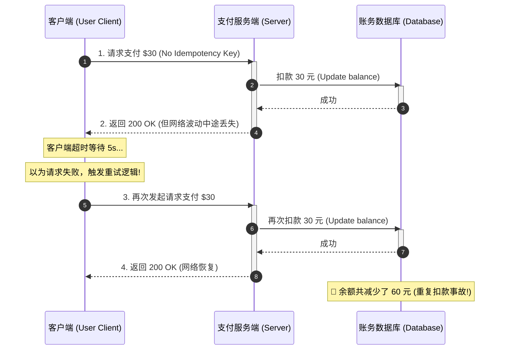
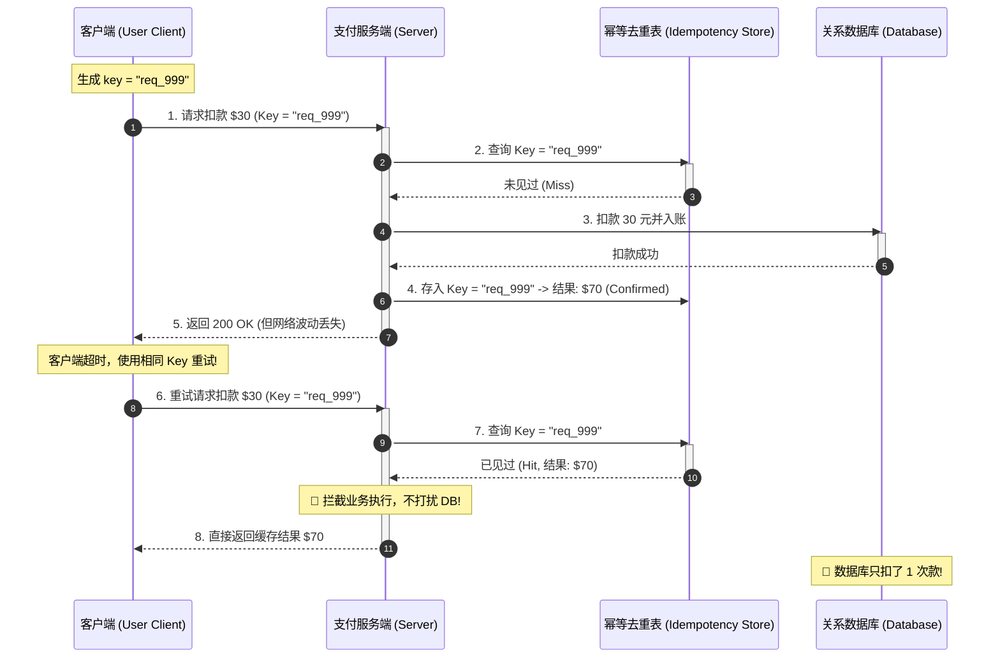

import GlossaryTerm from '@site/src/components/GlossaryTerm';
import GuidedExercise from '@site/src/components/GuidedExercise';
import ResearchNote from '@site/src/components/ResearchNote';
import ChapterMeta from '@site/src/components/ChapterMeta';
import PyRunner from '@site/src/components/PyRunner';
import TradeoffExplorer from '@site/src/components/TradeoffExplorer';
import QuizCard from '@site/src/components/QuizCard';

# L6 · 幂等性深入

<ChapterMeta
  time="约 1.5–2 小时"
  prereqs={[{label: 'L1（幂等初识）', href: './programming-systems-primer'}, {label: 'L4 错误处理与重试', href: './error-handling'}, {label: 'L5 状态放在哪里', href: './state-and-storage'}]}
  outcome="一个用 idempotency key 保护的支付处理器：无论客户端重试多少次，钱只扣一次。"
  howToUse="先跑那个“重试导致重复扣款”的演示，再学 idempotency key 怎么根治它，最后做 lab。"
/>

:::tip 这一课的铁律
在分布式系统里，**网络一定会超时、客户端一定会重试**。所以你的每个写操作都必须回答一个问题：如果它被执行了两次、三次，会出事吗？能做到"执行多次 == 执行一次"，就叫幂等。
:::

## 一、点一次按钮，扣两次钱

用户点"支付"，请求发出去了，服务端其实**已经扣款成功**，但返回的响应在网络上丢了。客户端等超时，以为失败，**自动重试**——于是又扣了一次。用户被扣了两次钱。



这不是小概率边缘情况。L4 教过：重试是应对瞬时故障的标准手段。但**重试 + 非幂等操作 = 重复执行**。L1 用"邮箱判重"碰过幂等，这一课我们把它做成一个通用、可靠的机制。

## 二、三个核心概念（分层）

### 基础：什么是幂等

<GlossaryTerm term="Idempotency" definition="幂等性：同一个操作执行一次和执行多次，对系统状态产生的效果相同。是安全重试的前提。">幂等性</GlossaryTerm> 指：同一操作做一次和做 N 次，结果一样。

有些操作**天然幂等**，有些不是：

| 操作 | 幂等吗 | 为什么 |
|---|---|---|
| 读取余额（GET） | ✅ | 读多少次都不改变状态 |
| 设置状态为"已支付"（PUT） | ✅ | 设几次结果都一样 |
| 删除订单（DELETE） | ✅ | 删了再删，还是没了 |
| 扣款 30 元（POST） | ❌ | 做两次就扣两次 |

HTTP 方法的语义就建立在这上面：GET/PUT/DELETE 被定义为幂等，POST 不是。**问题就出在 POST 这类"非幂等写操作"上。**

### 进阶：Idempotency Key——给非幂等操作套上幂等外壳

既然扣款本身不幂等，就给它**加一层去重**：客户端为每次操作生成一个唯一的 <GlossaryTerm term="Idempotency Key" definition="幂等键：客户端为一次操作生成的全局唯一 id，随请求一起发给服务端。服务端记录每个 key 的处理结果；再次见到同一 key 就直接返回上次结果，而不重复执行。">idempotency key</GlossaryTerm>，随请求带上。服务端：

1. 收到请求，先看这个 key **见过没有**。
2. 没见过：正常执行，把"key → 结果"存起来。
3. 见过：**直接返回上次的结果**，不再执行。

这样无论客户端重试多少次（用同一个 key），操作只真正发生一次。注意：这需要 [L5 的共享状态](./state-and-storage)——那个"见过的 key"表必须所有实例可见。



### 深入（选学）：exactly-once 是一种幻觉

很多人追求"消息恰好处理一次（<GlossaryTerm term="Exactly-once" definition="恰好一次投递：消息保证在端到端传输中只被传送且处理有且仅有一次，没有任何丢失或重复。在不可靠网络上纯粹依靠投递无法达成。">exactly-once</GlossaryTerm>）"。残酷的事实是：在会丢包、会重发的网络上，**端到端的 exactly-once 投递在理论上做不到**。你能做到的是：

- <GlossaryTerm term="At-least-once" definition="至少一次：消息保证被投递/处理至少一次，但可能重复。配合幂等消费，就能达到“效果上只生效一次”。">at-least-once</GlossaryTerm>（至少一次，可能重复）+ **幂等消费** ≈ 效果上只生效一次（effectively-once）。
- 这就是工业界的真实做法：**不追求"只投一次"，而是"允许重复投，但消费方幂等"。**

我们甚至连最基础的 <GlossaryTerm term="At-most-once" definition="至多一次：消息保证最多只被投递/处理一次。允许消息丢失，但绝不重复。适用于数据采样等低安全容忍度场景。">at-most-once</GlossaryTerm>（至多一次，可能丢失，不重试）与这两者的转换关系也可以用图解体现：

```mermaid
flowchart TD
  subgraph ExactlyOnceIdeal["理想的端到端 Exactly-Once 模式 (物理上恰好发送一次)"]
    direction LR
    Client1["发送端"] -->|理想无丢包网络| Server1["接收端 (物理上只收到1次)"]
    Server1 -->|执行逻辑| DB1["("DB: 变更 1 次")"]
  end

  subgraph EffectivelyOnceReal["现实的 Effectively-Once 模式 (物理上多次, 效果上一次)"]
    direction TB
    Client2["发送端"] -->|网络重发 (At-Least-Once)| Msg1["第1次投递 (Key=K)"]
    Client2 -->|网络重发 (At-Least-Once)| Msg2["第2次重发 (Key=K)"]
    
    subgraph ServerSide["接收端幂等消费过滤"]
      direction LR
      Msg1 --> Check1{"未见过 key K?"}
      Msg2 --> Check2{"已见过 key K?"}
      
      Check1 -->|Yes| Exec["真正执行逻辑并落盘DB"]
      Check2 -->|Yes| Cache["直接阻断, 返回上次结果"]
    end
    
    Exec --> DB2["("DB: 变更 1 次")"]
    Cache --> DB2
  end
```

<ResearchNote
  title="把幂等当作分布式系统的一等设计原则"
  source="Pat Helland (2007), Life Beyond Distributed Transactions"
  href="https://www.ics.uci.edu/~cs223/papers/cidr07p15.pdf"
  insight="Helland（亚马逊/微软分布式系统先驱）论证：在大规模系统里放弃分布式事务后，消息几乎必然会重复，因此『消息的接收方必须把操作设计成幂等的』成为系统正确性的基石。"
  application="这把幂等从“一个小技巧”提升为“架构正确性的必要条件”。任何跨网络的写操作，默认都要问：它幂等吗？不幂等就得加 idempotency key 或去重。"
/>

## 三、跟我做一遍：从重复扣款到只扣一次

### 坏例子：重试 = 重复扣款

<PyRunner
  expect="40"
  code={`balance = {"ada": 100}

def charge(user, amount):
    balance[user] -= amount          # 非幂等：每调用一次就扣一次
    return balance[user]

charge("ada", 30)        # 第一次扣款（成功，但响应在网络上丢了）
charge("ada", 30)        # 客户端超时后重试——又扣了一次！
print("余额:", balance["ada"])   # 40：扣了两次`}
/>

### 修好：用 idempotency key 去重

<PyRunner
  expect="70"
  code={`balance = {"ada": 100}
seen = {}                            # idempotency store：key -> 上次结果（需共享，见 L5）

def charge(user, amount, request_id):
    if request_id in seen:           # 见过这个 key：直接返回上次结果，不再扣款
        return seen[request_id]
    balance[user] -= amount          # 第一次：真正执行
    seen[request_id] = balance[user] # 记下结果
    return seen[request_id]

charge("ada", 30, "req-1")
charge("ada", 30, "req-1")           # 同一个 request_id 的重试：被去重
print("余额:", balance["ada"])        # 70：只扣了一次`}
/>

**试试**：把第二次调用的 `"req-1"` 改成 `"req-2"`（模拟用户发起的另一笔真实支付），看它正确地又扣了一次——幂等保护的是"重试"，不是"拦截所有重复金额"。

## 四、动手 Lab（必做）

打开 `labs/month01/l6_idempotency/`：

```bash
python labs/month01/l6_idempotency/test_payment.py
```

实现一个带 idempotency key 的 `process_payment`，让重试安全、不重复扣款。

<GuidedExercise
  title="练习指引：写一个幂等的支付处理器"
  goal="把『安全重试』这个分布式核心能力做进肌肉记忆：idempotency key + 去重存储。"
  hints={[
    '先查 key：见过就返回旧结果，连余额都别碰。',
    '只有 key 没见过时，才真正改余额，然后把结果存进 store。',
    '余额不足要先校验（回扣 L3），且校验失败也算一种"结果"，要不要缓存？想清楚。',
    '不同 request_id 是不同操作，必须各自执行。'
  ]}
  steps={[
    '实现 IdempotencyStore：seen(key) 判断是否见过，get(key)/put(key, result)。',
    '实现 process_payment(request_id, account, amount, balances, store)：',
    '  1) 若 store 见过 request_id，直接返回缓存结果；',
    '  2) 否则校验余额是否充足，扣款，构造结果 dict（含 status 和新余额）；',
    '  3) 把结果存进 store 再返回。',
    '写测试：同一 request_id 重试不二次扣款；不同 request_id 正常扣；余额不足被拒。',
    '跑到测试全过。'
  ]}
  checks={[
    '你能解释为什么 idempotency store 必须是共享的（L5）。',
    '你能说出哪些操作天然幂等、哪些需要 key 保护。',
    '你能说清 at-least-once + 幂等 为什么约等于 exactly-once。',
    '你能指出你的去重表如果无限增长会怎样（需要 TTL / 清理）。'
  ]}
/>

## 架构师深潜（Staff+ 视角）

### 1. 重试 + 幂等 = 可靠的一对

L4 说"要会重试"，L6 说"重试的前提是幂等"。这两课合起来才完整：**没有幂等的重试是事故放大器，有幂等的重试才是可靠性来源。** 任何跨网络的写操作，设计时都要成对考虑这两者。

### 2. 投递语义：你在和概率打交道

<TradeoffExplorer
  title="消息/请求的投递语义"
  dimensions={['不丢消息', '不重复', '实现复杂度', '吞吐/性能', '工程可行性']}
  options={[
    {
      name: 'At-most-once（至多一次）',
      scores: [1, 5, 5, 5, 5],
      note: '发了就不管，不重试。绝不重复，但可能丢。',
      whenToUse: '丢一两条无所谓的场景，如某些指标上报、日志采样。'
    },
    {
      name: 'At-least-once + 幂等消费',
      scores: [5, 4, 3, 4, 5],
      note: '保证不丢（会重发），靠消费方幂等去重达到"效果上一次"。工业界主流。',
      whenToUse: '支付、订单、几乎所有重要写操作。这是现实中最常用、最务实的组合。'
    },
    {
      name: 'Exactly-once（分布式事务）',
      scores: [5, 5, 1, 2, 2],
      note: '理论上最干净，但端到端代价极高、常有隐藏前提，纯粹的端到端 exactly-once 投递不可得。',
      whenToUse: '局部范围（如 Kafka 事务内）可近似实现；跨系统端到端时通常用上一种替代。'
    }
  ]}
/>

### 3. 真实案例：两个系统都靠幂等

- [Stripe](https://docs.stripe.com/api/idempotent_requests) 的支付 API 把 idempotency key 做成了公开契约：每个创建类请求都建议带 `Idempotency-Key` 头，服务端 24 小时内对同 key 返回同结果。
- [WhatsApp](../atlas/whatsapp.mdx) 的 store-and-forward 是 at-least-once 投递：网络抖动时消息可能重发，所以客户端要靠消息 id 去重，避免你看到两条一样的消息。

<ResearchNote
  title="幂等键：把安全重试做成 API 契约"
  source="Stripe API Reference: Idempotent Requests"
  href="https://docs.stripe.com/api/idempotent_requests"
  insight="Stripe 让客户端为每个请求附带唯一的 Idempotency-Key；服务端缓存该 key 的首个响应，并在一段时间内对相同 key 返回相同结果，从而让网络重试天然安全。"
  application="这是把幂等从“内部实现细节”上升为“对外契约”的范本。设计写 API 时，主动提供幂等键，是专业与业余的分水岭。"
/>

### 4. 去重表也是要扩展和清理的状态

那张"见过的 key"表本身就是 [L5 的共享状态](./state-and-storage)：它要所有实例可见（放 Redis/DB）、要设 TTL 防止无限膨胀、它的读写也要够快不拖慢主流程。幂等不是免费的，它把一部分复杂度转移到了状态层。

### 5. 架构师深问（给自己 30 分钟）

- 下单接口调用"扣库存 + 扣款 + 发货"三步，中间任一步失败后重试，怎么保证整体不重复执行？（提示：每步幂等 + 一个总的 request_id。）
- idempotency key 的去重窗口设多久？太短会怎样，太长又会怎样？
- 如果两个**带同一个 key** 的请求几乎同时到达（并发），你的去重还成立吗？（这把你引向 L8 的竞态条件。）

## 五、章末自测

<QuizCard
  questions={[
    {
      q: '在分布式支付系统中，用户点击“支付”按钮后网络超时，最安全且符合工程最佳实践的客户端重试策略是什么？',
      options: [
        '直接以相同参数发起重试，不需要任何额外字段。',
        '生成并携带一个全局唯一的幂等键（Idempotency Key）发起安全重试；服务端利用去重存储对该键进行防重，已执行过则直接返回缓存结果。',
        '停止任何重试，提示用户“网络已断，请到网点去查账确认”。'
      ],
      answer: 1,
      explain: '幂等键（Idempotency Key）是保障写操作在网络超时重试中不产生“重复扣款”的黄金法则。服务端对处理过的 key 必须予以缓存拦截，保障资金安全。'
    },
    {
      q: '关于物理投递层面绝对的“Exactly-Once（恰好一次投递）”与实际工程上的“Effectively-Once（效果上仅生效一次）”，以下哪项描述是客观正确的？',
      options: [
        '在存在丢包和网络延迟的现实分布式环境中，物理上的 Exactly-Once 投递从理论上是已经证伪不可行的；业界标准是通过 At-least-once（至少一次投递，会重发）加消费端幂等去重来模拟达成 Effectively-once。',
        '我们可以直接依赖底层的 TCP 协议来无条件实现应用层端到端的 Exactly-Once。',
        'At-least-once 投递已经天然杜绝了消息的重复接收，因此消费端无需做任何去重校验。'
      ],
      answer: 0,
      explain: '由于物理丢包和超时必须进行重试，必然会产生重复消息（At-least-once）。因此必须由接收端实现幂等（去重表）来保障执行逻辑“Effectively-Once”（效果上仅一次），这是最务实的大规模分布式架构原则。'
    },
    {
      q: '在高并发场景下，如果两笔携带“完全相同幂等键”的重试请求，几乎在同一毫秒内打到了服务器的两个无状态实例上，如何防止并发幂等击穿？',
      options: [
        '这不需要防范，因为去重数据库会自动合并重复的扣款命令。',
        '必须引入分布式锁或在数据库层面对幂等键添加唯一索引约束，将第一个请求置为“处理中（Processing）”，使第二个并发请求直接等待或快速失败，防止两个实例同时进入扣款写逻辑。',
        '直接拒绝这两个请求，要求客户端必须生成不同 key 再重试。'
      ],
      answer: 1,
      explain: '并发重试是极易被忽视的 Bug 来源。在没有行级锁或分布式锁保护的情况下，并发请求可能同时检测到“去重表未记录该 key”，从而双双绕过防线。因此必须使用原子锁（或唯一性物理约束）占位防止并发击穿。'
    }
  ]}
/>

## 自检清单

- [ ] 我能说出哪些操作天然幂等、哪些需要 idempotency key。
- [ ] 我的 lab 支付处理器在重试下只扣一次款。
- [ ] 我能解释为什么"端到端 exactly-once"是幻觉，工业界用什么替代。
- [ ] 我能说出去重表需要共享、TTL 和足够快。

## 常见误解

- **"重试就能解决问题"**：没有幂等的重试会重复执行，制造新事故。
- **"我们要做到 exactly-once"**：端到端做不到；现实是 at-least-once + 幂等。
- **"幂等是免费的"**：它需要一张共享、要清理、要够快的去重表。

## 延伸阅读

- [Stripe: Idempotent Requests](https://docs.stripe.com/api/idempotent_requests)
- [Pat Helland, Life Beyond Distributed Transactions](https://www.ics.uci.edu/~cs223/papers/cidr07p15.pdf)
- [AWS Builders' Library: Making retries safe with idempotent APIs](https://aws.amazon.com/builders-library/making-retries-safe-with-idempotent-APIs/)