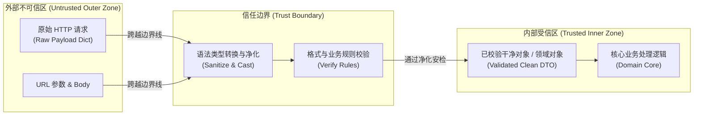
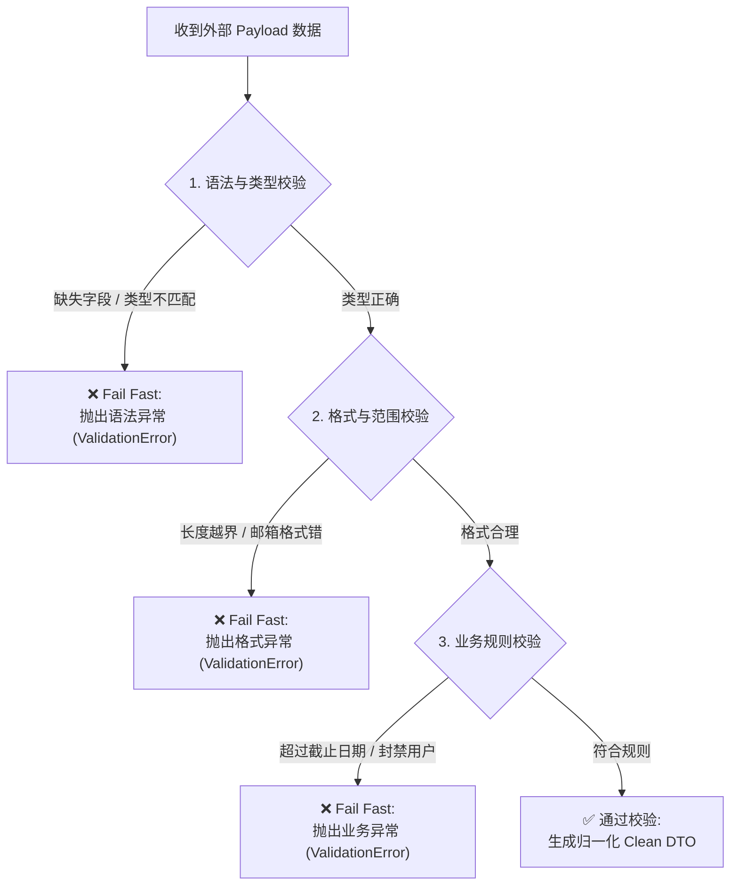
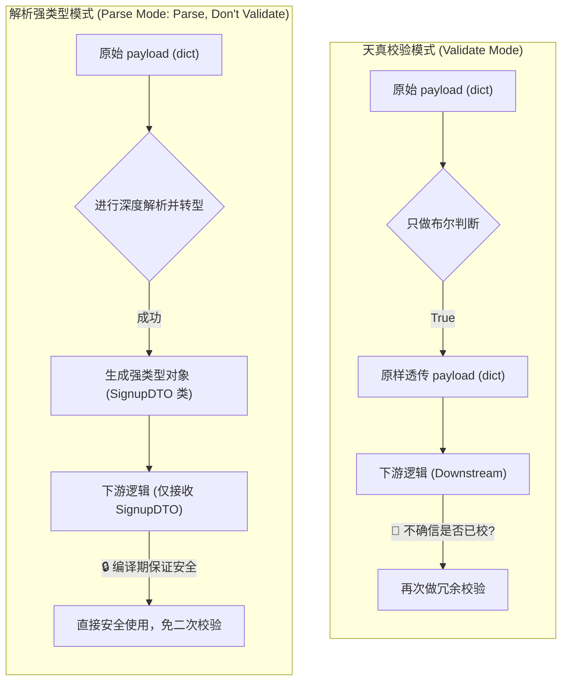

import GlossaryTerm from '@site/src/components/GlossaryTerm';
import GuidedExercise from '@site/src/components/GuidedExercise';
import ResearchNote from '@site/src/components/ResearchNote';
import ChapterMeta from '@site/src/components/ChapterMeta';
import PyRunner from '@site/src/components/PyRunner';
import TradeoffExplorer from '@site/src/components/TradeoffExplorer';
import QuizCard from '@site/src/components/QuizCard';

# L3 · 输入校验与防御性编程

<ChapterMeta
  time="约 1.5–2 小时"
  prereqs={[{label: 'L1 编程如何变成系统', href: './programming-systems-primer'}, {label: 'L2 模块与契约', href: './modules-and-contracts'}]}
  outcome="一个分三层（语法 / 格式 / 业务）校验报名输入的模块，并能说清“信任边界”在哪。"
  howToUse="先理解“为什么所有外部输入都不可信”，再练三层校验，最后做 lab 把校验写到测试全过。"
/>

## 一、永远不要相信用户的输入

L1 里我们加了"名字不能为空"。但真实世界的坏输入远不止这一种：

- 名字是 5000 个字符的乱码（想撑爆你的数据库）。
- 邮箱是 `' OR 1=1 --`（想做 SQL 注入）。
- 年龄填了 `-3` 或 `"abc"`。
- 报名人数字段传了 `999999999`。

这些输入大多不是恶意的（手抖、复制错、前端没拦住），但**只要有一个漏进系统，就可能变成事故**。这一课的核心信念只有一句：

> **凡是来自系统外部的数据，默认都是脏的、危险的，必须在边界上检查干净，才能放进来。**

## 二、三个核心概念（分层）

### 基础：信任边界（Trust Boundary）

**生活类比**：海关。无论你信不信任入境的人，行李都要过安检。安检线就是信任边界——线外是"不可信"，线内是"已检查"。

<GlossaryTerm term="Trust Boundary" definition="系统中“不可信的外部数据”与“已校验的内部数据”之间的分界线。所有跨越这条线的数据都必须被校验。">Trust Boundary（信任边界）</GlossaryTerm> 就是你的代码里那条"安检线"。HTTP 请求体、URL 参数、上传的文件、第三方 API 的返回——全都在线外，必须先过安检。



### 进阶：三层校验 + Fail Fast

把校验拆成由浅入深的三层，任何一层不过就立刻拒绝（<GlossaryTerm term="Fail Fast" definition="一旦发现输入不合法，立即停止并明确报错，而不是带着坏数据继续往下走。">Fail Fast（快速失败）</GlossaryTerm>）：

| 层 | 检查什么 | 例子 |
|---|---|---|
| 1. 语法/类型 | 字段在不在、类型对不对 | name 是字符串吗？age 是整数吗？ |
| 2. 格式/范围 | 值的形状和范围合不合理 | email 像不像邮箱？age 在 0–150 吗？name 长度 ≤ 100 吗？ |
| 3. 业务规则 | 符不符合业务约束 | 这个活动还没截止吗？这个邮箱没被封禁吗？ |



还有一个安全原则：**优先用白名单（允许什么）而不是黑名单（禁止什么）**。黑名单永远有漏网之鱼。

<ResearchNote
  title="输入校验是安全的第一道防线"
  source="OWASP Input Validation Cheat Sheet"
  href="https://cheatsheetseries.owasp.org/cheatsheets/Input_Validation_Cheat_Sheet.html"
  insight="OWASP 建议：对所有不可信输入做语法和语义校验，优先采用白名单（positive validation），并在数据进入系统的最早位置（边界）就完成校验。"
  application="注入、XSS、缓冲溢出等大量漏洞的根源都是信任了不该信任的输入。把校验放在信任边界上、用白名单，是性价比最高的防御。"
/>

### 深入（选学）：解析，而不是校验（Parse, Don't Validate）

普通校验是"检查一下，然后放行原始数据"。更强的做法是<GlossaryTerm term="Parse, Don't Validate" definition="把校验和转换成更强的类型合并：校验通过后，返回一个保证合法的新类型，而不是放行原始数据。这样“已校验”这个事实被编码进了类型里。">Parse, Don't Validate</GlossaryTerm>：校验的同时，把数据**转换成一个"保证合法"的新对象**。

比如：不要到处传 `email: str`（谁知道它校验过没有？），而是校验后返回一个 `Email` 对象。拿到 `Email` 类型，就等于拿到"已经合法"的证明——下游再也不用重复检查。

我们将这两种思维范式进行对比：



<ResearchNote
  title="让已校验成为一种类型"
  source="Alexis King, Parse, Don't Validate"
  href="https://lexi-lambda.github.io/blog/2019/11/05/parse-don-t-validate/"
  insight="与其反复校验同一份原始数据，不如在边界处一次性解析成一个携带合法性保证的类型。非法状态因此变得无法表示。"
  application="这把校验从一个容易被遗忘的步骤，变成了类型系统强制的约束。在大型系统里，这能消灭一整类忘了校验的 bug——也是后面强类型 API、DTO 设计的思想基础。"
/>

## 三、跟我做一遍：三层校验

<PyRunner
  rows={26}
  expect="all checks passed"
  code={`from datetime import date

class ValidationError(Exception):
    def __init__(self, field, message):
        super().__init__(f"{field}: {message}")
        self.field = field

def parse_signup(payload, deadline):
    # 第 1 层：语法/类型——字段在不在、类型对不对
    for field in ("name", "email", "age"):
        if field not in payload:
            raise ValidationError(field, "missing")
    if not isinstance(payload["name"], str):
        raise ValidationError("name", "must be string")
    if not isinstance(payload["age"], int):
        raise ValidationError("age", "must be int")

    name = payload["name"].strip()
    email = payload["email"].strip().lower()
    age = payload["age"]

    # 第 2 层：格式/范围
    if not (1 <= len(name) <= 100):
        raise ValidationError("name", "length 1-100")
    if "@" not in email or "." not in email.split("@")[-1]:
        raise ValidationError("email", "bad format")
    if not (0 < age < 150):
        raise ValidationError("age", "out of range")

    # 第 3 层：业务规则
    if date.today() > deadline:
        raise ValidationError("deadline", "registration closed")

    # Parse, don't validate：返回一个"保证合法"的干净对象
    return {"name": name, "email": email, "age": age}

deadline = date(2030, 1, 1)
print(parse_signup({"name": "Ada", "email": "ADA@x.com", "age": 30}, deadline))

# 逐个触发三层失败：
for bad in [
    {"name": "Ada", "email": "ada@x.com"},                 # 缺 age（第1层）
    {"name": "", "email": "ada@x.com", "age": 30},          # 名字空（第2层）
    {"name": "Ada", "email": "nope", "age": 30},            # 邮箱坏（第2层）
    {"name": "Ada", "email": "ada@x.com", "age": -3},       # 年龄越界（第2层）
]:
    try:
        parse_signup(bad, deadline)
    except ValidationError as e:
        print("rejected:", e)

print("all checks passed")`}
/>

**试试**：把 `deadline` 改成 `date(2020, 1, 1)`，看第 3 层业务规则把所有报名都拒掉。

## 四、动手 Lab（必做）

打开 `labs/month01/l3_validation/`：

```bash
python labs/month01/l3_validation/test_validate.py
```

先确认参考解 `pass`，再去补 `validate.py` 的 TODO（三层校验各一处），把 import 切到你自己的实现，跑到全过。

<GuidedExercise
  title="练习指引：写一个三层校验器"
  goal="把信任边界、三层校验、fail fast、返回干净对象变成肌肉记忆。"
  hints={[
    '三层顺序不能乱：先确认类型，才能安全地比较长度、范围。',
    '每个错误都要带上是哪个字段、为什么，否则调用方无法修正。',
    '校验通过后返回归一化的新对象（strip、lower），而不是原始 payload。',
    '业务规则（截止时间）依赖外部传入，不要在校验函数里写死 today。'
  ]}
  steps={[
    'TODO 1（第1层）：缺字段或类型不对，raise ValidationError(field, ...)。',
    'TODO 2（第2层）：name 长度、email 格式、age 范围。',
    'TODO 3（第3层）：超过 deadline 就拒绝。',
    '返回 name/email/age 的归一化干净对象。',
    '把 test 顶部 import 切到你的实现，跑到全过。'
  ]}
  checks={[
    '你能说出信任边界在这段代码的哪一行（函数入口）。',
    '你能解释为什么类型检查必须在范围检查之前。',
    '你能说明返回干净对象（parse）比放行原始数据（validate）好在哪。',
    '你的每个错误都能让调用方知道改哪个字段。'
  ]}
/>

## 架构师深潜（Staff+ 视角）

在单个函数里校验只是开始。当系统变成几十个互相调用的服务时，"在哪校验、校验几次、谁信任谁"本身就成了一个架构难题，而且直接决定系统的安全姿态。

### 1. 防御纵深（Defense in Depth）：不要只有一道墙

成熟系统不会只在最外层校验一次。它在**多个层次**都做校验：边缘网关（挡掉明显的垃圾和攻击）、每个服务的入口（不信任其它服务，"零信任"）、以及数据库约束（最后一道，唯一索引、非空、外键）。任何单层都可能被绕过或有 bug，所以关键约束要在多层冗余地强制。

### 2. 一个永恒的争论：宽进严出，还是严进？

<ResearchNote
  title="鲁棒性原则（Postel 定律）与它的反思"
  source="RFC 760 / 后续 IETF 对 robustness principle 的批评"
  href="https://datatracker.ietf.org/doc/html/draft-iab-protocol-maintenance"
  insight="Postel 定律说：发送时严格，接收时宽容（be conservative in what you send, liberal in what you accept）。它让早期互联网繁荣，但几十年后 IETF 指出：长期的“宽容接收”会让各种不合规实现固化下来，反而使协议无法演进、滋生安全漏洞。"
  application="对架构师的启示：宽容会积累技术债和攻击面。现代安全实践倾向“严格校验、明确拒绝”，用白名单和严格 schema，而不是猜测和容忍。把“该不该宽容”当成一个有意识的取舍，而不是默认。"
/>

### 3. 把校验变成自动化契约：Contract Testing

服务 A 调用服务 B，A 怎么知道 B 没偷偷改了字段把自己搞挂？答案是<GlossaryTerm term="Contract Testing" definition="消费者和提供者各自用一份共享的“契约”来测试：消费者验证“我需要的字段在”，提供者验证“我没破坏消费者依赖的契约”。Pact 是代表工具。">契约测试</GlossaryTerm>（如 Pact）：把"我依赖你的什么"写成机器可校验的契约，CI 里自动跑。这是把 L3 的"校验"和 L2 的"契约"在团队规模上自动化的产物。

### 4. 决策框架：到底在哪一层校验？

<TradeoffExplorer
  title="校验该放在系统的哪一层"
  dimensions={['安全性', '性能', '一致性', '演进成本', '实现复杂度']}
  options={[
    {
      name: '只在边缘网关校验一次',
      scores: [2, 5, 2, 3, 5],
      note: '所有校验集中在入口。内部服务彼此信任。快、简单。',
      whenToUse: '内部网络可信、服务少、对安全要求不极端时。但一旦内网被突破就全线失守。'
    },
    {
      name: '每个服务都校验（零信任）',
      scores: [5, 3, 4, 3, 3],
      note: '每个服务都不信任调用方，自己再校一遍。最安全，但有重复成本。',
      whenToUse: '多团队、对外暴露、合规要求高的系统。现代安全的默认姿态。'
    },
    {
      name: '共享 Schema Registry 统一定义',
      scores: [4, 4, 5, 5, 2],
      note: '把校验规则集中成一份 schema，各服务引用同一份。一致性和演进最好。',
      whenToUse: '服务多、数据格式需要统一演进（如事件驱动架构、Kafka + Avro）时。'
    }
  ]}
/>

### 5. 生产事故复盘：一个没校验的字段

经典的"批量赋值（mass assignment）"漏洞：后端直接把用户提交的 JSON 整个塞进数据模型，结果攻击者多传了一个 `"is_admin": true`，瞬间把自己提权成管理员。根因就是**没有用白名单明确"只接受这几个字段"**。这也是为什么"Parse, don't validate"——只取你明确要的字段、构造干净对象——不只是优雅，更是安全。

### 6. 架构师深问（给自己 30 分钟）

你在设计一个对外开放的公共 API，背后有 100 个内部微服务。

- 校验放在哪几层？每层各拦什么？画出来。
- 公共 API 的 schema 如何演进而不弄坏老客户端（向后兼容）？
- 如果某个内部服务被攻陷，你的校验策略能把损失限制在多大范围？

## 五、常见误解

- **"前端校验过了，后端就不用校验"**：前端校验是体验，后端校验是安全。攻击者可以绕过前端直接打你的 API。
- **"用黑名单过滤危险字符就行"**：黑名单总有漏网之鱼。优先白名单（只允许已知合法的）。
- **"校验越多越安全"**：校验应集中在信任边界一次做完，而不是每个函数都重复校验——那是 L2 的耦合问题。

## 六、章末自测

<QuizCard
  questions={[
    {
      q: '为什么“前端已做过输入校验，后端就完全不需要再校验”是极其致命的安全漏洞？',
      options: [
        '因为前端校验使用的 JavaScript 会严重拖慢客户端的渲染效率。',
        '因为前端运行在不可控的客户端，攻击者可以使用 Postman、curl 等工具绕过前端页面，直接伪造任意恶意的 payload 发往后端。',
        '因为后端校验使用的是多核服务器 CPU，其数据计算比浏览器更为精确。'
      ],
      answer: 1,
      explain: '前端校验（如 HTML5 表单或 JS 校验）是为了提升用户交互体验、避免不必要的网络开销。但一切客户端代码都是不可信的，防御性编程要求后端作为最后的信任边界，必须执行强制性的输入白名单校验。'
    },
    {
      q: '“Parse, don\'t validate（解析，而非仅仅校验）”这一思想的核心理念是什么？',
      options: [
        '在校验完输入数据后，原样透传原始的无约束 dict 字典，由下游业务函数自己承担安全性验证。',
        '在系统边界进行检查，校验通过后将原始数据解析并转换为一个“带有合法性强保证”的新类型对象，从而在类型系统上杜绝非法状态传递。',
        '把一切校验动作推迟到数据库层，直接依赖底层数据库的物理约束来报错。'
      ],
      answer: 1,
      explain: '普通的 validate 仅在执行瞬间进行真假判断，透传给下游的依然是无状态的原始类型（如 `str`），下游容易遗忘或进行冗余校验。而 parse 将数据转型为专属类型（如 `Email` 类），下游只要接收到该类型就无需任何二次校验，消灭了非法表示。'
    },
    {
      q: 'Postel 定律（鲁棒性原则）提倡“发送时严格，接收时宽容”。现代安全与微服务架构为何对“接收时宽容”持保留/批评态度？',
      options: [
        '因为试图去宽容和猜测畸形格式的意图，容易暴露出隐蔽的安全漏洞（如绕过校验），同时积累技术债，使得接口协议无法平滑演进。',
        '因为接收端的宽容会占用数倍的 CPU 资源，拖慢整体服务器响应耗时。',
        '因为接收时的宽容会导致网络传输中的数据包体积出现异常暴涨。'
      ],
      answer: 0,
      explain: '历史实践表明，“宽容接收”让许多不合规、不标准的实现得以在网络上蔓延并固化下来，导致协议难以演进。同时，猜测畸形输入可能造成逻辑漏洞。因此现代零信任安全更提倡“严格校验、不符即拒”。'
    }
  ]}
/>

## 七、复盘问题

- 你的系统里，外部数据有哪些入口？每个入口的信任边界画在哪？
- "Parse, don't validate"如果用上，能消灭你代码里哪一类重复检查？

## 延伸阅读

- [OWASP Input Validation Cheat Sheet](https://cheatsheetseries.owasp.org/cheatsheets/Input_Validation_Cheat_Sheet.html)
- [Alexis King, Parse, Don't Validate](https://lexi-lambda.github.io/blog/2019/11/05/parse-don-t-validate/)
- [Pydantic docs（用类型做校验的现代库）](https://docs.pydantic.dev/latest/)
