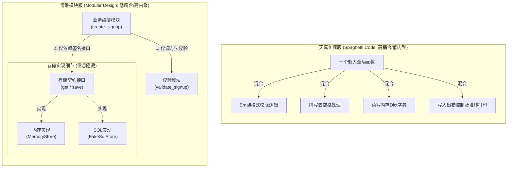
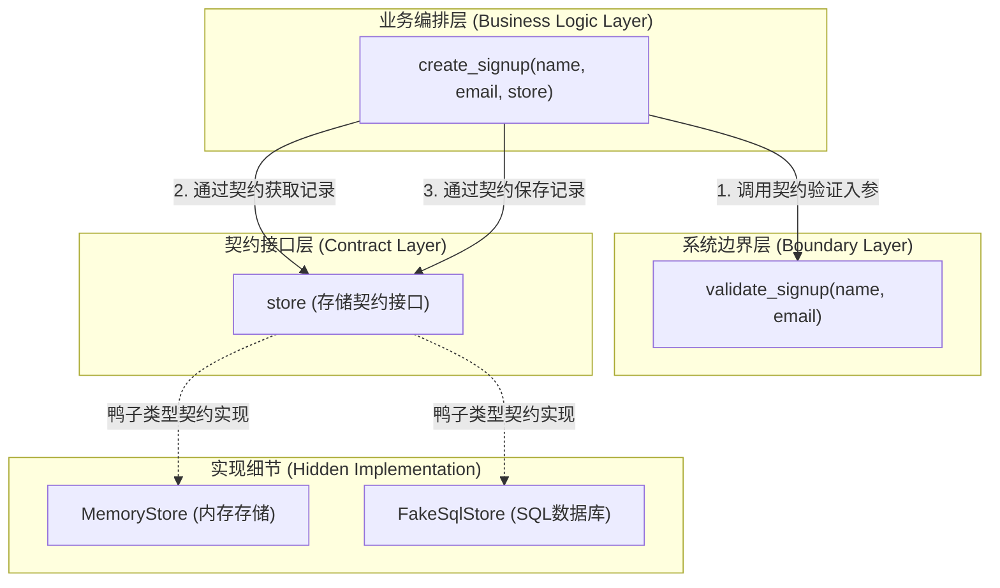
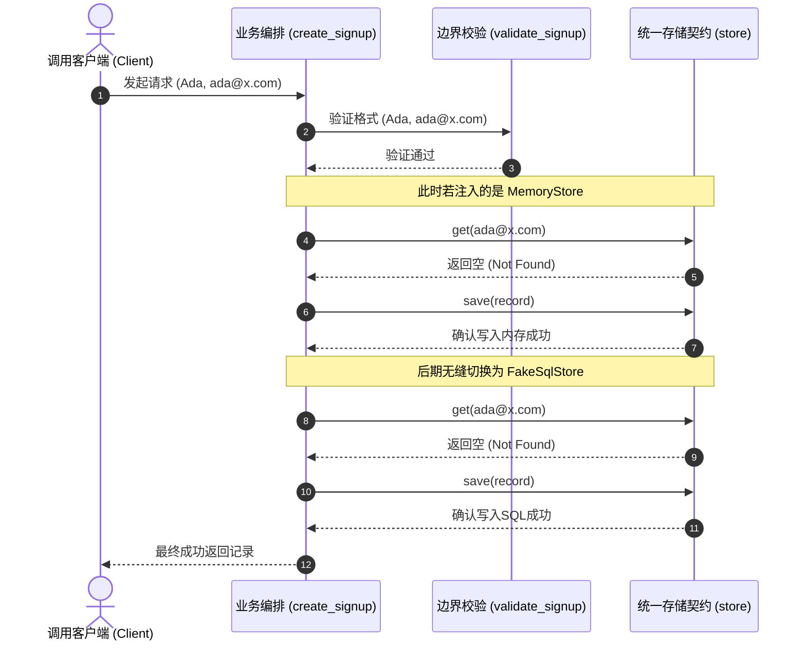

import GlossaryTerm from '@site/src/components/GlossaryTerm';
import GuidedExercise from '@site/src/components/GuidedExercise';
import ResearchNote from '@site/src/components/ResearchNote';
import ChapterMeta from '@site/src/components/ChapterMeta';
import PyRunner from '@site/src/components/PyRunner';
import TradeoffExplorer from '@site/src/components/TradeoffExplorer';
import QuizCard from '@site/src/components/QuizCard';

# L2 · 模块、契约与信息隐藏

<ChapterMeta
  time="约 1.5–2 小时"
  prereqs={[{label: 'L1 编程如何变成系统', href: './programming-systems-primer'}]}
  outcome="把一坨纠缠的代码拆成“校验 / 存储 / 业务”三个有明确契约的模块，并能在不碰其它模块的情况下替换存储实现。"
  howToUse="先看“纠缠版”为什么改不动，再跑“拆分版”体验替换存储的爽感，最后做重构练习。"
/>

## 一、一个让你"不敢改"的程序

L1 结束时，你的 `create_signup` 已经能校验、幂等、记日志了。现在来了两个真实需求：

1. 你的同学想**复用你的邮箱校验**，放到他自己的项目里。
2. 产品要求把数据从内存换成真正的数据库。

你打开代码，傻眼了：校验、查重、存储、日志全挤在**一个函数**里。同学想复用校验，得把整个函数连同数据库一起搬走；你想换数据库，又怕一不小心碰坏了校验逻辑。

> 这不是代码"写错了"，而是代码**没有边界**。这一课，我们学的就是怎么把一团代码，切成几块各管一摊、互不打扰的模块。

## 二、三个核心概念（分层）

在学习具体定义前，我们用图直观对比一下“意大利面条式乱麻依赖（高耦合/低内聚）”与“高内聚低耦合的清晰契约式设计”的区别：

### 基础：模块（Module）与契约（Contract）

**生活类比**：插座和插头。你买台灯时不用关心发电厂怎么发电，只要插头符合插座的"契约"（形状、电压），就能用。发电方式随便换，台灯照样亮。

<GlossaryTerm term="Module" definition="一段有单一职责、对外只通过明确接口暴露能力的代码单元。模块内部怎么实现，外部不需要知道。">Module（模块）</GlossaryTerm> 就是一块"各管一摊"的代码。模块之间靠 <GlossaryTerm term="Contract" definition="模块对外承诺的输入、输出和行为，通常体现为函数签名或接口。只要契约不变，内部实现可以随意替换。">Contract（契约）</GlossaryTerm> 通信——也就是"你给我什么、我还你什么"，而不是互相伸手进对方内部。

我们的报名功能其实有三个天然的职责：

- **校验模块**：判断输入合不合法。
- **存储模块**：把数据存起来、查出来。
- **业务模块**：把前两者编排起来完成"报名"。

### 进阶：耦合（Coupling）与内聚（Cohesion）

**精确定义**：
- <GlossaryTerm term="Coupling" definition="模块之间相互依赖的紧密程度。耦合越低，改一个模块越不会波及其它模块。">Coupling（耦合）</GlossaryTerm>：模块之间缠得有多紧。越松越好。
- <GlossaryTerm term="Cohesion" definition="一个模块内部的元素是否都在干同一件事。内聚越高，模块职责越单一、越好理解。">Cohesion（内聚）</GlossaryTerm>：一个模块内部是不是只干一件事。越高越好。

好的设计追求**高内聚、低耦合**：每个模块自己很专注，模块之间却很独立。纠缠版正好相反——一个函数干四件事（低内聚），换数据库会碰到校验（高耦合）。

<ResearchNote
  title="耦合与内聚：结构化设计的两把尺子"
  source="Stevens, Myers & Constantine (1974), Structured Design"
  href="https://ieeexplore.ieee.org/document/5388187"
  insight="这篇 IBM Systems Journal 论文最早系统提出用 coupling 和 cohesion 来度量模块划分的质量：模块之间应尽量松耦合，模块内部应尽量高内聚。"
  application="五十年过去，这两把尺子依然是判断这段代码该不该拆的核心标准。无论是微服务边界、还是 Agent 的工具划分，问的都是同一个问题：这块东西是不是只干一件事？它和别人缠得紧不紧？"
/>

### 深入（选学）：信息隐藏与隔离变化

**精确定义**：<GlossaryTerm term="Information Hiding" definition="把最可能变化的决定藏在模块内部，只通过稳定的接口对外暴露。这样变化被关在模块里，不会外溢。">Information Hiding（信息隐藏）</GlossaryTerm> 是 Parnas 的核心洞察：**模块的边界，应该沿着"最可能变化的地方"来切**。

存储方式（内存？SQLite？Postgres？）显然是最容易变的，所以应该把它藏在一个存储模块后面，业务模块只依赖一个稳定的契约（"给我存"、"帮我查"），完全不知道背后是内存还是数据库。这样换数据库时，变化被**关在存储模块内部**。

<ResearchNote
  title="沿着变化点切边界"
  source="D. Parnas (1972), On the Criteria To Be Used in Decomposing Systems into Modules"
  href="https://dl.acm.org/doi/10.1145/361598.361623"
  insight="Parnas 反对按执行步骤拆模块，主张按设计决定（尤其是易变的决定）拆：每个模块隐藏一个可能变化的决定。"
  application="这正是后来 Repository、Adapter、依赖倒置等模式的思想源头（Month 4 会深入）。现在你只需记住：把最容易变的东西，藏在最稳定的接口后面。"
/>

## 三、跟我做一遍：从纠缠到拆分

### 纠缠版：一个函数干四件事

<PyRunner
  rows={14}
  code={`# 纠缠版：校验 + 存储 + 业务全挤在一起
_db = {}

def create_signup(name, email):
    # 校验（混在里面）
    if not name.strip():
        raise ValueError("name required")
    # 存储（混在里面，写死了用内存 dict）
    if email in _db:
        return _db[email]
    record = {"name": name, "email": email}
    _db[email] = record
    return record

print(create_signup("Ada", "ada@x.com"))
# 问题：同学想单独用校验？做不到。想换数据库？得动这个函数，可能碰坏校验。`}
/>

### 拆分版：三个模块，各有契约

<PyRunner
  rows={22}
  expect="works with any store"
  code={`# 1) 校验模块：只负责判断合法性，可被任何项目复用
def validate_signup(name, email):
    if not name.strip():
        raise ValueError("name required")
    if "@" not in email:
        raise ValueError("email invalid")

# 2) 存储契约：业务只依赖 get/save 两个方法，不关心背后是什么
class MemoryStore:
    def __init__(self):
        self._data = {}
    def get(self, email):
        return self._data.get(email)
    def save(self, record):
        self._data[record["email"]] = record

# 想换数据库？只要新写一个有同样 get/save 的类即可，下面业务一行都不用改。
class FakeSqlStore:
    def __init__(self):
        self.rows = []
    def get(self, email):
        return next((r for r in self.rows if r["email"] == email), None)
    def save(self, record):
        self.rows.append(record)

# 3) 业务模块：只负责编排，依赖"契约"而不是"实现"
def create_signup(name, email, store):
    validate_signup(name, email)
    existing = store.get(email)
    if existing:
        return existing
    record = {"name": name, "email": email}
    store.save(record)
    return record

# 同一段业务逻辑，喂不同的存储实现，都能跑：
for store in (MemoryStore(), FakeSqlStore()):
    print(create_signup("Ada", "ada@x.com", store))
print("works with any store")`}
/>

注意拆分版的关键：业务函数 `create_signup` **依赖的是 `store.get / store.save` 这个契约**，而不是某个具体的数据库。这就是信息隐藏——存储怎么实现，被藏起来了。换数据库时，业务代码一行都不用改。**试试**：再写一个 `LoggingStore`，在 save 时打印一行日志，然后喂给同一个业务函数。

我们可以用图清晰勾勒这种契约编排的系统职责依赖关系：

无论是使用内存实现 `MemoryStore` 还是 SQL 关系库实现 `FakeSqlStore`，底层的替换完全由契约驱动，对上层业务流向没有半分影响：

## 四、轮到你：把 L1 的 signup 拆成模块

<GuidedExercise
  title="练习指引：重构成高内聚、低耦合的三模块"
  goal="练习按职责切边界和依赖契约而非实现。这是你以后能看懂微服务、Repository、依赖注入的根。"
  hints={[
    '先问：这段代码里有几件不一样的事？校验、存储、编排是三件事。',
    '存储模块只暴露 get 和 save 两个方法，业务不许直接碰它内部的 dict。',
    '判断拆得好不好：能不能在不改业务函数的前提下，换掉存储实现？',
    '能不能把校验函数单独 import 到另一个文件里用？能，就说明它解耦了。'
  ]}
  steps={[
    '把校验抽成独立函数 validate_signup(name, email)。',
    '定义一个 MemoryStore 类，只有 get(email) 和 save(record)。',
    '让 create_signup(name, email, store) 只做编排：校验 → 查重 → 存。',
    '再写一个 FakeSqlStore，有同样的 get/save，喂给同一个业务函数验证。',
    '思考：如果要加存储失败重试，应该改哪个模块？（答案：只改 store，不碰业务和校验。）'
  ]}
  checks={[
    '你能说出每个模块的契约是什么（输入输出）。',
    '你能在不改业务函数的情况下替换存储实现。',
    '你能指出哪个模块隐藏了最容易变化的决定（存储）。',
    '你能解释为什么纠缠版不敢改，而拆分版敢改。'
  ]}
/>

## 架构师深潜（Staff+ 视角）

"把代码拆成模块"听起来像小事。但在硅谷，**画错模块边界是导致整个系统失败的头号架构原因**。函数级的边界判断，放大到服务级、团队级，就是架构师每天在做的最重的决定。

### 1. 边界一旦跨进程，代价差 5 个数量级

L1 的延迟表在这里第二次发威：两个模块如果在**同一个进程**里调用，是一次函数调用（~纳秒）；一旦你把它们拆成两个**服务**，每次调用就变成一次网络往返（~毫秒，慢百万倍）。所以"该不该拆成两个服务"从来不只是代码整洁问题——**拆错了，你会用海量网络调用把系统拖死**（这就是臭名昭著的"分布式单体"：拆了服务，却互相疯狂调用，集齐了分布式的所有缺点和单体的所有缺点）。

### 2. 组织决定架构：Conway 定律

<ResearchNote
  title="你的系统结构，会长成你的组织结构"
  source="Melvin Conway (1968), How Do Committees Invent?"
  href="https://www.melconway.com/Home/Committees_Paper.html"
  insight="Conway 定律：系统的接口结构，会不可避免地复制设计它的组织的沟通结构。三个团队做编译器，就会做出三趟（three-pass）编译器。"
  application="这意味着模块/服务边界不能只看技术，还要看团队。现代做法甚至反过来用它——“逆 Conway 操作”：先按你想要的架构来组织团队。划服务边界时，先问“哪些东西会一起变、由谁负责”。"
/>

划边界的现代主流方法是**领域驱动设计（DDD）的 Bounded Context（限界上下文）**：按业务语言的边界切，而不是按技术分层切。"报名"、"支付"、"通知"各是一个上下文，每个内部自洽，之间用明确契约通信。

### 3. 契约的暗面：Hyrum 定律

<ResearchNote
  title="只要接口有足够多用户，你承诺的一切都会成为依赖"
  source="Hyrum's Law (Hyrum Wright / Google, Software Engineering at Google)"
  href="https://www.hyrumslaw.com/"
  insight="Hyrum 定律：当一个 API 有足够多的使用者，你在契约里承诺什么已经不重要了——你所有可被观察到的行为（哪怕是 bug、是返回顺序、是耗时）都会被某个人依赖。"
  application="这是“信息隐藏”的现实主义补充：你藏得越少，未来越被绑死。所以契约要刻意做小、做严，把实现细节真正藏住——否则有一天你想改内部，会发现全世界都在依赖你没打算承诺的东西。"
/>

### 4. 决策框架：拆到多细？

<TradeoffExplorer
  title="校验/存储/业务该拆到什么粒度"
  dimensions={['部署独立性', '性能', '运维复杂度', '团队自治', '一致性保证']}
  options={[
    {
      name: '单一函数（不拆）',
      scores: [1, 5, 5, 1, 5],
      note: '全部挤在一起。最快、最简单，但谁都不能独立改、独立复用。',
      whenToUse: '原型、脚本、一次性任务。先证明想法，别过度设计。'
    },
    {
      name: '模块化单体（拆模块，同一进程）',
      scores: [2, 5, 4, 3, 5],
      note: '拆成清晰模块但仍跑在一个进程里。调用是函数级（极快），又有边界。',
      whenToUse: '绝大多数系统的最佳起点。先把边界画清楚，等真有扩展/团队压力再拆服务。'
    },
    {
      name: '微服务（拆进程）',
      scores: [5, 2, 1, 5, 2],
      note: '每个上下文独立部署、独立扩展、独立团队。但调用变网络、一致性变难、运维变重。',
      whenToUse: '组织和规模都到了、且边界已经被验证稳定时。过早微服务化是经典陷阱。'
    }
  ]}
/>

注意"模块化单体"那一行——这是近年硅谷的主流共识：**先做边界清晰的单体，把拆服务推迟到你真正需要、且边界已经稳定的时候。**

### 5. 生产事故复盘：错误的边界

某团队过早把一个还在剧烈变化的业务拆成了 8 个微服务。结果每加一个字段要改 5 个服务、协调 3 个团队、发 5 次版本，还经常因为契约不同步在线上炸。这就是"边界画在了高频变化点上"——和 Parnas 的教诲正好相反。最后他们把 8 个合回 2 个，开发速度立刻恢复。

### 6. 架构师深问（给自己 30 分钟）

你要设计一个电商系统，已知有这些能力：商品、库存、下单、支付、物流、评价、推荐。

- 你会把它们划成几个 Bounded Context？哪些该合、哪些该分？说出依据（一起变？一致性要求？团队？）。
- 哪两个之间的契约最关键、最该刻意做小？
- 用 Conway 定律反推：你会怎么组织团队来匹配这个架构？

## 五、常见误解

- **"拆模块就是多写几个文件"**：拆的标准是职责和变化点，不是文件数。为拆而拆会制造无谓的复杂度。
- **"接口/契约是大项目才需要的"**：哪怕两个函数之间，约定好"你给我什么、我还你什么"就是契约。它让协作和替换成为可能。
- **"耦合低就是好"**：过度解耦（处处抽象）也是病。目标是让**变化**容易，不是抽象本身。

## 六、章末自测

<QuizCard
  questions={[
    {
      q: '关于“高内聚、低耦合（High Cohesion, Low Coupling）”，以下哪种理解是最准确的？',
      options: [
        '高内聚意味着模块内应该包含尽可能多的不同业务逻辑，低耦合意味着使用指针调用以减少依赖。',
        '高内聚指模块内部元素高度专注于单一职责，低耦合指模块之间依赖度低，使得单个模块的变化不容易外溢波及其他模块。',
        '为了绝对解耦，系统内所有模块都不允许互相调用，完全通过全局变量共享状态。'
      ],
      answer: 1,
      explain: '“高内聚”意味着“一个模块只做好一件事”，其代码集中且紧凑；“低耦合”意味着“不同模块之间的关联尽可能简单”，模块间只通过清晰契约通信。这极大地提升了系统的可读性、可测试性和局部修改安全性。'
    },
    {
      q: 'Parnas 在 1972 年关于信息隐藏（Information Hiding）的经典论文中，指出系统设计划分模块的最佳切入点是什么？',
      options: [
        '按照程序的物理执行顺序或时间步骤来切分模块。',
        '按照最容易发生变化的“设计决定”或“技术细节”（如存储介质、校验规则）来划分边界，将容易变的部分隐藏在稳定接口后面。',
        '把所有的代码写在一个文件里，通过多层嵌套类来实现形式上的隐藏。'
      ],
      answer: 1,
      explain: 'Parnas 的核心洞察是“沿着变化点切边界”。如果一个技术决定（例如是否使用持久化、使用哪种数据库）很可能会在未来被修改，就应该用一个稳定的契约接口屏蔽其内部实现，使改变被隔离在单个模块内部，而不影响调用方的业务层。'
    },
    {
      q: '当两个模块被拆分到两个不同的微服务中运行，对比同一个进程内模块调用，会带来什么架构取舍？',
      options: [
        '拆分成微服务后，部署独立性大幅提高，但同时原本的函数内调用变成了网络跨进程通信，延迟将增加几个数量级，同时引入分布式一致性挑战。',
        '拆分成微服务会降低运维复杂度，并同时成倍提升本地调用的性能。',
        '拆分成微服务后，系统内部将自然杜绝一切网络超时故障。'
      ],
      answer: 0,
      explain: '微服务（拆分进程）带来团队自治与独立部署的收益，但网络跨进程通信通常比同一进程内的本地函数调用慢 10 万倍以上。因此如果把紧密耦合（频繁交互）的模块强行拆为独立微服务，不仅严重损害吞吐，还会因不合理的分布式边界演变成难以维护的“分布式单体”。'
    }
  ]}
/>

## 七、复盘问题

- 你过去写的代码里，有没有"改一处、坏三处"的经历？用耦合/内聚解释它。
- 如果存储、校验、业务都各自是一个模块，哪个模块未来最常变？（这决定了你该把哪个藏在最稳定的接口后面。）

## 延伸阅读

- [D. Parnas (1972), On the Criteria To Be Used in Decomposing Systems into Modules](https://dl.acm.org/doi/10.1145/361598.361623)
- [Stevens, Myers & Constantine (1974), Structured Design](https://ieeexplore.ieee.org/document/5388187)
- [Martin Fowler, Repository pattern](https://martinfowler.com/eaaCatalog/repository.html)
