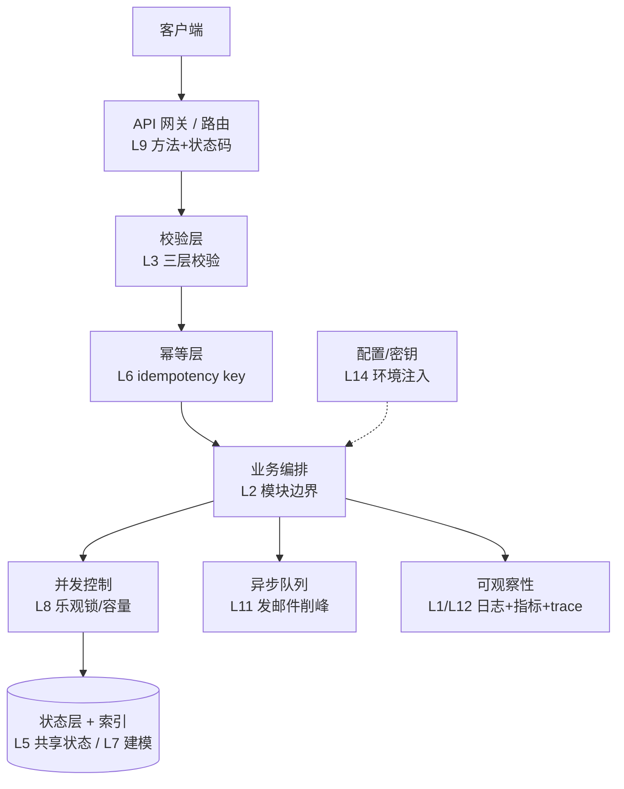

import GlossaryTerm from '@site/src/components/GlossaryTerm';
import GuidedExercise from '@site/src/components/GuidedExercise';
import ResearchNote from '@site/src/components/ResearchNote';
import ChapterMeta from '@site/src/components/ChapterMeta';
import PyRunner from '@site/src/components/PyRunner';

# L16 · 月末 Capstone：把 15 节课合成一个系统

<ChapterMeta
  time="约 6–10 小时（整周项目）"
  prereqs={[{label: 'Month 1 总览', href: './overview'}, {label: 'L1–L15 全部', href: './programming-systems-primer'}]}
  outcome="一个集成了校验、状态、幂等、并发安全、API、可观察性、测试、配置、性能预算的报名服务，外加一份架构决策记录（ADR）——你 Month 1 的作品集证据。"
  howToUse="这不是新知识，而是综合。按下面的构建顺序把前 15 课接起来，做完 capstone lab，并写一份 ADR。"
/>

:::tip 这一个月的"毕业作品"
前 15 节课每节都解决一个局部问题。Capstone 要你把它们**装进同一个系统**——因为真实架构的难点，恰恰在于这些关注点如何协同、如何取舍。做完它，你就有了第一份能拿出手的 AI Architect 作品集证据。
:::

## 一、项目目标

把贯穿全月的"活动报名"做成一个**生产级的小服务**：它要能扛住坏输入、重复请求、并发抢名额、依赖失败，并且可被观测、可被测试、可被配置部署、有明确的性能目标。

### 需求清单（每条都对应前面的课）

| 需求 | 来自 |
|---|---|
| 对外是 REST API，状态码正确 | L9 |
| 输入三层校验，坏数据挡在门外 | L3 |
| 错误分类，不吞不泄露 | L4 |
| 状态外移、服务无状态可扩展 | L5 |
| 重复提交安全（idempotency key） | L6 |
| 按查询建模 + 唯一约束 | L7 |
| 抢名额并发安全，不超卖 | L8 |
| 每步结构化日志 + 能算 RED 指标 | L1, L12 |
| 慢任务（发确认邮件）异步化 | L11 |
| 配置与代码分离、密钥外置 | L14 |
| 有测试金字塔（至少单元 + 集成） | L13 |
| 定义 p99 延迟 SLO 并能说明瓶颈 | L10, L15 |

## 二、目标架构（一张图看全月）



每一层你都已经单独练过；Capstone 就是把它们接成一条完整的请求处理流水线。

## 三、构建顺序（先骨架，再逐层加固）

不要一次写完。像真实项目一样，**先让最小版本跑通，再一层层加固**（这正是 [WhatsApp 的演进哲学](../atlas/whatsapp.mdx)：先做对一件事，再被需求逼着升级）：

1. 先写能创建报名的最小 `register()`（L1 骨架）。
2. 加三层校验，挡住坏输入（L3）。
3. 加错误分类与结构化日志（L4 + L12）。
4. 加邮箱唯一 + 按查询索引（L7）。
5. 加 idempotency key，重复请求安全（L6）。
6. 加名额上限 + 并发安全（L8）。
7. 把"发确认邮件"异步入队（L11）。
8. 抽出配置（容量、SLO）到外部注入（L14）。
9. 全程补测试（L13），跑到全绿。
10. 算一次 RED 指标、定 p99 SLO（L12 + L15）。

## 四、动手 Capstone Lab（必做）

打开 `labs/month01/l16_capstone/`：

```bash
python labs/month01/l16_capstone/test_signup_service.py
```

实现一个 `SignupService`，集成校验、幂等、邮箱去重、名额上限、结构化日志。这是本月最综合的一题。

<GuidedExercise
  title="练习指引：把全月能力装进一个服务"
  goal="证明你能让多个关注点正确协同——这正是架构师区别于“会写功能”的地方。"
  hints={[
    '处理顺序很重要：先幂等（见过直接返回）→ 再校验 → 再去重/容量 → 再创建。',
    '每条出口（成功/各种拒绝）都要：写进幂等表 + 打一条结构化日志。',
    '名额满、邮箱重复、输入非法是三种不同结果，状态码/原因要分清（L4）。',
    '日志里要能事后算出 created 数、rejected 数（L12 的 RED 雏形）。'
  ]}
  steps={[
    'SignupService(capacity)：维护 by_email（状态+索引）、seen（幂等表）、log。',
    'register(request_id, name, email)：见过 request_id 直接返回缓存结果。',
    '校验 name/email（L3）；非法则记录并返回 rejected（结果也要进幂等表）。',
    '邮箱已存在 → 返回已有记录（去重）；名额已满 → rejected full。',
    '否则创建记录、写日志 created、缓存结果、返回 ok。',
    '跑测试到全过，并思考：如果换成真数据库 + Redis，哪些部分要改（应该只有 store）。'
  ]}
  checks={[
    '同一 request_id 多次调用结果一致、只创建一次。',
    '坏输入、重复邮箱、名额满分别得到正确且不同的响应。',
    '从 log 能算出成功/拒绝数量（RED 指标）。',
    '你能指出这个服务里 L1–L15 各自体现在哪一行。'
  ]}
/>

## 五、写一份架构决策记录（ADR）

代码之外，架构师的核心产出是**讲清楚为什么这么设计**。用 <GlossaryTerm term="ADR" definition="架构决策记录：一份简短文档，记录某个重要技术决策的背景、被考虑的选项、最终选择及其理由和后果。让决策可追溯、可复盘。">ADR（Architecture Decision Record）</GlossaryTerm> 给你的 capstone 写至少一条决策记录：

```markdown
# ADR-001: 用乐观锁而非悲观锁控制名额并发

## 背景
活动开抢瞬间会有大量并发请求抢有限名额，需防止超卖。

## 选项
1. 悲观锁：每次抢名额先加锁。简单但并发低。
2. 乐观锁（版本号）：不加锁，提交时校验版本。并发高，冲突时重试。
3. 原子扣减：用一条原子操作。最简单，但表达力有限。

## 决策
选乐观锁（L8），因为冲突在多数时段并不频繁，乐观锁吞吐更高、无死锁。

## 后果
- 好：高并发下吞吐好，无死锁。
- 代价：开抢瞬间冲突激增时，重试会变多，需配合限流/排队（L11）。
- 未解决：极端秒杀场景是否要切换到排队串行，待压测后定。
```

## 六、自评 Rubric（对照打分）

给自己的 capstone 打分（每项回扣对应课）：

- [ ] **正确性**：坏输入/重复/并发/名额满都有正确且可区分的响应（L3/L4/L6/L8）。
- [ ] **可扩展**：业务逻辑无状态，状态在可替换的 store 里（L5）。
- [ ] **可观察**：每条路径有结构化日志，能算 RED（L1/L12）。
- [ ] **可测试**：测试覆盖正常 + 各种失败路径，全绿（L13）。
- [ ] **可部署**：配置与密钥外置（L14）。
- [ ] **有性能意识**：能说出 p99 目标和最可能的瓶颈（L10/L15）。
- [ ] **能解释**：有一份 ADR 讲清一个关键取舍。

## 架构师深潜（Staff+ 视角）

### 1. 真正的难点是"协同"，不是单点

你会发现把各关注点接起来时冒出新问题：幂等表也是状态（要不要也外移？）、缓存拒绝结果对不对、异步发邮件失败了怎么和"已返回成功"对账（最终一致）。**这些"接缝处"的问题，才是架构师的主战场。** 单独每节课都简单，合起来才见功力。

### 2. 和真实系统对照

把你的设计和案例库对照着看：你的"无状态服务 + 共享状态"在 [WhatsApp](../atlas/whatsapp.mdx) 是什么样？你的"队列削峰"在 [ChatGPT](../atlas/chatgpt.mdx) 是什么样？**同样的原则，在不同规模/约束下长出不同的架构**——这种对照，是把课程知识升华成架构判断力的关键。

<ResearchNote
  title="架构决策要被记录下来"
  source="Michael Nygard, Documenting Architecture Decisions（ADR）"
  href="https://cognitect.com/blog/2011/11/15/documenting-architecture-decisions"
  insight="Nygard 提出用轻量的 ADR 记录每个重要架构决策的背景、选项、决定与后果。它让“为什么这么做”可追溯，避免后人推翻决策却不知当初的约束。"
  application="架构师的价值很大程度上体现在“讲清取舍”上。ADR 是把脑子里的判断变成团队资产的标准方式——你的作品集里应当有它。"
/>

### 3. 这就是你的作品集第一块砖

一个跑通的服务 + 一张架构图 + 一份 ADR + 一套测试，已经是一份能在面试里讲半小时的材料。后面每个月的产出都这样积累，到 Month 12 就是完整的 AI Architect 作品集。

### 4. 架构师深问（给自己 60 分钟）

- 把你的 capstone 当面试题，对着架构图讲一遍：需求→约束→设计→取舍→风险。录下来，听听哪里讲不清。
- 如果用户量 ×1000，你的设计哪一层最先撑不住？怎么改（回扣 L5/L7/L8/L10）？
- 选一个你做的取舍，写成 ADR，并诚实写下"未解决的问题"。

## 恭喜你完成 Month 1

你已经能把"一段能跑的代码"变成"一个扛得住真实世界、可扩展、可观察、可部署、可解释的系统"。这正是系统设计的入口能力。

**下一步**：进入 Month 2（系统设计桥梁：HLD/LLD、需求澄清、容量估算），开始画更大的系统图。也别忘了常去 [架构案例库](../atlas) 对照真实系统。

## 延伸阅读

- [Michael Nygard, Documenting Architecture Decisions](https://cognitect.com/blog/2011/11/15/documenting-architecture-decisions)
- [architecture-decision-record（ADR 模板集）](https://github.com/joelparkerhenderson/architecture-decision-record)
- [回到 Month 1 总览](./overview)
