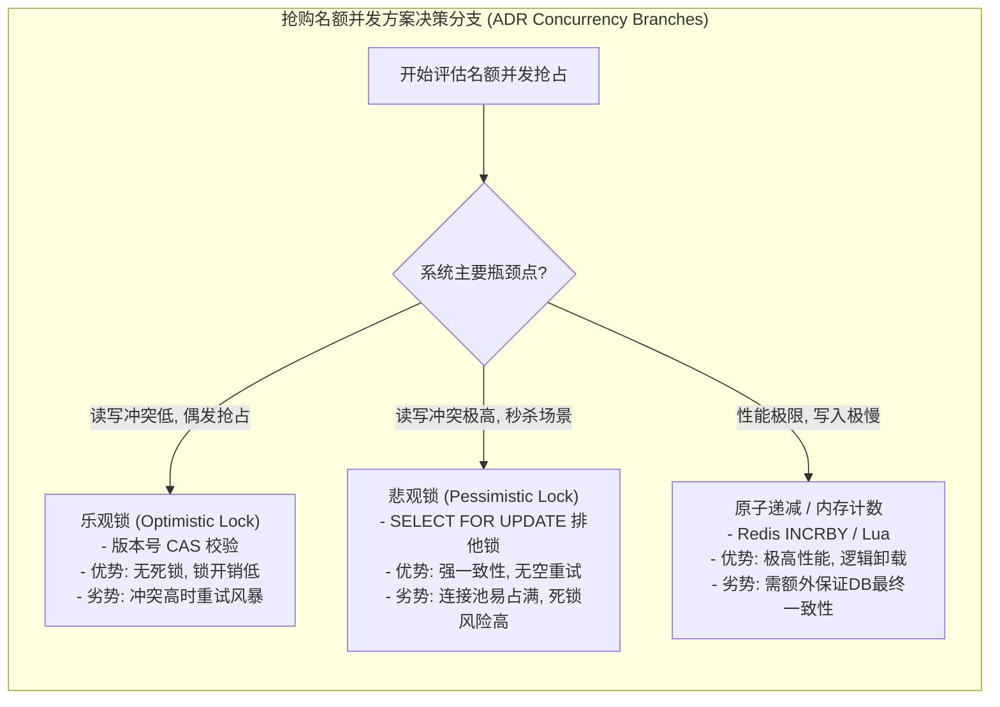

import GlossaryTerm from '@site/src/components/GlossaryTerm';
import GuidedExercise from '@site/src/components/GuidedExercise';
import ResearchNote from '@site/src/components/ResearchNote';
import ChapterMeta from '@site/src/components/ChapterMeta';
import PyRunner from '@site/src/components/PyRunner';
import TradeoffExplorer from '@site/src/components/TradeoffExplorer';
import QuizCard from '@site/src/components/QuizCard';

# L16 · 月末 Capstone：把 15 节课合成一个系统

<ChapterMeta
  time="约 6–10 小时（整周项目）"
  prereqs={[{label: 'Month 1 总览', href: './overview'}, {label: 'L1–L15 全部', href: './programming-systems-primer'}]}
  outcome="一个集成了校验、状态、幂等、并发安全、API、可观察性、测试、配置、性能预算的报名服务，外加一份架构决策记录（ADR）——你 Month 1 的作品集证据。"
  howToUse="这不是新知识，而是综合。按下面的构建顺序把前 15 课接起来，做完 capstone lab，并写一份 ADR。"
/>

:::tip 这一个月的"毕业作品"
前 15 节课每节都解决一个局部问题。Capstone 要你把它们**装进同一个系统**——因为真实架构的难点，恰恰在于这些关注点如何协同、如何取舍。做完它，你就有了第一份能拿出手的 AI Architect 作品集证据。
:::

## 一、项目目标

把贯穿全月的"活动报名"做成一个**生产级的小服务**：它要能扛住坏输入、重复请求、并发抢名额、依赖失败，并且可被观测、可被测试、可被配置部署、有明确的性能目标。

### 需求清单（每条都对应前面的课）

| 需求 | 来自 |
|---|---|
| 对外是 <GlossaryTerm term="REST API" definition="REST 风格应用程序接口：采用 HTTP 方法（GET/POST/PUT/DELETE）映射标准动作，并使用状态码表达响应状态。">REST API</GlossaryTerm>，状态码正确 | L9 |
| 输入三层校验，坏数据挡在门外 | L3 |
| 错误分类，不吞不泄露 | L4 |
| 状态外移、服务无状态可扩展 | L5 |
| 重复提交安全（<GlossaryTerm term="Idempotency Key" definition="幂等键：客户端生成的唯一请求标识，用于重试时让服务端识别重复请求、避免重复扣款/报名。">idempotency key</GlossaryTerm>） | L6 |
| 按查询建模 + 唯一约束 | L7 |
| 抢名额并发安全，不超卖 | L8 |
| 每步结构化日志 + 能算 RED 指标 | L1, L12 |
| 慢任务（发确认邮件）异步化 | L11 |
| 配置与代码分离、密钥外置 | L14 |
| 有测试金字塔（至少单元 + 集成） | L13 |
| 定义 p99 延迟 SLO 并能说明瓶颈 | L10, L15 |

## 二、目标架构（一张图看全月）

```mermaid
flowchart TB
  C["客户端"] --> GW["API 网关 / 路由<br/>L9 方法+状态码"]
  GW --> V["校验层<br/>L3 三层校验"]
  V --> IDEM["幂等层<br/>L6 idempotency key"]
  IDEM --> SVC["业务编排<br/>L2 模块边界"]
  SVC --> CC["并发控制<br/>L8 乐观锁/容量"]
  CC --> STORE["("状态层 + 索引<br/>L5 共享状态 / L7 建模")"]
  SVC --> Q["异步队列<br/>L11 发邮件削峰"]
  SVC --> OBS["可观察性<br/>L1/L12 日志+指标+trace"]
  CFG["配置/密钥<br/>L14 环境注入"] -.-> SVC
```mermaid
sequenceDiagram
  autonumber
  actor Client as 客户端 (Client)
  participant GW as API 网关/路由 (L9)
  participant Val as 校验与错误处理 (L3/L4)
  participant Idem as 幂等检查 (L6)
  participant Biz as 业务模块 (L2/L5/L14)
  participant Lock as 并发并发控制 (L8)
  participant DB as 数据库与索引 (L7)
  participant Queue as 异步消息队列 (L11)
  participant Log as 日志可观察性 (L1/L12)

  Client->>GW: 1. 发送报名请求 POST /signups (带 idempotency_key)
  activate GW
  GW->>Val: 2. 传递载荷 (Payload)
  activate Val
  alt 校验失败
    Val-->>GW: 3a. 返回 400 Bad Request
    GW-->>Client: 3b. 拒绝访问
  else 校验通过
    Val->>Idem: 4. 幂等拦截 (Idempotency Key Check)
    activate Idem
    alt 键已存在 (重复请求)
      Idem-->>GW: 5a. 返回历史缓存结果
      GW-->>Client: 5b. 秒回响应 (幂等安全 ✓)
    else 新增键
      Idem->>Biz: 6. 调用报名主逻辑 (加载环境配置 L14)
      activate Biz
      Biz->>Lock: 7. 并发名额竞争 (锁扣减)
      activate Lock
      alt 名额扣减失败 (售罄)
        Lock-->>Biz: 8a. 提示库存不足
        Biz-->>Idem: 8b. 缓存失败状态
        Biz-->>Log: 8c. 记录 rejected_full 结构化日志
        Biz-->>GW: 8d. 返回 422 Unprocessable Entity
        GW-->>Client: 8e. 提示名额已满
      else 扣减成功
        Lock->>DB: 9. 存储报名实体 (唯一键校验 L7)
        activate DB
        DB-->>Lock: 10. 写入成功
        deactivate DB
        Lock-->>Biz: 11. 释放锁
        deactivate Lock
        
        Biz->>Queue: 12. "发送确认邮件"慢任务异步入队 (L11)
        Biz->>Log: 13. 写入事件 created, 携带 trace_id
        Biz-->>Idem: 14. 缓存成功记录并保存
        Biz-->>GW: 15. 返回 201 Created
        deactivate Biz
        GW-->>Client: 16. 返回报名成功响应
      end
    end
    deactivate Idem
  end
  deactivate Val
  deactivate GW
```



每一层你都已经单独练过；Capstone 就是把它们接成一条完整的请求处理流水线。

## 三、构建顺序（先骨架，再逐层加固）

不要一次写完。像真实项目一样，**先让最小版本跑通，再一层层加固**（这正是 [WhatsApp 的演进哲学](../atlas/whatsapp.mdx)：先做对一件事，再被需求逼着升级）：

1. 先写能创建报名的最小 `register()`（L1 骨架）。
2. 加三层校验，挡住坏输入（L3）。
3. 加错误分类与结构化日志（L4 + L12）。
4. 加邮箱唯一 + 按查询索引（L7）。
5. 加 idempotency key，重复请求安全（L6）。
6. 加名额上限 + 并发安全（L8）。
7. 把"发确认邮件"异步入队（L11）。
8. 抽出配置（容量、SLO）到外部注入（L14）。
9. 全程补测试（L13），跑到全绿。
10. 算一次 RED 指标、定 p99 SLO（L12 + L15）。

## 四、动手 Capstone Lab（必做）

打开 `labs/month01/l16_capstone/`：

```bash
python labs/month01/l16_capstone/test_signup_service.py
```

实现一个 `SignupService`，集成校验、幂等、邮箱去重、名额上限、结构化日志。这是本月最综合的一题。

<GuidedExercise
  title="练习指引：把全月能力装进一个服务"
  goal="证明你能让多个关注点正确协同——这正是架构师区别于“会写功能”的地方。"
  hints={[
    '处理顺序很重要：先幂等（见过直接返回）→ 再校验 → 再去重/容量 → 再创建。',
    '每条出口（成功/各种拒绝）都要：写进幂等表 + 打一条结构化日志。',
    '名额满、邮箱重复、输入非法是三种不同结果，状态码/原因要分清（L4）。',
    '日志里要能事后算出 created 数、rejected 数（L12 的 RED 雏形）。'
  ]}
  steps={[
    'SignupService(capacity)：维护 by_email（状态+索引）、seen（幂等表）、log。',
    'register(request_id, name, email)：见过 request_id 直接返回缓存结果。',
    '校验 name/email（L3）；非法则记录并返回 rejected（结果也要进幂等表）。',
    '邮箱已存在 → 返回已有记录（去重）；名额已满 → rejected full。',
    '否则创建记录、写日志 created、缓存结果、返回 ok。',
    '跑测试到全过，并思考：如果换成真数据库 + Redis，哪些部分要改（应该只有 store）。'
  ]}
  checks={[
    '同一 request_id 多次调用结果一致、只创建一次。',
    '坏输入、重复邮箱、名额满分别得到正确且不同的响应。',
    '从 log 能算出成功/拒绝数量（RED 指标）。',
    '你能指出这个服务里 L1–L15 各自体现在哪一行。'
  ]}
/>
<TradeoffExplorer
  title="并发抢购控制策略取舍"
  dimensions={['高吞吐性能', '系统低开销', '无死锁风险', '防重试风暴', '实现简易度']}
  options={[
    {
      name: '悲观锁 (SELECT FOR UPDATE)',
      scores: [2, 1, 1, 5, 4],
      note: '事务开始即占锁。能够彻底避免应用层重试，但锁竞争长会占满数据库连接池，高并发下极易发生死锁。',
      whenToUse: '写冲突极其严重、名额极少且不能接受任何性能抖动的场景。'
    },
    {
      name: '乐观锁 (CAS 版本号 / 剩余计数)',
      scores: [4, 4, 5, 2, 3],
      note: '提交时校验版本。无死锁、无连接池阻塞，但极端冲突下会因冲突率攀升引发“重试风暴”占满 CPU。',
      whenToUse: '写冲突呈中低度分布，或能配合前置队列/限流削峰的秒杀系统。'
    },
    {
      name: '基于队列串行化消费',
      scores: [5, 3, 5, 5, 2],
      note: '请求全部入有界队列，由后台单线程或限量 Worker 串行扣减。性能最平稳，但系统链路变长。',
      whenToUse: '超高并发、需要完全保护数据库、且能接受最终一致性异步通知的电商抢购系统。'
    }
  ]}
/>

## 五、写一份架构决策记录（ADR）

代码之外，架构师的核心产出是**讲清楚为什么这么设计**。用 <GlossaryTerm term="ADR" definition="架构决策记录：一份简短文档，记录某个重要技术决策的背景、被考虑的选项、最终选择及其理由和后果。让决策可追溯、可复盘。">ADR（Architecture Decision Record）</GlossaryTerm> 给你的 capstone 写至少一条决策记录：

```markdown
# ADR-001: 用乐观锁而非悲观锁控制名额并发

## 背景
活动开抢瞬间会有大量并发请求抢有限名额，需防止超卖。

## 选项
1. <GlossaryTerm term="Pessimistic Locking" definition="悲观锁：一种并发控制策略，假定冲突高，在读取数据时即对记录加排他锁，直到事务提交才释放。安全但阻碍并发。">悲观锁</GlossaryTerm>：每次抢名额先加锁。简单但并发低。
2. <GlossaryTerm term="Optimistic Locking" definition="乐观锁：一种并发控制策略，假定冲突少，读数据时不加锁，仅在更新时检查在此期间是否有其他事务修改了版本/数值。若冲突则重试。">乐观锁</GlossaryTerm>（版本号）：不加锁，提交时校验版本。并发高，冲突时重试。
3. 原子扣减：用一条原子操作。最简单，但表达力有限。

## 决策
选乐观锁（L8），因为冲突在多数时段并不频繁，乐观锁吞吐更高、无死锁。

## 后果
- 好：高并发下吞吐好，无死锁。
- 代价：开抢瞬间冲突激增时，重试会变多，需配合限流/排队（L11）。
- 未解决：极端秒杀场景是否要切换到排队串行，待压测后定。
```

## 六、自评 Rubric（对照打分）

给自己的 capstone 打分（每项回扣对应课）：

- [ ] **正确性**：坏输入/重复/并发/名额满都有正确且可区分的响应（L3/L4/L6/L8）。
- [ ] **可扩展**：业务逻辑无状态，状态在可替换的 store 里（L5）。
- [ ] **可观察**：每条路径有结构化日志，能算 RED（L1/L12）。
- [ ] **可测试**：测试覆盖正常 + 各种失败路径，全绿（L13）。
- [ ] **可部署**：配置与密钥外置（L14）。
- [ ] **有性能意识**：能说出 p99 目标和最可能的瓶颈（L10/L15）。
- [ ] **能解释**：有一份 ADR 讲清一个关键取舍。

## 架构师深潜（Staff+ 视角）

### 1. 真正的难点是"协同"，不是单点

你会发现把各关注点接起来时冒出新问题：幂等表也是状态（要不要也外移？）、缓存拒绝结果对不对、异步发邮件失败了怎么和"已返回成功"对账（最终一致）。**这些"接缝处"的问题，才是架构师的主战场。** 单独每节课都简单，合起来才见功力。

### 2. 和真实系统对照

把你的设计和案例库对照着看：你的"无状态服务 + 共享状态"在 [WhatsApp](../atlas/whatsapp.mdx) 是什么样？你的"队列削峰"在 [ChatGPT](../atlas/chatgpt.mdx) 是什么样？**同样的原则，在不同规模/约束下长出不同的架构**——这种对照，是把课程知识升华成架构判断力的关键。

<ResearchNote
  title="架构决策要被记录下来"
  source="Michael Nygard, Documenting Architecture Decisions（ADR）"
  href="https://cognitect.com/blog/2011/11/15/documenting-architecture-decisions"
  insight="Nygard 提出用轻量的 ADR 记录每个重要架构决策的背景、选项、决定与后果。它让“为什么这么做”可追溯，避免后人推翻决策却不知当初的约束。"
  application="架构师的价值很大程度上体现在“讲清取舍”上。ADR 是把脑子里的判断变成团队资产的标准方式——你的作品集里应当有它。"
/>

### 3. 这就是你的作品集第一块砖

一个跑通的服务 + 一张架构图 + 一份 ADR + 一套测试，已经是一份能在面试里讲半小时的材料。后面每个月的产出都这样积累，到 Month 12 就是完整的 AI Architect 作品集。

### 4. 架构师深问（给自己 60 分钟）

- 把你的 capstone 当面试题，对着架构图讲一遍：需求→约束→设计→取舍→风险。录下来，听听哪里讲不清。
- 如果用户量 ×1000，你的设计哪一层最先撑不住？怎么改（回扣 L5/L7/L8/L10）？
- 选一个你做的取舍，写成 ADR，并诚实写下"未解决的问题"。

## 七、常见误解

- **"系统设计的难点在于把每个组件写得完美"**: 实际上，系统设计的真正难点在于“接缝处（Interconnections）”的协调与一致性。例如，当幂等表写入成功，但发送队列失败时，如何补偿？这些协同取舍才最考验架构功底。
- **"架构决策必须是绝对完美的"**: 没有完美的架构，只有最适合当前业务阶段、研发成本与系统规模的架构。每个决策都有其后果（ADR 的 Consequence），必须诚实地记录与面对。
- **"只要加上缓存和队列，系统的性能和可用性就自然解决了"**: 缓存引入了数据一致性问题，队列引入了背压防爆和延迟堆积问题。引入组件必须配套引入其代价治理手段。

## 八、章末自测

<QuizCard
  questions={[
    {
      q: '在设计高并发活动抢购（超卖防御）的并发控制逻辑时，以下关于悲观锁与乐观锁的评估，哪项是正确的？',
      options: [
        '悲观锁能够完全杜绝应用层由于版本冲突发起的重试，但在高并发竞争剧烈时会导致数据库连接池被排队事务瞬间占满，甚至引发死锁；乐观锁无死锁风险，但在极端冲突下会因高频 CAS 校验失败导致重试风暴从而占满 CPU，需配合前置限流或有界队列。',
        '乐观锁在任何吞吐量场景下都比悲观锁快 100 倍以上，且不需要任何前置防护。',
        '悲观锁只在内存中模拟锁，因此绝对不会对物理数据库造成任何连接压力。'
      ],
      answer: 0,
      explain: '这代表了并发控制设计的核心取舍。悲观锁（SELECT FOR UPDATE）在 DB 端排队，开销极大且易死锁；乐观锁通过版本号在应用层自旋重试，但在极端高冲突下会恶化为“重试风暴”压垮 CPU。因此结合有界队列进行串行削峰是极致高并发的优解。'
    },
    {
      q: '在 Capstone 毕业项目中，把“发送确认邮件”这类外部慢任务进行异步化入队，如果邮件网关在高峰期挂了，如何保障系统的最终一致性（Eventual Consistency）？',
      options: [
        '一旦邮件网关挂了，就必须自动触发事务回滚，将之前已经写入成功且秒回用户的报名记录彻底物理删除。',
        '应当通过消息队列的重试策略进行指数退避重试，若重试依然失败则送入死信队列（DLQ），并依靠后台对账监控或人工作业进行补偿修复，确保状态最终一致，而不是在主事务中同步死等。',
        '邮件异步化后就无法保证最终一致性，只能听之任之，不需要进行任何处理。'
      ],
      answer: 1,
      explain: '外部依赖系统通常是不可控的，不能让它拖慢主交易核心链路。异步化入队后，通过队列重试、死信队列（Dead Letter Queue）归档和后台定时对账任务，是处理这种“分布式事务接缝处”最终一致性落地的通用法则。'
    },
    {
      q: '关于架构决策记录（Architecture Decision Record, ADR）的实际工程价值，以下说法最准确的是？',
      options: [
        'ADR 的首要目的是代替编译脚本，自动验证代码的正确性。',
        'ADR 是将架构师在特定历史时空点做出的核心技术决策（如选择某种数据库或锁机制）时的背景、评估的备选方案、取舍利弊（Tradeoffs）和产生后果进行归档记录，从而防止团队后人在不知悉历史约束的前提下推翻正确的设计而重复踩坑。',
        'ADR 在系统部署上线后即可直接废弃，不用存放在代码库中。'
      ],
      answer: 1,
      explain: '每一个架构决策都是在当时的产品规模、研发成本与时间约束下做出的权衡。记录 ADR 能让系统架构的演进历史对团队完全透明，避免了“这个烂代码当初是谁写的/为什么要用乐观锁”这类因为历史信息丢失而对老设计产生误解并盲目重构踩坑的悲剧。'
    }
  ]}
/>

## 恭喜你完成 Month 1

你已经能把"一段能跑的代码"变成"一个扛得住真实世界、可扩展、可观察、可部署、可解释的系统"。这正是系统设计的入口能力。

**下一步**：进入 Month 2（系统设计桥梁：HLD/LLD、需求澄清、容量估算），开始画更大的系统图。也别忘了常去 [架构案例库](../atlas) 对照真实系统。

## 延伸阅读

- [Michael Nygard, Documenting Architecture Decisions](https://cognitect.com/blog/2011/11/15/documenting-architecture-decisions)
- [architecture-decision-record（ADR 模板集）](https://github.com/joelparkerhenderson/architecture-decision-record)
- [回到 Month 1 总览](./overview)