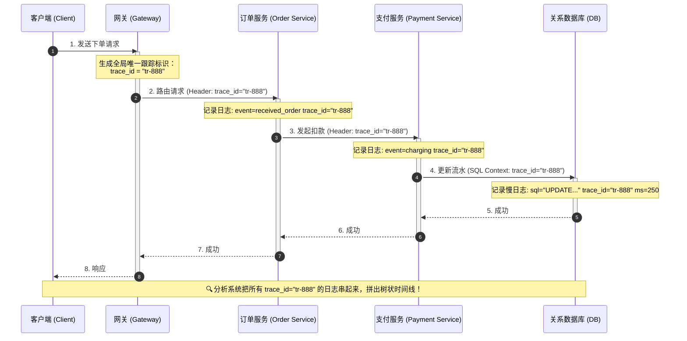
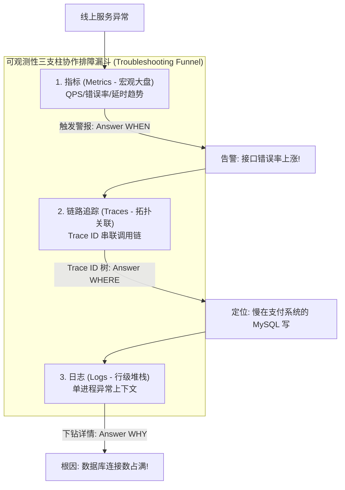
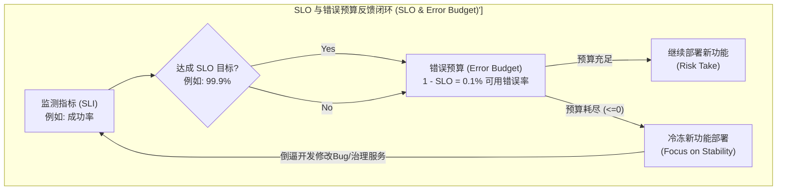

import GlossaryTerm from '@site/src/components/GlossaryTerm';
import GuidedExercise from '@site/src/components/GuidedExercise';
import ResearchNote from '@site/src/components/ResearchNote';
import ChapterMeta from '@site/src/components/ChapterMeta';
import PyRunner from '@site/src/components/PyRunner';
import TradeoffExplorer from '@site/src/components/TradeoffExplorer';
import QuizCard from '@site/src/components/QuizCard';

# L12 · 可观察性深入

<ChapterMeta
  time="约 1.5–2 小时"
  prereqs={[{label: 'L1 可观察性初识', href: './programming-systems-primer'}, {label: 'L10 请求链路', href: './request-path'}]}
  outcome="一套结构化日志 + 用 trace_id 串联跨步骤调用，并能从日志算出 RED 指标（请求量、错误率、p95），理解 SLO。"
  howToUse="先跑“trace_id 串联一次请求”的演示，再做 lab 从日志算指标。这是你定位线上问题的工具箱。"
/>

:::tip 这一课让系统"可被追问"
L1 你学会了埋日志。但当系统变成几十个服务，单条日志远远不够：一个请求经过 10 个服务，到底卡在哪？错误率是不是在涨？可观察性，就是让你能对一个运行中的系统**不断追问"为什么"并得到答案**。
:::

## 一、出问题了，你怎么知道是哪一环？

L10 留了个问题：一个页面 800ms 才出来，慢在哪一跳？如果每个服务只各自打孤立的日志，你得登录十台机器、人肉拼时间线。**根本问题是：你没有一根线把"同一个请求在各服务里的足迹"串起来。** 这一课就给你这根线，以及把海量日志变成可看趋势的指标。



## 二、三个核心概念（分层）

### 基础：可观察性的三支柱

<GlossaryTerm term="Observability" definition="可观察性：通过系统对外输出的信号，从外部推断其内部状态的能力。三大支柱是日志、指标、追踪。">可观察性</GlossaryTerm> 建立在三类信号上（[回扣 L1 的 OpenTelemetry](./programming-systems-primer)）：

- <GlossaryTerm term="Logs" definition="日志：离散的事件记录（谁、何时、发生了什么）。结构化日志（JSON 带字段）比纯文本更可查询、可聚合。">日志（Logs）</GlossaryTerm>：一条条事件。**结构化**（带字段的 JSON）才好查。
- <GlossaryTerm term="Metrics" definition="指标：随时间聚合的数值（QPS、错误率、p95 延迟）。便宜、适合告警和看趋势，但缺少单次请求的细节。">指标（Metrics）</GlossaryTerm>：聚合的数字趋势，便宜、适合告警。
- <GlossaryTerm term="Traces" definition="追踪：用一个 trace_id 把一次请求在所有服务里的步骤串成一条时间线，看清它经过哪些跳、各花多久。">追踪（Traces）</GlossaryTerm>：用一个 trace_id 把一次请求的全程串起来。



### 进阶：trace_id、RED 方法、SLO

**分布式追踪**的关键是：请求进入系统时生成一个 <GlossaryTerm term="Trace ID" definition="贯穿一次请求全过程的唯一 id。每个服务处理这次请求时都带上它打日志，于是能把跨服务的足迹拼成一条完整时间线。">trace_id</GlossaryTerm>，之后传给每一个下游服务、记进每一条日志。于是你能把散落各处的日志按 trace_id 拼成完整时间线。

衡量一个服务健康度，常用 <GlossaryTerm term="RED Method" definition="RED 方法：对每个服务监控 Rate（请求量）、Errors（错误率）、Duration（延迟分布）三个核心指标。">RED 方法</GlossaryTerm>：Rate（请求量）、Errors（错误率）、Duration（延迟，尤其 p95/p99）。

再往上是 <GlossaryTerm term="SLO" definition="服务等级目标：对某个 SLI（如“p99 延迟 300ms 内”或“成功率 99.9%”）设定的目标值。它定义了“足够好”的标准，并衍生出错误预算。">SLO</GlossaryTerm>——用一个明确目标（如"99.9% 的请求成功"）定义"多好算好"，并据此分配<GlossaryTerm term="Error Budget" definition="错误预算：1 − SLO。如 SLO 99.9% 则有 0.1% 的预算可以出错，用来平衡“上线速度”和“稳定性”。">错误预算</GlossaryTerm>。




### 深入（选学）：可观察性 ≠ 监控；采样与高基数

**监控**是"我预先知道要看什么"（CPU、内存的仪表盘）；**可观察性**是"出了没预料到的问题，我能不能临时追问出原因"。后者要求数据足够丰富（高基数：能按 user_id、request_id 等任意维度下钻）。但全量存储太贵，于是要**采样**——这本身又是一组取舍。

<ResearchNote
  title="分布式追踪：给每个请求一张贯穿全局的时间线"
  source="Google (2010), Dapper, a Large-Scale Distributed Systems Tracing Infrastructure"
  href="https://research.google/pubs/pub36356/"
  insight="Dapper 提出用统一的 trace 上下文在服务间传播，把一次请求在成百上千个服务里的调用串成一棵带耗时的调用树，并用低采样率控制开销。它是 Jaeger、OpenTelemetry tracing 的鼻祖。"
  application="没有分布式追踪，微服务就是黑盒——你永远说不清一个慢请求慢在哪。trace_id 传播是现代分布式系统可调试性的地基。"
/>

## 三、跟我做一遍：用 trace_id 串起一次请求

<PyRunner
  expect="串起了 3 步"
  code={`# 一次请求进来，生成一个 trace_id，之后每一步都带上它打结构化日志
trace_id = "abc-123"
log = []

def emit(event, **fields):
    log.append({"trace": trace_id, "event": event, **fields})

emit("request_received", path="/signups", method="POST")
emit("db_query", table="signups", ms=30)
emit("response", status=201, ms=42)

# 因为都带同一个 trace_id，就能把这次请求的全程拼成一条时间线
for e in log:
    print(e)

same_trace = [e for e in log if e["trace"] == "abc-123"]
print("trace abc-123 串起了", len(same_trace), "步")`}
/>

**试试**：再模拟第二个请求（换一个 trace_id），然后只筛出某一个 trace 的日志——这就是你在线上"看一次请求全貌"的方式。

## 四、动手 Lab（必做）

打开 `labs/month01/l12_observability/`：

```bash
python labs/month01/l12_observability/test_metrics.py
```

从一批请求日志里算出 RED 指标：请求量、错误率、p95 延迟。

<GuidedExercise
  title="练习指引：从日志算出 RED 指标"
  goal="把“原始日志 → 可看趋势的指标”这条链路走通——这是告警和 SLO 的基础。"
  hints={[
    'Rate = 事件总数；Errors = status >= 500 的占比（4xx 是客户端错，通常不算服务端错误率）。',
    'p95：把 duration 排序，取第 95 百分位的位置。',
    '空输入要稳妥处理，别除以零。',
    '想想：为什么看 p95/p99 比看平均更有意义（回扣 L1 尾延迟）。'
  ]}
  steps={[
    'summarize(events)：events 是 [{"status":int,"duration_ms":int}, ...]。',
    '算 count、error_rate（status>=500 的比例）、p95_ms（排序后取 95 分位）。',
    '返回 {"count":..., "error_rate":..., "p95_ms":...}。',
    '写测试：全成功错误率为 0、含 500 的错误率正确、p95 取值正确。',
    '跑到测试全过。'
  ]}
  checks={[
    '你能说出日志、指标、追踪各自解决什么问题。',
    '你能解释 trace_id 怎么把跨服务的足迹串起来。',
    '你能从日志算出错误率和 p95。',
    '你能说出 SLO 和错误预算是干什么的。'
  ]}
/>

## 架构师深潜（Staff+ 视角）

### 1. 三支柱各有所长，要配合用

<TradeoffExplorer
  title="三类可观察性信号"
  dimensions={['单次请求细节', '趋势/告警', '跨服务定位', '存储成本', '查询灵活性']}
  options={[
    {
      name: '日志 Logs',
      scores: [5, 2, 2, 2, 4],
      note: '最细，能看单条事件的来龙去脉。但海量、贵，靠它看趋势/告警很笨。',
      whenToUse: '排查具体问题、审计、需要完整上下文时。务必结构化。'
    },
    {
      name: '指标 Metrics',
      scores: [1, 5, 2, 5, 2],
      note: '极便宜、适合做仪表盘和告警，看 QPS/错误率/延迟趋势。但丢失了单次请求细节。',
      whenToUse: '健康度监控、告警、容量规划（RED/USE）。'
    },
    {
      name: '追踪 Traces',
      scores: [4, 3, 5, 3, 4],
      note: '唯一能回答"这个慢请求慢在哪一跳"的信号。但需要全链路埋点 + 采样控制成本。',
      whenToUse: '微服务定位延迟/错误根因、理解调用依赖时。'
    }
  ]}
/>

成熟团队三者都用：指标告警 → 发现异常；追踪定位 → 是哪个服务/哪一跳；日志下钻 → 具体那条请求发生了什么。

### 2. SLO 是工程和产品的共同语言

<ResearchNote
  title="用 SLO 和错误预算管理可靠性"
  source="Google SRE Book: Service Level Objectives"
  href="https://sre.google/sre-book/service-level-objectives/"
  insight="Google SRE 用 SLI（指标）+ SLO（目标）+ 错误预算把“可靠性”变成可量化、可决策的东西：预算没用完就可以大胆上线，烧完了就停下来先稳。"
  application="SLO 让“要多可靠”从拍脑袋变成有依据的取舍——100% 可靠既不可能也不划算。它是架构师平衡“创新速度 vs 稳定性”的核心工具，也是 Month 11 治理的基础。"
/>

### 3. 真实案例：trace 跨越几十个服务

[ChatGPT](../atlas/chatgpt.mdx) 一个请求要穿过网关、路由、调度、GPU 推理多个环节；[WhatsApp](../atlas/whatsapp.mdx) 一条消息跨越多台 chat 服务器。没有 trace_id 串联和指标看板，这种规模的系统根本无法运维。**可观察性不是锦上添花，是大规模系统能活下去的前提。**

### 4. 架构师深问（给自己 30 分钟）

- 给你的报名系统定 2 个 SLO（如"p99 < 300ms""成功率 > 99.9%"）。你会怎么用 RED 指标来度量它们？
- 一个请求慢，你会先看指标、追踪还是日志？三者的排查顺序是什么？
- 全量存追踪太贵，你怎么采样才能既省钱、又不漏掉重要的慢/错请求？（提示：尾部采样。）

## 五、章末自测

<QuizCard
  questions={[
    {
      q: '在分布式微服务系统中，为什么采用结构化日志（如 JSON 格式）排查故障远比非结构化纯文本日志高效？',
      options: [
        '因为非结构化文本日志的磁盘存储空间通常是结构化日志的 10 倍以上。',
        '因为结构化日志包含固定且明确的 Key-Value 字段，能够直接被 ElasticSearch/ClickHouse 等日志分析引擎快速建立索引并进行多维度下钻、过滤和聚合统计；非结构化文本则难以自动结构化，排查时只能人肉 grep。',
        '因为在未开启 JSON 格式时，常用的日志收集器（如 Logstash/Fluentd）会在解析时频繁崩溃崩溃。'
      ],
      answer: 1,
      explain: '非结构化文本没有确定的字段边界，使得按特定维度（如 userId, traceId）过滤或分析大盘错误率极难，且正则表达式匹配开销极其高昂。结构化 JSON 日志是高可观测性平台的基石。'
    },
    {
      q: '在可观测性三支柱（Metrics, Traces, Logs）的日常排障漏斗中，最合理的故障排查工作流顺序是什么？',
      options: [
        '先阅读单机 Logs 排查逻辑，接着用 Traces 大致划定边界，最后用 Metrics 设置整体大盘警报。',
        '首先通过指标（Metrics）趋势检测到异常并触发告警（回答 WHEN）；接着通过链路追踪（Traces）拓扑时间线精确定位是哪个服务组件出现故障或性能瓶颈（回答 WHERE）；最后通过结构化日志（Logs）查看具体进程抛出的异常堆栈和错误上下文（回答 WHY）。',
        '三支柱完全是可以互相替代的，一般微服务系统只需配置其中一种即可，没必要配合使用。'
      ],
      answer: 1,
      explain: '这是工业界最推崇的排障工作流。Metrics 便宜适合做告警监控大盘；Traces 是微服务大网的导航，快速确定异常落在哪个节点；Logs 是具体结点的黑匣子，展示核心代码抛错。三者有机结合能极速缩短故障定位时间。'
    },
    {
      q: '关于服务等级目标（SLO）与错误预算（Error Budget）在互联网服务迭代与稳定性维护中的制约关系，以下描述何者是正确的？',
      options: [
        '当错误预算（1 - SLO）被耗尽归零时，应该立即冻结所有非紧急新功能发布，强制开发精力聚焦于稳定性和缺陷修复，以此换取系统回归稳态。',
        'SLO 的设立旨在要求系统达成 100% 可靠性，任何允许服务出错的指标都是不合格的设计。',
        '错误预算主要用来应对第三方服务商的流量超限罚款，不与产品的发布周期流程挂钩。'
      ],
      answer: 0,
      explain: '错误预算是 SRE 控制变更风险的最佳武器。将 SLO 定位在合理范围内（如 99.9% 成功率），则有 0.1% 的错误余额。若余额充足可快速迭代上线；一旦由于故障频发将这 0.1% 的预算烧光，则必须触发冷冻发布（Freeze），直到服务恢复健康度。'
    }
  ]}
/>

## 自检清单

- [ ] 我能说出日志/指标/追踪三者分工。
- [ ] 我能用 trace_id 把跨服务的请求串起来。
- [ ] 我的 lab 能从日志算出 RED 指标。
- [ ] 我能解释 SLO 和错误预算的作用。

## 常见误解

- **"打了日志就有可观察性"**：孤立、非结构化的日志在分布式下几乎没用，要 trace_id + 指标 + 结构化。
- **"看平均延迟就够了"**：平均掩盖尾延迟，要看 p95/p99（回扣 L1）。
- **"监控等于可观察性"**：监控看已知指标，可观察性是能追问未知问题。

## 延伸阅读

- [Google Dapper（分布式追踪论文）](https://research.google/pubs/pub36356/)
- [Google SRE Book: SLOs](https://sre.google/sre-book/service-level-objectives/)
- [OpenTelemetry 文档](https://opentelemetry.io/docs/)
