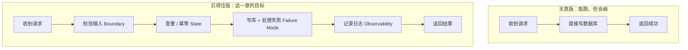
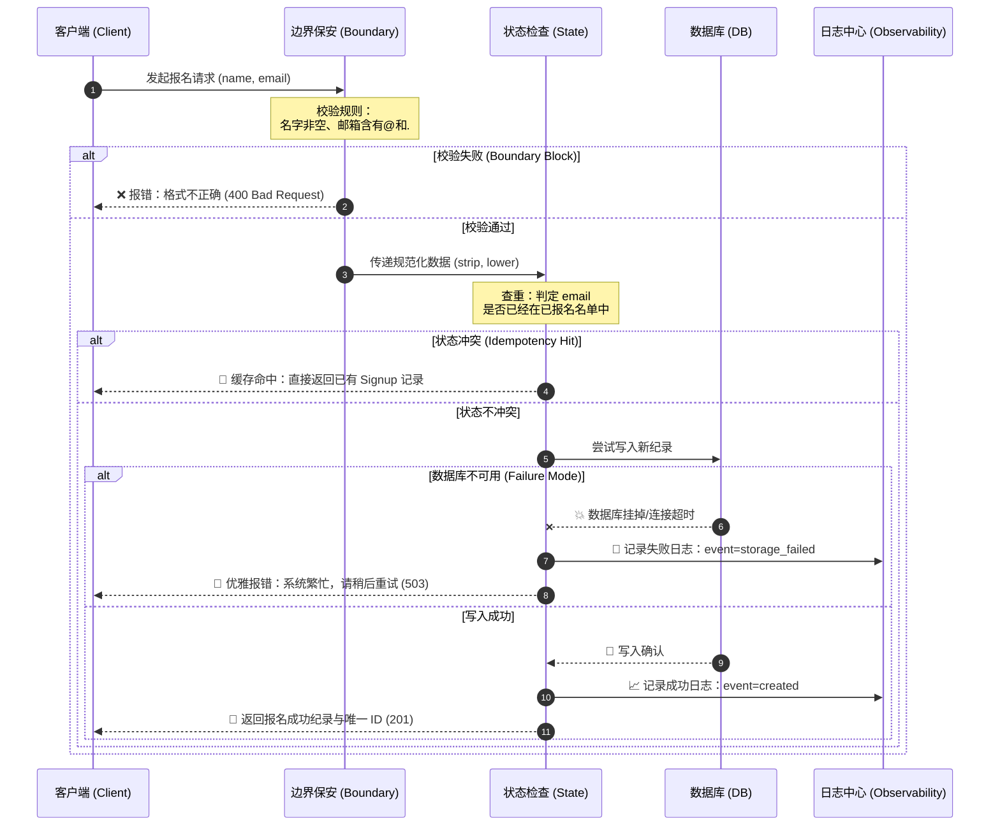
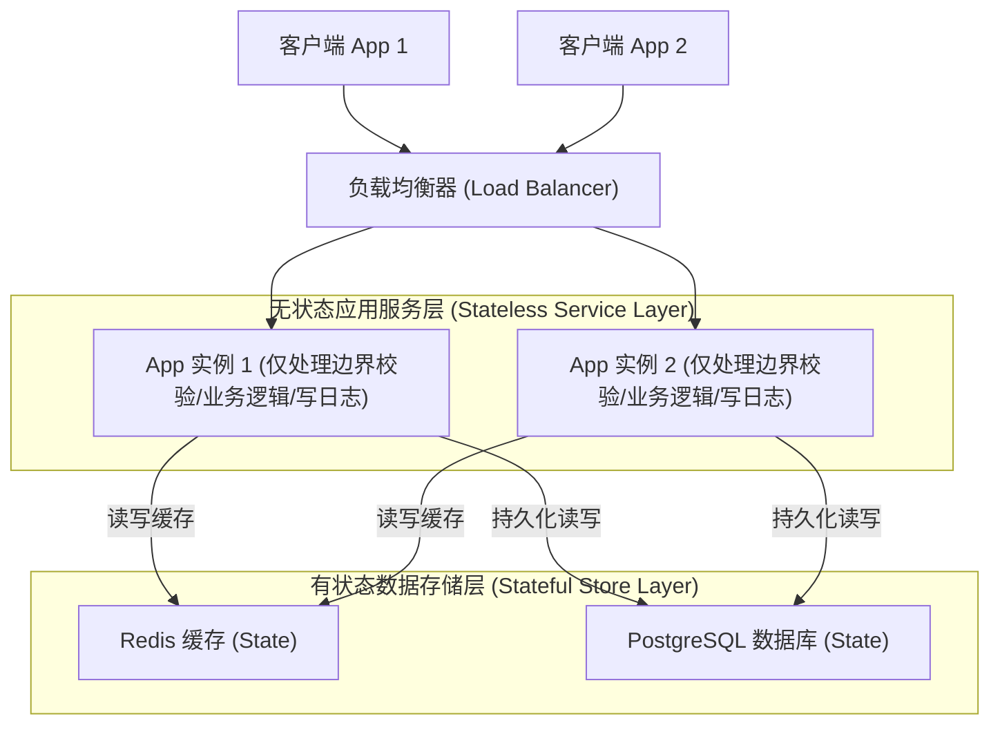

import GlossaryTerm from '@site/src/components/GlossaryTerm';
import GuidedExercise from '@site/src/components/GuidedExercise';
import ResearchNote from '@site/src/components/ResearchNote';
import ChapterMeta from '@site/src/components/ChapterMeta';
import PyRunner from '@site/src/components/PyRunner';
import FailureLab from '@site/src/components/FailureLab';
import LatencyNumbers from '@site/src/components/LatencyNumbers';
import PercentileLab from '@site/src/components/PercentileLab';
import TradeoffExplorer from '@site/src/components/TradeoffExplorer';
import QuizCard from '@site/src/components/QuizCard';

# Month 1 - 编程如何变成系统

<ChapterMeta
  time="约 4–6 小时（分 2–3 次）"
  prereqs={[]}
  outcome="一个会校验输入、能幂等、会记日志、扛得住数据库失败的报名服务，以及它的请求链路图。"
  howToUse="从头按顺序读。每遇到一个绿色的「在浏览器里跑」代码格，先点运行、再改两下、再往下读。最后一定要做本地 lab，把代码真正写一遍。"
/>

:::tip 这一章不背概念，而是修一个会崩的程序
你不需要任何基础。我们会先看一个真实会崩溃的小程序，然后一步一步把它修好。**系统设计的四个核心概念，会在修复过程中自己冒出来——你不是在记定义，而是在解决具体问题。**
:::

## 一、先看一个周一早上崩掉的程序

假设你周末花两小时写了一个「活动报名」小脚本。你自己测了几次，填名字、填邮箱、报名成功，一切完美。你很满意，把它发到了 500 人的班级群里。

周一早上九点，灾难来了：

- 有人名字栏是**空的**，但系统照样显示"报名成功"。
- 有人手抖**点了两次**，于是同一个人占了两个名额。
- 有人邮箱填了个 `233333`，系统也照单全收。
- 五百人几乎同时点进来，**数据库被问爆**，页面转圈。
- 最要命的是：出问题以后，你打开后台，**完全不知道是哪一步出的错**——没有任何记录。

你的代码"在你电脑上能跑"，但它**不是一个系统**。

> 这一章要做的，就是把这个"能跑的脚本"，一步步改造成"扛得住真实世界的服务"。在这个过程中，你会亲手遇到并解决系统设计里最基础的四个问题。

## 二、先看成品：这一章结束时你会得到什么

读完并做完 lab，你会有一个 `create_signup` 服务，它能做到：

1. 把**坏输入挡在门外**（空名字、乱填邮箱直接拒绝）。
2. **重复报名只算一次**（点两次、刷新、网络重发，都不会重复占名额）。
3. 数据库挂掉时**优雅失败**，而不是把脏数据写进去。
4. 每一步都**留下日志**，出事能立刻查到是哪一环。

下面这张图就是"天真版"和"扛得住版"的差别——现在看不懂没关系，这一章就是带你从左边走到右边：



下面是“扛得住版”的请求全链路时序图，展示了四个核心概念是如何贯穿于一次请求的生命周期中的：



注意右边那四个英文词：<GlossaryTerm term="Boundary" definition="系统或模块对外暴露的输入、输出和责任的边界。边界清楚，坏数据就进不来，模块也更容易被替换或测试。">Boundary</GlossaryTerm>、<GlossaryTerm term="State" definition="系统在某个时刻保存下来的事实，比如谁已经报过名。状态越重要，越要考虑一致性、去重和恢复。">State</GlossaryTerm>、<GlossaryTerm term="Failure Mode" definition="系统在某类失败下会表现成什么样。架构师必须提前设计失败时的行为，而不是只描述正常路径。">Failure Mode</GlossaryTerm>、<GlossaryTerm term="Observability" definition="通过日志、指标、追踪来理解系统内部正在发生什么。它不是事后装饰，而是排障和运营的前提。">Observability</GlossaryTerm>。这就是这一章的四根支柱，我们一根一根来。

## 三、四个核心概念（每个都从刚才的崩溃里长出来）

### 概念 1：Boundary（边界）——坏数据从哪里进来？

**生活类比**：边界就像小区门口的保安。外面的人要进来，必须先被检查。没有保安，谁都能进，里面再乱也怪不得别人。

**精确定义**：一个函数、一个服务对外接收输入的地方，就是它的 <GlossaryTerm term="Boundary" definition="系统对外接收输入、返回输出的契约位置。所有校验都应该发生在边界上。">Boundary</GlossaryTerm>。系统设计的第一原则是：**所有对输入的不信任，都应该在边界上处理掉**，而不是让坏数据流进系统深处再出问题。

**接回崩溃**：周一那个"空名字也能报名成功"，根源就是边界上没有保安——`create_signup` 拿到什么就存什么。

**它在系统图里的位置**：边界在最外层。请求进入系统的第一件事，永远应该是"这个输入合法吗？"

<ResearchNote
  title="为什么清楚的边界是系统设计的根基"
  source="D. Parnas (1972), On the Criteria To Be Used in Decomposing Systems into Modules"
  href="https://dl.acm.org/doi/10.1145/361598.361623"
  insight="Parnas 提出信息隐藏（information hiding）：每个模块只通过明确的接口对外暴露最少的东西，把实现细节藏在边界后面。这样改一个模块的内部，不会震动整个系统。"
  application="把校验输入放在边界上，本质就是信息隐藏：调用方只需要知道传合法数据进来，不需要知道你内部怎么存。边界越清楚，系统越容易测试、替换和排障——这条 1972 年的原则，今天在微服务、RAG、Agent 工具接口里依然成立。"
/>

### 概念 2：State（状态）——系统记住了什么？

**生活类比**：状态就是报名表上"已经签到的名单"。有了这份名单，你才知道谁来过、谁没来过；同一个人来第二次，你会说"你已经签过了"。

**精确定义**：<GlossaryTerm term="State" definition="系统持久保存的事实集合。读写状态时要考虑一致性、并发和去重。">State</GlossaryTerm> 是系统保存下来的事实。一个本地脚本算完就忘，但一个服务必须**记住**谁报过名——否则没法判断"重复"。

**接回崩溃**：那个"点两次占两个名额"的问题，是因为系统没有用状态去判断"这个邮箱是不是已经报过了"。判断重复并只算一次，有个专门的词叫 <GlossaryTerm term="Idempotency" definition="幂等性：同一个操作执行一次和执行多次，对系统状态的影响相同。是处理重复请求、网络重发、用户重复点击的关键。">Idempotency（幂等性）</GlossaryTerm>。

**它在系统图里的位置**：状态在边界之后、真正动作之前。先查"它已经存在了吗"，再决定要不要新建。

:::note 工程实践：幂等是怎么做的
真实世界里，支付、下单这类操作绝不能因为用户多点一次就执行两次。一个通用做法是 idempotency key（幂等键）：客户端给每个操作带一个唯一 id，服务端见过这个 id 就直接返回上次的结果。可参考 [Stripe 的幂等请求设计](https://docs.stripe.com/api/idempotent_requests)。在我们的小例子里，"邮箱"就充当了天然的幂等键。
:::

在物理部署架构上，无状态服务（Stateless Services）与有状态数据存储层（Stateful Storage）的彻底分离是支撑大规模高并发系统设计的最基本物理模型：



### 概念 3：Failure Mode（失败模式）——出错时会怎样？

**生活类比**：电梯断电时，好的设计会平稳停住并开门，而不是直接坠落。失败不可避免，**关键是失败的姿势**。

**精确定义**：<GlossaryTerm term="Failure Mode" definition="系统在某类故障下的具体表现。好的架构为每种失败预先设计了行为：拒绝、重试、降级，还是排队。">Failure Mode</GlossaryTerm> 指系统遇到故障（数据库挂了、网络超时、第三方不可用）时会变成什么样。**初学者只写正常路径，架构师先想失败路径。**

**接回崩溃**：数据库被问爆时，天真版要么崩掉、要么把半截脏数据写进去。扛得住版应该：**写库失败就明确报错、不留脏数据、告诉用户稍后重试**。

**它在系统图里的位置**：失败处理包裹在每一个可能出错的动作（尤其是访问数据库、网络）外面。

<ResearchNote
  title="把稳定性当成一等公民来设计"
  source="M. Nygard, Release It! Design and Deploy Production-Ready Software"
  href="https://pragprog.com/titles/mnee2/release-it-second-edition/"
  insight="Nygard 总结了大量真实事故，提出稳定性模式（如 Timeout、Circuit Breaker、Bulkhead）：系统不是正常路径的集合，而是失败路径的集合。一个没有超时、没有失败处理的调用，迟早会拖垮整个系统。"
  application="即使在 Month 1 的小脚本里，写库可能失败也必须被显式处理。这种先设计失败的习惯，会一路延伸到你以后设计 API 网关、RAG 检索、Agent 工具调用——任何跨网络的动作都要预设它会失败。"
/>

### 概念 4：Observability（可观察性）——出事了怎么查？

**生活类比**：飞机的黑匣子。平时用不上，一旦出事，它是你唯一能还原"到底发生了什么"的东西。

**精确定义**：<GlossaryTerm term="Observability" definition="通过日志（logs）、指标（metrics）、追踪（traces）从外部推断系统内部状态的能力。">Observability（可观察性）</GlossaryTerm> 是指你能不能通过系统留下的信号，搞清楚它内部发生了什么。

**接回崩溃**：周一最让你抓狂的不是出错，而是"**不知道哪一步错了**"。如果每一步都留一条日志（收到请求、拒绝原因、写库成功/失败），你三分钟就能定位。

**它在系统图里的位置**：可观察性不是某一层，而是**贯穿所有层**——每个关键动作都顺手记一笔。

<ResearchNote
  title="可观察性的三类信号：logs / metrics / traces"
  source="OpenTelemetry Documentation"
  href="https://opentelemetry.io/docs/"
  insight="OpenTelemetry 把 traces、metrics、logs 定为理解分布式系统行为的基础信号，并提供了跨语言的统一标准。"
  application="从第一天就养成关键路径必记日志的习惯。否则等你以后调试微服务、RAG 或 Agent 时，会完全看不清系统在干什么——而那时的系统比这个报名脚本复杂一百倍。"
/>

## 四、我带你做一遍：把脚本一步步修好

下面四个代码格**都能直接在浏览器里运行**（第一次运行会下载 Python 运行时，稍等几秒）。请你：**先点"运行"看结果 → 再自己改两下 → 再往下读**。这就是从"看懂"到"会做"的关键一步。

### 第 0 步：天真版——亲眼看它怎么坏

<PyRunner
  code={`# 天真版：拿到什么就存什么，不做任何检查
signups = {}

def create_signup(name, email):
    signups[email] = {"name": name, "email": email, "status": "confirmed"}
    return signups[email]

# 周一群里的真实输入：空名字、乱填邮箱
print(create_signup("", "233333"))
print("总报名数:", len(signups))`}
/>

看到了吗？空名字、垃圾邮箱，全都"报名成功"了。问题不在 Python，在于**我们没有边界**。

### 第 1 步：加上边界（Boundary）——把坏输入挡在门外

<PyRunner
  expect="rejected"
  code={`class ValidationError(Exception):
    pass

def create_signup(name, email):
    name = (name or "").strip()
    email = (email or "").strip().lower()
    if not name:
        raise ValidationError("名字不能为空")
    if "@" not in email or "." not in email.split("@")[-1]:
        raise ValidationError("邮箱格式不对")
    return {"name": name, "email": email, "status": "confirmed"}

for bad in [("", "ada@x.com"), ("Ada", "233333")]:
    try:
        create_signup(*bad)
    except ValidationError as e:
        print("rejected:", e)

print("正常的：", create_signup("Ada", "ADA@x.com"))`}
/>

坏数据被挡住了，而且我们顺手做了归一化（`strip()` 去空格、`lower()` 统一小写）——这一步为下一步的"查重"埋了伏笔。**试试**：把校验规则改严一点，比如要求名字至少 2 个字。

### 第 2 步：加上状态与幂等（State / Idempotency）——重复只算一次

<PyRunner
  expect="same id"
  code={`signups = {}

def create_signup(name, email):
    email = email.strip().lower()
    if email in signups:              # 幂等：已存在就返回原记录，不新建
        return signups[email]
    record = {"id": f"signup-{len(signups) + 1}", "name": name, "email": email}
    signups[email] = record
    return record

a = create_signup("Ada", "ada@x.com")
b = create_signup("Ada", "ADA@x.com")   # 点了两次 / 大小写不同
print("第一次 id:", a["id"])
print("第二次 id:", b["id"])
print("same id" if a["id"] == b["id"] else "different id")
print("总报名数:", len(signups))`}
/>

两次拿到**同一个 id**，总数还是 1。这就是幂等：用户点几次都安全。

### 第 3 步：加上失败处理与日志（Failure Mode / Observability）

<PyRunner
  expect="storage_failed"
  code={`log = []
signups = {}

class StorageError(Exception):
    pass

def save(record, db_down=False):
    if db_down:                       # 模拟数据库挂掉
        raise StorageError("database unavailable")
    signups[record["email"]] = record

def create_signup(name, email, db_down=False):
    email = email.strip().lower()
    record = {"email": email, "name": name}
    try:
        save(record, db_down=db_down)
    except StorageError:
        log.append({"event": "storage_failed", "email": email})   # 留痕
        raise
    log.append({"event": "created", "email": email})
    return record

create_signup("Ada", "ada@x.com")           # 正常
try:
    create_signup("Bob", "bob@x.com", db_down=True)   # 数据库挂了
except StorageError:
    print("用户看到：系统繁忙，请稍后重试")

print("---- 系统日志 ----")
for entry in log:
    print(entry)`}
/>

数据库挂了，但系统**没有崩、没有写脏数据、给了用户一句人话、并在日志里留了痕**。这就是从"脚本"到"系统"的全部差距——而它只是四个概念叠加起来的结果。

## 五、轮到你来：拨动开关，看系统怎么扛

下面这个交互把四种故障做成了开关。**逐个、组合着打开**，观察三件事：请求被**哪一层**拦住、**用户看到**什么、**日志**记下了什么。

<FailureLab />

试着回答：为什么"空输入"在第一层就被拦住，而"数据库挂掉"要到最后一层才暴露？（提示：这正是边界、状态、失败处理在系统里的先后顺序。）

## 六、动手 Lab（必做）：把它真正写一遍

浏览器里跑过还不够——真正的肌肉记忆来自你自己把代码写完、跑通测试。

打开仓库里的 `labs/month01/`：

- `signup.py`：有 6 个 `TODO` 等你补完（校验、幂等、失败处理、日志）。
- `test_signup.py`：6 个测试。先跑一遍参考解确认环境没问题：

```bash
python labs/month01/test_signup.py
```

应当看到 `6/6 passed`。然后把 `test_signup.py` 顶部的 `from solution import signup as m` 改成 `import signup as m`，去补 `signup.py` 的 TODO，直到你的实现也 `6/6 passed`。

<GuidedExercise
  title="练习指引：把报名脚本改造成扛得住的服务"
  goal="你不是在写一个完美的报名系统，而是在用一个具体例子，把 Boundary / State / Failure Mode / Observability 四个概念变成手上的肌肉记忆。"
  hints={[
    '先跑参考解（python labs/month01/test_signup.py），确认能看到 6/6 passed，再开始改自己的。',
    '六个 TODO 的顺序就是系统处理请求的顺序：先校验、再查重、再写库、最后记日志。',
    '空名字、非法邮箱、重复邮箱、数据库失败——每一个都对应一个独立的测试，逐个攻破。',
    '不确定时，对照 solution/signup.py，但要理解每一行为什么，而不是照抄。'
  ]}
  steps={[
    'TODO 1：name 经过 strip 后为空，就 emit("rejected", reason="empty_name") 并 raise ValidationError。',
    'TODO 2：email 不含 @，或 @ 后面不含 .，emit invalid_email 并 raise ValidationError。',
    'TODO 3：store.get_by_email(email) 已存在，就 emit idempotent_hit 并 return 原记录（幂等）。',
    'TODO 4：用 make_id(email) 构造 Signup。',
    'TODO 5：把 store.save(signup) 放进 try，except StorageError 时 emit storage_failed 后 raise。',
    'TODO 6：成功后 emit("created", ...) 并 return signup。',
    '把 test 顶部的 import 切换到你自己的 signup，跑到 6/6 passed。'
  ]}
  checks={[
    '你能指出代码里边界在哪一行。',
    '你能解释为什么邮箱要 strip + lower 之后再判重。',
    '你能说明数据库失败时，为什么不能把 record 留在 store 里。',
    '你能只看 log 就还原出一次请求经历了哪些步骤。'
  ]}
/>

## 架构师深潜（Staff+ 视角）

到这里你已经会把脚本变成"扛得住"的服务。但硅谷架构师真正被考的，是当这个服务要面对**百万用户**时，你脑子里有没有数量级、有没有取舍框架。这一节把 Month 1 的四个概念，往规模和分布式推一层。第一遍读不懂没关系——它是你这一整年要反复回来的地图。

### 1. 先装上数量级：延迟不是"快/慢"，是数字

架构师和初学者最大的区别之一：架构师脑子里有一张"延迟数量级表"。一次内存访问是 ~100 纳秒，一次跨机房网络往返是 ~500 微秒（**慢 5000 倍**），一次跨洲往返是 ~150 毫秒（**慢 150 万倍**）。**架构设计的本质，很大程度上就是"尽量少碰最慢的那几行"。**

<LatencyNumbers />

把上面切到"人类尺度"再看一遍：读内存像喝口水，跨洲网络像等好几年。这就是为什么"把一次跨服务调用变成一次本地缓存命中"能让系统快几个数量级——也是后面缓存、CDN、数据本地化所有招式的根。

### 2. 把四个概念推到分布式

单机上的四支柱，到了多服务、多机器的世界会变形、变难：

| Month 1 概念 | 单机的样子 | 分布式的样子（你这一年要征服的） |
|---|---|---|
| Boundary | 函数入参校验 | 服务间的 API 契约、契约测试、版本兼容 |
| State | 一个内存 dict | 复制、分片、一致性（CAP / 最终一致） |
| Failure Mode | 一个 try/except | 级联失败、重试风暴、熔断、舱壁 |
| Observability | 几条 print 日志 | 分布式追踪（trace 跨越几十个服务） |

<ResearchNote
  title="可靠、可扩展、可维护：系统设计的三个总目标"
  source="Martin Kleppmann, Designing Data-Intensive Applications (DDIA), 第 1 章"
  href="https://dataintensive.net/"
  insight="DDIA 把“好系统”拆成三个可度量的目标：Reliability（出故障也能正常工作）、Scalability（负载增长时有应对策略）、Maintainability（让后来人能轻松改）。每一个都对应一组具体的工程手段。"
  application="这本书被公认为分布式数据系统的“圣经”。Month 1 的四支柱正是这三个目标在最小尺度上的投影：边界和可观察性服务于可维护性，状态服务于可扩展性，失败模式服务于可靠性。"
/>

### 3. 尾延迟：为什么"平均很快"依然会被投诉

当你的报名请求需要同时等好几个后端（用户服务、库存、风控、发邮件）全部返回时，**只要其中一个慢，整体就慢**。罕见的慢（p99）会被"扇出"放大成常见的慢。拖动下面两个滑块，亲眼感受这个放大效应：

<PercentileLab />

<ResearchNote
  title="规模下的尾延迟：罕见的慢会变成常态"
  source="Dean & Barroso (2013), The Tail at Scale (Communications of the ACM)"
  href="https://research.google/pubs/pub40801/"
  insight="Google 指出：一个请求扇出到上百个服务时，只要每个服务有 1% 的慢尾，整体请求几乎必然会命中至少一个慢的。因此必须用对冲请求（hedged requests）、tied requests 等手段专门对付尾延迟。"
  application="这解释了为什么大公司痴迷 p99 而非平均值，也是后面负载均衡、超时预算、对冲请求的理论依据。记住这条曲线：扇出越大，尾延迟越致命。"
/>

### 4. 决策框架：报名量涨了 1000 倍，怎么扩

没有银弹，只有取舍。点选下面每个方案，看它在不同维度的强弱：

<TradeoffExplorer
  title="把报名服务做大的三条路"
  dimensions={['上手速度', '可扩展上限', '运维复杂度', '成本', '故障隔离']}
  options={[
    {
      name: '单体 + 加机器（垂直扩展）',
      scores: [5, 2, 1, 2, 1],
      note: '同一个应用，换更强的机器或多开几个实例。代码几乎不动。',
      whenToUse: '早期、流量不大、团队小。先把产品跑通，不要过早分布式化。'
    },
    {
      name: '读写分离 + 缓存',
      scores: [3, 3, 3, 3, 2],
      note: '主库写、从库读，热点放缓存。用读多写少的特性换吞吐。',
      whenToUse: '读远多于写、且能接受从库短暂滞后（最终一致）时，性价比最高。'
    },
    {
      name: '拆服务 + 异步队列',
      scores: [1, 5, 5, 4, 5],
      note: '按业务边界拆服务，慢任务（发邮件、风控）丢进队列异步处理。',
      whenToUse: '规模很大、团队需要独立部署、且愿意承担分布式复杂度时。别为了拆而拆。'
    }
  ]}
/>

### 5. 生产事故复盘：惊群（Thundering Herd）

还记得"500 人同时点进来"吗？真实事故常常是这样发生的：某个热点数据的缓存刚好过期，**成千上万个请求同时扑向数据库**去重建它，瞬间打满数据库连接池，整个系统雪崩。这叫缓存击穿 / 惊群。

架构师的应对不是"加机器"，而是：① 给数据库连接池设上限（舱壁，防止一个故障吃光资源）；② 请求合并（request coalescing：同一份数据只让一个请求去重建，其余等结果）；③ 给缓存过期时间加随机抖动，避免同时失效。这些招式你会在 Month 3、Month 5 反复见到——它们都是"失败模式"思维的延伸。

### 6. 架构师深问（给自己 30 分钟）

设计一个**秒杀式报名**：活动开抢的 60 秒内涌入 100 万人，名额只有 1000 个。

- 哪个环节会**最先**垮？（提示：回看延迟表和惊群。）
- 你怎么保证不超卖、不重复占位（幂等）、又让大多数人快速得到"成功/已满"的明确答复？
- 画出你的架构图，标出每一层的失败模式和可观察性埋点。

不用现在就答完美——把它写进你的 `tradeoffs.md`，这一年里随着学习不断回来修订它。

## 七、自检清单

- [ ] 我能用"报名脚本周一崩溃"的故事，讲清楚 Boundary / State / Failure Mode / Observability 各解决什么问题。
- [ ] 我能画出"扛得住版"的请求链路图（四层 + 贯穿的日志）。
- [ ] 我的 `labs/month01/signup.py` 跑到了 `6/6 passed`。
- [ ] 我能解释幂等为什么能防住重复点击和网络重发。
- [ ] 我能说出：如果把 `InMemoryStore` 换成真数据库，代码哪一部分最需要改。

## 八、常见误解

- **"会写函数 = 会做系统"**：函数只管正常路径；系统的难点在失败路径、并发和状态。
- **"加个校验是小事"**：边界是系统对外的契约，是信息隐藏的体现（见 Parnas 1972），不是可有可无的装饰。
- **"先把功能做出来，日志以后再补"**：没有可观察性，你以后连"哪里错了"都不知道，谈何修复。
- **"幂等是高并发才需要的高级话题"**：只要用户会点两次、网络会重发，你就需要它——这是常态，不是边缘情况。

## 九、章末自测

<QuizCard
  questions={[
    {
      q: '在系统设计中，为什么所有的输入校验（Boundary Check）都应当尽可能在最外层（边界上）拦截，而不是留给底层逻辑？',
      options: [
        '因为底层逻辑执行校验的速度比边界上要慢几个数量级。',
        '这是一种法律合规的强制要求，其他层校验无效。',
        '为了避免非法或恶意的脏数据渗透到系统深处，造成状态混乱、安全漏洞或引发无谓的数据库计算开销。'
      ],
      answer: 2,
      explain: '“防御性编程”倡导在系统边界设立严密的安全检查。如果让非法数据深入到状态判断或写入数据库等底层模块，就会污染系统状态或导致核心业务报错崩溃，排障成本和安全风险会呈指数级上升。'
    },
    {
      q: '网络发生抖动时，客户端向服务端发送报名请求但未收到回包。客户端选择重新发起相同请求，系统为了保证不重复扣减名额，最正确的方案是？',
      options: [
        '依赖 TCP 协议原生的重传重试机制，应用层对此无感知。',
        '在数据状态层设计幂等性（Idempotency），通过请求唯一键或邮箱去重判断，如发现已报名，则直接返回上次的结果。',
        '每隔 10 秒钟对数据库清空一次，防止数据出现累积。'
      ],
      answer: 1,
      explain: 'TCP 重试只能解决传输层的数据包丢失，无法解决应用层已处理但回包丢失的情况。高并发高可靠系统必须支持“幂等性（Idempotency）”，让相同操作无论执行多少次，状态只改变一次，常用手段是基于 Idempotency Key 进行状态检索去重。'
    },
    {
      q: '当遇到数据库崩溃等致命物理故障时，以下哪项不符合“优雅失败”的设计原则？',
      options: [
        '捕获异常并阻止半截脏数据残留，给客户端返回“系统繁忙”等易懂错误，同时在可观察性日志里记录故障线索。',
        '在程序中触发未捕获崩溃，直接中断服务进程以实现被动防御。',
        '通过捕获异常阻止内存状态与数据库状态的不一致性扩充。'
      ],
      answer: 1,
      explain: '在面临系统外部组件发生灾难时，优雅失败（Failure Mode）强调保护主系统的健壮性，防止脏数据入库、避免直接打印带有代码栈的崩溃画面（白屏/挂起），并为运维留存线索，而不是直接进程崩掉。'
    }
  ]}
/>

## 十、复盘问题

- 这一章四个概念里，哪一个是你之前完全没想过的？为什么真实系统离不开它？
- 如果报名人数从 500 变成 50 万，这四个概念里哪个会最先变成瓶颈？（带着这个问题进入 Month 3。）

## 延伸阅读

- [D. Parnas (1972), On the Criteria To Be Used in Decomposing Systems into Modules](https://dl.acm.org/doi/10.1145/361598.361623)
- [Michael Nygard, Release It!](https://pragprog.com/titles/mnee2/release-it-second-edition/)
- [OpenTelemetry Documentation](https://opentelemetry.io/docs/)
- [Stripe: Idempotent Requests](https://docs.stripe.com/api/idempotent_requests)
- [karanpratapsingh/system-design](https://github.com/karanpratapsingh/system-design)
- [roadmap.sh System Design](https://roadmap.sh/system-design)
