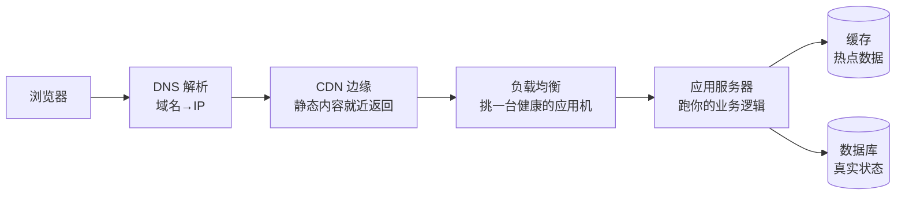

import GlossaryTerm from '@site/src/components/GlossaryTerm';
import GuidedExercise from '@site/src/components/GuidedExercise';
import ResearchNote from '@site/src/components/ResearchNote';
import ChapterMeta from '@site/src/components/ChapterMeta';
import PyRunner from '@site/src/components/PyRunner';
import LatencyNumbers from '@site/src/components/LatencyNumbers';
import TradeoffExplorer from '@site/src/components/TradeoffExplorer';

# L10 · 一次请求的完整链路

<ChapterMeta
  time="约 1.5–2 小时"
  prereqs={[{label: 'L1 延迟数量级', href: './programming-systems-primer'}, {label: 'L9 API 与 HTTP', href: './api-and-http'}]}
  outcome="一张你能亲手画出的“浏览器到数据库”全链路图，并能算出每一跳贡献了多少延迟、哪里加缓存最划算。"
  howToUse="先看延迟数字表建立尺度感，再跑链路延迟计算，理解“关键路径”和缓存的价值。"
/>

:::tip 这一课让你"看见"延迟花在哪
用户说"你的网站好慢"。慢在哪？是 DNS、是网络、是数据库、还是某一跳在等另一跳？这一课教你把一次请求拆成一段段，看清每一段花了多少时间——这是性能优化的起点。
:::

## 一、从回车到看见页面，中间发生了什么

你在浏览器输入网址、按下回车，到看到内容，请求大致经过这一串"跳"：



每一跳都做一件事，也都**贡献一段延迟、都可能失败**。架构优化，本质就是"让请求少碰慢的跳、多碰快的跳"。

## 二、三个核心概念（分层）

### 基础：每一跳是干什么的

- <GlossaryTerm term="DNS" definition="域名系统：把人类可读的域名（example.com）解析成服务器 IP。结果会被缓存，所以不是每次请求都解析。">DNS</GlossaryTerm>：把域名翻译成 IP。
- <GlossaryTerm term="CDN" definition="内容分发网络：在全球边缘节点缓存静态内容（图片、JS、视频），让用户就近获取，大幅降低延迟和源站压力。">CDN</GlossaryTerm>：把静态内容缓存到离用户近的边缘节点。
- <GlossaryTerm term="Load Balancer" definition="负载均衡器：把流量分发到多台健康的应用服务器，实现水平扩展与容错。是无状态服务（L5）能扩展的前提。">负载均衡</GlossaryTerm>：把请求分给多台应用机（这正是 [L5 无状态](./state-and-storage) 的用武之地）。
- 应用服务器：跑你的业务逻辑（L9 的 API）。
- 缓存 / 数据库：[L5 的状态层](./state-and-storage)。

### 进阶：缓存与关键路径

让请求变快最有效的两招：① **加缓存**，让热点数据不必每次都查慢的数据库；② 缩短<GlossaryTerm term="Critical Path" definition="关键路径：一次请求中必须串行完成、决定总耗时的那条最长链路。优化非关键路径不会让请求更快。">关键路径</GlossaryTerm>——只有关键路径上的延迟才决定用户等多久。

先用 L1 的延迟表重新感受一下各跳的数量级差异（尤其"内存 vs 数据库 vs 跨洲网络"）：

<LatencyNumbers />

### 深入（选学）：尾延迟在链路里被放大

一次请求往往要串很多跳、甚至扇出到多个后端。回看 [L1 的《The Tail at Scale》](./programming-systems-primer)：**链路越深、扇出越广，慢尾被命中的概率越大**。还有一个隐形杀手——<GlossaryTerm term="N+1 Problem" definition="N+1 查询问题：为了拿一个列表，先查 1 次拿到 N 项，再为每项各查 1 次，总共 N+1 次往返。是后端慢的最常见原因之一。">N+1 问题</GlossaryTerm>：本该 1 次查询的事，写成了 N+1 次网络往返，延迟成倍增长。

## 三、跟我做一遍：算清每一跳的延迟

<PyRunner
  expect="缓存命中快了"
  code={`# 各跳的典型延迟（毫秒，数量级示意）
stage = {"client_net": 20, "lb": 1, "app": 5, "cache": 2, "db": 30}

def request_latency(cache_hit):
    # 关键路径：网络 -> 负载均衡 -> 应用 -> 缓存；未命中再走数据库
    total = stage["client_net"] + stage["lb"] + stage["app"] + stage["cache"]
    if not cache_hit:
        total += stage["db"]      # 缓存未命中，多一跳慢数据库
    return total

hit = request_latency(True)
miss = request_latency(False)
print("缓存命中:", hit, "ms")
print("缓存未命中:", miss, "ms")
print(f"缓存命中快了 {miss - hit} ms（省掉了数据库那一跳）")`}
/>

**试试**：把 `db` 改成 300ms（数据库变慢），看缓存命中率对平均延迟的影响有多大——这就是为什么大系统痴迷缓存命中率。

## 四、动手 Lab（必做）

打开 `labs/month01/l10_request_path/`：

```bash
python labs/month01/l10_request_path/test_pipeline.py
```

实现请求链路的延迟计算（含缓存短路），以及"扇出 N 个后端：串行 vs 并行"的延迟对比。

<GuidedExercise
  title="练习指引：把延迟拆开算"
  goal="建立“关键路径 + 缓存 + 扇出”的定量直觉——这是性能讨论的语言。"
  hints={[
    '总延迟 = 关键路径上各跳之和；缓存命中就短路掉数据库那一跳。',
    '扇出串行 = N × 单个延迟；并行 = 只等最慢的那个（这里各后端相同就是单个延迟）。',
    '想清楚：DNS 通常被缓存，不是每次都算——关键路径要算"真实会走的跳"。',
    '延迟单位统一用毫秒，别混。'
  ]}
  steps={[
    '实现 request_latency(stages, cache_hit)：命中只走到 cache，未命中再加 db。',
    '实现 fanout_latency(stage_ms, n, parallel)：串行返回 n*stage_ms，并行返回 stage_ms。',
    '写测试：命中 < 未命中、且差值等于 db；并行 < 串行（n>1 时）。',
    '跑到测试全过。'
  ]}
  checks={[
    '你能说出"关键路径"为什么决定总耗时。',
    '你能算出缓存命中省了多少延迟。',
    '你能解释为什么并行扇出比串行快，但会放大尾延迟（L1）。',
    '你能指出 N+1 问题会怎么把延迟拖垮。'
  ]}
/>

## 架构师深潜（Staff+ 视角）

### 1. 每一跳都是一个"可能慢、可能挂"的点

链路上每多一跳，就多一个延迟来源和一个故障点（回扣 [L4 级联失败](./error-handling)）。所以架构师既要用缓存/CDN 缩短关键路径，又要给每一跳配超时和降级。**延迟和可靠性，是同一条链路的两面。**

### 2. 在哪一层加缓存？

<TradeoffExplorer
  title="把数据放哪来加速读"
  dimensions={['延迟下降', '命中率/覆盖', '一致性(新鲜度)', '成本', '实现复杂度']}
  options={[
    {
      name: '不缓存，直查数据库',
      scores: [1, 5, 5, 3, 5],
      note: '永远最新，最简单。但每次都走慢数据库，扛不住高读。',
      whenToUse: '读不多、或数据必须绝对实时（如余额强一致读）。'
    },
    {
      name: '应用内本地缓存',
      scores: [5, 2, 2, 5, 4],
      note: '最快（进程内，纳秒级），但每个实例各存一份、易不一致、重启即失（回扣 L5）。',
      whenToUse: '极热、可容忍短暂陈旧的小数据（配置、字典）。'
    },
    {
      name: '分布式缓存（Redis）',
      scores: [4, 4, 3, 3, 3],
      note: '所有实例共享、命中快。需管理失效与一致性（缓存与 DB 不一致是经典难题）。',
      whenToUse: '绝大多数高读场景的标准缓存层。'
    },
    {
      name: 'CDN 边缘缓存',
      scores: [5, 3, 2, 4, 3],
      note: '把内容推到离用户最近处，跨洲延迟从数百毫秒降到几十。但只适合相对静态/可缓存内容。',
      whenToUse: '静态资源、图片视频、可缓存的 API 响应；全球用户。'
    }
  ]}
/>

### 3. 真实案例：就近接入与多机房

[WhatsApp 的双数据中心](../atlas/whatsapp.mdx) 和 [ChatGPT 的全球边缘接入](../atlas/chatgpt.mdx) 都在做同一件事：**把请求的关键路径尽量缩短、尽量就近**。回看延迟表里"跨洲往返 ≈ 150ms"——这就是为什么全球系统必须在用户附近放节点。

<ResearchNote
  title="规模下，尾延迟决定用户体验"
  source="Dean & Barroso (2013), The Tail at Scale"
  href="https://research.google/pubs/pub40801/"
  insight="一次请求扇出到很多后端时，整体延迟由最慢的那个决定；因此必须用对冲请求、就近副本、缓存等手段专门压制尾延迟，而不是只看平均。"
  application="设计请求链路时，每加一跳/一个扇出，都要问：它的 p99 是多少？会不会成为整条链路的尾巴？这把 L1 的尾延迟思维落到了具体链路上。"
/>

### 4. 架构师深问（给自己 30 分钟）

- 画出你的报名系统从浏览器到数据库的完整链路，标出每一跳的典型延迟和失败时的降级策略。
- 数据库变成瓶颈了，你会先加缓存、加从库、还是分片？依据是什么（读写比、一致性要求）？
- 一个页面要 800ms 才出来，你怎么定位是哪一跳慢？（这把你引向 L12 的分布式追踪。）

## 自检清单

- [ ] 我能画出"浏览器到数据库"的完整链路并说出每跳作用。
- [ ] 我能算出缓存命中/未命中的延迟差。
- [ ] 我能解释关键路径、N+1、扇出尾延迟。
- [ ] 我能说出在哪一层加缓存、各自取舍。

## 常见误解

- **"优化哪里都能变快"**：只有关键路径上的优化才让请求更快。
- **"加缓存就一定快"**：命中率低时缓存反而增加复杂度和不一致风险。
- **"链路越短越好"**：缓存/CDN 是有意"加层"来缩短关键路径，关键看走不走得到慢的跳。

## 延伸阅读

- [Dean & Barroso, The Tail at Scale](https://research.google/pubs/pub40801/)
- [Cloudflare: What is a CDN?](https://www.cloudflare.com/learning/cdn/what-is-a-cdn/)
- [High Scalability（真实系统架构案例）](https://highscalability.com/)
