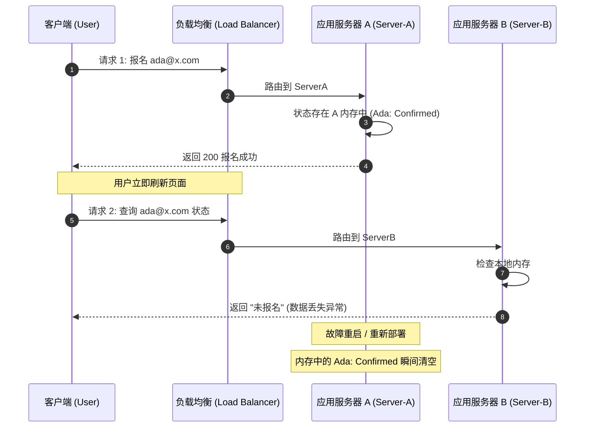
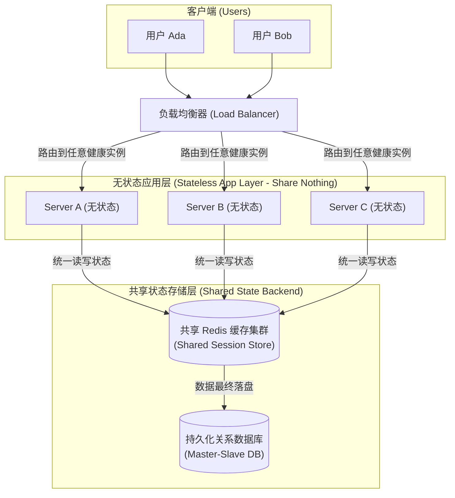
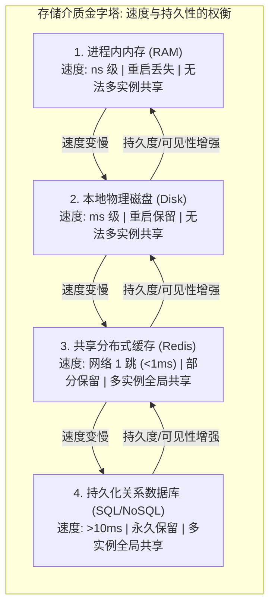

import GlossaryTerm from '@site/src/components/GlossaryTerm';
import GuidedExercise from '@site/src/components/GuidedExercise';
import ResearchNote from '@site/src/components/ResearchNote';
import ChapterMeta from '@site/src/components/ChapterMeta';
import PyRunner from '@site/src/components/PyRunner';
import TradeoffExplorer from '@site/src/components/TradeoffExplorer';
import QuizCard from '@site/src/components/QuizCard';

# L5 · 状态放在哪里

<ChapterMeta
  time="约 1.5–2 小时"
  prereqs={[{label: 'L1 编程如何变成系统', href: './programming-systems-primer'}, {label: 'L2 模块与契约', href: './modules-and-contracts'}]}
  outcome="一个无状态（stateless）的请求处理器：所有状态都外移到共享存储，于是你能随便加机器来扛流量。"
  howToUse="先跑那个“加了一台机器反而出 bug”的演示，理解状态为什么是扩展的拦路虎，再做 lab 把服务改造成无状态。"
/>

:::tip 这一课回答一个扩展难题
你的报名服务火了，你加了第二台机器分担流量。结果用户报名成功后一刷新，系统说"你没报名"。代码没改，只是多了一台机器——**问题出在"状态放错了地方"。**
:::

## 一、加了一台机器，怎么反而坏了？

L1 里我们把报名记录存在一个内存 dict 里，单机跑得很好。现在流量大了，你在前面加了负载均衡，再开一台一模一样的机器。灾难来了：

- 用户的"报名"请求被负载均衡发到了 **A 机器**，A 把记录存进了**自己的内存**。
- 用户刷新，这次请求被发到了 **B 机器**，B 的内存里根本没有这条记录——于是显示"未报名"。
- 更糟：A 机器一重启，内存清空，所有报名**凭空消失**。



> 根因只有一句话：**你把"状态"放在了一个会消失、且别人看不到的地方（单个进程的内存里）。** 这一课就是学会：状态该放哪，才能让"加机器"真正有用。

## 二、三个核心概念（分层）

### 基础：有状态 vs 无状态

<GlossaryTerm term="State" definition="系统保存下来的、跨请求需要记住的事实，比如谁报过名、购物车里有什么、登录会话。">State（状态）</GlossaryTerm> 是跨请求要记住的事实。一个组件如果把状态存在自己内部，它就是<GlossaryTerm term="Stateful" definition="有状态：组件在自己内部保存了跨请求的状态。它的实例之间不可互换，重启会丢状态，难以水平扩展。">有状态的（stateful）</GlossaryTerm>；如果它自己不存状态、每次都从外部拿，它就是<GlossaryTerm term="Stateless" definition="无状态：组件自身不保存跨请求状态，所有状态从外部（数据库/缓存）读写。任意实例可互换，可随意增删，是水平扩展的前提。">无状态的（stateless）</GlossaryTerm>。

**无状态的威力**：如果每台机器都不持有状态，那它们就**完全可互换**——加机器、减机器、某台挂了换一台，对用户毫无影响。这就是水平扩展的前提。

### 进阶：把状态外移到共享后端

解决办法不是"不要状态"（状态总得有人存），而是**把状态从应用进程里搬出去，放到一个所有实例都能访问的共享存储**：数据库、缓存（如 Redis）、对象存储。应用层变成无状态的"纯加工"，状态层单独管理。



这正是 <GlossaryTerm term="Twelve-Factor App" definition="一套广泛采用的云原生应用方法论。其中一条核心原则：应用进程应当无状态，任何需要持久化的数据都交给『后端服务』（数据库、缓存等）。">Twelve-Factor</GlossaryTerm> 的核心原则之一。

<ResearchNote
  title="无状态进程：云原生应用的地基"
  source="The Twelve-Factor App（Processes / Backing Services）"
  href="https://12factor.net/processes"
  insight="Twelve-Factor 方法论主张：应用进程必须是无状态、无共享的（stateless, share-nothing）；任何需要持久化的数据都应存入有状态的后端服务（数据库、缓存）。进程随时可被销毁重建。"
  application="这是『可弹性伸缩、可随时重启、可滚动发布』的前提。你会发现 Kubernetes 自动扩缩容、Serverless 等现代基础设施，全都建立在『应用无状态』这个假设之上。"
/>

### 深入（选学）：状态的层次与"谁来扩展状态层"

把状态外移只是把难题转移了：现在**状态层自己**成了那个有状态、难扩展的部分。状态有一个延迟/持久性的层次（回看 [L1 延迟表](./programming-systems-primer)）：

| 放哪 | 速度 | 重启后还在吗 | 别的实例看得到吗 |
|---|---|---|---|
| 进程内存 | 最快(ns) | ✗ | ✗ |
| 本地磁盘 | 快(ms) | ✓ | ✗ |
| 共享缓存 (Redis) | 快(网络一跳) | 可配置 | ✓ |
| 数据库 | 较慢 | ✓ | ✓ |



而数据库/缓存这种有状态服务怎么扩？靠<GlossaryTerm term="Replication" definition="复制：在多个不同的节点上保存相同数据的完整副本，借此提升系统的读取吞吐量和容错能力。">复制（Replication）</GlossaryTerm>（多副本，读可分摊、单点故障可容忍）和<GlossaryTerm term="Sharding" definition="分片：将数据集按某种 Key（如用户 ID）水平切分为多个独立子集，分别存储在不同节点上，用以扩展写入吞吐量和存储容量。">分片（Sharding）</GlossaryTerm>（按 key 把数据切到多台）。这会引出一致性难题——同步复制慢但一致，异步复制快但副本可能滞后（这是 Month 3 与 CAP 的核心）。

## 三、跟我做一遍：亲眼看状态丢失，再修好

### 坏例子：两台机器各存各的

<PyRunner
  expect="False"
  code={`# 两台一模一样的服务器，各自有自己的内存状态
class Server:
    def __init__(self, name):
        self.name = name
        self.signups = {}          # 进程内状态，别的实例完全看不到

    def signup(self, email):
        self.signups[email] = "confirmed"
        return f"{self.name} 记下了 {email}"

    def has(self, email):
        return email in self.signups

a = Server("Server-A")
b = Server("Server-B")

# 负载均衡把"报名"请求发给了 A
print(a.signup("ada@x.com"))
# 用户刷新时，请求被发给了 B
print("B 知道 ada 报名了吗?", b.has("ada@x.com"))   # 灾难：False`}
/>

### 修好：状态外移到共享存储

<PyRunner
  expect="True"
  code={`# 共享存储：模拟一个所有实例都能访问的外部 Redis / 数据库
class SharedStore:
    def __init__(self):
        self.data = {}

# 服务器变成无状态：自己不存，全部读写共享 store
class Server:
    def __init__(self, name, store):
        self.name = name
        self.store = store

    def signup(self, email):
        self.store.data[email] = "confirmed"

    def has(self, email):
        return email in self.store.data

store = SharedStore()
a = Server("Server-A", store)
b = Server("Server-B", store)

a.signup("ada@x.com")             # 请求打到 A
print("B 知道吗?", b.has("ada@x.com"))   # True：状态在共享层，谁都看得到`}
/>

**试试**：再 new 一个 `Server("Server-C", store)`，不用任何额外操作，它立刻就"知道"所有报名——这就是无状态服务可随意扩容的本质。

## 四、动手 Lab（必做）

打开 `labs/month01/l5_state/`：

```bash
python labs/month01/l5_state/test_state.py
```

把一个有状态的购物车处理器，改造成"无状态 handler + 注入的共享 store"，让任意多个处理器实例共享同一份状态。

<GuidedExercise
  title="练习指引：把服务改造成无状态"
  goal="练习『状态外移 + 依赖注入』，这是水平扩展、滚动发布、Serverless 的共同地基。"
  hints={[
    'handler 函数自己一个变量都别存；状态全从参数 store 读写。',
    '判断是否真无状态：同一个 store 喂给两个不同的调用，它们必须看到同一份数据。',
    '会话用 session_id 区分；不同 session 互不干扰。',
    '想想：如果 store 换成真的 Redis，你的 handler 要改吗？（不该改——这就是 L2 的契约。）'
  ]}
  steps={[
    '实现 SessionStore，有 get(sid) 和 set(sid, value)。',
    '实现 handle_request(session_id, action, store)：从 store 读购物车、按 action 改、写回 store、返回购物车。',
    'action 形如 "add:apple"；handler 内部不得有任何模块级或实例级状态。',
    '写测试：同一 store 跨多次调用购物车累加；两个不同 session 互不影响。',
    '跑到测试全过。'
  ]}
  checks={[
    '你能指出代码里"状态"具体存在哪个对象里。',
    '你能解释为什么无状态 handler 可以随便加实例。',
    '你能说出把 store 从内存换成 Redis 时，handler 为什么一行都不用改。',
    '你能说出状态外移之后，新的瓶颈/难题转移到了哪里（状态层的扩展与一致性）。'
  ]}
/>

## 架构师深潜（Staff+ 视角）

### 1. 无状态是弹性的前提，但状态必须有人扛

"无状态服务"不是消灭状态，而是把状态**集中**到专门的状态层，让无状态的应用层可以无限复制。真正的架构功力在于设计那个状态层。

### 2. 会话状态放哪：一个经典决策

<TradeoffExplorer
  title="用户会话（session）状态放在哪"
  dimensions={['读写速度', '水平扩展', '容错（实例挂了）', '一致性', '实现复杂度']}
  options={[
    {
      name: '进程内内存',
      scores: [5, 1, 1, 5, 5],
      note: '最快，但实例不可互换、重启即丢、加机器即出 bug。',
      whenToUse: '单机原型、或纯缓存（丢了能重建）。生产多实例时几乎不可用。'
    },
    {
      name: 'Sticky Session（会话粘连）',
      scores: [5, 2, 1, 4, 3],
      note: '负载均衡把同一用户始终发到同一台机器，从而能用本地内存。但那台机器一挂，用户会话全丢，扩缩容也别扭。',
      whenToUse: '迁移老系统的过渡方案；不推荐作为长期架构。'
    },
    {
      name: '共享缓存（Redis）',
      scores: [4, 5, 4, 3, 3],
      note: '会话存在外部 Redis，应用彻底无状态、可随意扩缩。需要管理 Redis 的可用性与一致性。',
      whenToUse: '绝大多数 Web 应用的标准做法。'
    },
    {
      name: '数据库',
      scores: [2, 5, 5, 5, 2],
      note: '最持久、最一致，但最慢。常与缓存配合（缓存读、DB 兜底）。',
      whenToUse: '需要强持久化/审计的状态（订单、账户），通常配缓存。'
    }
  ]}
/>

### 3. 状态层怎么扩：复制与分片

<ResearchNote
  title="复制与分片：让状态层也能扩展"
  source="Martin Kleppmann, DDIA 第 5–6 章（Replication / Partitioning）"
  href="https://dataintensive.net/"
  insight="DDIA 系统讲解了状态层的两大扩展手段：复制（多副本，提升读吞吐与容错）和分片（按 key 切分到多节点，提升写吞吐与容量），以及它们带来的一致性与再平衡难题。"
  application="无状态应用层让你『加机器就行』；但状态层一旦要扩，就必须直面复制延迟、分片键选择、再平衡——这是 Month 3 的核心，也是分布式系统真正的难点所在。"
/>

### 4. 真实案例：WhatsApp 把状态放进了内存——但放对了地方

有意思的是，[WhatsApp 案例](../atlas/whatsapp.mdx)用的是 Mnesia——一个**内存**分布式数据库。它看似违背"别把状态放内存"，其实没有：状态在 Mnesia 这个**专门的、分布式的、跨节点可见的状态层**里，而不是藏在某个应用进程的私有变量里。区别正是本课的精髓：**不是"内存"错，而是"私有、易失、别人看不见"错。**

### 5. 架构师深问（给自己 30 分钟）

- 你的报名服务要做到"任意一台机器随时可被销毁重建而用户无感"，状态要怎么摆？画出应用层和状态层。
- 如果用 Redis 存会话，Redis 本身挂了怎么办？（这会把你引向状态层自己的复制与容错。）
- 为什么说"把状态外移"只是把难题从应用层转移到了状态层，而不是消灭了难题？

## 五、章末自测

<QuizCard
  questions={[
    {
      q: '在负载均衡器后面横向扩展多台应用服务器时，用户“登录成功后一刷新又提示未登录”的最底层架构原因是什么？',
      options: [
        '因为前端的 Cookie 会在页面刷新时被浏览器自动清空。',
        '因为将会话状态（Session）保存在了单机应用进程的私有内存中，当下一次请求被负载均衡路由到其他无状态实例时，新实例无法读取原实例的私有状态。',
        '因为负载均衡器（LB）发生了随机丢包，导致请求没有发出去。'
      ],
      answer: 1,
      explain: '私有进程内存是状态共享的死角。在水平扩展的多实例环境中，除非采用粘性会话（Sticky Session，有很多缺点不推荐），否则每一次请求都可能路由到不同的实例。因此必须把状态外移到 Redis 或数据库等共享组件。'
    },
    {
      q: 'Twelve-Factor 方法论主张“应用进程必须是无状态且无共享的”，以下关于它的理解哪一项是正确的？',
      options: [
        '无状态意味着系统运行过程中不能有任何数据状态产生或保存，整套业务必须是完全静态的。',
        '无状态是指应用进程本身不保存任何需要跨请求持久化的数据，进程随时可以被无痛杀死、重建、伸缩，这是高可用的前提。',
        '无状态是指数据只保存在本地磁盘的临时文件夹中，重启后丢了也没关系。'
      ],
      answer: 1,
      explain: '无状态应用进程不持有任何需要持久化的数据，它只扮演“数据加工与转换器”角色。所有状态都委托给共享的外部 backing services。这为滚动部署、动态扩缩容和故障自愈打下了基石。'
    },
    {
      q: '把应用层改造成“完全无状态”之后，原有的设计难题被转移到了哪里？',
      options: [
        '被转移到了如何设计更复杂的 CPU 密集型浮点计算上。',
        '并没有消失，而是被转移到了专门的有状态“状态层”（如 Redis 或数据库），需要面对数据的横向扩展（分片）、高可用多副本（复制）和一致性一致协议等分布式底座难题。',
        '被转移到了如何编写负载均衡的网络路由算法上。'
      ],
      answer: 1,
      explain: '无状态应用由于实例对等，扩展极为简单。但是，容纳所有状态的底层存储（如缓存、数据库）成为了新的扩展瓶颈。为了扩展状态层，必须引入复制（Replication）与分片（Sharding），从而直面分布式一致性难题（Month 3 与 CAP 的核心）。'
    }
  ]}
/>

## 自检清单

- [ ] 我能解释"加了一台机器反而出 bug"的根因。
- [ ] 我的 lab handler 是真无状态的（自己不存任何跨请求状态）。
- [ ] 我能说出会话状态放进程内 / Redis / 数据库各自的取舍。
- [ ] 我能说出状态外移后，新难题（复制、分片、一致性）转移到了哪里。

## 常见误解

- **"无状态就是没有状态"**：错。是应用进程无状态，状态集中到专门的后端。
- **"加机器就能扛更多流量"**：只有无状态服务才成立；有状态服务加机器往往制造 bug。
- **"放内存一定不对"**：要看是不是"私有、易失、不可见"的内存。专门的内存状态层（如 Redis、Mnesia）是合理的。

## 延伸阅读

- [The Twelve-Factor App](https://12factor.net/)
- [Martin Kleppmann, Designing Data-Intensive Applications](https://dataintensive.net/)
- [Redis 官方文档](https://redis.io/docs/latest/)
