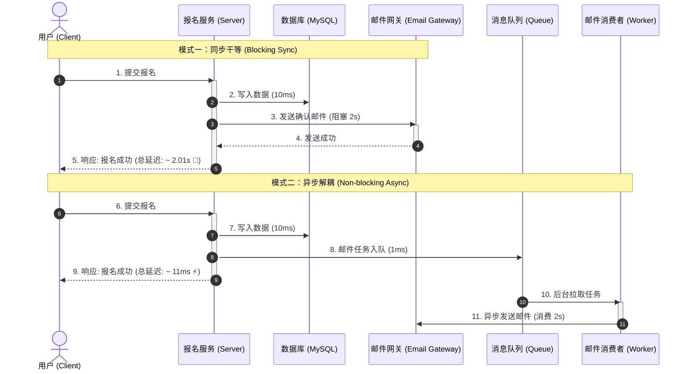
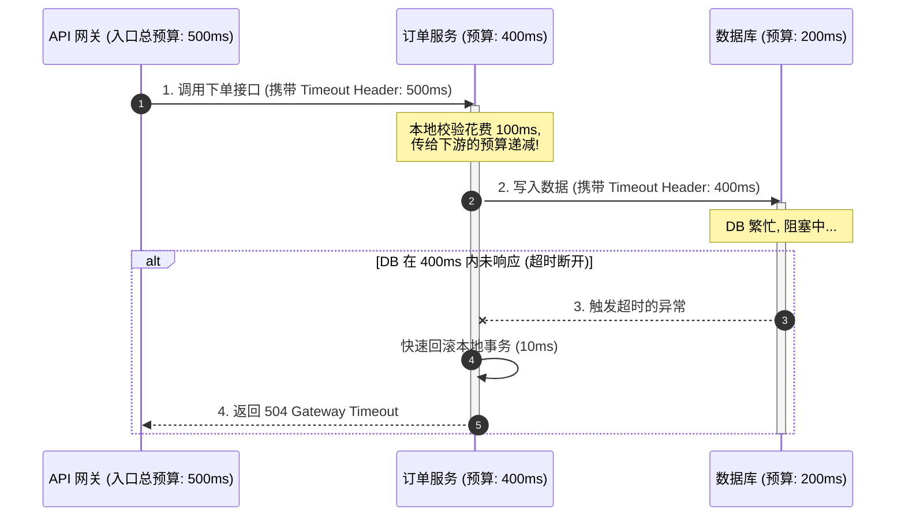
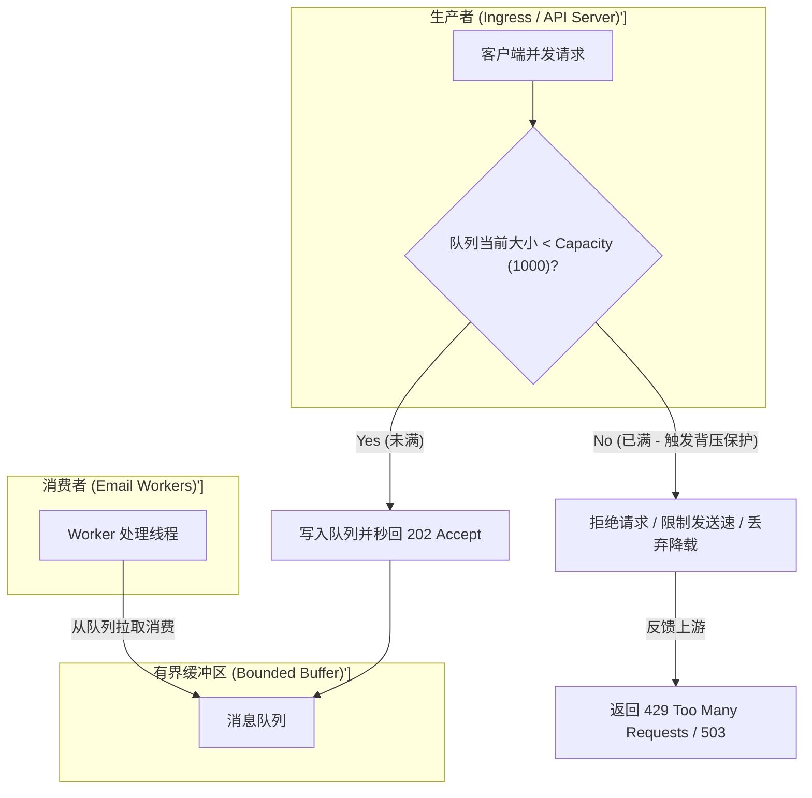

import GlossaryTerm from '@site/src/components/GlossaryTerm';
import GuidedExercise from '@site/src/components/GuidedExercise';
import ResearchNote from '@site/src/components/ResearchNote';
import ChapterMeta from '@site/src/components/ChapterMeta';
import PyRunner from '@site/src/components/PyRunner';
import TradeoffExplorer from '@site/src/components/TradeoffExplorer';
import QuizCard from '@site/src/components/QuizCard';

# L11 · 同步、异步、超时与背压

<ChapterMeta
  time="约 2 小时"
  prereqs={[{label: 'L4 错误与超时', href: './error-handling'}, {label: 'L10 请求链路', href: './request-path'}]}
  outcome="一个用队列把慢任务异步化的报名流程，加上有界队列 + 背压，并能用 Little's Law 估算队列长度。"
  howToUse="先跑“同步等邮件 vs 异步入队”的对比，再理解队列、超时预算和背压怎么保护系统。"
/>

:::tip 这一课的核心比喻
队列是系统的**减震器**。流量突然涌来时，没有队列的系统会被直接撞碎；有队列的系统让请求先排队、慢慢消化。但减震器也有上限——这一课就讲它怎么用、什么时候会爆。
:::

## 一、为什么报名成功要等 5 秒？

用户点"报名"，你的代码做了两件事：①写入报名记录（10ms）；②发一封确认邮件（邮件服务很慢，2 秒）。如果你**同步**地等这两件都做完才回复，用户就要干等 2 秒多——而其实他根本不在乎邮件什么时候到。



正确做法：**报名一写完就立刻返回成功，把"发邮件"丢进队列，让后台慢慢发**。用户体验从 2 秒变成 10 毫秒。这就是异步化。

## 二、三个核心概念（分层）

### 基础：同步 vs 异步

<GlossaryTerm term="Synchronous" definition="同步：调用方必须等被调用的操作全部完成才能继续。慢操作会直接拖慢调用方。">同步</GlossaryTerm> 是"等它做完"；<GlossaryTerm term="Asynchronous" definition="异步：把任务提交后立即返回，结果稍后通过回调/队列/轮询获得。调用方不被慢操作阻塞。">异步</GlossaryTerm> 是"提交后就走，结果稍后再说"。把慢的、用户不必等的任务（发邮件、生成报表、转码视频）异步化，是降低用户感知延迟的第一招。

### 进阶：消息队列、超时预算、背压

<GlossaryTerm term="Message Queue" definition="消息队列：一个存放待处理任务的缓冲区，生产者把任务放进去、消费者慢慢取出处理。实现解耦、削峰填谷、异步处理。">消息队列</GlossaryTerm> 做三件事：**解耦**（生产者不必认识消费者）、**削峰**（突发流量先排队）、**异步**（提交即返回）。

但队列不是万能的。两个必须配套的机制：

- 超时（[回扣 L4](./error-handling)）：每个等待都要有上限，否则资源被永久占住。整条链路要做<GlossaryTerm term="Timeout Budget" definition="超时预算：给整条调用链分配一个总时间，逐层递减下发，确保失败发生得足够快、资源尽早释放。">超时预算分配</GlossaryTerm>。



- <GlossaryTerm term="Backpressure" definition="背压：当下游处理不过来时，向上游传递“慢一点/别再发了”的信号（如拒绝、限流、阻塞），防止系统被压垮。">背压</GlossaryTerm>：当队列满了、下游处理不过来时，要往上游传"我撑不住了"的信号，而不是无限堆积直到内存爆掉。




### 深入（选学）：用 Little's Law 给系统算账

排队不是玄学，有定量规律。<GlossaryTerm term="Little's Law" definition="利特尔法则：稳态下，系统中的平均请求数 L = 到达率 λ × 平均处理时间 W。一个极简却普适的排队论结论。">Little's Law</GlossaryTerm> 说：**系统里平均积压的请求数 L = 到达率 λ × 平均处理时间 W**。

比如每秒来 100 个请求（λ=100），每个平均处理 0.2 秒（W=0.2），那么系统里平均同时有 `L = 100 × 0.2 = 20` 个在处理。如果你的并发能力 < 20，队列就会持续增长直到爆掉——这就是容量规划的起点。

<ResearchNote
  title="把服务做成阶段 + 队列，让过载可控"
  source="Welsh, Culler & Brewer (2001), SEDA: An Architecture for Well-Conditioned, Scalable Internet Services"
  href="https://people.eecs.berkeley.edu/~brewer/papers/SEDA-sosp.pdf"
  insight="SEDA 把服务拆成由队列连接的多个阶段（stage），每个阶段独立调度、可观测、可施加背压。这样在过载时系统能优雅降级，而不是雪崩。"
  application="现代消息驱动架构、流处理、Actor 系统都继承了这个思想：用队列解耦阶段、用背压控制过载。队列不只是异步工具，更是过载防护的结构。"
/>

## 三、跟我做一遍：同步干等 vs 异步入队

<PyRunner
  expect="异步耗时: 10"
  code={`# 同步：用户要等"写记录 + 发邮件"全部做完
def signup_sync(send_email_ms):
    process = 10
    return process + send_email_ms       # 邮件慢，用户跟着干等

# 异步：写完立即返回，发邮件丢进队列后台做
queue = []
def signup_async(send_email_ms):
    process = 10
    queue.append(("send_email", send_email_ms))   # 入队，不等
    return process                                  # 用户只等 10ms

print("同步耗时:", signup_sync(2000), "ms（用户干等邮件）")
print("异步耗时:", signup_async(2000), "ms（邮件后台发）")
print("队列里待处理任务数:", len(queue))`}
/>

**试试**：把发邮件时间改成 8000ms——同步用户要等 8 秒，异步永远是 10ms。慢任务越慢，异步收益越大。

## 四、动手 Lab（必做）

打开 `labs/month01/l11_async/`：

```bash
python labs/month01/l11_async/test_queue.py
```

实现一个有界队列（满了就背压拒绝），以及用 Little's Law 估算队列长度。

<GuidedExercise
  title="练习指引：有界队列 + 背压 + 容量估算"
  goal="把“队列削峰 + 背压防爆 + Little's Law 容量规划”变成可计算的工程直觉。"
  hints={[
    '有界队列：超过容量就返回 False（拒绝/背压），不要无限堆。',
    '背压的意义：宁可明确拒绝一部分，也不要堆到内存爆、全体雪崩。',
    '利特尔法则：L = λ × W，单位要一致（秒、个/秒）。',
    '想想：队列满时拒绝，和队列无限增长，哪个对系统整体更友好？'
  ]}
  steps={[
    '实现 BoundedQueue(capacity)：enqueue(item) 满了返回 False、否则入队返回 True；len() 返回当前长度。',
    '实现 required_concurrency(arrival_rate, avg_service_time)：返回 利特尔法则 的 L = λ × W。',
    '写测试：入队到满后再 enqueue 返回 False；利特尔法则 计算正确。',
    '跑到测试全过。'
  ]}
  checks={[
    '你能解释为什么慢任务要异步化。',
    '你能说出队列满时"背压拒绝"为什么比"无限堆积"好。',
    '你能用 利特尔法则 估算需要多少并发能力。',
    '你能说出超时预算为什么要逐层递减（回扣 L4）。'
  ]}
/>

## 架构师深潜（Staff+ 视角）

### 1. 队列是减震器，但减震器会爆

队列把"瞬时高峰"摊成"平稳处理"，但它有容量上限。一旦生产持续快于消费，队列只会越堆越长、延迟越来越大，最终 OOM 雪崩。所以**有界队列 + 背压/降载**才是完整方案——这正是 [L4 级联失败](./error-handling) 的防线之一。

### 2. 过载了到底怎么办？

<TradeoffExplorer
  title="下游处理不过来时的策略"
  dimensions={['不丢请求', '保护系统', '延迟可控', '用户体验', '实现复杂度']}
  options={[
    {
      name: '无限缓冲（无界队列）',
      scores: [5, 1, 1, 2, 5],
      note: '什么都不丢，但队列无限增长→延迟爆炸→内存耗尽→整体雪崩。看似温柔，实则危险。',
      whenToUse: '几乎从不推荐用于生产在线路径。'
    },
    {
      name: '有界队列 + 背压',
      scores: [3, 5, 4, 3, 3],
      note: '队列满就拒绝/限流，把压力挡在门外，保护核心。代价是高峰期拒绝一部分请求。',
      whenToUse: '绝大多数在线服务的过载防护标准做法。'
    },
    {
      name: '主动降载（load shedding）',
      scores: [2, 5, 5, 3, 3],
      note: '过载时主动丢弃低优先级请求，优先保住高价值流量。延迟最可控。',
      whenToUse: '有明确优先级、宁可拒一部分也要保住核心体验时。'
    },
    {
      name: '自动扩容',
      scores: [5, 4, 4, 5, 2],
      note: '加机器消化高峰（依赖 L5 无状态）。但扩容有延迟、有成本上限，且救不了瞬时尖峰。',
      whenToUse: '可预测的增长/周期性高峰；常与背压配合（扩容前先扛住）。'
    }
  ]}
/>

### 3. 真实案例：队列无处不在

[WhatsApp 的 store-and-forward](../atlas/whatsapp.mdx) 本质就是一个消息队列——收件人离线就排队，上线再投递。[ChatGPT](../atlas/chatgpt.mdx) 在 GPU 前面排队 + 连续批处理，也是队列削峰 + 调度。**几乎每个大系统的核心路径上都有队列。**

<ResearchNote
  title="过载时要主动降级，而不是被动崩溃"
  source="Google SRE Book: Handling Overload"
  href="https://sre.google/sre-book/handling-overload/"
  insight="Google SRE 主张：服务必须在过载时主动降载（shed load）、用客户端侧节流和优雅降级保住核心功能，而不是接受所有请求直到崩溃。"
  application="架构师要把“过载”当成一个必然会发生、必须设计的状态：有界队列、背压、降载、超时，是一套组合拳。这是从“能跑”到“扛得住”的关键一跃。"
/>

### 4. 架构师深问（给自己 30 分钟）

- 你的报名系统在活动开抢瞬间涌入 10 万请求，你用队列削峰。队列该设多大？满了怎么办？（结合 Little's Law 和背压回答。）
- "发确认邮件"异步化后，如果邮件服务挂了，用户已经看到"报名成功"——这个不一致怎么处理？（提示：[L6 幂等](./idempotency) + 重试 + 最终一致。）
- 同步调用链 A→B→C，每层超时都设 10 秒合理吗？怎么做超时预算分配？

## 五、章末自测

<QuizCard
  questions={[
    {
      q: '在分布式架构中，关于有界队列（Bounded Queue）与无界队列（Unbounded Queue）的防过载设计，以下说法哪项是正确的？',
      options: [
        '无界队列能够无限容纳并发请求且不丢失，所以它是防止系统过载宕机的首选方案。',
        '无界队列会导致在持续过载时积压大量任务，使用户感知的请求延迟飙升，且极易耗尽物理内存导致 OOM 雪崩崩溃；应当使用有界队列，满水位时主动触发背压拒绝或主动降载保护系统。',
        '有界队列因为无法扩容，一旦在高峰期满了就会导致所有数据永久丢失。'
      ],
      answer: 1,
      explain: '无界队列是一个典型的架构隐形杀手。若入队速度长于消费速度，任务会无限积压在内存中导致系统整体瘫痪。有界队列搭配背压机制能够在过载时主动划出红线、保护核心资源，是高可用微服务的基石。'
    },
    {
      q: '根据利特尔法则（Little\'s Law: L = λ × W），如果一个报名服务平均每秒接收 500 个并发请求（λ），每个请求的平均处理和写库时间（W）为 0.2 秒，该系统若要维持稳态运行而不造成队列无限膨胀，应用层所需的平均并发能力（L）至少为多少？',
      options: [
        '至少 100 个',
        '至少 500 个',
        '至少 2500 个'
      ],
      answer: 0,
      explain: 'Little\'s Law 公式为 L = λ × W。计算可得：L = 500 × 0.2 = 100。这说明系统在稳态下平均需要并行处理 100 个请求。如果应用服务器的可分配线程池或并发协程数低于 100，队列将无法消化入队流量而崩溃。'
    },
    {
      q: '在微服务同步调用链 A → B → C 中，为什么不应当对每一层接口统一设置相同的静态超时时间（例如统一设为 10 秒）？',
      options: [
        '因为相同的超时设置会在网络传输中引起 HTTP 报文大小的物理碰撞。',
        '因为如果底层 C 发生阻塞，B 在等 C 到 10 秒，A 也在等 B 到 10 秒，会导致整条调用链上的线程和连接资源大面积占满雪崩；应当采用超时预算（Timeout Budget）逐级扣减下发，消耗完即快速失败释放资源。',
        '因为超时预算是为了给数据加解密算法留足 CPU 时间。'
      ],
      answer: 1,
      explain: '统一超时会导致调用链的“慢雪崩”。超时预算机制确保每一层将“入口剩余的总可用时间”下发给下游。一旦由于网络或底层计算耗尽了当前预算，立刻在下游中断并快速失败，从而极速释放上游的等待资源。'
    }
  ]}
/>

## 自检清单

- [ ] 我能说出为什么慢任务要异步化、队列解决什么。
- [ ] 我的 lab 队列满了会背压拒绝，不会无限堆。
- [ ] 我能用 Little's Law 估算并发需求。
- [ ] 我能说出过载时的四种策略及取舍。

## 常见误解

- **"异步就是更快"**：异步不减少总工作量，只是不让用户干等；后台仍要处理。
- **"队列越大越好"**：过大的队列只会把问题变成"高延迟 + 最终雪崩"。
- **"加机器就能扛过载"**：扩容有延迟和上限，瞬时尖峰还得靠背压/降载先扛住。

## 延伸阅读

- [SEDA: Well-Conditioned Scalable Internet Services](https://people.eecs.berkeley.edu/~brewer/papers/SEDA-sosp.pdf)
- [Google SRE Book: Handling Overload](https://sre.google/sre-book/handling-overload/)
- [Little's Law（排队论）](https://en.wikipedia.org/wiki/Little%27s_law)
