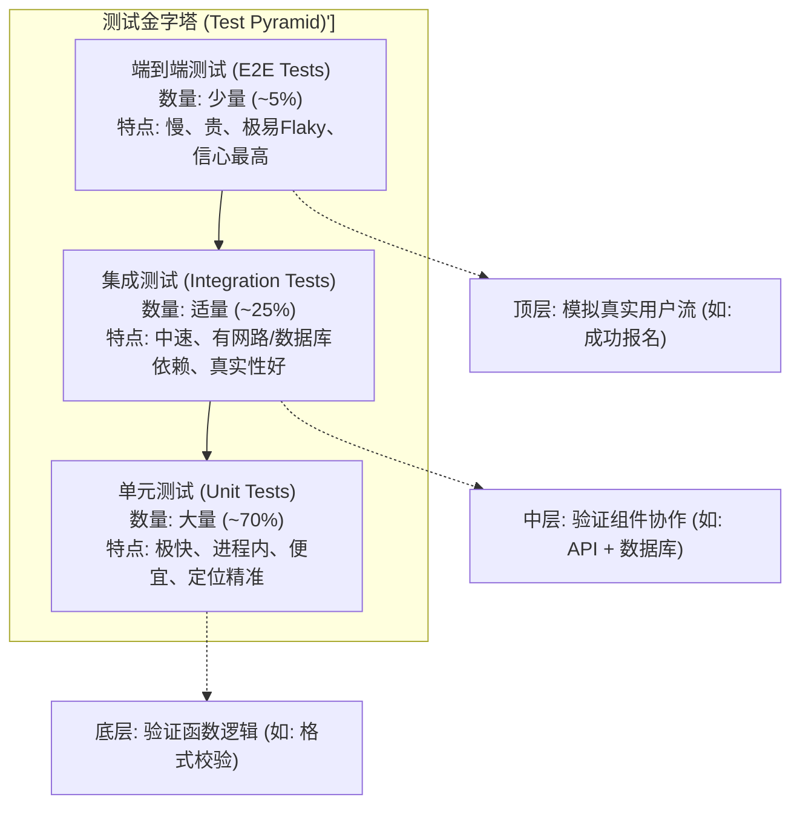
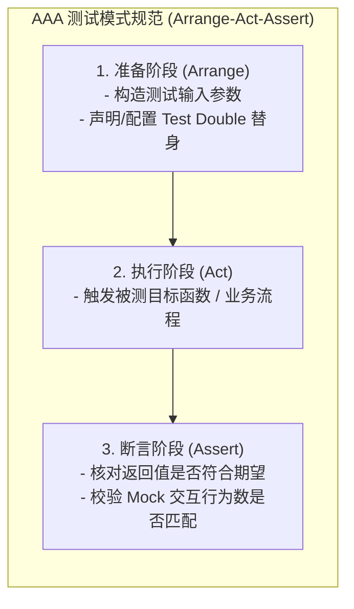
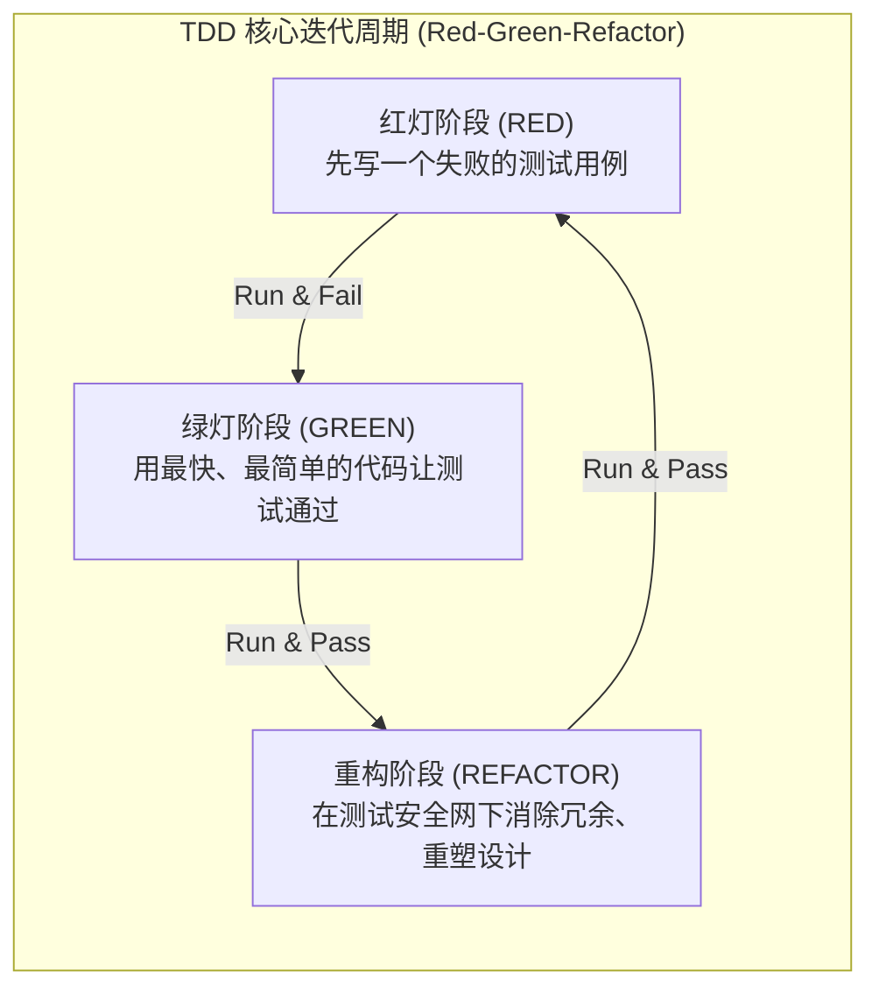

import GlossaryTerm from '@site/src/components/GlossaryTerm';
import GuidedExercise from '@site/src/components/GuidedExercise';
import ResearchNote from '@site/src/components/ResearchNote';
import ChapterMeta from '@site/src/components/ChapterMeta';
import PyRunner from '@site/src/components/PyRunner';
import TradeoffExplorer from '@site/src/components/TradeoffExplorer';
import QuizCard from '@site/src/components/QuizCard';

# L13 · 测试与 TDD

<ChapterMeta
  time="约 1.5–2 小时"
  prereqs={[{label: 'L1 编程如何变成系统', href: './programming-systems-primer'}, {label: 'L4 错误处理', href: './error-handling'}]}
  outcome="会用测试金字塔和 TDD 的红-绿-重构节奏，给一个函数写出能暴露 bug、又是活文档的测试。"
  howToUse="先跑那个“先红后绿”的 TDD 演示，体会“先写测试”的感觉，再做 lab。"
/>

:::tip 你其实一直在写测试
前面每一节 lab 都让你跑 `test_*.py`——那就是测试。这一课把它从"顺手验证"升级成一种**设计方法**：先想清楚"正确长什么样"，再写代码去满足它。
:::

## 一、改一行，崩一片

你给 `create_signup` 改了一行小逻辑，自觉没问题就上线了。结果幂等坏了——重复报名又能占两个名额。你直到用户投诉才发现。**没有测试，每次改动都是在赌"我没碰坏别的东西"。** 测试就是你的安全网：改完一跑，红了就知道哪坏了。

## 二、三个核心概念（分层）

### 基础：测试金字塔与 AAA 结构

<GlossaryTerm term="Test Pyramid" definition="测试金字塔：底层大量快而便宜的单元测试，中层适量集成测试，顶层少量慢而贵的端到端测试。比例像金字塔。">测试金字塔</GlossaryTerm> 告诉你测试的配比：



| 层 | 测什么 | 特点 |
|---|---|---|
| 单元测试（多） | 单个函数/类的逻辑 | 快、便宜、定位准 |
| 集成测试（中） | 多个组件一起（如带数据库） | 慢一点、更真实 |
| 端到端测试（少） | 整个系统走一遍 | 最慢最贵、最像真实用户 |

每个测试都遵循 <GlossaryTerm term="AAA Pattern" definition="测试的三段式结构：Arrange（准备数据）、Act（执行被测操作）、Assert（断言结果）。让测试清晰、可读。">AAA</GlossaryTerm>：准备（Arrange）→ 执行（Act）→ 断言（Assert）。



### 进阶：TDD 红-绿-重构

<GlossaryTerm term="TDD" definition="测试驱动开发：先写一个会失败的测试（红），再写最少的代码让它通过（绿），最后在测试保护下重构。循环往复。">TDD</GlossaryTerm> 把顺序倒过来——**先写测试，再写实现**：

1. **红**：写一个描述期望行为的测试，跑，它失败（因为还没实现）。
2. **绿**：写最少的代码让它通过。
3. **重构**：在测试保护下清理代码，再跑确认还绿。



好处：你被迫先想清楚"正确是什么"，而且永远有一张网。还要分清<GlossaryTerm term="Test Double" definition="测试替身：用来替代真实依赖的假对象。常见有 stub（返回预设值）、mock（验证交互）、fake（轻量真实实现，如内存数据库）。">测试替身</GlossaryTerm>（mock/stub/fake），让单元测试不依赖慢的真实数据库。

### 深入（选学）：属性测试与"测试是活文档"

举例测试只覆盖你想到的几个用例；<GlossaryTerm term="Property-based Testing" definition="属性测试：不写具体用例，而是描述输入应满足的性质（如“解析后再格式化应还原”），由框架自动生成大量随机输入去验证。能发现你没想到的边界。">属性测试</GlossaryTerm> 让框架生成成百上千随机输入，去验证一条"性质"（如"任何合法金额，解析再格式化应还原"），常能逼出你没想到的边界 bug。而且好测试本身就是**最准确的文档**：它精确描述了代码该怎么用、边界在哪。

<ResearchNote
  title="测试金字塔：把测试投资放在对的层级"
  source="Martin Fowler, The Practical Test Pyramid"
  href="https://martinfowler.com/articles/practical-test-pyramid.html"
  insight="Fowler 总结：单元测试要多（快、稳、定位准），端到端测试要少（慢、脆、贵）。倒金字塔（一堆 E2E、很少单元）会让测试套件又慢又易碎，拖垮迭代速度。"
  application="测试不是越多越好，而是要放在对的层级。架构师要让团队的测试组合既能快速反馈，又能覆盖关键集成路径——这直接决定交付速度（见 DORA / L14）。"
/>

## 三、跟我做一遍：先红后绿（TDD）

<PyRunner
  expect="绿"
  code={`# 第 1 步（红）：先写测试，描述期望——此时 to_cents 还没实现
def to_cents(s):
    pass  # 还没写

def test_to_cents():
    assert to_cents("12.50") == 1250
    assert to_cents("0") == 0

try:
    test_to_cents()
    print("红？不，居然过了？")
except Exception as e:
    print("红：测试失败（符合预期，因为还没实现）:", type(e).__name__)

# 第 2 步（绿）：写最少的代码让它通过
def to_cents(s):
    return round(float(s) * 100)

test_to_cents()
print("绿：实现后测试通过 ✓")`}
/>

**试试**：先加一句 `assert to_cents("￥12.50") == 1250`（带货币符号），看它变红，再去改 `to_cents` 让它变绿——这就是 TDD 的循环。

## 四、动手 Lab（必做）

打开 `labs/month01/l13_testing/`：

```bash
python labs/month01/l13_testing/test_money.py
```

实现一个 `parse_amount`，把金额字符串解析成"分"，并正确拒绝各种非法输入。先读测试（它就是规格），再写实现。

<GuidedExercise
  title="练习指引：用测试当规格写函数"
  goal="体会“测试先行”——先让测试定义正确，再让实现满足它，并学会列边界用例。"
  hints={[
    '先把测试通读一遍，它就是这个函数的精确规格。',
    '正常用例和异常用例都要处理：空串、非数字、负数都要抛 AmountError。',
    '货币符号（￥/$）要先剥掉再解析。',
    '做完后，自己再加一个测试用例（比如带千分位逗号），体会发现新边界的感觉。'
  ]}
  steps={[
    '实现 parse_amount(s)：去空格、剥掉开头的 ￥ 或 $。',
    '空串抛 AmountError；不能转成数字抛 AmountError；负数抛 AmountError。',
    '合法则返回 round(value * 100)（分）。',
    '跑测试到全过，再自行补一个边界用例。'
  ]}
  checks={[
    '你能说出测试金字塔三层各测什么。',
    '你能描述 TDD 的红-绿-重构循环。',
    '你能区分 mock / stub / fake。',
    '你能解释为什么"好测试是活文档"。'
  ]}
/>

## 架构师深潜（Staff+ 视角）

### 1. 测试组合是一种经济学

<TradeoffExplorer
  title="测试投资放在哪一层"
  dimensions={['反馈速度', '稳定性(不flaky)', '真实性/信心', '维护成本', '定位精度']}
  options={[
    {
      name: '单元测试（金字塔底）',
      scores: [5, 5, 2, 5, 5],
      note: '毫秒级、稳定、坏了立刻知道是哪个函数。但测不出组件间的集成问题。',
      whenToUse: '逻辑分支、边界、纯函数——应当是测试的大多数。'
    },
    {
      name: '集成测试（中层）',
      scores: [3, 3, 4, 3, 3],
      note: '带上真实数据库/外部依赖，能抓住接口不匹配。慢一些、偶尔 flaky。',
      whenToUse: '关键的跨组件路径（API + DB + 缓存）。适量即可。'
    },
    {
      name: '端到端测试（金字塔顶）',
      scores: [1, 1, 5, 1, 1],
      note: '最像真实用户、信心最高，但最慢、最易碎、坏了最难定位。',
      whenToUse: '只覆盖最关键的几条用户主流程（如"能成功报名"）。'
    }
  ]}
/>

### 2. Flaky 测试比没测试更糟

时好时坏的<GlossaryTerm term="Flaky Test" definition="不稳定测试：同样代码有时通过有时失败（常因依赖时间、随机、并发、外部服务）。会让团队不再信任测试。">flaky 测试</GlossaryTerm> 会让团队逐渐"狼来了"、不再信任红灯。根源常是 [L8 的竞态](./concurrency-basics)、依赖真实时间/网络。**确定性**是测试的生命线——这也是为什么分布式系统会用"确定性模拟测试"在可控环境里重放并发与故障。

<ResearchNote
  title="给分布式系统注入故障来测试它"
  source="Jepsen（Kyle Kingsbury）：分布式系统一致性测试"
  href="https://jepsen.io/"
  insight="Jepsen 通过在真实分布式数据库上注入网络分区、时钟偏移、节点崩溃，系统性地验证它们是否真的满足所宣称的一致性。结果发现了大量数据库的严重正确性 bug。"
  application="对分布式系统，光测“正常路径”远远不够——必须主动注入故障（回扣 L4 失败思维）。架构师要把“在故障下是否仍正确”当成一类必须测试的属性。"
/>

### 3. 真实案例：测试让小团队敢改大系统

[WhatsApp](../atlas/whatsapp.mdx) 几十人维护十亿用户系统，靠的不只是 Erlang，还有自动化测试 + 用生产流量做负载测试，让每次改动都有网兜着。**测试是"小团队驾驭大系统"的杠杆之一。**

### 4. 架构师深问（给自己 30 分钟）

- 给你前面写的报名服务设计测试组合：哪些用单元、哪些用集成、哪条走 E2E？比例如何？
- 一个测试偶尔失败，团队倾向"重跑一下就过了"。这是什么信号？你会怎么根治？
- 覆盖率 100% 就等于没 bug 吗？为什么覆盖率是有用但会误导的指标？

## 五、章末自测

<QuizCard
  questions={[
    {
      q: '在构建持续集成（CI/CD）的自动化测试防护网时，为什么大量编写端到端（E2E）测试而不是单元测试（即所谓“冰淇淋蛋筒/倒金字塔”模式）会阻碍团队交付？',
      options: [
        '因为 E2E 测试完全无法被集成到任何现代持续集成构建服务器中。',
        '因为 E2E 测试运行极慢（动辄数十分钟）、受网络与数据环境影响极易出现 Flaky（不稳定失败），且在出错时调用链太长，导致开发极难迅速定位具体故障代码行，极大地拉长了反馈周期。',
        '因为端到端测试覆盖了真实的数据库，导致代码会在运行后自动格式化硬盘。'
      ],
      answer: 1,
      explain: 'E2E 虽最具信心，但其“脆、慢、贵”的属性注定只能作为金字塔塔尖覆盖主路径。大量边界逻辑、状态分支应当主要由进程内、毫秒级响应、确定性极高的单元测试来进行高比例覆盖。'
    },
    {
      q: '在测试替身（Test Double）中，Stub、Mock 与 Fake 的核心区别是什么？',
      options: [
        'Stub 重在提供预设的虚构返回值（控制输入）；Mock 重在验证被测代码与外部组件是否发生了预期的交互行为及次数（校验输出/行为）；Fake 则是一个可运行的、但经过极度简化的轻量实现（如用内存字典实现 FakeDB 隔离磁盘）。',
        'Stub 是专门为 Python 设计的，Mock 是为了 JavaScript 开发的，Fake 则是专用于 Go 语言的术语。',
        '它们只是历史遗留的完全相同的概念，彼此没有任何区别。'
      ],
      answer: 0,
      explain: '这是 Martin Fowler 经典的分类法。Stub 扮演被动的“状态供给者”；Mock 扮演主动的“契约核对者”；Fake 是“麻雀虽小五脏俱全”的替代介质，通常用于极速拉起无物理副作用的本地测试。'
    },
    {
      q: '在测试驱动开发（TDD）的红-绿-重构循环中，为什么强调必须在“红灯（RED）”状态下编写测试？',
      options: [
        '因为 TDD 的规范框架要求只有在失败时才会自动执行代码格式化。',
        '因为“红灯”能有效证实新编写的测试本身是具有断言排错能力的，避免测试写错导致代码不管对错都“永远通过”的假阴性问题；同时迫使开发在写代码前站在“调用者”视角想清接口契约。',
        '因为先写测试可以让生产代码的运行效率自动提升 50%。'
      ],
      answer: 1,
      explain: '在写实现前先写测试，能起到“规格定义”的作用。同时，亲眼见到测试因为缺少实现而“红灯失败”，能够验证你的测试确实有能力捕获该特定行为的缺失，防止写出“永远通过”的废测试。'
    }
  ]}
/>

## 自检清单

- [ ] 我能说出测试金字塔三层的配比与理由。
- [ ] 我能用红-绿-重构写一个小功能。
- [ ] 我的 lab 测试覆盖了正常和异常用例。
- [ ] 我能解释 flaky 测试的危害和根因。

## 常见误解

- **"测试是写完代码后的额外负担"**：TDD 把它变成设计工具，且长期省下大量调试时间。
- **"E2E 测试越多越保险"**：倒金字塔会让套件又慢又脆，拖垮迭代。
- **"覆盖率高就安全"**：覆盖率只说"代码被执行过"，不说"断言是否有意义"。

## 延伸阅读

- [Martin Fowler, The Practical Test Pyramid](https://martinfowler.com/articles/practical-test-pyramid.html)
- [Jepsen: 分布式系统一致性测试](https://jepsen.io/)
- [Hypothesis（Python 属性测试库）](https://hypothesis.readthedocs.io/)
