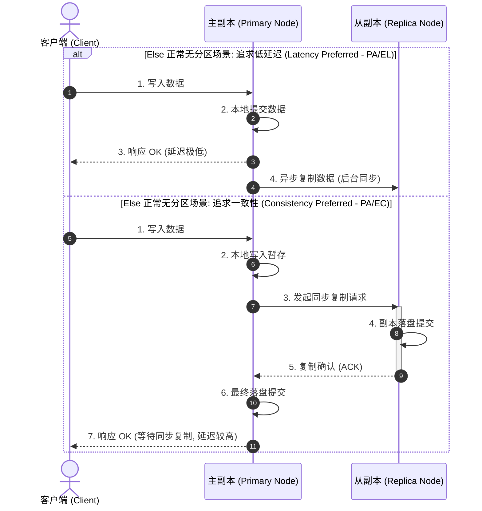

import GlossaryTerm from '@site/src/components/GlossaryTerm';
import GuidedExercise from '@site/src/components/GuidedExercise';
import ResearchNote from '@site/src/components/ResearchNote';
import ChapterMeta from '@site/src/components/ChapterMeta';
import PyRunner from '@site/src/components/PyRunner';
import TradeoffExplorer from '@site/src/components/TradeoffExplorer';
import QuizCard from '@site/src/components/QuizCard';

# M2L6 · CAP 与一致性模型

<ChapterMeta
  time="约 2 小时"
  prereqs={[{label: 'L5 状态与复制', href: '../foundations/state-and-storage'}, {label: 'M2L4 可用性', href: './sla-slo-availability'}]}
  outcome="能解释 CAP 在网络分区时强迫你做的二选一、区分强一致与最终一致，并知道 PACELC 补充了什么。"
  howToUse="先跑“分区时 CP vs AP”的演示，理解这个二选一，再做 lab，最后看一致性模型谱系。"
/>

:::tip 这一课讲一个无法回避的取舍
只要你的数据存在多个节点上，网络就**一定**会在某个时刻把它们隔开（分区）。那一瞬间，你必须二选一：要么拒绝服务、保证大家看到的数据一致；要么继续服务、但有人可能看到旧数据。没有第三种。
:::

## 一、网络断了，你的系统怎么办？

你的数据复制在两个机房。某天它们之间的网络断了（<GlossaryTerm term="Network Partition" definition="网络分区：分布式系统中节点之间的网络中断，导致它们无法通信但各自仍在运行。在大规模系统里这是必然会发生的，不是会不会，而是何时。">网络分区</GlossaryTerm>）。用户在 A 机房写了数据，B 机房还不知道。这时有人从 B 机房读——你怎么办？

- **拒绝他**：宁可报错，也不返回可能过时的数据（保一致）。
- **服务他**：返回 B 机房现有的（可能旧的）数据（保可用）。

```mermaid
flowchart TD
  subgraph CPPartition["CP 系统（一致性优先 - Partitioned）"]
    direction TB
    ClientA_CP["客户端 A"] -->|1. 写入数据 X=1| NodeA_CP["节点 A (主)"]
    NodeA_CP -.-x|2. 网络分区中断 (无法同步)| NodeB_CP["节点 B (从)"]
    NodeA_CP -->|3. 同步失败, 报错拒绝| ClientA_CP
    ClientB_CP["客户端 B"] -->|4. 读取数据| NodeB_CP
    NodeB_CP -->|5. 锁定/返回错误 (保一致性)| ClientB_CP
  end
```

```mermaid
flowchart TD
  subgraph APPartition["AP 系统（可用性优先 - Partitioned）"]
    direction TB
    ClientA_AP["客户端 A"] -->|1. 写入数据 X=1| NodeA_AP["节点 A"]
    NodeA_AP -.-x|2. 网络分区中断 (无法同步)| NodeB_AP["节点 B"]
    NodeA_AP -->|3. 单侧写入成功, 返回 OK| ClientA_AP
    ClientB_AP["客户端 B"] -->|4. 读取数据| NodeB_AP
    NodeB_AP -->|5. 返回旧数据 X=0 (保可用性)| ClientB_AP
  end
```

**你只能选一个。** 这就是 CAP 定理的核心。

## 二、三个核心概念（分层）

### 基础：CAP 定理

<GlossaryTerm term="CAP Theorem" definition="CAP 定理：分布式系统在 Consistency（一致性）、Availability（可用性）、Partition tolerance（分区容忍）三者中，发生网络分区时最多同时满足两个。由于分区不可避免，实际是在分区发生时于 C 和 A 之间二选一。">CAP 定理</GlossaryTerm> 说：一致性（C）、可用性（A）、分区容忍（P）三者，**分区发生时最多保住两个**。但分区（P）在分布式系统里不可避免，所以真正的选择是：**分区时，要 C 还是要 A？**

- <GlossaryTerm term="CP System" definition="CP 系统：分区发生时优先保证一致性，宁可拒绝部分请求（牺牲可用性）。适合金融、库存等正确性至上的场景。">CP</GlossaryTerm>：分区时保一致，宁可拒绝服务（如银行余额、库存）。
- <GlossaryTerm term="AP System" definition="AP 系统：分区发生时优先保证可用性，继续响应但可能返回旧数据（牺牲强一致）。适合点赞数、feed、购物车等可容忍短暂不一致的场景。">AP</GlossaryTerm>：分区时保可用，继续服务但可能旧数据（如点赞数、feed）。

### 进阶：一致性模型谱系

"一致性"不是非黑即白，而是一个谱系：

| 模型 | 含义 | 例子 |
|---|---|---|
| <GlossaryTerm term="Linearizability" definition="线性一致性（强一致性）：分布式系统中最高级别的一致性保证。要求所有读请求都能读到最近一次成功写入的值，系统在外界看来像只有一个单机单副本节点一样。">强一致</GlossaryTerm> | 写完后所有人立刻读到最新 | 银行余额 |
| 读己之写 | 你自己能读到自己刚写的 | 发帖后自己立刻看到 |
| 最终一致 | 一段时间后所有副本趋于一致 | 点赞数、feed |

<GlossaryTerm term="Eventual Consistency" definition="最终一致性：不保证立刻一致，但在没有新写入的情况下，所有副本最终会收敛到同一状态。用短暂的不一致换取高可用和低延迟。">最终一致性</GlossaryTerm> 是 AP 系统的常态——用"短暂看到旧数据"换取高可用和低延迟。

### 深入（选学）：CAP 不够用，PACELC 更完整

CAP 只说了"分区时"。但**即使没有分区**，你也在做取舍：要强一致，副本间就得同步等待（高延迟）；要低延迟，就只能放松一致性。这就是 <GlossaryTerm term="PACELC" definition="PACELC 定理：在分区(P)时于可用性(A)和一致性(C)间取舍；否则(E, Else)在延迟(L)和一致性(C)间取舍。比 CAP 更完整，因为它涵盖了没有分区的正常情况。">PACELC</GlossaryTerm>：**分区时 A vs C；否则（Else）延迟 vs C。** 它解释了为什么很多系统平时也选择放松一致性来换低延迟。



<ResearchNote
  title="CAP：从猜想到被证明的定理"
  source="Gilbert & Lynch (2002), Brewer's Conjecture and the Feasibility of Consistent, Available, Partition-Tolerant Web Services"
  href="https://groups.csail.mit.edu/tds/papers/Gilbert/Brewer2.pdf"
  insight="Brewer 在 2000 年提出 CAP 猜想；Gilbert 与 Lynch 在 2002 年给出形式化证明：在异步网络且允许消息丢失时，无法同时保证一致性与可用性。它把“分区时必须取舍”变成了数学事实。"
  application="CAP 让架构师明白：高可用和强一致不可兼得（分区时）。设计时必须按业务显式选择——余额用 CP、点赞用 AP。后来的 PACELC（Abadi）进一步提醒你：即使平时，也在用一致性换延迟。"
/>

## 三、跟我做一遍：分区时的 CP vs AP

<PyRunner
  expect="AP 继续服务"
  code={`def respond(mode, partitioned):
    if not partitioned:
        return "ok（正常：既可用又一致）"
    if mode == "CP":
        return "error（拒绝服务，保一致）"
    if mode == "AP":
        return "stale_ok（继续服务，可能返回旧数据）"

print("正常时:", respond("CP", False))
print("分区时 CP:", respond("CP", True))
print("分区时 AP:", respond("AP", True))
print("AP 继续服务" if "stale" in respond("AP", True) else "?")`}
/>

正常时两种都岁月静好；**只有分区那一刻，CP 和 AP 才分道扬镳**。这就是为什么 CAP 是"分区时"的取舍。**试试**：想想银行转账该用哪种、朋友圈点赞数该用哪种。

## 四、动手 Lab（必做）

打开 `labs/month02/m2l6_cap/`：

```bash
python labs/month02/m2l6_cap/test_cap.py
```

实现 CAP 决策逻辑，并给几个真实场景判断该选 CP 还是 AP。

<GuidedExercise
  title="练习指引：把 CAP 取舍写成判断逻辑"
  goal="把“分区时二选一”和“按业务选 C 或 A”变成清晰的决策——这是数据系统选型的核心判断。"
  hints={[
    '没有分区时，CP 和 AP 都返回正常。',
    'CP 在分区时拒绝（保一致）；AP 在分区时返回可能旧的数据（保可用）。',
    '场景判断：钱/库存这类不能错的 → CP；点赞/浏览数/feed → AP。',
    '想想"读己之写"：发帖后自己要立刻看到，但别人晚几秒无所谓。'
  ]}
  steps={[
    '实现 respond(mode, partitioned)：未分区返回 "ok"；分区时 CP 返回 "error"、AP 返回 "stale"。',
    '实现 recommend(scenario)：对 "bank_balance"/"inventory" 返回 "CP"，对 "likes"/"feed" 返回 "AP"。',
    '写测试覆盖未分区、CP 分区、AP 分区、以及各场景推荐。',
    '跑到全过。'
  ]}
  checks={[
    '你能解释为什么"分区时"才需要二选一。',
    '你能给一个业务场景判断该选 CP 还是 AP。',
    '你能区分强一致、读己之写、最终一致。',
    '你能说出 PACELC 比 CAP 多覆盖了什么情况。'
  ]}
/>

## 架构师深潜（Staff+ 视角）

### 1. 现代数据库大多是"可调一致性"

很多系统不是死的 CP 或 AP，而是**可调**：同一个数据库，你可以对"转账"用强一致读、对"商品浏览数"用最终一致读。架构师的工作是**按数据的业务重要性，分别选一致性级别**，而不是全局一刀切。

### 2. CP / AP / 可调，怎么选

<TradeoffExplorer
  title="分区时的一致性策略"
  dimensions={['数据正确性', '可用性', '延迟', '实现复杂度', '适用数据']}
  options={[
    {
      name: 'CP（一致优先）',
      scores: [5, 2, 3, 3, 3],
      note: '分区时拒绝写/读以保证不出错。正确性最高，但分区时部分功能不可用。',
      whenToUse: '钱、库存、订单状态——错了代价极大的数据。'
    },
    {
      name: 'AP（可用优先）',
      scores: [2, 5, 5, 3, 3],
      note: '分区时继续服务、最终一致。永远在线、低延迟，但可能短暂看到旧值。',
      whenToUse: '点赞、浏览数、feed、购物车——能容忍短暂不一致的数据。'
    },
    {
      name: '可调一致性（按数据分级）',
      scores: [4, 4, 4, 1, 5],
      note: '同一系统里，重要数据强一致、次要数据最终一致。最贴合现实，但设计与运维更复杂。',
      whenToUse: '大多数真实大系统——不同数据有不同正确性要求时。'
    }
  ]}
/>

### 3. 真实案例：消息系统的一致性选择

[WhatsApp](../atlas/whatsapp.mdx) 的消息投递倾向可用与最终一致（消息最终一定送达、顺序最终一致），而不是为强一致牺牲"永远在线"。对照银行系统的 CP 取向——**同样是分布式，业务不同，CAP 选择就不同**。这正是架构判断力。

### 4. 架构师深问（给自己 30 分钟）

- "设计一个微信"：消息已读状态、点赞数、转账（如果有），分别该 CP 还是 AP？
- 用户发了一条朋友圈，自己刷新没看到会很困惑——你怎么用"读己之写"在 AP 系统里救这个体验？
- PACELC 告诉你"平时也在用一致性换延迟"。举一个你用过的 App，它平时为了快牺牲了什么一致性？

## 自检清单

- [ ] 我能解释 CAP 为什么是"分区时"的二选一。
- [ ] 我能给业务场景判断该选 CP 还是 AP。
- [ ] 我能区分强一致 / 读己之写 / 最终一致。
- [ ] 我知道 PACELC 补充了"没有分区时延迟 vs 一致性"。

## 常见误解

- **"CAP 是三选二"**: 网络分区 P 在物理世界分布式环境中由于交换机抖动、光纤挖断、垃圾回收停顿（GC Pause）是不可避免的。因此不是“三选二”，而是在“分区发生时”（P），你的系统必须在一致性（C）与可用性（A）之间进行二选一。
- **"买了极贵极稳定的专用光纤/云网络就不会分区"**: 无论是多么高级的硬件，网络延迟抖动或软件层面的长 GC 导致的“虚假分区”（一侧节点以为另一侧挂了）永远存在。分布式软件设计必须在逻辑层做好 CP/AP 容灾规划。
- **"最终一致 = 不可靠"**: 最终一致性只是让副本复制的过程异步化。虽然在微秒或秒级窗口期内会读取到旧状态，但这能极大换取极低的写入延迟与多副本的高容灾可用性，适合绝大多数非金融强记账业务。
- **"系统要么 CP 要么 AP"**: 现代企业级分布式系统（如 DynamoDB、Cassandra）大多支持可调一致性（Tunable Consistency）。对于转账等重要链路，采用强一致读写配置；对于个人社交状态、点赞等非核心操作，采用最终一致性配置，而非全局死板地一刀切。

## 五、章末自测

<QuizCard
  questions={[
    {
      q: '分布式系统遭遇‘网络分区（Network Partition）’时，CP 系统与 AP 系统在抉择上的本质区别是什么？',
      options: [
        'CP 系统直接切断单机电源，AP 系统则继续给单机增加内存。',
        'CP 系统优先保证强一致性，为了防止数据发生不一致，宁可向用户报错（牺牲可用性）；AP 系统优先保证高可用，即使网络隔断无法同步，依然接受写入并返回旧数据（牺牲强一致）。',
        'CP 系统在没有分区时依然报错，AP 系统在有分区时也能够保证强一致性。'
      ],
      answer: 1,
      explain: 'CAP 定理表明，在发生分区 P 的前提下，一致性 C 与可用性 A 互为消长。CP 选择在网络恢复同步前拦截一切不一致读写；AP 则允许各个孤立的分区继续响应请求，待网络恢复后再合并解决不一致。'
    },
    {
      q: 'PACELC 定理在分布式系统设计中，比传统的 CAP 定理补充了哪个至关重要的日常场景？',
      options: [
        '补充了‘如果没有网络分区（Else）’时，系统在‘延迟（Latency）’和‘一致性（Consistency）’之间的常态取舍。',
        '补充了当系统遭遇 CPU 100% 满载时的熔断表现。',
        '补充了在完全离线状态下移动端 APP 的离线缓存机制。'
      ],
      answer: 0,
      explain: 'CAP 只探讨了‘分区时’的灾难抉择。然而，系统在 99% 的时间里是没有分区的。PACELC 补充了‘正常无分区时’（Else）的取舍：若要保证读写强一致，就必须同步等待副本复制（高延迟 Latency）；若要极低延迟，就必须异步复制（放松一致性）。'
    },
    {
      q: '在线性一致性（Linearizability）与最终一致性（Eventual Consistency）的谱系中，‘读己之写（Read-Your-Own-Writes）’解决的是什么用户体验问题？',
      options: [
        '保证全世界所有用户都能在同一毫秒看到该用户发出的新内容。',
        '保证发帖用户自己提交数据后，刷新页面能立刻看到自己的帖子（即使其他用户可能要晚几秒才能看到），从而避免用户以为‘提交失败’而重复点击。',
        '保证系统的写 QPS 永远保持在单库几十万次的高位。'
      ],
      answer: 1,
      explain: '读己之写是一种会话级一致性。对于社交网络等应用，最终一致性对旁观者是可以容忍的（朋友圈点赞晚几秒出来），但如果用户自己发完状态刷新却看不见，就会产生‘系统丢数据’的恐慌。该模型能够提供定制的客户端路由来保障发帖者自身的体验。'
    }
  ]}
/>

## 延伸阅读

- [Gilbert & Lynch, CAP 证明](https://groups.csail.mit.edu/tds/papers/Gilbert/Brewer2.pdf)
- [Daniel Abadi, PACELC](https://en.wikipedia.org/wiki/PACELC_theorem)
- [下一课：扩展策略](./scaling-strategies)
