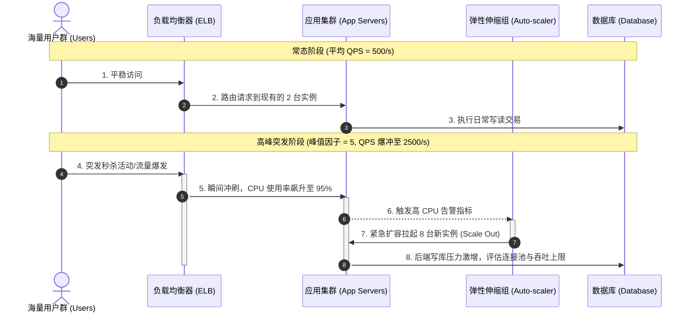
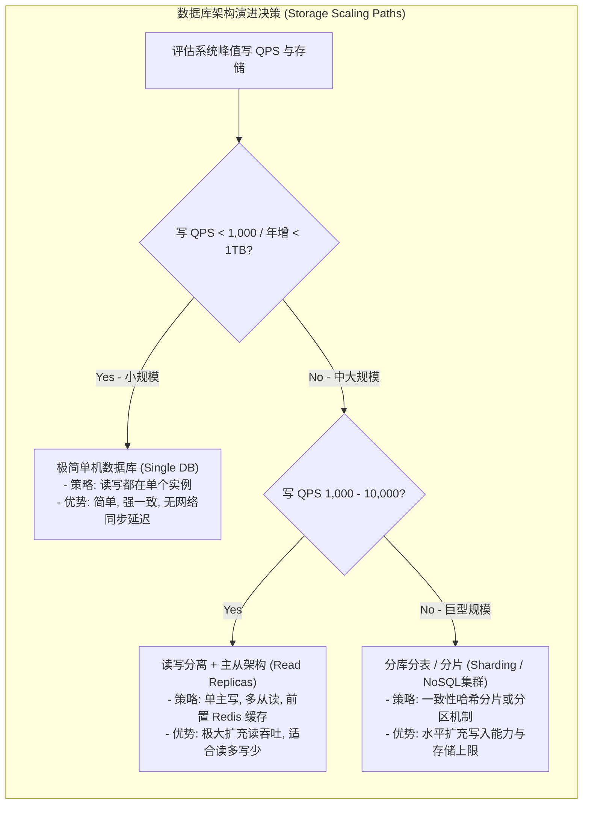

import GlossaryTerm from '@site/src/components/GlossaryTerm';
import GuidedExercise from '@site/src/components/GuidedExercise';
import ResearchNote from '@site/src/components/ResearchNote';
import ChapterMeta from '@site/src/components/ChapterMeta';
import PyRunner from '@site/src/components/PyRunner';
import CapacityEstimator from '@site/src/components/CapacityEstimator';
import TradeoffExplorer from '@site/src/components/TradeoffExplorer';
import QuizCard from '@site/src/components/QuizCard';

# M2L3 · 容量估算

<ChapterMeta
  time="约 1.5–2 小时"
  prereqs={[{label: 'M2L2 需求澄清', href: './requirements'}, {label: 'L1 延迟数量级', href: '../foundations/programming-systems-primer'}]}
  outcome="能在几分钟内从“DAU 多少”心算出 QPS、存储/年、带宽，并据此判断要不要缓存、分片、用什么数据库。"
  howToUse="先玩容量估算器感受各参数的影响，再跑代码理解公式，最后做 lab 把公式写出来。"
/>

:::tip 估算不求精确，只求数量级
没人能精确预测流量。但"每秒 10 次"还是"每秒 10 万次"，是完全不同的两个系统。利用 <GlossaryTerm term="Back-of-the-Envelope Estimation" definition="信封背面估算：在纸张/信封背面利用极简乘除法进行数量级粗估的方法，不求精确，只求量级对，以便快速筛选技术可行性。">back-of-the-envelope 估算</GlossaryTerm> 快速算出**数量级**，让你在白板上几分钟内就排除掉一大半错误方案。
:::

## 一、"这系统要几台机器？"

面试官或老板问"这系统要几台机器、什么数据库扛得住？"——答不上来，是因为你没做容量估算。其实只要几个数字相乘：用户量 × 人均操作 → 每天操作数 → 每秒操作数（QPS）→ 再乘大小 → 存储和带宽。**会算这套，你就能把"感觉"变成"数字"。**

```mermaid
flowchart LR
  subgraph CalculationFlow["容量心算推导流 (Back-of-the-Envelope Workflow)"]
    direction LR
    DAU["日活用户数 (DAU)"] -->|x 人均日操作数| DailyOps["日均总操作次数 (Daily Ops)"]
    DailyOps -->|除以 86400 (秒/天)| AvgQPS["平均每秒 QPS (Avg QPS)"]
    AvgQPS -->|x 峰值因子 (2-10)| PeakQPS["峰值 QPS (Peak QPS)"]
    
    DailyOps -->|x 单条负载字节大小| Storage["日新增存储量 (Storage/Day)"]
    Storage -->|x 365| YearStorage["年新增存储量 (Storage/Year)"]
    
    PeakQPS -->|x 单条字节大小| Bandwidth["网络带宽需求 (Bandwidth/s)"]
  end
```

## 二、三个核心概念（分层）

### 基础：QPS、存储、带宽

三个要估的核心量：

- <GlossaryTerm term="QPS" definition="每秒查询/请求数（Queries Per Second）。把每天的操作数除以 86400（一天的秒数）就得到平均 QPS。">QPS</GlossaryTerm>：每秒多少请求 = 每天操作数 ÷ 86400。
- 存储：每天新增数据 = 每天写入数 × 每条大小；再乘天数/年数。
- <GlossaryTerm term="Bandwidth" definition="带宽：网络在单位时间内传输数据的最大容量，通常在估算中用每秒传输的字节数（Bytes/s）来表示，公式为 QPS × 平均请求/响应载荷大小。">带宽</GlossaryTerm>：QPS × 每次的数据大小。

记住几个数量级锚点：一天 ≈ **86400 秒**（约 10 万）；常用 [Jeff Dean 延迟数字](../foundations/request-path)。

### 进阶：峰值系数与读写比

两个让估算贴近现实的修正：

- <GlossaryTerm term="Peak Factor" definition="峰值系数：真实流量不均匀，峰值通常是平均值的几倍（常用 2–10 倍粗估）。容量要按峰值规划，不能只按平均。">峰值系数</GlossaryTerm>：流量不均匀，峰值常是均值的 2–10 倍。**按峰值规划容量**，否则高峰必崩。
- <GlossaryTerm term="Read/Write Ratio" definition="读写比：读操作与写操作的数量之比。多数互联网系统读远多于写（如 100:1），这直接决定要不要重缓存、读写分离。">读写比</GlossaryTerm>：多数系统读远多于写。读多 → 重缓存、读写分离（回扣 [L10 缓存](../foundations/request-path)）。

玩一下这个估算器，拖动参数看 QPS / 存储怎么变：



<CapacityEstimator />

### 深入（选学）：估算直接决定架构

估算的结果会**直接淘汰方案**：
- 写 QPS 几十 → 单库够；写 QPS 几万 → 必须<GlossaryTerm term="Database Sharding" definition="数据库分片：将大表水平切分到多个物理数据库节点上，以解决单机存储容量和写入性能瓶颈。">分片</GlossaryTerm>（回扣 [L7 分片](../foundations/data-modeling)）。
- 读写比 100:1 → 缓存是第一优先；1:1 → 缓存收益有限。
- 存储 TB 级且增长快 → 要考虑冷热分层、对象存储。



<ResearchNote
  title="back-of-the-envelope：工程师的快速估算术"
  source="Jon Bentley, Programming Pearls（“The Back of the Envelope” 一章）"
  href="https://en.wikipedia.org/wiki/Programming_Pearls"
  insight="Bentley 推广了“信封背面估算”：用粗略的数量级心算，在动手之前就判断一个方案是否可行。关键是量级对，而非小数点后几位。"
  application="这是架构师的基本功：在投入工程之前，用几个乘除法就能判断“这个设计扛不扛得住”“要不要分片/缓存”。配合 Jeff Dean 的延迟数字，你能在白板上完成可行性筛选。"
/>

## 三、跟我做一遍：从 DAU 算到架构提示

<PyRunner
  expect="读多写少"
  code={`DAU = 10_000_000          # 1000 万日活
ACTIONS_PER_USER = 5       # 人均每天写 5 次
PAYLOAD_BYTES = 2_000      # 每条 2 KB
RW_RATIO = 50              # 读:写 = 50:1
PEAK = 3                   # 峰值约 3 倍

writes_per_day = DAU * ACTIONS_PER_USER
avg_write_qps = writes_per_day / 86400
peak_write_qps = avg_write_qps * PEAK
avg_read_qps = avg_write_qps * RW_RATIO
storage_per_year_gb = writes_per_day * 365 * PAYLOAD_BYTES / 1e9

print(f"写 QPS 均值≈{avg_write_qps:.0f}, 峰值≈{peak_write_qps:.0f}")
print(f"读 QPS 均值≈{avg_read_qps:.0f}")
print(f"存储/年≈{storage_per_year_gb:.0f} GB")
print("读多写少" if RW_RATIO >= 10 else "读写均衡")
print("→ 架构提示：读多写少，缓存是第一优先；存储上 TB，考虑冷热分层")`}
/>

**试试**：把 DAU 改成 10 亿、读写比改成 200——看 QPS 和存储跳到什么量级，想想这时单库还够不够。

## 四、动手 Lab（必做）

打开 `labs/month02/m2l3_capacity/`：

```bash
python labs/month02/m2l3_capacity/test_estimate.py
```

把容量估算的几个公式写成函数：平均 QPS、峰值 QPS、年存储。

<GuidedExercise
  title="练习指引：把估算公式写出来"
  goal="把“数量级心算”变成能复用的函数和肌肉记忆——面试白板和真实容量规划都要用。"
  hints={[
    '一天 86400 秒，记牢这个换算。',
    '平均 QPS = 每天总数 / 86400；峰值 = 平均 × 峰值系数。',
    '年存储 = 每天写入数 × 365 × 每条字节数。',
    '注意单位：字节、KB、GB 别混。'
  ]}
  steps={[
    '实现 avg_qps(per_day)：每天总数 / 86400。',
    '实现 with_peak(qps, factor)：qps × factor。',
    '实现 bytes_per_year(items_per_day, item_bytes)：items_per_day × 365 × item_bytes。',
    '写测试用已知数字验证，跑到全过。'
  ]}
  checks={[
    '你能从 DAU 心算出 QPS 的数量级。',
    '你记得按峰值（而非平均）规划容量。',
    '你能根据读写比判断要不要重缓存。',
    '你能根据存储量级判断单库够不够、要不要分片。'
  ]}
/>

## 架构师深潜（Staff+ 视角）

### 1. 估算是"方案筛选器"

你不需要精确到个位。估算的价值是**快速排除明显不可行的方案**：算出峰值写 5 万 QPS，你立刻知道"单台 MySQL 不够，要分片或换存储"——省下几小时的无效讨论。

### 2. 估算结果指向先解决哪个瓶颈

<TradeoffExplorer
  title="估算暴露瓶颈后，先上哪招"
  dimensions={['见效', '适用条件', '复杂度', '成本', '一致性影响']}
  options={[
    {
      name: '加缓存（读多写少时）',
      scores: [5, 4, 3, 3, 3],
      note: '读写比高、热点集中时，缓存能把读 QPS 的压力挡在数据库之前。',
      whenToUse: '估算显示读远多于写、且有热点（回扣 L10）。'
    },
    {
      name: '读写分离（读多、写不大）',
      scores: [4, 3, 3, 3, 4],
      note: '主库写、多个从库读。扩读吞吐，但有复制延迟、写仍受限于主库。',
      whenToUse: '读压力大、写量单库还扛得住、能容忍从库短暂滞后。'
    },
    {
      name: '分片（写 QPS/存储超单库）',
      scores: [5, 3, 1, 4, 2],
      note: '按 key 把数据切到多库，扩写和容量。但跨分片查询难、分片键难改（回扣 L7）。',
      whenToUse: '估算显示写 QPS 或存储远超单库上限时。'
    }
  ]}
/>

### 3. 真实案例：估算解释了它们的架构

[WhatsApp](../atlas/whatsapp.mdx) 的"每秒数十万消息、1.47 亿连接"正是容量估算的真实数字，它直接催生了"单机榨连接 + 对角扩展"的选择；[ChatGPT](../atlas/chatgpt.mdx) 对 GPU 显存和吞吐的估算，催生了连续批处理。**架构是估算逼出来的。**

### 4. 架构师深问（给自己 30 分钟）

- 估算"设计一个微信"：10 亿用户、人均每天 40 条消息、每条 200 字节——写 QPS、存储/年各是多少量级？单库够吗？
- 同样的 DAU，读写比 1:1 和 100:1，会让你的缓存策略有什么不同？
- 为什么"按平均规划容量"是危险的？用峰值系数解释一次真实事故。

## 自检清单

- [ ] 我能从 DAU 心算出 QPS、存储、带宽的数量级。
- [ ] 我的 lab 公式正确，能复用。
- [ ] 我知道要按峰值而非平均规划容量。
- [ ] 我能根据估算结果判断缓存/读写分离/分片该上哪个。

## 常见误解

- **"估算要算得很准"**: 量级对就够，纠结个位数或小数点后几位是浪费时间。每天 110 万次写和 100 万次写在架构选型上没有任何区别，但 100 万次和 1 亿次写则会带来本质差异。
- **"按平均流量准备机器"**: 真实世界的访问具有强烈的“长尾效应”和突发波动。按平均值规划，在高峰期（如早晚通勤或活动整点）服务器会直接 CPU/内存被打满而崩溃。系统必须按峰值系数（Peak Factor）或通过弹性伸缩配合限流熔断来做容量规划。
- **"先选数据库再说"**: “Cassandra 大而全，所以必须用它”是典型的偶然复杂度思维。先进行容量估算，让数字逻辑告诉你是否需要分片、读写比是否需要强缓存。
- **"只顾业务数据，忽视系统冗余"**: 物理磁盘的采购和规划要考虑索引文件（可能占用 30%-100% 数据量）、日志文件（WAL/Binlog）、备份保留策略以及主从副本三倍物理空间冗余。

## 五、章末自测

<QuizCard
  questions={[
    {
      q: '在系统设计面试或真实的容量规划中，为什么要将“1天 ≈ 86400秒（粗估为 10 万秒）”作为计算 QPS 的核心锚点？',
      options: [
        '因为每天的操作总数除以 100,000 可以帮助我们在白板前快速估算出平均 QPS，虽然略微低估，但在数量级估算中极其简便、易于心算且能光速筛选方案。',
        '因为 86400 是世界上所有操作系统的绝对最高并发上限限制。',
        '因为在估算中必须使用小数点后四位的精确秒数，否则系统编译会报错。'
      ],
      answer: 0,
      explain: 'Back-of-the-envelope 心算的核心是“快速估算数量级”。将一天秒数取 10 万，可以在极短时间内完成除法，得出大概的操作流量大小。在此基础上乘上峰值系数（如 3 或 5），即可快步推演架构图。'
    },
    {
      q: '在计算数据库的年度存储量时，以下哪个计算因素是初学者常常忽略，但在生产规划中至关重要的？',
      options: [
        '忽略了关系型数据库的索引开销、日志（WAL/Binlog）所占容量、备份留存策略以及多副本冗余因子（如 3 副本存储乘 3），导致物理磁盘采购量被严重低估。',
        '忽略了 CPU 的风扇转速对磁盘写入速度的影响。',
        '忽略了每次网络请求时数据包里的 HTTP 报头大小。'
      ],
      answer: 0,
      explain: '原始数据负载大小不等于物理存储大小。在生产中，索引（Index）可能占去原始数据大小的 50% 甚至更多；WAL 日志和备份（Backup）也是巨大的空间消耗者；更不用说高可用集群的多副本冗余。因此，估算完原始大小后，通常要乘上一个 2-3 倍的冗余及辅助因子。'
    },
    {
      q: '如果估算得出系统的写入 QPS 均值是 50/s，而峰值 QPS 为 150/s，存储量每年约 20GB，我们在选择存储方案时该如何抉择？',
      options: [
        '直接引入包含 10 个节点的 Sharding 数据库集群、部署 Kafka 以及多层缓存，以防系统崩溃。',
        '单台常规的关系型数据库（如 PostgreSQL/MySQL）便足以轻松应对此读写规模，不需要任何分布式分片或缓存，应当保持架构简单，避免过度设计。',
        '无条件选择大而全的对象存储（如 S3）来存放所有的结构化交易数据。'
      ],
      answer: 1,
      explain: '容量估算是优秀的“方案淘汰器”。150/s 峰值 QPS 和 20GB/年存储属于极小的负载量级，一台配置合理的单机数据库即可应对（常规单机 DB 能轻松应对几千 QPS 写入）。在这个规模下，引入分片和消息队列会带来极高且毫无意义的偶然复杂度。'
    }
  ]}
/>

## 延伸阅读

- [Jon Bentley, Programming Pearls](https://en.wikipedia.org/wiki/Programming_Pearls)
- [Jeff Dean: Numbers Everyone Should Know（见 L1/L10）](../foundations/request-path)
- [下一课：SLA / SLO / 可用性](./sla-slo-availability)
