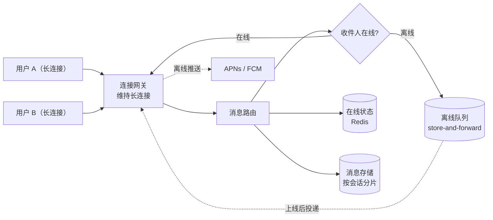

import GlossaryTerm from '@site/src/components/GlossaryTerm';
import GuidedExercise from '@site/src/components/GuidedExercise';
import ResearchNote from '@site/src/components/ResearchNote';
import ChapterMeta from '@site/src/components/ChapterMeta';
import TradeoffExplorer from '@site/src/components/TradeoffExplorer';

# M2L12 · Capstone：设计一个聊天应用

<ChapterMeta
  time="约 6–10 小时（整周项目）"
  prereqs={[{label: 'Month 2 全部 M2L1–M2L11', href: './overview'}]}
  outcome="一份完整的聊天应用系统设计：需求 + 估算 + HLD + 关键深潜 + 一致性/存储/扩展/容错决策 + ADR，并与真实 WhatsApp 架构对照。"
  howToUse="这是 Month 2 的毕业作品。按五步法走一遍，每一步都用本月对应的课，最后对照 WhatsApp 案例查漏补缺。"
/>

:::tip 把整月的方法，跑通一道真实大题
"设计一个微信"是系统设计面试的经典题。这个 Capstone 带你用本月的全套方法把它做完，并和 [真实 WhatsApp 架构](../atlas/whatsapp.mdx) 对照——这是你 Month 2 能拿出手的作品集。
:::

## 一、用五步法走一遍

回到 [M2L1 的五步法](./design-methodology)，逐步推进。

### 第 1 步：澄清需求（[M2L2](./requirements)）

- **功能需求**：一对一消息、群聊、在线状态、已读回执、离线消息、多设备。
- **明确不做（V1）**：音视频通话、朋友圈、支付。
- **非功能需求**：海量长连接、消息近实时送达、弱网下最终送达、极高可用、端到端加密。
- **关键澄清问题**：消息要强一致顺序吗？（答：同一会话内有序即可，全局无需）——这一个问题就决定了存储和分片方式。

### 第 2 步：容量估算（[M2L3](./capacity-estimation)）

假设 10 亿用户、人均每天 40 条消息、每条 ~200 字节：

- 写 QPS ≈ 10亿 × 40 / 86400 ≈ **46 万/s**（均值），峰值更高 → **单库远远不够，必须分片**。
- 连接数：数亿级长连接 → 需要专门的连接层（回扣 [WhatsApp 单机百万连接](../atlas/whatsapp.mdx)）。
- 存储：投递即删可大幅降低（[WhatsApp 的 store-and-forward](../atlas/whatsapp.mdx)）。

### 第 3 步：高层设计 HLD（[M2L5](./hld-diagramming)）

### 第 4 步：深潜关键组件

- **消息投递**：在线直发、离线入队、投递即删（隐私+省存储）。一对多群聊要**扇出**（写扩散 vs 读扩散，见下取舍）。
- **在线状态**：用 Redis 存 presence，心跳维持。
- **多设备**：每设备独立会话密钥（回扣 [WhatsApp 2021 多设备重构](../atlas/whatsapp.mdx)）。

### 第 5 步：取舍与风险

- **一致性（[M2L6](./cap-consistency)）**：消息投递选 AP + 最终一致（永远在线 > 强一致），同会话内保证顺序。
- **存储（[M2L8](./storage-selection)）**：消息用宽列（海量写、按会话分区）；在线状态用 KV/Redis；媒体用对象存储 + CDN。
- **扩展（[M2L7](./scaling-strategies)）**：连接层水平扩 + 消息按会话分片；用一致性哈希。
- **容错（[M2L11](./reliability-fault-tolerance)）**：连接网关冗余、推送降级、依赖熔断。

## 二、一个关键取舍：群消息怎么扩散

<TradeoffExplorer
  title="群聊消息扇出：写扩散 vs 读扩散"
  dimensions={['读延迟', '写成本', '存储成本', '大群友好', '实现复杂度']}
  options={[
    {
      name: '写扩散（push / fan-out on write）',
      scores: [5, 1, 2, 1, 3],
      note: '发消息时就写进每个成员的收件箱。读很快，但发一条要写 N 份——超大群写爆。',
      whenToUse: '中小群、读多写少、要求读极快（如多数 IM 的普通群）。'
    },
    {
      name: '读扩散（pull / fan-out on read）',
      scores: [2, 5, 5, 5, 3],
      note: '只存一份，成员读时去拉。写便宜、省存储，但读要聚合、较慢。',
      whenToUse: '超大群/频道（百万成员）、写多读相对少。'
    },
    {
      name: '混合（大群读扩散、小群写扩散）',
      scores: [4, 4, 4, 4, 1],
      note: '按群大小切换策略。综合最优，但实现最复杂。',
      whenToUse: '大型 IM 的现实选择（微信/WhatsApp 量级）。'
    }
  ]}
/>

这正是 feed/IM 系统的经典难题——它把 [L7 数据建模](../foundations/data-modeling)、[M2L7 扩展](./scaling-strategies)、[M2L6 一致性](./cap-consistency) 全串在了一起。

## 三、和真实 WhatsApp 对照

做完你的设计，去 [WhatsApp 案例](../atlas/whatsapp.mdx) 逐项对照：

- 你想到"投递即删"了吗？WhatsApp 用它同时拿下省存储 + 隐私。
- 你的连接层怎么扛海量长连接？WhatsApp 用 Erlang 单机百万连接 + 对角扩展。
- 你的容错？WhatsApp 用 "let it crash" + 监督树 + 双数据中心。
- 你的多设备？对照 WhatsApp 2021 的密钥重构。

**对照的目的不是"答案一致"，而是看你漏了哪些维度、它们为什么那样取舍。** 这种对照，是把方法论变成判断力的关键一跃。

<ResearchNote
  title="对照真实系统，校准你的设计直觉"
  source="架构案例库：WhatsApp（基于公开工程资料）"
  href="../atlas/whatsapp"
  insight="WhatsApp 用 Erlang/FreeBSD、store-and-forward、单机百万连接、双机房、Signal 端到端加密，以极小团队支撑数十亿用户。它的每个选择都能在本月的课里找到对应的取舍。"
  application="学完方法论后，最好的进阶方式是反复拿真实系统对照自己的设计：你会发现自己漏掉的维度（隐私、运维成本、团队规模），以及“同一原则在不同约束下长出不同架构”。"
/>

## 四、动手 Capstone（设计交付物）

<GuidedExercise
  title="练习指引：交付一份聊天应用设计文档"
  goal="把 Month 2 的全套方法跑通一道真实大题，产出一份能在面试里讲 45 分钟的设计文档 + ADR。"
  hints={[
    '严格按五步法走，每一步对应本月一节课，别跳过澄清和估算。',
    '深潜只挑 2 个最难的点（消息投递 + 群扇出），不要面面俱到。',
    '每个技术选择都写"代价/取舍"，并标到对应的课（CAP/存储/扩展/容错）。',
    '最后一定要和 WhatsApp 案例对照，列出你漏掉或不同的地方。'
  ]}
  steps={[
    '需求纪要：功能/非功能/明确不做/假设（M2L2）。',
    '容量估算：连接数、写/读 QPS、存储（M2L3）。',
    'HLD 图：连接层 + 路由 + 离线队列 + 存储 + 推送（M2L5）。',
    '深潜：消息投递（在线/离线/投递即删）+ 群扇出（写/读扩散）。',
    '决策：一致性(M2L6) + 存储(M2L8) + 扩展(M2L7) + 容错(M2L11)，各写理由。',
    '写 1 条 ADR（如"群消息用混合扇出"）含背景/选项/决定/后果。',
    '与 WhatsApp 案例对照，写一段"我漏了什么、为什么它那样选"。'
  ]}
  checks={[
    '你的文档按五步法完整、有写下的假设和估算数字。',
    '每个关键决策都标了对应课、附了取舍。',
    '你能对着 HLD 讲清一条消息从发送到送达的全程。',
    '你完成了与 WhatsApp 的对照，并诚实列出差距。'
  ]}
/>

## 五、自评 Rubric

- [ ] **方法完整**：五步法每步都有产出（M2L1–M2L5）。
- [ ] **估算驱动**：架构选择由容量数字支撑（M2L3）。
- [ ] **取舍清晰**：CAP/存储/扩展/容错都有显式理由（M2L6–M2L11）。
- [ ] **深潜到位**：消息投递与群扇出讲清了难点。
- [ ] **能解释**：有 ADR，能对着图讲 45 分钟。
- [ ] **会对照**：和真实 WhatsApp 比对，看到了自己的盲区。

## 恭喜你完成 Month 2

你现在能拿到一句模糊需求，澄清它、估算它、画出 HLD/LLD、做出有依据的取舍、并讲清风险——这就是系统设计的核心能力。加上 Month 1 的工程底座，你已经能独立设计一个中等规模系统了。

**下一步**：Month 3 进入"数据、缓存、队列"的深水区（URL 短链 + feed lab），把本月的"选型与取舍"落到具体的数据系统实现上。也常回 [架构案例库](../atlas) 对照真实系统。

## 延伸阅读

- [架构案例库：WhatsApp](../atlas/whatsapp.mdx)
- [donnemartin/system-design-primer（更多设计题）](https://github.com/donnemartin/system-design-primer)
- [Month 2 总览](./overview)
