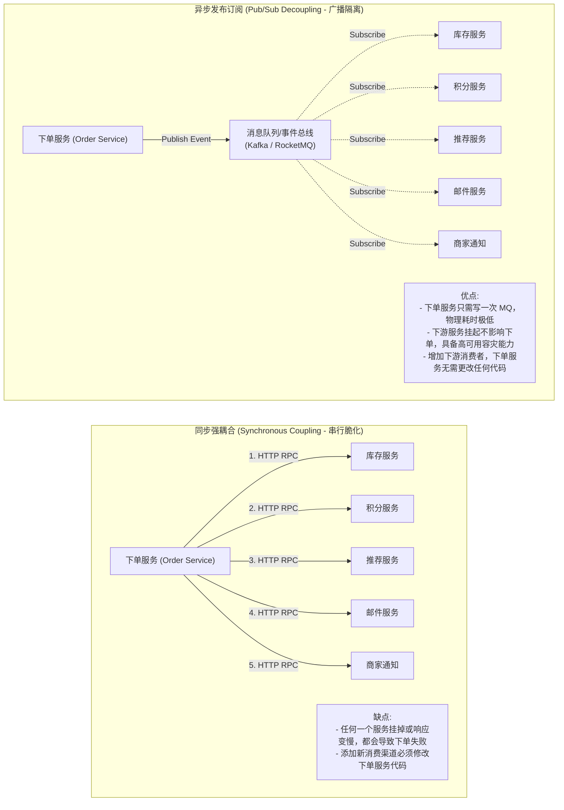
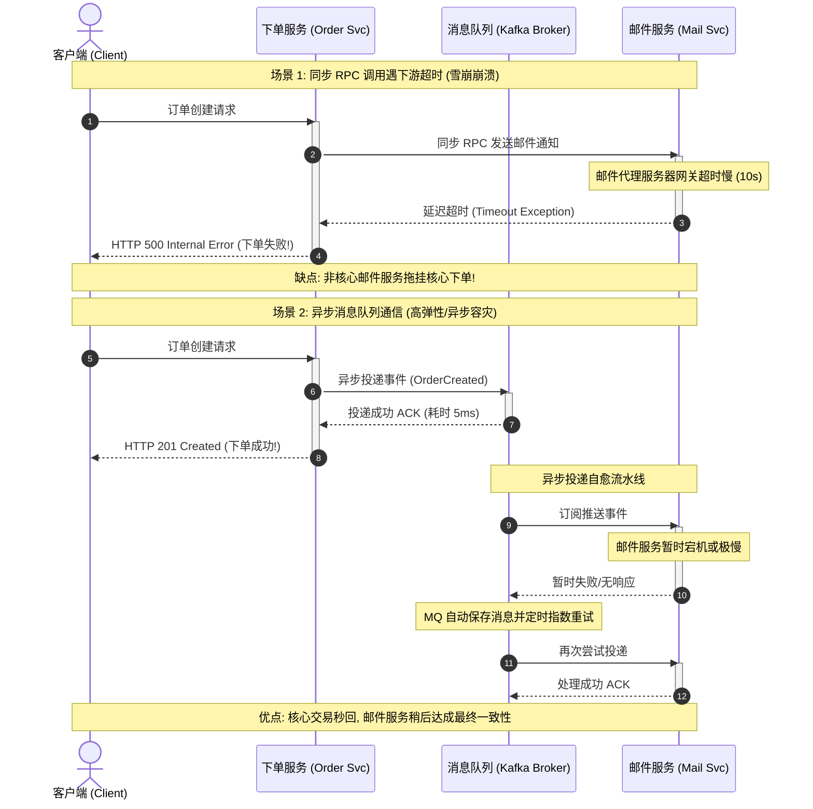
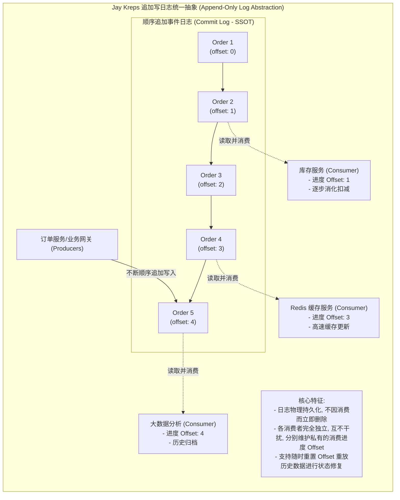

import GlossaryTerm from '@site/src/components/GlossaryTerm';
import GuidedExercise from '@site/src/components/GuidedExercise';
import ResearchNote from '@site/src/components/ResearchNote';
import ChapterMeta from '@site/src/components/ChapterMeta';
import PyRunner from '@site/src/components/PyRunner';
import TradeoffExplorer from '@site/src/components/TradeoffExplorer';
import QuizCard from '@site/src/components/QuizCard';

# M2L10 · 通信与解耦

<ChapterMeta
  time="约 2 小时"
  prereqs={[{label: 'L11 异步与队列', href: '../foundations/sync-async-timeout'}, {label: 'M2L5 HLD', href: './hld-diagramming'}]}
  outcome="能判断服务间该用同步调用还是异步事件，并用发布订阅把一个生产者和多个消费者解耦。"
  howToUse="先看“下单同步通知 5 个服务”为什么糟，再跑事件总线 demo，最后做 lab。"
/>

:::tip 把"谁认识谁"降到最低
系统越大，服务之间怎么通信就越关键。同步直连让服务互相认识、互相拖累；异步事件让它们互不认识、各自演进。这一课教你在两者间做对选择。
:::

## 一、下单成功，要通知 5 个服务

用户下单后，要：扣库存、加积分、更新推荐、发确认邮件、通知商家。如果下单服务**同步**地一个个调它们：① 总延迟 = 5 个之和（慢）；② 任何一个挂了，下单就失败（脆，回扣 [L4 级联](../foundations/error-handling)）；③ 每加一个新需求，都要改下单服务的代码（耦合）。**这是典型的"过度耦合"。**



## 二、三个核心概念（分层）

### 基础：同步 vs 异步通信

- <GlossaryTerm term="Synchronous Communication" definition="同步通信：调用方发请求后阻塞等待响应（如 HTTP/RPC 调用）。简单直接，但调用方被被调方的延迟和故障拖累。">同步通信</GlossaryTerm>：发请求等响应（HTTP/RPC）。直接，但被对方拖累。
- <GlossaryTerm term="Asynchronous Communication" definition="异步通信：通过消息/事件传递，发送方不等待接收方处理（如消息队列、事件总线）。解耦、削峰，但增加了最终一致和调试复杂度。">异步通信</GlossaryTerm>：发消息就走，不等（通过 <GlossaryTerm term="Message Queue" definition="消息队列：分布式系统间的异步通信基础设施，使用队列缓冲消息，支持解耦、异步处理、流量削峰与重试容灾（如 Kafka、RabbitMQ）。">消息队列</GlossaryTerm>、事件总线）。解耦、削峰（回扣 [L11](../foundations/sync-async-timeout)）。



### 进阶：发布订阅与事件驱动

把"下单成功"做成一个<GlossaryTerm term="Event" definition="事件：表示某件事已经发生的消息（如 OrderCreated）。发布者不关心谁来消费，消费者各自响应。">事件</GlossaryTerm>，发布到一个总线上；库存、积分、推荐、邮件各自**订阅**它、各自处理。这就是<GlossaryTerm term="Publish-Subscribe" definition="发布订阅：发布者把消息发到主题，多个订阅者独立接收。发布者完全不需要知道有哪些订阅者，实现彻底解耦。">发布订阅（pub/sub）</GlossaryTerm>。下单服务**不再需要认识那 5 个服务**——加一个新消费者，下单服务一行都不用改。这就是<GlossaryTerm term="Event-Driven Architecture" definition="事件驱动架构：服务通过发布和订阅事件来协作，而非直接调用。高度解耦、易扩展，代价是最终一致和调试链路变长。">事件驱动架构</GlossaryTerm>。

### 深入（选学）：日志是统一的抽象

LinkedIn 的 Jay Kreps 提出一个深刻视角：**一条不可变的、追加写的"日志（log）"，是连接所有系统的统一抽象**。各消费者按自己的进度读这条日志、各自构建所需状态。这正是 Kafka 的核心思想，也是现代事件驱动/流处理的基础。



<ResearchNote
  title="日志：实时数据的统一抽象"
  source="Jay Kreps (2013), The Log: What every software engineer should know about real-time data's unifying abstraction"
  href="https://engineering.linkedin.com/distributed-systems/log-what-every-software-engineer-should-know-about-real-time-datas-unifying"
  insight="Kreps 论证：一条有序、不可变、可重放的日志，可以把数据库复制、消息队列、流处理、数据集成统一起来。生产者只管追加，消费者各自按 offset 消费、可回放历史。"
  application="这把“消息队列”从一个工具，升格为一种架构哲学：用事件日志解耦系统、实现最终一致、支持回放与重建。Kafka 及现代数据管道都建立在此之上。"
/>

## 三、跟我做一遍：用事件总线解耦

<PyRunner
  expect="3 个消费者各自响应"
  code={`class EventBus:
    def __init__(self):
        self.subs = {}
    def subscribe(self, topic, handler):
        self.subs.setdefault(topic, []).append(handler)
    def publish(self, topic, event):
        for h in self.subs.get(topic, []):
            h(event)
        return len(self.subs.get(topic, []))

bus = EventBus()
# 三个服务各自订阅"下单成功"，互不认识
bus.subscribe("order_created", lambda e: print("库存：扣减", e["item"]))
bus.subscribe("order_created", lambda e: print("积分：增加", e["user"]))
bus.subscribe("order_created", lambda e: print("邮件：通知", e["user"]))

# 下单服务只管发事件，不需要认识任何消费者
n = bus.publish("order_created", {"user": "ada", "item": "book"})
print(f"{n} 个消费者各自响应")`}
/>

下单服务只 `publish` 一个事件，三个消费者各自响应——**它们彼此完全不认识**。**试试**：再 `subscribe` 一个"推荐服务"，看下单服务代码不用改，新消费者就生效了。这就是解耦的威力。

## 四、动手 Lab（必做）

打开 `labs/month02/m2l10_eventbus/`：

```bash
python labs/month02/m2l10_eventbus/test_event_bus.py
```

实现一个最小事件总线（发布订阅），把生产者和消费者解耦。

<GuidedExercise
  title="练习指引：实现一个事件总线"
  goal="把“发布订阅解耦”做成可用的代码——这是事件驱动架构的最小内核。"
  hints={[
    '内部用 dict：topic -> [handlers]。',
    'subscribe 把 handler 追加到对应 topic。',
    'publish 把事件交给该 topic 的所有 handler，并返回投递了几个。',
    '没有订阅者的 topic，publish 应安全返回 0，不报错。'
  ]}
  steps={[
    '实现 EventBus，内部维护 subs 字典。',
    'subscribe(topic, handler)：注册处理函数。',
    'publish(topic, event)：调用该 topic 所有 handler，返回投递数量。',
    '写测试：多订阅者都收到、无订阅者返回 0、不同 topic 互不干扰。',
    '跑到全过。'
  ]}
  checks={[
    '你能说出同步调用和异步事件的取舍。',
    '你的事件总线让发布者无需认识订阅者。',
    '你能解释为什么这降低了耦合、便于扩展。',
    '你能说出事件驱动的代价（最终一致、调试链路变长）。'
  ]}
/>

## 架构师深潜（Staff+ 视角）

### 1. 解耦不是免费的：你用一致性和可调试性换它

事件驱动让系统松耦合、易扩展，但代价真实：① 变成**最终一致**（库存可能在下单后几百毫秒才扣，回扣 [M2L6](./cap-consistency)）；② 调试变难（一个业务流程散落在多个异步消费者里，回扣 [L12 分布式追踪](../foundations/observability)）；③ 要处理重复投递（回扣 [L6 <GlossaryTerm term="Idempotence" definition="幂等性：无论对同一操作发起多少次请求，系统都会产生完全相同的影响与状态结果（如不会产生重复扣款、重复扣减库存）。">幂等</GlossaryTerm>](../foundations/idempotency)）。**别为了解耦而把所有同步调用都改成事件。**

### 2. 三种通信方式怎么选

<TradeoffExplorer
  title="服务间怎么通信"
  dimensions={['耦合度(越低越好)', '延迟', '可靠性', '一致性', '调试难度(越低越好)']}
  options={[
    {
      name: '同步调用（HTTP/RPC）',
      scores: [2, 4, 3, 5, 5],
      note: '直接、强一致、易调试。但调用方被拖累、链路越长越脆。',
      whenToUse: '需要立即拿到结果、强一致的核心链路（如下单时校验库存）。'
    },
    {
      name: '消息队列（点对点）',
      scores: [4, 3, 5, 3, 3],
      note: '异步、削峰、可靠（持久化+重试）。一个生产者对一个消费者组。',
      whenToUse: '慢任务、削峰、需要可靠投递的后台处理（发邮件、转码）。'
    },
    {
      name: '事件发布订阅（pub/sub）',
      scores: [5, 3, 4, 2, 2],
      note: '一个事件多方消费、彻底解耦、最易扩展。但最终一致、调试最难。',
      whenToUse: '一件事要触发多个独立反应、且各消费者需独立演进时。'
    }
  ]}
/>

### 3. 真实案例：核心同步 + 周边异步

成熟系统往往**混用**：下单时同步校验库存和支付（要立即、要强一致），但加积分、发邮件、更新推荐走异步事件（不必等、可最终一致）。[WhatsApp 的 store-and-forward](../atlas/whatsapp.mdx) 本质就是异步消息解耦收发双方。**关键是分清：哪些必须立即且一致（同步），哪些可以稍后（异步）。**

### 4. 架构师深问（给自己 30 分钟）

- "设计一个微信"：发消息、更新未读数、推送通知、同步多设备——哪些同步、哪些事件驱动？
- 用事件驱动后，"下单成功但积分服务挂了"怎么办？怎么保证最终一致（提示：事件重试 + 幂等消费）？
- 编排（orchestration，一个协调者调各步）vs 编舞（choreography，各服务听事件自己反应）——你的下单流程选哪种？

## 自检清单

- [ ] 我能说出同步与异步通信的取舍。
- [ ] 我的 lab 事件总线让发布者与订阅者解耦。
- [ ] 我能判断一个交互该同步还是事件驱动。
- [ ] 我知道事件驱动的代价（最终一致、调试、重复投递）。

## 常见误解

- **"全改成异步事件最先进"**: 盲目推崇事件驱动会导致系统状态极度支离破碎。凡是需要即时拿到结果判定成败、或者要求分布式强一致事务的场景（例如扣款判定），同步调用依然是首选。不能为了解耦而牺牲核心事务体验。
- **"消息队列只是用来在高并发时做流量削峰"**: 削峰只是附加作用。在日常微服务开发中，消息队列的核心使命是**解除微服务间的双向契约认知耦合**、提供异步重试保底以实现**最终一致性**和**系统弹性隔离**。
- **"发了事件就万事大吉"**: 网络是不稳定的，消息可能因为超时引发重复投递或消费崩溃。所有异步消费者必须遵循**幂等设计**（如通过去重表或唯一业务流水号判定），且下游系统必须支持**幂等消费与错误重试**。

## 五、章末自测

<QuizCard
  questions={[
    {
      q: '在同步通信模式下，如果下单服务同步调用扣库存、加积分、更新推荐、发邮件等 5 个下游服务，会带来什么严重的系统性后果？',
      options: [
        '它会导致系统必须全部重构为纯 HTML 静态页面。',
        '① 总延迟变为所有子服务处理时间的累加，导致用户等待极长；② 系统脆弱性剧增（级联故障），任何一个非核心服务（如邮件）超时或崩溃，都会导致下单核心流程失败；③ 极其耦合，每增加或调整一个下游需求都需要改下单服务的核心代码。',
        '它的唯一代价是使得网关层带宽限制归零。'
      ],
      answer: 1,
      explain: '同步调用（Tightly-Coupled Sync Calls）是雪崩效应的最主要诱因。非核心依赖的超时或宕机会反向阻塞上游线程，造成整个系统瞬间瘫痪。事件驱动 pub/sub 是解除这类强耦合的标准药方。'
    },
    {
      q: '‘发布-订阅（Pub/Sub）’模式相较于点对点（P2P）消息队列，最根本的架构区别是什么？',
      options: [
        'Pub/Sub 只能在单机内存中运行，不支持分布式部署。',
        '在 Pub/Sub 模式下，一条消息可以被广播并投递到多个不同的 Topic 订阅者/消费者，发布者无需知道有谁消费；而点对点队列中，一条消息只会被一个消费者拉取并处理一次。这使得 Pub/Sub 拥有完美的‘一对多’解耦分发能力。',
        'Pub/Sub 必须使用数据库的触发器机制来实现。'
      ],
      answer: 1,
      explain: 'Pub/Sub 的核心优势在于彻底实现‘一对多’的扇出（Fan-out）广播。它是构建事件驱动架构（EDA）的底座，极大降低了组件之间的知识性耦合。'
    },
    {
      q: 'LinkedIn 的 Jay Kreps 提出‘日志（Log）是统一的分布式系统抽象’，关于这一架构哲学的理解，以下哪项是正确的？',
      options: [
        '日志仅用于记录报错的 stacktrace 信息供排查，与数据一致性无关。',
        '日志是一条不可变、顺序追加的数据结构。各独立的异构系统（如 Redis 缓存、ES 检索、数据湖）可以作为一个个订阅者，根据自己维护的消费偏置（Offset）读取并重放同一份物理日志流，各自构建其所需的状态，从而实现高可扩展的异步最终一致性。',
        '它主张把所有的 SQL 数据库都废弃，全部改用文本文件记录订单信息。'
      ],
      answer: 1,
      explain: 'Log-centric architecture。以日志为中心的数据流水线（如 Kafka）是解决多持久化副本数据同步与实时状态重建的根基。追加写日志保证了顺序，可重放保障了容灾性。'
    }
  ]}
/>

## 延伸阅读

- [Jay Kreps, The Log](https://engineering.linkedin.com/distributed-systems/log-what-every-software-engineer-should-know-about-real-time-datas-unifying)
- [Martin Fowler, Event-Driven Architecture](https://martinfowler.com/articles/201701-event-driven.html)
- [下一课：可靠性与容错设计](./reliability-fault-tolerance)
