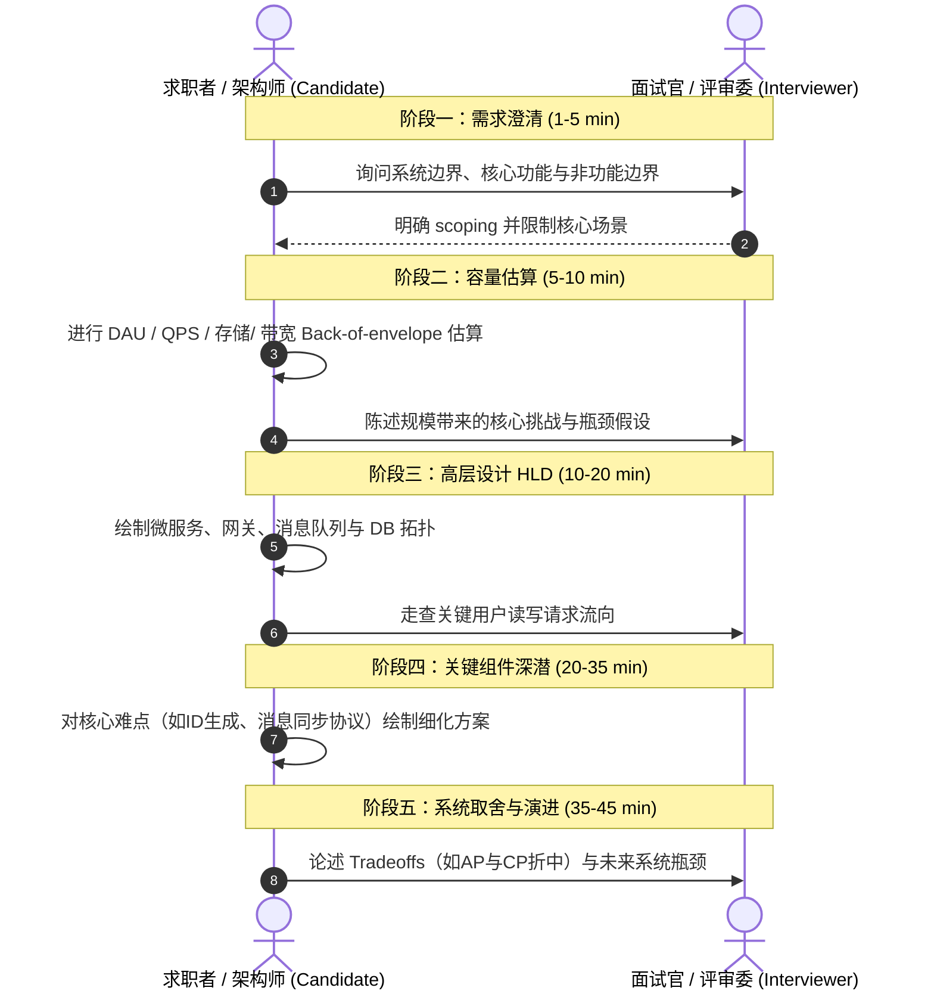
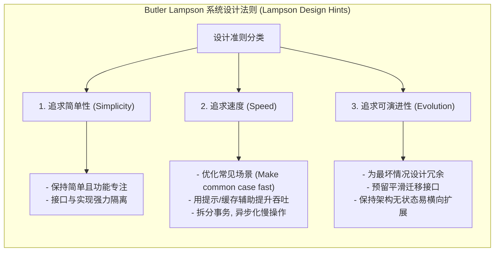

import GlossaryTerm from '@site/src/components/GlossaryTerm';
import GuidedExercise from '@site/src/components/GuidedExercise';
import ResearchNote from '@site/src/components/ResearchNote';
import ChapterMeta from '@site/src/components/ChapterMeta';
import TradeoffExplorer from '@site/src/components/TradeoffExplorer';
import QuizCard from '@site/src/components/QuizCard';

# M2L1 · 系统设计方法论

<ChapterMeta
  time="约 2 小时"
  prereqs={[{label: '完成 Month 1', href: '../foundations/overview'}]}
  outcome="一套你能套用到任何系统设计题的五步流程，并能用它把“设计一个 X”在 5 分钟内推进到一张高层图。"
  howToUse="先记住五步骨架，看一遍 URL 短链的完整走查，再用这套流程练一道你自己选的题。"
/>

:::tip 这一课给你一个"永远知道下一步"的框架
系统设计最让新手恐慌的不是难，而是"不知道从哪开始"。架构师之所以从容，是因为他们有一套固定动作。这一课就把这套动作交给你——以后面对任何模糊需求，你都知道下一步该问什么、画什么。
:::

## 一、"设计一个微信"——然后呢？

面试官说"设计一个微信"，或老板说"我们要做个直播带货系统"。新手会立刻陷进细节（"用 MySQL 还是 MongoDB？"），或者大脑空白。问题在于：**没有流程。** 有经验的人不会马上谈技术，而是先走一套稳定的动作，把模糊问题一步步逼成清晰设计。

## 二、五步方法论（分层）

### 基础：五个步骤

| 步骤 | 核心问题 | 对应后续课 |
|---|---|---|
| 1. 澄清需求 | 解决什么？给谁？哪些不做？ | M2L2 |
| 2. 估算规模 | 多少用户/<GlossaryTerm term="QPS" definition="每秒查询率 (Queries Per Second)：系统每秒处理的读/写请求数量，是评估吞吐量的重要非功能指标。">QPS</GlossaryTerm>/数据？ | M2L3、M2L4 |
| 3. 高层设计 | 主要组件和数据怎么流？ | M2L5 |
| 4. 深入组件 | 最难/最关键的那块怎么做？ | M2L6–L11 |
| 5. 取舍与风险 | 为什么这么选？哪会先垮？ | 贯穿全程 |

### 进阶：每一步真正在问什么

- **澄清**：不要假设。问清功能边界、规模量级、一致性/延迟要求（[M2L2](./requirements)）。把假设**写下来**。
- **估算**：用数量级心算（[M2L3](./capacity-estimation)）。读多还是写多？要不要缓存/分片？估算直接决定架构形态。
- **<GlossaryTerm term="HLD" definition="高层设计 (High-Level Design)：描述系统大局组件和主要数据流向的架构蓝图。">HLD</GlossaryTerm>**：先画 [Month 1 学过的构件](../foundations/request-path)——客户端、网关、服务、缓存、数据库、队列，连出数据流。
- **深潜**：别面面俱到，挑最关键的 1–2 个点深挖（聊天系统挑"消息投递"、短链挑"ID 生成与重定向"）。
- **取舍**：每个决定都讲清放弃了什么换了什么（[<GlossaryTerm term="Tradeoff" definition="折中/权衡：系统设计中不存在完美技术，必须在两个相互竞争的指标（如一致性 vs 延迟，成本 vs 冗余）之间做出妥协取舍。">Tradeoff</GlossaryTerm> 思维](../foundations/programming-systems-primer)）。

### 深入（选学）：好系统设计的经验法则

<GlossaryTerm term="System Design" definition="系统设计：定义系统架构、组件、模块、接口及数据以满足特定需求的过程，要求综合权衡功能与非功能指标。">系统设计</GlossaryTerm>有一些跨越时代的"老法师经验"。Butler Lampson 1983 年的《Hints for Computer System Design》总结了一批，比如：**把常见情况做快（make the common case fast）**、**做一件事并做好**、**用提示而非保证来优化**、**先正确再快**。这些和 Month 1 的 [Parnas 模块化](../foundations/modules-and-contracts)、[Knuth 先测量再优化](../foundations/performance-and-latency) 一脉相承。

<ResearchNote
  title="系统设计的经验法则，四十年不过时"
  source="Butler Lampson (1983), Hints for Computer System Design"
  href="https://www.microsoft.com/en-us/research/publication/hints-for-computer-system-design/"
  insight="图灵奖得主 Lampson 总结了一批跨领域的系统设计经验：保持简单、把常见情况做快、先做对再做快、用缓存/提示、为可演进而设计等。这些“提示”来自大量真实系统的成败。"
  application="方法论给你“怎么推进”，这些经验法则给你“怎么判断好坏”。两者结合，你才能既走得下去、又走得对。把它们当成你做每个设计决策时的检查清单。"
/>

## 三、跟我走一遍：5 分钟设计一个短链服务

用五步快速推进 "设计一个像 bit.ly 的短链服务"：

1. **澄清**：核心功能 = 长链→短码、短码→重定向。规模假设：每天 1 亿次读、100 万次写，读远多于写。短码要短、唯一、不可枚举。
2. **估算**：写 ~12/s（均值）、读 ~1200/s；存储每条 ~100 字节 × 1 亿/天 → 用 [M2L3 的方法](./capacity-estimation) 一算便知。**读多写少 → 重缓存。**
3. **HLD**：客户端 → 网关 → 短链服务 → 缓存（热门短码）→ 数据库（映射表）。写路径生成唯一 ID 转 base62。
4. **深潜**：ID 生成怎么保证唯一且不可枚举？（发号器 / 哈希 / 预生成池）重定向怎么做到极快？（缓存 + CDN）
5. **取舍**：用自增 ID（简单但可枚举）还是随机（不可枚举但要查重）？强一致（写完立刻可读）还是允许极短延迟？

看到没——**同一套动作，套到任何题上都能跑起来**。

## 四、动手练习（设计题，非代码）

<GuidedExercise
  title="练习指引：用五步法设计一道题"
  goal="把五步方法论跑通一遍。重点不是“标准答案”，而是流程：每一步你都知道该问什么、该产出什么。"
  hints={[
    '选一个你熟悉的产品：朋友圈/微博 feed、网盘、打车、外卖均可。',
    '澄清阶段一定要写下假设（规模、一致性、延迟要求），不要默认。',
    '深潜只挑 1–2 个最难的点，不要什么都讲一点。',
    '每个技术选择后面都补一句"代价是……"。'
  ]}
  steps={[
    '第1步：写下 3 条核心功能 + 2 条明确不做的（scoping）。',
    '第2步：估算 <GlossaryTerm term="DAU" definition="日活跃用户数 (Daily Active Users)：一天之内访问或使用系统的不重复（唯一）用户总数，是估算系统并发与容量的基石指标。">DAU</GlossaryTerm>、写 QPS、读 QPS、存储/年（下一课 M2L3 教你算）。',
    '第3步：画一张 HLD 图（客户端→网关→服务→缓存→DB→队列）。',
    '第4步：挑一个最关键组件，写 3 句它怎么实现、难在哪。',
    '第5步：列出 2 个关键取舍和 1 个最先会垮的瓶颈。',
    '把以上整理成一页"设计纪要"，存进你的作品集。'
  ]}
  checks={[
    '你能不假思索地说出五步的顺序。',
    '你的设计纪要里有明确写下的假设。',
    '你的深潜只聚焦 1–2 个关键点，而非面面俱到。',
    '每个技术决策都附了"代价/取舍"。'
  ]}
/>

## 架构师深潜（Staff+ 视角）

### 1. 面试里的方法论 vs 真实工作里的方法论

面试的系统设计是这套流程的"压缩版"（45 分钟）。真实工作里它会展开成数周：澄清变成和产品/业务反复对齐，估算变成看真实埋点数据，HLD 变成架构评审，取舍变成 [ADR（L16）](../foundations/month1-capstone)。**但骨架完全一样。** 练好面试版，就是在练真实版。

### 2. 最常见的失败：跳过澄清和估算

<TradeoffExplorer
  title="拿到需求后，先做什么"
  dimensions={['少返工', '设计合理性', '沟通成本', '显得专业', '推进速度']}
  options={[
    {
      name: '先澄清需求 + 估算规模（推荐）',
      scores: [5, 5, 4, 5, 3],
      note: '先问清楚、先算量级，再动手。前期慢一点，但方向对、少返工。',
      whenToUse: '永远。这是专业架构师的默认动作，面试和实战都是。'
    },
    {
      name: '直接开始画组件/选技术',
      scores: [1, 2, 2, 2, 5],
      note: '上来就 MySQL/Redis/Kafka 堆组件，看着快，但常常解错了题、规模估错、白做。',
      whenToUse: '几乎不推荐——这是新手最典型的失误。'
    }
  ]}
/>

### 3. 真实案例：每个大系统都是这么长出来的

回看 [WhatsApp](../atlas/whatsapp.mdx) 和 [ChatGPT](../atlas/chatgpt.mdx) 的"设计初衷"——它们都是从"要解决什么问题、给谁、什么约束"出发的。你这套五步法，正是把那些架构师脑子里的隐式流程显式化。学完 Month 2，你再看案例库会有完全不同的深度。

### 4. 架构师深问（给自己 30 分钟）

- 把"设计一个微信"用五步法在纸上推 15 分钟，卡在哪一步？那一步对应后面哪节课？
- 为什么"先估算"能在一开始就排除掉一大半技术选项？举个例子。
- Lampson 说"make the common case fast"——在短链服务里，common case 是什么？你会怎么为它优化？

## 自检清单

- [ ] 我能背出五步方法论并说清每步产出什么。
- [ ] 我能用它在 5 分钟内把一道设计题推到 HLD。
- [ ] 我知道为什么"先澄清+估算"是专业默认动作。
- [ ] 我能说出几条 Lampson 的设计经验法则。

## 常见误解

- **"系统设计靠记标准答案"**: 靠的是流程、评估规模和取舍判断，不是死记硬背架构图。即使你背下了微信的架构，如果无法根据面试官给出的特定约束（如“仅供 1 万人企业内部使用且绝对保密”）进行裁剪，也会被判定为不合格。
- **"上来就选技术栈最高效"**: 跳过需求澄清与量级估算是返工之源。如果没有确定是读多写少还是高频写入，任何直接定下“用 Cassandra 还是 Redis”的行为都是盲目的技术堆砌。
- **"要把每个组件都讲透"**: 45 分钟的面试或 1 小时的评审时间极其有限，深潜应当只聚焦于 1–2 个决定系统成败的关键难点（例如推拉流策略或高并发下的防超卖），面面俱到反而显得抓不住重点。
- **"Butler Lampson 法则是象牙塔理论"**: 这些法则是数十年来真实大型分布式系统（如 AWS、Google 单体服务演进）血泪教训的结晶。“把常见情况做快”、“先正确再求快”是指导每一行代码和每一张高层架构图设计的黄金法则。

## 自测题 (QuizCard)

<QuizCard
  questions={[
    {
      q: '在系统设计中，著名的 Butler Lampson 经验法则“Make the common case fast”（把常见情况做快）在实际架构中是如何体现的？',
      options: [
        '对于读远大于写的短网址系统，由于 99% 的请求都是跳转（读），因此应通过本地缓存或 CDN 进行读取加速，即便写入路径稍慢一点也完全可以接受。',
        '无条件为写入路径做极速优化，牺牲读取缓存的命中率。',
        '通过引入极为复杂的同步锁确保每一次写事务都遍历全球全部数据库副本。'
      ],
      answer: 0,
      explain: '把常见情况做快是核心的优化原则。短网址系统中读流量往往是写流量的 1000 倍以上。通过将热门短链接放入高效的缓存（如 Redis）或分布式 CDN 边缘节点，可以极速响应绝大多数请求，从而避免对后端数据库形成高压。'
    },
    {
      q: '很多新手在做系统设计时，往往会犯‘上来就堆砌技术组件和微服务’的毛病。以下关于这一现象的评价，哪项是正确的？',
      options: [
        '这显得架构师技术广度高、效率极快，是真实工程环境里的最佳实践。',
        '这是缺乏流程方法论的典型表现。跳过需求澄清与量级估算，盲目选用组件（如 Kafka 或 NoSQL），极易导致偏离业务目标、做错需求或引入不必要的分布式运维复杂度。',
        '堆砌组件能完全规避系统运行时的任何可用性风险。'
      ],
      answer: 1,
      explain: '系统设计不是猜谜游戏。没有规模背景和非功能约束的技术选型都是空中楼阁。先澄清做什么/不做、估算 QPS 和数据容量，技术图纸才能画得精准、合理。'
    },
    {
      q: '图灵奖得主 Butler Lampson 提出的‘先正确，再求快’（Keep it simple, get it right first）对架构设计有何启示？',
      options: [
        '要求我们先通过模块隔离和接口定义保证系统的逻辑和功能边界是正确的，在此基础上再通过测量分析瓶颈做性能优化，防止因过早优化导致系统高度耦合与腐化。',
        '要求为了速度可以完全放弃边界校验与数据一致性测试。',
        '二者互相矛盾，初学者应当直接进行底层的汇编级并发优化。'
      ],
      answer: 0,
      explain: '‘先正确，再求快’强调了首要解决正确性和逻辑边界。没有正确的逻辑，高并发的执行毫无意义。这与 Donald Knuth 的‘过早优化是万恶之源’（Measure before optimize）异曲同工。'
    }
  ]}
/>

## 延伸阅读

- [Butler Lampson, Hints for Computer System Design](https://www.microsoft.com/en-us/research/publication/hints-for-computer-system-design/)
- [donnemartin/system-design-primer](https://github.com/donnemartin/system-design-primer)
- [架构案例库：看真实系统的设计初衷](../atlas)
