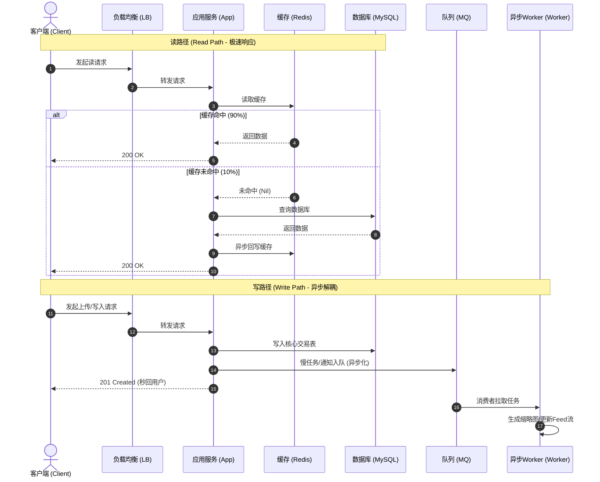
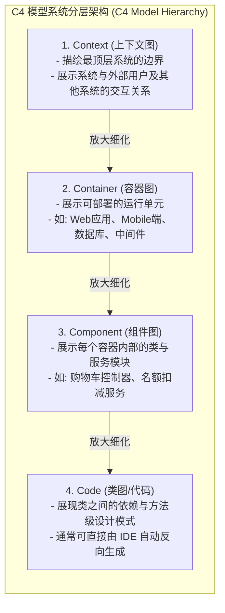
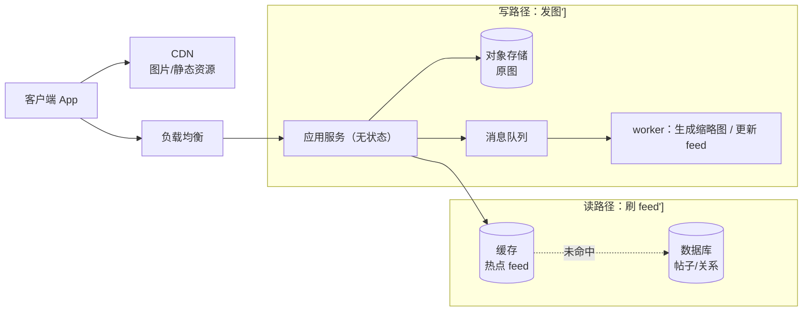

import GlossaryTerm from '@site/src/components/GlossaryTerm';
import GuidedExercise from '@site/src/components/GuidedExercise';
import ResearchNote from '@site/src/components/ResearchNote';
import ChapterMeta from '@site/src/components/ChapterMeta';
import TradeoffExplorer from '@site/src/components/TradeoffExplorer';
import QuizCard from '@site/src/components/QuizCard';

# M2L5 · HLD：画端到端系统图

<ChapterMeta
  time="约 2 小时"
  prereqs={[{label: 'M2L3 容量估算', href: './capacity-estimation'}, {label: 'L10 请求链路', href: '../foundations/request-path'}]}
  outcome="能用一套标准构件，把一个需求画成清晰的端到端高层架构图（HLD），并讲清读路径、写路径和关键组件。"
  howToUse="先认识构件库，再看一个完整 HLD 怎么从需求长出来，最后自己画一张。"
/>

:::tip 白板是架构师的母语
系统设计面试和评审，最终都落在一张图上。画不出清晰的 HLD，再好的想法也传达不出去。这一课给你一套"画图的语法"：用哪些构件、怎么连、先画什么。
:::

## 一、需求有了、数字有了，然后呢？

你澄清了需求（[M2L2](./requirements)）、估算了规模（[M2L3](./capacity-estimation)）。现在面试官说"画出来吧"。新手会卡住：画哪些框？怎么连线？其实 <GlossaryTerm term="HLD" definition="高层设计（High-Level Design）：用框和线表达系统的主要组件及它们之间的数据流，不深入每个组件内部实现。是沟通架构的主要媒介。">HLD</GlossaryTerm> 有一套稳定的"构件库"和"画法"——你在 [Month 1 的请求链路](../foundations/request-path) 已经见过它们，这一课把它们组织成图。

## 二、三个核心概念（分层）

### 基础：HLD 的标准构件库

几乎每个互联网系统的 HLD 都是这些积木的组合：

| 构件 | 作用 | 对应 Month 1 |
|---|---|---|
| 客户端 | 发请求、展示 | L9 |
| <GlossaryTerm term="CDN" definition="内容分发网络 (Content Delivery Network)：分布在全球多地的边缘服务器集群，用于缓存并就近向用户提供图片、视频、静态网页等内容，以降低延迟和主站带宽压力。">CDN</GlossaryTerm> | 就近返回静态内容 | L10 |
| <GlossaryTerm term="Load Balancer" definition="负载均衡器 (Load Balancer)：用于将网络流量分发到多个后端服务器实例的设备或软件，以提高系统并发吞吐、可用性并消除单点故障。">负载均衡</GlossaryTerm> | 分发到多台应用机 | L5/L10 |
| 应用服务（无状态） | 跑业务逻辑 | L5/L9 |
| 缓存 | 挡住热点读 | L10 |
| 数据库 | 持久化真实状态 | L5/L7 |
| 消息队列 | 异步、削峰、解耦 | L11 |
| <GlossaryTerm term="Object Storage" definition="对象存储 (Object Storage)：一种非结构化数据存储架构（如 AWS S3），将数据作为带唯一标识的“对象”进行存取，极利于海量图片、视频等扁平化大文件的廉价高扩展存储。">对象存储</GlossaryTerm> | 存大文件（图片/视频） | — |

### 进阶：画图的顺序与读写路径

画 HLD 的推荐顺序：

1. 左边放客户端，右边放数据，中间是处理。
2. 先画**写路径**（数据怎么进来、存哪），再画**读路径**（数据怎么被取出、缓存在哪）。
3. 把"用户不必等的"（发通知、生成缩略图）挂到队列上异步处理。
4. 标注关键数据流的方向和大致量级（回扣估算）。

**读写路径常常不对称**：读多写少的系统，读路径会重缓存/CDN，写路径相对简单。

### 深入（选学）：抽象层次——别把所有细节画在一张图上

好的架构图分**抽象层次**：高层图只画"系统和系统之间"，下一层才画"某个系统内部的容器/服务"。Simon Brown 的 <GlossaryTerm term="C4 Model" definition="一种分层描述软件架构的方法：Context（系统与外部）、Container（可部署单元）、Component（容器内模块）、Code（类）。逐层放大，避免一张图塞太多。">C4 模型</GlossaryTerm> 就是这个思路：Context → Container → Component → Code，逐层放大。**一张图只讲一个抽象层次**，否则没人看得懂。

<ResearchNote
  title="用分层的图来沟通架构"
  source="Simon Brown, The C4 Model for Visualising Software Architecture"
  href="https://c4model.com/"
  insight="C4 模型主张用四个层次（Context/Container/Component/Code）描述架构，每层只展示恰当粒度的信息，像地图的缩放级别。避免“一张图什么都画”导致的不可读。"
  application="架构沟通失败，常常不是设计错，而是图画错——层次混乱、细节过载。先画系统级 Context/Container 图（就是 HLD），需要时再放大到某个组件，是清晰表达的关键。"
/>

## 三、跟我做一遍：从需求长出一张 HLD

以"图片社交 App（发图 + 刷 feed）"为例，套用构件库：

注意几点：① 读写路径分开画；② 大文件走对象存储 + CDN，不进数据库；③ 慢任务（缩略图、feed 更新）挂队列异步；④ 读路径重缓存。**这张图就是需求 + 估算 + Month 1 构件的自然结果。**

## 四、动手练习（画图题，非代码）

<GuidedExercise
  title="练习指引：为你的题画一张 HLD"
  goal="把“需求 + 估算 + 构件库”落成一张清晰的端到端图——这是系统设计面试的核心交付物。"
  hints={[
    '从左(客户端)到右(数据)布局，中间是处理层。',
    '先画写路径再画读路径，两条线分开。',
    '大文件用对象存储+CDN；慢任务挂队列。',
    '一张图只画一个抽象层次（先画系统级，别一上来画类）。'
  ]}
  steps={[
    '复用上一课你做的需求纪要和估算。',
    '从构件库里挑出需要的积木（不是越多越好）。',
    '画写路径：数据从客户端到最终存储，经过哪些框。',
    '画读路径：数据被取出时怎么走、缓存在哪。',
    '标 1–2 个关键组件为"下一步深潜对象"（M2L6 起会用到）。',
    '把图存进作品集（可用 Mermaid 或手画拍照）。'
  ]}
  checks={[
    '你的图读写路径分开、清晰可读。',
    '你只用了必要的构件，没堆砌。',
    '大文件、慢任务的处理位置正确。',
    '你能对着图讲清一次请求的完整流转。'
  ]}
/>

## 架构师深潜（Staff+ 视角）

### 1. HLD 是用来"对齐"和"发现问题"的，不是装饰

画 HLD 的真正价值有两个：① **对齐**——让所有人对"系统长什么样"达成共识；② **暴露问题**——画的过程中你会发现"这里会不会成瓶颈""那条链路挂了怎么办"。一张好图能在写一行代码前就发现设计缺陷。

### 2. 画到多细？看沟通对象

<TradeoffExplorer
  title="HLD 该画多细"
  dimensions={['沟通清晰度', '覆盖全面', '维护成本', '适合受众', '暴露风险']}
  options={[
    {
      name: '只画系统级（Context/Container）',
      scores: [5, 2, 5, 4, 3],
      note: '只展示主要系统/服务和它们的关系。一眼看懂全局，但看不到内部细节。',
      whenToUse: '对上汇报、跨团队对齐、面试开场——先讲全局。'
    },
    {
      name: '画到组件级（Component）',
      scores: [4, 4, 3, 4, 5],
      note: '放大某个服务内部的模块和数据流。能暴露具体设计风险。',
      whenToUse: '深潜关键服务、做详细设计评审时。'
    },
    {
      name: '一张图画到底（什么都画）',
      scores: [1, 5, 1, 1, 2],
      note: '把系统级到类全塞一张图。看似全面，实则没人看得懂、也没法维护。',
      whenToUse: '几乎从不——这是最常见的画图错误。'
    }
  ]}
/>

### 3. 真实案例：先看懂大图，再看局部

你在 [WhatsApp](../atlas/whatsapp.mdx) 和 [ChatGPT](../atlas/chatgpt.mdx) 案例里看到的架构总览图，就是 HLD（系统级）；而它们的"逐年代架构演进"则是在同一抽象层次上看变化。**学会画 HLD，你才能真正读懂这些案例图，而不是看个热闹。**

### 4. 架构师深问（给自己 30 分钟）

- 给"设计一个微信"画一张系统级 HLD（消息收发 + 离线 + 群聊），再挑"消息投递"放大到组件级。
- 你的 HLD 里哪条链路最可能成为瓶颈？（结合估算和 [L10 关键路径](../foundations/request-path)。）
- 同一个系统，对 CEO、对新同事、对评审会，你会画成几个不同抽象层次的图吗？

## 自检清单

- [ ] 我熟悉 HLD 的标准构件库及各自作用。
- [ ] 我能分开画读路径和写路径。
- [ ] 我能为一个需求画出清晰的系统级 HLD。
- [ ] 我理解抽象层次，不会一张图画到底。

## 常见误解

- **"图越详细越专业"**: 层次混乱、细节过载的图最没用。在讨论高层设计时去纠结类和具体数据表字段只会把所有人带偏。先画好系统级（Context/Container）。
- **"HLD 就是把组件堆上去"**: 关键是数据流（Data Flow）和读写路径的不对称性设计，而不是纯粹的积木堆砌。画图时必须明确标注连线的箭头方向和数据携带载荷。
- **"画无向线或者双向箭头"**: 几乎所有的请求都是请求-响应模式，但在 HLD 中，应当用单向箭头表示主动发起调用或数据流动的方向，而不是盲目画双向箭头甚至是没有指向的线段，否则会导致调用关系完全不可读。
- **"画完图就完事"**: HLD 是用来发现系统缺陷和统一团队认知的。画完后，架构师必须对着图逐一推演“如果 Redis 缓存全部穿透回源怎么办”、“如果消息队列发生堆积会对写路径响应延迟产生什么后果”等边界故障。

## 五、章末自测

<QuizCard
  questions={[
    {
      q: '在设计大流量的互联网系统高层设计（HLD）时，关于‘读写路径不对称’的设计准则，以下哪项描述是正确的？',
      options: [
        '读多写少的系统应当在写路径上采用极为复杂的多级缓存，而读路径上则直接同步读主数据库以保证强一致。',
        '读路径（读多）适合通过就近的 CDN 以及热点本地/分布式缓存（Redis）来承载，阻断海量请求回源；而写路径则主要关注高可用写入、数据库主从同步与削峰，两者设计偏向完全不同。',
        '读和写必须共享完全相同的一条同步调用流水线，不允许任何差异。'
      ],
      answer: 1,
      explain: '读多写少是互联网系统的普遍特征。将读写路径分开设计（读走缓存/CDN，写走数据库/队列）是解决高并发、低延迟的核心法则。如果把所有的读请求都同步扔到写库，数据库会在瞬间崩溃。'
    },
    {
      q: 'C4 模型（Simon Brown 提出）是如何解决高层架构图在展示过程中的‘细节过载与层次混乱’痛点的？',
      options: [
        '主张废除所有的架构图绘制，只用类名命名规范来表达类结构。',
        '主张将架构图划分为 Context（系统上下文）、Container（可部署容器）、Component（组件内部模块）和 Code（具体代码）四大互为嵌套的分层，每一层只展示该缩放级别下最合适的信息粒度。',
        '主张将系统内部全部几万个类的关系全部平铺在一张巨幅白板图里绘制出来。'
      ],
      answer: 1,
      explain: 'C4 模型像电子地图一样提供了可缩放的视图。通过分层描述，可以确保非技术层面的业务方能看懂最高层的 Context 图，而开发人员可以深入查看 Component/Code 图，避免了在一张图里塞入过多不相干细节的悲剧。'
    },
    {
      q: '在一个包含上传大图片/视频以及社交刷 Feed 的 HLD 设计中，以下哪项技术选型与流向设计是符合最佳实践的？',
      options: [
        '大图片/视频在客户端直接以 Base64 格式同步存入关系型数据库的单张表主键索引中。',
        '大图片/视频直接上传至廉价且具备极高扩展性的对象存储（Object Storage），并在读路径上通过边缘 CDN 加速分发；同时将耗时的‘生成缩略图’等后台任务通过消息队列（MQ）异步解耦处理。',
        '无条件抛记所有的对象存储和队列，强制使用同步文件共享磁盘挂载多台 Web 实例。'
      ],
      answer: 1,
      explain: '这也是 Lampson ‘把常见情况做快’与隔离关注点的体现。大文件不入关系数据库能保护 DB 免受 I/O 打满的风险；对象存储+CDN 承载了大文件的存储与下载加速；消息队列异步化解决了长尾处理任务带来的响应延迟。'
    }
  ]}
/>

## 延伸阅读

- [Simon Brown, C4 Model](https://c4model.com/)
- [下一课：CAP 与一致性模型](./cap-consistency)
- [架构案例库（看真实 HLD）](../atlas)