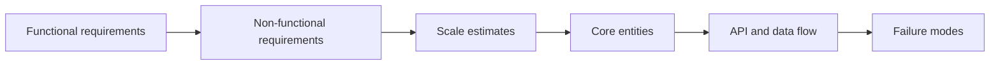
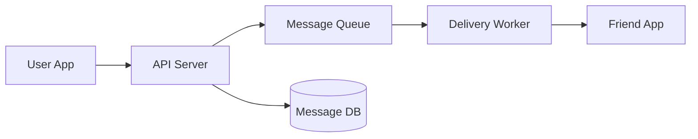
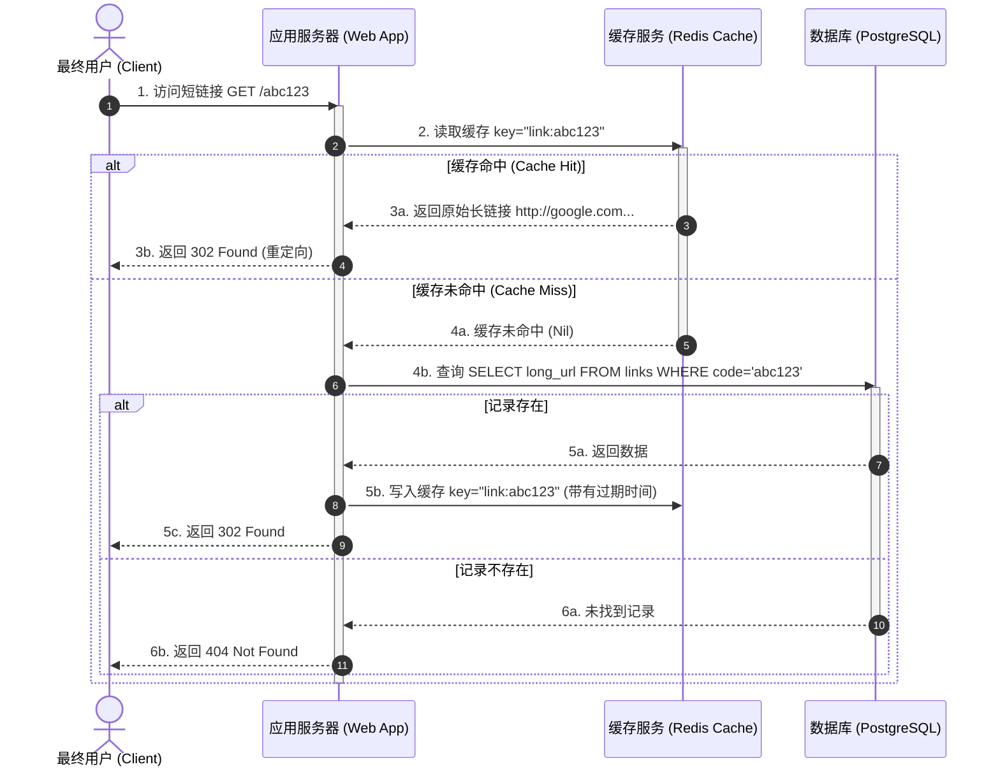

import GlossaryTerm from '@site/src/components/GlossaryTerm';
import GuidedExercise from '@site/src/components/GuidedExercise';
import ResearchNote from '@site/src/components/ResearchNote';
import TradeoffExplorer from '@site/src/components/TradeoffExplorer';
import QuizCard from '@site/src/components/QuizCard';

# Month 2 - HLD、LLD 与需求澄清

X 文章中的 freshers roadmap 有一个重要优点：它把初学者最先需要掌握的动作说得很朴素，先澄清需求，再估算规模，再画高层图，最后深入关键部分。这个顺序对面试有用，对真实架构评审也有用。

## <GlossaryTerm term="HLD" definition="高层设计 (High-Level Design)：描述系统宏观组件（服务、数据库、网关、消息队列等）、相互关系以及端到端数据流的架构蓝图。">HLD</GlossaryTerm> 与 <GlossaryTerm term="LLD" definition="低层设计 (Low-Level Design)：细化组件内部的类关系、接口契约、具体方法签名、以及采用的设计模式，用于指导代码实现。">LLD</GlossaryTerm>

| 类型 | 关注点 | 典型问题 |
|---|---|---|
| HLD - High-Level Design | 组件、数据流、容量、可用性、扩展性 | TinyURL、Twitter timeline、chat app |
| LLD - Low-Level Design | 类、接口、状态、方法、设计模式 | Parking lot、elevator、rate limiter |

HLD 让别人知道系统如何协作。LLD 让别人知道代码如何承载变化。两者不是竞争关系，而是不同放大倍数。

## 为什么一定要先澄清需求

系统设计不是猜谜。你必须先知道系统的目标、边界和负载，否则任何组件选择都会变成装饰。比如“设计聊天系统”这句话本身没有足够信息。它可能是客服聊天、多人群聊、企业 IM、游戏内聊天，甚至是医疗场景里的合规消息系统。每一种场景的数据库、延迟目标、审计要求和失败处理都不同。

这里最重要的词是 <GlossaryTerm term="Functional Requirement" definition="系统必须提供的功能，例如发送消息、创建短链接、上传文件。它回答“系统做什么”。">Functional Requirement</GlossaryTerm> 和 <GlossaryTerm term="Non-Functional Requirement" definition="系统必须满足的质量属性，例如延迟、吞吐、可用性、安全、成本、可维护性。它回答“系统做得多好、在什么约束下做”。">Non-Functional Requirement</GlossaryTerm>。初学者常常只说功能，不说质量属性，于是设计永远停在“能跑”的水平。

<ResearchNote
  title="CAP 不是口号，而是故障条件下的选择"
  source="Gilbert and Lynch, Brewer's conjecture and the feasibility of consistent, available, partition-tolerant web services"
  href="https://dl.acm.org/doi/10.1145/564585.564601"
  insight="<GlossaryTerm term='CAP Theorem' definition='CAP 定理：在存在网络分区 (P) 时，分布式系统必须在一致性 (C) 与可用性 (A) 之间做出选择，两者无法完全同时保证。'>CAP 定理</GlossaryTerm> 讨论的是网络分区存在时，一致性和可用性无法同时完全保证。它不是说数据库只能贴 CP/AP 标签。"
  application="当你设计聊天、支付、库存或社交 feed 时，要说明网络故障下优先保护什么，而不是机械背诵 CAP。"
/>

## 需求澄清顺序

## 示例：简单聊天系统

### Functional requirements

- 用户可以发送文本消息。
- 用户可以看到最近消息。
- 系统需要保存消息历史。

### Non-functional requirements

- 发送消息延迟尽量低。
- 服务实例失败时，消息不能轻易丢失。
- 读历史消息可以比发送消息稍慢。

### 第一张 HLD 图

## 关键取舍

- **同步 vs 异步**：发送消息时是否必须等投递完成？
- **SQL vs NoSQL**：消息历史需要复杂查询，还是主要按 conversation id 顺序读取？
- **强一致 vs 最终一致**：发送成功后，对方列表是否必须立刻更新？

## 取舍不是“哪个好”，而是“在什么约束下更合适”

以聊天系统为例。如果你要求“发送成功后对方必须立刻收到”，系统会偏向同步链路，但这会让发送延迟受投递服务影响。如果你允许“发送成功后稍后投递”，系统可以用队列削峰，但用户可能看到短暂延迟。架构师的工作不是找一个永远正确的答案，而是把这些后果讲清楚。

你可以用这个句式训练：

> 在当前需求下，我选择 A 而不是 B，因为我们优先保护 X；代价是 Y；如果未来出现 Z，我会重新评估这个选择。

<TradeoffExplorer
  title="短链接生成策略对比"
  dimensions={['短码字符长度', '系统并发性能', '防爆冲突率', '部署复杂度', '防恶意遍历']}
  options={[
    {
      name: 'MD5/SHA256 哈希后截取 (Base62 编码)',
      scores: [5, 4, 2, 5, 5],
      note: '对原始 URL 做哈希截取前 6-8 位。由于哈希碰撞（冲突）是数学上必然发生的，当数据量大时，碰撞概率上升，需去库重试。',
      whenToUse: '读写流量不大、不希望部署额外分布式服务、要求短链接无序且防猜测遍历的场景。'
    },
    {
      name: '分布式发号器 (Distributed Range Provider / SnowFlake)',
      scores: [4, 5, 5, 2, 4],
      note: '集中式或按网段发放发号器 ID，然后将自增 ID 转换为 Base62 编码的短码。由于发号唯一，天然绝无冲突发生。',
      whenToUse: '高并发写入大规模场景，能够接受维护分布式发号中心（如 Redis/Zookeeper）的复杂度。'
    },
    {
      name: '数据库自增 ID + 进制转换',
      scores: [3, 2, 5, 5, 1],
      note: '单机数据库自增主键，将 10 进制数转换为 Base62 短码。极简单，但受单机写入 TPS 限制，且短码递增极易被黑客恶意爬取和猜测。',
      whenToUse: '极小项目、不需要超高并发扩展性、不担心内容被遍历泄露时。'
    }
  ]}
/>

## 练习：45 分钟限时讲解

设计一个 TinyURL：

1. 5 分钟澄清需求。
2. 5 分钟估算每天短链接创建量和访问量。
3. 10 分钟画 HLD。
4. 10 分钟深入短码生成、数据库和缓存。
5. 10 分钟讲 trade-off。
6. 5 分钟总结风险。

<GuidedExercise
  title="练习指引：TinyURL 第一次系统设计"
  goal="用最小组件画清楚创建短链接和访问短链接两条路径，不追求复杂。"
  hints={[
    '先问短链接是否需要登录才能创建。',
    '访问短链接的流量通常远大于创建短链接的流量。',
    '短码生成要考虑冲突，数据库要保存 code -> long_url 映射。',
    '热门短链接适合缓存，但失效和删除会带来一致性问题。'
  ]}
  steps={[
    '写出两个核心 API：POST /links 创建短链接，GET /{code} 跳转。',
    '画第一版 HLD：Client -> API Server -> Database。',
    '加入短码生成器，说明随机、哈希或号段发放的差异。',
    '加入缓存，只放在读取路径上，解释 cache miss 怎么回源数据库。',
    '讨论 code 冲突：如果数据库已有这个 code 怎么办。',
    '讨论删除或过期：缓存里的旧 code 如何处理。',
    '最后用 3 句话总结你的 trade-off。'
  ]}
  checks={[
    '你能区分创建路径和访问路径。',
    '你能解释为什么读取路径更适合缓存。',
    '你能说明短码冲突不是概率小就可以忽略。',
    '你能说出一个你暂时不解决的问题，例如全球多区域复制。'
  ]}
/>

## 常见误解

- **“画得复杂”不等于“设计得好”**: 初学阶段，清晰比复杂重要。如果用 3 个简单组件能解决，就不要画 10 个微服务。
- **“NoSQL 更适合大规模”不是万能答案**: 你必须说明具体的访问模式。如果没有海量吞吐或半结构化数据，SQL 往往是更安全、支持强一致和复杂关联的首选。
- **“加缓存”不是结束，而是新问题的开始**: 缓存失效（Cache Invalidation）、缓存穿透（Penetration）、缓存雪崩（Avalanche）、以及缓存与数据库的双写一致性（Cache Coherency）都是架构设计中必须配套解释的难点。
- **“盲目挂上 CP/AP 标签就不做容灾”**: CAP 定理描述的是网络分区（P）这一极端状况下的抉择。在没有网络故障的正常运行（Normal Operation）状态下，可用性与延迟依然是系统关注的重中之重（这正是 PACELC 定理的内容），不能一言以蔽之。

## 六、章末自测

<QuizCard
  questions={[
    {
      q: '在系统设计面试或真实的架构评审中，对于模糊需求（例如：设计一个即时通信应用），最致命的首步误区是什么？',
      options: [
        '没有先进行功能与非功能需求的澄清、量级估算，就直接绘制大量微服务框图并决定使用特定的数据库或中间件。',
        '没有在第一秒就编写出具体的 React 类代码。',
        '询问系统是否需要支持多人在线语音通话。'
      ],
      answer: 0,
      explain: '需求澄清是系统设计的地基。若不清楚功能边界（只单聊还是群聊）、非功能约束（平均延迟、高可用级别、存储量级等），后续所有的技术选型（如分片、缓存、队列等）都会成为盲目且无意义的过度设计。'
    },
    {
      q: '以下关于高层设计（HLD）与低层设计（LLD）的核心关注点和协作关系的描述，哪项是正确的？',
      options: [
        'HLD 关注类的方法签名与设计模式，LLD 关注微服务进程的物理部署拓扑。',
        'HLD 关注系统的大局组件（如网关、队列、存储）和端到端数据流向；LLD 则深入到进程内部的类设计、契约接口和状态变更；两者是系统在不同抽象精度（放大倍数）下的表达，应相互咬合。',
        'HLD 与 LLD 具有严重的职责冲突，成熟团队一般只做 HLD，不做任何 LLD。'
      ],
      answer: 1,
      explain: '系统设计需要大处着眼（HLD）、小处着手（LLD）。HLD 解决宏观拓扑与数据流动，LLD 解决具体构件的面向对象健壮性与接口契约设计（如限流器组件的具体字段与算法逻辑），两者缺一不可。'
    },
    {
      q: '在进行系统设计的取舍（Tradeoffs）时，架构师应当用什么思维模式来做决策陈述？',
      options: [
        '寻找业界绝对完美的“银弹”方案，坚信存在没有任何缺陷和代价的技术选型。',
        '采用“在当前约束下，我选择 A 而不是 B，因为我们优先保护 X；代价是 Y；如果未来出现 Z，我会重新评估这个选择”的权衡论述，讲清边界代价。',
        '无条件选择性能最高的 NoSQL 数据库，不考虑团队技术栈与复杂查询模式。'
      ],
      answer: 1,
      explain: '系统设计本质是妥协与折中的艺术。没有完美的技术，只有最贴合当前业务上下文（如流量、算力、成本限制）的选型。优秀架构师能清晰剖析每个方案的代价（Consequences）并做好容灾规划。'
    }
  ]}
/>

## 延伸阅读

- [System Design Primer](https://github.com/donnemartin/system-design-primer)
- [ByteByteGoHq/system-design-101](https://github.com/ByteByteGoHq/system-design-101)
- [Let’s Code System Design Roadmap](https://www.lets-code.co.in/articles/systemdesign/)
