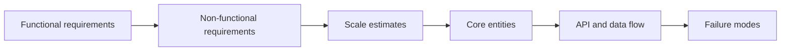
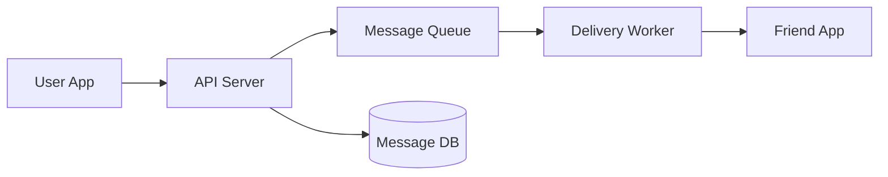

import GlossaryTerm from '@site/src/components/GlossaryTerm';
import GuidedExercise from '@site/src/components/GuidedExercise';
import ResearchNote from '@site/src/components/ResearchNote';

# Month 2 - HLD、LLD 与需求澄清

X 文章中的 freshers roadmap 有一个重要优点：它把初学者最先需要掌握的动作说得很朴素，先澄清需求，再估算规模，再画高层图，最后深入关键部分。这个顺序对面试有用，对真实架构评审也有用。

## HLD 与 LLD

| 类型 | 关注点 | 典型问题 |
|---|---|---|
| HLD - High-Level Design | 组件、数据流、容量、可用性、扩展性 | TinyURL、Twitter timeline、chat app |
| LLD - Low-Level Design | 类、接口、状态、方法、设计模式 | Parking lot、elevator、rate limiter |

HLD 让别人知道系统如何协作。LLD 让别人知道代码如何承载变化。两者不是竞争关系，而是不同放大倍数。

## 为什么一定要先澄清需求

系统设计不是猜谜。你必须先知道系统的目标、边界和负载，否则任何组件选择都会变成装饰。比如“设计聊天系统”这句话本身没有足够信息。它可能是客服聊天、多人群聊、企业 IM、游戏内聊天，甚至是医疗场景里的合规消息系统。每一种场景的数据库、延迟目标、审计要求和失败处理都不同。

这里最重要的词是 <GlossaryTerm term="Functional Requirement" definition="系统必须提供的功能，例如发送消息、创建短链接、上传文件。它回答“系统做什么”。">Functional Requirement</GlossaryTerm> 和 <GlossaryTerm term="Non-Functional Requirement" definition="系统必须满足的质量属性，例如延迟、吞吐、可用性、安全、成本、可维护性。它回答“系统做得多好、在什么约束下做”。">Non-Functional Requirement</GlossaryTerm>。初学者常常只说功能，不说质量属性，于是设计永远停在“能跑”的水平。

<ResearchNote
  title="CAP 不是口号，而是故障条件下的选择"
  source="Gilbert and Lynch, Brewer's conjecture and the feasibility of consistent, available, partition-tolerant web services"
  href="https://dl.acm.org/doi/10.1145/564585.564601"
  insight="CAP 讨论的是网络分区存在时，一致性和可用性无法同时完全保证。它不是说数据库只能贴 CP/AP 标签。"
  application="当你设计聊天、支付、库存或社交 feed 时，要说明网络故障下优先保护什么，而不是机械背诵 CAP。"
/>

## 需求澄清顺序

## 示例：简单聊天系统

### Functional requirements

- 用户可以发送文本消息。
- 用户可以看到最近消息。
- 系统需要保存消息历史。

### Non-functional requirements

- 发送消息延迟尽量低。
- 服务实例失败时，消息不能轻易丢失。
- 读历史消息可以比发送消息稍慢。

### 第一张 HLD 图

## 关键取舍

- **同步 vs 异步**：发送消息时是否必须等投递完成？
- **SQL vs NoSQL**：消息历史需要复杂查询，还是主要按 conversation id 顺序读取？
- **强一致 vs 最终一致**：发送成功后，对方列表是否必须立刻更新？

## 取舍不是“哪个好”，而是“在什么约束下更合适”

以聊天系统为例。如果你要求“发送成功后对方必须立刻收到”，系统会偏向同步链路，但这会让发送延迟受投递服务影响。如果你允许“发送成功后稍后投递”，系统可以用队列削峰，但用户可能看到短暂延迟。架构师的工作不是找一个永远正确的答案，而是把这些后果讲清楚。

你可以用这个句式训练：

> 在当前需求下，我选择 A 而不是 B，因为我们优先保护 X；代价是 Y；如果未来出现 Z，我会重新评估这个选择。

## 练习：45 分钟限时讲解

设计一个 TinyURL：

1. 5 分钟澄清需求。
2. 5 分钟估算每天短链接创建量和访问量。
3. 10 分钟画 HLD。
4. 10 分钟深入短码生成、数据库和缓存。
5. 10 分钟讲 trade-off。
6. 5 分钟总结风险。

<GuidedExercise
  title="练习指引：TinyURL 第一次系统设计"
  goal="用最小组件画清楚创建短链接和访问短链接两条路径，不追求复杂。"
  hints={[
    '先问短链接是否需要登录才能创建。',
    '访问短链接的流量通常远大于创建短链接的流量。',
    '短码生成要考虑冲突，数据库要保存 code -> long_url 映射。',
    '热门短链接适合缓存，但失效和删除会带来一致性问题。'
  ]}
  steps={[
    '写出两个核心 API：POST /links 创建短链接，GET /{code} 跳转。',
    '画第一版 HLD：Client -> API Server -> Database。',
    '加入短码生成器，说明随机、哈希或号段发放的差异。',
    '加入缓存，只放在读取路径上，解释 cache miss 怎么回源数据库。',
    '讨论 code 冲突：如果数据库已有这个 code 怎么办。',
    '讨论删除或过期：缓存里的旧 code 如何处理。',
    '最后用 3 句话总结你的 trade-off。'
  ]}
  checks={[
    '你能区分创建路径和访问路径。',
    '你能解释为什么读取路径更适合缓存。',
    '你能说明短码冲突不是概率小就可以忽略。',
    '你能说出一个你暂时不解决的问题，例如全球多区域复制。'
  ]}
/>

## 常见误解

- “画得复杂”不等于“设计得好”。初学阶段，清晰比复杂重要。
- “NoSQL 更适合大规模”不是万能答案。你必须说明访问模式。
- “加缓存”不是结束，而是新问题的开始：失效、穿透、雪崩、一致性都要解释。

## 延伸阅读

- [System Design Primer](https://github.com/donnemartin/system-design-primer)
- [ByteByteGoHq/system-design-101](https://github.com/ByteByteGoHq/system-design-101)
- [Let’s Code System Design Roadmap](https://www.lets-code.co.in/articles/systemdesign/)
