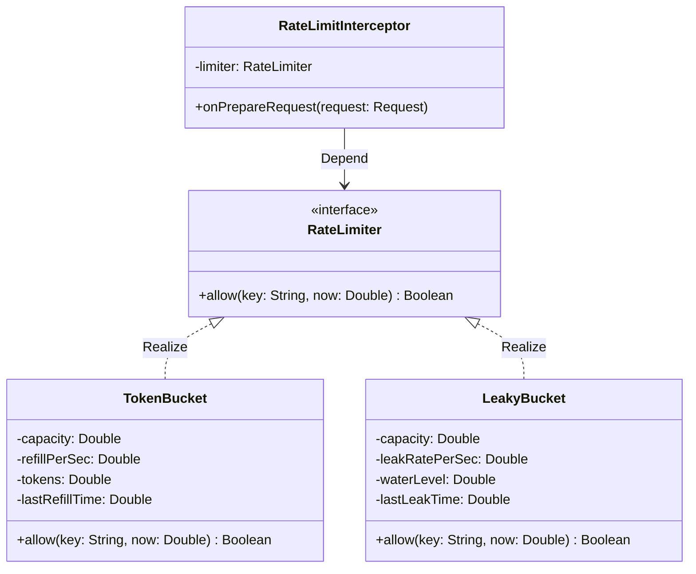
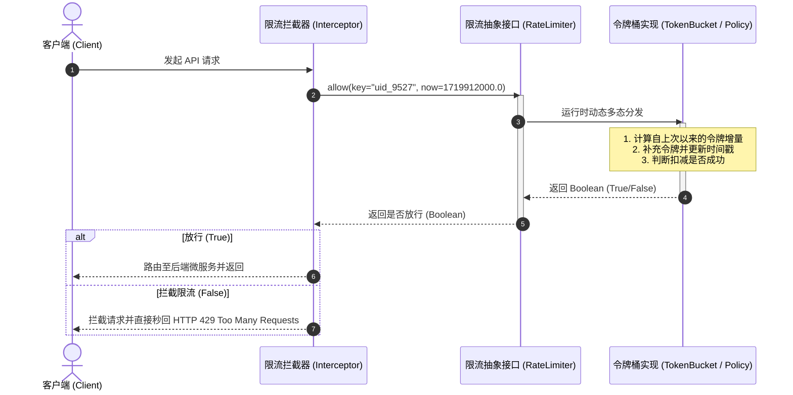
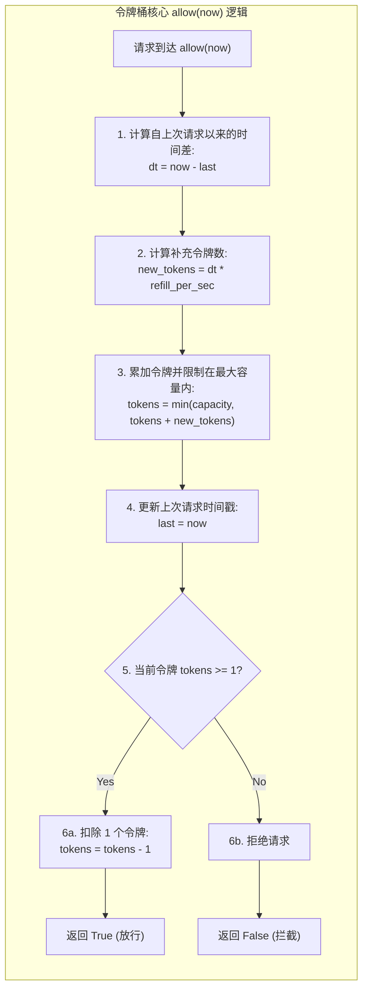

import GlossaryTerm from '@site/src/components/GlossaryTerm';
import GuidedExercise from '@site/src/components/GuidedExercise';
import ResearchNote from '@site/src/components/ResearchNote';
import ChapterMeta from '@site/src/components/ChapterMeta';
import PyRunner from '@site/src/components/PyRunner';
import TradeoffExplorer from '@site/src/components/TradeoffExplorer';
import QuizCard from '@site/src/components/QuizCard';

# M2L9 · LLD：从 HLD 到类与接口

<ChapterMeta
  time="约 2 小时"
  prereqs={[{label: 'M2L5 HLD', href: './hld-diagramming'}, {label: 'L2 模块与契约', href: '../foundations/modules-and-contracts'}]}
  outcome="能把 HLD 里的一个组件，细化成类、接口、方法签名和数据模型；并用“面向接口”让实现可替换。"
  howToUse="先看 HLD 的一个框怎么放大成类，再看限流器的完整 LLD，最后做 lab 实现它。"
/>

:::tip HLD 画"框"，LLD 画"框里面"
HLD 告诉你"有个限流服务"；LLD 告诉你这个服务里有哪些类、它们的接口和方法长什么样、数据怎么建模。LLD 是 HLD 和真实代码之间的桥。
:::

## 一、"有个限流服务"——里面到底有什么？

你的 HLD 里画了个框叫"限流服务"。面试官追问："它内部怎么设计？" 这就进入了 <GlossaryTerm term="LLD" definition="低层设计（Low-Level Design）：把高层组件细化为具体的类、接口、方法签名、数据结构和算法。是 HLD 和代码之间的桥。">LLD</GlossaryTerm>：定义类、接口、方法、数据模型。这一课就是把 [Month 1 的模块/契约思想](../foundations/modules-and-contracts) 落到具体的类设计上。

## 二、三个核心概念（分层）

### 基础：LLD 要产出什么

把一个组件细化为：

- **类与职责**：有哪些类，各自负责什么（<GlossaryTerm term="Single Responsibility Principle" definition="单一职责原则 (SRP)：面向对象设计原则之一，要求一个类应该仅有一个引起它变化的原因，即只负责完成一项特定的业务功能，以提高类的内聚度和可重用性。">单一职责</GlossaryTerm>，回扣 [L2 内聚](../foundations/modules-and-contracts)）。
- **接口/方法签名**：对外暴露什么方法、入参出参是什么（契约）。
- **数据模型**：核心实体的字段和关系（回扣 [L7](../foundations/data-modeling)）。



### 进阶：面向接口，而非实现

<GlossaryTerm term="Program to an Interface" definition="面向接口编程：依赖一个抽象接口而非具体实现类。这样可以替换实现（如内存版换数据库版）而不改调用方。">面向接口编程</GlossaryTerm> 是 LLD 的灵魂（也是 [L2 契约](../foundations/modules-and-contracts) 的延续）：先定义一个接口（如 `RateLimiter.allow()`），再通过面向对象的 <GlossaryTerm term="Polymorphism" definition="多态：面向对象编程的核心特征之一。允许不同子类对象对同一接口/抽象方法做出不同的实现响应，使得调用方只需编写针对接口的通用逻辑，即可在运行时动态绑定具体实现。">多态性</GlossaryTerm> 编写具体实现（令牌桶、漏桶……）。调用方只依赖接口，于是实现可以随便换、可以做测试替身（回扣 [L13](../foundations/testing-and-tdd)）。



### 深入（选学）：设计模式是复用的解法

很多 LLD 问题前人已有成熟解法，沉淀为<GlossaryTerm term="Design Pattern" definition="设计模式：针对反复出现的设计问题的可复用解决方案模板（如工厂、策略、观察者）。由 GoF《设计模式》系统化。">设计模式</GlossaryTerm>（GoF 23 种）。比如"限流算法可替换"用策略模式、"创建对象"用工厂模式。**现在只需知道它们存在**——Month 4 会专门深入"从变化点推导模式"。

<ResearchNote
  title="把反复出现的设计问题，沉淀成可复用模板"
  source="Gamma, Helm, Johnson & Vlissides (1994), Design Patterns: Elements of Reusable Object-Oriented Software（GoF）"
  href="https://en.wikipedia.org/wiki/Design_Patterns"
  insight="GoF 把面向对象设计中反复出现的问题，总结成 23 个有名字的可复用模式（工厂、策略、观察者、适配器……），给了工程师一套沟通设计的共同词汇。"
  application="LLD 不必每次从零发明。识别“这里的变化点是什么”，往往能对应到一个成熟模式。但别过度套用——模式是用来管理变化的，不是用来炫技的（Month 4 详解）。"
/>

## 三、跟我做一遍：限流器的 LLD

把 HLD 的"限流服务"框，放大成接口 + 令牌桶实现：



<PyRunner
  expect="限流生效"
  code={`# 接口：调用方只依赖 allow(now) 这个契约
class TokenBucket:
    def __init__(self, capacity, refill_per_sec):
        self.capacity = capacity            # 桶容量（突发上限）
        self.refill = refill_per_sec        # 每秒补多少令牌
        self.tokens = capacity
        self.last = 0.0

    def allow(self, now):
        # 按经过的时间补充令牌（不超过容量）
        self.tokens = min(self.capacity, self.tokens + (now - self.last) * self.refill)
        self.last = now
        if self.tokens >= 1:
            self.tokens -= 1
            return True
        return False

bucket = TokenBucket(capacity=2, refill_per_sec=1)
print("t=0:", bucket.allow(0))   # True（用掉 1，剩 1）
print("t=0:", bucket.allow(0))   # True（用掉 1，剩 0）
print("t=0:", bucket.allow(0))   # False（没令牌了）
print("t=1:", bucket.allow(1))   # True（过了 1 秒，补了 1 个）
print("限流生效")`}
/>

注意：调用方只用 `allow(now)` 这个**接口**，完全不关心内部是令牌桶还是别的算法——想换漏桶，只要新写一个有 `allow()` 的类即可（面向接口）。**试试**：把容量改成 5，看它允许更大的突发。

## 四、动手 Lab（必做）

打开 `labs/month02/m2l9_lld/`：

```bash
python labs/month02/m2l9_lld/test_rate_limiter.py
```

实现令牌桶限流器——一道经典的 LLD 题，练接口、状态、算法。

<GuidedExercise
  title="练习指引：实现令牌桶限流器"
  goal="练习把一个 HLD 组件落成具体的类设计：清晰的接口、内部状态、正确的算法。"
  hints={[
    '核心状态：当前令牌数、上次补充时间。',
    'allow(now) 先按经过时间补令牌（不超过容量），再看够不够扣 1。',
    '令牌数要 min(capacity, ...) 封顶，否则会无限攒。',
    '想想：如果要换成"漏桶"算法，调用方代码要改吗？（不该改——面向接口。）'
  ]}
  steps={[
    '实现 TokenBucket(capacity, refill_per_sec)，初始化满桶。',
    'allow(now)：按 (now - last) * refill 补令牌、封顶到 capacity。',
    '令牌 >= 1 则扣 1 返回 True，否则返回 False。',
    '写测试：突发用尽返回 False；时间推进后恢复 True。',
    '跑到全过。'
  ]}
  checks={[
    '你能说出 LLD 要产出哪几样东西（类/接口/方法/数据模型）。',
    '你的限流器有清晰的接口和内部状态。',
    '你能解释面向接口为什么让实现可替换。',
    '你能说出令牌桶的 capacity 和 refill 各控制什么。'
  ]}
/>

## 架构师深潜（Staff+ 视角）

### 1. 好的 LLD = 把"会变的"藏在接口后面

LLD 的高低之分，在于你有没有识别出"未来会变的点"，并用接口把它隔离（回扣 [L2 信息隐藏](../foundations/modules-and-contracts)）。限流算法会变 → 抽 `RateLimiter` 接口；存储会变 → 抽 `Store` 接口。**接口画在变化点上，系统才好演进。**

### 2. 同一个需求，多种算法

<TradeoffExplorer
  title="限流算法怎么选"
  dimensions={['允许突发', '平滑程度', '实现复杂度', '内存开销', '精确度']}
  options={[
    {
      name: '令牌桶（Token Bucket）',
      scores: [5, 3, 3, 4, 4],
      note: '攒令牌允许一定突发，平时按速率补。最常用，兼顾突发和限速。',
      whenToUse: '允许短时突发、又要长期限速的场景（API 限流主流选择）。'
    },
    {
      name: '漏桶（Leaky Bucket）',
      scores: [1, 5, 3, 4, 4],
      note: '请求以恒定速率流出，最平滑，但不允许突发。',
      whenToUse: '需要严格平滑输出（如对下游恒定压力）时。'
    },
    {
      name: '固定窗口计数',
      scores: [3, 1, 5, 5, 2],
      note: '每个时间窗计数。最简单，但窗口边界会出现双倍突发。',
      whenToUse: '要求不高、实现要最简单时。'
    },
    {
      name: '滑动窗口',
      scores: [3, 4, 2, 3, 5],
      note: '更精确地限制任意时间窗内的请求数，消除边界突发。但实现和内存更重。',
      whenToUse: '需要精确限流、不能容忍边界突发时。'
    }
  ]}
/>

### 3. 真实案例：接口让系统能演进

[WhatsApp 用同样的连接接口承载演进](../atlas/whatsapp.mdx)、[ChatGPT 用统一的推理接口换不同模型](../atlas/chatgpt.mdx)——它们的演进之所以平滑，正是因为关键能力被抽象成了稳定接口。**LLD 的接口设计，决定了系统十年后好不好改。**

### 4. 架构师深问（给自己 30 分钟）

- 给"设计一个微信"里的"消息发送"组件做 LLD：有哪些类？`MessageService` 的方法签名是什么？消息的数据模型？
- 你的限流服务要支持"按用户限流"和"按 IP 限流"，怎么用接口设计让两者复用同一套算法？
- 哪些地方该抽接口，哪些地方抽了反而是过度设计？（回扣 L2：为变化抽象，不为抽象而抽象。）

## 自检清单

- [ ] 我能把一个 HLD 组件细化成类/接口/方法/数据模型。
- [ ] 我的 lab 限流器接口清晰、算法正确。
- [ ] 我能解释面向接口为什么让实现可替换、可测试。
- [ ] 我知道设计模式是复用解法（Month 4 深入）。

## 常见误解

- **"LLD 就是把代码写出来"**: LLD 是类/接口/数据模型的设计，核心是定义系统的协作契约和职责边界，应发生在真正编写细节代码之前。直接动手码代码而不做接口抽象，极易陷入不断修改类结构和依赖传递的重构泥潭。
- **"接口越多越灵活"**: 接口确实能提供解耦性，但同时会引入额外的调用跳转、类层级膨胀以及认知成本。只有在存在“多种潜在算法实现（如不同限流策略）”或“需要解耦具体技术组件（如内存 vs Redis）”的变化点才应当定义接口，过度抽象是典型的过度设计。
- **"设计模式要尽量多用"**: 很多初学者为了体现自己的技术水平，在设计时不管业务是否真有变化点，生硬套用各种工厂、策略、装饰器等，导致一个简单的限流需要十几个类，反而让系统维护极其困难。应该“顺应变化、延迟引入”。

## 五、章末自测

<QuizCard
  questions={[
    {
      q: '在低层设计（LLD）阶段，‘面向接口编程而非面向实现编程’的黄金准则如何体现其架构价值？',
      options: [
        '它要求给每一个类写一个完全一模一样的子类，以保证代码量充足。',
        '通过抽离出行为契约（接口），如 `RateLimiter.allow()`，使调用方完全不依赖具体实现。这样后续在将令牌桶换为滑动窗口限流、或者内存版换为 Redis 分布式限流时，调用方的业务代码无需做出任何改动，且能通过 mock 接口实现完美单元测试。',
        '它能直接将多线程下的 CPU 争用问题物理化解为零。'
      ],
      answer: 1,
      explain: '接口是软件架构隔离变动最核心的手段。面向接口隔离了具体细节，符合高内聚低耦合与开闭原则（OCP）。'
    },
    {
      q: '在令牌桶（Token Bucket）限流算法的低层设计（LLD）数据建模中，最少需要哪些状态字段就能在无定时器的状态下实现计算？',
      options: [
        '只需当前令牌数，并开一个后台物理线程每毫秒加 1 个令牌。',
        '需要当前累积的令牌数（tokens）、上次请求时间戳（last_refill_time）、桶最大容量（capacity）和每秒补充速率（refill_rate）。基于这四个字段，在每次请求到达时，通过时间增量动态计算补充的令牌，避免了轮询线程造成的 CPU 开销。',
        '只需记录一个请求计数器和固定窗口的开始时间。'
      ],
      answer: 1,
      explain: '懒加载（Lazy Refill）计算。即利用 `(now - last_refill_time) * refill_rate` 计算当前应补的令牌，是令牌桶在高性能高并发无定时器场景下的标准 LLD 建模实践。'
    },
    {
      q: '如果面试官让你设计一个接口以支持‘多维限流’（例如：IP 级别、用户 ID 级别、接口名级别），在 LLD 中应该怎样设计该接口的入参？',
      options: [
        '设计一个通用的 `allow(key: String, now: Double)` 方法，其中 `key` 代表限流的维度标识（如 `ip_192.168.1.1` 或 `uid_9527`），这使得限流引擎可以保持逻辑纯粹性，而把维度的生成规则解耦到调用方。',
        '将 IP、用户 ID、接口名等字段作为特定参数全部硬编码定义在 `allow(ip, userId, apiName, now)` 方法签名中。',
        '强制要求只支持一种维度，不提供多维限流接口。'
      ],
      answer: 0,
      explain: '设计要解耦。接口应当对底层的存储和过滤保持通用性。如果将维度直接硬编码到接口中，就会丧失灵活性。传递通用 `key` 是业界最标准的扩展解法。'
    }
  ]}
/>

## 延伸阅读

- [GoF, Design Patterns](https://en.wikipedia.org/wiki/Design_Patterns)
- [下一课：通信与解耦](./communication-decoupling)
- [Month 4 会专门深入设计模式（敬请期待）](./overview)
