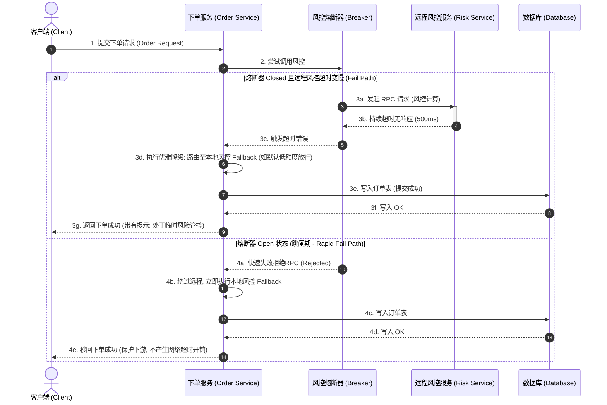
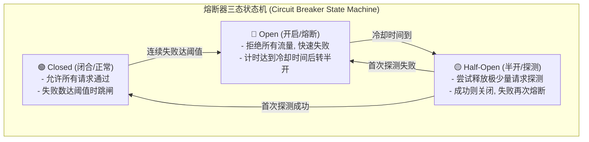
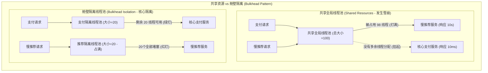

import GlossaryTerm from '@site/src/components/GlossaryTerm';
import GuidedExercise from '@site/src/components/GuidedExercise';
import ResearchNote from '@site/src/components/ResearchNote';
import ChapterMeta from '@site/src/components/ChapterMeta';
import PyRunner from '@site/src/components/PyRunner';
import TradeoffExplorer from '@site/src/components/TradeoffExplorer';
import QuizCard from '@site/src/components/QuizCard';

# M2L11 · 可靠性与容错设计

<ChapterMeta
  time="约 2 小时"
  prereqs={[{label: 'L4 错误与熔断', href: '../foundations/error-handling'}, {label: 'M2L4 可用性', href: './sla-slo-availability'}]}
  outcome="能在架构层面设计容错：冗余 + 故障转移 + 优雅降级 + 熔断，让部分失败不拖垮整体。"
  howToUse="先跑熔断器状态机的演示，理解它怎么保护系统，再做 lab 实现它。"
/>

:::tip 大规模下，失败是常态而非例外
机器会宕、网络会断、依赖会慢——在足够大的系统里，**总有东西正在坏**。可靠性不是"让它永不失败"，而是"部分失败时，整体仍能（降级）服务"。这一课把 [L4 的失败思维](../foundations/error-handling) 提到架构层。
:::

## 一、一个依赖挂了，整个系统会跟着挂吗？

你的下单依赖风控服务。某天风控变慢/挂了。如果你的设计是"必须等风控返回才能下单"，那风控一挂，下单全挂——一个非核心依赖产生了 <GlossaryTerm term="Cascading Failure" definition="级联故障（雪崩效应）：分布式系统中，由于局部组件发生故障，导致其他依赖它的组件也相继发生资源耗尽或异常崩溃，最终雪崩式拖垮整个系统的现象。">级联故障（雪崩效应）</GlossaryTerm>，拖垮了整个核心功能。**好的容错设计会让风控挂掉时，下单仍能（用降级策略）继续。** 这一课讲怎么做到。



## 二、三个核心概念（分层）

### 基础：冗余与故障转移

可靠性的第一招是**别有单点**（回扣 [M2L4 冗余](./sla-slo-availability)）：

- <GlossaryTerm term="Redundancy" definition="冗余：关键组件部署多个副本，任一副本挂掉其它仍能服务。是高可用的基础。">冗余</GlossaryTerm>：关键组件多副本。
- <GlossaryTerm term="Failover" definition="故障转移：当主实例失效时，自动切换到备用实例。配合健康检查实现自动恢复。">故障转移</GlossaryTerm>：主挂了自动切到备。
- <GlossaryTerm term="Health Check" definition="健康检查：定期探测实例是否存活/就绪，让负载均衡把流量只发给健康实例。">健康检查</GlossaryTerm>：让流量只发给健康实例。

### 进阶：优雅降级、熔断、舱壁

让"部分失败"不变成"整体失败"的三件套（[L4](../foundations/error-handling) 的架构级应用）：

- <GlossaryTerm term="Graceful Degradation" definition="优雅降级：依赖不可用时返回一个够用的结果（缓存旧值、默认值、精简功能），而不是整体报错。">优雅降级</GlossaryTerm>：风控挂了 → 走默认风险策略，而不是拒绝下单。
- <GlossaryTerm term="Circuit Breaker" definition="熔断器：当某依赖连续失败到阈值就跳闸，一段时间内直接快速失败、不再调用它，给它喘息恢复的机会，之后半开试探。">熔断器</GlossaryTerm>：依赖连续失败就跳闸，停止调用、快速失败，防止 [重试风暴](../foundations/error-handling)。



- <GlossaryTerm term="Bulkhead" definition="舱壁：像船的隔舱，把资源（线程池/连接池）按依赖隔离，一个依赖耗尽自己的资源也不会拖垮其它。">舱壁隔离</GlossaryTerm>：给每个依赖独立的资源池，一个挂了不吃光全局资源。



### 深入（选学）：为失败而设计 + 主动制造失败

既然失败必然发生，成熟团队不只是"防"，还**主动注入失败**来验证容错是否真的有效——这就是<GlossaryTerm term="Chaos Engineering" definition="混沌工程：在生产或类生产环境主动注入故障（杀实例、断网络、加延迟），验证系统的容错设计是否真的有效。Netflix 的 Chaos Monkey 是代表。">混沌工程</GlossaryTerm>（Netflix Chaos Monkey 随机杀实例）。**只有被真实失败考验过的容错，才是可信的容错**（回扣 [L13 Jepsen 注入故障](../foundations/testing-and-tdd)）。

<ResearchNote
  title="主动制造故障，来证明你的系统扛得住"
  source="Netflix, Chaos Engineering / Principles of Chaos"
  href="https://principlesofchaos.org/"
  insight="Netflix 提出混沌工程：与其祈祷不出故障，不如在受控条件下主动注入故障（Chaos Monkey 随机终止实例），持续验证系统在真实失败下仍能工作。容错若从未被测试，就等于不存在。"
  application="这把 [L4 的“先设计失败”](../foundations/error-handling) 推到极致：不仅设计容错，还要主动验证它。架构师交付的“高可用”，必须经得起真实故障的考验，而不是 PPT 上的承诺。"
/>

## 三、跟我做一遍：熔断器状态机

<PyRunner
  expect="跳闸后快速失败"
  code={`class CircuitBreaker:
    def __init__(self, threshold, cooldown):
        self.threshold = threshold   # 连续失败几次跳闸
        self.cooldown = cooldown     # 跳闸后多久半开试探
        self.failures = 0
        self.state = "closed"
        self.opened_at = 0

    def call(self, ok, now):
        if self.state == "open" and now - self.opened_at >= self.cooldown:
            self.state = "half_open"          # 冷却够了，半开试一次
        if self.state == "open":
            return "rejected"                  # 跳闸期：直接快速失败
        if ok:
            self.failures = 0
            self.state = "closed"
            return "success"
        self.failures += 1
        if self.state == "half_open" or self.failures >= self.threshold:
            self.state = "open"; self.opened_at = now
        return "failure"

cb = CircuitBreaker(threshold=2, cooldown=5)
print(cb.call(False, 0))   # failure（1 次）
print(cb.call(False, 1))   # failure（达阈值 → 跳闸 open）
print(cb.call(True, 2))    # rejected（跳闸期，连试都不试）
print(cb.call(True, 7))    # success（冷却后半开，成功 → 关闭）
print("跳闸后快速失败")`}
/>

注意 `t=2` 那次：熔断器**直接拒绝、根本不调用挂掉的依赖**——这就是它保护系统、避免重试风暴的方式。**试试**：让 `t=7` 那次传 `False`（半开试探又失败），看它立刻重新跳闸。

## 四、动手 Lab（必做）

打开 `labs/month02/m2l11_circuit_breaker/`：

```bash
python labs/month02/m2l11_circuit_breaker/test_breaker.py
```

实现熔断器的三态状态机（closed → open → half-open）。

<GuidedExercise
  title="练习指引：实现一个熔断器"
  goal="把“依赖挂了就跳闸保护”做成状态机——这是分布式容错的标志性组件。"
  hints={[
    '三个状态：closed（正常）、open（跳闸，快速失败）、half_open（试探）。',
    'closed 下连续失败达阈值 → open，记录跳闸时间。',
    'open 下，过了 cooldown 才进入 half_open 试一次。',
    'half_open 成功 → closed（恢复）；half_open 失败 → 立刻 open。'
  ]}
  steps={[
    '实现 CircuitBreaker(threshold, cooldown)，初始 closed。',
    'call(ok, now)：open 且冷却够 → 转 half_open。',
    'open（未冷却）→ 返回 "rejected"。',
    'ok=True → 重置、closed、返回 "success"。',
    'ok=False → failures+1；half_open 或达阈值 → open（记 opened_at）；返回 "failure"。',
    '写测试覆盖：连续失败跳闸、跳闸期拒绝、冷却后半开恢复、半开再失败重跳闸。'
  ]}
  checks={[
    '你能画出熔断器的三态转换。',
    '你的熔断器在跳闸期会快速失败、不调用依赖。',
    '你能解释熔断器怎么防止重试风暴（回扣 L4）。',
    '你能区分熔断、降级、舱壁各解决什么。'
  ]}
/>

## 架构师深潜（Staff+ 视角）

### 1. 把依赖分成"核心"和"非核心"

容错设计的第一步是**分级**：哪些依赖挂了必须整体失败（如支付），哪些挂了可以降级继续（如推荐、风控可走默认）。对非核心依赖，永远要有降级路径——一个推荐服务不该能搞垮整个下单。

### 2. 提升可靠性的手段组合

<TradeoffExplorer
  title="容错手段怎么用"
  dimensions={['防整体失败', '实现复杂度', '资源成本', '恢复速度', '适用场景']}
  options={[
    {
      name: '冗余 + 故障转移',
      scores: [4, 3, 2, 4, 4],
      note: '多副本 + 自动切换，消除单点。可用性基础，但要双份资源。',
      whenToUse: '所有关键组件（数据库、网关、核心服务）。'
    },
    {
      name: '优雅降级',
      scores: [5, 3, 5, 5, 5],
      note: '依赖挂了返回"够用"结果。用户几乎无感，成本极低。',
      whenToUse: '非核心依赖（推荐、个性化、风控可默认）。'
    },
    {
      name: '熔断器',
      scores: [4, 3, 5, 4, 4],
      note: '依赖持续失败时跳闸快速失败，防重试风暴、给依赖喘息。',
      whenToUse: '调用可能持续不可用的远程依赖时。'
    },
    {
      name: '舱壁隔离',
      scores: [5, 2, 3, 3, 3],
      note: '按依赖隔离资源池，一个依赖耗尽资源也不波及其它。',
      whenToUse: '多依赖共享资源、要防一个拖垮全部时。'
    }
  ]}
/>

### 3. 真实案例：为失败而生的架构

[WhatsApp 的 Erlang "let it crash" + 监督树](../atlas/whatsapp.mdx) 是进程级容错；Netflix 的混沌工程是系统级容错验证。**它们的共同信念：失败不可避免，所以把"优雅地失败和恢复"设计进系统，并主动用故障去验证它。** 这正是 staff 级架构师和普通工程师的分水岭。

### 4. 架构师深问（给自己 30 分钟）

- "设计一个微信"：消息服务依赖（用户服务、推送、存储），哪些该降级、哪些该熔断、哪些必须冗余？
- 你给某依赖加了熔断，跳闸期间用户请求怎么办？（降级返回什么？回扣优雅降级。）
- 你怎么验证你的容错真的有效？设计一个最小的"混沌实验"（杀掉一个副本，看系统是否自愈）。

## 自检清单

- [ ] 我能用冗余 + 故障转移消除单点。
- [ ] 我的 lab 熔断器三态转换正确。
- [ ] 我能区分熔断、降级、舱壁各自的作用。
- [ ] 我理解"为失败而设计"并能设计一个混沌实验验证它。

## 常见误解

- **"高可靠 = 让它永不失败"**: 只要规模足够大，软硬件物理故障是必然会以一定概率发生的。可靠性设计的本质是承认局部失败是必然的常态，确保单个零件的崩溃不会引起系统雪崩，从而能够保障核心交易的正常运行。
- **"加了熔断就够了"**: 熔断器跳闸（Open）后只是简单地拦截流量。如果熔断不配降级（Fallback）策略（例如没有兜底缓存值或默认的风控逻辑），用户端依然只会看到冷冰冰的 500 报错，不可用时长没有任何改变。
- **"容错设计只要写了代码就一定能起效"**: 未经受过真实生产故障检验的容错方案等于不存在。这也是为什么 Netflix 主张推广混沌工程，常态化在真实生产环境拔网线、宕机器，以便发现那些隐藏在配置文件和异常捕获代码里的隐形 bug。
- **"级联故障（雪崩）只是网络慢而已"**: 级联故障最可怕的不是慢本身，而是由于下游依赖响应变慢，导致上游服务的请求积压（HTTP 连接池/线程池被吃光），进而让上游服务也跟着挂掉，最后像多米诺骨牌一样呈链状拖挂所有微服务。

## 五、章末自测

<QuizCard
  questions={[
    {
      q: '在微服务分布式架构中，熔断器（Circuit Breaker）处于‘开启（Open）’状态时，其核心表现是什么？',
      options: [
        '它依然把每一个请求同步发给下游服务，但是不等待响应结果。',
        '它拦截所有的调用请求，直接返回本地失败或执行优雅降级逻辑（快速失败 Rejected），绝不将请求发送到已经瘫痪的下游依赖，给它恢复的时间。',
        '它强制停止整个应用集群的运行，等待运维人员物理重启服务器。'
      ],
      answer: 1,
      explain: '熔断器的关键目的是保护下游和隔离雪崩。当状态为 Open 时，它充当‘门禁’，阻断一切流量回源，避免下游数据库或服务因为排队请求和重试风暴被彻底打挂。直到冷却期结束后进入 Half-Open 状态，才释放少量流量进行试探。'
    },
    {
      q: '‘舱壁隔离（Bulkhead）’设计模式是从轮船防沉设计的‘水密隔舱’概念演变而来的。在微服务开发中，以下哪项是舱壁模式的经典落地手段？',
      options: [
        '在应用服务器上部署更强劲的 CPU 防硬件损坏。',
        '为不同的下游依赖（如风控服务、支付服务、推荐服务）分配各自独立的线程池（Thread Pool）或连接池，使得某一个依赖变慢慢响应并占满对应线程池时，其他服务的线程池依然正常运行，避免整个 JVM 线程被吞噬殆尽。',
        '对所有依赖采用完全共享的单一巨大全局阻塞线程池以提高线程复用度。'
      ],
      answer: 1,
      explain: '隔离是高可用的核心手段。通过线程池/连接池舱壁隔离，即使下游推荐服务极其缓慢把推荐池占满，支付与下单服务的池子也是物理隔离的，从而防止了雪崩效应（Cascading Failure）拖垮整个系统。'
    },
    {
      q: '关于‘混沌工程（Chaos Engineering）’的实践，以下哪个理解是正确的？',
      options: [
        '由于线上业务极度脆弱，绝对禁止在生产或准生产环境进行任何人为的故障注入与杀实例验证。',
        '它的核心理念是‘为失败而设计’，通过在受控的类生产/生产环境中主动制造局部故障（如断网、杀节点），以此持续验证并优化系统的自愈、降级和容错逻辑，确保设计指标而非口头指标的可靠。',
        '混沌工程主要是为了在年底考核时给程序员找故障指标，没有实际系统价值。'
      ],
      answer: 1,
      explain: '高可用的架构若从未在真实灾难中演练过，其容错方案往往在发生事故时形同虚设。混沌工程（Chaos Engineering）提倡在受控范围内主动发现未知系统缺陷，防患于未然。'
    }
  ]}
/>

## 延伸阅读

- [Principles of Chaos Engineering](https://principlesofchaos.org/)
- [Michael Nygard, Release It!（稳定性模式）](https://pragprog.com/titles/mnee2/release-it-second-edition/)
- [下一课：Capstone 设计一个聊天应用](./capstone-chat)
