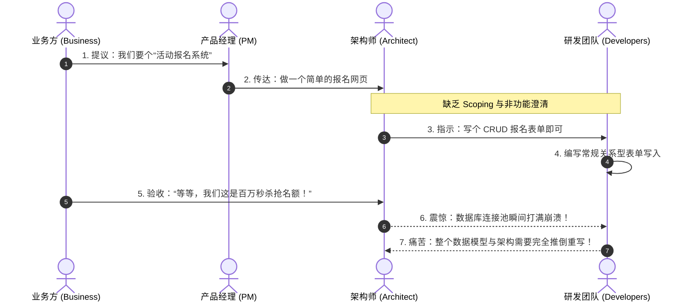
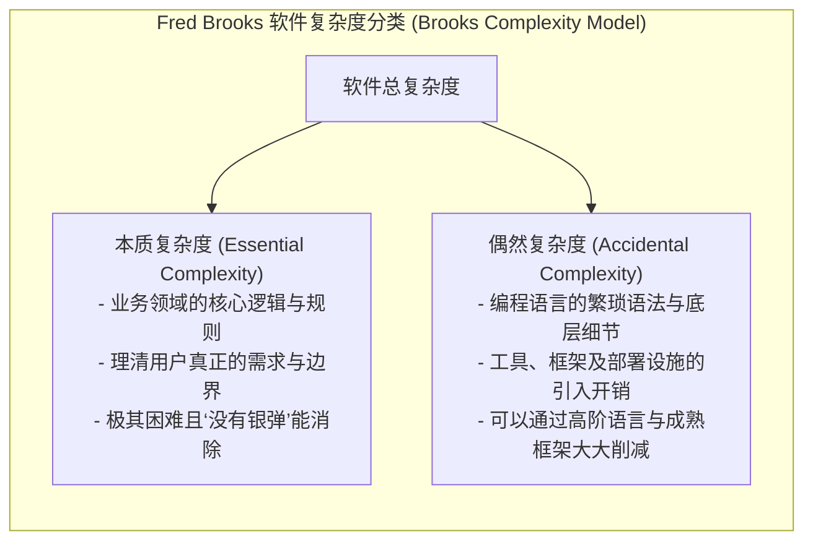
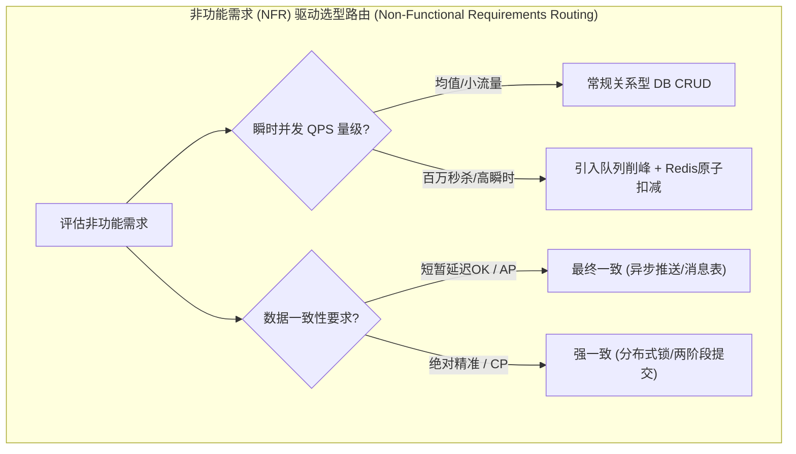

import GlossaryTerm from '@site/src/components/GlossaryTerm';
import GuidedExercise from '@site/src/components/GuidedExercise';
import ResearchNote from '@site/src/components/ResearchNote';
import ChapterMeta from '@site/src/components/ChapterMeta';
import TradeoffExplorer from '@site/src/components/TradeoffExplorer';
import QuizCard from '@site/src/components/QuizCard';

# M2L2 · 需求澄清

<ChapterMeta
  time="约 1.5 小时"
  prereqs={[{label: 'M2L1 系统设计方法论', href: './design-methodology'}]}
  outcome="能把一句话需求拆成功能需求 + 非功能需求 + 明确的 scope 边界 + 写下来的假设——一份能开始设计的需求纪要。"
  howToUse="先看“没问清楚就开做”的反例，再学澄清清单，最后给一道题写需求纪要。"
/>

:::tip 最贵的 bug 在写代码之前
代码写错了能改；**需求理解错了，整个系统都白做。** 这一课教你在动手设计前，先把"到底要做什么"问清楚、写下来——这是架构师最被低估、却最值钱的能力。
:::

## 一、做完了，才发现做错了

你按"做一个活动报名系统"开干，做出一个常规 CRUD。交付时业务说：这是**限时秒杀报名**——开抢瞬间百万人涌入抢 1000 个名额。这跟常规报名是**完全不同的系统**（要削峰、要防超卖、要抗住尖峰）。你不是代码写错了，是**需求没问清楚**。

> 这一课的铁律：**先把"做什么、给谁、什么规模、什么约束"问清楚并写下来，再设计。**

## 二、三个核心概念（分层）

### 基础：功能需求 vs 非功能需求

<GlossaryTerm term="Functional Requirements" definition="功能需求：系统要做什么——具体的功能和行为，如“用户能报名”“能查看报名列表”。">功能需求</GlossaryTerm>：系统**做什么**（能报名、能取消、能查列表）。

<GlossaryTerm term="Non-Functional Requirements" definition="非功能需求：系统要做得多好——性能、可用性、一致性、安全、成本等质量属性。它们往往比功能需求更决定架构。">非功能需求</GlossaryTerm>：系统**做得多好**（多少并发、延迟多低、几个 9 的可用、强一致还是最终一致、成本上限）。

**关键认知：决定架构形态的，往往是非功能需求。** "报名"这个功能很简单；但"开抢瞬间百万并发、绝不超卖"这个非功能需求，才是设计的真正难点。

### 进阶：澄清清单 + scoping + 写下假设

拿到需求，按这套清单问（问不到人就**写下你的假设**）：

| 维度 | 要问的问题 |
|---|---|
| 用户与规模 | 谁用？多少 DAU？读多还是写多？ |
| 功能边界 | 核心功能 3 条？哪些**明确不做**（[scoping](#)）？ |
| 一致性/延迟 | 能容忍短暂不一致吗？延迟目标？ |
| 可用性 | 几个 9？停机的代价多大？ |
| 约束 | 成本、合规、团队、时间线？ |

<GlossaryTerm term="Scoping" definition="划定范围：明确做什么和不做什么。写清不做的部分，能防止范围蔓延、聚焦核心。">Scoping（划范围）</GlossaryTerm> 里"明确不做什么"和"做什么"同样重要。把所有<GlossaryTerm term="Assumptions" definition="假设：在信息不全时，你对需求做出的、明确写下来的判断（如：假设 DAU 1000 万、读写比 10:1）。写下来让它可被质疑和修正。">假设</GlossaryTerm>写下来，它们才能被质疑和修正。

### 深入（选学）：需求是本质复杂度

Fred Brooks 在《No Silver Bullet》里区分了<GlossaryTerm term="Essential Complexity" definition="本质复杂度：来自问题本身的、无法被工具消除的复杂度（如搞清楚到底要做什么）。与之相对的是偶然复杂度（accidental，来自工具/实现）。">本质复杂度</GlossaryTerm>和<GlossaryTerm term="Accidental Complexity" definition="偶然复杂度：在软件开发中由引入的特定实现手段、编程语言或工具框架带来的非本质开销与复杂度（例如配置 Kubernetes 部署脚本或处理 Spring 框架兼容性）。">偶然复杂度</GlossaryTerm>：换语言、换框架只能消除偶然复杂度；而"想清楚到底要造什么"是本质复杂度，**没有银弹**。这就是为什么需求澄清是架构师最难、最值钱的工作——它处理的是不可消除的那部分难度。

<ResearchNote
  title="软件最难的部分，是决定要造什么"
  source="Fred Brooks (1987), No Silver Bullet: Essence and Accidents of Software Engineering"
  href="https://en.wikipedia.org/wiki/No_Silver_Bullet"
  insight="Brooks 论证：软件的本质复杂度（理清需求、概念建模）无法靠任何单一技术消除；“软件构建中最难的部分是决定要造什么”。工具进步只能削减偶然复杂度。"
  application="这给需求澄清正名：它不是“正式开工前的客套”，而是处理整个项目里最不可替代的难度。架构师在白板前问的每个问题，都是在攻克本质复杂度。"
/>

## 三、跟我做一遍：把一句话拆成需求纪要

需求："做一个活动报名系统。" 澄清后：

- **功能需求**：① 报名（带校验）② 查看报名列表 ③ 取消报名。
- **明确不做**：支付、退款、复杂审批流（V1 不做）。
- **非功能需求**：DAU 假设 50 万；**是否秒杀？** → 假设"普通报名，无瞬时尖峰"（若是秒杀，架构完全不同！）；一致性：不能超卖（名额强一致）；可用性：99.9%；延迟 p99 < 300ms。
- **写下的假设**：读写比 5:1；单活动名额上限千级；峰值约均值 3 倍。

看到"是否秒杀"这个问题了吗？**它一个问题就决定了你是在设计一个普通系统还是一个高难系统。** 这就是澄清的价值。

## 四、动手练习（设计题，非代码）

<GuidedExercise
  title="练习指引：为一道题写需求纪要"
  goal="练习把模糊需求拆成功能/非功能/scope/假设——这是设计前必须交出的第一份产物。"
  hints={[
    '功能需求用动词短句（"用户能 X"）；非功能需求用可度量的指标（QPS、延迟、几个 9）。',
    '一定要写"明确不做"的列表，它和"做什么"同样重要。',
    '凡是问不到答案的，就写"假设：……"，别默认。',
    '特别找出那个"一个问题就改变整个系统"的关键问题（像秒杀与否）。'
  ]}
  steps={[
    '选一道题（朋友圈 feed / 网盘 / 打车）。',
    '写 3–5 条功能需求 + 2–3 条"明确不做"。',
    '写非功能需求：规模、一致性、可用性、延迟、成本约束（可度量）。',
    '列出所有假设。',
    '标出 1 个"会颠覆整个设计"的关键澄清问题。'
  ]}
  checks={[
    '你能区分功能需求和非功能需求。',
    '你的纪要里有明确的"不做"清单和写下的假设。',
    '你的非功能需求是可度量的（有数字）。',
    '你找出了那个最关键的澄清问题。'
  ]}
/>

## 架构师深潜（Staff+ 视角）

### 1. 非功能需求才是架构的方向盘

同一个"报名"功能，非功能需求一变，架构天差地别：普通报名是 CRUD；秒杀报名要队列削峰 + 库存原子扣减 + 限流（回扣 [L8](../foundations/concurrency-basics)、[L11](../foundations/sync-async-timeout)）。**所以澄清非功能需求，就是在选架构。**

### 2. V1 该放什么进去？

<TradeoffExplorer
  title="第一版（V1）的范围怎么定"
  dimensions={['上线速度', '验证价值', '技术风险', '可演进性', '范围可控']}
  options={[
    {
      name: '最小可行产品（<GlossaryTerm term="MVP" definition="最小可行产品 (Minimum Viable Product)：仅包含能让早期用户使用并收集反馈的最核心功能的产品版本，用于快速验证市场假设。">MVP</GlossaryTerm>，只做核心）',
      scores: [5, 5, 4, 3, 5],
      note: '只做最核心的 1–2 个功能，尽快上线验证。但要小心别把架构做死、难以演进。',
      whenToUse: '需求/市场不确定、要快速验证时。绝大多数新系统的正确起点。'
    },
    {
      name: '大而全（一次做完整）',
      scores: [1, 2, 1, 4, 1],
      note: '一次把所有功能做齐。看似省事，实则范围失控、上线晚、还常做了没人用的功能。',
      whenToUse: '需求极其明确稳定、且有充足时间时——现实中很少。'
    },
    {
      name: '可演进的 MVP（核心 + 预留扩展点）',
      scores: [4, 5, 3, 5, 4],
      note: '做核心功能，但在边界处（L2 模块/契约）预留演进空间。略慢，但不会做死。',
      whenToUse: '推荐：既快速验证，又为已知的未来需求留好接缝。'
    }
  ]}
/>

### 3. 真实案例：克制的需求 = 强大的架构

[WhatsApp 的"No Ads, No Games, No Gimmicks"](../atlas/whatsapp.mdx) 本质就是一次极致的 scoping——明确"只做消息"，于是架构、团队、复杂度都被压到最小。**好的需求澄清，往往体现在"敢于不做什么"。**

### 4. 架构师深问（给自己 30 分钟）

- 给"设计一个微信"列 10 个澄清问题，按"哪个答案最能改变架构"排序。
- 同一个 feed 系统，"强一致(发了立刻所有人可见)"和"最终一致(几秒后可见)"会带来怎样不同的架构？
- 你怎么向非技术的业务方解释"非功能需求"为什么决定成本和工期？

## 自检清单

- [ ] 我能把一句话需求拆成功能/非功能需求。
- [ ] 我的需求纪要有"明确不做"和写下的假设。
- [ ] 我能说出为什么非功能需求决定架构。
- [ ] 我能找出"一个问题颠覆整个设计"的关键澄清点。

## 常见误解

- **"需求是产品的事，不关架构师"**: 这种认知极具毁灭性。产品经理通常只关注功能需求（业务流程与交互），而非功能需求（并发量、可用性指标、响应延迟目标、一致性要求）几乎全部属于架构师的技术选型范畴，需要架构师深度参与澄清。
- **"先做起来，需求在编码过程中边做边明确"**: 需求的不确定性代表着本质复杂度。如果在一片空白下不明确系统的核心并发指标和最终一致性边界就急于敲键盘编码，做出来的代码越多，架构走偏后的重构和废弃成本就越高。
- **"功能列表（Feature List）就等于全部需求"**: 只给出一张功能清单缺了约束条件，等于根本没说清要建一座什么样的桥梁。高并发秒杀报名与低频的后台系统表单，其背后所代表的是截然不同的两套架构方案，所以澄清约束比看Feature更重要。

## 五、章末自测

<QuizCard
  questions={[
    {
      q: '系统设计最昂贵、最难纠正的架构性决策错误往往发生在哪个阶段？',
      options: [
        '开始写代码并编译通过的时刻。',
        '在最初的需求澄清与 Scoping 阶段。如果在此时对非功能需求（如高并发、可用性要求）没有澄清，或者假设错误，会导致后期整个数据模型与物理部署架构需要完全推倒重来。',
        '在发布部署到生产环境的最后一步配置 YAML 脚本时。'
      ],
      answer: 1,
      explain: '需求澄清是软件架构的本质复杂度（Essential Complexity）。在这个阶段发生的错误具有累积放大效应，后续的所有编码、估算和 HLD 图都会建立在错误根基上，修复代价最高昂。'
    },
    {
      q: '关于功能需求与非功能需求（Non-Functional Requirements / NFR），以下哪项描述是正确的？',
      options: [
        '功能需求决定了系统要解决什么业务功能；而非功能需求（如 QPS 并发度、延迟目标、数据一致性要求）则决定了系统的硬件与软件架构选型与系统成本。',
        '只有功能需求对架构师有用，非功能需求只是运维团队在部署后才需要关心的监控指标。',
        '非功能需求指的是系统中一些不需要实现的多余功能。'
      ],
      answer: 0,
      explain: '非功能需求直接驱动架构设计。同一个‘活动报名表单’，并发 QPS 是 10 还是一百万，将决定你是只用一个单机 MySQL 还是引入分布式削峰消息队列与 Redis 分布式扣减，从而彻底改变系统设计。'
    },
    {
      q: '在 Fred Brooks 的经典论著《No Silver Bullet》中，将软件系统复杂度分为‘本质复杂度’与‘偶然复杂度’。以下哪项属于本质复杂度？',
      options: [
        '学习和编写复杂的 Java/Go 语言语法或配置复杂的 Spring/Kubernetes 框架。',
        '决定产品具体要做什么、理清复杂的业务规则和判定条件、划定功能边界以攻克‘想清楚要造什么’的问题。',
        '因为所选择的框架版本不兼容而花费数小时调试底层类库报错。'
      ],
      answer: 1,
      explain: '本质复杂度（Essential Complexity）根植于问题本身，换用再先进的开发工具和框架（消除偶然复杂度）也无法将其物理化解，只能通过科学的需求澄清和逻辑建模来战胜。'
    }
  ]}
/>

## 延伸阅读

- [Fred Brooks, No Silver Bullet](https://en.wikipedia.org/wiki/No_Silver_Bullet)
- [下一课：容量估算](./capacity-estimation)
- [架构案例库](../atlas)
