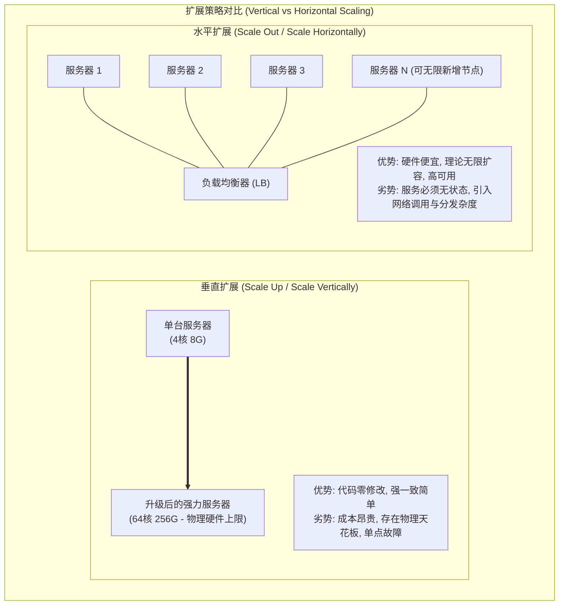
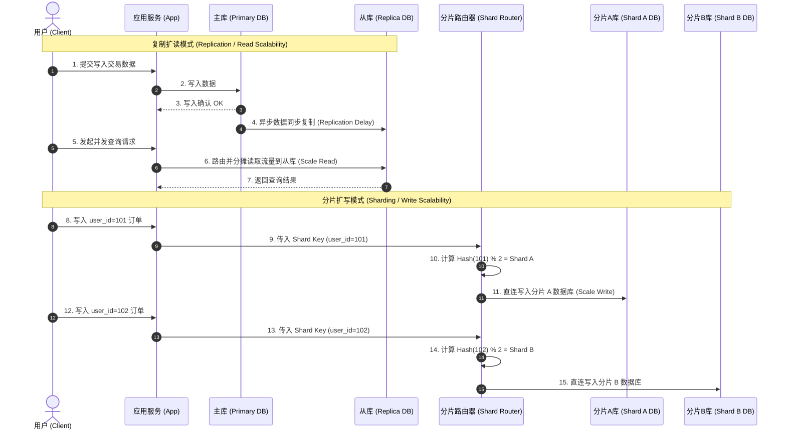
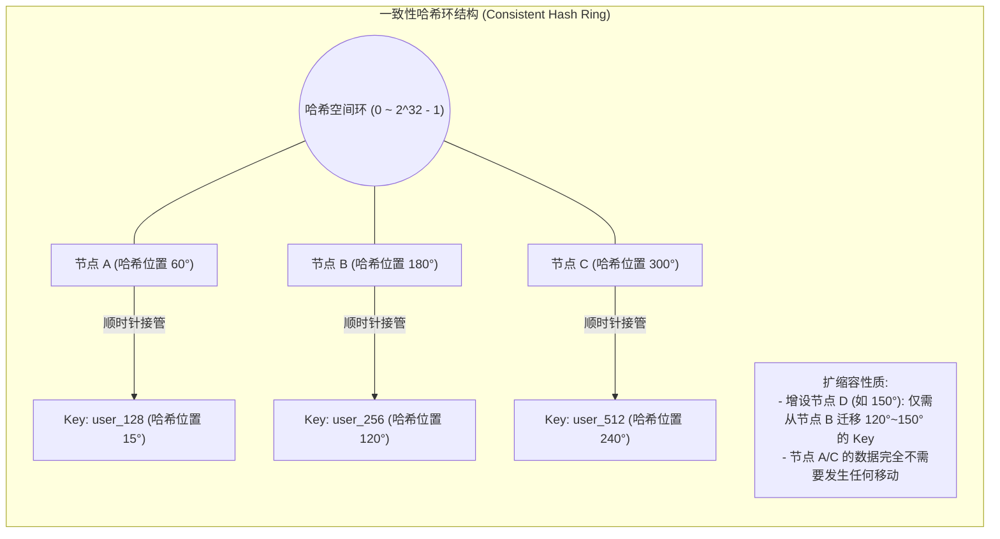

import GlossaryTerm from '@site/src/components/GlossaryTerm';
import GuidedExercise from '@site/src/components/GuidedExercise';
import ResearchNote from '@site/src/components/ResearchNote';
import ChapterMeta from '@site/src/components/ChapterMeta';
import PyRunner from '@site/src/components/PyRunner';
import TradeoffExplorer from '@site/src/components/TradeoffExplorer';
import SystemSimulator from '@site/src/components/SystemSimulator';
import QuizCard from '@site/src/components/QuizCard';

# M2L7 · 扩展策略

<ChapterMeta
  time="约 2 小时"
  prereqs={[{label: 'L5 无状态', href: '../foundations/state-and-storage'}, {label: 'L7 数据建模与分片', href: '../foundations/data-modeling'}, {label: 'M2L3 容量估算', href: './capacity-estimation'}]}
  outcome="能根据估算结果选对扩展手段（垂直/水平/复制/分片），并解释为什么分片要用一致性哈希。"
  howToUse="先跑“普通分片为什么一加节点就崩”的演示，理解一致性哈希的动机，再做 lab。"
/>

:::tip 把 Month 1 的零碎招式，连成一套扩展打法
你在 Month 1 学过无状态（L5）、分片（L7）、缓存（L10）。这一课把它们组织成一个统一问题的答案：**当流量涨 10 倍、100 倍，我按什么顺序、用什么手段扩？**
:::

## 一、流量涨 10 倍，第一步做什么？

容量估算（[M2L3](./capacity-estimation)）告诉你未来要扛多少。但"怎么扛"有顺序和取舍：换更强的机器？加更多机器？把数据切开？每一步都有代价。乱扩一通，会把简单系统变成一团乱麻。

## 二、三个核心概念（分层）

### 基础：垂直 vs 水平扩展

- <GlossaryTerm term="Vertical Scaling" definition="垂直扩展（scale up）：换更强的单机（更多 CPU/内存）。简单、无需改架构，但有物理上限、且单点风险。">垂直扩展</GlossaryTerm>：换更强的机器。简单，但有上限、有单点风险。
- <GlossaryTerm term="Horizontal Scaling" definition="水平扩展（scale out）：加更多机器分担负载。理论上可无限扩，但要求服务无状态、需要负载均衡和数据切分。">水平扩展</GlossaryTerm>：加更多机器。可无限扩，但**前提是无状态**（回扣 [L5](../foundations/state-and-storage)）。



**先垂直、后水平**通常是对的：垂直简单，先榨干单机；真不够了再水平（[WhatsApp 就是这个顺序](../atlas/whatsapp.mdx)）。

### 进阶：复制扩读，分片扩写

应用层无状态了能随便加；难的是**状态层（数据库）怎么扩**：

- <GlossaryTerm term="Replication" definition="复制：把数据复制到多个副本。主库写、从库读，扩展读吞吐并提供容错。代价是复制延迟与一致性问题。">复制</GlossaryTerm>：一主多从，主写从读。**扩读**（读多写少时首选），但有复制延迟。
- <GlossaryTerm term="Sharding" definition="分片：按某个 key 把数据水平切分到多个库，每个库只存一部分。扩展写吞吐和存储容量。代价是跨分片查询难、分片键难改。">分片</GlossaryTerm>：按 key 把数据切到多库。**扩写和容量**，但跨分片查询变难。

读多写少 → 先复制 + 缓存；写或存储超单库 → 才分片（回扣 [M2L3 的判断](./capacity-estimation)）。



### 深入（选学）：为什么分片要用一致性哈希

最朴素的分片是"key % N"。但它有个致命问题：**一旦增减节点（N 变了），几乎所有 key 都要重新落位、海量数据搬迁**。<GlossaryTerm term="Consistent Hashing" definition="一致性哈希：把节点和 key 映射到一个环上，key 归属顺时针最近的节点。增减节点时，只有相邻的一小部分 key 需要迁移，而不是全部。">一致性哈希</GlossaryTerm> 解决了这点：增减节点时只有一小部分 key 需要迁移。这是几乎所有分布式存储（缓存、NoSQL）的基础。

玩一下这个一致性哈希模拟器，输入不同的 Key（如 user_101、order_502），观察它们是如何映射到哈希环上，并顺时针寻找最近的物理节点的：

<SystemSimulator type="consistent-hash" />



<ResearchNote
  title="去中心化扩展的范本：Dynamo"
  source="Amazon (2007), Dynamo: Amazon's Highly Available Key-value Store"
  href="https://www.allthingsdistributed.com/files/amazon-dynamo-sosp2007.pdf"
  insight="Dynamo 用一致性哈希做数据分布、用复制 + 最终一致（AP 取向，回扣 M2L6）做高可用，支撑了亚马逊购物车等永远在线的服务。它把一致性哈希、向量时钟、读写仲裁等技术组合成一个可水平扩展的存储。"
  application="Dynamo 启发了 Cassandra、Riak、DynamoDB 等一大批系统。它示范了“水平扩展 + 一致性哈希 + 最终一致”这套组合拳——当你的写和存储都超出单库时，这就是参考蓝图。"
/>

## 三、跟我做一遍：朴素分片为什么一加节点就崩

<PyRunner
  expect="几乎全部都要搬"
  code={`# 朴素分片：key % N
def shard(key, n):
    return key % n

keys = list(range(1000))

# 从 4 个分片扩到 5 个，有多少 key 落到了不同的分片？
remapped = sum(1 for k in keys if shard(k, 4) != shard(k, 5))
print(f"4→5 个分片：{remapped}/1000 个 key 需要迁移")
print(f"迁移比例：{remapped/10:.0f}%")
print("几乎全部都要搬" if remapped > 700 else "还好")`}
/>

加**一个**节点，却要搬动 ~80% 的数据——这在生产里是灾难（搬迁期间系统压力暴增）。**这就是为什么需要一致性哈希**：它能把迁移量降到只有 ~1/N。**试试**：把 4→5 改成 100→101，看朴素分片依然要搬几乎所有 key。

## 四、动手 Lab（必做）

打开 `labs/month02/m2l7_sharding/`：

```bash
python labs/month02/m2l7_sharding/test_shard.py
```

实现朴素分片，并量化"加节点要搬多少数据"——亲手证明朴素分片的问题。

<GuidedExercise
  title="练习指引：分片与重新分布"
  goal="理解水平扩展数据层的核心难点：分片，以及为什么朴素取模分片在扩容时代价巨大。"
  hints={[
    'shard(key, n) = key % n，最朴素的分片。',
    '"要迁移的 key" = 在 n_before 和 n_after 下落到不同分片的 key。',
    '你会发现加一个节点，绝大多数 key 都得搬——这正是一致性哈希要解决的。',
    '思考：一致性哈希为什么只需迁移约 1/N 的 key？'
  ]}
  steps={[
    '实现 shard_modulo(key, n)：返回 key % n。',
    '实现 keys_remapped(keys, n_before, n_after)：统计落到不同分片的 key 数。',
    '写测试：基本分片正确；4→5 扩容时迁移比例 > 50%。',
    '跑到全过，并在注释里写下"为什么这是问题"。'
  ]}
  checks={[
    '你能说出垂直和水平扩展的区别与顺序。',
    '你能说出复制扩读、分片扩写。',
    '你能解释朴素取模分片扩容时为什么要搬几乎所有数据。',
    '你能说出一致性哈希解决了什么。'
  ]}
/>

## 架构师深潜（Staff+ 视角）

### 1. 扩展有顺序：别一上来就分片

分片是把双刃剑：它扩了写和容量，但带来跨分片查询、分布式事务、分片键难改（一旦选错，迁移噩梦，回扣 [L7](../foundations/data-modeling)）等一堆复杂度。**正确顺序通常是：垂直 → 缓存 → 读复制 → 最后才分片。** 能不分片就不分片。

### 2. 扩展手段怎么选

<TradeoffExplorer
  title="按瓶颈选扩展手段"
  dimensions={['扩展上限', '实现复杂度', '一致性影响', '成本', '改造代价']}
  options={[
    {
      name: '垂直扩展（换强机器）',
      scores: [1, 5, 5, 2, 5],
      note: '最简单，代码不动。但有物理上限、单点风险、强机器很贵。',
      whenToUse: '早期、或快速顶住增长争取时间。先榨干单机。'
    },
    {
      name: '缓存 + 读复制（扩读）',
      scores: [3, 4, 4, 3, 4],
      note: '读多写少时性价比最高。缓存挡热点、从库分摊读。有复制延迟。',
      whenToUse: '读远多于写（多数系统）。扩展的第二步。'
    },
    {
      name: '分片（扩写/容量）',
      scores: [5, 1, 2, 4, 1],
      note: '唯一能扩写和存储的办法，上限最高。但复杂度、跨分片查询、分片键选择都是大坑。',
      whenToUse: '写 QPS 或数据量确实超出单库时——最后才上。'
    }
  ]}
/>

### 3. 真实案例：两种扩展哲学

[WhatsApp](../atlas/whatsapp.mdx) 走"垂直榨到极限 + 适度水平"（对角扩展）；[ChatGPT](../atlas/chatgpt.mdx) 走"GPU 集群水平扩展 + 模型并行"。**没有唯一正确的扩展方式，取决于瓶颈是什么**（连接数 vs 算力）——这正是 [M2L3 估算](./capacity-estimation) 要先做的原因。

### 4. 架构师深问（给自己 30 分钟）

- "设计一个微信"：消息存储写量巨大，你会怎么分片？分片键选 user_id 还是 conversation_id？各牺牲什么？
- 读复制有复制延迟，用户发消息后立刻刷新可能读到从库的旧数据——怎么用"读己之写"（M2L6）救？
- 你的系统现在垂直扩展到顶了，下一步是缓存、读复制还是分片？依据估算的什么数字决定？

## 自检清单

- [ ] 我能说出垂直/水平扩展的区别和推荐顺序。
- [ ] 我能用复制扩读、用分片扩写。
- [ ] 我的 lab 证明了朴素分片扩容要搬几乎所有数据。
- [ ] 我能解释一致性哈希解决了什么问题。

## 常见误解

- **"扩展就是加机器"**: 很多初学者误以为只要加机器就能解决一切性能瓶颈。如果你的应用服务器内部在本地内存中存放了用户的 Session 状态，强行水平扩展加机器会导致请求在不同服务器间跳转时发生状态丢失（Session 失效）。水平扩展的前提是应用必须做到“无状态（Stateless）”。
- **"一上来就分片最彻底"**: 数据库水平分片（Sharding）是数据层架构设计的“终极核武器”，但它伴随极其恐怖的副作用：无法进行跨分片的 Join 查询、分布式事务带来严重的延迟开销、分片键一旦选错后续二次迁移极其痛苦。应当严格遵循“垂直升级 -> 缓存阻挡 -> 读写分离复制 -> 最终才分片”的防御性扩展路径。
- **"key % N 分片简单又好用"**: 朴素取模哈希分片最容易实现，但也最脆弱。一旦集群需要扩缩容（N 变 N+1 或 N-1），几乎所有的 key 重新计算取模都会落到不同的节点上，产生高达 80%~90% 以上的海量数据搬迁。这在生产环境中会瞬间打爆网卡、磁盘 I/O 并让缓存大规模穿透，是绝对的生产灾难。

## 五、章末自测

<QuizCard
  questions={[
    {
      q: '在状态层（数据库）的水平扩展中，‘一主多从复制（Replication）’与‘水平分片（Sharding）’各自最适合解决什么痛点？',
      options: [
        '一主多从复制最适合解决高并发读（读多写少）的系统瓶颈；而水平分片则是为了扩充数据库的整体写吞吐上限与物理存储容量瓶颈。',
        '一主多从复制是为了扩充写吞吐；水平分片则是为了处理轻量级读。',
        '两者完全相同，可以在任何场景下互换使用。'
      ],
      answer: 0,
      explain: '主从复制中，所有写操作依然必须经过主库，因此主从复制无法提升写 QPS；从库分摊了读压力，因此最适合扩读。而分片将数据水平拆分存放在多台独立数据库实例上，各自承担一部分写，从而真正实现了写 QPS 与存储空间的水平扩展。'
    },
    {
      q: '当分布式缓存或 NoSQL 数据库集群需要进行节点扩缩容时，为什么应当优先引入‘一致性哈希（Consistent Hashing）’算法？',
      options: [
        '因为一致性哈希可以加快 CPU 执行 % 取模运算的物理速度。',
        '因为在增减节点时，一致性哈希通过哈希环映射机制，只需要迁移大约 1/N（N 为节点总数）的局部 Key，避免了传统 key % N 取模导致的全量数据重落位与缓存雪崩。',
        '因为一致性哈希可以强制实现分布式事务强一致性。'
      ],
      answer: 1,
      explain: '朴素取模分片在 N 变动时会导致近乎 100% 的 Key 映射位置发生偏移；一致性哈希把节点与 Key 同时映射到环形空间，使得节点增加或减少时，仅影响环上相邻节点之间的那一部分 Key，极大地降低了扩容搬迁的数据量与网络开销。'
    },
    {
      q: '架构师在考虑将单体系统演进到水平扩展架构之前，首要完成的软件架构改造是什么？',
      options: [
        '必须将业务应用服务层改造为“无状态（Stateless）”，将 Session、缓存等状态外置到 Redis 或数据库中，确保任意一台新拉起的实例都能等价处理任何用户的请求。',
        '必须先购买市面上最昂贵的数据库服务器硬件。',
        '必须先引入分布式消息队列（MQ）进行所有接口调用的异步化。'
      ],
      answer: 0,
      explain: '水平扩展的核心是多台等价的应用实例在负载均衡器后并行运行。如果应用实例中包含不可共享的状态（如本地 Session），请求被分发到不同实例时就会出错。因此，“无状态化”是应用层能够进行水平扩展的绝对前置基石。'
    }
  ]}
/>

## 延伸阅读

- [Amazon Dynamo 论文](https://www.allthingsdistributed.com/files/amazon-dynamo-sosp2007.pdf)
- [Consistent Hashing（Karger et al. 1997）](https://en.wikipedia.org/wiki/Consistent_hashing)
- [下一课：数据存储选型](./storage-selection)