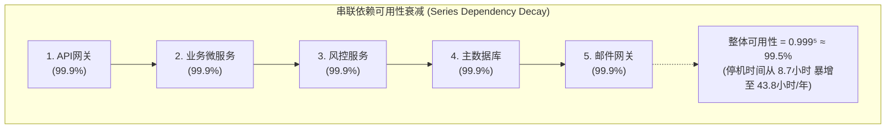
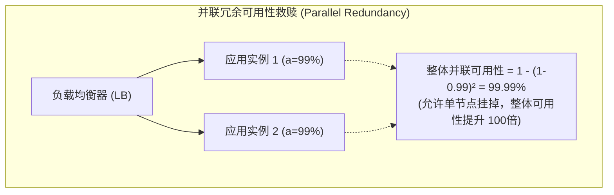
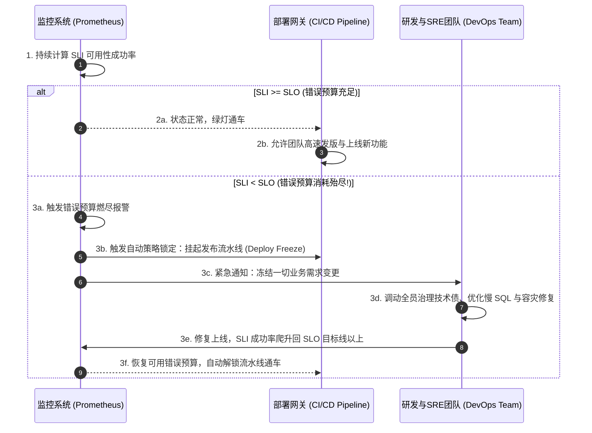

import GlossaryTerm from '@site/src/components/GlossaryTerm';
import GuidedExercise from '@site/src/components/GuidedExercise';
import ResearchNote from '@site/src/components/ResearchNote';
import ChapterMeta from '@site/src/components/ChapterMeta';
import PyRunner from '@site/src/components/PyRunner';
import TradeoffExplorer from '@site/src/components/TradeoffExplorer';
import QuizCard from '@site/src/components/QuizCard';

# M2L4 · SLA / SLO 与可用性

<ChapterMeta
  time="约 1.5–2 小时"
  prereqs={[{label: 'M2L3 容量估算', href: './capacity-estimation'}, {label: 'L12 SLO 初识', href: '../foundations/observability'}]}
  outcome="能把“几个 9”换算成停机时间、算出串联依赖的整体可用性、用冗余提升它，并理解错误预算。"
  howToUse="先跑“几个 9 = 多久停机”和“串联依赖暴跌”的演示，再做 lab 把可用性算清楚。"
/>

:::tip 可用性是会"相乘"的
你的服务承诺 99.9%，但它依赖 5 个各自 99.9% 的下游——整体还有多少？答案会吓你一跳。这一课教你把"可用性"从口号变成能算的数字，并知道怎么用冗余把它救回来。
:::

## 一、"99.9% 可用"到底是多好？

你对老板说"系统 99.9% 可用"。听起来很高。但 99.9% = 每年停机 **约 8.7 小时**；99.99% = 约 52 分钟；99.999%（五个 9）= 约 5 分钟。每多一个 9，难度和成本都指数上升。更糟的是：当你的系统串起多个依赖，**整体可用性会比任何单个都低**。这一课教你算清这些。

## 二、三个核心概念（分层）

### 基础：SLI、SLO、SLA

三个常混淆的词（回扣 [L12](../foundations/observability)）：

- <GlossaryTerm term="SLI" definition="服务等级指标：实际测量到的某个数值，如成功率（成功请求/总请求）、p99 延迟。是客观事实。">SLI（指标）</GlossaryTerm>：实测的数值（成功率、p99）。
- <GlossaryTerm term="SLO" definition="服务等级目标：你给某个 SLI 定的目标，如成功率 ≥ 99.9%。是内部目标。">SLO（目标）</GlossaryTerm>：你定的目标（成功率 ≥ 99.9%）。
- <GlossaryTerm term="SLA" definition="服务等级协议：对外（客户/合同）承诺的等级，违反通常有赔偿。SLA 通常比内部 SLO 宽松，留缓冲。">SLA（协议）</GlossaryTerm>：对外承诺（违反要赔钱），通常比内部 SLO 宽松。

"几个 9"说的就是<GlossaryTerm term="Availability" definition="可用性：系统正常提供服务的时间比例。99.9%（三个9）≈ 每年停机 8.7 小时；每多一个 9，允许停机时间缩小约 10 倍。">可用性（availability）</GlossaryTerm>。

### 进阶：可用性会相乘（串联）也会变好（冗余）

- **串联依赖**：请求要依次经过 A、B、C，**任何一个挂就整体挂**，整体可用性 = 各自相乘。5 个 99.9% 串联 = 0.999⁵ ≈ **99.5%**（停机暴增到每年 ~44 小时！）。



- **冗余（并联）**：同一组件放 N 个副本，**全挂才挂**，可用性 = 1 −(1 − a)ⁿ。两个 99% 并联 = 1 − 0.01² = **99.99%**。



**这就是架构的核心张力**：依赖越多，可用性越被拉低；要救回来，就得在关键处加冗余（回扣 [L4 舱壁/降级](../foundations/error-handling)）。

### 深入（选学）：错误预算——把可靠性变成可花的预算

100% 可用既不可能也不划算。<GlossaryTerm term="Error Budget" definition="错误预算 = 1 − SLO。如 SLO 99.9%，则每月有 0.1% 的时间/请求可以失败。用它平衡上线速度和稳定性：预算够就大胆发，烧完就先稳。">错误预算</GlossaryTerm> 把"允许的不可靠"量化成一笔可花的预算：预算还有，就大胆上线新功能；烧完了，就停下来先做稳定性。它让"快"和"稳"的拉扯有了客观依据。



<ResearchNote
  title="用 SLO 和错误预算管理可靠性"
  source="Google <GlossaryTerm term='SRE' definition='站点可靠性工程 (Site Reliability Engineering)：将软件工程方法应用于运维领域，用开发思维解决基础设施与稳定性问题的实践。'>SRE</GlossaryTerm> Book: Embracing Risk / Service Level Objectives"
  href="https://sre.google/sre-book/embracing-risk/"
  insight="Google SRE 主张：可靠性不是越高越好，而要定一个恰当的 SLO，并用“错误预算”（1−SLO）来平衡创新速度与稳定性。追求不必要的额外 9 会极大抬高成本、拖慢迭代。"
  application="架构师要帮团队选一个“恰好够好”的可靠性目标，而不是盲目堆 9。这个目标会反过来决定你要不要多活、要多少冗余、能承受多大复杂度——它是成本与体验的总平衡点。"
/>

## 三、跟我做一遍：算可用性

<PyRunner
  expect="冗余救回来了"
  code={`MIN_PER_YEAR = 525600

def downtime_min(av):
    return (1 - av) * MIN_PER_YEAR

# 几个 9 = 多久停机
for av in [0.99, 0.999, 0.9999]:
    print(f"{av*100:.2f}% → 每年停机 {downtime_min(av):.0f} 分钟")

# 串联：5 个 99.9% 的依赖串起来
series = 0.999 ** 5
print(f"5 个 99.9% 串联 → {series*100:.2f}%（停机 {downtime_min(series):.0f} 分钟/年）")

# 冗余：把一个 99% 组件放 2 个副本
redundant = 1 - (1 - 0.99) ** 2
print(f"2 个 99% 并联 → {redundant*100:.2f}%")
print("冗余救回来了" if redundant > 0.99 else "?")`}
/>

注意串联那行：**5 个看起来很高的 99.9%，串起来掉到 99.5%**，停机时间翻了 5 倍。**试试**：把副本数从 2 改成 3，看冗余把可用性推到几个 9。

## 四、动手 Lab（必做）

打开 `labs/month02/m2l4_availability/`：

```bash
python labs/month02/m2l4_availability/test_availability.py
```

实现可用性换算、串联、冗余、错误预算的计算。

<GuidedExercise
  title="练习指引：把可用性算清楚"
  goal="把“几个 9、串联相乘、冗余并联、错误预算”变成能算的数字——这是定 SLO 和做容错设计的基础。"
  hints={[
    '一年 525600 分钟，停机时间 = (1 - 可用性) × 525600。',
    '串联：所有依赖可用性相乘（越串越低）。',
    '冗余：1 - (1-a)^n（越多副本越高）。',
    '错误预算 = (1 - SLO) × 周期内总量。'
  ]}
  steps={[
    '实现 downtime_minutes_per_year(av)：(1-av) × 525600。',
    '实现 series_availability(components)：所有元素连乘。',
    '实现 redundant_availability(a, n)：1 - (1-a)**n。',
    '实现 error_budget(slo, total)：(1-slo) × total。',
    '写测试验证，跑到全过。'
  ]}
  checks={[
    '你能把"几个 9"换算成停机时间。',
    '你能解释为什么串联依赖会拉低整体可用性。',
    '你能用冗余把可用性算着提上去。',
    '你能解释错误预算怎么平衡快与稳。'
  ]}
/>

## 架构师深潜（Staff+ 视角）

### 1. 每多一个 9，成本指数上升

从 99% 到 99.9% 也许加个从库就够；从 99.99% 到 99.999% 可能要异地多活、自动故障转移、全链路冗余——成本和复杂度暴涨。**架构师的判断力在于：这个业务到底需要几个 9？** 给内部工具定五个 9 是巨大浪费。

### 2. 提升可用性的手段

<TradeoffExplorer
  title="怎么把可用性提上去"
  dimensions={['可用性提升', '成本', '复杂度', '数据一致性', '故障恢复速度']}
  options={[
    {
      name: '单点（无冗余）',
      scores: [1, 5, 5, 5, 1],
      note: '一个实例，一挂全挂。便宜简单，但可用性受限于单机。',
      whenToUse: '原型、内部低要求工具。'
    },
    {
      name: '主从 + 自动故障转移',
      scores: [3, 4, 3, 4, 3],
      note: '一主多从，主挂了切到从。常见、性价比高，但切换有短暂中断、可能丢一点数据。',
      whenToUse: '多数线上服务的标准可用性方案。'
    },
    {
      name: '多副本 / 无单点',
      scores: [4, 3, 2, 3, 4],
      note: '关键组件全冗余，任一副本挂不影响整体（1-(1-a)^n）。可用性显著提升。',
      whenToUse: '核心链路、不能停的服务。'
    },
    {
      name: '异地多活（multi-region）',
      scores: [5, 1, 1, 2, 5],
      note: '多个区域都能独立服务，整个机房挂了也不停。最高可用，但成本与一致性挑战巨大。',
      whenToUse: '全球级、停机代价极高的系统（支付、社交巨头）。'
    }
  ]}
/>

### 3. 真实案例：双机房与降级

[WhatsApp 的双数据中心](../atlas/whatsapp.mdx) 就是为可用性做的冗余；几乎所有大系统都会在依赖挂掉时**优雅降级**（回扣 [L4](../foundations/error-handling)）——返回缓存旧值或精简结果，也比整体不可用强。**可用性不只是"别挂"，还包括"挂一部分时还能提供降级服务"。**

### 4. 架构师深问（给自己 30 分钟）

- 你的报名服务依赖：网关、数据库、缓存、邮件、风控。各自 99.9%，串联整体是多少？哪几个该上冗余？
- 业务要求"全年停机不超过 1 小时"，那是几个 9？你愿意为它付多少复杂度？
- 错误预算这个月快烧完了，团队还想上新功能——你作为架构师怎么决策？

## 自检清单

- [ ] 我能把"几个 9"换算成每年停机时间。
- [ ] 我能算串联依赖的整体可用性，并解释为什么会下降。
- [ ] 我能用冗余把可用性算着提上去。
- [ ] 我能解释错误预算如何平衡创新与稳定。

## 常见误解

- **"可用性越高越好"**: 每个 9 成本指数上升，要按业务需要定。如果一年的停机时间在商业上无关痛痒，追求“五个 9”不仅白花预算，还会给架构注入致命的复杂性。
- **"每个依赖都很可靠，整体就可靠"**: 串联会相乘，哪怕有 5 个各自 99.9% 可用的微服务，连在一起直接下降到 99.5%。必须在接缝处采用超时、熔断和备用异步降级路由。
- **"高可用就是别让它挂"**: 高可用本质是一个区间。当依赖服务或某机房挂掉一部分时，系统依然可以通过降级服务（如只读不写、展示过期缓存）优雅运转。
- **"高可用只需关注 MTBF 而忽视 MTTR"**: 可用性由平均无故障时间（MTBF）和平均恢复时间（<GlossaryTerm term="MTTR" definition="平均修复/恢复时间 (Mean Time to Repair/Restore)：系统从发生故障中断到完全恢复正常运行所需的平均时间。MTTR 越短，可用性越高。">MTTR</GlossaryTerm>）共同决定。通过自动分流切换或自动热重启来将 MTTR 压缩到秒级，往往比强行优化代码以求 MTBF 不挂要划算得多。

## 五、章末自测

<QuizCard
  questions={[
    {
      q: '如果你的服务自身承诺了 99.9% 的可用性，但其强依赖了 5 个同样承诺 99.9% 可用性的外部第三方接口（且这 5 个外部接口一旦有任何一个不可用，你的系统就会直接报错），在不考虑降级和容灾的串联链路下，你系统理论上的最大可用性大约是多少？',
      options: [
        '99.9%，因为所有依赖的可用性目标都同样是 99.9%。',
        '大约 99.5%，这意味着每年停机时间会爆增到近 44 小时（翻了 5 倍），这是多级强依赖串联相乘（0.999⁵）的数学惩罚。',
        '由于概率抵消，整体可用性反而提升到了 99.99%。'
      ],
      answer: 1,
      explain: '在没有降级隔离（如舱壁、熔断、降级）的强依赖串联系统中，可用性是连乘的。每一个串入的依赖都会成为单点故障源，极具杀伤力。因此，限制强依赖深度、对下游慢调用做异步化或弱降级是架构保命的必由之路。'
    },
    {
      q: 'SRE 体系中引入的‘错误预算（Error Budget）’其核心意义不仅是一组数字，更是一套平衡研发效率与稳定性的机制。关于这套机制的运作，以下哪项描述是准确的？',
      options: [
        '错误预算必须为零，任何时候都不能允许系统发生错误或重启。',
        '错误预算 = 1 − SLO。如果预算充足，团队可以加速发版和业务创新；一旦在周期内预算烧完，必须自动或人工暂停新功能发布（部署冻结），全力转向技术债治理和稳定性修补，直至预算恢复。',
        '错误预算仅仅用于年底打绩效时扣减开发人员的年终奖，与日常发版节奏无关。'
      ],
      answer: 1,
      explain: '错误预算（Error Budget）让‘快’（开发）与‘稳’（运维/SRE）的冲突有了客观、量化的共同标准。它是系统允许的不可靠额度，用来为发布风险和偶尔的系统故障买单。'
    },
    {
      q: '如果通过将原本 99% 可用性的单点服务部署为 2 个互为主备的副本（使用并联冗余），且假设故障检测与自动故障转移（Failover）是完美无缝的。请问该并联冗余系统的理论可用性是多少？',
      options: [
        '1 − (1 − 0.99)² = 99.99%，即可用性通过冗余从两个 9 显著提升到了四个 9。',
        '98.01%，因为两个 99% 的并联可用性相乘会降低整体可用性。',
        '仍然是 99%，冗余不会带来任何理论可用性的变化。'
      ],
      answer: 0,
      explain: '并联系统（冗余副本）只有在所有节点同时挂掉时才会导致系统不可用。计算公式为 1 − (1 − a)ⁿ。虽然并联提升了可用性，但在真实生产中，由于故障检测响应延迟、脑裂（Split-Brain）以及状态数据同步的一致性开销，实际可用性会略低于理论公式值。'
    }
  ]}
/>

## 延伸阅读

- [Google SRE Book: Embracing Risk](https://sre.google/sre-book/embracing-risk/)
- [Availability 速查表（几个 9 对应停机时间）](https://en.wikipedia.org/wiki/High_availability#Percentage_calculation)
- [Month 2 总览](./overview)
