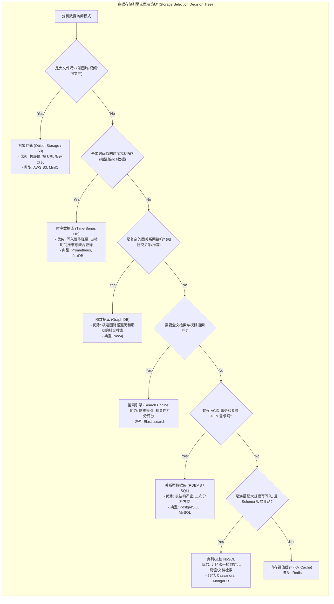
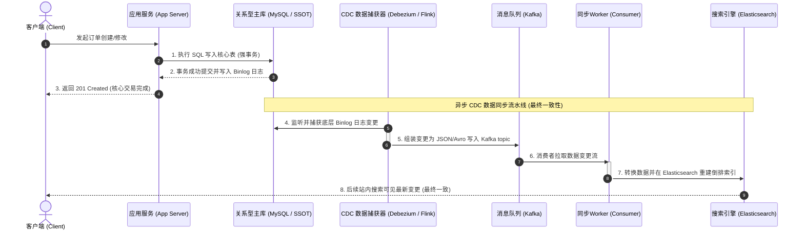

import GlossaryTerm from '@site/src/components/GlossaryTerm';
import GuidedExercise from '@site/src/components/GuidedExercise';
import ResearchNote from '@site/src/components/ResearchNote';
import ChapterMeta from '@site/src/components/ChapterMeta';
import PyRunner from '@site/src/components/PyRunner';
import TradeoffExplorer from '@site/src/components/TradeoffExplorer';
import QuizCard from '@site/src/components/QuizCard';

# M2L8 · 数据存储选型

<ChapterMeta
  time="约 1.5–2 小时"
  prereqs={[{label: 'L7 数据建模', href: '../foundations/data-modeling'}, {label: 'M2L6 CAP', href: './cap-consistency'}, {label: 'M2L7 扩展', href: './scaling-strategies'}]}
  outcome="能根据访问模式，为不同数据选对存储类型（关系/文档/KV/搜索/对象/图/时序），并理解 polyglot persistence。"
  howToUse="先看各存储擅长什么，再做 lab 写一个“按需求推荐存储”的小决策器。"
/>

:::tip 没有"最好的数据库"，只有"最合适的"
新手默认"就用 MySQL"或"就用 MongoDB"。但搜索、缓存、图片、社交关系、监控指标，各有专门为它们而生的存储。选型的本质是：**先看你怎么访问数据，再选擅长那种访问的存储。**
:::

## 一、全塞 MySQL，会怎样？

你把全文搜索用 `LIKE '%keyword%'` 做（慢到爆）、把几 MB 的图片存进数据库（撑爆它）、用一堆 JOIN 查"朋友的朋友"（越查越慢）。不是 MySQL 不好，是**你让它做了它不擅长的事**。每类访问模式，都有更合适的存储。

## 二、三个核心概念（分层）

### 基础：主要存储类型及其擅长

| 类型 | 擅长 | 典型 |
|---|---|---|
| <GlossaryTerm term="Relational (SQL)" definition="关系型数据库：表 + 行 + 强 schema + 事务 + JOIN。擅长复杂查询和强一致。">关系型</GlossaryTerm> | 复杂查询、事务、强一致 | PostgreSQL, MySQL |
| <GlossaryTerm term="Document DB" definition="文档数据库：以 JSON 文档为单位存取，schema 灵活。擅长整块读写、快速迭代。">文档型</GlossaryTerm> | 灵活 schema、整块读写 | MongoDB |
| <GlossaryTerm term="Key-Value" definition="键值存储：按 key 极快读写，常用作缓存或会话。结构简单、延迟极低。">键值</GlossaryTerm> | 极快按 key 读写、缓存 | Redis |
| <GlossaryTerm term="Wide-Column" definition="宽列存储：为海量写入和水平扩展设计的 NoSQL（如 Cassandra）。擅长超大写吞吐、按分区键查询。">宽列</GlossaryTerm> | 海量写、水平扩展 | Cassandra (典型 <GlossaryTerm term="NoSQL" definition="非关系型数据库 (Not Only SQL)：一类不同于传统关系型数据库（RDBMS）的通用数据存储系统，它们通常放宽了 ACID 事务要求以换取水平扩展性、高并发吞吐和灵活的多变 Schema。">NoSQL</GlossaryTerm>) |
| <GlossaryTerm term="Search Engine" definition="搜索引擎：为全文检索、相关性排序、聚合分析而生（倒排索引）。">搜索引擎</GlossaryTerm> | 全文搜索、相关性 | Elasticsearch |
| <GlossaryTerm term="Object Storage" definition="对象存储：存大文件（图片/视频/备份）的廉价、海量、高可用存储，按 URL 取。">对象存储</GlossaryTerm> | 大文件（图片/视频） | S3 |
| <GlossaryTerm term="Graph DB" definition="图数据库：为关系遍历（朋友的朋友、推荐路径）优化的存储。">图</GlossaryTerm> | 关系遍历 | Neo4j |
| <GlossaryTerm term="Time-Series DB" definition="时序数据库：为带时间戳的指标/事件（监控、IoT）优化，擅长按时间范围聚合。">时序</GlossaryTerm> | 监控指标、IoT | Prometheus, InfluxDB |

### 进阶：按访问模式选，而不是按习惯选

回扣 [L7：先看查询模式，再定存储](../foundations/data-modeling)。问几个问题：要不要复杂事务？要不要全文搜索？是大文件吗？是关系遍历吗？是海量时间序列吗？**每个"是"都指向一个更合适的存储。**



### 深入（选学）：Polyglot Persistence——一个系统用多种存储

现代大系统几乎不会只用一种存储，而是<GlossaryTerm term="Polyglot Persistence" definition="多语言持久化：在同一个系统里，针对不同数据的不同访问模式，分别选用最合适的存储（如关系库 + 缓存 + 搜索 + 对象存储并用）。">polyglot persistence</GlossaryTerm>：用户资料放关系库、会话放 Redis、搜索放 Elasticsearch、图片放 S3、监控放时序库。**代价是运维多套系统、数据要在它们之间同步**——可以通过 <GlossaryTerm term="CDC" definition="变更数据捕获 (Change Data Capture)：一种监测并捕获数据库底层事务变更日志（如 MySQL binlog、PostgreSQL WAL），并将其近实时同步分发至其他目标存储系统（如 Elasticsearch、Redis）的集成技术。">CDC（变更数据捕获）</GlossaryTerm> 解决双写一致性，这本身又是个架构难题（回扣 [M2L6 一致性](./cap-consistency)）。

```mermaid
flowchart TD
  subgraph PolyglotHub["多语言持久化数据中枢 (Polyglot Persistence Data Hub)"]
    direction TB
    Client["客户端/前端 (Client)"] --> LB["负载均衡 (LB)"]
    LB --> App["业务网关/无状态应用服务 (App Servers)"]
    
    App -->|1. 会话/热点数据 (按 Key 读写)| Redis["("内存缓存 (Redis)<br/>- 优势: 亚毫秒延迟")"]
    App -->|2. 交易订单/核心账务 (强事务/ACID)| PG["("关系型数据库 (PostgreSQL)<br/>- 优势: 强一致性, 复杂关联")"]
    App -->|3. 多变商品分类/元数据 (灵活 Schema)| Mongo["("文档数据库 (MongoDB)<br/>- 优势: JSON 直存, 快速迭代")"]
    App -->|4. 图片/视频文件上传 (扁平海量大文件)| S3["("对象存储 (AWS S3)<br/>- 优势: 便宜, 高带宽分发")"]
    App -->|5. 站内全文检索 (倒排索引查询)| ES["("搜索引擎 (Elasticsearch)<br/>- 优势: 分词模糊匹配")"]
  end
```



<ResearchNote
  title="数据模型与存储引擎，决定系统擅长什么"
  source="Martin Kleppmann, DDIA 第 2–3 章；Martin Fowler, Polyglot Persistence"
  href="https://martinfowler.com/bliki/PolyglotPersistence.html"
  insight="DDIA 指出不同数据模型（关系/文档/图）适配不同的数据关系与查询；Fowler 的 Polyglot Persistence 主张大型系统应针对每类数据选最合适的存储，而非强求单一数据库通吃。"
  application="架构师选存储，是在选“这套系统天生擅长哪类访问”。先有访问模式，再选存储；并接受现实——一个复杂系统往往要并用多种存储，代价是数据同步与运维复杂度。"
/>

## 三、跟我做一遍：按需求推荐存储

<PyRunner
  expect="search_engine"
  code={`def recommend(req):
    if req.get("full_text_search"):
        return "search_engine"      # 全文搜索 → Elasticsearch
    if req.get("large_blob"):
        return "object_storage"     # 大文件 → S3
    if req.get("graph_traversal"):
        return "graph_db"           # 关系遍历 → Neo4j
    if req.get("strong_transactions"):
        return "relational"         # 强事务 → PostgreSQL
    if req.get("huge_write_scale"):
        return "wide_column"        # 海量写 → Cassandra
    return "relational"             # 默认稳妥

print("商品全文搜索:", recommend({"full_text_search": True}))
print("用户头像:", recommend({"large_blob": True}))
print("转账记录:", recommend({"strong_transactions": True}))`}
/>

每个需求，访问模式不同，存储就不同。**试试**：给一个"既要强事务又要全文搜索"的需求——你会发现可能需要**两种存储**（关系库存真相 + 搜索引擎建索引），这就是 polyglot persistence。

## 四、动手 Lab（必做）

打开 `labs/month02/m2l8_storage/`：

```bash
python labs/month02/m2l8_storage/test_store.py
```

实现一个"按需求推荐存储类型"的小决策器，把选型逻辑显式化。

<GuidedExercise
  title="练习指引：写一个存储选型决策器"
  goal="把“按访问模式选存储”变成清晰的规则，告别“默认就用 MySQL”。"
  hints={[
    '判断有先后：搜索、大文件、图遍历这些"特殊"需求先判断。',
    '强事务/复杂查询 → 关系型；海量写 + 水平扩展 → 宽列。',
    '都不特殊时，关系型是稳妥默认。',
    '想想：一个真实系统往往要返回"多种存储组合"（polyglot）。'
  ]}
  steps={[
    '实现 recommend(req)：req 是需求标志的 dict。',
    '按优先级判断：full_text_search→search_engine；large_blob→object_storage；graph_traversal→graph_db；time_series→time_series_db；strong_transactions→relational；huge_write_scale→wide_column。',
    '都没命中 → 返回 relational（默认）。',
    '写测试覆盖每种需求，跑到全过。'
  ]}
  checks={[
    '你能说出每种存储类型擅长什么访问模式。',
    '你的决策器对每种需求给出合理存储。',
    '你能解释 polyglot persistence 及其代价。',
    '你能根据 L7 的"先看查询"来驱动选型。'
  ]}
/>

## 架构师深潜（Staff+ 视角）

### 1. 选型是"访问模式 → 存储"，不是"流行 → 存储"

别因为"大家都用 X"而选 X。先写下**高频访问模式**（按 id 读？范围扫描？全文搜？关系遍历？），再匹配擅长它的存储。选错存储是极难逆转的决定（数据迁移代价巨大）。

### 2. 各存储的取舍

<TradeoffExplorer
  title="主流存储类型怎么选"
  dimensions={['复杂查询/事务', '写扩展性', '读延迟', 'schema 灵活', '运维成本']}
  options={[
    {
      name: '关系型 SQL',
      scores: [5, 2, 3, 2, 4],
      note: '事务、JOIN、强一致最强。但水平扩写难、schema 较硬。',
      whenToUse: '核心业务数据：订单、账务、用户——需要事务和复杂查询。'
    },
    {
      name: '文档 / 宽列 NoSQL',
      scores: [2, 5, 4, 5, 3],
      note: 'schema 灵活、写扩展强。但弱事务、复杂查询难、易最终一致。',
      whenToUse: '海量写、schema 多变、按 key/分区访问（feed、日志、画像）。'
    },
    {
      name: 'KV 缓存（Redis）',
      scores: [1, 4, 5, 3, 3],
      note: '延迟极低、按 key 极快。但容量有限、非持久化主存。',
      whenToUse: '缓存、会话、排行榜、计数器（配合主存）。'
    },
    {
      name: '搜索 / 对象 / 图 / 时序（专用）',
      scores: [3, 4, 4, 4, 2],
      note: '在各自领域碾压通用库，但每多一种就多一套运维和数据同步。',
      whenToUse: '有明确的全文搜索/大文件/关系遍历/时序需求时，专库专用。'
    }
  ]}
/>

### 3. 真实案例：大系统都是 polyglot

任何一个 [互联网应用案例](../atlas) 拆开看，都是多存储并用：关系库存核心数据、缓存挡读、搜索引擎做检索、对象存储 + CDN 放媒体、时序库做监控。**"用什么数据库"从来不是单选题。** 关键是想清楚每类数据的访问模式，以及它们之间怎么同步（回扣 [M2L6 一致性](./cap-consistency)）。

### 4. 架构师深问（给自己 30 分钟）

- "设计一个微信"：消息、用户关系、媒体文件、已读状态、全文搜索聊天记录——各用什么存储？为什么？
- 你用了关系库 + 搜索引擎两套，数据怎么保持同步？同步延迟会带来什么问题（回扣最终一致）？
- 团队只熟悉 MySQL，但需求明显该用搜索引擎——你怎么权衡"用对工具"和"团队能力/运维成本"？

## 自检清单

- [ ] 我能说出 7 类存储各擅长什么访问模式。
- [ ] 我能按需求为数据选对存储，而非默认 MySQL。
- [ ] 我的 lab 决策器对各类需求给出合理选择。
- [ ] 我理解 polyglot persistence 及其数据同步代价。

## 常见误解

- **"一个数据库通吃所有"**: 让传统关系型数据库（MySQL/PG）去做不擅长的全文倒排搜索或时序数据汇聚，会导致表级物理锁盘、I/O 被占满，拖死整个核心业务。大流量系统的状态层一定是由多种存储并存的。
- **"NoSQL 比 SQL 先进"**: SQL 保证了极高的强一致性与完美的事务逻辑；NoSQL 通常是在放宽 ACID 的前提下，通过牺牲事务来获取线性的水平扩展与超高写性能。两者是架构维度的取舍，并非替代升级关系。
- **"选型看流行度"**: 不写下实际的**高频访问模式**而盲目跟风引入复杂数据库，会在后期产生不可逆的架构迁移灾难（例如将本该用图数据库的社交路径在 MySQL 中写了五层自关联 SQL 查询）。
- **"数据同步采用应用层双写"**: 为了将数据同步至 ES 缓存，初学者会在业务代码里同步调用 `db.write()` 和 `es.write()`。这非常脆弱，一旦 ES 接口超时或网络闪断，就会导致两边数据永久不一致。最佳实践是利用 CDC 监听数据库底层变更日志进行非侵入式异步流式同步。

## 五、章末自测

<QuizCard
  questions={[
    {
      q: '在面向高并发大流量的设计中，如果盲目强求‘一个数据库（如单体 MySQL）解决系统内的所有场景（全文检索、图片存放、监控、社交遍历）’，最可能会产生什么系统性瓶颈？',
      options: [
        '导致系统的前端 CSS 加载变慢。',
        '导致数据库因为大文件占满 I/O、复杂 JOIN 撑爆 CPU、模糊 LIKE 查询引起全表扫描，从而拖挂整站的所有核心交易功能。',
        'MySQL 语法会在编译时直接报语法错误。'
      ],
      answer: 1,
      explain: '关系型数据库的设计目标是保证事务ACID和复杂关联查询，而不是承载大文件存取或做高并发倒排搜索。如果把不合适的数据和查询强塞给它，不仅单机性能极差，还会挤占核心事务处理资源，导致单点崩溃。'
    },
    {
      q: '引入多语言持久化（Polyglot Persistence）能充分发挥每种数据库擅长的数据模型，但同时会带来什么核心的架构代价？',
      options: [
        '系统会被迫降级到只能离线运行。',
        '运维成本极高（需要监控、备份、调优多套数据库），且由于多个存储系统之间的数据无法天然同步，必须引入类似 CDC/消息队列等数据同步机制，从而面临最终一致性与复杂的状态一致性难题。',
        '系统的网络带宽会无条件变为零。'
      ],
      answer: 1,
      explain: 'Polyglot Persistence 没有免费的午餐。架构的取舍（Tradeoff）在此非常明显：得到了极致的读写性能和模型表达，但付出了极高的数据同步复杂度与运维代价（如双写一致性、延迟同步、技术栈膨胀）。'
    },
    {
      q: 'Change Data Capture（CDC，变更数据捕获）配合 Kafka 消费者在多语言持久化架构中通常扮演什么角色？',
      options: [
        '它作为前端反向代理拦截所有的 HTTP 请求。',
        '它用于实时读取关系数据库的变更日志（如 MySQL binlog），并将数据同步投递到搜索引擎（如 Elasticsearch）或缓存（如 Redis），以此实现不同存储介质间近实时的状态同步，解决 Polyglot 架构下的数据割裂问题。',
        '它用于对数据库的物理磁盘直接进行碎片整理。'
      ],
      answer: 1,
      explain: '在多存储架构中，应用层直接‘双写’多个数据库非常脆弱。通常的最佳实践是：应用只写入作为真相源的 SQL，然后通过 CDC 监听数据库事务日志（Binlog/WAL），异步、非侵入式地通过消息队列将更新流式广播到其他辅助只读存储（ES/缓存），实现最终一致。'
    }
  ]}
/>

## 延伸阅读

- [Martin Fowler, Polyglot Persistence](https://martinfowler.com/bliki/PolyglotPersistence.html)
- [Martin Kleppmann, DDIA](https://dataintensive.net/)
- [Month 2 总览](./overview)