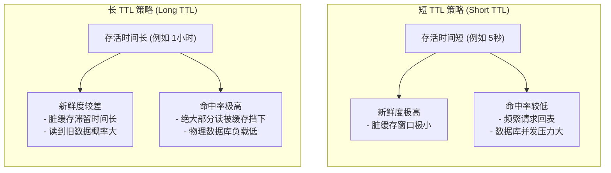
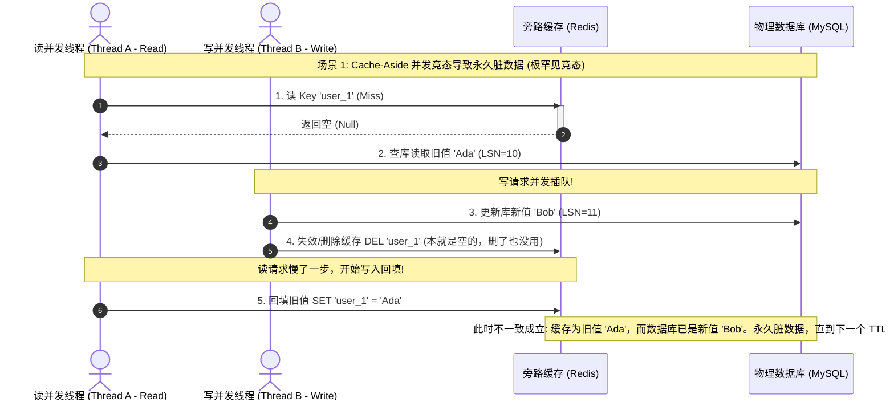
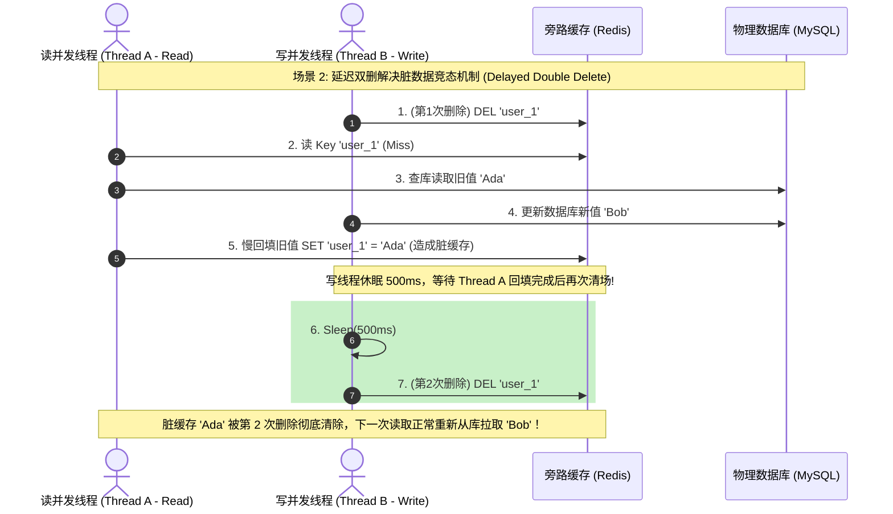

import GlossaryTerm from '@site/src/components/GlossaryTerm';
import GuidedExercise from '@site/src/components/GuidedExercise';
import ResearchNote from '@site/src/components/ResearchNote';
import ChapterMeta from '@site/src/components/ChapterMeta';
import PyRunner from '@site/src/components/PyRunner';
import TradeoffExplorer from '@site/src/components/TradeoffExplorer';
import QuizCard from '@site/src/components/QuizCard';

# M3L6 · 缓存失效与一致性

<ChapterMeta
  time="约 1.5–2 小时"
  prereqs={[{label: 'M3L5 缓存模式', href: './cache-patterns'}, {label: 'L8 并发竞态', href: '../foundations/concurrency-basics'}]}
  outcome="能用 TTL 和写时失效让缓存与数据库保持一致，并看懂读写并发导致的缓存陈旧竞态。"
  howToUse="先跑 TTL 过期 demo，再理解写时为什么“删”而不是“改”，最后做 lab。"
/>

:::tip 计算机科学最著名的玩笑
"计算机科学只有两件难事：缓存失效和命名。" 缓存让读飞快，但**数据库一变，缓存就成了骗人的旧值**。怎么让缓存及时失效、又不在并发下出错——这是真正的难题。
:::

## 一、数据库改了，缓存还在骗人

你更新了用户昵称，写进了数据库。但缓存里还是旧昵称，于是用户刷新看到的还是旧的，直到缓存过期。这就是<GlossaryTerm term="Cache Staleness" definition="缓存陈旧：缓存里的值与数据库不再一致（因为数据库被更新了但缓存没同步）。缓存的核心难题。">缓存陈旧</GlossaryTerm>。让缓存和库保持一致，有两条基本手段：**过期（TTL）** 和 **写时失效**。

## 二、三个核心概念（分层）

### 基础：TTL 过期

给每个缓存项设一个<GlossaryTerm term="TTL" definition="存活时间（Time To Live）：缓存项的过期时间。到期自动失效、下次读重新从库加载。是最简单的最终一致手段：陈旧最多持续一个 TTL。">TTL</GlossaryTerm>，到期自动失效、下次读重新加载。它简单可靠，但冷启动时常需要通过 <GlossaryTerm term="Cache Warm-up" definition="缓存预热：在系统上线或高并发流量来临前，提前将热点数据写入缓存内存，避免海量请求瞬间涌入数据库造成瞬间压垮。">缓存预热 (Cache Warm-up)</GlossaryTerm> 前置填充。TTL 的代价是：**在 TTL 内数据可能是旧的**（最终一致，回扣 [M2L6](../system-design-bridge/cap-consistency)）。TTL 越短越新鲜、但命中率越低；越长命中率越高、但越可能陈旧。



### 进阶：写时失效，且要"删"不要"改"

光靠 TTL 不够及时。更主动的做法是**写数据库时，让对应缓存失效**。关键细节：

- **删除缓存，而不是更新缓存**：更新缓存容易在并发下写入旧值；删除则让下次读去库取最新，更安全。
- **顺序：先写库，再删缓存**（cache-aside 的标准做法）。

### 深入（选学）：一个挥之不去的竞态

即使"先写库再删缓存"，仍有罕见竞态：读请求 miss、从库读到**旧值**，正要回填时，另一个写请求更新库并删了缓存；结果读请求把**旧值**填了回去——缓存又脏了。对策有 <GlossaryTerm term="Delayed Double Delete" definition="延迟双删：一种应对 Cache-Aside 并发读写竞态脏缓存的一致性兜底策略。步骤为：先删缓存，再写数据库，延迟一段时间（等并发读的事务回填完旧值），最后再次删除缓存以清除脏缓存值。">延迟双删 (Delayed Double Delete)</GlossaryTerm>、版本号、或干脆靠 TTL 兜底。**这就是为什么缓存失效被称为难题：它本质是 [L8 的并发竞态](../foundations/concurrency-basics) 跨越了两个系统。**





<ResearchNote
  title="缓存失效，公认的两大难题之一"
  source="Phil Karlton（广为流传）：There are only two hard things in Computer Science: cache invalidation and naming things"
  href="https://martinfowler.com/bliki/TwoHardThings.html"
  insight="这句业界名言点破了缓存的本质难点：让缓存在正确的时机、以正确的方式失效，在并发和分布式下出奇地难。简单的“加缓存”背后藏着一致性的深坑。"
  application="架构师对缓存要心存敬畏：它几乎总能提升性能，但每加一处缓存，就引入一处潜在的不一致。要为每个缓存明确：失效策略是什么？能容忍多久陈旧？并发竞态怎么兜底？"
/>

## 三、跟我做一遍：TTL 缓存

<PyRunner
  expect="过期后重新加载"
  code={`class TTLCache:
    def __init__(self):
        self.store = {}                     # key -> (value, expire_at)

    def set(self, key, value, now, ttl):
        self.store[key] = (value, now + ttl)

    def get(self, key, now):
        if key not in self.store:
            return None
        value, exp = self.store[key]
        if now >= exp:                      # 过期
            del self.store[key]
            return None
        return value

    def invalidate(self, key):              # 写时主动失效
        self.store.pop(key, None)

c = TTLCache()
c.set("name", "Ada", now=0, ttl=10)
print("t=5:", c.get("name", 5))     # Ada（未过期）
print("t=12:", c.get("name", 12))   # None（过期，要重新加载）
c.set("name", "Bob", now=12, ttl=10)
c.invalidate("name")
print("失效后:", c.get("name", 13)) # None
print("过期后重新加载")`}
/>

TTL 让陈旧最多持续 10 秒；`invalidate` 让你在写时立刻清掉。**试试**：把 ttl 改成 1，看缓存几乎每次都 miss（太新鲜=低命中）；改成 1000，看它长时间返回旧值（高命中=可能陈旧）——这就是 TTL 的取舍。

## 四、动手 Lab（必做）

打开 `labs/month03/m3l6_ttl/`：

```bash
python labs/month03/m3l6_ttl/test_ttl.py
```

实现一个带 TTL 过期和主动失效的缓存。

<GuidedExercise
  title="练习指引：实现 TTL 缓存"
  goal="把“过期 + 写时失效”做成代码，体会缓存新鲜度与命中率的取舍。"
  hints={[
    '存 (value, expire_at)，expire_at = now + ttl。',
    'get(key, now)：now >= expire_at 视为过期，删除并返回 None。',
    'invalidate(key)：直接删除（写时主动失效）。',
    '时间用参数 now 传入，保证测试确定性（别用真实时钟）。'
  ]}
  steps={[
    '实现 TTLCache：store 存 (value, expire_at)。',
    'set(key, value, now, ttl)：记录过期时间。',
    'get(key, now)：未过期返回值，过期删除并返回 None，不存在返回 None。',
    'invalidate(key)：删除该键。',
    '写测试：未过期命中、过期 miss、失效后 miss。'
  ]}
  checks={[
    '你能解释 TTL 在新鲜度和命中率之间的取舍。',
    '你的缓存过期和主动失效都正确。',
    '你能说出写时为什么"删"比"改"安全。',
    '你能描述"读回填旧值"的竞态及一种对策。'
  ]}
/>

## 架构师深潜（Staff+ 视角）

### 1. 缓存一致性策略怎么选

<TradeoffExplorer
  title="缓存与数据库的一致性策略"
  dimensions={['新鲜度', '命中率', '实现复杂度', '并发安全', '适用场景']}
  options={[
    {
      name: '仅 TTL 过期',
      scores: [2, 4, 5, 4, 4],
      note: '最简单，陈旧最多一个 TTL。但更新后到过期前都是旧值。',
      whenToUse: '能容忍一定陈旧的数据（商品详情、配置）。'
    },
    {
      name: '写时失效 + TTL 兜底',
      scores: [4, 4, 3, 3, 5],
      note: '写库后删缓存（及时），TTL 作为兜底防遗漏。最常用组合。',
      whenToUse: '大多数 cache-aside 场景的推荐做法。'
    },
    {
      name: '写穿透（write-through）',
      scores: [5, 4, 3, 4, 3],
      note: '写时同步更新缓存，缓存总最新。但写变慢、仍有并发更新顺序问题。',
      whenToUse: '要求缓存高度新鲜、写不太密集。'
    }
  ]}
/>

### 2. 给每个缓存回答三个问题

加任何缓存前，架构师都该回答：**① 失效策略是什么（TTL？写时删？）② 能容忍多久陈旧 ③ 并发竞态怎么兜底**。答不上来，就是在埋一致性的雷。

### 3. 真实案例：Facebook 专门治缓存竞态

[Facebook 的 memcache 论文](https://www.usenix.org/system/files/conference/nsdi13/nsdi13-final170_update.pdf)（M3L5 引）花了大量篇幅处理缓存失效竞态和跨区域一致性——证明了"缓存失效在超大规模下确实是头号难题"。架构师要把缓存一致性当成一等设计问题，而不是事后补丁。

### 4. 架构师深问（给自己 30 分钟）

- 用户改了头像，你希望"自己立刻看到、别人几秒内看到"——TTL 和写时失效怎么配？（回扣读己之写。）
- "先删缓存再写库"和"先写库再删缓存"，哪个竞态更轻？为什么标准做法是后者？
- 一个超热点 key 用很长 TTL 提命中率，但它一过期就被打爆（击穿）——下一课怎么救？

## 自检清单

- [ ] 我能用 TTL + 写时失效保持缓存与库一致。
- [ ] 我的 lab TTL 缓存过期/失效正确。
- [ ] 我能解释写时"删缓存"为什么比"改缓存"安全。
- [ ] 我能描述一个缓存失效竞态及对策。

## 常见误解

- **"给缓存加上了写时删除或者短 TTL，系统就能保证强一致性了"**: 缓存本质上是不可靠的一致性模型。由于网络分区（Network Partition）或者并发竞态的物理时间差，强一致性在客户端是无法获得 100% 物理保证的。对于金融资产、扣款等强一致性场景，绝对不能使用旁路缓存做主要决策路径，应直达数据库事务或基于分布式强一致协议。
- **"既然‘先写库再删缓存’存在竞态脏数据，那么我们改成‘先删缓存再写库’就完美了"**: 恰恰相反！“先删缓存再写库”的竞态发生概率要大得多。如果先删除缓存，在更新数据库成功前（这个写事务往往耗时几十毫秒），这几十毫秒内所有的并发读请求都会发生 Cache Miss 去读库，并把旧值回填至缓存中，导致数据库更新完毕后，缓存立刻且长久地成为脏数据。
- **"TTL 可以随便设置，反正在写时会主动调用删除"**: 这是不可预测的风险。因为在微服务、分布式拓扑中，数据库 binlog 消费失败、后台删除事件丢失是常态。如果没有科学的 TTL 时间在物理时序上兜底清理，任何网络或机器抖动导致的删除事件丢失，都会让缓存项永久陈旧。

## 五、章末自测

<QuizCard
  questions={[
    {
      q: '在 Cache-Aside 模式下，即便采用了‘先写数据库，再删缓存’的标准写法，依然存在一种极罕见的脏数据竞态。以下哪项物理步骤能够完美复现该脏数据竞态？',
      options: [
        '读请求直接写缓存 -> 写请求直接读数据库。',
        '① 读请求未命中缓存，去数据库读取了旧值 V1；② 此时并发的写请求修改数据库为 V2，并执行删缓存操作（此时缓存本来就是空的，删除操作无实际影响）；③ 读请求在写请求删除之后，将刚才在数据库读到的旧值 V1 写入缓存。从而导致缓存永久存放了旧值 V1，直到 TTL 到期。',
        '写请求更新数据库 -> 读请求在库中修改值并提交。'
      ],
      answer: 1,
      explain: 'Cache-Aside 并发读写竞态。此竞态发生的物理前提是：读请求去数据库读旧值，并在写请求完成‘改库+删缓存’这两步之后，才执行写缓存的操作。由于数据库读一般极快，写缓存又紧随其后，因此该竞态极为罕见，但仍需用 TTL 兜底或使用延迟双删。'
    },
    {
      q: '‘延迟双删’ (Delayed Double Delete) 是业界用来解决缓存与数据库双写一致性竞态的一种工程折中方案。关于其执行步骤，以下描述哪项是正确的？',
      options: [
        '先修改缓存 -> 延迟删除数据库 -> 再删除一次缓存。',
        '① 先删除缓存；② 更新数据库物理行数据；③ 线程休眠一段时间（例如 500ms，以确保并发的读事务已经完成其读库和回填动作）；④ 再次执行缓存删除操作。其核心目的是清除由于并发读回填造成的脏缓存数据。',
        '删除缓存 -> 再次删除缓存 -> 接着写数据库。'
      ],
      answer: 1,
      explain: '延迟双删旨在清理在‘写库’期间，由于读请求并发读旧库并写回缓存而产生的旧脏数据。延迟的时间应略大于读库+回填的时间。由于延迟双删会产生线程挂起，通常可配合消息队列异步处理第二次删除。'
    },
    {
      q: '在为缓存项设置 TTL (TimeToLive) 存活时间时，以下哪项设计准则是架构师在新鲜度与缓存命中率之间权衡时应当遵循的？',
      options: [
        'TTL 必须始终设置为 0 秒，以保证绝对没有脏数据。',
        'TTL 越长，缓存命中率越高（减少数据库访问），但数据陈旧期越长（一致性差）；TTL 越短，数据一致性越好，但频繁回表会导致数据库压力剧增。因此对于高频修改数据应设置短 TTL 并配合写时失效，对低频更改数据应设置长 TTL。',
        'TTL 长度取决于网络延迟，与数据修改频次无关。'
      ],
      answer: 1,
      explain: 'TTL Tradeoff. 缓存命中率是系统瓶颈的直接指标。如果命中率掉得太低，缓存就失去了屏蔽并发请求的屏障意义，通常需要结合‘主动写失效 + 适度长 TTL 兜底’来维持二者的科学平衡。'
    }
  ]}
/>

## 延伸阅读

- [Martin Fowler, Two Hard Things](https://martinfowler.com/bliki/TwoHardThings.html)
- [Scaling Memcache at Facebook](https://www.usenix.org/system/files/conference/nsdi13/nsdi13-final170_update.pdf)
- [下一课：缓存三大难题](./cache-problems)
