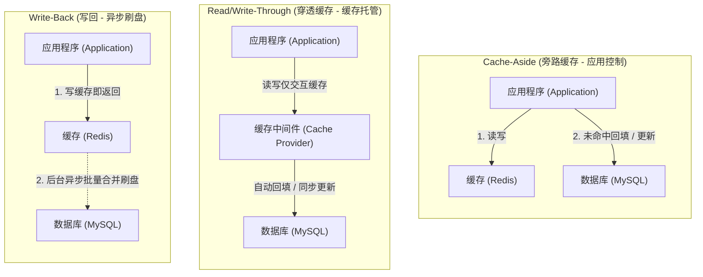
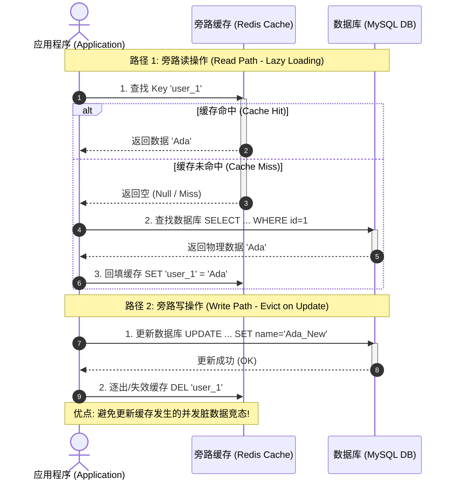
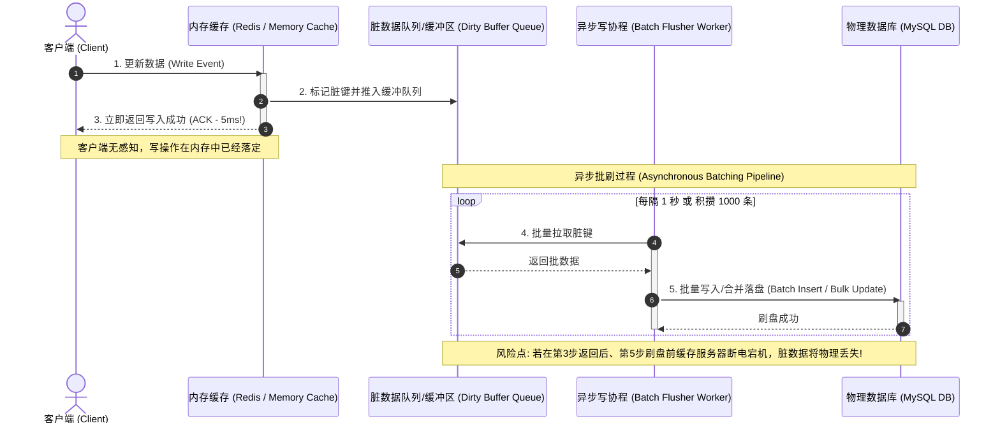

import GlossaryTerm from '@site/src/components/GlossaryTerm';
import GuidedExercise from '@site/src/components/GuidedExercise';
import ResearchNote from '@site/src/components/ResearchNote';
import ChapterMeta from '@site/src/components/ChapterMeta';
import PyRunner from '@site/src/components/PyRunner';
import TradeoffExplorer from '@site/src/components/TradeoffExplorer';
import QuizCard from '@site/src/components/QuizCard';

# M3L5 · 缓存模式

<ChapterMeta
  time="约 1.5–2 小时"
  prereqs={[{label: 'L10 缓存初识', href: '../foundations/request-path'}, {label: 'M2L8 存储选型', href: '../system-design-bridge/storage-selection'}]}
  outcome="能讲清 cache-aside / read-through / write-through / write-back 四种缓存模式的读写路径与取舍，并实现 cache-aside。"
  howToUse="先跑 cache-aside 的读路径，理解谁负责填缓存，再做 lab，最后看写策略对比。"
/>

:::tip 缓存不是"加上去就行"，而是一套读写协议
缓存能挡住绝大多数读（[L10](../foundations/request-path)），但它和数据库怎么配合——谁读、谁写、什么时候填、什么时候删——有几种成熟模式。选错模式，就会遇到数据不一致和缓存难题（下两课）。
:::

## 一、缓存和数据库，谁听谁的？

你加了 Redis 缓存。问题来了：读时先查缓存还是数据库？缓存没有时谁去填？写时先写缓存还是数据库？这些"谁负责什么"的约定，就是<GlossaryTerm term="Cache Pattern" definition="缓存模式：缓存与底层数据库协作的标准方式，规定读写时各组件的职责与顺序。常见有 cache-aside、read-through、write-through、write-back。">缓存模式</GlossaryTerm>。



## 二、三个核心概念（分层）

### 基础：Cache-Aside（旁路缓存）

最常用的模式，由**应用代码**负责协调：

- **读**：先查缓存 → 命中就返回；未命中 → 查数据库 → 把结果填进缓存 → 返回。
- **写**：写数据库 → 让对应缓存进行 <GlossaryTerm term="Cache Eviction" definition="缓存逐出/失效：由于空间不足或底层数据变更，将特定缓存项从缓存介质（如 Redis）中主动删除或根据置换算法（LRU/LFU）清理的行为。">缓存失效 (Cache Eviction)</GlossaryTerm>。



<GlossaryTerm term="Cache-Aside" definition="旁路缓存：应用自己负责读时未命中则回填、写时让缓存失效。最常用、最灵活，但一致性要应用小心处理。">Cache-Aside</GlossaryTerm> 灵活、容错好（缓存挂了还能直接走库），是默认选择。

### 进阶：Read-Through / Write-Through / Write-Back

把"协调缓存"的职责从应用挪到缓存层自己：

- <GlossaryTerm term="Read-Through" definition="读穿透：未命中时由缓存层自己去加载数据库并回填，应用只跟缓存打交道。">Read-Through</GlossaryTerm>：未命中由缓存自己加载库。
- <GlossaryTerm term="Write-Through" definition="写穿透：写时同步写缓存和数据库（都成功才算成功）。缓存始终最新，但写变慢。">Write-Through</GlossaryTerm>：写时同步写缓存 + 库。缓存总最新，但写慢。
- <GlossaryTerm term="Write-Back" definition="写回/写behind：写时只写缓存、立即返回，异步批量刷到数据库。写极快，但缓存挂了可能丢未刷的数据。">Write-Back</GlossaryTerm>：又称 <GlossaryTerm term="Write-Behind" definition="异步写回 (Write-Behind)：一种极速写优化缓存策略。写操作仅作用于缓存内存，并立即向客户端返回成功；后台工作协程以异步分批（Batching）形式将脏数据合并落盘写入数据库。">Write-Behind (异步写回)</GlossaryTerm>。只写缓存就返回，异步刷库。写极快，但有丢数据风险。



### 深入（选学）：模式的本质是"职责放哪 + 风险放哪"

每种模式都是在挪动两样东西：**协调职责**（应用 vs 缓存层）和**风险**（一致性、丢数据）。write-back 用"可能丢数据"换"极快的写"；write-through 用"写变慢"换"缓存总最新"。**没有最好的模式，只有匹配你读写比和容忍度的模式。**

<ResearchNote
  title="把缓存做到极致：Facebook 的 memcache"
  source="Nishtala et al. (2013), Scaling Memcache at Facebook"
  href="https://www.usenix.org/system/files/conference/nsdi13/nsdi13-final170_update.pdf"
  insight="Facebook 用 cache-aside（look-aside）模式把 memcached 扩展到每秒数十亿请求，并专门处理了缓存失效竞态、惊群（thundering herd）、跨区域一致性等真实难题。"
  application="这篇论文是“缓存在超大规模下到底会遇到什么”的权威记录——cache-aside 是基础，但要配一整套机制对付下两课的缓存难题。读它你会发现：缓存简单，但把缓存做对极难。"
/>

## 三、跟我做一遍：cache-aside 读路径

<PyRunner
  expect="第二次命中缓存"
  code={`db = {"user:1": "Ada"}     # 慢数据库
cache = {}                  # 快缓存
stats = {"hit": 0, "miss": 0}

def get_user(key):
    if key in cache:                  # 1) 先查缓存
        stats["hit"] += 1
        return cache[key]
    stats["miss"] += 1                # 2) 未命中
    value = db.get(key)               # 3) 查数据库
    if value is not None:
        cache[key] = value            # 4) 回填缓存
    return value

print("第一次:", get_user("user:1"), "（", stats, "）")  # miss → 回填
print("第二次:", get_user("user:1"), "（", stats, "）")  # hit
print("第二次命中缓存" if stats["hit"] == 1 else "?")`}
/>

注意第 4 步：cache-aside 里**回填缓存是读路径的责任**。第一次 miss 把数据带进缓存，之后就都命中了。**试试**：加一个 `update_user`，它写库后要 `cache.pop(key)`（失效），不然下次还读到旧值——这正是下一课的核心。

## 四、动手 Lab（必做）

打开 `labs/month03/m3l5_cache/`：

```bash
python labs/month03/m3l5_cache/test_cache.py
```

实现 cache-aside 的读（含回填）和写（含失效），并统计命中率。

<GuidedExercise
  title="练习指引：实现 cache-aside"
  goal="把最常用的缓存模式做成代码：读时回填、写时失效、统计命中——这是缓存的基本功。"
  hints={[
    '读：先查缓存（命中 hit++），未命中（miss++）查 db 并回填。',
    '写：写 db 后，删除（失效）对应缓存键，而不是去改它。',
    '命中率 = hit / (hit + miss)。',
    '想想：为什么写时"删缓存"比"更新缓存"更安全？（下一课答案。）'
  ]}
  steps={[
    '实现 Cache（store + hit/miss 计数）：get/set/delete。',
    '实现 read(cache, db, key)：cache-aside 读路径（含回填）。',
    '实现 write(cache, db, key, value)：写 db + 失效缓存。',
    '写测试：首读 miss 回填、再读 hit、写后失效使下次重新加载。'
  ]}
  checks={[
    '你能讲清 cache-aside 的读路径四步。',
    '你的写操作会让缓存失效（而非留旧值）。',
    '你能算命中率。',
    '你能区分 cache-aside / read-through / write-through / write-back。'
  ]}
/>

## 架构师深潜（Staff+ 视角）

### 1. 写策略：一致性 vs 写延迟 vs 丢数据风险

<TradeoffExplorer
  title="缓存写策略怎么选"
  dimensions={['写延迟', '缓存新鲜度', '丢数据风险', '实现复杂度', '读性能']}
  options={[
    {
      name: 'Cache-Aside（写时失效）',
      scores: [4, 3, 5, 5, 4],
      note: '写库 + 删缓存，下次读再回填。简单、容错好。但有失效竞态（下课）。',
      whenToUse: '绝大多数场景的默认选择。'
    },
    {
      name: 'Write-Through（写穿）',
      scores: [2, 5, 5, 3, 5],
      note: '同步写缓存 + 库，缓存始终最新。但每次写更慢、缓存有冷数据。',
      whenToUse: '读多、要求缓存总是最新、能接受写慢一点。'
    },
    {
      name: 'Write-Back（写回）',
      scores: [5, 4, 1, 2, 5],
      note: '只写缓存就返回、异步刷库。写极快，但缓存宕机会丢未刷数据。',
      whenToUse: '写极密集、能容忍少量丢失（如计数器、指标）。'
    }
  ]}
/>

### 2. 缓存挡的是读，不是银弹

缓存对**读多写少 + 有热点**最有效（回扣 [M2L3 读写比](../system-design-bridge/capacity-estimation)）。如果读写比接近 1:1、或访问没有热点（每个 key 都只读一次），缓存命中率低，反而只增加复杂度和不一致风险。**先用估算判断缓存值不值得，再加。**

### 3. 真实案例：缓存是大系统的标配也是难点

[ChatGPT 的 KV cache](../atlas/chatgpt.mdx)、几乎所有 [互联网应用](../atlas) 的读路径都重度依赖缓存。但缓存也是事故高发区——下两课的穿透/击穿/雪崩、以及一致性竞态，都是真实线上踩过的坑。**会加缓存只是入门，会处理缓存的难题才是架构师。**

### 4. 架构师深问（给自己 30 分钟）

- 你的报名服务，哪些数据该缓存（读多、热点）？哪些不该（写多、无热点、强一致）？
- write-back 写计数器很爽，但缓存宕机丢了几百个赞怎么办？这个风险可接受吗？
- 缓存命中率从 95% 掉到 80%，对数据库压力意味着什么？（提示：miss 翻了 4 倍。）

## 自检清单

- [ ] 我能讲清 cache-aside 的读写路径。
- [ ] 我的 lab 实现了回填、失效、命中率统计。
- [ ] 我能对比四种缓存模式的取舍。
- [ ] 我能用读写比/热点判断该不该加缓存。

## 常见误解

- **"系统加了缓存就一定能扛高并发，访问必然更快"**: 极其片面。如果系统读写比接近 1:1，或者请求访问的数据毫无聚集性（全部是随机只读一次的冷 Key），缓存命中率将接近于 0。此时系统不仅要浪费 CPU 去查找 Redis，还要额外承担网络开销和应用层 Cache Miss 回填代码开销，数据库该被击穿依然会被击穿。
- **"更新数据库数据时，直接同步修改对应的 Redis 缓存是最快最直观的"**: 严重错误。如果存在两个写请求并发进行，由于网络延迟差异，更新缓存的操作极其容易发生“时序交错”，导致最新的修改被历史的旧值覆盖。写时直接“删除（失效）”缓存是防范脏数据竞态的事实标准。
- **"缓存就是 Redis，有缓存的类库就行"**: 缓存是一个分布式系统中的“读写控制协议”。Redis、Memcached 仅仅是该协议的物理存储实现介质。如果不妥善设计其在应用层代码中的回填、失效、防穿透熔断等职责路径，单纯部署 Redis 服务器对高并发系统无济于事。

## 五、章末自测

<QuizCard
  questions={[
    {
      q: '在 Cache-Aside (旁路缓存) 模式下，更新数据的标准做法是‘更新数据库，然后删除缓存’，为什么不是‘更新数据库，然后更新缓存’？',
      options: [
        '因为更新缓存会导致 Redis 的内存直接溢出发生 OOM。',
        '为了避免并发更新时的脏数据竞态。如果有两个写事务并发，更新缓存可能会因网络执行顺序颠倒导致缓存中留存历史脏数据；而直接删除缓存则可以让下一次读请求触发安全回填。此外，更新缓存存在写多读少场景下的多余计算浪费。',
        '因为 Redis 数据库不支持任何 update 覆盖操作，只支持 delete。'
      ],
      answer: 1,
      explain: '并发修改脏数据。如果两个事务并发，执行顺序为：事务A写库 -> 事务B写库 -> 事务B更新缓存 -> 事务A更新缓存。此时缓存是事务A的旧值，而数据库是事务B的新值，造成永久不一致。改为删除缓存可确保后续读取回填，物理上是安全的。'
    },
    {
      q: 'Write-Back (写回/异步写) 模式是现代操作系统 Page Cache 及某些极高写并发系统（如 Redis 计数器异步落盘）的核心。它的最大取舍是什么？',
      options: [
        '极好的写延迟与写入吞吐量，但代价是缓存层宕机会丢失内存中尚未刷盘的脏数据，且最终一致性的延迟较大。',
        '对读性能产生严重的拖累，每次读都需要进行多表扫描。',
        '它会导致缓存命中率永久下降到零。'
      ],
      answer: 0,
      explain: 'Write-Back 将同步写磁盘降级为异步刷盘。因此写延迟降到内存级别（极致吞吐）。代价是一旦缓存宕机且无持久化快照，未刷回主库的数据将永久丢失。常用于写密集且能接受少量数据丢失的场景。'
    },
    {
      q: 'Read-Through / Write-Through 与 Cache-Aside 的最核心架构区别是什么？',
      options: [
        'Read-Through 必须在客户端机器中部署代理层，不允许直连。',
        '在 Read-Through/Write-Through 模式下，应用代码不感知底层数据库，只与缓存抽象接口打交道，将‘读取回填/同步写入’的协调职责打包在缓存中间件内部；而 Cache-Aside 模式下，应用代码必须编写协调缓存和数据库的全部流程。',
        '它们完全没有任何区别，只是针对不同的品牌叫法。'
      ],
      answer: 1,
      explain: 'Responsibility allocation. 职责分担的区别。Through 模式隐藏了存储层实现，应用感知极简。但这也意味着缓存层需要集成底层数据库驱动和适配代码，开发与部署复杂度变高。Cache-Aside 则将这个灵活性交给了应用层。'
    }
  ]}
/>

## 延伸阅读

- [Scaling Memcache at Facebook](https://www.usenix.org/system/files/conference/nsdi13/nsdi13-final170_update.pdf)
- [AWS: Caching Best Practices](https://aws.amazon.com/caching/best-practices/)
- [下一课：缓存失效与一致性](./cache-invalidation)
