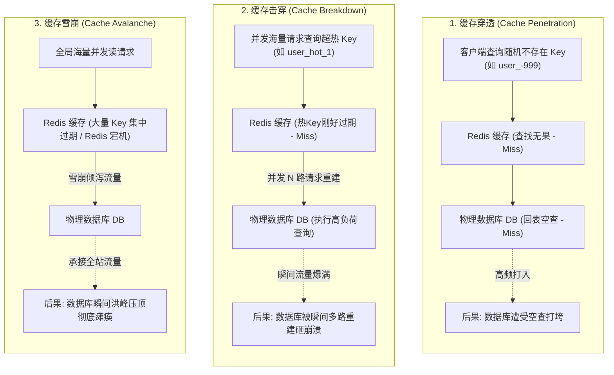
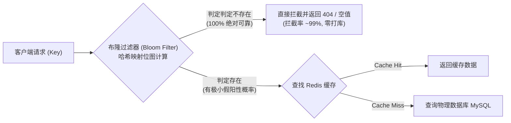
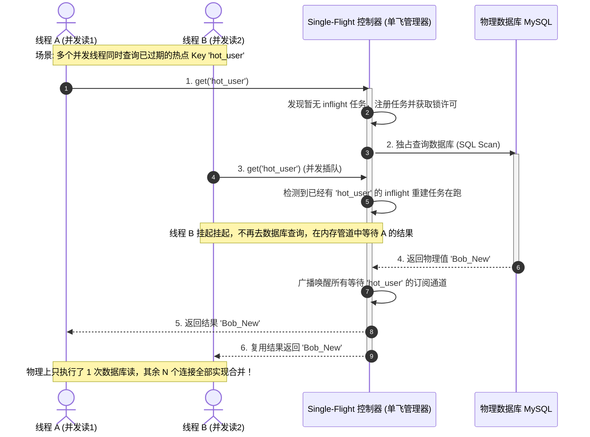

import GlossaryTerm from '@site/src/components/GlossaryTerm';
import GuidedExercise from '@site/src/components/GuidedExercise';
import ResearchNote from '@site/src/components/ResearchNote';
import ChapterMeta from '@site/src/components/ChapterMeta';
import PyRunner from '@site/src/components/PyRunner';
import TradeoffExplorer from '@site/src/components/TradeoffExplorer';
import QuizCard from '@site/src/components/QuizCard';

# M3L7 · 缓存三大难题

<ChapterMeta
  time="约 1.5–2 小时"
  prereqs={[{label: 'M3L6 缓存失效', href: './cache-invalidation'}, {label: 'L1 惊群', href: '../foundations/programming-systems-primer'}]}
  outcome="能识别并解决缓存穿透、击穿、雪崩三类事故，掌握空值缓存、互斥重建（single-flight）、抖动 TTL。"
  howToUse="先认识三种事故的成因，再跑 single-flight 的 demo，最后做 lab 实现负缓存和抖动 TTL。"
/>

:::tip 缓存救了数据库，也可能亲手害死它
缓存平时挡住了 99% 的读。但有三种情形，缓存会突然"漏水"，让海量请求瞬间砸向数据库，把它打垮——穿透、击穿、雪崩。这一课教你识别并堵住这三个洞。
:::

## 一、缓存一漏，数据库就崩

缓存命中率 99% 时数据库很轻松。但如果突然大量请求绕过缓存直达数据库，DB 瞬间过载（回扣 [L1 惊群](../foundations/programming-systems-primer)、[M2L4 串联可用性](../system-design-bridge/sla-slo-availability)）。三种典型成因：



## 二、三个核心概念（分层）

### 基础：三大难题的成因

- <GlossaryTerm term="Cache Penetration" definition="缓存穿透：大量查询一个根本不存在的 key（缓存和库都没有），每次都穿过缓存打到库。常见于恶意攻击或爬虫。">穿透</GlossaryTerm>：查**不存在**的 key——缓存永远 miss，每次都打库。
- <GlossaryTerm term="Cache Breakdown" definition="缓存击穿：某个热点 key 过期的瞬间，大量并发请求同时 miss、一起去重建它，集中打到库。也叫 hot key 失效。">击穿</GlossaryTerm>：某个**热点 key 过期瞬间**，大量请求同时去重建，一起打库。
- <GlossaryTerm term="Cache Avalanche" definition="缓存雪崩：大量 key 在同一时刻集中过期（或缓存集群整体宕机），导致海量请求同时打到数据库。">雪崩</GlossaryTerm>：**大量 key 同时过期**（或缓存整体宕机），海量请求同时打库。

### 进阶：对症下药

| 难题 | 成因 | 对策 |
|---|---|---|
| 穿透 | 查不存在的 key | **空值缓存**（缓存"不存在"）、<GlossaryTerm term="Bloom Filter" definition="布隆过滤器：一种空间效率极高的概率型数据结构，用于快速检索一个元素是否在一个集合中。具有 0% 的假阴性率（判定不存在则一定不存在）和少量的假阳性率（判定存在时可能实际不存在），常用来前置拦截无效的穿透查询。">布隆过滤器 (Bloom Filter)</GlossaryTerm> |
| 击穿 | 热点 key 过期瞬间 | **互斥重建**（只让一个请求重建，single-flight）、<GlossaryTerm term="Logical Expiration" definition="逻辑过期：缓存项的物理 TTL 被设置为永不过期，但在其 BSON 数据包内部设置一个 logical_expire_time 字段。当读线程发现已逻辑过期时，返回旧数据并异步启动后台工作线程刷新数据。">逻辑过期 (Logical Expiration)</GlossaryTerm> |
| 雪崩 | 大量 key 同时过期 | **TTL 加随机抖动**、多级缓存、缓存高可用 |



### 深入（选学）：single-flight / 请求合并

击穿的本质是<GlossaryTerm term="Thundering Herd" definition="惊群：某资源（如刚过期的热点缓存）可用瞬间，大量等待者同时涌入争抢，瞬间过载。缓存击穿是它的典型。">惊群</GlossaryTerm>（回扣 [L1](../foundations/programming-systems-primer)）。最优雅的对策是 <GlossaryTerm term="Single-Flight" definition="单飞/请求合并：同一个 key 同时有很多请求要重建时，只让第一个真正去加载，其余请求等它的结果。把 N 次重建合并成 1 次。">single-flight（请求合并）</GlossaryTerm>：同一个 key 的并发重建只执行一次，其余请求复用这个结果。把"N 个请求打库"变成"1 个请求打库"。



<ResearchNote
  title="惊群与缓存失效，超大规模缓存的真实战场"
  source="Nishtala et al. (2013), Scaling Memcache at Facebook（thundering herd / leases 一节）"
  href="https://www.usenix.org/system/files/conference/nsdi13/nsdi13-final170_update.pdf"
  insight="Facebook 用“租约（lease）”机制专门对付缓存击穿与惊群：热点 key 失效时只给一个客户端“重建许可”，其余等待，避免成千上万个请求同时打库。这正是 single-flight 的工业级实现。"
  application="缓存三大难题不是理论，而是每个高流量系统都踩过的坑。架构师上缓存时，必须同时设计这三道防线（空值缓存/互斥重建/抖动 TTL），否则缓存反而成了把数据库打垮的放大器。"
/>

## 三、跟我做一遍：single-flight 防击穿

<PyRunner
  expect="只重建一次"
  code={`db_calls = {"n": 0}

def load_from_db(key):
    db_calls["n"] += 1
    return f"value_of_{key}"

cache = {}
inflight = set()   # 正在重建的 key

def get(key):
    if key in cache:
        return cache[key]
    if key in inflight:
        # 已有请求在重建：本请求"等待"复用结果（这里简化为直接拿）
        return "（等待重建中，复用结果）"
    inflight.add(key)               # 抢到重建许可
    cache[key] = load_from_db(key)  # 只有我去打库
    inflight.discard(key)
    return cache[key]

# 模拟热点 key 过期后，多个请求几乎同时到达
results = [get("hot") for _ in range(5)]
print("数据库被调用次数:", db_calls["n"])   # 关键：只有 1 次
print("只重建一次" if db_calls["n"] == 1 else "?")`}
/>

5 个请求争抢同一个过期热点，但数据库**只被打了一次**——其余请求复用结果。这就是 single-flight 防击穿。**试试**：去掉 `inflight` 逻辑，看 5 个请求全打库（击穿发生）。

## 四、动手 Lab（必做）

打开 `labs/month03/m3l7_cache_guard/`：

```bash
python labs/month03/m3l7_cache_guard/test_guard.py
```

实现**空值缓存**（防穿透）和**抖动 TTL**（防雪崩）两道防线。

<GuidedExercise
  title="练习指引：缓存的两道防线"
  goal="把“防穿透”和“防雪崩”做成代码：负缓存让不存在的 key 不再反复打库；抖动 TTL 让 key 不会同时过期。"
  hints={[
    '负缓存：连"查不到"也缓存（用一个 sentinel 标记），下次直接返回 None，不再打库。',
    '统计 loader 被调用的次数，证明负缓存生效（同一缺失 key 只 load 一次）。',
    '抖动 TTL：base + 随机(0..jitter)，用固定 seed 保证可测试。',
    '想想：为什么大量 key 用相同 TTL 会雪崩，加抖动就能错开。'
  ]}
  steps={[
    '实现 GuardedCache.get(key, loader)：命中返回；未命中调用 loader 并缓存结果——即使结果是 None 也缓存（负缓存）。',
    '统计 loader_calls：同一缺失 key 查两次，loader 只被调一次。',
    '实现 jittered_ttl(base, jitter, seed)：返回 base + [0,jitter] 内的随机值（用 seed）。',
    '写测试：负缓存防重复打库、正常命中、抖动 TTL 在范围内且随 seed 确定。'
  ]}
  checks={[
    '你能说出穿透/击穿/雪崩的成因和对策。',
    '你的负缓存让不存在的 key 不再反复打库。',
    '你的抖动 TTL 能错开过期时间。',
    '你能解释 single-flight 怎么防击穿。'
  ]}
/>

## 架构师深潜（Staff+ 视角）

### 1. 击穿对策怎么选

<TradeoffExplorer
  title="热点 key 击穿的对策"
  dimensions={['防击穿效果', '实现复杂度', '数据新鲜度', '额外延迟', '适用场景']}
  options={[
    {
      name: '互斥重建 / single-flight',
      scores: [5, 3, 4, 3, 5],
      note: '只让一个请求重建，其余等待。彻底防击穿，新鲜度好。等待者有点延迟。',
      whenToUse: '热点 key、重建代价高时的首选。'
    },
    {
      name: '逻辑过期（永不物理过期 + 后台刷新）',
      scores: [5, 4, 2, 1, 4],
      note: '缓存不真过期，发现"逻辑过期"就异步刷新、先返回旧值。零等待，但会短暂返回旧数据。',
      whenToUse: '极热 key、能容忍短暂旧值、绝不能等待时。'
    },
    {
      name: '永不过期（手动失效）',
      scores: [4, 2, 2, 1, 2],
      note: '不设 TTL，只靠写时主动失效。没有过期瞬间，但失效逻辑要做对、内存会涨。',
      whenToUse: '少量超热、可控的 key。'
    }
  ]}
/>

### 2. 三道防线要一起上

成熟系统不是只防一种：**空值缓存防穿透 + single-flight 防击穿 + 抖动 TTL/缓存高可用防雪崩**，三道防线同时部署。再加上 [M2L11 的熔断/限流](../system-design-bridge/reliability-fault-tolerance) 给数据库兜底——即使缓存全漏，也别让 DB 被打死。

### 3. 真实案例：缓存是把双刃剑

[Facebook memcache](https://www.usenix.org/system/files/conference/nsdi13/nsdi13-final170_update.pdf) 用 lease 机制治击穿；几乎所有高流量系统都为这三个难题做过专门设计。**"加缓存提性能"人人会，"防住缓存把数据库打垮"才是架构师**——一次缓存雪崩足以让整站宕机。

### 4. 架构师深问（给自己 30 分钟）

- 有人用不存在的随机 id 疯狂刷你的接口（穿透攻击），空值缓存够吗？还要加什么（布隆过滤器/限流/鉴权）？
- 你给所有商品缓存设了统一 1 小时 TTL，结果整点雪崩。怎么改？
- 缓存集群整体宕机的瞬间，怎么避免数据库被全量流量打死？（提示：熔断 + 限流 + 降级。）

## 自检清单

- [ ] 我能区分穿透、击穿、雪崩的成因。
- [ ] 我的 lab 实现了负缓存和抖动 TTL。
- [ ] 我能解释 single-flight 怎么防击穿。
- [ ] 我知道三道防线要和限流/熔断一起上。

## 常见误解

- **"既然有缓存穿透，那我对所有不存在的 key 统一设置空值缓存 (Negative Caching) 就能彻底免疫穿透了"**: 极其危险。如果是黑客利用随机生成的千万级 UUID 进行恶意的 DDoS 穿透扫表攻击，将不存在的 Key 缓存会导致 Redis 中塞满永远不会被二次命中的无效“空值缓存垃圾数据”。很快内存就会爆满触发驱逐或 OOM。对于这种恶意穿透，必须在前置网关配置高性能的布隆过滤器拦截大部分流量。
- **"Single-Flight (请求合并) 重建方案完全没有缺点，可以对所有热点数据无脑配置"**: 并非如此。虽然 Single-Flight 守护了数据库的红线，但在并发数万的极高流量下，所有请求由于并发重建都被 Block 在单机的 Channel 或 Mutex 等锁资源上，会瞬间吃满服务器的活动协程/线程资源，导致接口的读尾延迟（Tail Latency）爆表。对于极热数据，更好的策略是“逻辑过期 + 异步后台刷新”或者多级缓存直接把热点稀释。
- **"为了方便部署和缓存统计，所有 Key 统一配置相同的 TTL 是最佳实践"**: 这是典型的缓存定时炸弹。如果全部 Key 在同一时间上线并配置相同的 TTL，当时间跨过 TTL 的瞬间，这些 Key 会集体过期，导致全局缓存雪崩。TTL 必须根据数据新鲜度要求合理配置并增加 Jitter 随机抖动值进行流量错峰。

## 五、章末自测

<QuizCard
  questions={[
    {
      q: '在应对缓存穿透 (Cache Penetration) 时，使用‘空值缓存 (Negative Caching)’与‘布隆过滤器 (Bloom Filter)’这两种策略各有什么优缺点？',
      options: [
        '布隆过滤器占内存大但没有误判率；空值缓存完全没有内存消耗。',
        '空值缓存实现简单，适合不存在的 key 数量有限的场景，但如果攻击者随机生成海量垃圾 key 进行攻击，负缓存会导致 Redis 内存迅速耗尽；布隆过滤器空间利用率极高，能过滤大部分请求，但它有一定误判率（即假阳性），且不支持动态物理删除（除非使用带计数的布隆过滤器）。',
        '布隆过滤器主要用来防雪崩，空值缓存用来防击穿。'
      ],
      answer: 1,
      explain: '防穿透的取舍。空值缓存是应对偶尔的爬虫或简单不存在键的简易策略。但面对高强度恶意攻击（制造无限随机 Key），空值缓存会引起 Redis 发生 OOM，此时必须在网关层配置高性能的布隆过滤器过滤 99% 的无效 Key 访问。'
    },
    {
      q: '以下关于缓存击穿 (Cache Breakdown) 中使用 Single-Flight (请求合并) 与逻辑过期 (Logical Expiration) 两种重建方案的取舍，哪项描述是准确的？',
      options: [
        '逻辑过期虽然有实现复杂度，但它可以通过后台异步重建确保客户端读取响应永远为零等待（零额外延迟）；而 Single-Flight 虽然保护了数据库，但在热点重建期间，除了抢到锁的第一个请求，其余并发请求都会被挂起（Block）等待其回填返回，从而增加了读尾延迟。',
        'Single-Flight 绝不产生任何延迟，而逻辑过期会导致数据库陷入无限循环。',
        '逻辑过期只在单机内存中有效，无法在多机分布式缓存中使用。'
      ],
      answer: 0,
      explain: '击穿重建的延迟取舍。Single-Flight (或 Mutex 重建) 虽物理上守住了数据库的一线红线，但在并发数极高时，成百上千个被 Block 的连接会造成服务器的线程池/连接池饱和或延长接口的 Tail Latency。此时，逻辑过期利用异步更新，虽有短暂陈旧但保障了高可用和低延迟。'
    },
    {
      q: '在防范缓存雪崩 (Cache Avalanche) 时，如何通过 TTL 随机抖动 (Jitter) 来降解数据库的瞬时崩溃压力？',
      options: [
        '在缓存过期时间的 base 上增加一个随机值（Base + random），使得原本集中在某一特定时刻过期的 Key 能够均匀地离散分布在不同的时间区间，避免物理过期事件的重合引起流量峰值。',
        '直接废除 TTL，全部数据设为永久有效。',
        '在 Redis 宕机时，抖动 TTL 会强制对所有库读请求返回 Null 响应。'
      ],
      answer: 0,
      explain: 'TTL 抖动防雪崩原理。如果大量缓存设置了相同的 TTL，系统上线或批量预热后，会形成定时炸弹——在固定秒数后这些 key 同时失效。加入 Jitter 可以实现过期峰值的平滑过滤，让流量均匀释放。'
    }
  ]}
/>

## 延伸阅读

- [Scaling Memcache at Facebook（lease / thundering herd）](https://www.usenix.org/system/files/conference/nsdi13/nsdi13-final170_update.pdf)
- [布隆过滤器（Bloom Filter）](https://en.wikipedia.org/wiki/Bloom_filter)
- [下一课：项目 · URL 短链系统](./url-shortener)
