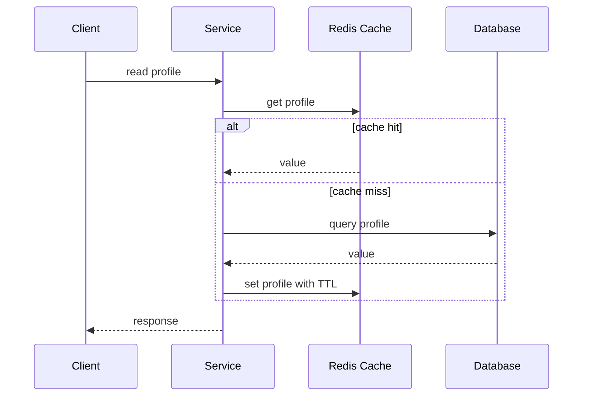

import GlossaryTerm from '@site/src/components/GlossaryTerm';
import GuidedExercise from '@site/src/components/GuidedExercise';
import ResearchNote from '@site/src/components/ResearchNote';
import {CacheSimulator} from '@site/src/components/InteractiveDemos';

# Month 3 - 数据、缓存、队列与幂等

系统设计里的很多问题，最后都会落到读写路径。数据从哪里来，写到哪里去，什么时候可以慢一点，什么时候不能丢，什么时候允许短暂不一致。

## 学习目标

- 能解释 SQL 与 NoSQL 的选择依据。
- 能画出 cache-aside 的读写路径。
- 能说明 message queue 为什么能削峰，但也会引入重复消费。
- 能理解 <span className="aa-term">Idempotency</span> 为什么是可靠系统的基本功。

## 数据库不是按名字选择的

| 问题 | 更接近 SQL | 更接近 NoSQL |
|---|---|---|
| 需要事务和关系约束 | 是 | 否 |
| 访问模式固定且规模巨大 | 不一定 | 可能 |
| 查询灵活、报表多 | 是 | 不一定 |
| 写入量极大、结构变化快 | 不一定 | 可能 |

正确问题不是“哪个数据库更高级”，而是“我的访问模式是什么，失败时要保护什么”。

<ResearchNote
  title="从 Dynamo 理解高可用键值存储"
  source="Dynamo: Amazon's Highly Available Key-value Store"
  href="https://www.allthingsdistributed.com/files/amazon-dynamo-sosp2007.pdf"
  insight="Dynamo 以购物车等场景为背景，强调高可用、最终一致、向量时钟、冲突处理和故障下继续服务。"
  application="学习 NoSQL、复制、分区和最终一致性时，不要只背概念；要问业务是否能接受冲突，以及冲突由系统自动合并还是交给用户或业务处理。"
/>

<ResearchNote
  title="从 Bigtable 理解结构化分布式存储"
  source="Bigtable: A Distributed Storage System for Structured Data"
  href="https://static.googleusercontent.com/media/research.google.com/en//archive/bigtable-osdi06.pdf"
  insight="Bigtable 把大规模结构化数据组织成稀疏、分布式、持久化的多维排序映射。"
  application="这类论文能帮助你理解为什么现代存储系统强调访问模式、行键设计、分区和压缩，而不是只说 SQL 或 NoSQL。"
/>

## Cache-Aside

<CacheSimulator />

Cache-aside 的基本读路径：



写路径更危险。常见做法是先写数据库，再删除缓存。它不完美，但比“同时更新缓存和数据库”更容易推理。

## 队列解决什么

<GlossaryTerm term="Message Queue" definition="用于在生产者和消费者之间异步传递任务或事件的系统。它能削峰、解耦和重试，但会引入重复消费、顺序和延迟问题。">Message queue</GlossaryTerm> 的作用不是让系统神奇变快，而是把“必须立刻完成”和“可以稍后完成”的工作分开。

适合放进队列的任务：

- 发送邮件、短信、通知。
- 生成报表、缩略图、embedding。
- 写入分析系统。
- 调用慢且不稳定的第三方 API。

不适合随便放进队列的任务：

- 用户必须立刻知道结果的支付扣款。
- 强一致库存扣减。
- 没有重试和去重策略的关键业务。

## 幂等性

<GlossaryTerm term="Idempotency" definition="同一个操作执行一次和执行多次，最终效果一样。它让客户端和服务端可以安全重试。">幂等性</GlossaryTerm> 指同一个操作执行一次和执行多次，最终效果一样。它是重试机制的前提。

```python
def create_order(command, idempotency_key, store):
    existing = store.find_by_key(idempotency_key)
    if existing:
        return existing

    order = store.insert_order(command, idempotency_key)
    return order
```

如果没有 `idempotency_key`，网络超时后用户重试，系统可能创建两个订单。

## 练习

1. 给 URL shortener 设计读写路径：创建短链接、访问短链接、失效短链接。
2. 说明哪些数据应该缓存，哪些不应该缓存。
3. 给“发送欢迎邮件”设计队列消费逻辑，并处理重复消费。

<GuidedExercise
  title="练习指引：给 URL shortener 加缓存和队列"
  goal="把一个简单 CRUD 服务升级成有读写路径、缓存策略和异步任务的系统。"
  hints={[
    '访问短链接是读多写少，缓存收益明显。',
    '创建短链接后可以异步写 analytics，不要阻塞用户创建。',
    '删除短链接时，数据库和缓存可能短暂不一致。',
    '队列消费者必须能处理重复消息。'
  ]}
  steps={[
    '画创建路径：Client -> API -> DB。',
    '画访问路径：Client -> API -> Cache -> DB。',
    '给 cache miss 加步骤：查 DB 后 set cache，并设置 TTL。',
    '给删除路径加步骤：先更新 DB 状态，再删除缓存。',
    '加入 analytics queue：访问成功后发一个 click event。',
    '设计消费者去重：click event 带 event_id，已处理 event_id 不重复写入。',
    '列出仍然存在的问题：缓存穿透、热点 key、跨区域复制。'
  ]}
  checks={[
    '你能解释 cache-aside 的读路径。',
    '你能说明为什么写路径要小心缓存失效。',
    '你能解释队列为什么可能重复投递。',
    '你能给每条消息设计一个去重 key。'
  ]}
/>

## 延伸阅读

- [System Design Primer: Cache](https://github.com/donnemartin/system-design-primer)
- [ByteByteGoHq/system-design-101](https://github.com/ByteByteGoHq/system-design-101)
