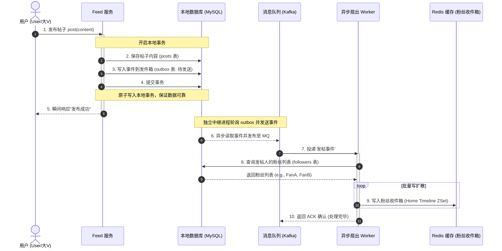
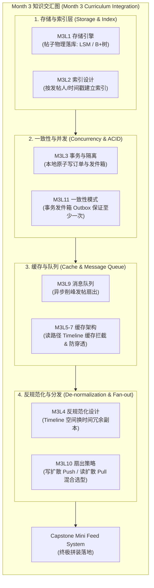

import GlossaryTerm from '@site/src/components/GlossaryTerm';
import GuidedExercise from '@site/src/components/GuidedExercise';
import ResearchNote from '@site/src/components/ResearchNote';
import ChapterMeta from '@site/src/components/ChapterMeta';
import QuizCard from '@site/src/components/QuizCard';
import TradeoffExplorer from '@site/src/components/TradeoffExplorer';

# M3L12 · Capstone：mini feed 系统

<ChapterMeta
  time="约 5–8 小时（整周项目）"
  prereqs={[{label: 'Month 3 全部', href: './overview'}]}
  outcome="一个能关注、发帖（写扩散）、刷时间线（合并排序）的 mini feed 系统，整合本月的缓存、队列、扇出、一致性知识，外加一份 ADR。"
  howToUse="这是 Month 3 的毕业作品。按设计→实现→取舍走一遍，做完 lab 并写 ADR。"
/>

:::tip 把这个月的所有齿轮，拼成一台机器
存储引擎、索引、事务、缓存、队列、扇出、一致性——本月每节课都是一个齿轮。Capstone 让你把它们拼成一个真实的 mini feed：这正是抖音/微博/朋友圈的核心骨架。
:::

## 一、需求与设计（用 Month 2 方法）

- **功能**：关注、发帖、刷时间线（关注的人的帖子按时间倒序）。
- **非功能**：刷 feed（读）远多于发帖（写）→ **读多写少 → 写扩散 + 缓存**（[M3L10](./feed-fanout) / [M3L5](./cache-patterns)）。写扩散虽然能换取极致读性能，但可能会在普通人给大量粉丝发帖时引起严重的 <GlossaryTerm term="Write Amplification" definition="写放大：在系统设计中指一次逻辑写请求，在底层数据库或磁盘中引发了成百上千倍物理写入的现象。在 Feed 写扩散中表现为粉丝数等于写放大倍数。">写放大 (Write Amplification)</GlossaryTerm>。
- **关键取舍**：写扩散（读快、大V写爆）vs 读扩散 vs 混合（[M3L10](./feed-fanout)）。当面临大V粉丝众多时，需要选择混合模式，即普通人写扩散、大V读扩散，并在用户刷新动态时，在业务层内存对多路数据流执行高性能的 <GlossaryTerm term="Merge Sort" definition="归并排序：一种分治算法，在 Feed 系统的读扩散与混合模式中常用于将多个局部有序的帖子流（如各个大V的帖子列表与自身的收件箱）快速合并为一个全局按时间戳倒序排列的时间线流。">归并排序 (Merge Sort)</GlossaryTerm>。

<TradeoffExplorer
  title="Feed 扇出策略取舍"
  dimensions={['读延迟', '写延迟', '存储成本', '大V粉丝处理', '实现复杂度']}
  options={[
    {
      name: '写扩散 (Push / 推模式)',
      scores: [5, 1, 2, 1, 4],
      note: '发帖时复制到所有粉丝收件箱。读极快，但大V发帖时写延迟或存储开销会爆炸。',
      whenToUse: '平均粉丝数较少，且读性能要求极高的系统。'
    },
    {
      name: '读扩散 (Pull / 拉模式)',
      scores: [2, 5, 5, 5, 3],
      note: '刷Timeline时多路归并合并。写极快，但读延迟较高，特别是关注人数多时。',
      whenToUse: '写吞吐量极大，或者写延迟必须极低的场景。'
    },
    {
      name: '混合模式 (Hybrid)',
      scores: [4, 4, 3, 5, 1],
      note: '普通人推模式，大V拉模式。兼顾两者优势，但业务复杂度极高。',
      whenToUse: '如微博、Twitter/X 等存在超级大V且用户体量巨大的社交网络。'
    }
  ]}
/>

```mermaid
flowchart TB
  U["用户发帖"] --> API["Feed 服务"]
  API --> Q["消息队列<br/>M3L9：异步扇出"]
  Q --> FO["扇出 worker"]
  FO --> TL["("各粉丝的时间线收件箱<br/>M3L10 写扩散")"]
  R["用户刷 feed"] --> CACHE["("时间线缓存<br/>M3L5")"]
  CACHE -. "未命中" .-> TL
```



注意它怎么综合本月：发帖走**队列异步扇出**（[M3L9](./message-queues)，发帖快速返回），依靠后台 <GlossaryTerm term="Fan-out Worker" definition="扇出工作协程/线程：负责从消息队列中拉取‘发帖事件’，并遍历发帖者的粉丝列表，将帖子数据（或 ID 指针）批量复制分发至粉丝收件箱的时间线消费进程。">扇出 Worker (Fan-out Worker)</GlossaryTerm> 实现解耦；扇出是**写扩散**（[M3L10](./feed-fanout)）；时间线读走**缓存**（[M3L5-7](./cache-patterns)）；为了防止双写不一致，将待发送事件写入 <GlossaryTerm term="Outbox Table" definition="发件箱表：在 Transactional Outbox 模式中，用于在本地数据库中持久化存储待发布事件记录的辅助表，以保证它与核心业务状态更新在同一个事务中原子 commit。">发件箱表 (Outbox Table)</GlossaryTerm> 中可靠发布（[M3L11](./consistency-patterns)）；整体最终一致（[M2L6](../system-design-bridge/cap-consistency)）。

## 二、动手 Capstone（必做）

打开 `labs/month03/m3l12_feed_capstone/`：

```bash
python labs/month03/m3l12_feed_capstone/test_feed_service.py
```

实现一个 `FeedService`：关注、发帖（写扩散）、刷时间线（按时间倒序 + 限量）。

<GuidedExercise
  title="练习指引：造一个 mini feed"
  goal="把本月知识整合成一个能用的 feed 服务——你作品集里的第二个数据系统项目。"
  hints={[
    'post 时写扩散到所有粉丝的时间线，作者自己也要能看到自己的帖。',
    '每条帖带时间戳；get_timeline 按时间戳倒序返回。',
    'limit 控制只返回最近 N 条（feed 不会一次返回所有历史）。',
    '想想：哪些步骤可以异步（扇出）、哪些要同步（写帖本体）。'
  ]}
  steps={[
    '实现 FeedService：followers（user→粉丝集）、timelines（user→帖子列表）、自增 post_id。',
    'follow(follower, followee)。',
    'post(user, content, ts)：生成帖（含 id/author/ts），写扩散到粉丝 + 作者自己。',
    'get_timeline(user, limit=10)：按 ts 倒序返回前 limit 条。',
    '写测试：粉丝看到、按时间排序、limit 生效、作者看到自己。'
  ]}
  checks={[
    '你的 feed 写扩散正确、时间倒序、limit 生效。',
    '你能指出每个环节对应本月哪一课。',
    '你能说出大V发帖时这个写扩散的问题及改进（混合）。',
    '你能解释为什么发帖适合异步扇出。'
  ]}
/>

## 三、写一份 <GlossaryTerm term="ADR" definition="架构决策记录 (Architecture Decision Record - ADR)：一种捕获关键架构决策及其上下文、备选方案和技术后果的轻量级文档结构。常用于团队协同与架构演进追溯。">ADR (架构决策记录)</GlossaryTerm>

```markdown
# ADR: feed 采用写扩散 + 异步扇出

## 背景
刷 feed（读）远多于发帖（写），要求刷新秒出。

## 选项
1. 读扩散：刷新时实时聚合关注者的帖。写便宜、读慢。
2. 写扩散：发帖推到粉丝收件箱。读快、写放大、大V写爆。
3. 混合：普通写扩散、大V读扩散。

## 决策
默认写扩散 + 队列异步扇出（发帖快速返回）；对大V改读扩散（待粉丝量阈值触发）。

## 后果
- 好：普通用户 feed 秒出；发帖响应快。
- 代价：时间线最终一致（推送有延迟）；混合逻辑复杂。
- 未解决：排序从"按时间"升级到"按相关性"时的重新设计。
```

## 四、自评 Rubric

- [ ] **整合**：feed 用到了扇出（M3L10）、（设想中的）队列异步（M3L9）、缓存（M3L5）。
- [ ] **正确**：写扩散正确、时间倒序、limit 生效。
- [ ] **取舍**：能讲清写/读/混合扩散，以及为什么这么选。
- [ ] **一致性**：能说出时间线为何最终一致、发帖事件如何可靠（outbox，M3L11）。
- [ ] **能解释**：有 ADR，能对着 HLD 讲清一条帖从发布到出现在粉丝 feed 的全程。

## 架构师深潜（Staff+ 视角）

### 1. feed 是本月所有知识的交汇点

一个 feed 系统里：帖子存储要选引擎（[M3L1](./storage-engines)）、按用户/时间建索引（[M3L2](./indexing)）、用反规范化写扩散（[M3L4](./sql-vs-nosql)/[M3L10](./feed-fanout)）、时间线重缓存且防三大难题（[M3L5-7](./cache-patterns)）、扇出走队列（[M3L9](./message-queues)）、事件可靠用发件箱（[M3L11](./consistency-patterns)）、整体最终一致（[M2L6](../system-design-bridge/cap-consistency)）。**它是检验你是否真正掌握数据层的试金石。**



### 2. 从这里通向真实社交系统

你做的 mini feed，正是抖音/微博/朋友圈核心的简化版。后续 [架构案例库](../atlas) 会做 TikTok/YouTube 等，到时回来对照：真实系统在你的骨架上，加了推荐排序、多级缓存、跨区域、A/B 实验等。**但骨架就是你现在做的这个。**

<ResearchNote
  title="feed 系统综合了数据层的全部权衡"
  source="架构案例库 + Feeding Frenzy / Twitter Timelines（见 M3L10）"
  href="./feed-fanout"
  insight="feed/timeline 是工业界研究最透的系统之一，因为它把读写比、反规范化、缓存、扇出、一致性等所有数据层权衡压缩在一个产品里。"
  application="把 mini feed 做出来并能讲清每个取舍，意味着你已经能驾驭数据层。这是 Month 3 的目标，也是迈向 AI 系统（RAG/Agent 同样是数据密集型）的扎实底座。"
/>

### 3. 架构师深问（给自己 60 分钟）

- 把你的 mini feed 当面试题讲一遍：需求→估算→HLD→扇出取舍→一致性→风险。
- 用户量 ×1000、出现千万粉丝大V，你的设计哪里先崩？怎么改成混合扇出？
- feed 要从"按时间"变成"按推荐分数"排序，会怎样冲击你的写扩散设计？

## 恭喜你完成 Month 3

你已经能驾驭数据层：选存储引擎、设计索引、用对事务隔离、玩转缓存、用队列和扇出构建真实系统、并在跨系统间保持最终一致。加上 Month 1-2，你已经能独立设计并实现一个数据密集型系统的核心。

**下一步**：Month 4 进入设计原则与设计模式（从变化点推导模式），把代码层面的可维护性提上来。也常回 [架构案例库](../atlas) 对照真实系统。

## 常见误解

- **"这个 mini feed 系统只是个玩具练习，离真实微博、朋友圈的技术架构差了十万八千里"**: 这种看法极其短视。虽然玩具练习在单机内存中运行，但是它所对应的“写时扇出副本分发”、“按时间戳倒序归并”、“异步队列削峰发帖”和“事务发件箱防双写丢失”的逻辑结构，与新浪微博、Twitter 和微信朋友圈的分布式骨架完全一致。大厂架构无非是在这些核心骨架之上，引入了分布式锁、Redis 分片集群、分库分表持久化、以及海量服务器节点而已。
- **"实现写扩散时，发帖主线程直接用多线程并发向所有粉丝的收件箱推送即可，不需要什么异步队列"**: 极其危险。当粉丝数量达到数万甚至百万时，在发帖主线程中进行如此大规模的并发网络写操作，会导致当前用户的发帖接口耗时飙升至数秒甚至超时失败。更糟糕的是，一旦中途某几个线程写失败，会遗留大量半成功数据，极难实现数据最终一致性。只有通过消息队列将发帖动作剥离，由后台专职的 Fan-out Worker 线程池进行异步流式处理，才是弹性系统的标准解法。
- **"既然写扩散缓存了所有人的 Timeline，那么不管是要按时间排序，还是以后升级为复杂的机器学习推荐排序，写扩散都是最优解"**: 这是巨大的架构误区。写扩散极其依赖“按时间戳自增追加”的顺序存储特性（如 Redis ZSet 顺次插入）。一旦产品要求变更为“基于用户兴趣推荐算法得分的智能推荐排序”，每个粉丝看到的帖子得分会随着时间、行为不断发生动态变化，写扩散无法预测这些动态分值并提前算好，系统必须退化为读扩散（Pull），在用户刷新时动态实时运行打分和多路召回排序。

## 六、章末自测

<QuizCard
  questions={[
    {
      q: '在 Month 3 的 Capstone 项目中，将‘写扩散 (Push)’扇出逻辑放入‘消息队列 (MQ)’中进行异步处理，其核心价值是什么？',
      options: [
        '这消除了所有的存储空间开销，使得帖子完全不需要写入物理数据库中。',
        '这使得发帖操作能够极其迅速地返回成功响应给发帖用户，将后续向成千上万个粉丝 Timeline 复制分发帖子的高延时、高并发写压力从‘主请求线程’中解耦剥离出去，平摊至后台的异步 Worker 线程池中，极大地改善了写路径的用户体验。',
        '消息队列能够确保发帖内容不通过任何内存直接落盘。'
      ],
      answer: 1,
      explain: '异步扇出的价值。写扩散发帖时最耗时的部分是“向数千个粉丝收件箱批量写副本”。如果放在同步线程中，会由于网络分区或数据库写延迟导致接口响应时间极长。通过 MQ 进行异步解耦是社交网络系统的标配。'
    },
    {
      q: '当系统演进为混合扇出策略（大V读扩散，普通人写扩散）时，粉丝的 Timeline 缓存读取逻辑如何实现数据合并以保证呈现的时序正确？',
      options: [
        '直接读取个人收件箱，无需任何大V的数据合并。',
        '系统需要并发拉取‘粉丝自己的 Home Timeline 收件箱（推管道数据）’以及该粉丝‘关注的所有大V的发件箱（拉管道数据）’。由于两部分数据各自在局部内都是按时间有序的，系统在应用层内存中使用高效的归并排序（Merge Sort）算法，进行多路归并及截断分页，最终拼出统一的、无缝的合并时间线。',
        '强制清空所有大V的旧帖子，只保留最新的 1 条。'
      ],
      answer: 1,
      explain: '混合时间线合并归并。混合模式的核心技术点在读路径。它利用了多路归并排序，将预先 Push 的轻量 timeline 和拉回来的大V timeline 合并。由于大V数量一般可控，拉取和归并可以在几十毫秒内完成，兼顾了读写两端的极限性能。'
    },
    {
      q: '如果我们要为 mini feed 系统加入‘事务发件箱 (Transactional Outbox)’以防范由于进程崩溃导致的‘发帖成功但未推送给粉丝’的双写不一致问题，以下步骤正确的是？',
      options: [
        '在发帖的主线程里，首先通过 HTTP 触发向粉丝推送消息，推送完再写入关系型数据库的 Orders 表。',
        '将发帖操作写入‘帖子物理表’和写入‘Outbox 待分发事件表’在同一个数据库本地 ACID 事务中一并提交。然后由一个中继后台进程异步扫描 Outbox 表，将事件推送至 MQ 投递给扇出 Worker。若投递成功，则修改该 Outbox 事件状态为已发送。这利用了本地事务原子性，保证了事件的可靠投递。',
        '不需要数据库事务，直接使用两个独立线程分别并发写入即可。'
      ],
      answer: 1,
      explain: '发件箱与双写防护。使用事务发件箱模式是确保分布式跨系统（MySQL 与 MQ 之间）最终一致性的经典防线。任何没有经过本地事务锁或提交日志捕获（CDC）的跨服务双写都无法在局部故障时实现状态闭环。'
    }
  ]}
/>

## 七、延伸阅读

- [M3L10 feed 与扇出](./feed-fanout)
- [架构案例库](../atlas)
- [Month 3 总览](./overview)