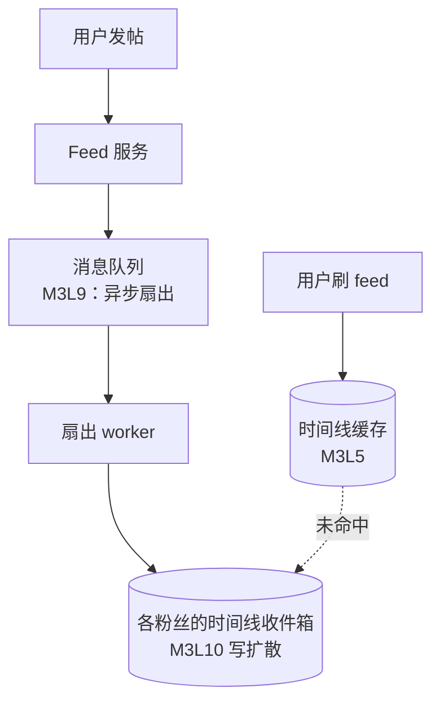

import GlossaryTerm from '@site/src/components/GlossaryTerm';
import GuidedExercise from '@site/src/components/GuidedExercise';
import ResearchNote from '@site/src/components/ResearchNote';
import ChapterMeta from '@site/src/components/ChapterMeta';

# M3L12 · Capstone：mini feed 系统

<ChapterMeta
  time="约 5–8 小时（整周项目）"
  prereqs={[{label: 'Month 3 全部', href: './overview'}]}
  outcome="一个能关注、发帖（写扩散）、刷时间线（合并排序）的 mini feed 系统，整合本月的缓存、队列、扇出、一致性知识，外加一份 ADR。"
  howToUse="这是 Month 3 的毕业作品。按设计→实现→取舍走一遍，做完 lab 并写 ADR。"
/>

:::tip 把这个月的所有齿轮，拼成一台机器
存储引擎、索引、事务、缓存、队列、扇出、一致性——本月每节课都是一个齿轮。Capstone 让你把它们拼成一个真实的 mini feed：这正是抖音/微博/朋友圈的核心骨架。
:::

## 一、需求与设计（用 Month 2 方法）

- **功能**：关注、发帖、刷时间线（关注的人的帖子按时间倒序）。
- **非功能**：刷 feed（读）远多于发帖（写）→ **读多写少 → 写扩散 + 缓存**（[M3L10](./feed-fanout) / [M3L5](./cache-patterns)）。
- **关键取舍**：写扩散（读快、大V写爆）vs 读扩散 vs 混合（[M3L10](./feed-fanout)）。



注意它怎么综合本月：发帖走**队列异步扇出**（[M3L9](./message-queues)，发帖快速返回）；扇出是**写扩散**（[M3L10](./feed-fanout)）；时间线读走**缓存**（[M3L5-7](./cache-patterns)）；扇出事件可靠投递用**发件箱**（[M3L11](./consistency-patterns)）；整体最终一致（[M2L6](../system-design-bridge/cap-consistency)）。

## 二、动手 Capstone（必做）

打开 `labs/month03/m3l12_feed_capstone/`：

```bash
python labs/month03/m3l12_feed_capstone/test_feed_service.py
```

实现一个 `FeedService`：关注、发帖（写扩散）、刷时间线（按时间倒序 + 限量）。

<GuidedExercise
  title="练习指引：造一个 mini feed"
  goal="把本月知识整合成一个能用的 feed 服务——你作品集里的第二个数据系统项目。"
  hints={[
    'post 时写扩散到所有粉丝的时间线，作者自己也要能看到自己的帖。',
    '每条帖带时间戳；get_timeline 按时间戳倒序返回。',
    'limit 控制只返回最近 N 条（feed 不会一次返回所有历史）。',
    '想想：哪些步骤可以异步（扇出）、哪些要同步（写帖本体）。'
  ]}
  steps={[
    '实现 FeedService：followers（user→粉丝集）、timelines（user→帖子列表）、自增 post_id。',
    'follow(follower, followee)。',
    'post(user, content, ts)：生成帖（含 id/author/ts），写扩散到粉丝 + 作者自己。',
    'get_timeline(user, limit=10)：按 ts 倒序返回前 limit 条。',
    '写测试：粉丝看到、按时间排序、limit 生效、作者看到自己。'
  ]}
  checks={[
    '你的 feed 写扩散正确、时间倒序、limit 生效。',
    '你能指出每个环节对应本月哪一课。',
    '你能说出大V发帖时这个写扩散的问题及改进（混合）。',
    '你能解释为什么发帖适合异步扇出。'
  ]}
/>

## 三、写一份 ADR

```markdown
# ADR: feed 采用写扩散 + 异步扇出

## 背景
刷 feed（读）远多于发帖（写），要求刷新秒出。

## 选项
1. 读扩散：刷新时实时聚合关注者的帖。写便宜、读慢。
2. 写扩散：发帖推到粉丝收件箱。读快、写放大、大V写爆。
3. 混合：普通写扩散、大V读扩散。

## 决策
默认写扩散 + 队列异步扇出（发帖快速返回）；对大V改读扩散（待粉丝量阈值触发）。

## 后果
- 好：普通用户 feed 秒出；发帖响应快。
- 代价：时间线最终一致（推送有延迟）；混合逻辑复杂。
- 未解决：排序从"按时间"升级到"按相关性"时的重新设计。
```

## 四、自评 Rubric

- [ ] **整合**：feed 用到了扇出（M3L10）、（设想中的）队列异步（M3L9）、缓存（M3L5）。
- [ ] **正确**：写扩散正确、时间倒序、limit 生效。
- [ ] **取舍**：能讲清写/读/混合扩散，以及为什么这么选。
- [ ] **一致性**：能说出时间线为何最终一致、发帖事件如何可靠（outbox，M3L11）。
- [ ] **能解释**：有 ADR，能对着 HLD 讲清一条帖从发布到出现在粉丝 feed 的全程。

## 架构师深潜（Staff+ 视角）

### 1. feed 是本月所有知识的交汇点

一个 feed 系统里：帖子存储要选引擎（[M3L1](./storage-engines)）、按用户/时间建索引（[M3L2](./indexing)）、用反规范化写扩散（[M3L4](./sql-vs-nosql)/[M3L10](./feed-fanout)）、时间线重缓存且防三大难题（[M3L5-7](./cache-patterns)）、扇出走队列（[M3L9](./message-queues)）、事件可靠用发件箱（[M3L11](./consistency-patterns)）、整体最终一致（[M2L6](../system-design-bridge/cap-consistency)）。**它是检验你是否真正掌握数据层的试金石。**

### 2. 从这里通向真实社交系统

你做的 mini feed，正是抖音/微博/朋友圈核心的简化版。后续 [架构案例库](../atlas) 会做 TikTok/YouTube 等，到时回来对照：真实系统在你的骨架上，加了推荐排序、多级缓存、跨区域、A/B 实验等。**但骨架就是你现在做的这个。**

<ResearchNote
  title="feed 系统综合了数据层的全部权衡"
  source="架构案例库 + Feeding Frenzy / Twitter Timelines（见 M3L10）"
  href="./feed-fanout"
  insight="feed/timeline 是工业界研究最透的系统之一，因为它把读写比、反规范化、缓存、扇出、一致性等所有数据层权衡压缩在一个产品里。"
  application="把 mini feed 做出来并能讲清每个取舍，意味着你已经能驾驭数据层。这是 Month 3 的目标，也是迈向 AI 系统（RAG/Agent 同样是数据密集型）的扎实底座。"
/>

### 3. 架构师深问（给自己 60 分钟）

- 把你的 mini feed 当面试题讲一遍：需求→估算→HLD→扇出取舍→一致性→风险。
- 用户量 ×1000、出现千万粉丝大V，你的设计哪里先崩？怎么改成混合扇出？
- feed 要从"按时间"变成"按推荐分数"排序，会怎样冲击你的写扩散设计？

## 恭喜你完成 Month 3

你已经能驾驭数据层：选存储引擎、设计索引、用对事务隔离、玩转缓存、用队列和扇出构建真实系统、并在跨系统间保持最终一致。加上 Month 1-2，你已经能独立设计并实现一个数据密集型系统的核心。

**下一步**：Month 4 进入设计原则与设计模式（从变化点推导模式），把代码层面的可维护性提上来。也常回 [架构案例库](../atlas) 对照真实系统。

## 延伸阅读

- [M3L10 feed 与扇出](./feed-fanout)
- [架构案例库](../atlas)
- [Month 3 总览](./overview)
