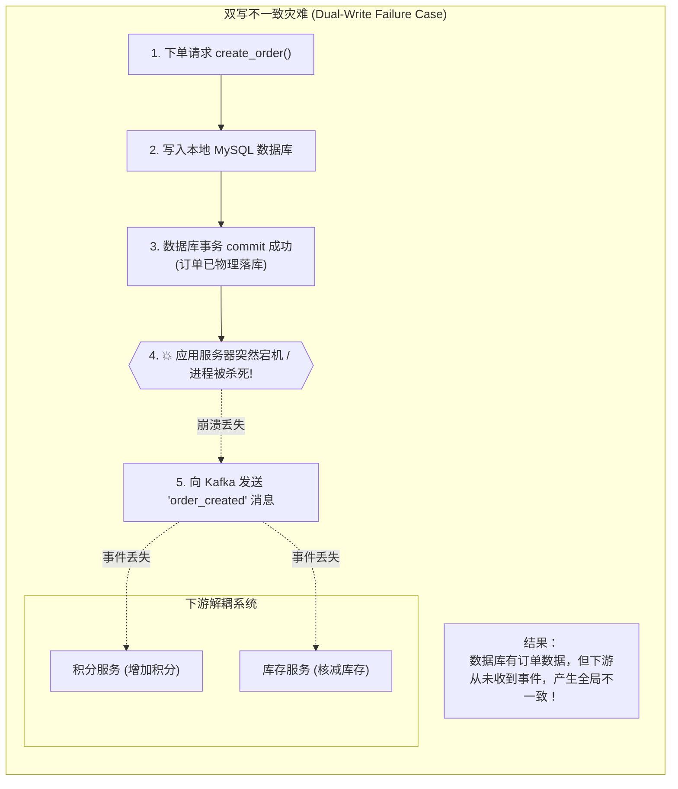
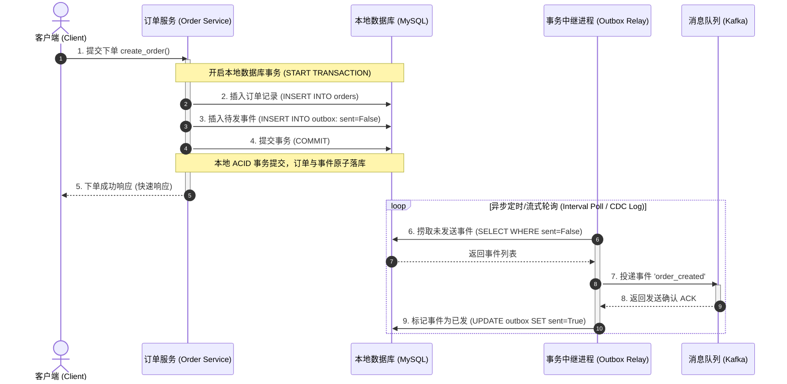
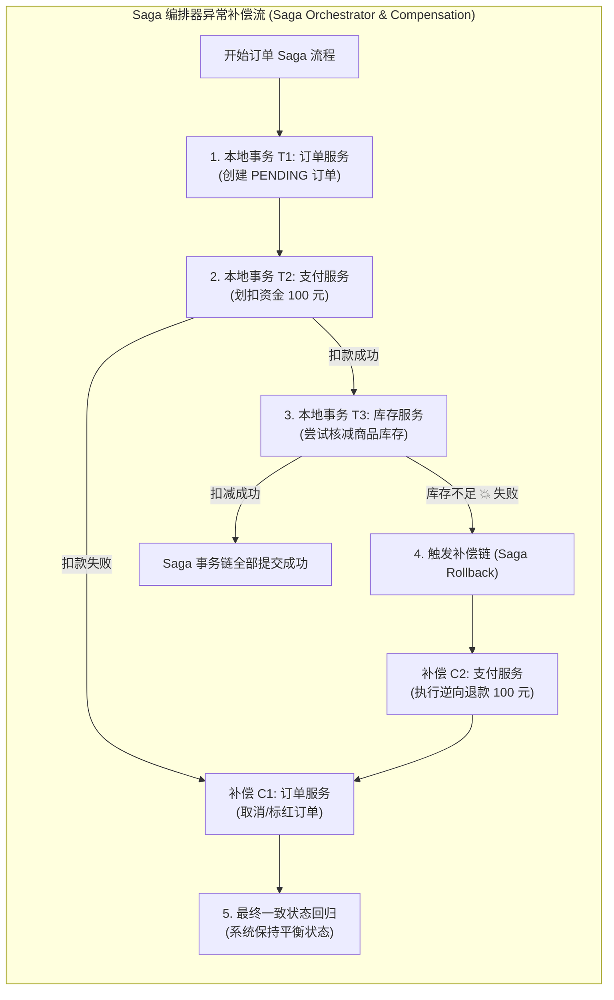

import GlossaryTerm from '@site/src/components/GlossaryTerm';
import GuidedExercise from '@site/src/components/GuidedExercise';
import ResearchNote from '@site/src/components/ResearchNote';
import ChapterMeta from '@site/src/components/ChapterMeta';
import PyRunner from '@site/src/components/PyRunner';
import TradeoffExplorer from '@site/src/components/TradeoffExplorer';
import QuizCard from '@site/src/components/QuizCard';

# M3L11 · 数据一致性模式

<ChapterMeta
  time="约 2 小时"
  prereqs={[{label: 'M2L10 事件驱动', href: '../system-design-bridge/communication-decoupling'}, {label: 'M3L9 消息队列', href: './message-queues'}]}
  outcome="能识别“双写”不一致问题，并用事务发件箱（outbox）、Saga、CDC 在跨系统间实现可靠的最终一致。"
  howToUse="先看“写库 + 发消息”为什么会不一致，再做 lab 实现 outbox 模式。"
/>

:::tip 跨系统的"要么都成、要么都不成"，几乎做不到
一个事务能保证"扣库存 + 记订单"在**一个数据库内**原子完成（[M3L3](./transactions-isolation)）。但"写订单（数据库）+ 发事件（消息队列）"跨了两个系统——没有跨系统的原子事务。怎么保证它们最终一致？这一课给你三个标准模式。
:::

## 一、写完库、发消息前崩了

[M2L10](../system-design-bridge/communication-decoupling) 你用事件驱动解耦：下单后发个 `order_created` 事件。但有个隐患：你**先写订单到数据库，再发事件到队列**——如果写完库、发事件前进程崩了呢？订单有了，事件没发，下游（积分、推荐）永远不知道。这就是<GlossaryTerm term="Dual-Write Problem" definition="双写问题：需要同时更新两个系统（如数据库 + 消息队列），但没有跨系统原子事务，中间崩溃就会导致两者不一致。">双写问题</GlossaryTerm>。在传统架构中，通常会使用基于二阶段提交协议的 <GlossaryTerm term="Distributed Transaction" definition="分布式事务：跨越多个独立网络节点或存储介质以保障全局ACID特性的事务管理机制。由于需要在多个服务间维持锁定与同步协调，容易产生系统单点故障和严重的性能延迟。">分布式事务 (Distributed Transaction)</GlossaryTerm> 解决跨库原子性，但它在微服务高并发下面临巨大的可用性挑战。



## 二、三个核心概念（分层）

### 基础：为什么不能"先写库再发消息"

因为这是两次独立操作，中间任何一步崩溃都不一致。反过来"先发消息再写库"也一样（消息发了但库没写）。**只要是跨系统的两次写，就没有原子性。** 需要专门的模式来兜。

### 进阶：事务发件箱（Transactional Outbox）

最常用的解法：<GlossaryTerm term="Transactional Outbox" definition="事务发件箱：把“要发的事件”作为一条记录，和业务数据写在同一个数据库事务里（原子）。再由一个中继进程读发件箱、发布事件、标记已发。把“双写”变成“一次本地事务 + 可靠中继”。">事务发件箱</GlossaryTerm>。诀窍：把"要发的事件"当成一条记录，**和业务数据写进同一个数据库事务**（原子！）。然后一个独立的**中继（relay）**进程不断读发件箱、发布事件、标记已发。这样"双写"变成了"一次本地原子事务 + 一个可靠中继"——中继在网络抖动时可能会重复发送消息，因此下游的消费方必须是一个 <GlossaryTerm term="Idempotent Consumer" definition="幂等消费者：在接收到重复消息时，能够通过唯一流水号或防重表识别并过滤，确保多次处理同一条消息对系统状态产生的影响与处理一次完全相同。">Idempotent Consumer (幂等消费者)</GlossaryTerm>。



### 深入（选学）：Saga 与 CDC

- <GlossaryTerm term="Saga" definition="Saga：把一个长事务拆成多个本地事务，每步都有对应的“补偿操作”。某步失败就执行已完成步骤的补偿来回滚，达成最终一致（而非跨服务原子）。">Saga</GlossaryTerm>：跨多个服务的长流程（下单→扣款→发货），拆成一串本地事务，每步配一个**补偿操作**；中途失败就执行补偿回滚已完成的步骤。用"补偿"代替"分布式事务"。



- <GlossaryTerm term="CDC" definition="变更数据捕获（Change Data Capture）：直接从数据库的提交日志里捕获数据变更，转成事件流。无需改业务代码就能可靠地把“库的变化”同步给其它系统。">CDC</GlossaryTerm>：直接从数据库的提交日志捕获变更、转成事件——连发件箱都不用写，库一变就自动产生事件（回扣 [M2L10 "日志是统一抽象"](../system-design-bridge/communication-decoupling)）。

<ResearchNote
  title="放弃分布式事务，用补偿换最终一致"
  source="Garcia-Molina & Salem (1987), Sagas；Chris Richardson, Transactional Outbox / Saga（microservices.io）"
  href="https://www.cs.cornell.edu/andru/cs711/2002fa/reading/sagas.pdf"
  insight="Sagas 论文提出：长事务可拆成一串带补偿操作的小事务，避免长时间持锁。结合事务发件箱（把事件和数据原子写入）与 CDC，构成了微服务时代跨系统一致性的标准工具箱。"
  application="在分布式/微服务里，跨服务的强一致 <GlossaryTerm term='Two-Phase Commit' definition='二阶段提交 (2PC)：一种在分布式系统中实现强一致性/原子性的经典协议。分为准备阶段和提交阶段，通过协调者确保所有参与者要么全部提交事务，要么全部回滚。缺点是在准备阶段所有资源会被长期锁定，容易发生单点故障和严重的吞吐率衰退。'>二阶段提交 (2PC)</GlossaryTerm> 代价极高且脆弱。务实的做法是：本地事务 + 发件箱/CDC 可靠发事件 + 消费方幂等 + Saga 补偿——用最终一致换可用性和解耦（回扣 [M2L6 CAP](../system-design-bridge/cap-consistency)）。"
/>

## 三、跟我做一遍：事务发件箱

<PyRunner
  expect="事件可靠发布"
  code={`orders = {}
outbox = []        # 和订单"同一事务"写入的待发事件
published = []     # 已发布到消息队列的事件

def create_order(order_id, data):
    # 关键：订单 + 事件写进"同一个本地事务"（这里用同一函数模拟原子）
    orders[order_id] = data
    outbox.append({"event": ("order_created", order_id), "sent": False})

def relay():
    # 独立中继：发布所有未发送事件，标记已发（可安全重跑）
    for ev in outbox:
        if not ev["sent"]:
            published.append(ev["event"])
            ev["sent"] = True

create_order("o1", {"item": "book"})
print("下单后 outbox:", outbox)        # 订单和事件已原子写入
relay()                               # 中继发布
print("发布的事件:", published)
relay()                               # 再跑一次（中继重启）
print("重跑后发布数:", len(published)) # 仍是 1：标记 sent 防重复
print("事件可靠发布")`}
/>

订单和事件**原子地**一起写进发件箱（绝不会"有订单没事件"）；中继再可靠地发布、标记已发，重跑也不会重复发。**试试**：在 `create_order` 后、`relay` 前模拟崩溃——事件还在 outbox 里，中继重启后照样能发出去，绝不丢。

## 四、动手 Lab（必做）

打开 `labs/month03/m3l11_outbox/`：

```bash
python labs/month03/m3l11_outbox/test_outbox.py
```

实现事务发件箱：业务数据 + 事件原子写入，中继可靠发布且可重跑。

<GuidedExercise
  title="练习指引：实现事务发件箱"
  goal="把“本地事务原子写入事件 + 可靠中继”做成代码——这是跨系统最终一致最常用的模式。"
  hints={[
    'create_order 要同时写 orders 和 outbox（模拟同一本地事务的原子性）。',
    'outbox 每条事件带 sent 标记，初始 False。',
    'relay 只发布 sent=False 的，发布后置 True。',
    'relay 可重复调用而不重复发布（幂等中继）——这是它能容错的关键。'
  ]}
  steps={[
    '实现 OrderService：orders、outbox、published。',
    'create_order(order_id, data)：写 orders + 追加 outbox 事件(sent=False)。',
    'relay()：遍历 outbox，发布未发送的事件到 published，标记 sent。',
    '写测试：下单同时产生事件、relay 发布一次、重复 relay 不重复发、只发未发送的。'
  ]}
  checks={[
    '你能解释双写问题为什么导致不一致。',
    '你的发件箱保证"有订单必有事件"（原子写入）。',
    '你的中继可重跑而不重复发布。',
    '你能说出 Saga 和 CDC 各解决什么。'
  ]}
/>

## 架构师深潜（Staff+ 视角）

### 1. 跨系统一致性怎么选

<TradeoffExplorer
  title="跨系统/跨服务一致性模式"
  dimensions={['一致性强度', '可用性', '实现复杂度', '解耦程度', '适用场景']}
  options={[
    {
      name: '分布式事务（2PC）',
      scores: [5, 1, 2, 1, 2],
      note: '强一致、原子。但要锁定多方、协调者单点、慢且脆，可用性差。',
      whenToUse: '极少数必须强一致且范围可控的场景；大多数情况避免。'
    },
    {
      name: '事务发件箱 + 事件',
      scores: [3, 5, 3, 5, 5],
      note: '本地事务原子写事件 + 可靠中继发布。最终一致、高可用、解耦好。',
      whenToUse: '微服务里"改数据 + 通知别人"的标准做法。'
    },
    {
      name: 'Saga（补偿）',
      scores: [3, 5, 4, 4, 4],
      note: '长流程拆成本地事务 + 补偿。无需分布式锁，但要为每步设计补偿、处理中间态。',
      whenToUse: '跨多服务的长业务流程（下单→支付→发货）。'
    }
  ]}
/>

### 2. 默认最终一致，而不是分布式事务

[M2L6](../system-design-bridge/cap-consistency) 的结论在这里落地：跨系统强一致（2PC）代价极高，现实中**绝大多数选最终一致**——发件箱/CDC 可靠发事件 + 消费方幂等 + Saga 补偿。架构师要习惯"用最终一致 + 补偿"思考跨服务流程，而不是奢望"分布式 ACID"。

### 3. 真实案例：事件驱动系统的可靠基座

凡是用事件驱动（[M2L10](../system-design-bridge/communication-decoupling)）的系统，要可靠就离不开发件箱/CDC——否则"双写不一致"会让事件零星丢失、数据慢慢漂移。这是把 M2L10 的"优雅解耦"变成"生产可靠"的关键一环。

### 4. 架构师深问（给自己 30 分钟）

- 你的下单要"写订单 + 发 order_created 事件"，怎么用发件箱保证不丢事件？中继挂了怎么办？
- 下单流程跨订单、库存、支付三个服务，用 Saga 怎么设计每步的补偿？支付成功但发货失败怎么回滚？
- 用 CDC 代替手写发件箱，有什么好处和代价？（提示：不侵入业务代码，但要接 binlog/WAL。）

## 自检清单

- [ ] 我能解释双写问题及其后果。
- [ ] 我的 lab 发件箱原子写入、中继可重跑不重发。
- [ ] 我能说出 outbox / Saga / CDC 各自的用途。
- [ ] 我理解跨系统默认用最终一致而非分布式事务。

## 常见误解

- **"双写不一致是由于开发编码不够严谨导致的，只要我先发消息，确认成功后再提交本地数据库事务，就绝对安全"**: 依然是严重的逻辑误区。如果先发消息到 MQ 成功，但是在随后的本地数据库 Commit 阶段，因为数据库宕机、磁盘空间满或网络闪断导致事务 Rollback 回滚，这就会造成“消息发了但数据库订单不存在”的单边错乱。任何试图通过手动调整先后顺序来规避双写一致性的做法，都注定会在局部网络/硬件崩溃时露出破绽。
- **"最终一致性只适用于要求不高的边缘系统，金融支付、交易扣款等高要求场景必须使用强一致分布式事务（如 2PC/XA）"**: 认知本末倒置。在工业级海量并发下，二阶段提交（2PC）所带来的全局死锁、资源长时间锁定和事务回滚洪峰，会让系统吞吐骤降，导致几乎所有分布式事务崩溃不可用。哪怕是银行和大型电商平台的支付扣款，底层也全面使用“事务发件箱/CDC + 本地事务 + Saga 补偿机制”保证最终一致性，并用异步对账单兜底纠偏。
- **"事务发件箱模式里的中继（Relay）非常智能，能百分之百保证‘Exactly-once’恰好一次将事件投递给下游"**: 无法实现。在网络分区断开或中继崩溃重启时，中继可能已经把事件成功发到了 MQ 并且 MQ 已经收录，但在中继接收 ACK 确认或更新本地 `sent = True` 的瞬间崩溃了。中继重启后，必然会重复投递同一条事件。事务发件箱只能保证“至少一次（At-least-once）”发布，数据流的干净去重完全依赖消费端实现“幂等消费者（Idempotent Consumer）”。

## 五、章末自测

<QuizCard
  questions={[
    {
      q: '在分布式系统或微服务架构中，‘双写问题 (Dual-Write Problem)’的根本技术成因是什么？',
      options: [
        '因为系统缺乏双写专用的网络光纤，导致发送命令冲突。',
        '因为数据库和外部消息队列（如 Kafka/RabbitMQ）跨越了不同的独立分布式系统，无法在没有极其昂贵且脆弱的分布式事务（如 2PC/XA）协调下，实现本地数据库写入和网络消息投递的原子性（ACID）。一旦在写入数据库成功后、发消息成功前发生应用崩溃，就会导致跨系统状态永久不一致。',
        '因为消息队列在物理上无法忍受与关系型数据库同处一个数据中心。'
      ],
      answer: 1,
      explain: '双写问题的本质。只要涉及到两个独立的、不支持统一本地事务控制的存储介质或网络端点（例如写 MySQL 并发消息，或者写 MySQL 并写 Redis 缓存），就无法以本地单事务原子完成。一旦发生局部故障，数据就会永久分叉不一致。'
    },
    {
      q: '事务发件箱 (Transactional Outbox) 模式是如何通过‘一次本地原子事务’巧妙地解决双写不一致问题的？',
      options: [
        '它直接使用消息队列本身替换掉关系型数据库，实现单一介质写。',
        '它将待发送的‘事件’作为一条记录，和‘业务数据’在同一个数据库连接中写入到同一个本地事务里（分别写入主表和 outbox 表）然后一并 commit。接着由一个独立的中继进程（Relay）以拉取或订阅日志（CDC）的方式读取 outbox 表，将未发送的事件发送给 MQ，发送成功后再更新其状态。由于写主表和写事件是原子本地事务，绝不会出现‘有数据无事件’或‘有事件无数据’的单边状态。',
        '它使用双线程同时发送网络请求，利用网络竞态自然消解差错。'
      ],
      answer: 1,
      explain: '事务发件箱的核心。它把跨系统的双写（写数据库+发消息），转化为了单系统内的事务双写（业务表+事件表），充分利用了成熟单机关系型数据库的 ACID 强一致保证。而中继进程不断扫描发送并处理 sent 状态，通过至少一次投递保证了事件流的可信度。'
    },
    {
      q: '在 Saga 模式中，关于‘补偿操作 (Compensating Transaction)’的正确认识是？',
      options: [
        '补偿操作用于完全物理重置时间，抹除发生过的扣款和发货痕迹。',
        'Saga 不使用传统的分布式锁（2PC）锁定跨服务资源，而是每个子事务都是独立的本地提交。一旦某个后续步骤执行失败，Saga 编排器或协调方会逆序调用前面步骤所对应的‘反向补偿业务操作’（例如：扣减库存对应的补偿是归还库存；扣款对应的补偿是退款），以逻辑撤销的方式最终达成系统的平衡一致。',
        '只要发生 Saga 异常，系统就会强制自动重启所有的服务器。'
      ],
      answer: 1,
      explain: 'Saga 补偿机制。Saga 是一种在业务应用层实现最终一致性的方案。由于之前的每一步小事务都已在各自的微服务中提交并持久化，它们所占用的资源早已释放，所以补偿并不是真正的底层 rollback，而是发起的另一笔“逻辑纠正”操作（如退款、反向抹账）。'
    }
  ]}
/>

## 延伸阅读

- [Sagas（Garcia-Molina & Salem, 1987）](https://www.cs.cornell.edu/andru/cs711/2002fa/reading/sagas.pdf)
- [microservices.io: Transactional Outbox](https://microservices.io/patterns/data/transactional-outbox.html)
- [下一课：Capstone mini feed 系统](./capstone-feed)
