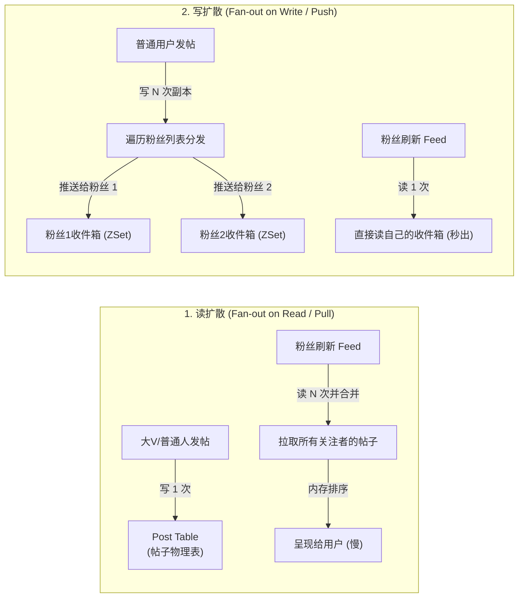
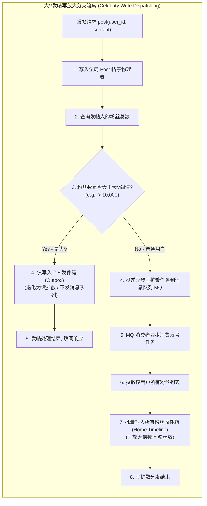
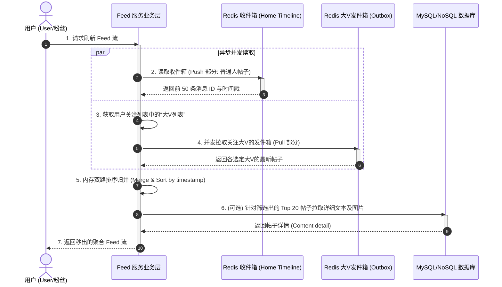

import GlossaryTerm from '@site/src/components/GlossaryTerm';
import GuidedExercise from '@site/src/components/GuidedExercise';
import ResearchNote from '@site/src/components/ResearchNote';
import ChapterMeta from '@site/src/components/ChapterMeta';
import PyRunner from '@site/src/components/PyRunner';
import TradeoffExplorer from '@site/src/components/TradeoffExplorer';
import QuizCard from '@site/src/components/QuizCard';

# M3L10 · feed 与扇出

<ChapterMeta
  time="约 2 小时"
  prereqs={[{label: 'M3L4 反规范化', href: './sql-vs-nosql'}, {label: 'M3L5 缓存', href: './cache-patterns'}]}
  outcome="能设计 feed/时间线系统，讲清写扩散与读扩散的取舍、大V问题，并实现写扩散。"
  howToUse="先理解“刷一下秒出”背后的扩散策略，再做 lab 实现写扩散。"
/>

:::tip 你刷的每一屏 feed，都是反规范化的极致
你关注了 500 个人，一刷新就秒出最新动态。系统怎么在毫秒内把 500 个人的帖子聚合排序好？答案往往是：**提前算好、写时就推到你的收件箱**——这是 [M3L4 反规范化](./sql-vs-nosql) 推到极致的产物。
:::

## 一、500 个关注，怎么毫秒出 feed？

<GlossaryTerm term="Timeline" definition="时间线 (Timeline)：指用户所能查阅的最新动态流（通常按照时间戳倒序排列）。可分为用户发件箱（User Timeline - 存放个人发的帖子）与用户收件箱（Home Timeline - 存放所关注的所有人的聚合帖子）。">时间线 (Timeline)</GlossaryTerm> = 你关注的所有人的最新帖子，按时间排序。最直白的做法：你刷新时，**实时**去查 500 个人各自 the 最新帖、合并排序——但这要 join/扫描很多数据，慢。怎么做到秒出？两种根本不同的策略。



## 二、三个核心概念（分层）

### 基础：读扩散 vs 写扩散

- <GlossaryTerm term="Fan-out on Read" definition="读扩散（pull）：用户刷新时，实时拉取所关注的人的帖子并合并排序。写很便宜（只存一份），但读很重。">读扩散（pull）</GlossaryTerm>：刷新时实时拉取 + 合并。写便宜（帖子只存一份），但读慢。
- <GlossaryTerm term="Fan-out on Write" definition="写扩散（push）：发帖时就把这条帖子推送到每个粉丝的收件箱（timeline）。读极快（直接读自己的收件箱），但写很重（一条帖要写 N 份）。">写扩散（push）</GlossaryTerm>：发帖时就把帖子**推**到每个粉丝的收件箱。读极快（直接读自己的箱子），但写重（一条帖写 N 份）。

绝大多数社交 feed 选**写扩散**——因为刷 feed（读）远多于发帖（写），把成本挪到写时，让读飞快。

### 进阶：大V问题

写扩散有个致命软肋：<GlossaryTerm term="Celebrity Problem" definition="大V问题：一个有千万粉丝的用户发一条帖，写扩散要写千万份收件箱，瞬间产生巨大写放大，甚至卡住系统。">大V问题</GlossaryTerm>。一个千万粉丝的大V发一条帖，写扩散要写**一千万份**——这会引起极其严重的 <GlossaryTerm term="Write Amplification" definition="写放大：在系统设计中指一次逻辑写请求，在底层数据库或磁盘中引发了成百上千倍物理写入的现象。在 Feed 写扩散中表现为粉丝数等于写放大倍数。">写放大 (Write Amplification)</GlossaryTerm> 乃至写吞吐爆炸（回扣 [M3L1](./storage-engines)）。给普通人写扩散没问题，给大V就是灾难。



### 深入（选学）：混合策略

现实方案是<GlossaryTerm term="Hybrid Fan-out" definition="混合扇出：普通用户用写扩散（读快），大V用读扩散（避免写爆）。用户刷新时，把“推来的普通人帖子”和“实时拉的大V帖子”合并。兼顾两者。">混合扇出</GlossaryTerm>：**普通人写扩散**（推到粉丝收件箱），**大V读扩散**（不推，粉丝刷新时实时拉大V的帖子再合并）。这样既让普通 feed 秒出，又避免大V写爆。



<ResearchNote
  title="feed 物化：在写成本和读成本之间选"
  source="Silberstein et al. (2010), Feeding Frenzy: Selectively Materializing Users' Event Feeds（Yahoo）；Twitter Timelines at Scale"
  href="https://dl.acm.org/doi/10.1145/1807167.1807216"
  insight="这篇论文系统分析了 feed 的“物化”权衡：对每个“生产者→消费者”关系，是写时推送（push/物化）还是读时拉取（pull）更划算，取决于该生产者发帖频率和该消费者刷新频率。最优解是按对象混合选择。"
  application="feed 是“读多写少 → 写时反规范化换读性能”的巅峰案例，也是混合策略的经典。Twitter 等正是用“普通人 push、大V pull”的混合方案。理解它，你就掌握了读路径优化的最高形态。"
/>

## 三、跟我做一遍：写扩散

<PyRunner
  expect="粉丝收到推送"
  code={`followers = {}   # user -> set(粉丝)
timeline = {}    # user -> 收件箱（别人推来的帖子）

def follow(follower, followee):
    followers.setdefault(followee, set()).add(follower)

def post(user, content):
    # 写扩散：发帖时推到每个粉丝的收件箱
    for f in followers.get(user, set()):
        timeline.setdefault(f, []).append((user, content))

def get_timeline(user):
    return timeline.get(user, [])

follow("bob", "ada")      # bob 关注 ada
follow("cao", "ada")      # cao 关注 ada
post("ada", "今天天气好")  # ada 发帖 → 推给 bob 和 cao

print("bob 的 feed:", get_timeline("bob"))
print("cao 的 feed:", get_timeline("cao"))
print("没关注的 dan:", get_timeline("dan"))
print("粉丝收到推送" if get_timeline("bob") else "?")`}
/>

ada 发一条帖，**发帖时就推**到了 bob 和 cao 的收件箱——他们刷新时直接读自己的箱子，秒出。代价：ada 如果有一千万粉丝，这一步要写一千万次（大V问题）。**试试**：让 ada 有很多粉丝，想想写扩散这时的写放大有多可怕。

## 四、动手 Lab（必做）

打开 `labs/month03/m3l10_feed/`：

```bash
python labs/month03/m3l10_feed/test_feed.py
```

实现写扩散的 feed：关注、发帖（推送给粉丝）、读时间线。

<GuidedExercise
  title="练习指引：实现写扩散 feed"
  goal="把“写时推送到粉丝收件箱”做成代码，体会读极快、写放大的取舍。"
  hints={[
    'followers[user] 存这个 user 的粉丝集合。',
    'post(user, content)：遍历该 user 的粉丝，把帖子追加到每个粉丝的 timeline。',
    'get_timeline 直接返回用户自己的收件箱（读极快）。',
    '想想：粉丝数 = 这次 post 的写次数，这就是写放大。'
  ]}
  steps={[
    '实现 Feed：followers（user→粉丝集合）、timelines（user→收件箱）。',
    'follow(follower, followee)：记录关注关系。',
    'post(user, content)：写扩散到每个粉丝的 timeline。',
    'get_timeline(user)：返回该用户收件箱。',
    '写测试：粉丝收到、非粉丝收不到、多个粉丝都收到。'
  ]}
  checks={[
    '你能说出读扩散和写扩散的取舍。',
    '你的写扩散正确推送给所有粉丝。',
    '你能解释大V问题及混合策略。',
    '你能把 feed 和 M3L4 的反规范化联系起来。'
  ]}
/>

## 架构师深潜（Staff+ 视角）

### 1. 扇出策略怎么选

<TradeoffExplorer
  title="feed 扇出策略"
  dimensions={['读速度', '写成本', '存储成本', '大V友好', '实现复杂度']}
  options={[
    {
      name: '读扩散（pull）',
      scores: [2, 5, 5, 5, 4],
      note: '帖子只存一份，写便宜、对大V友好。但每次刷新都要实时聚合，读慢。',
      whenToUse: '写多读少、或关注对象多为大V时。'
    },
    {
      name: '写扩散（push）',
      scores: [5, 1, 2, 1, 3],
      note: '发帖时推到所有粉丝收件箱，读极快。但写放大大、大V会写爆。',
      whenToUse: '读远多于写、粉丝量可控（普通用户）。'
    },
    {
      name: '混合（普通 push + 大V pull）',
      scores: [5, 3, 3, 5, 1],
      note: '普通人写扩散、大V读扩散，刷新时合并。综合最优，但实现最复杂。',
      whenToUse: '大型社交平台的现实选择（Twitter/微博量级）。'
    }
  ]}
/>

### 2. feed 是"读多写少 + 反规范化"的巅峰

回看这条主线：[L7 按查询建模](../foundations/data-modeling) → [M3L4 反规范化](./sql-vs-nosql) → feed 写扩散。**它们是同一个思想在不同尺度的体现：为高频的读，提前在写时把数据组织好（哪怕冗余、哪怕写很重）。** 理解这条线，你就掌握了读路径优化的精髓。

### 3. 真实案例：每个社交 App 都在解扇出

Twitter/微博/朋友圈/抖音的 feed，背后都是扇出策略 + 缓存 + 排序/推荐。它综合了本月几乎所有内容：反规范化（M3L4）、缓存（M3L5-7）、队列（写扩散常用队列异步推送，M3L9）。**做完这一课，你已经能设计一个真实社交 feed 的核心了**——这正是下一课 Capstone。

### 4. 架构师深问（给自己 30 分钟）

- 写扩散用队列异步推送（M3L9）有什么好处？（提示：发帖快速返回，推送在后台。）
- 大V发帖混合策略下，粉丝刷新时怎么"合并推来的 + 拉来的大V帖子"并按时间排序？
- feed 要支持"按相关性排序"（不只时间），这会怎么改变你的扇出/存储设计？

## 自检清单

- [ ] 我能区分读扩散和写扩散及各自取舍。
- [ ] 我的 lab 写扩散正确推送给粉丝。
- [ ] 我能解释大V问题和混合策略。
- [ ] 我能把 feed 和反规范化主线联系起来。

## 常见误解

- **"设计 Feed 系统只需要用 SQL 写一个 JOIN 关注表和帖子表并 ORDER BY timestamp 的查询即可，很简单"**: 这是极小规模开发时的偏见。在分布式高并发的真实社交应用中，用户关注数往往成百上千，直接使用实时 JOIN 进行读扩散，会对数据库引擎造成巨大的随机 I/O 与 CPU 压力。在高并发 QPS 面前，数据库会瞬间发生死锁或连接耗尽，根本无法满足毫秒级刷出的性能指标。
- **"既然写扩散性能好，那就无脑对所有用户使用写扩散，这样架构最统一"**: 这是典型的大V灾难（Celebrity Problem）。当微博上有千万级甚至亿级粉丝的超级大V发帖时，如果采用纯写扩散，发帖操作会在后台产生千万次以上的批量 ZSet/NoSQL 写入。这种“写放大”会瞬间耗尽 Redis 内存带宽、造成消息队列严重积压甚至消费者线程池 OOM，导致大量普通用户的发帖投递被阻塞数分钟以上。
- **"混合扇出（普通 push + 大V pull）实现十分简单，直接对两部分数据查出来然后用 concat 拼接即可"**: 忽视了时间线正确归并算法。普通用户的收件箱一般限制保存 500 到 1000 条，但用户关注了多个大V时，大V们的帖子穿插其间。当用户刷新 Timeline 时，必须将“收件箱中的有序普通帖”与“拉取的多个大V时间序列”进行多路归并排序（Merge Sort）算法，并在内存中进行高效分页截断（Pagination），才能避免数据错乱和老帖复现。

## 五、章末自测

<QuizCard
  questions={[
    {
      q: '在设计高并发社交 Feed 系统时，为什么‘写扩散 (Push)’模式能够提供极低的读延迟，它的核心牺牲是什么？',
      options: [
        '写扩散消除了所有的存储消耗，它把帖子缓存在客户端浏览器中。',
        '写扩散本质上是反规范化空间换时间的巅峰应用，将耗时的多表聚合在写入时异步算好投递到粉丝的收件箱（Timeline），从而换取极佳的读取性能；其核心牺牲是巨大的存储空间冗余（帖子副本存了 N 份）以及在发帖人粉丝数极其庞大时面临毁灭性的写放大与投递延迟。',
        '写扩散牺牲了读取的实时性，刷新需要长达 1 小时才能拉取。'
      ],
      answer: 1,
      explain: '写扩散的取舍。在社交应用中，用户刷 Feed 的次数（读）远远大于发微博发帖的次数（写），读写比往往是 100:1 甚至更高。写扩散把每次读取时的“多路拉取与排序计算”平摊到发帖时的“异步扇出写”，让读只读自己的收件箱（单表极速读），极大提升了读吞吐。'
    },
    {
      q: '‘大V问题 (Celebrity Problem)’是单纯写扩散系统的噩梦。混合扇出 (Hybrid Fan-out) 是如何完美平衡大V和普通用户的数据流向的？',
      options: [
        '强制大V付费才能发帖，或者限制大V的粉丝数量在 1 万人以内。',
        '普通用户发帖时采用写扩散（Push）直接推送给其粉丝的收件箱；大V发帖时则退化为读扩散（Pull），仅写入大V个人的发件箱。当粉丝刷新 Feed 时，系统从‘自己的收件箱’中拉取普通用户的推送，并并发去拉取所关注大V的最新帖子，最终在内存中快速合并并按时间排序。这避开了大V发帖时的写洪峰，又保障了读性能。',
        '所有的读写全部强制走读扩散，放弃任何写扩散。'
      ],
      answer: 1,
      explain: '混合扇出机制。混合扇出通过关注列表的“大V标记”来分支流向。普通人粉丝少，Push 没有任何并发问题；大V粉丝多，只记录单份。刷新时拉取这两条管道并利用高性能的时间线归并（Merge Sort）对两部分数据在应用内存中快速拼接，是新浪微博和 Twitter 的核心架构。'
    },
    {
      q: '当使用 Redis ZSet 存储用户的收件箱（Timeline）时，为了防范内存随时间无限增长，架构师通常采取什么截断策略？',
      options: [
        '对用户的 ZSet 限制最大长度（如仅保留最新的 500 条），其余历史老数据定期修剪（Trim）出内存。因为用户极少会向下滚动翻页到几千条前的历史 Feed，查看历史动态时可走分库分表的 MySQL 归档查询。',
        '强制当用户满 500 条后自动注销其账号。',
        'ZSet 的大小由网络带宽决定，不需要做任何限制。'
      ],
      answer: 0,
      explain: 'Timeline 的 Trim 策略。用户的注意力是极度有限的（通常只看最新几屏）。如果对上亿用户的 Timeline ZSet 进行全量无限期存储，Redis 内存将瞬间被冷数据耗尽。通过限制 ZSet 容量并利用 Redis 的 LTRIM/ZREMRANGEBYRANK 命令定时修剪，能够使 Redis 内存处于极为平稳的状态。'
    }
  ]}
/>

## 延伸阅读

- [Feeding Frenzy（Yahoo, 2010）](https://dl.acm.org/doi/10.1145/1807167.1807216)
- [Twitter: Timelines at Scale](https://www.infoq.com/presentations/Twitter-Timeline-Scalability/)
- [下一课：Capstone mini feed 系统](./capstone-feed)
