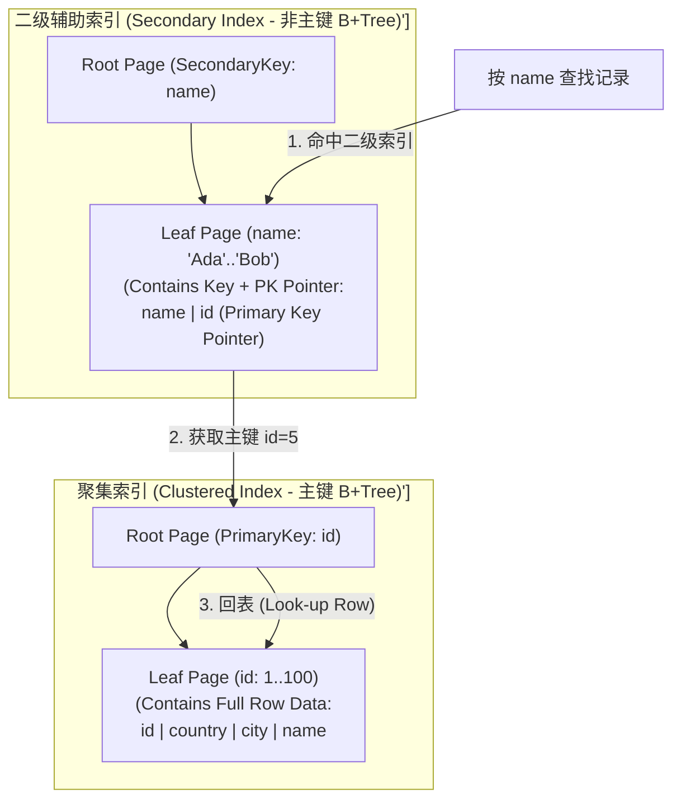
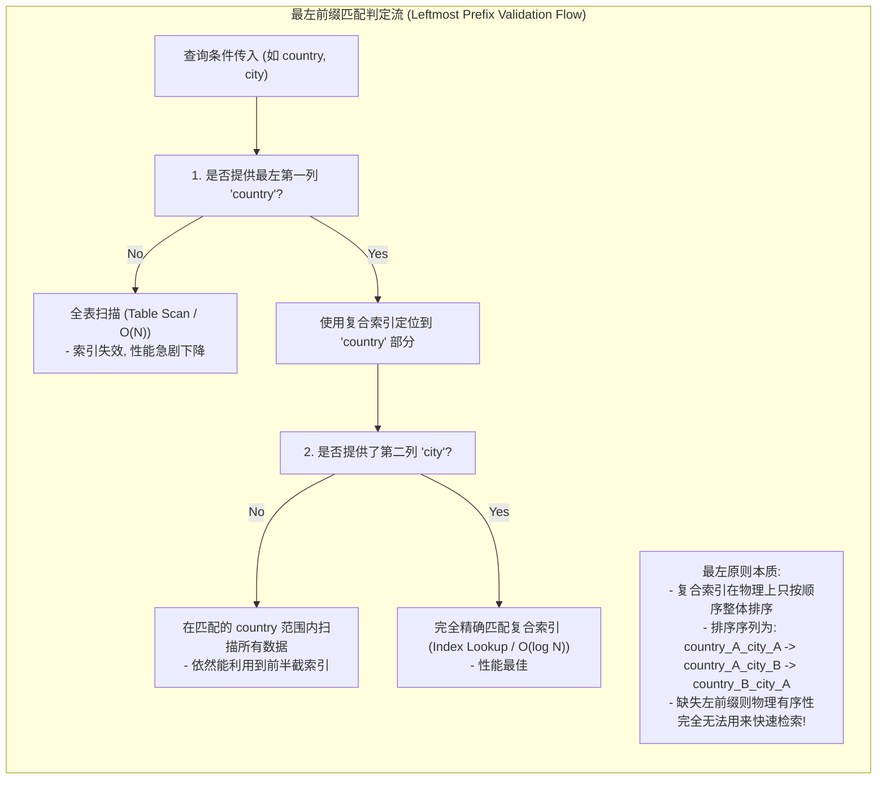
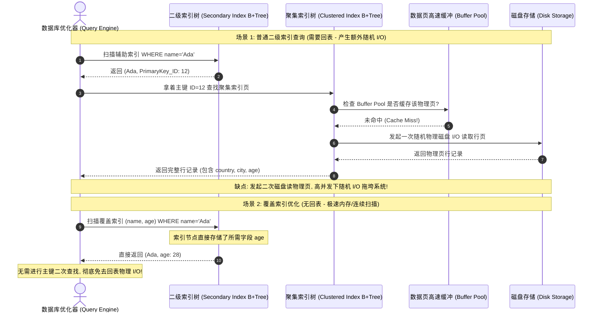

import GlossaryTerm from '@site/src/components/GlossaryTerm';
import GuidedExercise from '@site/src/components/GuidedExercise';
import ResearchNote from '@site/src/components/ResearchNote';
import ChapterMeta from '@site/src/components/ChapterMeta';
import PyRunner from '@site/src/components/PyRunner';
import TradeoffExplorer from '@site/src/components/TradeoffExplorer';
import QuizCard from '@site/src/components/QuizCard';

# M3L2 · 索引深入

<ChapterMeta
  time="约 1.5–2 小时"
  prereqs={[{label: 'L7 索引初识', href: '../foundations/data-modeling'}, {label: 'M3L1 存储引擎', href: './storage-engines'}]}
  outcome="能设计复合索引并理解最左前缀规则、用覆盖索引避免回表，并判断什么时候加索引反而有害。"
  howToUse="先理解索引的代价，再跑复合索引“最左前缀”的 demo，最后做 lab。"
/>

:::tip 索引不是"加了就快"的魔法
索引能把全表扫描（[L7](../foundations/data-modeling)）变成秒查，但它有代价：拖慢写、占空间，而且**加错了顺序，查询根本用不上它**。这一课教你设计对的索引，而不是盲目加。
:::

## 一、加了索引，为什么还是慢？

你给 `(country, city)` 建了复合索引。`WHERE country='US' AND city='NYC'` 飞快；但 `WHERE city='NYC'`（不带 country）却走了全表扫描——**索引没命中**。同时你发现写入变慢了。索引不是越多越好，关键是**建对**。



## 二、三个核心概念（分层）

### 基础：索引是什么、有什么代价

<GlossaryTerm term="Index" definition="索引：一个额外的、有序的查找结构（多为 B-tree），让按某列查找从 O(n) 全表扫描降到 O(log n)。代价是每次写都要同步更新它、额外占空间。">索引</GlossaryTerm> 是一份"额外维护的有序查找表"。好处是查得快，这通常通过主键上的 <GlossaryTerm term="Clustered Index" definition="聚集索引：索引结构中的叶子节点直接存放对应表行的实际物理数据。一个表只能有一个聚集索引（通常为主键）。">聚集索引</GlossaryTerm> 或非主键列上的 <GlossaryTerm term="Secondary Index" definition="二级索引：又称辅助索引。其叶子节点不存储实际行数据，而是存放索引键值与对应的聚集索引主键值。非主键查询必须通过二级索引找到主键，再到聚集索引回表查数据。">二级索引</GlossaryTerm> 来实现。代价是：**每次写都要同步更新索引（写放大，回扣 [M3L1](./storage-engines)）、额外占空间**。所以索引要为高频查询而加，不是越多越好。

### 进阶：复合索引的最左前缀规则

<GlossaryTerm term="Composite Index" definition="复合索引：在多个列上按顺序建立的索引（如 (country, city)）。查询只能利用它的最左前缀——必须从第一列开始连续匹配。">复合索引</GlossaryTerm> `(country, city)` 像电话簿先按国家、再按城市排序。你能高效地查"某国"或"某国某市"，但**不能**只按"某市"高效查（因为没先定位国家）——这就是<GlossaryTerm term="Leftmost Prefix Rule" definition="最左前缀规则：复合索引只能被从最左列开始连续的查询条件利用。(a,b,c) 索引可服务 a、a+b、a+b+c，但不能服务 b 或 c 单独的查询。">最左前缀规则</GlossaryTerm>。索引列的顺序，直接决定哪些查询能加速。



### 深入（选学）：覆盖索引避免回表

普通索引在进行 <GlossaryTerm term="Index Scan" definition="索引扫描：数据库查询引擎遍历索引树结构查找匹配数据的过程。分为全索引扫描（扫描整棵索引树）与索引范围扫描（利用索引有序性进行边界查找）。">索引扫描</GlossaryTerm> 命中后，还要拿主键**回表**去取其它列。如果索引本身就包含了查询要的所有列，就能<GlossaryTerm term="Covering Index" definition="覆盖索引：索引本身包含了查询所需的全部列，于是查到索引就能直接返回结果，无需回表读主数据。是高频查询的强力优化。">覆盖（covering）</GlossaryTerm>——直接从索引返回，不回表，快得多。代价是索引更大。



<ResearchNote
  title="B-tree：让磁盘上的有序查找高效"
  source="Bayer & McCreight (1972), Organization and Maintenance of Large Ordered Indices"
  href="https://dl.acm.org/doi/10.1145/1734663.1734671"
  insight="B-tree（及其变体 B+tree）用浅而宽的有序树，让一次查找只需少数几次磁盘访问，并保持有序以支持范围查询。它是几乎所有关系数据库索引的基础结构，五十年屹立不倒。"
  application="理解索引是“有序的 B-tree”，就能推出它的全部行为：为什么前缀匹配快、为什么范围查询能用索引、为什么写要付出维护代价。设计索引时，脑子里要有这棵有序的树。"
/>

## 三、跟我做一遍：复合索引的最左前缀

<PyRunner
  expect="city 单独查用不上索引"
  code={`rows = [
    {"country": "US", "city": "NYC", "name": "Ada"},
    {"country": "US", "city": "LA",  "name": "Bob"},
    {"country": "CN", "city": "BJ",  "name": "Cao"},
]

# 复合索引 (country, city)：按这个顺序排序
index = sorted(rows, key=lambda r: (r["country"], r["city"]))

def query(conds):
    # 最左前缀：必须从 country 开始连续匹配
    cols = ["country", "city"]
    prefix = []
    for c in cols:
        if c in conds:
            prefix.append(conds[c])
        else:
            break
    if not prefix:                       # 第一列没给 → 索引用不上
        return None
    return [r for r in index if tuple(r[c] for c in cols[:len(prefix)]) == tuple(prefix)]

print("country=US:", query({"country": "US"}))            # 用上索引
print("country=US,city=NYC:", query({"city": "NYC", "country": "US"}))  # 用上
print("只 city=NYC:", query({"city": "NYC"}))              # None：用不上
print("city 单独查用不上索引")`}
/>

看最后一行：只给 `city` 不给 `country`，复合索引 `(country, city)` **用不上**——只能全表扫描。**试试**：如果你的高频查询就是"按 city"，索引该怎么建？（提示：把 city 放最左，或单独给 city 建索引。）

## 四、动手 Lab（必做）

打开 `labs/month03/m3l2_index/`：

```bash
python labs/month03/m3l2_index/test_index.py
```

实现复合索引的最左前缀查询，以及"是否覆盖"的判断。

<GuidedExercise
  title="练习指引：复合索引与最左前缀"
  goal="把“索引列顺序决定能加速哪些查询”变成代码直觉——这是 SQL 调优最常见的考点。"
  hints={[
    '索引按列顺序排序；查询只能用"从第一列开始连续提供"的条件。',
    '第一列没给 → 返回 None（表示索引用不上，得全表扫描）。',
    '覆盖判断：查询要的列是否都在索引列里（含被索引列）。',
    '想想：(a,b) 和 (b,a) 两个索引能服务的查询完全不同。'
  ]}
  steps={[
    '实现 CompositeIndex(columns)，build(rows) 按 columns 顺序排序存储。',
    'query(conds)：求最左前缀；前缀为空返回 None；否则返回匹配前缀的行。',
    'is_covering(needed_cols)：needed_cols 是否都包含在 columns 里。',
    '写测试：前缀命中、跳列用不上（None）、覆盖判断正确。'
  ]}
  checks={[
    '你能解释最左前缀规则。',
    '你的 query 在缺最左列时正确返回 None。',
    '你能说出覆盖索引为什么避免回表、更快。',
    '你能说出索引的代价（写放大、空间）。'
  ]}
/>

## 架构师深潜（Staff+ 视角）

### 1. 索引设计是"为查询服务"

回扣 [L7：先看查询，再建模](../foundations/data-modeling)。索引同理：**列出你的高频查询，再据此设计索引（列顺序、是否覆盖）**，而不是给每列都加索引。每个多余索引都在拖慢写、占空间。

### 2. 加不加索引、加什么索引

<TradeoffExplorer
  title="索引决策"
  dimensions={['读加速', '写代价', '空间代价', '维护复杂度', '适用场景']}
  options={[
    {
      name: '不加索引（全表扫描）',
      scores: [1, 5, 5, 5, 2],
      note: '写最快、不占额外空间。但读是 O(n)，数据一多就崩。',
      whenToUse: '小表、或写极多读极少的表。'
    },
    {
      name: '单列/复合索引',
      scores: [4, 3, 3, 3, 4],
      note: '为高频查询加速。复合索引要按查询设计列顺序（最左前缀）。',
      whenToUse: '高频按某些列过滤/排序的查询。'
    },
    {
      name: '覆盖索引',
      scores: [5, 2, 2, 3, 4],
      note: '索引含查询所需全部列，免回表，最快。但索引更大、写更慢。',
      whenToUse: '极高频、且返回列固定的关键查询。'
    }
  ]}
/>

### 3. 真实案例：慢查询的头号原因

线上"某接口突然变慢"的最常见根因之一，就是**查询没命中索引**（最左前缀用错、或对索引列用了函数/类型转换）。架构师要会看执行计划（EXPLAIN）判断是否走了索引——这是数据层排障的基本功（回扣 [L12 可观察性](../foundations/observability)）。

### 4. 架构师深问（给自己 30 分钟）

- 你的查询有 `WHERE user_id=? AND created_at>?` 和 `WHERE created_at>?` 两种，索引该怎么建？
- 给一个有 10 个查询的表，你怎么用最少的索引覆盖最多的高频查询？
- 为什么"给每一列都加索引"是错的？（从写放大和空间算账。）

## 自检清单

- [ ] 我能解释索引的好处和代价。
- [ ] 我的 lab 正确实现了最左前缀和覆盖判断。
- [ ] 我能为给定的高频查询设计复合索引的列顺序。
- [ ] 我知道为什么索引不是越多越好。

## 常见误解

- **"加了索引就一定快"**: 索引只有在查询模式与其物理排序机制完全契合时才生效。如果建了 `(country, city)` 索引，却单独查询 `city`（违反最左前缀），或者在 `country` 上使用了 SQL 函数计算（如 `UPPER(country)`）或隐式类型转换，索引将完全失效，数据库依然要老老实实做全表扫描。
- **"索引建得越多越好"**: 索引是经典的“空间与写延迟换读性能”的赌博。每次进行 `INSERT`/`UPDATE`/`DELETE`，数据库都需要以串行锁或页分裂的代价同步重构所有相关的索引树。如果索引太多，写放大将极其严重，极易产生磁盘 I/O 饱减导致整体瘫痪。
- **"只要 SQL 查询能用上索引，怎么建都一样"**: 普通辅助索引（二级索引）在查询非索引列时，会产生极高成本的“回表”。在高并发场景下，应根据查询字段尽可能配置“覆盖索引”，直接在二级索引树的叶子节点返回数据，从而免去第二次物理磁盘随机寻址的瓶颈。

## 五、章末自测

<QuizCard
  questions={[
    {
      q: '在创建了复合索引 (A, B, C) 后，以下哪个查询条件能够完全且最高效地匹配并利用该索引？',
      options: [
        'WHERE B = 10 AND C = \'US\'',
        'WHERE A = 10 AND B > 5 AND C = \'US\' (只有 A 和 B 上的匹配会完全命中该索引的快速定位，由于 B 上是范围查询，C 上的精确查找将退化为过滤)',
        'WHERE C = \'US\''
      ],
      answer: 1,
      explain: '根据最左前缀规则，匹配必须从最左列 A 开始连续匹配。当遇到范围查询（如 >, <, LIKE）时，索引在此列之后的列 C 将无法用于二分快速定位（定位顺序断开），退化为线性扫描过滤。'
    },
    {
      q: '‘回表’ (Look-up Table Row) 是数据库查询调优时经常力求避免的开销。关于回表的概念，以下哪个理解是正确的？',
      options: [
        '回表是指数据库在检测到死锁后，自动将事务回滚并重新加载表的动作。',
        '回表是指通过二级索引（辅助索引）查找到对应记录的主键 ID 后，仍需使用该主键 ID 再次去聚集索引（主键索引）中检索该行其他所需列的数据的物理磁盘 I/O 过程。使用覆盖索引直接包含所有被查列可以免去这步开销。',
        '回表是指在内存不足时，将磁盘上的临时表写回到内存的机制。'
      ],
      answer: 1,
      explain: '二级索引叶子节点仅存储索引键和主键值。如果查询需要其他字段，就必须通过主键二次寻址聚集索引（回表）。在高并发读场景下，回表产生大量磁盘随机 I/O，是核心瓶颈之一。通过建立覆盖索引（Covering Index）可彻底规避回表。'
    },
    {
      q: '既然索引能把查询速度从 O(N) 降到 O(log N)，为什么架构师不主张给数据库表的每一列都分别建立单列索引？',
      options: [
        '因为给所有列建索引会导致数据库完全丢失 ACID 事务保障。',
        '① 索引是有物理存储成本的，多列索引会导致表空间暴增；② 每次写入、修改、删除操作（INSERT/UPDATE/DELETE）都需要同步更新与之相关的全部索引，带来巨大的写放大和性能滑坡；③ 数据库优化器在面对过多索引时，解析生成执行计划的开销也会急剧增加。',
        '因为操作系统无法同时打开超过 3 个索引文件。'
      ],
      answer: 1,
      explain: 'Index maintenance cost. 索引是读性能与写性能的博弈。盲目堆砌索引会导致写操作耗尽物理磁盘 I/O，造成服务整体瘫痪。应围绕高频查询模式进行精确的复合索引和覆盖索引设计。'
    }
  ]}
/>

## 延伸阅读

- [Use The Index, Luke!（SQL 索引实战）](https://use-the-index-luke.com/)
- [Bayer & McCreight, B-tree（1972）](https://dl.acm.org/doi/10.1145/1734663.1734671)
- [下一课：事务与隔离级别](./transactions-isolation)