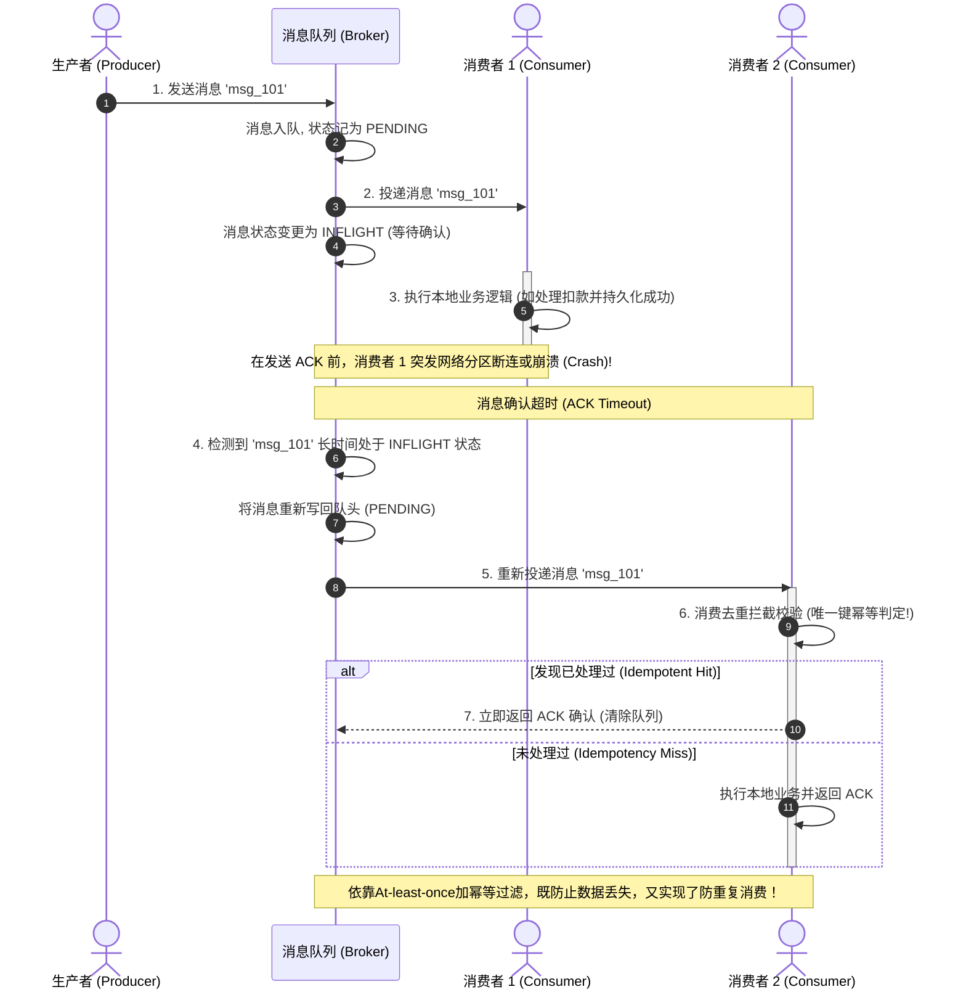
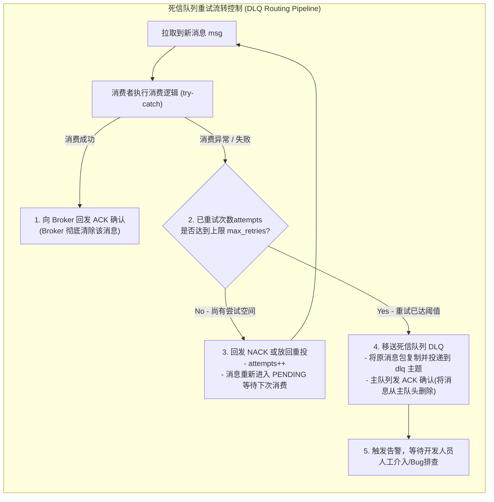

import GlossaryTerm from '@site/src/components/GlossaryTerm';
import GuidedExercise from '@site/src/components/GuidedExercise';
import ResearchNote from '@site/src/components/ResearchNote';
import ChapterMeta from '@site/src/components/ChapterMeta';
import PyRunner from '@site/src/components/PyRunner';
import TradeoffExplorer from '@site/src/components/TradeoffExplorer';
import QuizCard from '@site/src/components/QuizCard';

# M3L9 · 消息队列深入

<ChapterMeta
  time="约 2 小时"
  prereqs={[{label: 'L11 队列与背压', href: '../foundations/sync-async-timeout'}, {label: 'M2L10 通信与解耦', href: '../system-design-bridge/communication-decoupling'}]}
  outcome="能讲清消息队列的 ack 机制、至少一次投递、消费者组并行、死信队列，并实现一个带重试和 DLQ 的队列。"
  howToUse="先理解“没 ack 就重投”的至少一次语义，再做 lab 实现 ack/nack/DLQ。"
/>

:::tip 队列的难点不在"存"，在"可靠地消费"
[L11](../foundations/sync-async-timeout) 你学了队列削峰、[M2L10](../system-design-bridge/communication-decoupling) 学了用它解耦。但真正的难点是：消费者处理到一半挂了怎么办？消息会丢吗？会被处理两次吗？一条永远处理失败的"毒消息"会不会卡死整个队列？这一课回答这些。
:::

## 一、消费者挂了，消息会怎样？

生产者把消息放进队列，消费者取出处理。在企业架构中，消息队列大体分为两类：一是基于传统消息代理的 <GlossaryTerm term="Broker-based MQ" definition="代理型消息队列：以 RabbitMQ 或 ActiveMQ 为代表。由 Broker 负责推送消息给消费者，并跟踪每条消息的 ACK 状态，消息一旦被消费确认立即从物理队列中擦除，水位低，但无法重放。">Broker-based MQ (代理型消息队列)</GlossaryTerm>，二是基于追加日志流的 <GlossaryTerm term="Log-based MQ" definition="日志型消息队列：以 Apache Kafka 或 Pulsar 为代表。消息以只读追加日志（Log）物理持久化在磁盘上，消费端以 Pull 形式拉取，消费进度仅靠移动 Offset 偏置指针标记。消息不会因消费而被物理删除，支持历史事件随意重放。">Log-based MQ (日志型消息队列)</GlossaryTerm>。

但无论哪种模型，如果消费者取出后、还没处理完就崩了——这条消息丢了吗？答案取决于<GlossaryTerm term="Acknowledgement" definition="确认（ack）：消费者处理成功后给队列发的信号。队列收到 ack 才删除消息；没收到就在超时后重新投递，保证消息不丢。">ack 机制</GlossaryTerm>：队列**只有收到 ack 才删消息**，否则会重投。

```mermaid
flowchart LR
  subgraph BrokerModel["1. 代理型队列 (Broker-based: RabbitMQ)"]
    direction TB
    P1["生产者 (Producer)"] -->|Push| Queue1["Broker 队列<br/>(内存/磁盘)"]
    Queue1 -->|Push| C1["消费者 1 (Consumer)"]
    C1 -->|Ack| Queue1
    NoteB["确认后物理删除:<br/>- 消费成功即刻从队列清除<br/>- 水位极低<br/>- 无法重复消费历史"]
  end

  subgraph LogModel["2. 日志型队列 (Log-based: Kafka Partition)"]
    direction TB
    P2["生产者 (Producer)"] -->|Append Write| Log2["只读追加物理日志 (Log)<br/>[msg0"] [msg1] [msg2] [msg3]"]
    C2["消费者 (Consumer)"] -->|Pull & Move Offset| Log2
    NoteL["Offset 逻辑移动:<br/>- 消息只读追加, 物理不删<br/>- 消费进度仅移动指针<br/>- 随时支持重置 Offset 重放"]
  end
```

## 二、三个核心概念（分层）

### 基础：ack 与至少一次

消费流程：取出消息 → 处理 → **成功后 ack** → 队列才删除。如果消费者没 ack（崩了/超时），队列会**重新投递**给另一个消费者。这就保证了<GlossaryTerm term="At-least-once" definition="至少一次：消息保证被处理至少一次（靠没 ack 就重投），本意是防止数据丢失，但可能在消费者执行成功但网络确认丢失时发生消息重复。配合幂等消费即可达到“效果上一次”。">至少一次</GlossaryTerm>投递——不丢，但可能重复（所以消费要[幂等，L6](../foundations/idempotency)）。



### 进阶：消费者组与顺序

- <GlossaryTerm term="Consumer Group" definition="消费者组：多个消费者组成一组分担同一队列/主题的消息，每条消息只被组内一个消费者处理，从而水平扩展消费能力。">消费者组</GlossaryTerm>：多个消费者分担消息，每条只被一个处理 → 水平扩展消费（回扣 [L5 无状态](../foundations/state-and-storage)）。
- **顺序**：全局严格有序很难且慢。常见折中是<GlossaryTerm term="Partition" definition="分区：把一个主题切成多个分区，每个分区内部有序、可被独立消费。常按 key 哈希分区，保证“同一 key 的消息有序”。">分区</GlossaryTerm>——同一分区（按 key）内有序，分区之间并行。比如"同一用户的消息有序"就够了，不需要全局有序。

### 深入（选学）：死信队列与毒消息

一条永远处理失败的<GlossaryTerm term="Poison Message" definition="毒消息：因格式错误或 bug 而永远处理失败的消息。若无限重试会卡住队列、浪费资源。">毒消息</GlossaryTerm>，如果无限重投，会一直占着队头、浪费资源、甚至卡住消费。对策是<GlossaryTerm term="Dead Letter Queue" definition="死信队列（DLQ）：消息重试超过上限后被移到的专门队列，供人工排查，而不是无限重试卡住主队列。">死信队列（DLQ）</GlossaryTerm>：重试超过上限就移到 DLQ，主队列继续往下走，毒消息留待人工排查。



<ResearchNote
  title="日志型队列：偏移量、消费者组与重放"
  source="Apache Kafka 设计文档（Log、Consumer Groups、Offsets）"
  href="https://kafka.apache.org/documentation/#design"
  insight="Kafka 把队列实现为可持久化的有序日志：每个分区内有序，消费者用偏移量（offset）记录消费进度，可重放历史；消费者组分担分区实现水平扩展。这套设计成为现代事件流的事实标准。"
  application="理解“分区内有序 + offset + 消费者组”，你就能推出队列的关键行为：怎么扩展消费、怎么重放、为什么只能保证分区内有序。设计异步系统时，这是你的默认心智模型（回扣 M2L10 的“日志”）。"
/>

## 三、跟我做一遍：ack 与重投（至少一次）

<PyRunner
  expect="没 ack 会重投"
  code={`class MQ:
    def __init__(self):
        self.queue = []        # 待处理
        self.inflight = {}      # 已投递、等 ack: msg_id -> body

    def publish(self, msg_id, body):
        self.queue.append((msg_id, body))

    def deliver(self):
        if not self.queue:
            return None
        msg_id, body = self.queue.pop(0)
        self.inflight[msg_id] = body   # 投递出去，但先不删，等 ack
        return msg_id, body

    def ack(self, msg_id):
        self.inflight.pop(msg_id, None)  # 确认成功 → 真正删除

    def redeliver_unacked(self):
        # 模拟超时：没 ack 的重新入队
        for msg_id, body in self.inflight.items():
            self.queue.append((msg_id, body))
        self.inflight.clear()

mq = MQ()
mq.publish("m1", "hello")
mid, body = mq.deliver()
print("消费者取出:", mid, "（处理中崩溃，没 ack）")
mq.redeliver_unacked()             # 超时重投
mid2, body2 = mq.deliver()
print("重新投递:", mid2, body2)
print("没 ack 会重投" if mid2 == "m1" else "?")`}
/>

消费者取出 m1 后"崩溃"没 ack，队列超时后**把它重新投递**——消息没丢（至少一次）。代价：如果消费者其实处理成功了只是 ack 丢了，就会处理两次（所以要幂等）。**试试**：在 deliver 后调用 `ack("m1")` 再 redeliver，看它不再重投。

## 四、动手 Lab（必做）

打开 `labs/month03/m3l9_queue/`：

```bash
python labs/month03/m3l9_queue/test_queue.py
```

实现带 ack/nack、重试上限和死信队列的消息队列。

<GuidedExercise
  title="练习指引：可靠消费的队列"
  goal="把“至少一次 + 重试 + 死信”做成代码——这是异步系统可靠性的核心。"
  hints={[
    'ack 表示处理成功 → 删除消息。',
    'nack 表示失败 → 重试次数 +1；超过上限就移到 DLQ，不再重投。',
    '没 ack/nack 的消息（消费者崩溃）应能被重新投递（至少一次）。',
    '毒消息进 DLQ 后，主队列要能继续处理后面的消息。'
  ]}
  steps={[
    '实现 MQ：queue、inflight、dlq、attempts、max_retries。',
    'publish / deliver（投递并记 inflight）。',
    'ack(msg_id)：从 inflight 删除（成功）。',
    'nack(msg_id)：attempts+1；达上限移入 dlq，否则重新入队。',
    '写测试：ack 后不重投、nack 到上限进 DLQ、未 ack 可重投。'
  ]}
  checks={[
    '你能解释 ack 怎么保证至少一次。',
    '你的 nack 在重试超限后把消息送进 DLQ。',
    '你能说出为什么至少一次要配幂等消费。',
    '你能解释分区内有序 + 消费者组怎么扩展。'
  ]}
/>

## 架构师深潜（Staff+ 视角）

### 1. 顺序、吞吐、可靠，三者要权衡

<TradeoffExplorer
  title="队列的顺序与并行"
  dimensions={['吞吐/并行', '顺序保证', '实现复杂度', '可靠性', '适用场景']}
  options={[
    {
      name: '单队列严格全局有序',
      scores: [1, 5, 4, 4, 2],
      note: '一个消费者按序处理。绝对有序，但无法并行，吞吐受限。',
      whenToUse: '极少数必须全局有序的场景（如单账户的操作流水）。'
    },
    {
      name: '按 key 分区有序（推荐）',
      scores: [4, 4, 3, 4, 5],
      note: '同一 key（如用户）的消息进同一分区、有序；分区间并行。兼顾顺序与吞吐。',
      whenToUse: '绝大多数场景：只需"同一实体内有序"（Kafka 默认范式）。'
    },
    {
      name: '完全并行无序',
      scores: [5, 1, 2, 4, 3],
      note: '消息随便哪个消费者处理，吞吐最高。但完全不保证顺序。',
      whenToUse: '消息之间互相独立、顺序无所谓（如发独立的通知）。'
    }
  ]}
/>

### 2. "exactly-once"仍是幻觉

回扣 [L6](../foundations/idempotency)：端到端"恰好一次"做不到。工业界的真实组合是 **至少一次（ack + 重投）+ 幂等消费**。架构师设计消费者时，默认它会收到重复消息，用 [idempotency key/去重](../foundations/idempotency) 兜底——这是异步系统正确性的铁律。

### 3. 真实案例：队列是异步系统的血管

[WhatsApp 的 store-and-forward](../atlas/whatsapp.mdx)、[ChatGPT 的请求排队](../atlas/chatgpt.mdx)、几乎所有 [互联网应用](../atlas) 的后台处理，都是消息队列。理解 ack/DLQ/分区，你才能设计出"消费者随便挂、消息不丢不乱不卡死"的可靠异步系统。

### 4. 架构师深问（给自己 30 分钟）

- 你的"发确认邮件"消费者偶尔失败，怎么配重试和 DLQ？重试几次？DLQ 里的消息谁来管？
- 需要"同一订单的事件按序处理"，但要高吞吐——怎么用分区做到？分区键选什么？
- 消费者处理成功但 ack 丢了，导致重复处理——你的消费逻辑怎么幂等？

## 自检清单

- [ ] 我能解释 ack 怎么实现至少一次、不丢消息。
- [ ] 我的 lab 队列有 ack/nack/重试/DLQ。
- [ ] 我能说出分区内有序 + 消费者组怎么扩展消费。
- [ ] 我知道至少一次必须配幂等消费。

## 常见误解

- **"既然有至少一次 (At-least-once) 投递保证，应用端就完全不需要考虑幂等和重复处理了"**: 极其严重的架构疏忽。 At-least-once 语义的代价是“可能重复”。在真实网络中，消费者处理成功后，向 Broker 发送的 ACK 很有可能因为网络瞬间丢包或断连而丢失。Broker 在超时后会启动重投，此时消费者会面临完全相同的重复消息。消费端“幂等去重（Idempotency Check）”是保障数据正确性的终极防线。
- **"消息队列为了保障业务时序，必须实现全局严格有序消费"**: 这会扼杀系统的吞吐量。为了保证全局绝对有序，系统在物理上只能配备一个分区和单个消费者节点串行工作，任何并发并行的水平扩展都会破坏全局顺序。在实际工程中，架构师应通过“分区有序（Partition-order）”，即按关键业务实体（如 order_id 或 user_id）哈希，把同一实体的事件分发到同一分区来保证局部有序，而分区间则能并发处理获取极致吞吐。
- **"消息处理报错时，直接在代码中 catch 住并执行无脑无限重试即可，不需要什么死信队列"**: 这是导致“队头阻塞（Head of Line Blocking）”的元凶。若某条消息因为格式错误、数据畸形或代码逻辑 Bug 导致永远无法消费成功，无限重试会让该消息长久卡在队头，拖死当前分区，使得该分区后面的成千上万条正常消息全部被挂起。引入死信队列（DLQ）在重试超限后将其挪移，是隔离故障的关键“安全阀”。

## 五、章末自测

<QuizCard
  questions={[
    {
      q: '关于传统的‘拉/日志型消息队列 (Log-based, 如 Kafka)’与‘推/代理型消息队列 (Broker-based, 如 RabbitMQ)’在删除已消费消息机制上的区别，以下描述正确的是？',
      options: [
        'RabbitMQ 不存储历史消息，消费者 ACK 后消息在物理上立刻删除；Kafka 是追加写的只读日志，消费者 ACK / 提交 Offset 仅在逻辑上移动消费进度指针，消息物理上不会因为消费而立刻删除，而是按照统一的保留策略（如时间/空间上限）异步清理。这使得 Kafka 天然支持历史消息重放。',
        'Kafka 消费者确认消费后会从日志中物理擦除整行文件；RabbitMQ 将所有消息存入内存数据库永不清理。',
        '由于 RabbitMQ 会记录 Offset，因此它也支持消息的任意重放。'
      ],
      answer: 0,
      explain: '拉与推存储设计的区别。RabbitMQ 采用队列模型，消费完即物理删除，以保持极低的队列水位；Kafka 采用事件流日志模型，消费本质上只是移动读取偏移量（Offset），日志物理文件不可变，支持任意时刻通过调整 Offset 来重放数据。'
    },
    {
      q: '为什么说‘At-least-once (至少一次)’投递语义必须要与‘Idempotence (幂等消费)’在应用层配合，才能实现可靠的‘Exactly-once (效果上仅一次)’处理？',
      options: [
        '因为 At-least-once 保证消息绝对不会重复发送，但幂等消费能加快读取速度。',
        '因为在网络瞬断或消费者崩溃的边缘，消费者可能已经成功执行了本地数据库事务，但尚未向 MQ Broker 成功发回 ACK 确认，此时 MQ 会因超时将该消息重新投递。如果消费端不具备幂等性，就会重复扣款或生成重复订单。因此至少一次语义必须依赖应用层幂等机制对重复消息进行物理去重。',
        '因为如果不实现幂等消费，MQ Broker 会自动发生死锁并触发崩溃。'
      ],
      answer: 1,
      explain: '至少一次与幂等的防线配合。ACK 本身受网络限制。没有任何网络协议能在分布式环境下单凭网络机制实现绝对零差错的 Exactly-once 传输（二军问题）。所以 MQ 采用 At-least-once 保底，把去重校验的终局责任留给消费端应用，形成闭环防重。'
    },
    {
      q: '在面对永远无法被成功消费的‘毒消息 (Poison Message)’时，死信队列 (Dead Letter Queue, DLQ) 的核心架构作用是什么？',
      options: [
        'DLQ 负责对毒消息进行自动修复并强制重新入队处理。',
        '隔离错误，防止队列阻塞。如果对毒消息无限无脑重试，它将长久盘踞在队列头部（Head of Line Blocking），导致后续正常的消息全被挂起延迟；将毒消息在重试超限后导流至 DLQ 并给 MQ 发回 ACK，可以使得主队列继续向前推进，同时提供一个隔离的错误日志供架构师手动排查、分析代码 Bug 或畸形报文。',
        'DLQ 用来存储高优先级的急件，以便抢先消费。'
      ],
      answer: 1,
      explain: 'DLQ 的定位。死信队列是异步解耦系统中的“安全阀”。毒消息往往是格式破损、超大字节或应用 Bug 的产物。通过将其剥离并输出到单独的 DLQ 中，主业务流才不至于因为单条消息的物理顽疾产生全局服务挂起崩溃。'
    }
  ]}
/>

## 延伸阅读

- [Apache Kafka 设计文档](https://kafka.apache.org/documentation/#design)
- [AWS SQS 死信队列](https://docs.aws.amazon.com/AWSSimpleQueueService/latest/SQSDeveloperGuide/sqs-dead-letter-queues.html)
- [下一课：feed 与扇出](./feed-fanout)