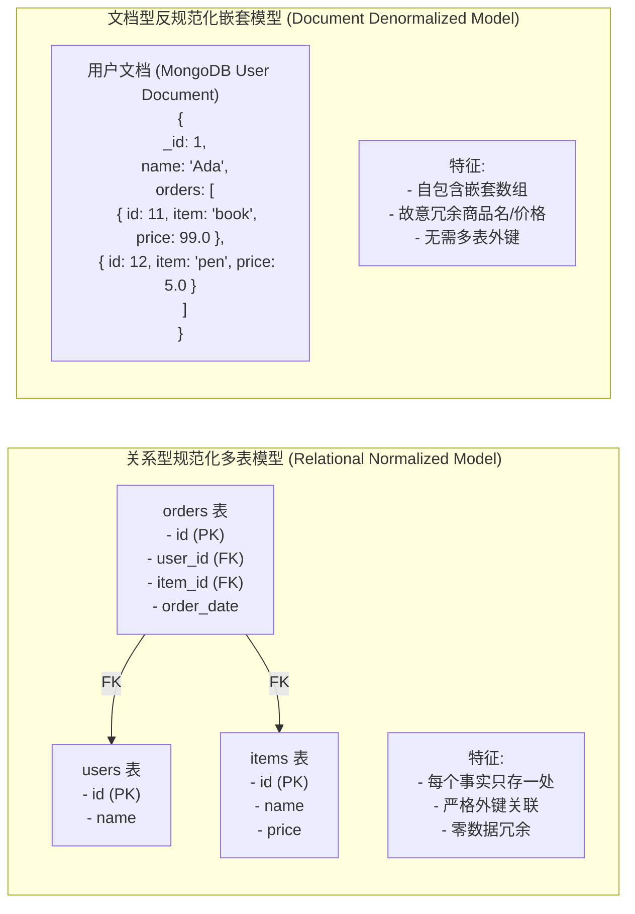
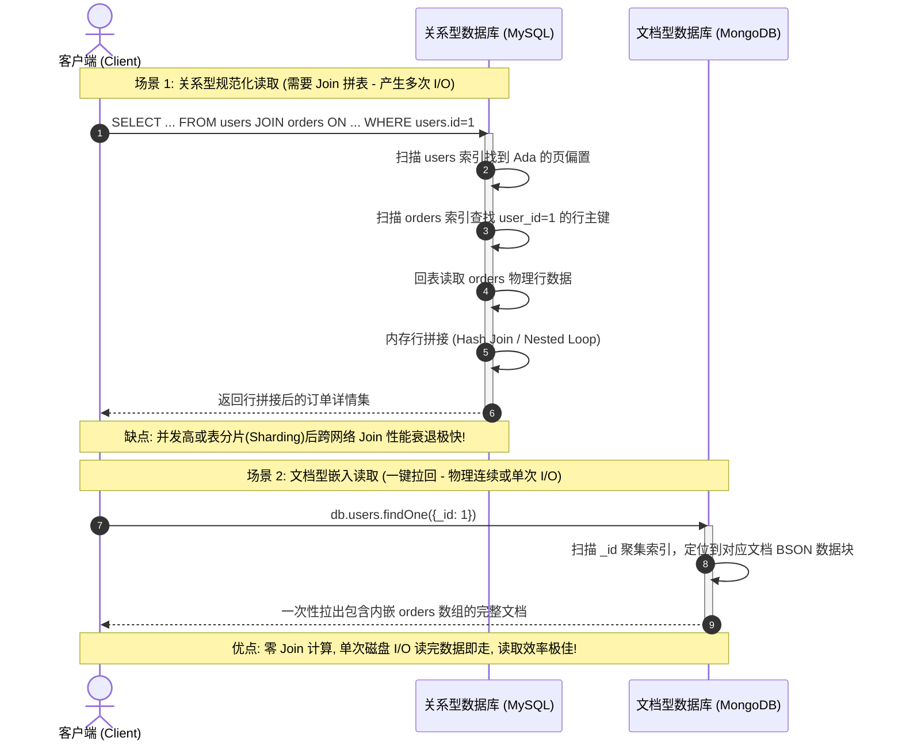
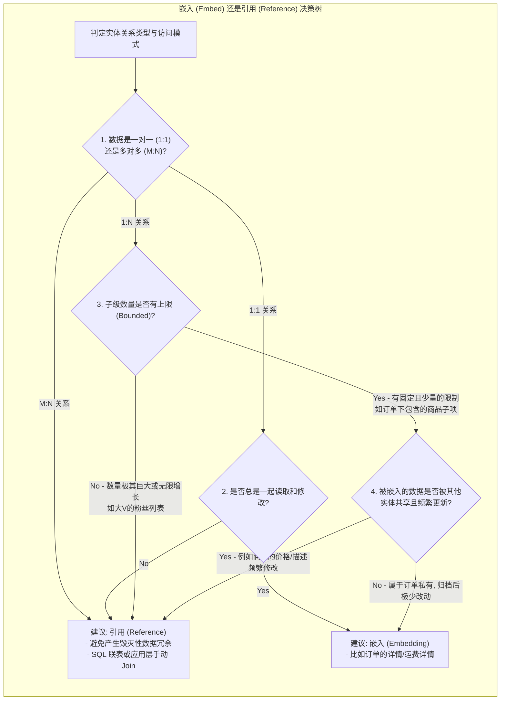

import GlossaryTerm from '@site/src/components/GlossaryTerm';
import GuidedExercise from '@site/src/components/GuidedExercise';
import ResearchNote from '@site/src/components/ResearchNote';
import ChapterMeta from '@site/src/components/ChapterMeta';
import PyRunner from '@site/src/components/PyRunner';
import TradeoffExplorer from '@site/src/components/TradeoffExplorer';
import QuizCard from '@site/src/components/QuizCard';

# M3L4 · SQL vs NoSQL 建模实战

<ChapterMeta
  time="约 1.5–2 小时"
  prereqs={[{label: 'L7 数据建模', href: '../foundations/data-modeling'}, {label: 'M2L8 存储选型', href: '../system-design-bridge/storage-selection'}]}
  outcome="能把同一份数据用关系型（规范化+join）和文档型（嵌套+反规范化）两种方式建模，并说清各自的查询代价与一致性取舍。"
  howToUse="先看两种模型的查询差异，再做 lab 亲手把关系模型转成文档模型。"
/>

:::tip 不是"SQL vs NoSQL 谁更好"，而是"按怎么查来建模"
同一份"用户和订单"数据，关系型把它拆成两张表用 join 连接、文档型把订单嵌进用户文档。哪个好？取决于你怎么查、能不能容忍冗余。这一课带你亲手建两种模型，体会取舍。
:::

## 一、用户和他的订单，怎么存？

要展示"某用户的所有订单"。关系型：users 表 + orders 表，查时 <GlossaryTerm term="JOIN" definition="连接：关系数据库把多张表按关联键拼起来的操作（如 users.id = orders.user_id）。强大灵活，但跨表 join 在大数据量/分片下可能很慢。">join</GlossaryTerm> 两张表。文档型：把订单**嵌入**用户文档，一次读出。两条路各有代价——这一课讲清楚。



## 二、三个核心概念（分层）

### 基础：规范化 + join vs 嵌入

- **关系型**：数据<GlossaryTerm term="Normalization" definition="规范化：每个事实只存一处、不冗余（如订单只存 user_id 引用用户）。改一处即全对，但查询常需 join。">规范化</GlossaryTerm>成多表，用 join 关联。无冗余、一致性好，但查询要拼表。
- **文档型**：基于 <GlossaryTerm term="Document Model" definition="文档模型：以文档形式（通常为 JSON 或 BSON）存储和查询数据的 NoSQL 数据库模型，典型代表为 MongoDB。特别适合自包含、树形嵌套结构的数据。">文档模型</GlossaryTerm>，将相关数据<GlossaryTerm term="Embedding" definition="嵌入：把关联数据直接放进同一个文档（如用户文档里嵌一个 orders 数组）。一次读就拿全，但数据可能冗余、更新要改多处。">嵌入</GlossaryTerm>一个文档。这种模型往往具备 <GlossaryTerm term="Schema-less" definition="无固定 Schema：指数据库不在物理引擎层强制校验数据表结构。文档与文档之间可以拥有完全不同的字段组合，具备极高的敏捷扩展能力，但一致性校验责任随之转移至应用层。">无固定 Schema (Schema-less)</GlossaryTerm> 特性。一次读拿全（快），但冗余、更新麻烦。



### 进阶：按访问模式选嵌入还是引用

经验法则（回扣 [L7 按查询建模](../foundations/data-modeling)）：

- **总是一起读、从属关系、数量有界** → 嵌入（如订单的收货地址）。
- **独立查询、多对多、数量无界** → 引用（如订单引用商品，商品被很多订单引用）。

嵌入优化读，引用优化一致性和灵活查询。



### 深入（选学）：很多 NoSQL 没有 join

关键差异：**许多 NoSQL（文档/KV/宽列）不支持高效跨表 join**。所以在 NoSQL 里，你往往被迫<GlossaryTerm term="Denormalization" definition="反规范化：故意冗余存储（同一数据存多份/预计算/嵌入），用写复杂度和空间换读性能。NoSQL 因缺乏 join 常依赖它。">反规范化</GlossaryTerm>——把数据冗余、嵌入，用"写时多写几份 + 容忍短暂不一致"换"读时一次拿全"（回扣 [M2L6 最终一致](../system-design-bridge/cap-consistency)）。这不是 NoSQL 更"先进"，而是它用不同的取舍换扩展性。

<ResearchNote
  title="数据模型决定了什么查询便宜、什么查询贵"
  source="Martin Kleppmann, DDIA 第 2 章（Data Models and Query Languages）"
  href="https://dataintensive.net/"
  insight="DDIA 对比关系、文档、图三种模型：文档模型擅长“一棵树一次读取”的从属数据，但处理多对多和 join 很弱；关系模型用 join 优雅处理多对多。模型选择本质是匹配你的数据关系和查询模式。"
  application="选 SQL 还是 NoSQL，先看你的数据关系（一对多？多对多？）和高频查询（要不要 join？要不要一次拿整棵树？）。模型选错，要么处处 join 很慢、要么冗余一致性噩梦。"
/>

## 三、跟我做一遍：两种模型查同一份数据

<PyRunner
  expect="两种模型结果一致"
  code={`# 关系型：两张"表" + 引用
users = [{"id": 1, "name": "Ada"}]
orders = [{"id": 11, "user_id": 1, "item": "book"},
          {"id": 12, "user_id": 1, "item": "pen"}]

def relational_get(uid):
    user = next(u for u in users if u["id"] == uid)        # 查 users
    user_orders = [o for o in orders if o["user_id"] == uid]  # join orders
    return {"name": user["name"], "orders": [o["item"] for o in user_orders]}

# 文档型：订单嵌入用户文档，一次读拿全
docs = [{"id": 1, "name": "Ada", "orders": ["book", "pen"]}]

def document_get(uid):
    return next(d for d in docs if d["id"] == uid)         # 一次查

r = relational_get(1)
d = document_get(1)
print("关系型:", r)
print("文档型:", {"name": d["name"], "orders": d["orders"]})
print("两种模型结果一致" if r["orders"] == d["orders"] else "?")`}
/>

同样的结果，关系型查了"两次 + join"、文档型"一次拿全"。文档型读更快，但如果一个订单要同时出现在"用户视图"和"商家视图"里，嵌入就会**冗余两份**——这就是它的代价。**试试**：给文档模型加一个"按商品反查所有买家"的需求，看嵌入模型为什么这时很别扭（要扫所有文档）。

## 四、动手 Lab（必做）

打开 `labs/month03/m3l4_modeling/`：

```bash
python labs/month03/m3l4_modeling/test_modeling.py
```

把关系模型（users + orders）转成文档模型（嵌入），并实现两种查询。

<GuidedExercise
  title="练习指引：两种模型互转与查询"
  goal="亲手体会规范化 join 与反规范化嵌入的等价与取舍——这是 NoSQL 建模的核心功。"
  hints={[
    '关系查询：先取 user，再过滤出它的 orders（模拟 join）。',
    '反规范化：把每个用户和它的订单合成一个嵌入文档。',
    '文档查询：一次取出嵌入了 orders 的文档。',
    '两种模型查同一用户，结果应一致——它们只是同一数据的不同组织。'
  ]}
  steps={[
    '实现 join_user_orders(users, orders, uid)：返回 {"name":..., "orders":[item,...]}。',
    '实现 to_documents(users, orders)：返回每个用户嵌入其订单的文档列表。',
    '实现 doc_get(docs, uid)：从文档列表取出该用户文档。',
    '写测试：两种查询结果一致；反规范化正确嵌入。'
  ]}
  checks={[
    '你能说出嵌入 vs 引用各自适合什么。',
    '你的两种模型查同一用户结果一致。',
    '你能解释为什么没有 join 的 NoSQL 依赖反规范化。',
    '你能举一个"嵌入很别扭"的查询（多对多/反查）。'
  ]}
/>

## 架构师深潜（Staff+ 视角）

### 1. 关系 vs 文档，按数据关系选

<TradeoffExplorer
  title="一对多/多对多怎么建模"
  dimensions={['读性能', '写一致性', '多对多支持', '灵活查询', '扩展性']}
  options={[
    {
      name: '关系型（规范化 + join）',
      scores: [3, 5, 5, 5, 3],
      note: '无冗余、多对多和灵活查询都强。但跨表 join 在海量/分片下可能慢。',
      whenToUse: '关系复杂、查询多变、要强一致（订单、账务、社交关系）。'
    },
    {
      name: '文档型（嵌入 + 反规范化）',
      scores: [5, 2, 2, 2, 5],
      note: '从属数据一次读拿全、易水平扩展。但冗余、多对多和反查别扭、更新多处。',
      whenToUse: '一棵树一起读、关系简单、读多写少（用户资料、内容、配置）。'
    }
  ]}
/>

### 2. 反规范化是"用写换读"，要管好一致性

NoSQL 里嵌入/冗余很常见，但**冗余的每一份都要在更新时同步**——否则数据不一致。常见做法是异步更新冗余副本（回扣 [M2L10 事件驱动](../system-design-bridge/communication-decoupling)）+ 接受最终一致。架构师要清楚：你不是消灭了 join 的成本，而是把它从"读时 join"挪到了"写时维护冗余"。

### 3. 真实案例：feed 就是极致反规范化

下一周的 [feed 系统（M3L10）](./overview) 会把这个推到极致：为了"刷一下秒出"，把内容预先写扩散到每个用户的收件箱（大量冗余）。**读的极致优化，往往是写时反规范化换来的**——这条线从 L7 一路贯穿到 feed。

### 4. 架构师深问（给自己 30 分钟）

- "设计一个微信"：用户、好友关系、消息、群——哪些嵌入、哪些引用？为什么群成员不该嵌入消息里？
- 你用文档模型嵌入了订单，现在要"统计每个商品的销量"，怎么办？（暴露嵌入对反查的弱点。）
- 反规范化后，一处数据改了要同步 3 个冗余副本，你怎么保证它们最终一致？

## 自检清单

- [ ] 我能用关系型和文档型两种方式建同一份数据。
- [ ] 我的 lab 两种查询结果一致、反规范化正确。
- [ ] 我能按"嵌入 vs 引用"规则做选择。
- [ ] 我理解反规范化是"用写和一致性换读"。

## 常见误解

- **"NoSQL 具备无固定 Schema (Schema-less) 特性，所以可以野蛮随意存放任意格式的数据"**: 这是极具欺骗性的陷阱。Schema-less 仅仅是数据库引擎不再主动校验，实际上应用程序内部对读取字段有极其脆弱的契约约束。如果缺乏精心规划的“隐式 Schema”访问模式（Access Patterns）设计，直接混合嵌入各种残缺格式，很快系统就会由于无法反查和过滤陷入死锁泥潭。
- **"NoSQL 数据库天然就比关系型 SQL 数据库读取速度要快"**: 这种对比完全脱离了物理机制。NoSQL 的高速读取主要是通过“反规范化与数据嵌入”，将多表 Join 计算前置分摊到了“写时冗余投递”。其读加速的本质是应用层代码用“写放大”和“最终一致性一致性折损”做出的赌注性置换，并不是物理引擎硬件层面的神奇魔法。
- **"既然文档嵌套读性能这么好，那应该全面采用嵌入，废除引用关联"**: 嵌入极易引发“无界增长（Unbounded Grow）”。例如，将商品的每条买家评论直接嵌在商品文档内部，随着时间推移，单条商品文档将无限膨胀，严重时甚至直接击穿单文档 16MB 的存储上限，并在磁盘上产生频繁的文件块迁移（File Move）产生极高的写尾延迟。

## 五、章末自测

<QuizCard
  questions={[
    {
      q: '关于关系型数据库的‘规范化 (Normalization)’与文档型 NoSQL 数据库的‘反规范化 (Denormalization)’，以下哪项关于读写成本转移的陈述是正确的？',
      options: [
        '文档型 NoSQL 数据库消除了所有的计算开销，无论是读还是写都比 SQL 便宜数万倍。',
        '关系型规范化将复杂度放在‘读时 Join’上，写入只需更新一处物理记录，一致性极强但高频 Join 耗费 CPU/磁盘 I/O；文档型反规范化则‘用写换读’，将复杂度转移到‘写时维护冗余’（写入多处或修改大文档），以牺牲写入性能与强一致性换取极高的单次读取性能。',
        'SQL 数据库完全不支持反规范化建模，只能通过视图（View）实现查询。'
      ],
      answer: 1,
      explain: '用写换读。反规范化的本质是在写入时耗费额外的计算与多份冗余空间，从而保证在读取时能通过单次 Key-Value 或单条文档提取拉回全部所需状态，这是海量高并发读取的核心手段。'
    },
    {
      q: '在设计一对多（1:N）数据关联时，什么情况下应该采用‘嵌入（Embedding）’，什么情况下应该采用‘引用（Referencing/外键关联）’？',
      options: [
        '只要是多表关联就必须使用引用，文档型数据库中装配引用是不合法的。',
        '当关联实体总是一起被读取、存在从属关系、且 N 的数量有确定上限（如订单的多个收货地址）时适合‘嵌入’；当关联实体独立查询、或者 N 的数量无界/非常巨大（如一个大V的千万级粉丝列表，可能引起文档超过 16MB 限制）时，必须采用‘引用’。',
        '当需要频繁修改关联实体的共享字段时应该选择嵌入。'
      ],
      answer: 1,
      explain: '嵌入 vs 引用。如果子文档数量无限增长（Unbounded 1:N），在文档型 NoSQL（如 MongoDB）中嵌入会导致文档不断物理膨胀、频繁触发磁盘文件移动和页重构，甚至突破单文档尺寸上限，此时必须使用外键引用进行分表或关联存储。'
    },
    {
      q: '为什么在许多不支持跨节点分布式 Join 的 NoSQL 场景中，架构师设计业务时必须接受并处理‘最终一致性’？',
      options: [
        '因为 NoSQL 数据库没有预写日志，一旦断电数据一定会损坏。',
        '因为为了读性能把同一份数据（如用户名）冗余到了订单文档、朋友圈文档等多个物理集合中。当用户修改用户名时，系统必须写多处或异步更新这些多余副本，在所有副本被串行更新完的间隔内，读取端会看到新旧名字并存。这就是为了极致读性能而在应用层对最终一致性的妥协。',
        '因为 NoSQL 必须使用分布式一致性共识算法 Raft 才能写入单机记录。'
      ],
      answer: 1,
      explain: '最终一致性的业务成因。反规范化将写压力和一致性责任推给了应用层。冗余存储的物理事实决定了‘并发双写’或‘异步队列广播更新’会产生不可避免的同步延迟，因此必须在架构层面对最终一致性进行妥协。'
    }
  ]}
/>

## 延伸阅读

- [Martin Kleppmann, DDIA 第 2 章](https://dataintensive.net/)
- [MongoDB 数据建模指南](https://www.mongodb.com/docs/manual/data-modeling/)
- [Month 3 总览](./overview)
