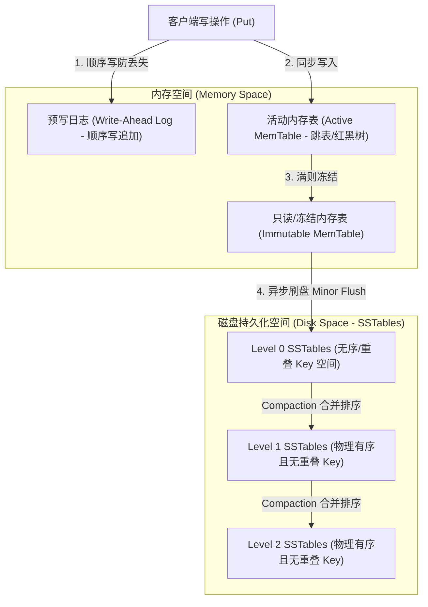
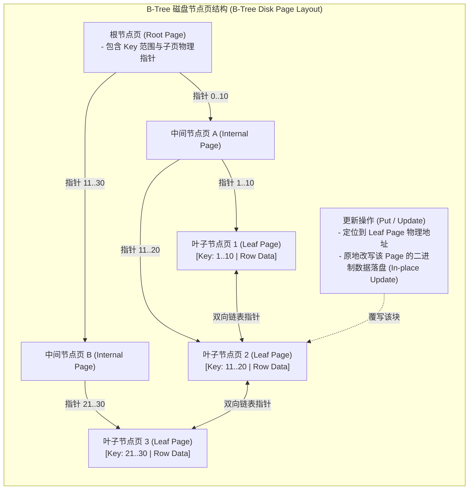
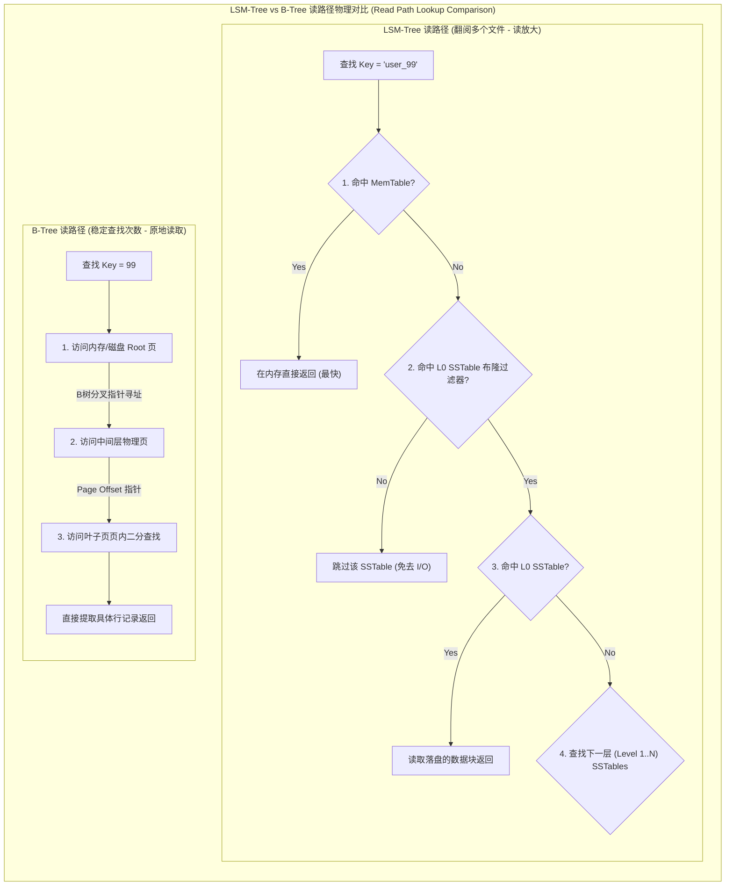

import GlossaryTerm from '@site/src/components/GlossaryTerm';
import GuidedExercise from '@site/src/components/GuidedExercise';
import ResearchNote from '@site/src/components/ResearchNote';
import ChapterMeta from '@site/src/components/ChapterMeta';
import PyRunner from '@site/src/components/PyRunner';
import TradeoffExplorer from '@site/src/components/TradeoffExplorer';
import QuizCard from '@site/src/components/QuizCard';

# M3L1 · 数据库读写路径与存储引擎

<ChapterMeta
  time="约 2 小时"
  prereqs={[{label: 'L7 数据建模', href: '../foundations/data-modeling'}, {label: 'M2L8 存储选型', href: '../system-design-bridge/storage-selection'}]}
  outcome="能讲清一次读/写在数据库内部的路径，区分 B-tree 与 LSM-tree 的取舍，并用读/写放大解释为什么不同库快在不同地方。"
  howToUse="先理解两类引擎的根本差异，再跑 LSM 读路径的 demo，最后做 lab 实现它。"
/>

:::tip 同样是数据库，引擎决定它擅长什么
为什么 PostgreSQL 读很稳、Cassandra/RocksDB 写极快？因为它们底层的存储引擎不同：一类"原地更新"（B-tree），一类"只追加"（LSM）。这个根本差异，决定了它们各自的强项和代价。
:::

## 一、写很快还是读很快？引擎说了算

你选了个数据库，发现它写入飞快但偶尔读有点慢；换一个则相反。这不是玄学——是底层<GlossaryTerm term="Storage Engine" definition="存储引擎：数据库中真正负责把数据存到磁盘、再读出来的核心模块。两大主流是 B-tree（原地更新）和 LSM-tree（只追加 + 合并）。">存储引擎</GlossaryTerm>的设计差异。这一课打开引擎舱，看清两类主流引擎怎么工作。



## 二、三个核心概念（分层）

### 基础：一次读写的路径

一次写大致是：请求 → 内存缓冲（写日志保证不丢，回扣 [L1 持久化](../foundations/programming-systems-primer)）→ 最终落盘。一次读：先查内存/缓存，未命中再去磁盘。**磁盘访问比内存慢几个数量级（回扣 [L1 延迟表](../foundations/request-path)），所以引擎的全部精巧都在"尽量少碰磁盘、碰也要顺序碰"。**

### 进阶：B-tree vs LSM-tree

两种截然不同的哲学：

- <GlossaryTerm term="B-tree" definition="B 树：把数据组织成有序的树，更新时原地修改对应的页。读取稳定高效（少数几次磁盘寻址），是关系数据库的主流索引结构。">B-tree</GlossaryTerm>：**原地更新**，数据始终有序。读快而稳，但写要随机寻址、改页。



- <GlossaryTerm term="LSM-tree" definition="日志结构合并树（Log-Structured Merge-tree）：写入先进内存表（memtable），满了就顺序刷成不可变文件（SSTable）；后台合并（compaction）。写极快（顺序写），读可能要查多个文件。">LSM-tree</GlossaryTerm>：**只追加**——写先进内存表，满了顺序刷成不可变文件（SSTable），后台通过 <GlossaryTerm term="Compaction" definition="合并排序 (Compaction)：LSM-Tree 后台将多个无序/重叠的 SSTable 文件合并并输出为按主键排序的、去除了过期/删除标志的更大 SSTable 文件的过程。这是 LSM 维持读性能和回收磁盘空间的关键。">Compaction (合并/压实)</GlossaryTerm> 整理。写极快（顺序写），但读可能要翻多个文件。

### 深入（选学）：三种"放大"

引擎的取舍可以用三个指标量化：

- <GlossaryTerm term="Write Amplification" definition="写放大：实际写入磁盘的数据量是逻辑写入量的几倍。LSM 的 compaction 会反复重写数据，写放大较高。">写放大</GlossaryTerm>：实际写盘量 / 逻辑写入量。
- <GlossaryTerm term="Read Amplification" definition="读放大：一次读实际要访问几次磁盘/几个文件。LSM 读可能要查 memtable + 多个 SSTable，读放大较高。">读放大</GlossaryTerm>：一次读要碰几个文件，可以通过在每个 SSTable 旁配置一个 <GlossaryTerm term="Bloom Filter" definition="布隆过滤器：一种空间效率极高的概率型数据结构，用于判断一个元素是否在一个集合中。它可能会误判存在，但绝不会误判不存在，常用于 LSM 中过滤掉不包含目标 Key 的 SSTable 以减少磁盘 I/O。">布隆过滤器 (Bloom Filter)</GlossaryTerm> 极大缓解。
- <GlossaryTerm term="Space Amplification" definition="空间放大：实际占用磁盘 / 有效数据量。B-tree 有页内碎片，LSM 在 compaction 前有重复/过期数据。">空间放大</GlossaryTerm>：占用空间 / 有效数据。

LSM 用"高写放大、读要查多文件"换"极快的顺序写"；B-tree 反之。**没有免费的午餐，只有放在不同地方的代价。**



<ResearchNote
  title="两类存储引擎，两套取舍"
  source="Martin Kleppmann, DDIA 第 3 章；O'Neil et al. (1996), The Log-Structured Merge-Tree"
  href="https://www.cs.umb.edu/~poneil/lsmtree.pdf"
  insight="DDIA 系统对比了 B-tree（原地更新、读稳定）与 LSM-tree（顺序追加 + 合并、写吞吐高）。LSM 论文奠定了 Bigtable、Cassandra、RocksDB、LevelDB 等一大批高写入系统的基础。"
  application="选数据库其实是在选存储引擎的取舍：写密集（日志、时序、消息）偏 LSM；读密集且要稳定低延迟偏 B-tree。理解放大三指标，你才能预判一个库在你的负载下表现如何。"
/>

## 三、跟我做一遍：LSM 的读路径

LSM 写很简单（追加进内存表）；精髓在**读**——要按"新→旧"的顺序找：

<PyRunner
  expect="读到最新值"
  code={`class LSM:
    def __init__(self):
        self.memtable = {}      # 内存表（最新写入）
        self.sstables = []      # 刷盘的不可变文件，越后面越新

    def put(self, k, v):
        self.memtable[k] = v    # 写：只追加进内存表，极快

    def flush(self):
        self.sstables.append(dict(self.memtable))   # 内存表满 → 冻结成 SSTable
        self.memtable = {}

    def get(self, k):
        if k in self.memtable:          # 1) 先查最新的内存表
            return self.memtable[k]
        for table in reversed(self.sstables):  # 2) 再从最新的 SSTable 往旧查
            if k in table:
                return table[k]
        return None

db = LSM()
db.put("x", "v1"); db.flush()    # v1 落到 SSTable
db.put("x", "v2")                # v2 还在内存表
print("get x:", db.get("x"))     # v2：内存表里的更新
db.flush()
db.put("x", "v3")
print("get x:", db.get("x"))     # v3：最新优先
print("读到最新值")`}
/>

注意 `get` 的顺序：**永远先查最新的地方**（内存表 → 新 SSTable → 旧 SSTable）。这就是 LSM "读要翻多个文件"（读放大）的来源。**试试**：写很多不同 key 再多次 flush，体会 SSTable 越堆越多、读越慢——这正是为什么 LSM 需要后台 compaction 合并它们。

## 四、动手 Lab（必做）

打开 `labs/month03/m3l1_lsm/`：

```bash
python labs/month03/m3l1_lsm/test_lsm.py
```

实现一个最小 LSM 存储引擎的读写路径——亲手体会"只追加 + 最新优先"。

<GuidedExercise
  title="练习指引：实现一个最小 LSM"
  goal="通过亲手实现，理解 LSM 为什么写快读放大、为什么需要 compaction。"
  hints={[
    'put 只写内存表，永远 O(1)，这就是 LSM 写快的原因。',
    'flush 把内存表冻结成一个不可变 SSTable，追加到列表末尾（最新）。',
    'get 必须按"新→旧"找：内存表 → 倒序遍历 SSTable。',
    '同一个 key 的新值会"盖住"旧值（因为先查到新的就返回）。'
  ]}
  steps={[
    '实现 LSM：memtable（dict）+ sstables（list of dict）。',
    'put(k, v)：写入 memtable。',
    'flush()：把 memtable 复制成一个 SSTable 追加，清空 memtable。',
    'get(k)：先查 memtable，再 reversed 遍历 sstables，都没有返回 None。',
    '写测试：内存表读、flush 后仍可读、新值覆盖旧值、不存在返回 None。'
  ]}
  checks={[
    '你能说出一次读/写在引擎里的路径。',
    '你能解释 LSM 为什么写快、读为什么有放大。',
    '你的 get 正确地最新优先。',
    '你能说出哪类负载适合 LSM、哪类适合 B-tree。'
  ]}
/>

## 架构师深潜（Staff+ 视角）

### 1. 选库 = 选引擎取舍

<TradeoffExplorer
  title="B-tree vs LSM-tree"
  dimensions={['读延迟稳定', '写吞吐', '空间效率', '范围查询', '实现/调优复杂度']}
  options={[
    {
      name: 'B-tree（原地更新）',
      scores: [5, 3, 3, 5, 3],
      note: '读稳定、范围查询强、事务友好。写要随机改页，写吞吐不如 LSM。',
      whenToUse: '读密集、要稳定低延迟和强事务（PostgreSQL/MySQL InnoDB）。'
    },
    {
      name: 'LSM-tree（只追加 + 合并）',
      scores: [3, 5, 3, 4, 4],
      note: '顺序写、写吞吐极高。但读放大、compaction 占用后台资源、延迟有毛刺。',
      whenToUse: '写密集：时序、日志、消息、海量 KV（Cassandra/RocksDB/LevelDB）。'
    }
  ]}
/>

### 2. compaction 是 LSM 的隐藏成本

LSM 写得爽，但后台 compaction 会消耗 CPU/IO、制造延迟毛刺（回扣 [L1 尾延迟](../foundations/programming-systems-primer)）。架构师选 LSM 系数据库时，必须考虑 compaction 对 p99 的影响，并预留资源——这是"写快"的隐藏账单。

### 3. 真实案例：引擎决定能力边界

[ChatGPT 的 KV cache 用分页显存管理](../atlas/chatgpt.mdx)（OS 思想），而消息/时序类系统普遍用 LSM 引擎扛海量写。**数据库的"性格"，是存储引擎决定的**——理解引擎，你才知道一个库的真实能力边界，而不是只看 benchmark 宣传。

### 4. 架构师深问（给自己 30 分钟）

- 你的报名/消息系统写远多于读，你会偏向哪种引擎？为什么？
- LSM 的读放大怎么缓解？（提示：布隆过滤器、compaction、缓存。）
- 为什么"顺序写比随机写快几个数量级"是 LSM 设计的根本动机？（回扣 L1 磁盘延迟。）

## 自检清单

- [ ] 我能讲清一次读/写在数据库内部的路径。
- [ ] 我能区分 B-tree 和 LSM 的根本差异与取舍。
- [ ] 我的 lab LSM 读路径"最新优先"正确。
- [ ] 我能用读/写/空间放大解释引擎取舍。

## 常见误解

- **"所有数据库都差不多，随便选个时髦的就行"**: 存储引擎的数据结构决定了数据库的物理性格。拿针对 ACID 关系联表优化（B-tree）的传统 RDBMS 去强顶每秒百万级别的时序/日志写入，或者拿没有强关联和事务保护的 LSM KV 存储去做高并发高精度的银行对账，都是在以己之短攻敌之长。
- **"LSM-Tree 全面优于 B-tree"**: LSM-tree 虽然写性能极佳，但是由于多个 SSTable 重叠，读放大严重，导致读延迟容易产生抖动和毛刺。且后台 Compaction 会在 CPU 和 I/O 紧张时与前台写入争抢物理硬件资源，产生严重的尾延迟（Tail Latency）。
- **"选型时只需要看官方给出的高大上 Benchmark"**: 大多数厂商的性能测试都是在特定读写比例、且没有 Compaction 压力积累（例如只写 10 分钟）的纯理想状态下进行的。架构师必须在真实的数据规模和读写比下进行压测以观察长周期表现。

## 五、章末自测

<QuizCard
  questions={[
    {
      q: '在 LSM-Tree (日志结构合并树) 引擎中，为什么写入操作几乎永远是常量时间复杂度 O(1)？',
      options: [
        '因为它在写入时对磁盘所有分区的数据页进行实时的重排序。',
        '因为任何写操作都是将数据追加写入预写日志（WAL）以保证持久化，并同步写入内存中的有序跳表/红黑树（MemTable）后立即返回。它完全避免了磁盘随机 I/O 原地修改（In-place update），从而将写吞吐推向极致。',
        '因为它使用高精度的量子存储，不依赖普通物理磁盘。'
      ],
      answer: 1,
      explain: 'LSM-Tree 用内存缓冲（MemTable）和顺序追加写（Append-only）换取极高的写速度。它绝不在刷盘时寻找旧位置改写，而是推迟并分批进行磁盘排序（Compaction）。'
    },
    {
      q: '既然 LSM-Tree 写性能暴增，那它所带来的最核心架构代价是什么？',
      options: [
        '读放大较高（读数据可能需要查找 MemTable 与多个层级的 SSTable，且由于 Compaction 重写带来高写放大，以及过期版本带来的空间放大）与读延迟抖动。',
        '无法持久化保存任何数据，重启后数据全部丢失。',
        '对 CPU 算力的要求呈指数级暴增，要求每秒计算数万次 Hash。'
      ],
      answer: 0,
      explain: '正如放大三指标（Read/Write/Space Amplification）所揭示的：LSM 引擎高吞吐是以读性能衰退和 Compaction 占用的额外盘 I/O 为代价的。为了缓解读放大，业界引入了布隆过滤器（Bloom Filter）和 LSM 整理合并。'
    },
    {
      q: 'B-Tree 引擎在以 InnoDB 为代表的传统关系型 SQL 数据库中长盛不衰，其主要物理优势是什么？',
      options: [
        '它对每次随机写入都非常平滑，完全不需要任何磁盘寻址。',
        '它的原地更新设计能维持高精度的物理顺序。读取性能极度稳定（稳定 O(log N) 寻页延迟），因为每次读在树高有限的结构中仅需 3~4 次随机物理 page 读取，且由于数据按主键聚集，非常适合做范围查询与强事务一致性判定。',
        '它能够完全代替内存，使整个服务器不需要任何 RAM 芯片。'
      ],
      answer: 1,
      explain: 'B-Tree 的原地更新（In-place update）牺牲了高频写性能，以保证页的完美分配和高读稳定度。因为每一个叶子页都有明确的边界，故可以实现行锁、页锁以确保完美事务性。'
    }
  ]}
/>

## 延伸阅读

- [LSM-tree 论文（O'Neil 1996）](https://www.cs.umb.edu/~poneil/lsmtree.pdf)
- [Martin Kleppmann, DDIA 第 3 章](https://dataintensive.net/)
- [下一课：索引深入](./indexing)
