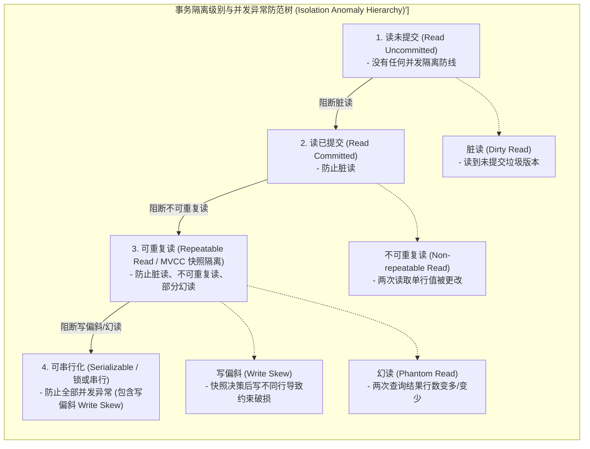
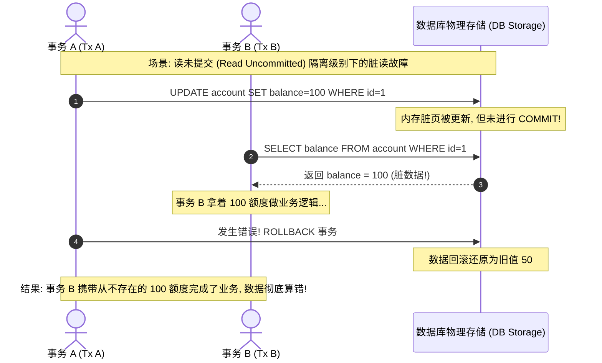
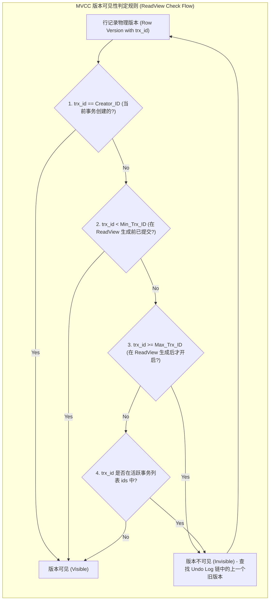

import GlossaryTerm from '@site/src/components/GlossaryTerm';
import GuidedExercise from '@site/src/components/GuidedExercise';
import ResearchNote from '@site/src/components/ResearchNote';
import ChapterMeta from '@site/src/components/ChapterMeta';
import PyRunner from '@site/src/components/PyRunner';
import TradeoffExplorer from '@site/src/components/TradeoffExplorer';
import QuizCard from '@site/src/components/QuizCard';

# M3L3 · 事务与隔离级别

<ChapterMeta
  time="约 2 小时"
  prereqs={[{label: 'L8 并发与竞态', href: '../foundations/concurrency-basics'}, {label: 'M2L6 一致性', href: '../system-design-bridge/cap-consistency'}]}
  outcome="能解释 ACID 与四种隔离级别各防住哪些并发异常，并用 MVCC 实现快照隔离的读。"
  howToUse="先看并发事务会出哪些错，再跑快照读 demo，最后做 lab 实现 MVCC 快照读。"
/>

:::tip 事务是"要么全做，要么不做"的承诺
转账要么"扣了 A、加了 B"，要么两件都不发生——绝不能扣了 A 却没加 B。事务给你这个保证。但当很多事务**并发**跑时，它们会互相看到对方的半成品，制造一类隐蔽的 bug——隔离级别就是控制"你能看到多少别人的半成品"。
:::

## 一、两个转账同时跑，钱会算错吗？

[L8](../foundations/concurrency-basics) 讲过竞态。事务把竞态搬到了数据库：两个事务并发，一个可能读到另一个**还没提交**的数据（脏读）、或同一行读两次结果不同（不可重复读）、或汇总时多出/少了行（幻读）。**这些异常发生与否，取决于你设的隔离级别。**



## 二、三个核心概念（分层）

### 基础：ACID

<GlossaryTerm term="ACID" definition="事务的四个保证：Atomicity（原子性，要么全做要么不做）、Consistency（一致性，不破坏约束）、Isolation（隔离性，并发事务互不干扰）、Durability（持久性，提交后不丢）。">ACID</GlossaryTerm>：原子性（全做或不做）、一致性（不破坏约束）、隔离性（并发互不干扰）、持久性（提交不丢）。这一课聚焦最难的 **I（隔离）**。

### 进阶：隔离级别与并发异常

隔离级别越高，能防住的异常越多，但代价越大：

| 级别 | 防住 | 仍可能 |
|---|---|---|
| 读未提交 | — | 脏读、不可重复读、幻读 |
| 读已提交 | 脏读 | 不可重复读、幻读 |
| 可重复读 | + 不可重复读 | 幻读（部分） |
| 可串行化 | 全部 | （最慢） |

- <GlossaryTerm term="Dirty Read" definition="脏读：读到了另一个事务还未提交的数据；若那个事务回滚，你就读到了根本不存在的值。">脏读</GlossaryTerm>：读到别人没提交的。



- <GlossaryTerm term="Non-repeatable Read" definition="不可重复读：同一事务内读同一行两次，结果不同（因为中间被别的事务改并提交了）。">不可重复读</GlossaryTerm>：读两次不一样。
- <GlossaryTerm term="Phantom Read" definition="幻读：同一事务内按同一条件查两次，第二次多出/少了行（别的事务插入/删除并提交了）。">幻读</GlossaryTerm>：行数变了，防住它常需借助行锁与 <GlossaryTerm term="Gap Lock" definition="间隙锁：锁定索引记录之间的间隙（即排他区间），防止其他事务在该间隙中插入新数据，从而在可重复读级别下避免幻读异常。">间隙锁 (Gap Lock)</GlossaryTerm>。

### 深入（选学）：MVCC 与快照隔离

大多数现代数据库不靠"加锁锁住所有人"实现高隔离，而用 <GlossaryTerm term="MVCC" definition="多版本并发控制：每次写产生一个新版本，读取看到的是事务开始那一刻的一致快照。读不阻塞写、写不阻塞读，是现代数据库高并发的基石。">MVCC</GlossaryTerm>（多版本并发控制）：每次写产生新版本，每个读取事务生成一个 <GlossaryTerm term="ReadView" definition="读视图：MVCC 在快照读时创建的一个快照数据结构，记录当前活跃（未提交）的事务 ID 列表。读取线程根据此视图判定行版本链中的每个版本对当前事务是否可见。">ReadView (读视图)</GlossaryTerm>，使读到的是它**开始那一刻的一刻快照**（<GlossaryTerm term="Snapshot Isolation" definition="快照隔离：事务读到一个固定时刻的一致快照，期间别人的提交对它不可见。读不阻塞写。但仍可能有写偏斜（write skew）。">快照隔离</GlossaryTerm>）。读不阻塞写、写不阻塞读，并发高得多。但它仍有一个微妙漏洞——<GlossaryTerm term="Write Skew" definition="写偏斜：两个事务各自基于同一份快照做决定并写不同的行，单独都合法，合起来却破坏了约束（如两个医生同时请假，各自看到还有人值班）。可串行化才能完全防住。">写偏斜</GlossaryTerm>，需要可串行化才能完全防住。



<ResearchNote
  title="隔离级别其实定义得并不干净"
  source="Berenson et al. (1995), A Critique of ANSI SQL Isolation Levels；DDIA 第 7 章"
  href="https://www.microsoft.com/en-us/research/publication/a-critique-of-ansi-sql-isolation-levels/"
  insight="这篇论文指出 ANSI SQL 用“防住哪些异常”来定义隔离级别并不严谨，并补充了快照隔离等现实中重要的级别。DDIA 进一步用脏读、不可重复读、幻读、写偏斜等具体异常来讲清每个级别真正保证什么。"
  application="不要只记级别名字，要记“它防住哪些异常、放过哪些”。很多数据库的“可重复读”其实是快照隔离、仍有写偏斜。架构师选隔离级别时，要按业务能否容忍每种异常来定，而不是默认最高（太慢）或最低（出错）。"
/>

## 三、跟我做一遍：MVCC 快照读

<PyRunner
  expect="快照隔离生效"
  code={`class VersionedStore:
    def __init__(self):
        self.history = {}   # key -> [(version, value), ...]
        self.version = 0

    def write(self, key, value):
        self.version += 1
        self.history.setdefault(key, []).append((self.version, value))

    def snapshot(self):
        return self.version          # 事务开始：记下当前版本号

    def read_as_of(self, key, snap):
        # 只看 <= snap 的最新版本（事务开始那一刻的快照）
        latest = None
        for v, val in self.history.get(key, []):
            if v <= snap:
                latest = val
        return latest

db = VersionedStore()
db.write("balance", 100)
snap = db.snapshot()             # 事务 A 开始，拍下快照
db.write("balance", 999)         # 事务 B 改了并提交

print("A 读到（快照）:", db.read_as_of("balance", snap))     # 100：看不到 B 的修改
print("最新值:", db.read_as_of("balance", db.snapshot()))    # 999
print("快照隔离生效")`}
/>

事务 A 在自己的快照里**始终看到 100**，哪怕 B 中途改成了 999——这就是快照隔离：读到一致的、固定时刻的世界。**试试**：在 A 的快照后再 write 几次，A 读到的依然是它开始那一刻的值。

## 四、动手 Lab（必做）

打开 `labs/month03/m3l3_mvcc/`：

```bash
python labs/month03/m3l3_mvcc/test_mvcc.py
```

实现一个多版本存储，支持"读到某个快照版本"的快照隔离。

<GuidedExercise
  title="练习指引：用 MVCC 实现快照读"
  goal="通过实现，理解快照隔离为什么能“读不阻塞写”，以及它和加锁的根本不同。"
  hints={[
    '每次 write 都追加一个新版本 (version, value)，不覆盖旧的。',
    'snapshot() 返回当前全局版本号，作为事务的"读视点"。',
    'read_as_of(key, snap) 返回版本号 <= snap 的最新值。',
    '不存在或快照早于所有写入 → 返回 None。'
  ]}
  steps={[
    '实现 VersionedStore：history（key→版本列表）+ 全局 version。',
    'write(key, value)：version+1，追加 (version, value)。',
    'snapshot()：返回当前 version。',
    'read_as_of(key, snap)：返回 <= snap 的最新值，没有返回 None。',
    '写测试：快照后他人写入不影响快照读、读最新能看到、不存在返回 None。'
  ]}
  checks={[
    '你能说出四个隔离级别各防住哪些异常。',
    '你的 MVCC 快照读不受后续写入影响。',
    '你能解释 MVCC 为什么读写互不阻塞。',
    '你能举一个写偏斜的例子，说明为什么快照隔离不够。'
  ]}
/>

## 架构师深潜（Staff+ 视角）

### 1. 隔离级别是正确性和性能的旋钮

<TradeoffExplorer
  title="隔离级别怎么选"
  dimensions={['防异常能力', '并发性能', '实现复杂度', '死锁风险', '适用场景']}
  options={[
    {
      name: '读已提交',
      scores: [2, 5, 5, 4, 4],
      note: '只防脏读，性能好。多数数据库的默认级别。',
      whenToUse: '大多数普通业务，能容忍不可重复读/幻读时。'
    },
    {
      name: '快照隔离 / 可重复读（MVCC）',
      scores: [4, 4, 3, 5, 5],
      note: '读一致快照、读写不互锁、无死锁。但仍可能写偏斜。',
      whenToUse: '需要事务内读一致、又要高并发（现代数据库主力级别）。'
    },
    {
      name: '可串行化',
      scores: [5, 1, 2, 2, 2],
      note: '防住所有异常，等价于事务挨个串行。最安全但最慢、易冲突重试。',
      whenToUse: '正确性绝对优先、冲突不多的关键事务（如核心账务）。'
    }
  ]}
/>

### 2. 别默认"最高隔离"

可串行化最安全，但会大幅降低并发、增加冲突重试。架构师要**按数据的正确性要求分级**：账务用可串行化/强一致，普通业务用读已提交/快照隔离即可（回扣 [M2L6 可调一致性](../system-design-bridge/cap-consistency)）。

### 3. 真实案例：MVCC 是现代数据库的标配

PostgreSQL、MySQL InnoDB、几乎所有现代关系库都用 MVCC——这也是它们能在高并发下既保证读一致、又不让读阻塞写的原因。理解 MVCC，你才看得懂数据库的并发行为和"长事务导致版本膨胀"这类生产问题。

### 4. 架构师深问（给自己 30 分钟）

- 转账（A→B）该用什么隔离级别？秒杀扣库存呢？为什么不同？
- 写偏斜例子：两个值班医生同时申请请假，各自看到"还有另一人在岗"，结果都请假成功、无人值班。快照隔离为什么防不住？怎么修（[L8 乐观锁](../foundations/concurrency-basics)/可串行化/显式加锁）？
- 一个超长事务为什么会拖垮 MVCC 数据库？（提示：旧版本无法回收。）

## 自检清单

- [ ] 我能说出 ACID 各代表什么。
- [ ] 我能说出四个隔离级别各防/放哪些异常。
- [ ] 我的 lab MVCC 快照读正确、不受后续写影响。
- [ ] 我能举写偏斜的例子并说出对策。

## 常见误解

- **"事务就是加个 BEGIN 和 COMMIT，剩下的数据库会自动解决"**: 这种理解非常肤浅。事务的核心在于并发隔离。你如果不去显式指定事务的隔离级别，或者在需要时显式加上排他锁（例如 `FOR UPDATE`），并发时就会由于读到垃圾快照、丢失更新或因为写偏斜彻底把账算错。
- **"事务隔离级别越高越好，直接全部设成可串行化（Serializable）即可"**: 可串行化虽然能完全杜绝数据不一致，但这是以完全丧失并发吞吐、增加大范围锁冲突和极高的死锁（Deadlock）概率为代价的。一旦高并发请求进来，数据库将大面积阻塞排队或抛错重试。
- **"可重复读（Repeatable Read）就完全等价于快照隔离，没有任何数据不一致的死角"**: 这是很多工程师的盲区。以 InnoDB 可重复读级别为例，虽然用 MVCC 防治了幻读（读快照时行数一致），但在多事务各自读取并写不同关联行的场景下，依然会触发“写偏斜”（Write Skew）导致整体约束失效。

## 五、章末自测

<QuizCard
  questions={[
    {
      q: '在数据库事务隔离级别中，‘不可重复读’ (Non-repeatable Read) 和 ‘幻读’ (Phantom Read) 两种异常的最根本区别是什么？',
      options: [
        '不可重复读只能在 MySQL 中发生，而幻读只会在 Oracle 中发生。',
        '不可重复读关注的是同一条物理记录行（Row）的值被修改并提交（同一个行的值读两次不一样）；而幻读关注的是满足特定查询条件的数据集合的记录行数（Set of Rows）发生变化（别的事务插入或删除了新行并提交）。',
        '它们是完全相同的概念，只是国内外的翻译叫法不同。'
      ],
      answer: 1,
      explain: '修改 vs 插入/删除。不可重复读可以通过对特定数据行加锁（Row Lock）来规避；但幻读由于涉及之前不存在的新插入行，必须通过间隙锁（Gap Lock）或者多版本并发控制（MVCC）配合快照隔离来解决。'
    },
    {
      q: '多版本并发控制 (MVCC) 广泛应用于现代主流关系型数据库（如 MySQL InnoDB、PostgreSQL），其核心物理优势是什么？',
      options: [
        '它彻底摒弃了磁盘，使得事务操作只在 RAM 中快速交换。',
        '它做到了‘读不阻塞写，写不阻塞读’。读取事务根据其 Snapshot 拍下的全局事务 LSN/版本号，查找版本历史链中匹配的数据，完全不需要对正在读取的数据加共享锁，从而彻底释放了读写并发性能。',
        '它能够让多个事务同时更新同一行数据的同一个字段而不会发生任何冲突。'
      ],
      answer: 1,
      explain: 'MVCC 的核心机制是通过版本链和 ReadView 消除读写锁冲突。读取者走历史版本（快照读），写入者改最新版本，两者互不干扰。这比传统的强锁机制（可串行化）吞吐量提升了数个数量级。'
    },
    {
      q: '在快照隔离级别下，依然无法完全防住的一种极其微妙的并发数据损坏异常是‘写偏斜’ (Write Skew)。以下关于写偏斜的经典场景描述哪项正确？',
      options: [
        '两个用户同时抢购同一件商品的最后 1 个库存，最终导致库存扣减成了负数。',
        '系统要求必须至少有 1 名医生值班。医生 A 和 B 在各自事务中查到当前值班人数为 2，均在各自事务中请假并成功提交。由于两者均在未提交的快照中作决策，最终提交后值班人数变为 0，破坏了一致性约束。',
        '在转账事务中，A 账户的钱减少了，但 B 账户的钱没有增加。'
      ],
      answer: 1,
      explain: 'Write Skew。写偏斜是在快照隔离（Snapshot Isolation）下，多个事务基于互不重叠但彼此关联的行作出判定。各自更改自己那行（没有直接写锁冲突），但全局约束被破坏。必须通过 SELECT ... FOR UPDATE 显式加排他锁或使用可串行化（Serializable）级别来防范。'
    }
  ]}
/>

## 延伸阅读

- [A Critique of ANSI SQL Isolation Levels（1995）](https://www.microsoft.com/en-us/research/publication/a-critique-of-ansi-sql-isolation-levels/)
- [Martin Kleppmann, DDIA 第 7 章（Transactions）](https://dataintensive.net/)
- [下一课：SQL vs NoSQL 建模实战](./sql-vs-nosql)
