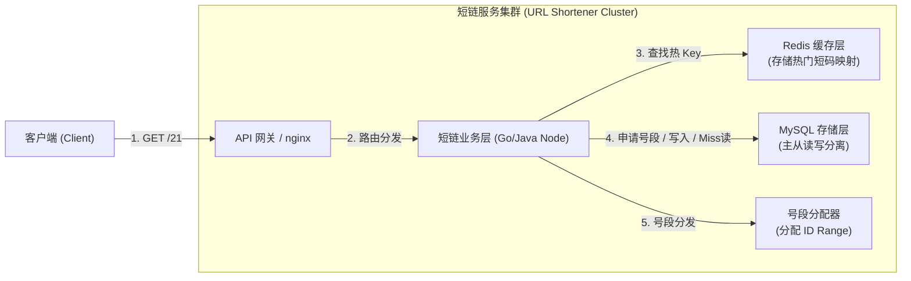
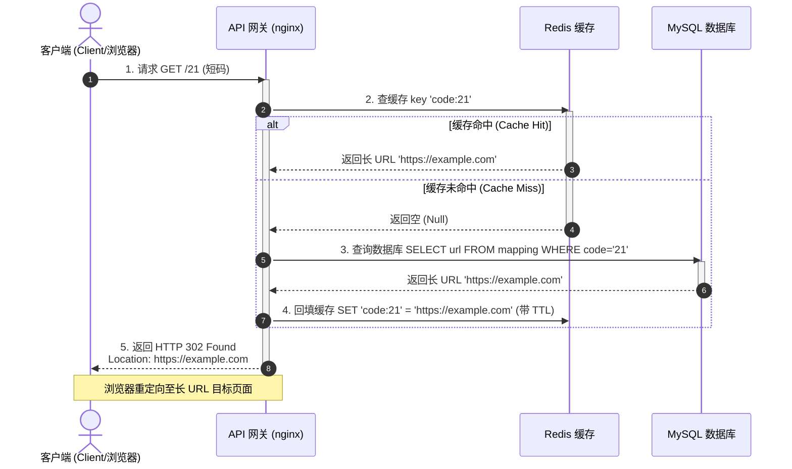
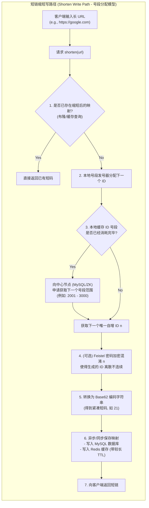

import GlossaryTerm from '@site/src/components/GlossaryTerm';
import GuidedExercise from '@site/src/components/GuidedExercise';
import ResearchNote from '@site/src/components/ResearchNote';
import ChapterMeta from '@site/src/components/ChapterMeta';
import PyRunner from '@site/src/components/PyRunner';
import TradeoffExplorer from '@site/src/components/TradeoffExplorer';
import QuizCard from '@site/src/components/QuizCard';

# M3L8 · 项目：URL 短链系统

<ChapterMeta
  time="约 3–4 小时（小项目）"
  prereqs={[{label: 'M2 系统设计方法', href: '../system-design-bridge/overview'}, {label: 'M3L5 缓存模式', href: './cache-patterns'}]}
  outcome="一个能把长链生成短码、再把短码解析回长链的短链服务，理解发号、base62、读多写少的缓存设计。"
  howToUse="先用 M2 五步法快速过一遍设计，再跑 base62 demo，最后做 lab 实现核心。"
/>

:::tip 把这个月的知识，造成一个真东西
短链服务（bit.ly）是系统设计面试的经典开胃题，也正好综合本月所学：发号（ID 生成）、编码（base62）、读多写少（缓存 + CDN）。这一课你会亲手把它造出来。
:::

## 一、五步法快速设计

用 [M2L1 方法](../system-design-bridge/design-methodology) 过一遍：

1. **澄清**：长链→短码、短码→重定向。短码要短、唯一、（最好）不可枚举。重定向选择 <GlossaryTerm term="HTTP 301" definition="永久重定向：HTTP 状态码。表示该 URL 映射关系已永久改变，浏览器会将重定向关系缓存在本地内存中，下次点击直接由浏览器进行跳转，不打回源站。省带宽但无法统计点击量。">HTTP 301</GlossaryTerm> 还是 <GlossaryTerm term="HTTP 302" definition="临时重定向：HTTP 状态码。表示重定向关系仅当前有效，浏览器不会强缓存此跳转。每次点击短链都必须打回短链服务器解析，方便精确收集 PV/UV 点击分析。">HTTP 302</GlossaryTerm>。
2. **估算**（[M2L3](../system-design-bridge/capacity-estimation)）：读远多于写（每个短链生成一次、被点很多次）→ **读多写少，重缓存**。
3. **HLD**：客户端 → 网关 → 短链服务 → 缓存（热门短码）→ 数据库（code↔url 映射）。



4. **深潜**：① 短码怎么生成（发号 + base62）② 重定向怎么极快（缓存 + CDN）。



5. **取舍**：发号方式（自增/随机/哈希）、强一致 vs 最终一致。

## 二、三个核心概念（分层）

### 基础：核心数据模型

短链服务的本质极简：一张 `code → url` 的映射表，加两个操作——`shorten(url)` 和 `resolve(code)`。难点不在功能，在**怎么生成短码**和**怎么扛海量重定向读**。

### 进阶：发号 + base62 编码

最经典的发号法：用一个**自增 ID**（1, 2, 3...），再把它转成 <GlossaryTerm term="Base62" definition="用 0-9a-zA-Z 共 62 个字符表示数字。把自增 ID 转成 base62，能得到又短又唯一的短码（如 ID 125 → 21）。62^7 已超 3.5 万亿，7 位足够。">base62</GlossaryTerm>（0-9a-zA-Z）字符串。好处：**短**（62^7 > 3.5 万亿）、**唯一**（ID 唯一 → 码唯一，天然防 [L6 重复](../foundations/idempotency)）。

### 深入（选学）：规模下的发号

单机自增 ID 在分布式下会冲突。规模化发号有几条路：**号段（counter range）**——每台机器一次领一批 ID（如 1-1000）本地发，用完再领；或 <GlossaryTerm term="Snowflake" definition="Twitter 提出的分布式 ID 生成：用「时间戳 + 机器号 + 序列号」拼成一个全局唯一、大致有序 of 64 位 ID，无需中心协调。">Snowflake</GlossaryTerm>（时间戳+机器号+序列）。**自增 ID 可枚举**（别人能猜下一个），若要安全防推测，可用 <GlossaryTerm term="Feistel Cipher" definition="Feistel密码混淆：一种对称分组加密结构。在短链生成中常用于将自增的 ID 进行可逆混淆加密成无规律的数字，这样既保留了自增 ID 绝对唯一的防碰撞优点，又使输出结果表现为离散随机，防范他人枚举窥探。">Feistel 密码 (Feistel Cipher)</GlossaryTerm> 对 ID 进行高位加密混淆，再进行 Base62 编码。如果是普通随机/哈希，则需要通过数据库查重以解决碰撞。



<ResearchNote
  title="短链是综合性的入门系统设计题"
  source="System Design：URL Shortener / TinyURL 设计（业界通用题）"
  href="https://github.com/donnemartin/system-design-primer#design-a-system-that-scales-to-millions-of-users-on-aws"
  insight="短链服务被广泛用作系统设计入门题，因为它在极简的功能下，浓缩了发号唯一性、编码、读多写少的缓存、重定向延迟、可枚举性/安全等多个真实权衡。"
  application="做这个项目的价值不在功能，而在练“把方法论落到实现”：从估算推出“重缓存”、从唯一性需求推出“发号 + base62”、从安全推出“要不要不可枚举”。这正是 Month 2→Month 3 的衔接。"
/>

## 三、跟我做一遍：base62 编码

<PyRunner
  expect="往返一致"
  code={`BASE62 = "0123456789abcdefghijklmnopqrstuvwxyzABCDEFGHIJKLMNOPQRSTUVWXYZ"

def to_base62(n):
    if n == 0:
        return BASE62[0]
    s = ""
    while n > 0:
        s = BASE62[n % 62] + s
        n //= 62
    return s

# 自增 ID → 短码：又短又唯一
for i in [1, 61, 62, 125, 1000000]:
    print(f"id={i:>8} → 短码 {to_base62(i)}")

# 重定向就是反查映射表
mapping = {to_base62(125): "https://example.com/very/long/url"}
code = to_base62(125)
print("resolve", code, "→", mapping[code])
print("往返一致")`}
/>

自增 ID 125 变成短码 `21`——短、唯一、按序生成。100 万也才 6 位。**试试**：算一下 7 位 base62 能表示多少短链（62^7），够用几十年。

## 四、动手 Lab（必做）

打开 `labs/month03/m3l8_url_shortener/`：

```bash
python labs/month03/m3l8_url_shortener/test_shortener.py
```

实现短链服务核心：base62 编码 + 发号 + shorten/resolve。

<GuidedExercise
  title="练习指引：造一个短链服务"
  goal="把发号 + base62 + 映射存取串成一个能用的服务——你作品集里的第一个数据系统小项目。"
  hints={[
    'to_base62(n)：不断取 n % 62 作字符、n //= 62，直到 0；n==0 特判返回 "0"。',
    'shorten：用自增 next_id 生成 code，存 code→url，再自增。',
    'resolve：查映射表，不存在返回 None。',
    '两个不同 url 会得到两个不同 code（因为 id 不同）。'
  ]}
  steps={[
    '实现 to_base62(n)（含 n==0）。',
    '实现 URLShortener：next_id 从 1 开始、code_to_url 映射。',
    'shorten(url)：code = to_base62(next_id)，存映射，next_id += 1，返回 code。',
    'resolve(code)：返回 url 或 None。',
    '写测试：base62 边界（0/61/62）、shorten/resolve 往返、未知 code 返回 None、不同 url 不同 code。'
  ]}
  checks={[
    '你的 base62 在 0、61、62 边界正确。',
    'shorten/resolve 能正确往返。',
    '你能解释为什么自增 ID + base62 天然唯一。',
    '你能说出自增 ID 在分布式下的问题和对策（号段/Snowflake）。'
  ]}
/>

## 架构师深潜（Staff+ 视角）

### 1. 发号策略的取舍

<TradeoffExplorer
  title="短码（ID）怎么生成"
  dimensions={['短/紧凑', '唯一性', '不可枚举', '分布式友好', '实现复杂度']}
  options={[
    {
      name: '自增 ID + base62',
      scores: [5, 5, 1, 2, 5],
      note: '最短、天然唯一、简单。但可枚举（能猜下一个）、单点自增在分布式下要协调。',
      whenToUse: '单机/中小规模、不在意可枚举时的默认选择。'
    },
    {
      name: '号段（counter range）',
      scores: [5, 5, 1, 5, 3],
      note: '每台机器批量领一段 ID 本地发。分布式友好、仍紧凑。但仍可枚举。',
      whenToUse: '需要分布式发号、又要短码时的常用方案。'
    },
    {
      name: '随机 / 哈希',
      scores: [4, 3, 5, 5, 3],
      note: '不可枚举、无需中心协调。但要处理碰撞（生成后查重重试）。',
      whenToUse: '短码不能被猜（安全/隐私）时。'
    },
    {
      name: 'Snowflake',
      scores: [2, 5, 3, 5, 3],
      note: '时间戳+机器号+序列，全局唯一、大致有序、无中心。但 ID 较长（转 base62 后码也长）。',
      whenToUse: '海量分布式发号、需大致有序时。'
    }
  ]}
/>

### 2. 重定向是极致读多写少

一个短链生成一次、可能被点击百万次——**读写比极高**（回扣 [M2L3](../system-design-bridge/capacity-estimation)）。所以重定向路径要：缓存热门短码（cache-aside，[M3L5](./cache-patterns)）+ CDN 边缘（[L10](../foundations/request-path)）+ 防三大难题（[M3L7](./cache-problems)）。映射本身可最终一致（[M2L6](../system-design-bridge/cap-consistency)）——短链生成后晚几百毫秒可用，没人在意。

### 3. 真实案例：极简功能，综合取舍

短链把本月几乎所有知识点串了起来：发号（唯一性/L6）、编码、缓存（M3L5-7）、读多写少（M2L3）、最终一致（M2L6）。**这正是系统设计的精髓——简单需求背后是一串相互关联的取舍。** 把它写进作品集，面试时能讲很久。

### 4. 架构师深问（给自己 30 分钟）

- 你的短链要求"不可被枚举"（防爬别人的链接），自增 ID 还能用吗？怎么改？
- 自定义短链（用户指定别名）怎么和自增发号共存？冲突怎么办（回扣 L6 唯一约束）？
- 热门短链被疯狂点击（热点 key），怎么防击穿（回扣 M3L7）？

## 自检清单

- [ ] 我能用五步法快速设计短链服务。
- [ ] 我的 lab base62 + shorten/resolve 正确。
- [ ] 我能解释自增 ID + base62 为什么唯一、为什么可枚举。
- [ ] 我能说出重定向路径怎么用缓存 + CDN 扛读。

## 常见误解

- **"短链服务只是简单存一个 Map，不需要考虑复杂的发号与架构，属于低级增删改查"**: 这是大错特错的面试陷阱。短链的核心难点在“如何无碰撞、防冲突地在分布式微服务下极速发号（分布式 ID 生成）”、“如何在极高的读写比下通过多级缓存与 HTTP 重定向选型降低服务器 QPS”，以及“如何通过混淆算法防范自增短码被他人遍历穷举攻击”。
- **"短链直接使用 MD5 长链哈希值截取前 6 位，实现最为便捷，不需要发号器"**: 极高碰撞隐患。MD5 是哈希算法，截取前 6 位（Base62 表示）仅有不到 560 亿的取值空间。根据生日悖论（Birthday Paradox），当生成短链达到数万甚至十多万条时，哈希碰撞率就会飙升，被迫陷入高成本的“查库重哈希重试”死循环中，导致写入性能严重衰退。
- **"重定向使用 301 永久重定向能减轻短链服务器的大部分压力，应该作为业界统一的标准规范"**: 这严重损害了商业决策。虽然 301 永久重定向可以将后续跳转直接缓存在浏览器中（零打回源站，延迟最低），但这也导致短链服务彻底丧失了统计该短链接后继点击频率、地理位置、用户画像分析（PV/UV/转化率）的核心数据权，使得商业分析无法开展。因此大多数商用短链强制使用 302 临时重定向。

## 五、章末自测

<QuizCard
  questions={[
    {
      q: '短链服务重定向时，HTTP 状态码应该选择 301 (Moved Permanently) 还是 302 (Found)？这两者在架构设计与业务分析上的核心权衡是什么？',
      options: [
        '301 是永久重定向，浏览器会本地强缓存该映射，减少短链服务的 QPS 压力，但会导致服务器失去精准收集每一次短链点击数据（PV/UV）的机会；302 是临时重定向，每次浏览器访问都会打回短链服务，便于收集点击分析指标，但放大了服务器负载。通常若需要流量统计，推荐选择 302。',
        '301 会永久占用短链服务器端口；302 则是完全免费的协议。',
        '由于缓存无法配合 301 工作，必须强制使用 302 进行分布式锁控制。'
      ],
      answer: 0,
      explain: '301 vs 302。301 会被浏览器积极地缓存在本地（永不再次请求服务器），因此读性能最高，但会把统计权弄丢。302 则强制走短链服务重定向，使分析分析（例如统计点击地域、用户代理）最为精确，代价是请求全部落在服务层，必须依赖 Redis 拦截压力。'
    },
    {
      q: '在分布式架构下，如果采用‘自增 ID + Base62’的发号策略，为了避免单点主键自增带来的数据库瓶颈与冲突，以下哪种是高并发工业级系统最常用的号段模式 (Range/Counter Segment Allocation) 解决方案？',
      options: [
        '每台机器随机猜测一个号段，撞上冲突后由共识算法进行回滚。',
        '使用中心节点（如 MySQL 表或 ZooKeeper/Consul）统一分发号段，每台业务服务器每次向中心申请获取一个递增的 ID 范围（例如领用 [10001, 20000]），本地以内存锁极速发号。当本地号段快用完时，再次向中心领用下一段，避免了每一次发号都去读写数据库的强依赖。',
        '强制让所有分布式节点共享同一个单机 Redis 进行 INCR 递增，不使用任何内存缓冲。'
      ],
      answer: 1,
      explain: '号段分发方案。号段模式极大地减轻了数据库的并发写压力。通过将多次网络发号网络往返合并为单次“申请 range”动作，本地利用内存自增发号，单机 TPS 可以轻松过十万。即便中心节点短暂不可用，本地已申请的号段依然能够支撑运行一段时间。'
    },
    {
      q: '如果业务上对短链的安全性有极高要求，必须防止恶意攻击者通过遍历自增 ID 穷举所有的有效短链。架构师应该如何修改短码生成机制？',
      options: [
        '将 Base62 的字符集彻底隐藏，不对任何外网暴露。',
        '放弃自增发号，改用‘高位哈希散列’（如 MD5 截断）或者‘加密随机种子/Feistel 密码混淆算法’，将原本连续递增的 ID 进行可逆混淆加密成无规律的数字，再进行 Base62 编码。这样既保持了短链的短小唯一性，又彻底切断了短链的可枚举猜想特征。',
        '直接放弃短链缩短功能，每次都只使用长 URL 进行路由。'
      ],
      answer: 1,
      explain: '防止短码可枚举。直接使用自增 ID 会产生巨大的数据外泄风险（如猜出竞争对手的优惠码、泄露非公开文档短链）。对 ID 进行对称加密/混淆算法（如使用 Feistel 密码或 Skip32）可以将其可逆地打散为伪随机数字流，在不产生哈希冲突的前置下确保安全。'
    }
  ]}
/>

## 延伸阅读

- [System Design Primer（含短链等题）](https://github.com/donnemartin/system-design-primer)
- [Twitter Snowflake ID](https://en.wikipedia.org/wiki/Snowflake_ID)
- [Month 3 总览](./overview)
