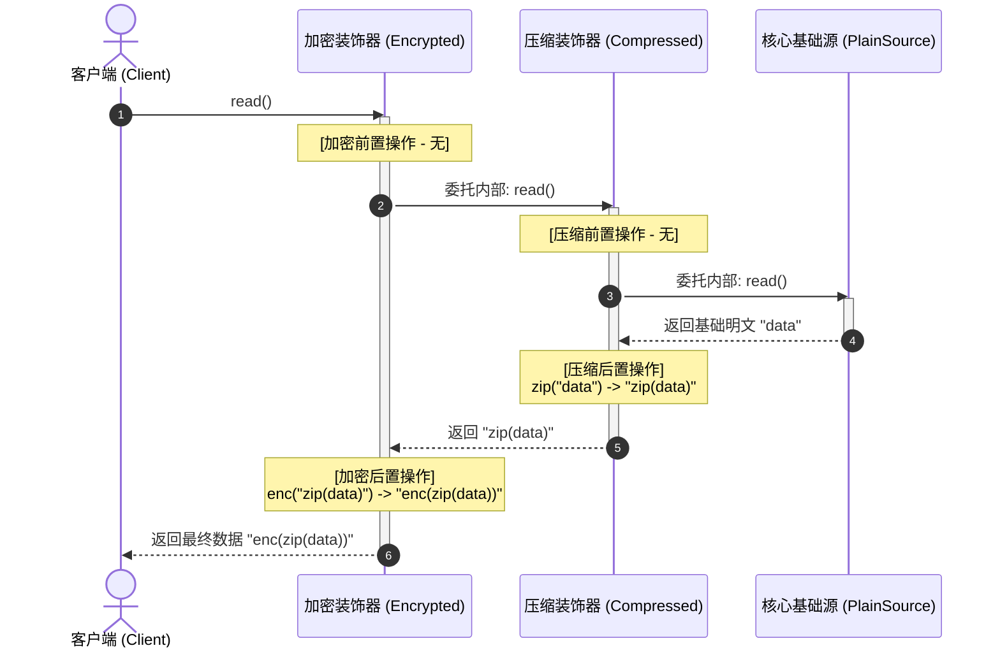
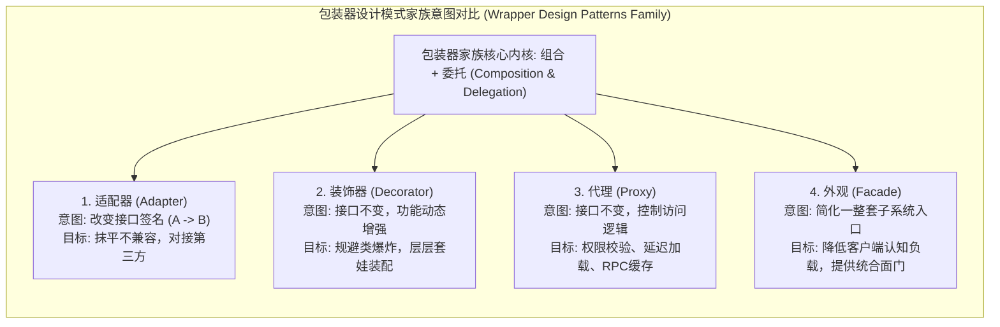

import GlossaryTerm from '@site/src/components/GlossaryTerm';
import GuidedExercise from '@site/src/components/GuidedExercise';
import ResearchNote from '@site/src/components/ResearchNote';
import ChapterMeta from '@site/src/components/ChapterMeta';
import PyRunner from '@site/src/components/PyRunner';
import TradeoffExplorer from '@site/src/components/TradeoffExplorer';
import QuizCard from '@site/src/components/QuizCard';

# M4L8 · 适配器与装饰器

<ChapterMeta
  time="约 2 小时"
  prereqs={[{label: 'M4L4 组合优于继承', href: './composition-over-inheritance'}, {label: 'M4L3 ISP/DIP', href: './solid-lsp-isp-dip'}]}
  outcome="能用适配器抹平“接口不匹配”、用装饰器“不改原类地叠加功能”，并说清两者都是“包装 + 委托”的变体。"
  howToUse="先看接口对不上的痛和“改原类加功能”的痛，再分别用适配器、装饰器解决，最后做 lab。"
/>

:::tip 两个模式，一个内核：包装 + 委托
适配器和装饰器都是“在一个对象外面再包一层”。区别只在目的：**适配器改“接口长相”（让对不上的能对上），装饰器加“功能”（让原能力之外多点东西）。** 两者都是 [M4L4 组合](./composition-over-inheritance) 的直接应用。
:::

## 一、两种常见的“包装”需求

- **接口对不上**：第三方支付 SDK 的方法叫 `make_payment(cents)`，但你系统里所有支付都走 `pay(amount)` 接口。你不想（也不能）改 SDK，怎么让它接进来？
- **想加功能又不想改原类**：你有个 `DataSource.read()`，现在想给某些场景加“压缩”“加密”“缓存”，但不想把 `DataSource` 改成一个塞满开关的[上帝类](./solid-srp-ocp)，也不想为每种组合建子类（压缩+加密、加密+缓存……类爆炸）。

```mermaid
flowchart LR
  subgraph AdapterPattern["适配器模式结构对比 (Adapter Pattern - Translate Interface)"]
    direction LR
    Client["客户端 (Client)"] -->|1. 期望调用 pay(amount:元)| TargetInterface["统一支付接口 (Target Interface)"]
    
    subgraph AdapterWrapper["适配器包装类 (Adapter)"]
      PaymentAdapter["PaymentAdapter<br/>{ pay(amount) }"]
    end
    
    TargetInterface -.->|接口继承| PaymentAdapter
    
    subgraph AdapteeModule["外部第三方服务 (Adaptee)"]
      ThirdPartySDK["ThirdPartySDK<br/>{ make_payment(cents) }"]
    end
    
    PaymentAdapter -->|2. 转换为 cents 并委托委托| ThirdPartySDK
  end
```

## 二、三个核心概念（分层）

### 基础：适配器——包一层做“翻译”

<GlossaryTerm term="Adapter Pattern" definition="适配器模式：在一个接口不兼容的对象外面包一层，把它的接口“翻译”成调用方期望的接口。让原本对不上的两个东西能协作，而不改动任何一方。">适配器</GlossaryTerm>：写一个包装类，对外暴露你系统期望的接口（`pay`），内部**委托**给被适配对象的真实方法（`make_payment`），顺便做单位/参数转换。原 SDK 不用动、你的系统也不用动——适配器在中间翻译。

### 进阶：装饰器——包一层加“功能”

<GlossaryTerm term="Decorator Pattern" definition="装饰器模式：把一个对象包进另一个实现了相同接口的包装对象里，在委托原对象前后“增强”行为（如加日志、缓存、压缩）。可层层嵌套叠加功能，且不改原类。">装饰器</GlossaryTerm>：包装类**实现和被包装对象相同的接口**，在调用原方法的前后做增强（压缩、加密、记日志），然后委托给里面那层。因为接口相同，可以通过运行时动态组合代替 <GlossaryTerm term="Compile-time Inheritance" definition="编译期继承：在编译期或代码编写阶段通过 extends 声明的静态子类继承关系。若需叠加多种行为组合，编译期继承会导致类数量呈指数级暴增（类爆炸），极其僵硬。">编译期静态继承 (Compile-time Inheritance)</GlossaryTerm>，实现**层层套娃**：`Cache(Encrypt(Compress(source)))`——任意叠加，且原类一行不改（开闭）。



### 深入（选学）：两者的区别与“包装家族”

适配器和装饰器结构都是“持有一个对象 + 委托”，区别在意图：
- **适配器**：接口**变了**（A 接口 → B 接口），目的是“能对接”，通常只包一层。
- **装饰器**：接口**不变**（还是同一个接口），目的是“加功能”，可层层叠加。

同属“包装家族”即 <GlossaryTerm term="Wrapper" definition="包装器 (Wrapper)：一类结构型设计模式的统称。它们通过持有一个被包装对象的引用，并将外层的方法调用委托执行，从而在不修改原对象代码的基础上调整其接口长相、控制访问权限或叠加增强功能。">包装器 (Wrapper)</GlossaryTerm> 家族的还有<GlossaryTerm term="Proxy Pattern" definition="代理模式：用一个同接口的代理对象控制对真实对象的访问，可在访问前后插入权限校验、延迟加载、远程调用等控制逻辑。结构同样是“包装 + 委托”。">代理（Proxy）</GlossaryTerm>（控制访问：权限、懒加载、远程）和<GlossaryTerm term="Facade Pattern" definition="外观模式：给一组复杂的子系统提供一个简化的统一入口，让调用方不必直接面对内部的多个类。是“简化接口”的包装。">外观（Facade）</GlossaryTerm>（给复杂子系统一个简化入口）。**它们全是“组合 + 委托”的变体，差别只在意图。** 这再次印证 [M4L4](./composition-over-inheritance)：一大批模式都是同一招。



<ResearchNote
  title="包装：在不改原对象的前提下改变它的接口或能力"
  source="Gamma, Helm, Johnson & Vlissides (GoF, 1994), Design Patterns — Adapter / Decorator / Proxy / Facade"
  href="https://en.wikipedia.org/wiki/Decorator_pattern"
  insight="GoF 的这组结构型模式都靠“持有被包装对象 + 委托”来工作。适配器改接口、装饰器加功能、代理控访问、外观简化接口——意图不同，骨架相同，都是组合优于继承的体现。"
  application="对接第三方/遗留系统 → 适配器；要可叠加的横切增强（日志/缓存/压缩/限流）→ 装饰器；要控制访问 → 代理；要给复杂子系统一个简单门面 → 外观。先认意图，再套结构。"
/>

## 三、跟我做一遍：适配器 + 装饰器

<PyRunner
  rows={28}
  expect="翻译 + 叠加都成功"
  code={`# ---- 适配器：把第三方 SDK 的接口翻译成系统期望的 pay(amount) ----
class ThirdPartySDK:                 # 第三方：方法名和单位都不一样（不能改）
    def make_payment(self, cents): return "SDK 扣款 %d 分" % cents

class PaymentAdapter:                # 适配器：对外 pay(元)，内部翻译成 make_payment(分)
    def __init__(self, sdk): self.sdk = sdk
    def pay(self, amount):           # 系统统一接口
        return self.sdk.pay_translate(amount) if False else self.sdk.make_payment(int(amount * 100))

pay_gateway = PaymentAdapter(ThirdPartySDK())
print(pay_gateway.pay(9.9))          # 调用方只认 pay(元)

# ---- 装饰器：同接口包装，叠加功能，可套娃 ----
class PlainSource:                   # 基础能力
    def read(self): return "data"

class Compressed:                    # 装饰器：接口相同(read)，加“压缩”
    def __init__(self, inner): self.inner = inner
    def read(self): return "zip(" + self.inner.read() + ")"

class Encrypted:                     # 装饰器：加“加密”
    def __init__(self, inner): self.inner = inner
    def read(self): return "enc(" + self.inner.read() + ")"

# 任意叠加，且 PlainSource 一行不改（开闭）
src = Encrypted(Compressed(PlainSource()))
print("叠加后:", src.read())          # enc(zip(data))
print("翻译 + 叠加都成功")`}
/>

适配器让接口对不上的 SDK 无缝接入；装饰器让“压缩/加密”像套娃一样自由叠加，原类不动。**试试**：再写一个 `Logged` 装饰器（read 前后打日志），套到最外层——你会发现加功能 = 包一层，从不改原类。

## 四、动手 Lab（必做）

打开 `labs/month04/m4l8_wrappers/`：

```bash
python labs/month04/m4l8_wrappers/test_wrappers.py
```

实现一个适配器（接口翻译）和可叠加的装饰器（同接口增强），原类均不修改。

<GuidedExercise
  title="练习指引：适配器与装饰器"
  goal="把“包装+委托”做成代码：适配器翻译接口、装饰器叠加功能，都不改原对象。"
  hints={[
    '适配器：对外暴露系统接口，内部委托被适配对象并转换参数。',
    '装饰器：实现和被包装对象相同的接口，在委托前后做增强。',
    '装饰器要能层层嵌套（因为接口相同）。',
    '两者都持有被包装对象（组合），都不修改原类。'
  ]}
  steps={[
    '适配器：给一个接口不同的类包一层，翻译成统一接口。',
    '装饰器基类/约定：实现相同接口、持有 inner、委托。',
    '写 2 个装饰器（如 compress、encrypt），可叠加。',
    '写测试：适配器翻译正确；装饰器单个/叠加都正确；原类未被修改。'
  ]}
  checks={[
    '你能区分适配器（改接口）和装饰器（加功能）。',
    '你的装饰器能层层叠加。',
    '你的适配器和装饰器都没改原类（开闭）。',
    '你能说出它们和代理/外观同属“包装+委托”。'
  ]}
/>

## 架构师深潜（Staff+ 视角）

### 1. 包装家族：意图各不同

<TradeoffExplorer
  title="四种“包装”模式的意图"
  dimensions={['改接口', '加功能', '可叠加', '控制访问', '简化入口']}
  options={[
    {
      name: '适配器 Adapter',
      scores: [5, 1, 1, 1, 1],
      note: '把不兼容接口翻译成期望接口。对接第三方/遗留系统的首选。',
      whenToUse: '接口对不上、且不能改任一方时。'
    },
    {
      name: '装饰器 Decorator',
      scores: [1, 5, 5, 2, 1],
      note: '同接口叠加横切功能（日志/缓存/压缩/限流），可层层套。',
      whenToUse: '要在不改原类的前提下，灵活组合附加能力时。'
    },
    {
      name: '代理 Proxy',
      scores: [1, 2, 1, 5, 1],
      note: '同接口控制访问：权限、懒加载、远程调用、缓存。',
      whenToUse: '要在访问对象前后插入控制逻辑时。'
    },
    {
      name: '外观 Facade',
      scores: [3, 1, 1, 1, 5],
      note: '给一堆复杂子系统一个简化的统一入口，降低使用方认知负担。',
      whenToUse: '要把复杂子系统藏在一个简单门面后时。'
    }
  ]}
/>

### 2. 装饰器是“横切关注点”的优雅解法

日志、缓存、限流、重试、鉴权这些<GlossaryTerm term="Cross-cutting Concern" definition="横切关注点：跨越很多模块、与核心业务正交的关注点（如日志、缓存、限流、鉴权）。适合用装饰器/中间件/AOP 统一叠加，而不是散落在每个业务方法里。">横切关注点</GlossaryTerm>，散落在每个业务方法里就是灾难。装饰器（以及它的近亲——Web 框架的**中间件**、Python 的 `@decorator`）让你把它们抽出来、按需叠加。**理解装饰器，你就懂了中间件、拦截器、AOP 的共同原理。**

### 3. 真实案例：适配器抹平异构、装饰器构建管道

云迁移时用适配器统一各家存储/支付 SDK（[回扣 DIP](./solid-lsp-isp-dip)）；Web 框架用装饰器/中间件串起“鉴权→限流→日志→业务→压缩”的请求管道（[回扣 L10 请求路径](../foundations/request-path)）。这两个模式是构建“可对接、可扩展”系统的日常工具。

### 4. 架构师深问（给自己 30 分钟）

- 你系统里对接的第三方/遗留接口，是直接散用还是用适配器统一？换供应商时要改多少处？
- 你的日志/缓存/限流是散在业务代码里，还是用装饰器/中间件抽出来叠加？
- 装饰器套太多层会难调试（栈很深）。你怎么权衡“灵活叠加”和“可读可调试”？

## 自检清单

- [ ] 我能区分适配器（改接口）和装饰器（加功能）。
- [ ] 我的 lab 适配器翻译接口、装饰器可叠加，且都不改原类。
- [ ] 我理解代理/外观也是“包装+委托”的变体。
- [ ] 我能把装饰器和中间件/横切关注点联系起来。

## 常见误解

- **"既然适配器模式和装饰器模式底层实现都是‘持有一个对象且进行方法委托’，那么把它们当成同一种模式也无伤大雅"**: 属于只看结构忽略意图的粗糙理解。设计模式的判定必须是“结构 + 意图”的统合。适配器（Adapter）的意图是“改变接口形状”，目的是消除接口不兼容的障碍；而装饰器（Decorator）的意图是“在不改变接口形状的前提下动态增强功能”，并且由于其要求与被包装者实现相同的接口，因此天生支持“层层嵌套（套娃）”组合，这在适配器模式中是极少也极难见到的。
- **"当我们需要为基础数据源叠加‘压缩、解密、缓存’等多种可选功能时，继承依然是最直接简单的办法，只要为每种组合派生一个子类即可"**: 典型的继承滥用，会导致灾难性的类爆炸（Class Explosion）。如果有 N 个独立可选的功能，用继承来实现所有组合，你需要派生出近乎 $2^N$ 个子类（如 CompressedPlainSource、EncryptedPlainSource、CompressedEncryptedPlainSource...）。而如果使用装饰器模式，我们只需编写 N 个独立的同接口包装类，在运行时像搭积木一样层层套娃装配（如 `src = Encrypted(Compressed(source))`），仅需 N 个类文件即可覆盖所有排列组合，且极其灵活易修改。
- **"Python / JS 中的 @decorator 语法糖就是设计模式中的装饰器模式本身"**: 概念上的张冠李戴。语言级的 `@decorator` 语法糖本质上是一个“高阶函数函数接收器”，它可以在不修改原函数定义的前提下，对函数调用进行代理控制；而经典 GoF 设计模式中的“装饰器模式”指的是一种“基于类型系统和对象组合”的结构性模式——要求包装类与产品实现相同的基类/接口（Interface）。虽然它们在解决“横切关注点”的逻辑意图上很相似，但在实现维度上，设计模式更强调整体类型的透明对齐与运行时可替代性。

## 常见误解自测

<QuizCard
  questions={[
    {
      q: '适配器模式（Adapter）与装饰器模式（Decorator）的最本质结构区别与意图差异是？',
      options: [
        '适配器模式改变接口签名以解决兼容性问题，通常只包一层；而装饰器模式在保持原有接口签名完全不变的前提下，通过层层嵌套实现横切关注点的动态功能叠加与增强。',
        '适配器通常使用继承，装饰器只允许使用组合。',
        '适配器运行在客户端，装饰器运行在服务端。'
      ],
      answer: 0,
      explain: '适配器与装饰器的异同点。两者骨架都是‘持有+委托’，但适配器的意图是‘翻译’，改变了接口的形状；装饰器的意图是‘增强’，必须实现与原组件一模一样的接口以支持‘套娃叠加’。'
    },
    {
      q: '装饰器模式是如何有效解决‘类爆炸（Class Explosion）’问题的？',
      options: [
        '它通过在运行时动态层层嵌套不同的包装对象（如 Encrypted(Compressed(PlainSource))），避免了在编译期为了实现‘加密且压缩’、‘缓存且加密’等各种功能组合而被迫声明繁多且冗长的子类（如 EncryptedCompressedPlainSource 等）。',
        '它把所有的子类代码都压缩在了一个单例模式类中。',
        '它使用垃圾回收器直接自动销毁了不需要的类文件。'
      ],
      answer: 0,
      explain: '类爆炸的成因与消除。如果我们用多重继承去实现功能的组合，每增加一个可选维度就会导致子类数量呈指数级增加。而装饰器将不同维度拆成独立的同接口包装器，在运行时按需拼装，保持了类数量的线性平稳。'
    },
    {
      q: '代理模式（Proxy）与装饰器模式（Decorator）的结构极其相似，它们在‘意图’上的核心差异是什么？',
      options: [
        '代理只在 C++ 中有用，装饰器只在 Python 中有用。',
        '装饰器的重心是‘动态增减或增强对象的功能’，通常由外部客户决定套几层；而代理模式的重心是‘控制对被代理对象的访问’（如延迟加载、安全校验、权限拦截），通常在代理内部直接初始化或隐藏被代理对象的细节，客户端并不感知发生了代理。',
        '代理模式的性能是装饰器的一百倍。'
      ],
      answer: 1,
      explain: '代理与装饰器的异同。虽然它们接口也不变，但代理扮演的是‘门禁控管或替身’角色，往往决定了被代理者是否能够被访问、何时加载等；装饰器则是单纯地为对象披上多层‘外套’来强化其能力。'
    }
  ]}
/>

## 延伸阅读

- [Decorator Pattern (Wikipedia)](https://en.wikipedia.org/wiki/Decorator_pattern)
- [Adapter Pattern (Wikipedia)](https://en.wikipedia.org/wiki/Adapter_pattern)
- [下一课：状态机与电梯](./state-machine-elevator)
