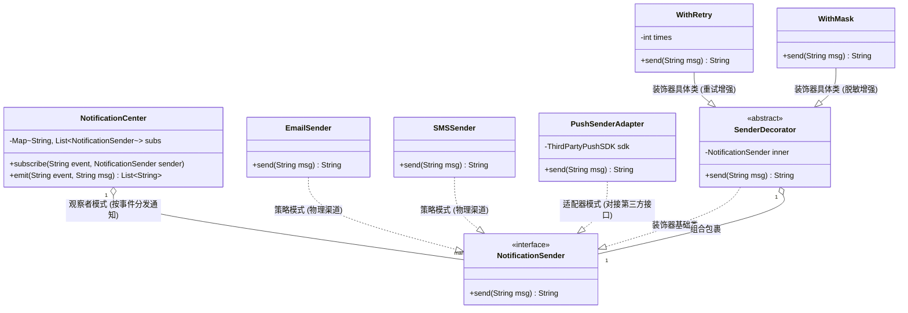
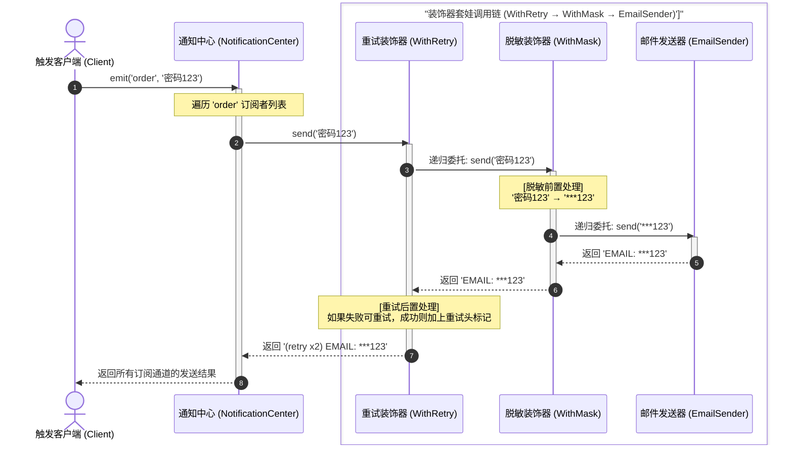
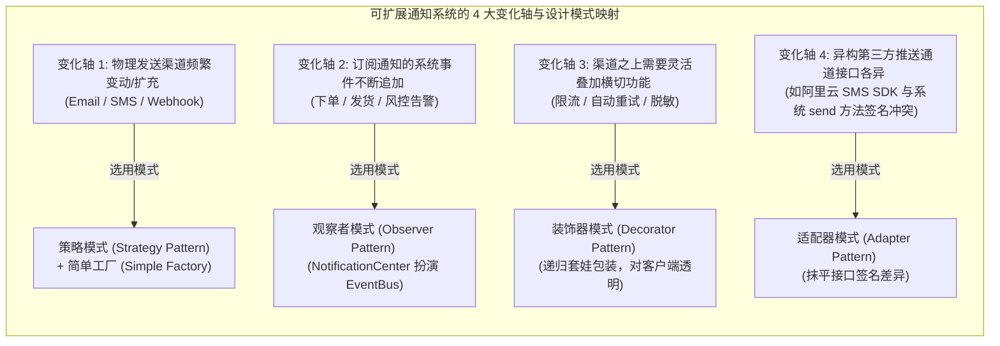

import GlossaryTerm from '@site/src/components/GlossaryTerm';
import GuidedExercise from '@site/src/components/GuidedExercise';
import ResearchNote from '@site/src/components/ResearchNote';
import ChapterMeta from '@site/src/components/ChapterMeta';
import PyRunner from '@site/src/components/PyRunner';
import TradeoffExplorer from '@site/src/components/TradeoffExplorer';
import QuizCard from '@site/src/components/QuizCard';

# M4L12 · Capstone：可扩展通知系统

<ChapterMeta
  time="约 3 小时"
  prereqs={[{label: 'Month 4 全部', href: './overview'}]}
  outcome="能综合运用 SOLID + 策略/工厂/观察者/装饰器，设计一个“加渠道/加规则/加格式都不改核心”的通知系统，并讲清每个模式解决的变化。"
  howToUse="把它当一道完整 LLD 题：先想清楚“什么会变”，再为每个变化轴选模式，最后做 lab 实现。"
/>

:::tip 月末综合题：让“变化”自己对号入座到模式
通知系统是检验本月所学的绝佳载体，因为它的每一处都会变：渠道会加（邮件→短信→push→飞书）、格式会变、触发事件会增、还要能给某些通知叠加“限流/重试/脱敏”。这一课你要做的，是**为每一种变化，选对一个模式**。
:::

## 一、需求：一个到处都会变的系统

“做一个通知系统：当系统里发生某些事件（下单、告警、营销）时，按规则把消息通过合适的渠道发给用户。” 先识别**变化轴**（[M4L1](./change-driven-design)）：

- 渠道会变/会加：email、SMS、push、webhook……
- 触发通知的事件会增：下单、发货、风控告警、促销……
- 每条通知可能要叠加横切处理：限流、重试、脱敏、加签名……
- 消息格式/模板会变。

每一条“会变”，都对应这个月的一个模式。

## 二、为每个变化轴选模式



### 基础：渠道 → 策略 + 工厂；事件 → 观察者

- **渠道（怎么发）** = 一族可替换算法 → <GlossaryTerm term="Strategy Pattern" definition="策略模式：把“通过哪种渠道发送”封装成可替换的策略对象，统一 send 接口，加渠道不改核心。">策略</GlossaryTerm>（每个渠道一个 sender，统一 `send(msg)`），再用[工厂](./factory-pattern)按名字创建/选渠道。
- **事件 → 谁该被通知** = 一对多、订阅者会增减 → <GlossaryTerm term="Observer Pattern" definition="观察者模式：事件发生时，发布者通知所有订阅了该事件的通知规则/接收者，发布者不认识具体订阅者，可随时增减。">观察者</GlossaryTerm>（事件总线，规则订阅事件）。

### 进阶：横切处理 → 装饰器；创建 → 工厂

- **限流/重试/脱敏/日志**这些[横切关注点](./adapter-decorator) = 不改原 sender 地叠加 → <GlossaryTerm term="Decorator Pattern" definition="装饰器模式：用同 send 接口的包装层给某个渠道叠加限流/重试/脱敏等能力，可层层组合，原 sender 不改。">装饰器</GlossaryTerm>（`RateLimited(Retrying(EmailSender()))`）。


- **对接第三方 SDK**（各家 push 服务接口不一） → <GlossaryTerm term="Adapter Pattern" definition="适配器模式：在一个接口不兼容的对象外面包一层，把它的接口“翻译”成调用方期望的接口。让原本对不上的两个东西能协作，而不改动任何一方。">适配器 (Adapter Pattern)</GlossaryTerm>统一成 `send` 接口。

### 深入（选学）：用 SOLID 把它们粘好

整套设计的骨架是 SOLID：每个 sender [单一职责](./solid-srp-ocp)、核心依赖 sender 抽象（<GlossaryTerm term="Dependency Inversion Principle" definition="依赖倒置原则 (DIP)：高层模块不应该依赖低层模块，二者都应该依赖其抽象；抽象不应该依赖细节，细节应该依赖抽象。这里通知核心只依赖统一的 Sender 接口，不依赖具体的 Email/SMS 等物理实现。">DIP (依赖倒置原则)</GlossaryTerm>，便于测试时注入假渠道）、加渠道/规则[对扩展开放](./change-driven-design)。**关键提醒**：别因为“能用模式”就处处用——稳定的部分（消息数据结构、用户偏好）保持朴素（[YAGNI](./change-driven-design)）。Capstone 考的就是这种**判断力**：哪里该灵活、哪里该简单。



<ResearchNote
  title="组合多个模式构建可演进系统"
  source="GoF, Design Patterns（模式协作）；Fowler, Patterns of Enterprise Application Architecture"
  href="https://martinfowler.com/eaaCatalog/"
  insight="真实系统很少只用一个模式，而是多个模式协作：策略管算法变化、工厂管创建、观察者管事件解耦、装饰器管横切增强，SOLID 提供粘合的总原则。理解它们如何配合，比单独会每个更重要。"
  application="设计任何“到处会变”的系统（通知、支付、导出、风控），都可以这样拆：列出变化轴 → 每轴选一个模式 → 用 DIP/SRP 把它们组合 → 稳定处保持简单。这是把设计模式从“知识”变成“能力”的最后一步。"
/>

## 三、跟我做一遍：策略渠道 + 装饰器增强 + 事件订阅

<PyRunner
  rows={34}
  expect="通知系统跑通"
  code={`# --- 渠道：策略（统一 send 接口）---
class EmailSender:
    def send(self, msg): return "EMAIL: " + msg
class SMSSender:
    def send(self, msg): return "SMS: " + msg

# --- 装饰器：给任意渠道叠加横切能力（同 send 接口）---
class WithRetry:
    def __init__(self, inner, times=2):
        self.inner = inner; self.times = times
    def send(self, msg):
        return "[retry x%d] " % self.times + self.inner.send(msg)
class WithMask:                      # 脱敏：把"密码"打码
    def __init__(self, inner): self.inner = inner
    def send(self, msg): return self.inner.send(msg.replace("密码", "***"))

# --- 事件总线：观察者（事件 -> 订阅的渠道）---
class NotificationCenter:
    def __init__(self): self._subs = {}      # event -> [sender,...]
    def subscribe(self, event, sender):
        self._subs.setdefault(event, []).append(sender)
    def emit(self, event, msg):
        results = []
        for s in self._subs.get(event, []):  # 通知所有订阅者，core 不认识具体渠道
            results.append(s.send(msg))
        return results

center = NotificationCenter()
# 下单事件：邮件(带重试) + 短信(脱敏)
center.subscribe("order", WithRetry(EmailSender()))
center.subscribe("order", WithMask(SMSSender()))
for line in center.emit("order", "您的订单已创建，密码勿泄露"):
    print(line)

# 加一个“告警走短信”——core 一行不改（开闭 + 观察者 + 策略）
center.subscribe("alert", SMSSender())
print(center.emit("alert", "磁盘告警"))
print("通知系统跑通")`}
/>

四个模式协作：**策略**让渠道可换、**装饰器**让重试/脱敏可叠加、**观察者**让事件与渠道解耦、整体靠 **DIP** 让 core 只认 `send` 抽象。加渠道、加事件、加横切能力，`NotificationCenter` 都不用改。**试试**：写一个 `WithRateLimit` 装饰器并叠加到邮件渠道；再加一个 `PushSender` 订阅 `order` 事件。

## 四、动手 Lab（必做）

打开 `labs/month04/m4l12_notification/`：

```bash
python labs/month04/m4l12_notification/test_notification.py
```

实现可扩展通知系统：策略渠道 + 可叠加装饰器 + 事件订阅，做到加渠道/规则/增强都不改核心。

<GuidedExercise
  title="练习指引：组合多个模式"
  goal="把策略/装饰器/观察者/DIP 组合成一个“处处可扩展、核心不改”的通知系统。"
  hints={[
    '所有渠道统一 send(msg) 接口（策略 + DIP）。',
    '装饰器同 send 接口、持有 inner、可叠加（重试/脱敏/限流）。',
    'NotificationCenter 用事件->订阅者列表（观察者）。',
    '加渠道/事件/装饰器都不应改 NotificationCenter（开闭）。'
  ]}
  steps={[
    '实现 2 个渠道（Email/SMS），统一 send。',
    '实现 2 个装饰器（WithRetry/WithMask），同接口可叠加。',
    '实现 NotificationCenter：subscribe(event, sender)、emit(event, msg)。',
    '写测试：订阅者都收到、装饰器生效且可叠加、加新渠道/事件不改 center。'
  ]}
  checks={[
    '你能为每个变化轴说出用了哪个模式、解决什么。',
    '你的渠道、装饰器都面向统一 send 接口。',
    '你能加渠道/事件/增强而不改核心。',
    '你在稳定处保持了简单（没有过度设计）。'
  ]}
/>

## 架构师深潜（Staff+ 视角）

### 1. 从“进程内通知”到“通知平台”

<TradeoffExplorer
  title="通知系统的演进阶段"
  dimensions={['解耦/可扩展', '可靠性', '异步/抗峰', '复杂度', '适用规模']}
  options={[
    {
      name: '直接调用各渠道',
      scores: [1, 2, 1, 5, 1],
      note: '业务里直接 send。简单但强耦合、加渠道改一片、同步阻塞。',
      whenToUse: '原型/极小系统。'
    },
    {
      name: '进程内模式组合（本课）',
      scores: [4, 3, 2, 4, 3],
      note: '策略+装饰器+观察者，解耦可扩展。但仍多为同步、单进程。',
      whenToUse: '中小系统、单服务内的通知。'
    },
    {
      name: '独立<GlossaryTerm term="Notification Platform" definition="通知平台 (Notification Platform)：一种集中的、高可靠性的微服务架构系统。通常由外部消息队列驱动，提供模板渲染、渠道路由、排队重试、并发控制、多维度限流及全局送达审计等能力的综合通信中枢。">通知平台 (Notification Platform)</GlossaryTerm>（队列驱动）',
      scores: [5, 5, 5, 2, 5],
      note: '事件进队列、消费者按渠道发、带重试/DLQ/限流/模板中心。可靠、异步、可独立扩展。',
      whenToUse: '大规模、多业务线共用、要可靠异步时。'
    }
  ]}
/>

### 2. 同一套模式，换了基础设施就成了平台

本课的进程内设计，放大到分布式就是真实的通知平台：观察者 → [消息队列](../data-cache-queue/message-queues)（事件入队、异步消费）；装饰器的限流/重试 → 消费侧的[可靠投递（ack/DLQ）](../data-cache-queue/message-queues)；策略渠道 → 渠道服务集群。**你这个月学的模式，就是大型系统的微缩骨架**——理解了进程内版本，分布式版本只是换了通信媒介。

### 3. 本月能力检验

做完这个 Capstone，你应该能：看一段烂代码说出它违反哪条原则、该用什么模式重构；面对一个新需求先识别变化轴再选模式；并且知道**什么时候不该用模式**。这套“从变化推导设计”的能力，正是从“会写代码”到“能做设计”的分水岭，也是后续 Month 5+ 架构课的地基。

### 4. 架构师深问（给自己 30 分钟）

- 把本课通知系统改成“事件入队、异步消费”，哪些模式保留、哪些被基础设施取代？
- 用户有“免打扰时段/渠道偏好/去重”需求，你会在哪一层、用什么模式实现？
- 怎么保证“同一通知不重复发”（[回扣 L6 幂等](../foundations/idempotency)）？装饰器能做去重吗，代价是什么？

## 自检清单

- [ ] 我能为每个变化轴选对模式并说清理由。
- [ ] 我的 Capstone 渠道/装饰器面向统一接口、可组合。
- [ ] 我能加渠道/事件/增强而不改核心。
- [ ] 我能讲清这套设计放大到分布式后的样子。

## 常见误解

- **"既然我们学习了这么多强大的模式，为了体现架构师的设计水平，我们应该把所有的实体对象都封装得极其抽象，把所有模式（装饰器、策略、观察者、适配器）不分场合地通通套用上去"**: 典型的过度设计灾难。软件设计的核心是**权衡（Trade-off）**与控制复杂度。对于业务中完全不具备易变性诉求的稳定模块（例如基本的消息属性数据结构、接收者的偏好模型），强行引入工厂和代理除了大幅降低运行速度、增加数倍冗余代码外没有任何收益。应该坚决奉行 **YAGNI** 原则，只在真正的“变化轴”上配置扩展点。
- **"通知系统实在太简单了，不就是拼接一下字符串、直接调个邮件或者短信 SDK 发送吗？进程内直接写一万个 `send_email` 才是最省事高效的"**: 缺乏长期维护视角的典型思维。对于个人小 Demo 或极其临时的一次性脚本，这确实最快。但对于企业级系统，随着渠道增加（如飞书、钉钉、App Push）、安全合规横切策略插入（对手机号脱敏、全局防刷限流、超时重试），如果依然使用面向过程的堆砌代码，你将面临极其恐怖的**霰弹式修改（Shotgun Surgery）**。通过策略与装饰器对渠道和横切做多态隔离，是高内聚低耦合的工程刚需。
- **"我已经彻底精通了这门 Capstone 通知系统中的设计模式组合，只要把它们原封不动地照搬进我们公司大流量的微服务架构中，就能够解决一切通知的可靠投递问题了"**: 忽视了运行环境从“进程内”向“分布式”演进时的核心架构裂变。在单进程中，利用简单的 lambda 装饰和 map 字典足以应付；但在分布式高并发场景下，直接同步调用各大服务渠道会瞬间拖垮核心交易链路。我们必须打破同步，转而引入**事件驱动架构 (EDA)**，利用分布式消息队列（Message Queue）做削峰填谷与异步消费，并引入全局幂等分布式去重、死信队列（DLQ）补偿来规避消息丢失与重发冲突。这需要分布式架构设计能力的加持。

## 常见误解自测

<QuizCard
  questions={[
    {
      q: '在这个 Capstone 通知系统设计中，如何巧妙地利用装饰器模式（Decorator）与策略模式（Strategy）相互配合，实现既能支持多种物理渠道发送，又能灵活叠加‘限流/重试/审计’等多维度特性的高内聚设计？',
      options: [
        '每一个渠道类内部硬编码写死所有的限流和重试逻辑，通过布尔标志位开关来决定是否启用。',
        '核心发送接口定义为统一的 `send(msg)` 抽象策略。具体的物理发送端（如 EmailSender, SMSSender）实现该策略接口。同时，横切业务增强组件（如 WithRetry, WithRateLimit）同样实现该 `send(msg)` 接口并包装另一个 Sender 策略实例，从而利用‘同接口委托’在运行时灵活套娃装配，满足开闭原则。',
        '把物理发送端全部定义为 WithRetry 的子类，通过多重继承合并功能。'
      ],
      answer: 1,
      explain: '策略与装饰器的黄金配合。策略模式提供了通道的‘横向替换多态’，而装饰器模式提供了‘纵向行为叠加能力’。两者接口保持对齐，通过运行时对象组合（Composition），无需任何修改就能叠加如重试、限流等横切关注点，是高度解耦的最佳实践。'
    },
    {
      q: '从‘进程内同步通知系统’演进到分布式大规模的‘消息通知平台（Notification Platform）’时，我们需要进行哪些核心架构变迁以应对超大并发和高可靠性挑战？',
      options: [
        '直接将进程内的 `NotificationCenter` 设置为单例模式（Singleton）即可应对百万级并发。',
        '利用物理内存扩容服务器到 2TB，以防止内存溢出。',
        '必须打破进程内的同步调用，在发布者和发送引擎之间引入分布式消息队列（如 Kafka/RabbitMQ）进行削峰填谷，并在下游建立独立的发送微服务集群，配合分布式死信队列（DLQ）与幂等去重校验实现失败重试与消息可靠达。'
      ],
      answer: 2,
      explain: '进程内通知与分布式平台演进。进程内的观察者/发布订阅是同步阻塞的，在海量通知下会因为调用慢接口被拖垮。引入消息队列（EDA）进行异步解耦，配合数据库去重与死信重投机制，是从代码模式走向分布式高可用架构的必由之路。'
    },
    {
      q: '如果某个第三方短信通道供应商（例如阿里云短信）的发送方法需要传入特定的字典参数，且不支持统一的 `send(message: str)` 签名，我们该如何在不破坏通知系统主干代码兼容性的前提下把它接入系统？',
      options: [
        '直接修改 `NotificationCenter` 内部的逻辑，专门为阿里云短信写一个 `if-else` 分支判断判断。',
        '应用适配器模式（Adapter Pattern），创建一个实现了系统统一 `send(msg)` 接口的 `AliyunSmsAdapter` 类，在其内部持有阿里云 SDK 的客户端实例，将入参的 message 转换为阿里云要求的特定参数格式，并执行实际发送，以此抹平接口不兼容。',
        '强制要求阿里云短信修改其 SDK 的方法签名。'
      ],
      answer: 1,
      explain: '适配器模式的经典应用。当第三方库或遗留系统的接口与我们自己系统的标准抽象对不上时，切忌直接在业务主干上写特例 if，这会严重污染架构。编写一个 Adapter 进行接口的‘翻译’与‘委派’，符合面向抽象的依赖倒置原则。'
    }
  ]}
/>

## 延伸阅读

- [Patterns of Enterprise Application Architecture (Fowler)](https://martinfowler.com/eaaCatalog/)
- [Month 4 总览](./overview)
- [进入 Month 5：核心架构能力](../core-components/overview)
