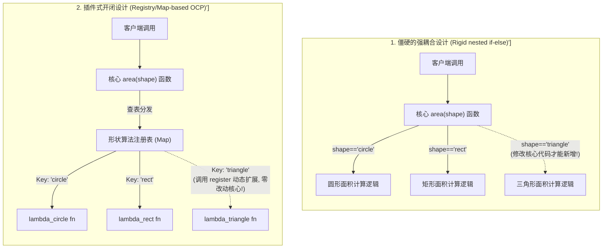
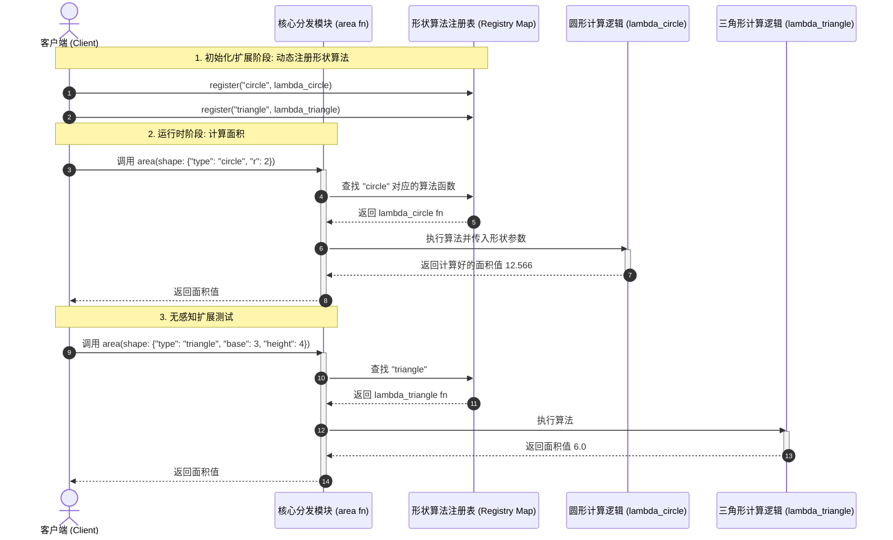
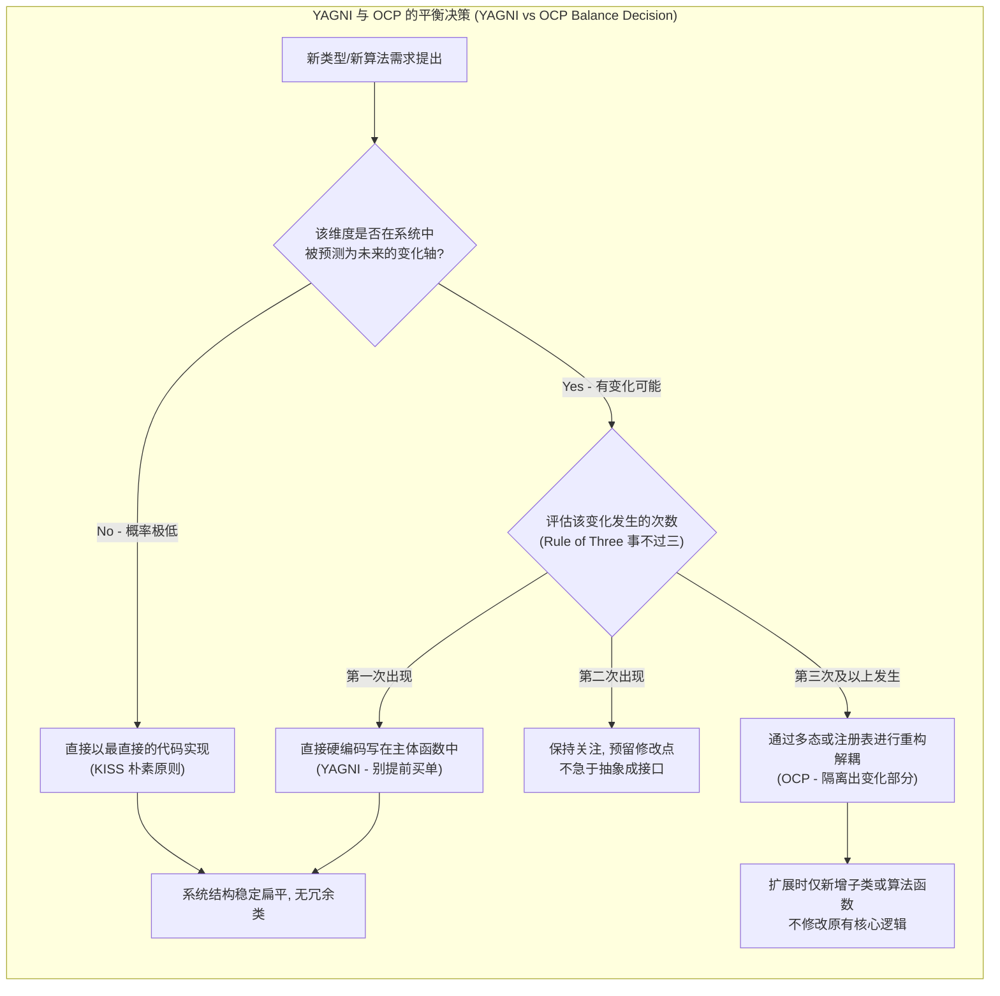

import GlossaryTerm from '@site/src/components/GlossaryTerm';
import GuidedExercise from '@site/src/components/GuidedExercise';
import ResearchNote from '@site/src/components/ResearchNote';
import ChapterMeta from '@site/src/components/ChapterMeta';
import PyRunner from '@site/src/components/PyRunner';
import TradeoffExplorer from '@site/src/components/TradeoffExplorer';
import QuizCard from '@site/src/components/QuizCard';

# M4L1 · 变化驱动设计

<ChapterMeta
  time="约 2 小时"
  prereqs={[{label: 'L2 模块与契约', href: '../foundations/modules-and-contracts'}, {label: 'M2L9 LLD', href: '../system-design-bridge/lld-classes'}]}
  outcome="能在代码里识别“会变化的部分”，用封装变化 + 开闭原则让加新类型时不必改旧代码。"
  howToUse="先跑“加新类型就要改 if-else”的反例，再看怎么封装变化让它开闭，最后做 lab。"
/>

:::tip 整个设计模式的源头，就这一句话
"找到你代码里会变化的部分，把它和不变的部分分开。" 几乎所有设计模式都是这句话的不同应用。学会识别变化点，你就抓住了设计的钥匙——而不是去背 23 个模式名。
:::

## 一、每加一种类型，就要改一处 if-else

你的算面积函数里写满了 `if shape == "circle" ... elif shape == "rect" ...`。产品要加"三角形"，你又得回去改这个函数。加支付方式、加通知渠道、加文件格式——同样的痛：**每次需求变化，都要去修改已有的、已经测试过的代码**，改一处错一片。问题的根源：**你把"会变的部分"和"不变的骨架"混在了一起。**



## 二、三个核心概念（分层）

### 基础：封装变化 + 三条朴素原则

设计的第一动作：**识别什么会变（变化点），把它隔离/封装起来**，让不变的骨架不受它影响。这本身符合 <GlossaryTerm term="Single Responsibility Principle" definition="单一职责原则 (SRP)：SOLID 原则的第一项。主张一个类或模块应该有且仅有一个引起它变化的原因。将‘会变的地方’剥离，使其只承担单一的职责。">单一职责原则 (Single Responsibility Principle)</GlossaryTerm>。在具体实践中，配合三条朴素原则：

- <GlossaryTerm term="DRY" definition="Don't Repeat Yourself：同一份知识只在一处表达，避免复制粘贴导致改一处漏一处。">DRY</GlossaryTerm>：别重复（同一逻辑别写多遍）。
- <GlossaryTerm term="KISS" definition="Keep It Simple：优先用最简单能解决问题的方案，别过度复杂。">KISS</GlossaryTerm>：保持简单。
- <GlossaryTerm term="YAGNI" definition="You Aren't Gonna Need It：不要为“将来也许需要”的功能提前设计，等真需要再加。防止过度设计。">YAGNI</GlossaryTerm>：别为臆想的需求提前造抽象。

### 进阶：开闭原则

封装变化的目标，是达成<GlossaryTerm term="Open-Closed Principle" definition="开闭原则（OCP）：软件实体应对扩展开放、对修改关闭。加新功能时通过“新增代码”实现，而不是“修改已有代码”。">开闭原则（OCP）</GlossaryTerm>：**对扩展开放、对修改关闭**。加"三角形"时，你应该能**新增**一段代码，而不必**修改**算面积的核心逻辑。怎么做到？把"每种形状怎么算"做成可插拔的（注册表/多态），核心只负责"分发"。



### 深入（选学）：抽象是有成本的，别过度

OCP 很美，但存在不可忽视的 <GlossaryTerm term="Abstraction Cost" definition="抽象成本：在系统设计中引入接口、适配层或中间件等解耦手段时所付出的代价。包括代码认知负荷上升、调试复杂度增加、以及间接调用引入的轻微运行性能损耗。">抽象成本 (Abstraction Cost)</GlossaryTerm>——每多一层间接，代码就更难直接读懂。这就是 YAGNI 的意义：**只为真实存在、确实会变的轴做抽象**。给一个永远只有一种实现的东西抽接口，是过度设计。判断标准：这个"变化"真的会发生吗？发生过几次？（"事不过三"——变第三次才抽象，是常见经验法则。）



<ResearchNote
  title="封装变化：设计模式的共同内核"
  source="Gamma, Helm, Johnson & Vlissides (GoF), Design Patterns；Martin Fowler, Refactoring"
  href="https://martinfowler.com/books/refactoring.html"
  insight="GoF 把“找出变化的概念并封装它（encapsulate the concept that varies）”列为面向对象设计的核心主题之一。Fowler 的《重构》则给出从“坏味道”出发、逐步把变化隔离出来的实操方法。"
  application="不要从“我要用哪个模式”出发，而要从“这里什么在变”出发。识别变化轴 → 把它封装到一个接口/对象后面 → 你往往会发现自己自然地“重新发明”了某个 GoF 模式。这才是真正掌握模式。"
/>

## 三、跟我做一遍：从 if-else 到开闭

### 僵硬版：加类型要改核心函数

<PyRunner
  rows={12}
  code={`def area(shape):
    if shape["type"] == "circle":
        return 3.14159 * shape["r"] ** 2
    elif shape["type"] == "rect":
        return shape["w"] * shape["h"]
    # 加"三角形"？又得回来改这个函数（违反开闭）

print(area({"type": "circle", "r": 2}))
print(area({"type": "rect", "w": 3, "h": 4}))
# 想加 triangle，只能改上面的 if-else —— 改一处、可能错一片`}
/>

### 开闭版：用注册表封装"会变的部分"

<PyRunner
  rows={18}
  expect="不改核心也能加新形状"
  code={`# 不变的骨架：只负责"分发"
registry = {}
def register(shape_type, fn):
    registry[shape_type] = fn

def area(shape):
    fn = registry.get(shape["type"])
    if fn is None:
        raise ValueError("unknown shape")
    return fn(shape)

# 会变的部分：每种形状的算法，独立注册
register("circle", lambda s: 3.14159 * s["r"] ** 2)
register("rect", lambda s: s["w"] * s["h"])

print(area({"type": "circle", "r": 2}))

# 加三角形：只"新增"一行注册，不碰 area() —— 这就是开闭
register("triangle", lambda s: 0.5 * s["base"] * s["height"])
print(area({"type": "triangle", "base": 3, "height": 4}))
print("不改核心也能加新形状")`}
/>

加三角形只需**新增一行注册**，`area()` 一个字都不用改——对扩展开放、对修改关闭。**试试**：再注册一个 "square"，体会"加功能=加代码，而不是改代码"。

## 四、动手 Lab（必做）

打开 `labs/month04/m4l1_ocp/`：

```bash
python labs/month04/m4l1_ocp/test_shapes.py
```

实现一个对扩展开放的面积计算器：能注册新形状而不修改核心函数。

<GuidedExercise
  title="练习指引：让计算器对扩展开放"
  goal="把“封装变化 + 开闭原则”做成代码：加新类型 = 新增注册，而不是改核心逻辑。"
  hints={[
    '核心 area() 只做分发：按类型找到对应的算法函数。',
    '每种形状的算法独立注册进 registry，互不影响。',
    '加新形状 = 调用 register()，绝不修改 area()。',
    '未知类型要明确报错（别静默返回 0）。'
  ]}
  steps={[
    '实现 register(shape_type, fn) 往 registry 注册算法。',
    '实现 area(shape)：查 registry 分发；未知类型 raise。',
    '内置注册 circle 和 rect。',
    '测试里再 register 一个新形状（如 triangle），验证 area() 无需改动就支持它。'
  ]}
  checks={[
    '你能指出代码里"会变的部分"和"不变的骨架"。',
    '你能不改 area() 就加一种新形状。',
    '你能解释开闭原则。',
    '你能说出什么时候不该抽象（YAGNI）。'
  ]}
/>

## 架构师深潜（Staff+ 视角）

### 1. 抽象的层次：从硬编码到插件

<TradeoffExplorer
  title="把“会变的部分”做到多灵活"
  dimensions={['加功能成本', '代码可读性', '过度设计风险', '运行时灵活', '适用阶段']}
  options={[
    {
      name: '硬编码 if-else',
      scores: [1, 4, 5, 1, 3],
      note: '最直接易读，但每加类型都要改核心、违反开闭。',
      whenToUse: '类型极少且几乎不变（2-3 个、不会增）时，别过度设计。'
    },
    {
      name: '注册表 / 多态（开闭）',
      scores: [4, 4, 3, 4, 5],
      note: '加类型=注册新实现，核心不变。可读性和扩展性平衡好。',
      whenToUse: '类型会持续增加（支付方式、形状、渠道）时——大多数情况。'
    },
    {
      name: '插件 / 配置驱动',
      scores: [5, 2, 1, 5, 2],
      note: '运行时动态加载、配置决定行为。极灵活，但复杂、难调试、易过度设计。',
      whenToUse: '需要第三方扩展、热插拔时。绝大多数业务用不上。'
    }
  ]}
/>

### 2. YAGNI 与 OCP 的平衡是真功夫

新手要么完全不抽象（处处 if-else），要么过度抽象（给一切加接口工厂）。**架构师的判断力在于：识别"真正会变的那一两个轴"，只为它们做开闭，其余保持简单。** 抽象错地方比不抽象更糟——它增加复杂度却没换来灵活。

### 3. 真实案例：可扩展点是设计出来的

[L2 信息隐藏](../foundations/modules-and-contracts)、[M2L9 面向接口](../system-design-bridge/lld-classes)、[M3 的存储/缓存可替换](../data-cache-queue/cache-patterns) 都是同一思想：把会变的（存储实现、缓存策略、限流算法）封装到接口后。**整本设计模式，都是"封装变化"的不同招式。** 这一课是后面所有模式的总纲。

### 4. 架构师深问（给自己 30 分钟）

- 看你最近写的代码，找出一处"加新类型要改的 if-else"，用注册表/多态重构它。
- 你给一个只有一种实现、且看不到第二种的东西抽了接口——这是 OCP 还是过度设计？怎么判断？
- "事不过三才抽象"——你认同吗？什么情况下应该提前抽象（即使只有一种实现）？

## 自检清单

- [ ] 我能在代码里识别"会变的部分"。
- [ ] 我的 lab 能不改核心就加新类型（开闭）。
- [ ] 我能解释 DRY/KISS/YAGNI 和开闭原则。
- [ ] 我知道抽象有成本，能判断何时不该抽象。

## 常见误解

- **"设计模式要多用才显水平，任何微小的程序都应该写几层接口和工厂"**: 这是典型的过度抽象误区。所有的设计模式都是在用“引入新类和抽象间接层”的代价来换取“局部的灵活性”。如果在整个项目生命周期中根本没有变化的诉求，引入模式只会让代码变得碎片化、增加了认知成本，属于典型的过度工程（Over-engineering）。
- **"开闭原则（OCP）就是给所有类都提取出一个 Interface，并用接口来调用"**: 这是对开闭原则的最浅层理解。开闭原则的本质是“封装变化点”。只有当某一部分逻辑被确定为系统的“变化轴”时，给它定义接口和注册表才是合情合理的。如果为一个万年不变、且仅有一种实现的实体类强行提取接口，反而违反了 YAGNI 和 KISS 原则，白白付出了抽象成本。
- **"代码里只要出现 if-else 就是有代码坏味道（Code Smell），必须强行用类多态和重构干掉它"**: 极其极端的教条主义。如果分支判断的类型极少、固定，且在未来几乎没有新增可能（例如一周只有 `周一至周日` 七个状态，或文件操作只有 `读/写` 两个分支），直接用直白可见的 `if-else` 或 `switch-case` 反而具备极高的可读性，千万别为了所谓的“消除分支”去编写庞大的多态类结构。

## 常见误解自测

<QuizCard
  questions={[
    {
      q: '关于开闭原则（Open-Closed Principle, OCP），以下哪项是架构设计中核心追求的工程状态？',
      options: [
        '系统的代码不能被编译，只能动态解释运行。',
        '当系统需要增加新需求、新算法或新类型时，工程师能够通过‘新增代码’（扩展）来实现，而完全不需要触及或‘修改’那些已经开发、测试完毕的核心业务骨架代码。这极大地降低了回归测试（Regression Test）引入新 bug 的风险。',
        '把所有的类和方法全部密封起来，不允许外部进行任何实例化或调用。'
      ],
      answer: 1,
      explain: '开闭原则的真谛。OCP 的实现机制往往是通过多态、策略模式或注册表模式。它让我们将不变的‘控制骨架’和经常变动的‘业务子类’从依赖上切断，极大地提高了大型团队协同开发的安全度。'
    },
    {
      q: '‘YAGNI (You Aren\'t Gonna Need It)’原则与开闭原则（OCP）在实战中似乎存在冲突。架构师应该如何平衡这两者？',
      options: [
        '对于所有未来的臆想扩展点，一律在项目初期全部设计成复杂的接口和配置文件层。',
        '遵循‘Rule of Three（事不过三）’原则：第一次遇到时用最直接的代码（如 if-else）快速搞定（KISS/YAGNI），当该类型代码发生第三次变动或需要支持第三种算法类型时，再通过重构将其抽象出来以满足 OCP。不要为了可能根本不会发生的未来变化提前买单。',
        '永远不进行重构，直接用大量的复制粘贴来快速应付所有变化。'
      ],
      answer: 1,
      explain: 'KISS/YAGNI 与 OCP 的平衡。优秀的架构是演进出来的，不是设计出来的。提前设计未来的变化轴不仅增加当前开发成本，还往往由于猜错未来的变化方向而导致写出无用且繁琐的代码。'
    },
    {
      q: '在本章 Lab 中引入的‘动态注册表 (Dynamic Registry)’机制，其相比直接继承和类多态（Polymorphism），在 Python/JavaScript 这类动态语言中的优势是什么？',
      options: [
        '动态注册表能让运行时动态注册与卸载算法，并且由于将‘算法函数’当作一等公民进行传递，避免了为了多态而强行编写繁琐的‘类声明继承结构’，使得代码结构更加轻量和扁平。',
        '动态注册表能物理提升 CPU 计算浮点数面积时的硬件速度。',
        '动态注册表能强制将所有变量编译成静态类型。'
      ],
      answer: 0,
      explain: '动态语言中的注册表。在传统的静态强类型面向对象语言里（如 C++/Java），要实现多态往往需要定义严格的基类和继承结构；在 Python/JS 里，函数可以作为对象在注册表（Map）中灵活分发，极大地降低了满足 OCP 的代码代价。'
    }
  ]}
/>

## 延伸阅读

- [Martin Fowler, Refactoring](https://martinfowler.com/books/refactoring.html)
- [GoF Design Patterns](https://en.wikipedia.org/wiki/Design_Patterns)
- [下一课：SOLID（上）SRP 与 OCP](./solid-srp-ocp)
