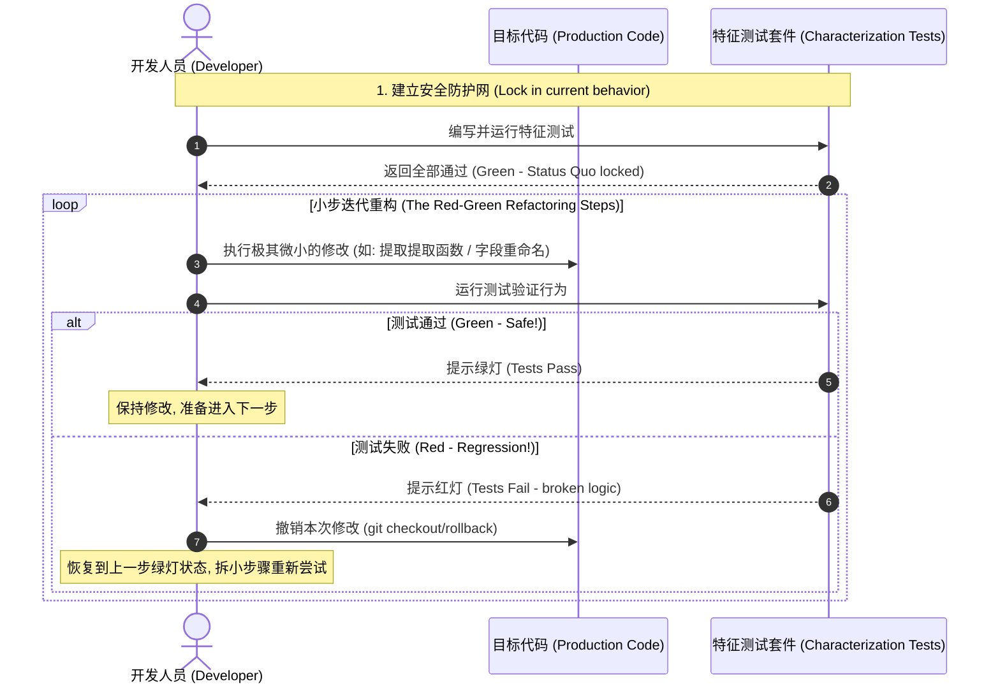
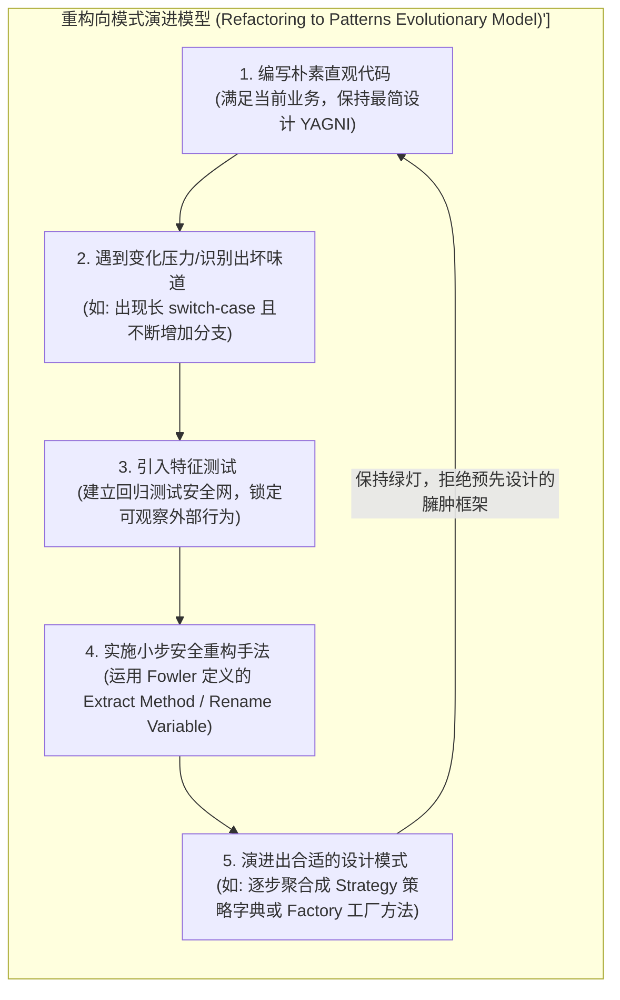
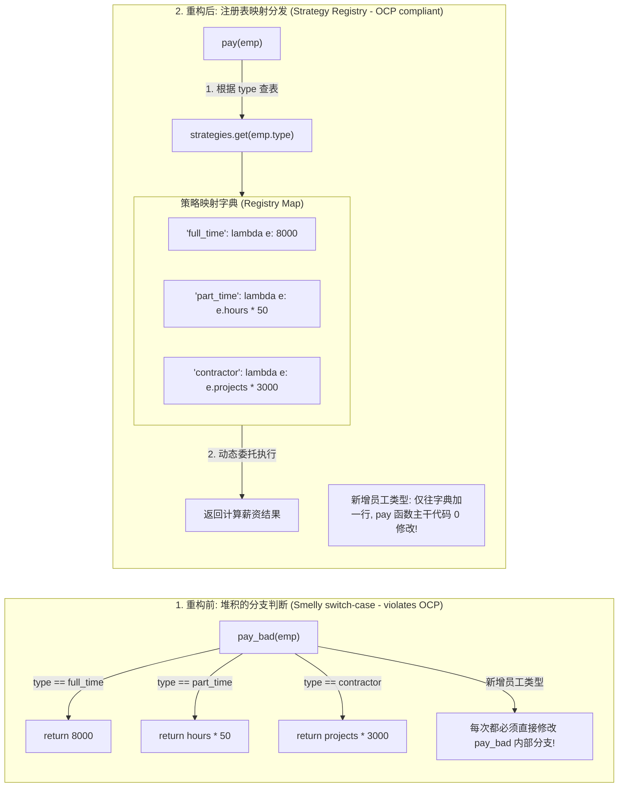

import GlossaryTerm from '@site/src/components/GlossaryTerm';
import GuidedExercise from '@site/src/components/GuidedExercise';
import ResearchNote from '@site/src/components/ResearchNote';
import ChapterMeta from '@site/src/components/ChapterMeta';
import PyRunner from '@site/src/components/PyRunner';
import TradeoffExplorer from '@site/src/components/TradeoffExplorer';
import QuizCard from '@site/src/components/QuizCard';

# M4L11 · 坏味道与重构

<ChapterMeta
  time="约 2 小时"
  prereqs={[{label: 'M4L1-L8 原则与模式', href: './change-driven-design'}, {label: 'L13 测试', href: '../foundations/testing-and-tdd'}]}
  outcome="能识别常见代码坏味道、说出它违反了哪条原则，并用有测试保护的小步重构把它改好。"
  howToUse="先认几种典型坏味道，再跟着“测试护体→小步改→保持绿”的流程重构一段烂代码，最后做 lab。"
/>

:::tip 重构不是“重写”，是“不改行为、只改结构”的纪律
重构（refactoring）有严格定义：**在不改变外部行为的前提下，改进代码内部结构。** 它靠测试保证行为不变、靠一连串小步（每步都保持可运行）降低风险。会“识别坏味道 + 安全重构”，是把本月所有原则用起来的方式。
:::

## 一、代码“能跑，但越来越难改”

它能跑，但你每次动它都心惊胆战：一个函数三百行、参数列表长得要换行、同样的逻辑复制了五遍、一个类什么都管……这些就是<GlossaryTerm term="Code Smell" definition="坏味道：代码里“看起来不对劲、提示设计有问题”的征兆（如超长函数、重复代码、上帝类、过长参数列表）。它不是 bug，但预示着将来难维护、易出错。">坏味道（code smell）</GlossaryTerm>——不是 bug，但在警告你“这里设计有问题，迟早出事”。

## 二、三个核心概念（分层）

### 基础：认出常见坏味道

对照本月原则，几种最常见的：

- **超长函数 / 上帝类**：一个函数/类做太多事 → 违反 [SRP](./solid-srp-ocp)。
- **重复代码（Duplicated Code）**：同样逻辑多处复制 → 违反 [DRY](./change-driven-design)。
- **过长参数列表 / 数据泥团**：一堆参数总是一起出现 → 该打包成对象。
- **发散式变化 / <GlossaryTerm term="Shotgun Surgery" definition="霰弹式修改 (Shotgun Surgery)：一种常见的代码坏味道。指每当你要修改某个单一业务规则或增加新特性时，被迫在代码库里像发射霰弹一样，同时修改非常多不同的类或文件。这预示着系统职责划分混乱、高耦合度。">霰弹式修改 (Shotgun Surgery)</GlossaryTerm>**：改一个需求要动很多处（或一个类因多种原因变）→ 违反 SRP/OCP。
- **冗长的 switch/if 链**：按类型分发 → 常可用[多态/策略](./strategy-pattern)替换。

### 进阶：安全重构的流程

<GlossaryTerm term="Refactoring" definition="重构：在不改变软件可观察行为的前提下，调整其内部结构以提升可读性和可维护性。强调小步进行、每步都由测试验证行为未变。">重构</GlossaryTerm>的铁律：**先有测试，再动结构，小步前进。**
1. 给要改的代码补上<GlossaryTerm term="Characterization Test" definition="特征测试：为一段“现状行为”补的测试，用来锁定它当前的行为（哪怕行为本身不完美），好让你在重构时确保行为不变。">特征测试</GlossaryTerm>（锁住当前行为，[回扣 L13](../foundations/testing-and-tdd)）。
2. 每次只做一个**小重构**（提取函数、改名、引入参数对象……），改完立刻跑测试。
3. 测试一直绿，就一直安全；一红立刻回退上一步。



### 深入（选学）：重构向模式（refactor toward patterns）

不要一上来就套模式（那是过度设计）。正确顺序是 [M4L1](./change-driven-design) 讲的：**先写朴素代码 → 出现真实的变化压力 / 坏味道 → 再重构出对应的模式。** 比如“一长串 if 按类型分发”反复要改，就重构成[策略/多态](./strategy-pattern)；“到处 new 具体类”就重构出[工厂](./factory-pattern)。模式是重构的**目的地**，不是起点——这正是 Kerievsky《Refactoring to Patterns》的核心主张。



<ResearchNote
  title="坏味道驱动重构，重构通向模式"
  source="Martin Fowler, Refactoring（坏味道目录）；Joshua Kerievsky, Refactoring to Patterns"
  href="https://martinfowler.com/books/refactoring.html"
  insight="Fowler 把“何时该重构”具体成一份坏味道目录，并给每种坏味道配了具体的重构手法（提取函数、以多态取代条件式等）。Kerievsky 进一步指出：模式应当是重构的终点——由真实坏味道驱动地“长出来”，而非预先套上。"
  application="日常开发：闻到坏味道 → 查它对应的重构手法 → 在测试保护下小步改。需要可扩展时，让模式从重构中自然浮现，而不是一开始就过度设计。这把本月的原则/模式变成可执行的日常纪律。"
/>

## 三、跟我做一遍：以多态/策略取代条件式



<PyRunner
  rows={26}
  expect="重构后行为不变"
  code={`# 坏味道：超长 if 按类型算工资（每加一种员工就改它，违反 OCP/SRP）
def pay_bad(emp):
    if emp["type"] == "full_time":
        return 8000
    elif emp["type"] == "part_time":
        return emp["hours"] * 50
    elif emp["type"] == "contractor":
        return emp["projects"] * 3000
    raise ValueError("unknown")

# 特征测试：先锁住现状行为（重构前后都要通过）
samples = [
    ({"type": "full_time"}, 8000),
    ({"type": "part_time", "hours": 100}, 5000),
    ({"type": "contractor", "projects": 2}, 6000),
]
for emp, expected in samples:
    assert pay_bad(emp) == expected

# 重构：以“策略表”取代条件式（加类型=注册一行，不改核心）
strategies = {
    "full_time":  lambda e: 8000,
    "part_time":  lambda e: e["hours"] * 50,
    "contractor": lambda e: e["projects"] * 3000,
}
def pay(emp):
    fn = strategies.get(emp["type"])
    if fn is None: raise ValueError("unknown")
    return fn(emp)

# 同一批特征测试：行为必须完全不变
for emp, expected in samples:
    assert pay(emp) == expected
print("重构后行为不变")`}
/>

特征测试锁住了三种员工的工资；重构成策略表后**同一批断言依然全过**——这就是“不改行为、只改结构”。**试试**：现在加一个 `intern` 类型，看你只需在 `strategies` 注册一行，`pay()` 不动（开闭）——重构换来了可扩展。

## 四、动手 Lab（必做）

打开 `labs/month04/m4l11_refactor/`：

```bash
python labs/month04/m4l11_refactor/test_refactor.py
```

给一段有坏味道的代码补特征测试，再重构成更干净的结构，保证行为不变。

<GuidedExercise
  title="练习指引：闻味道、小步重构"
  goal="练习“测试护体 → 识别坏味道 → 小步重构到原则/模式 → 行为不变”的完整纪律。"
  hints={[
    '先写特征测试锁住现状（哪怕代码很丑）。',
    '一次只做一个小重构，改完立刻跑测试。',
    '把超长 if 链重构成策略表/多态；把重复代码提取成函数。',
    '行为必须和重构前完全一致——测试是你的安全网。'
  ]}
  steps={[
    '阅读给定的“坏味道”函数，说出它违反哪条原则。',
    '补特征测试，覆盖各分支的现状行为。',
    '小步重构：提取函数 / 以策略表取代条件式 / 消除重复。',
    '每步跑测试保持绿；最后验证加新类型无需改核心。'
  ]}
  checks={[
    '你能叫出 3 种以上坏味道并对应到原则。',
    '你重构前先有测试锁住行为。',
    '你的重构没改变外部行为（测试全绿）。',
    '你能说出“重构向模式”而非“预先套模式”。'
  ]}
/>

## 架构师深潜（Staff+ 视角）

### 1. 重构的时机与策略

<TradeoffExplorer
  title="什么时候、怎么重构"
  dimensions={['风险', '见效速度', '需要测试', '适合范围', '团队接受度']}
  options={[
    {
      name: '随手小重构（<GlossaryTerm term="Boy Scout Rule" definition="童子军法则 (Boy Scout Rule)：‘离开时让营地比你来时更干净’。在软件开发中指每次修改代码时，顺手对接触到的周边代码做一点点微小的重构增强，从而依靠团队日常点滴维护来对抗系统软件熵增。">童子军法则 (Boy Scout Rule)</GlossaryTerm>）',
      scores: [1, 4, 3, 5, 5],
      note: '每次改代码顺手把碰到的地方变好一点。低风险、可持续。',
      whenToUse: '日常默认做法——“离开时让营地比来时更干净”。'
    },
    {
      name: '为加功能而重构',
      scores: [2, 5, 4, 4, 4],
      note: '加功能前先把相关结构理顺（让改动变容易），再加。Fowler 推荐。',
      whenToUse: '要在烂代码上加功能时——先重构再加。'
    },
    {
      name: '大爆炸重写',
      scores: [5, 1, 2, 2, 2],
      note: '推倒重来。风险极高、易丢隐性需求、长期没产出。',
      whenToUse: '极少数——通常是最后手段，慎之又慎。'
    }
  ]}
/>

### 2. 没有测试，就没有重构

重构的安全完全建立在测试上（[L13](../foundations/testing-and-tdd)）。没有测试，你的“重构”只是“改了之后祈祷没坏”。架构师推动重构文化时，第一步往往是补特征测试、建 CI——**先有安全网，才谈得上持续改进**。这也是为什么本月反复回扣测试。

### 3. 真实案例：大系统靠持续重构活下来

没有哪个大系统是一次设计完美的；它们靠**持续重构 + 测试**抵抗[熵增](./change-driven-design)。Google/Meta 等的代码库每天都在小步重构。把“闻味道→小步改→保持绿”变成团队肌肉记忆，是系统能长期演进、不腐化的关键——这比任何一次性的“完美设计”都重要。

### 4. 架构师深问（给自己 30 分钟）

- 找你代码里最“不敢动”的一段，列出它的坏味道，先给它补特征测试，再小步重构。
- 你团队加功能时是“先重构让它容易加”还是“硬塞进去”？长期后果分别是什么？
- 什么时候重构不值得？（提示：要废弃的代码、行为不稳定还在频繁变的探索期。）

## 自检清单

- [ ] 我能叫出常见坏味道并对应到原则。
- [ ] 我重构前先用测试锁住行为。
- [ ] 我能小步重构、每步保持测试绿。
- [ ] 我理解“重构向模式”，不预先过度设计。

## 常见误解

- **"重构就是‘彻底重写（Rewrite）’。既然代码写得这么烂，直接推倒把整个模块重新写一遍才是最痛快的，也是唯一的解决手段"**: 典型的危险开发习惯。重构（Refactoring）和重写（Rewrite）在风险层面上有着天壤之别。重构的定义是在 **外部可观察行为不改变** 的前提下小步调整内部结构，强调测试保护与安全回滚；而重写是推倒重来，风险极高，极易遗漏原系统中的隐性细节与边缘需求，导致产生海量新 Bug 并长期阻塞功能发布。
- **"项目时间非常紧张，根本没有多余时间先写测试，所以我只能先改代码，等以后有空了再补写测试"**: 裸奔式重构，自欺欺人。没有特征测试（Characterization Test）护体的所谓重构其实只是在修改代码，然后闭上眼睛向天祈祷不要出错。随着代码改动量累积，你将完全失去对是否破坏了已有边缘功能的掌控。记住：**没有测试，就绝不能动结构。** 补齐针对现状行为的测试是任何重构动作无法省去的“安全入场券”。
- **"作为一个资深的软件架构师，应该在工程还没动工时，就预先套用好所有的抽象工厂、策略模式与代理模式，防止代码日后出现坏味道"**: 忽视了过度设计的巨大危害，违反 **YAGNI** 原则。 Joshua Kerievsky 在《Refactoring to Patterns》中极力反对一开始就预设复杂的模式框架。设计模式应该是由真实的业务变化压力、真实浮现的代码坏味道（如发散式变化、霰弹式修改）驱动，依靠有测试保护的重构手段，从朴素的简易代码中**自然演进生长**出来的。模式是终点，而不是起点。

## 常见误解自测

<QuizCard
  questions={[
    {
      q: '在对没有任何单元测试的遗留系统（Legacy Code）进行重构之前，第一步且最核心的安全保障工作是什么？',
      options: [
        '直接使用最新的 IDE 自动化重构工具进行一键转换。',
        '编写特征测试（Characterization Test）以‘锁死’当前的真实运行时行为（不论好坏），然后再实施小步重构，并在每一步后跑通特征测试确保可观察外部行为无偏离。',
        '把类名和变量名全部改成拼音，增加代码的可读性。'
      ],
      answer: 1,
      explain: '特征测试（Characterization Test）是安全重构的头号前提。对于遗留系统，因为没有测试保护，任何看似安全的改动都可能引发隐秘的 Bug。用特征测试‘拍照留存’当前的行为，是建立重构安全网的标准第一步。'
    },
    {
      q: 'Joshua Kerievsky 在其著作《Refactoring to Patterns（重构向模式）》中提出的核心工程设计观点是？',
      options: [
        '设计模式应该是由真实发生的‘坏味道’和‘变化压力’驱动，通过重构重组手段自然演进‘长’出来的，而不是在项目初期由主观设计预先塞入到架构中的（避免过度设计）。',
        '我们应该在项目还没写一行代码时，先把 23 种设计模式的类图全部声明好。',
        '重构不需要考虑测试，只需要考虑类图结构是否优雅。'
      ],
      answer: 0,
      explain: '重构向模式（Refactor to Patterns）的核心意图是推迟多态抽象的引入，遵循 YAGNI 原则。先写朴素的直观代码，当代码中确实出现‘发散式变化’或‘重复’等坏味道并面临扩展压力时，再通过有测试保护的重构手段让模式自然浮现。'
    },
    {
      q: '如果当你在重构过程中应用了某个重构步骤（例如提取函数），突然发现测试红了（Assert 失败），最正确且高效的行为是？',
      options: [
        '继续编写新的代码，寄希望于下一阶段的重构会自动修复它。',
        '立即执行 `git diff` 寻找原因，如果无法在 1-2 分钟内快速修复，应果断回退（rollback）至上一步全绿的可运行状态，然后将重构步子拆得更小重新尝试。',
        '直接修改测试断言里的期望值，让测试强行变绿。'
      ],
      answer: 1,
      explain: '小步快跑与纪律性回退。重构的核心纪律是‘绿到绿的平滑过渡’。如果测试红了且无法瞬时排错，继续堆砌改动只会让情况越发复杂。冷静地回滚到上一个安全节点并拆小步子，比死磕复杂的红测试要快得多。'
    }
  ]}
/>

## 延伸阅读

- [Martin Fowler, Refactoring](https://martinfowler.com/books/refactoring.html)
- [Refactoring to Patterns (Kerievsky)](https://www.industriallogic.com/xp/refactoring/)
- [下一课：Capstone · 可扩展通知系统](./capstone-notification)
