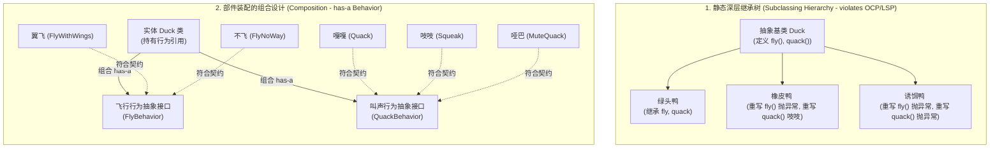
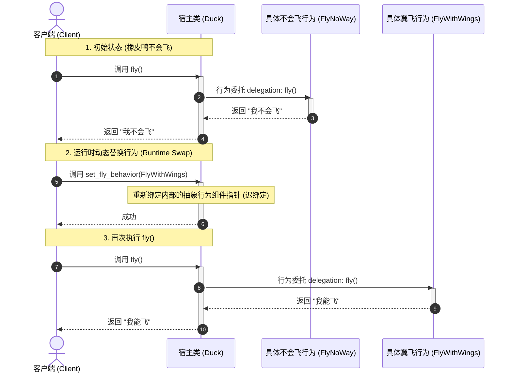

import GlossaryTerm from '@site/src/components/GlossaryTerm';
import GuidedExercise from '@site/src/components/GuidedExercise';
import ResearchNote from '@site/src/components/ResearchNote';
import ChapterMeta from '@site/src/components/ChapterMeta';
import PyRunner from '@site/src/components/PyRunner';
import TradeoffExplorer from '@site/src/components/TradeoffExplorer';
import QuizCard from '@site/src/components/QuizCard';

# M4L4 · 组合优于继承

<ChapterMeta
  time="约 1.5–2 小时"
  prereqs={[{label: 'M4L3 LSP/DIP', href: './solid-lsp-isp-dip'}]}
  outcome="能用“组合行为”代替深继承层级，让对象的能力可拼装、可在运行时替换——并理解这正是策略模式的前奏。"
  howToUse="先看深继承的坑，再用组合把行为拼出来，最后做 lab。"
/>

:::tip GoF 写在书里的第一条经验
"优先使用对象组合，而不是类继承（Favor object composition over class inheritance）。" 继承看似省事，却把子类和父类的实现焊死；组合让你像搭积木一样灵活拼装、还能运行时替换。
:::

## 一、继承的层级越堆越深

你有个 `Duck` 基类，加了 `fly()`。然后来了橡皮鸭（不会飞）、诱饵鸭（不会飞不会叫）……你要么在基类塞一堆开关、要么搞出一棵越来越深的继承树，还可能撞上"会飞的橡皮鸭"这种尴尬。**继承把"是什么"和"怎么做"绑死了**——一旦行为要按对象不同而变化、甚至运行时变化，继承就处处别扭。



## 二、三个核心概念（分层）

### 基础：继承（is-a）vs 组合（has-a）

- **继承**：`RubberDuck` **是一种** `Duck`——继承它的实现。它在编译期通过 <GlossaryTerm term="Compile-time Binding" definition="编译期绑定 (静态绑定)：对象的类型关系与方法调用在编译或代码声明阶段就已经完全确定，无法在运行过程中进行动态更改。继承就是典型的编译期绑定。">编译期静态绑定 (Compile-time Binding)</GlossaryTerm> 硬编码了父子依赖，强耦合父类，改父类可能波及所有子类（[脆弱基类](#)）。
- <GlossaryTerm term="Composition" definition="组合：一个对象“拥有（has-a）”另一些对象/行为，通过持有并委托它们来实现功能，而不是继承。可灵活拼装、可运行时替换。">组合（has-a）</GlossaryTerm>：`Duck` **拥有一个** `FlyBehavior`——把"怎么飞"做成一个可替换的部件，鸭子持有它并通过 <GlossaryTerm term="Behavior Delegation" definition="行为委托：一个对象将自身的某个方法调用转交给另一个关联对象进行处理的编程模式。是组合优于继承中实现代码复用的核心机制，可有效避免继承的深层依赖。">行为委托 (Behavior Delegation)</GlossaryTerm> 执行它。

### 进阶：把"会变的行为"组合进来

回到 [M4L1 封装变化](./change-driven-design)：鸭子的"飞法""叫法"会因品种而变——那就把它们**抽成可替换的行为部件**，组合进鸭子。不同鸭子 = 不同行为部件的不同组合。而且能通过 <GlossaryTerm term="Late Binding" definition="动态绑定 (迟绑定 / Late Binding)：在运行时才确定具体调用的方法实现。组合模式中由于持有的是抽象接口，运行时随时可将内部指向具体实现，实现极佳的灵活性。">迟绑定 (Late Binding / 动态绑定)</GlossaryTerm> 实现**运行时替换**（橡皮鸭充气后会飞了？换个 fly 部件即可）——这是继承做不到的。**这其实已经是策略模式了**（下一课 M4L5 正式讲）。



### 深入（选学）：继承的真实代价

继承的坑：<GlossaryTerm term="Fragile Base Class" definition="脆弱基类：修改父类可能意外破坏所有子类的行为，因为子类依赖了父类的实现细节。继承的强耦合导致的问题。">脆弱基类</GlossaryTerm>（改父类炸一片）、菱形继承、以及 [M4L3 的 LSP 违反](./solid-lsp-isp-dip)。组合没有这些问题，代价只是要多写一点"持有 + 委托"的样板。**经验法则：默认用组合，只有在确定是稳定的 is-a 且行为完全兼容时才用继承。**

```mermaid
flowchart LR
  subgraph FragileBaseClassProblem["脆弱基类改动传导 (Fragile Base Class Propagation Cascade)"]
    direction TB
    
    subgraph ParentClass["父类 (Super Class V1)"]
      Add1["add(item) <br/>{保存数据}"]
      AddAll1["addAll(items) <br/>{循环调用 add(item)}"]
    end
    
    subgraph ChildClass["子类 (Sub Class)"]
      Count["count = 0 <br/>(记录数据总数)"]
      AddChild["add(item) <br/>{count++; super.add()}"]
      AddAllChild["addAll(items) <br/>{count += items.len; super.addAll()}"]
    end
    
    AddAll1 -->|V1版本内部依赖| Add1
    AddChild -.->|继承覆盖| Add1
    AddAllChild -.->|继承覆盖| AddAll1
    
    Trigger["客户端调用 sub.addAll(3个元素)"] --> AddAllChild
    AddAllChild -->|1. count += 3| Count
    AddAllChild -->|2. super.addAll()| AddAll1
    AddAll1 -->|3. 内部循环调用 3次 add()| AddChild
    AddChild -->|4. count 累加 3次| Count
    
    Count --> Result["最终 count 等于 6! (产生重复累加 Bug!)"]
  end
```

<ResearchNote
  title="优先组合：四人帮的核心建议"
  source="GoF, Design Patterns（“Favor object composition over class inheritance”）；Head First Design Patterns（Duck 例）"
  href="https://en.wikipedia.org/wiki/Composition_over_inheritance"
  insight="GoF 明确建议优先组合而非继承：继承在编译期就把关系定死、暴露父类实现细节、难以运行时改变；组合通过持有接口、运行时装配，获得更大灵活性和更低耦合。"
  application="看到深继承树、或“为了复用一段代码而继承”，就该警觉。把会变的行为抽成部件、组合进来——你会发现策略、装饰器、状态等一大批模式，本质都是“组合可替换的行为”。"
/>

## 三、跟我做一遍：组合行为

<PyRunner
  rows={22}
  expect="运行时换了行为"
  code={`# 把"会变的行为"做成可替换的部件（这里用函数）
def can_fly(): return "我能飞"
def cant_fly(): return "我不会飞"
def quack(): return "嘎嘎"
def squeak(): return "吱吱"

class Duck:
    def __init__(self, fly_behavior, sound_behavior):
        self.fly_behavior = fly_behavior        # 组合：持有行为部件
        self.sound_behavior = sound_behavior
    def fly(self): return self.fly_behavior()
    def make_sound(self): return self.sound_behavior()

# 不同鸭子 = 不同部件的组合（不需要一堆子类）
mallard = Duck(can_fly, quack)
rubber = Duck(cant_fly, squeak)
print("绿头鸭:", mallard.fly(), mallard.make_sound())
print("橡皮鸭:", rubber.fly(), rubber.make_sound())

# 运行时替换行为：橡皮鸭充了气，会飞了！（继承做不到）
rubber.fly_behavior = can_fly
print("充气后橡皮鸭:", rubber.fly())
print("运行时换了行为")`}
/>

不需要 `MallardDuck`、`RubberDuck` 一堆子类——**用不同行为部件组合出不同的鸭子**，还能运行时换部件。**试试**：加一个"火箭动力"飞行部件，赋给任意鸭子，不用新建任何子类。这就是组合的灵活。

## 四、动手 Lab（必做）

打开 `labs/month04/m4l4_composition/`：

```bash
python labs/month04/m4l4_composition/test_duck.py
```

用组合（而非继承）实现可拼装、可运行时替换行为的对象。

<GuidedExercise
  title="练习指引：用组合拼装行为"
  goal="把“组合可替换的行为部件”做成代码，体会它比继承更灵活、且能运行时替换。"
  hints={[
    'Duck 构造时接收行为部件（函数或对象），持有它们。',
    'fly()/make_sound() 委托给持有的行为部件。',
    '不同鸭子 = 不同部件组合，不要建一堆子类。',
    '提供 set_fly_behavior 让行为能在运行时替换。'
  ]}
  steps={[
    '实现 Duck(fly_behavior, sound_behavior)，持有两个行为。',
    'fly() 和 make_sound() 委托给对应行为部件。',
    'set_fly_behavior(b) 运行时替换飞行行为。',
    '写测试：不同组合表现不同、运行时替换生效。'
  ]}
  checks={[
    '你能区分 is-a（继承）和 has-a（组合）。',
    '你的鸭子用组合拼装、能运行时换行为。',
    '你能说出继承的脆弱基类/LSP 坑。',
    '你能看出这已经是策略模式的雏形。'
  ]}
/>

## 架构师深潜（Staff+ 视角）

### 1. 复用方式怎么选

<TradeoffExplorer
  title="行为复用的方式"
  dimensions={['灵活性', '运行时可变', '耦合度(越低越好)', 'LSP 安全', '样板代码']}
  options={[
    {
      name: '继承',
      scores: [2, 1, 1, 2, 5],
      note: '复用父类代码、少写样板。但编译期定死、强耦合、易脆弱基类/违反 LSP。',
      whenToUse: '稳定的真 is-a、行为完全兼容、层级浅时。'
    },
    {
      name: '组合 + 委托',
      scores: [5, 5, 5, 5, 3],
      note: '像积木拼装、可运行时换、低耦合。代价是多写"持有+委托"的样板。',
      whenToUse: '行为会变、要运行时切换、要避免深继承时——默认选它。'
    }
  ]}
/>

### 2. 一大批模式都是"组合可替换行为"

策略（换算法）、装饰器（叠加功能）、状态（换状态对象）、适配器（包一层）——它们本质都是**组合 + 委托**的变体。理解了组合优于继承，下周的模式你会觉得"原来都是同一招"。

### 3. 架构师深问（给自己 30 分钟）

- 找你代码里一棵"为了复用而生"的继承树，试着用组合重写它。
- 什么时候继承仍然合适？（提示：稳定、真 is-a、行为完全兼容、层级浅。）
- "运行时替换行为"在你的系统里有什么实际用途？（如按配置切换算法、灰度。）

## 自检清单

- [ ] 我能区分 is-a 继承和 has-a 组合。
- [ ] 我的 lab 用组合拼装行为、可运行时替换。
- [ ] 我能说出继承的脆弱基类等坑。
- [ ] 我能看出组合是策略/装饰器等模式的基础。

## 常见误解

- **"继承是面向对象设计（OOP）的灵魂，写面向对象代码就必须疯狂地写多层 extends 继承树"**: 这是典型的历史遗留偏见。在 90 年代初 OOP 刚兴起时，人们过度鼓吹了类继承的“代码复用”红利。但在过去的二十多年里，软件工程界深刻体会到了深层类继承带来的“脆弱基类”与“白盒复用（暴露父类细节破坏封装）”的沉痛代价。现代工业界的共识是“优先使用组合，谨慎使用继承”。
- **"直接把一个实体类 new 出来塞进宿主类里，就算是完美地践行了组合优于继承"**: 属于半吊子的伪组合设计。真正的组合复用，宿主类持有的应该是一个“抽象接口或行为 Protocol”，并且将具体的行为委托 (Behavior Delegation) 给它。如果直接在宿主内部强耦合地 new 出了具体的行为实体类，不仅没有实现运行时可替换性，反而退化为了紧耦合的编译期静态绑定。
- **"组合需要多写很多‘持有 + 委托’的垃圾样板代码（Boilerplate），所以继承依然是最高效的复用手段"**: 拿暂时的开发速度换取长期的可维护性灾难。继承确实少写了方法转发，但它将子类和父类强行绑定，日后一旦基类要修改（例如修改 add 和 addAll 之间的调用逻辑），所有子类都会大面积意外崩溃。为了省去几行委托代码而背负脆弱基类和 LSP 违反的噩梦，在工程上是非常愚蠢的交易。

## 常见误解自测

<QuizCard
  questions={[
    {
      q: '在面向对象软件工程中，‘组合优于继承’（Composition over Inheritance）的核心原因是什么？',
      options: [
        '继承会破坏封装性，子类不仅要依赖父类的公开接口，还要被迫暴露于父类的内部实现细节（白盒复用），导致脆弱基类（Fragile Base Class）问题；而组合通过‘委托’接口完成，完全遵循黑盒复用，降低了耦合度。',
        '组合方式比继承写起来要省去 80% 的代码量。',
        '继承只适用于 Python，组合只适用于 C++。'
      ],
      answer: 0,
      explain: '组合与继承的权衡。继承在编译期就硬编码了关系，暴露了基类的内部细节。如果基类更改，子类会被意外碰坏。组合将行为委托给外部对象，保持了对象的自治性与黑盒复用。'
    },
    {
      q: '‘运行时行为替换’（Dynamic Runtime Behavior Swap）相比继承的最显著技术红利是？',
      options: [
        '能够在不重新编译运行、不重建或销毁原对象实例的前提下，通过注入新的具体策略，在运行期动态切换对象的算法或行为（例如在限流策略被触发时动态替换为拒绝服务行为，或对充气的橡皮鸭切换为飞行行为）。',
        '能够自动增加 CPU 缓存命中率。',
        '能够确保对象在物理存储上是不占内存的。'
      ],
      answer: 0,
      explain: '运行时切换的红利。对于继承来说，一个对象的类型在创建（new）时就确定了，不可能在运行时突然改变。但通过组合委托，我们只需将内部持有的行为引用指向新类，就能实现动态变身，这是设计模式中 Strategy / State 模式的基石。'
    },
    {
      q: '什么是‘脆弱基类’（Fragile Base Class）问题？',
      options: [
        '父类的内存占用过大，导致子类实例化时直接崩溃。',
        '由于子类强耦合了父类的实现细节，一旦父类在后续维护中修改了某个方法的内部调用逻辑，会导致那些表面上完全没有修改过的子类发生意料之外的行为越轨或死循环崩溃。',
        '基类完全不支持继承，继承时直接报错。'
      ],
      answer: 1,
      explain: '脆弱基类定义。改父类炸子类。很多子类可能依赖了父类某个方法（例如 A 调用 B）。如果父类某天改成了 A 不调用 B，子类重写了 B 就无法生效。这是一种隐蔽性极高、极其难以调试的回归缺陷。'
    }
  ]}
/>

## 延伸阅读

- [Composition over inheritance](https://en.wikipedia.org/wiki/Composition_over_inheritance)
- [下一课：策略模式](./strategy-pattern)
- [Month 4 总览](./overview)
