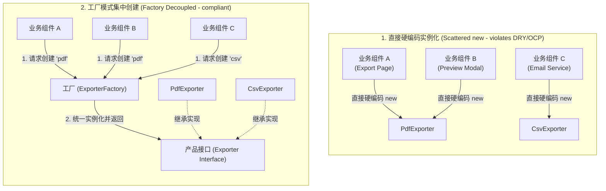
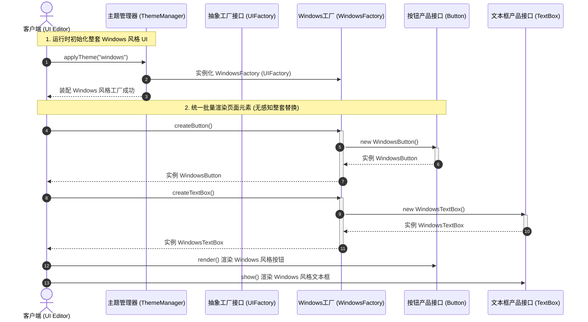
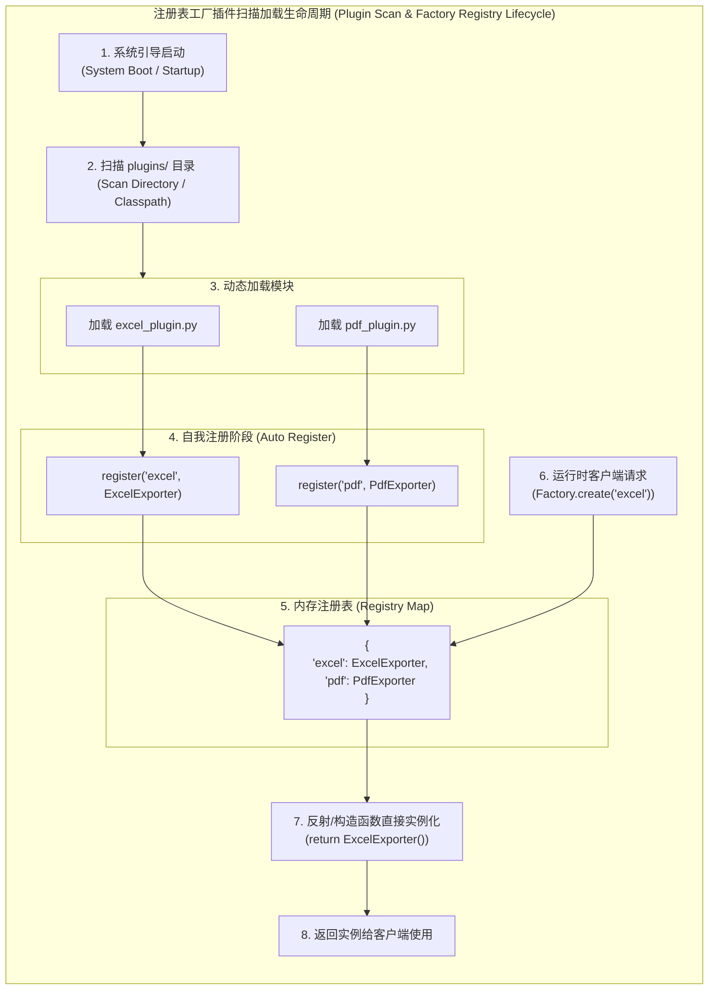

import GlossaryTerm from '@site/src/components/GlossaryTerm';
import GuidedExercise from '@site/src/components/GuidedExercise';
import ResearchNote from '@site/src/components/ResearchNote';
import ChapterMeta from '@site/src/components/ChapterMeta';
import PyRunner from '@site/src/components/PyRunner';
import TradeoffExplorer from '@site/src/components/TradeoffExplorer';
import QuizCard from '@site/src/components/QuizCard';

# M4L6 · 工厂模式

<ChapterMeta
  time="约 2 小时"
  prereqs={[{label: 'M4L5 策略模式', href: './strategy-pattern'}, {label: 'M4L3 DIP', href: './solid-lsp-isp-dip'}]}
  outcome="能识别“创建逻辑会变/散落各处”的变化点，用工厂方法/简单工厂/注册表把对象创建集中封装。"
  howToUse="先看 new 散落各处的痛，再把创建集中到工厂，最后做 lab。"
/>

:::tip 工厂封装的是“变化”里最容易被忽略的一种：创建
前面几课封装的是“算法怎么变”。工厂封装的是另一种变化：**到底该 new 哪个类、怎么 new。** 当“创建逻辑”会变、或散落在十几处时，就把它收拢到一个地方。
:::

## 一、`new` 散落在十几个地方

你的代码里到处是 `if type == "pdf": return PdfExporter()  elif "csv": return CsvExporter() ...`。同样的判断在导出、预览、邮件三处各写一遍。加一种 `ExcelExporter`，你得找出所有这些地方一处处改——**创建逻辑重复（违反 [DRY](./change-driven-design)）、且每加一种类型就要改一片（违反开闭）。**



## 二、三个核心概念（分层）

### 基础：简单工厂——把创建集中到一处

最朴素的做法：<GlossaryTerm term="Simple Factory" definition="简单工厂：用一个函数/方法集中负责“根据参数创建并返回合适的对象”，把散落各处的创建逻辑收拢到一处。严格说它不是 GoF 模式，但极常用、极实用。">简单工厂</GlossaryTerm>——写一个 `create_exporter(type)` 函数，把“该 new 哪个类”的判断收拢到这一个地方。其它代码只调它、拿到对象就用，不再关心具体类，它们都遵循同一个统一的 <GlossaryTerm term="Product Interface" definition="产品接口：工厂模式中定义的产品规范。所有由工厂实例化的对象都必须实现这一相同的接口（如 Exporter 具有 export() 方法），从而让客户端可以无差别地消费而无须感知具体的类。">产品接口 (Product Interface)</GlossaryTerm>（[DIP](./solid-lsp-isp-dip)）。

### 进阶：工厂方法与抽象工厂

- <GlossaryTerm term="Factory Method" definition="工厂方法（GoF）：在父类里定义一个“创建对象”的方法，把“具体创建哪个子类”延迟到子类去决定。让框架定义流程、子类决定用什么对象。">工厂方法</GlossaryTerm>：父类定义“创建步骤”，**由子类决定创建哪个具体对象**——框架定流程、扩展者填实现。
- <GlossaryTerm term="Abstract Factory" definition="抽象工厂（GoF）：提供一个创建“一族相关对象”的接口，让你能整套切换实现（如换一整套 UI 控件、换一整套数据库驱动），而不必逐个改。">抽象工厂</GlossaryTerm>：创建“一整族”相关对象（如一套 UI 控件、一套云厂商 SDK），让你能**整套替换**。



### 深入（选学）：工厂 + 注册表 = 开闭的创建

简单工厂里如果还是 `if-elif`，加类型仍要改它。终极形态是**注册表式工厂**（回扣 [M4L1](./change-driven-design)）：每个类把自己**注册**进一张作为 <GlossaryTerm term="Registry Map" definition="注册表字典 (Registry Map)：动态工厂的核心数据结构（通常是一个键值对哈希表）。通过在程序启动或扫描时，将产品 key（如 'pdf'）映射到对应的类构造函数（如 PdfExporter），彻底消除创建逻辑中的 if-else 判定分支。">注册表字典 (Registry Map)</GlossaryTerm> 的 `{type: 类}` 表中，工厂只查表创建。这样加新类型 = 注册一行，工厂代码一个字不改——创建逻辑也做到了开闭。许多框架的“插件/驱动注册”就是这么干的。



<ResearchNote
  title="把“创建”从“使用”里分离出来"
  source="Gamma, Helm, Johnson & Vlissides (GoF, 1994), Design Patterns — Factory Method / Abstract Factory"
  href="https://en.wikipedia.org/wiki/Factory_method_pattern"
  insight="GoF 的工厂家族都在解决同一问题：让使用对象的代码不依赖具体类的构造。工厂方法把“创建哪个”延迟到子类；抽象工厂让一整族对象可整套替换。核心是“面向接口创建、把 new 关进笼子”。"
  application="当创建逻辑复杂、会变、或散落多处时用工厂。配合注册表，可让“加新类型”不修改工厂本身。框架（日志、数据库驱动、序列化器）几乎都用工厂 + 注册表做可插拔。"
/>

## 三、跟我做一遍：从散落的 new 到注册表工厂

<PyRunner
  rows={24}
  expect="加类型不改工厂"
  code={`# 一族产品：统一接口（都有 export）
class PdfExporter:
    def export(self, data): return "PDF: " + data
class CsvExporter:
    def export(self, data): return "CSV: " + data

# 注册表式工厂：类自己注册进来，工厂只查表
registry = {}
def register(type_name, cls):
    registry[type_name] = cls

def create_exporter(type_name):       # 工厂：集中创建、面向接口返回
    cls = registry.get(type_name)
    if cls is None:
        raise ValueError("unknown exporter: " + type_name)
    return cls()

register("pdf", PdfExporter)
register("csv", CsvExporter)

# 使用方只认“工厂 + export 接口”，不认具体类（DIP）
for t in ("pdf", "csv"):
    print(create_exporter(t).export("报表"))

# 加一种 Excel：只“注册一行”，create_exporter 不动 —— 开闭
class ExcelExporter:
    def export(self, data): return "XLSX: " + data
register("excel", ExcelExporter)
print(create_exporter("excel").export("报表"))
print("加类型不改工厂")`}
/>

使用方永远只调 `create_exporter(t).export(...)`，不知道也不关心具体类；加 Excel 只需**注册一行**。**试试**：再注册一个 `JsonExporter`，体会“加类型=注册，而不是改工厂”。

## 四、动手 Lab（必做）

打开 `labs/month04/m4l6_factory/`：

```bash
python labs/month04/m4l6_factory/test_factory.py
```

用注册表式工厂创建一族 exporter：加新类型只需注册，使用方与工厂都不改。

<GuidedExercise
  title="练习指引：实现可扩展的工厂"
  goal="把“集中创建 + 注册表”做成代码——使用方面向接口、加类型不改工厂。"
  hints={[
    '所有产品统一接口（如 export(data)）。',
    'register(name, cls) 把类登记进 registry。',
    'create(name) 查表创建并返回；未知类型 raise。',
    '加新产品 = register 一行，create 不改（开闭）。'
  ]}
  steps={[
    '定义 PdfExporter/CsvExporter（统一 export 接口）。',
    '实现 register(name, cls) 与 create(name)。',
    '内置注册 pdf/csv。',
    '测试里再注册一个新类型（如 excel），验证 create 无需改动就支持它，且未知类型报错。'
  ]}
  checks={[
    '你能识别“创建逻辑散落/会变”的变化点。',
    '你的使用方不依赖具体类（面向接口）。',
    '你能不改工厂就加一种新产品。',
    '你能说出简单工厂/工厂方法/抽象工厂的区别。'
  ]}
/>

## 架构师深潜（Staff+ 视角）

### 1. 三种工厂怎么选

<TradeoffExplorer
  title="工厂的不同形态"
  dimensions={['加类型成本', '复杂度', '整族替换', '可读性', '过度设计风险']}
  options={[
    {
      name: '简单工厂（if-elif）',
      scores: [2, 5, 1, 4, 4],
      note: '一个函数集中创建。够用、易懂，但加类型要改它。',
      whenToUse: '类型不多、变化少时——最常用的务实选择。'
    },
    {
      name: '注册表工厂（推荐）',
      scores: [5, 4, 2, 3, 3],
      note: '类自注册、工厂查表。加类型不改工厂，可插件化。',
      whenToUse: '类型会持续增加、要可插拔/第三方扩展时。'
    },
    {
      name: '抽象工厂（整族）',
      scores: [3, 2, 5, 2, 1],
      note: '创建一整族相关对象，可整套替换。强大但重，易过度设计。',
      whenToUse: '要整套切换实现（换 UI 主题、换云厂商）时。'
    }
  ]}
/>

### 2. 工厂的本质是“保护使用方不被 new 绑架”

工厂和 [DIP](./solid-lsp-isp-dip) 是一对：DIP 说“依赖抽象”，但抽象对象总得有人创建——工厂就是那个“被允许知道具体类”的地方，把 `new` 集中关在笼子里，其余代码全部面向接口。**“把变化集中到一处”——工厂集中的是创建这个变化。**

### 3. 真实案例：框架的可插拔全靠工厂 + 注册表

日志框架按名字创建 logger、ORM 按方言创建数据库驱动、序列化库按类型创建编解码器、[消息队列](../data-cache-queue/message-queues)按配置创建生产者——背后都是工厂 + 注册表。理解它，你才能设计出“第三方能加新实现而不改你核心”的可扩展系统。

### 4. 架构师深问（给自己 30 分钟）

- 你代码里 `new XxxClient()` 散落在多处吗？怎么用工厂收拢、并让它可配置/可测试（注入假实现）？
- 简单工厂用 if-elif 会违反开闭，注册表工厂能解决——但注册表也有代价（隐式、难追踪）。你怎么权衡？
- 抽象工厂的“整族替换”在什么场景真的需要？什么时候是过度设计？

## 自检清单

- [ ] 我能识别“创建逻辑会变/散落”的变化点。
- [ ] 我的 lab 用工厂集中创建、使用方面向接口。
- [ ] 我能用注册表让加类型不改工厂。
- [ ] 我能区分简单工厂/工厂方法/抽象工厂。

## 常见误解

- **"简单工厂包含 if-elif 条件分支判定，不符合开闭原则（OCP），因此它不是一个正统的设计模式，在生产中不应该写"**: 极其教条的学院派思想。简单工厂虽然在新增类型时确实要修改工厂代码，但它成功将“对象创建”这个变化点收拢到了唯一的函数中，避免了 new 逻辑在全系统散射（DRY）。在类型稀少且变化极慢的业务场景，简单工厂是性价比最高、最容易被团队所有人理解的务实解法。
- **"既然提倡面向接口，那我的系统里就不能出现任何 direct new 实例化代码，必须每一个类都配套编写一个 Factory"**: 属于走火入魔的过度设计偏执。我们之所以要把 new 隐藏起来，是因为具体类的“创建逻辑可能会频繁发生变化（如参数增加、子类选择复杂）”或者“我们需要在单元测试中注入 Mock 伪实现”。对于极其稳定、不可能发生多态改变的纯数据类（Data Class）、工具类或本地内聚组件，直接 new 是完全合理且符合 YAGNI 原则的。
- **"抽象工厂和工厂方法听起来差不多，随便选哪一个实现都一样，没什么大区别"**: 概念混淆的典型表现。工厂方法（Factory Method）专注于“单一产品”的创建，主要通过类继承将该产品的具体实例化延迟到子类工厂去执行；而抽象工厂（Abstract Factory）专注于“一族相关或相互依赖的产品”的整套替换。二者设计维度完全不同：一个是单一产品的垂直延迟创建，一个是多产品生态的水平整套切换。

## 常见误解自测

<QuizCard
  questions={[
    {
      q: '简单工厂（Simple Factory）与工厂方法（Factory Method）的最核心本质区别是？',
      options: [
        '简单工厂是用 Python 写的，工厂方法是用 C++ 写的。',
        '简单工厂通常采用一个包含条件分支或字典查表的中心函数，由它集中负责所有具体类的实例化；而工厂方法通过继承（Inheritance）将实例化的决定延迟到子类，父类只规定流程骨架（如 createExporter 抽象接口），由各子类工厂自行 new 具体产品。',
        '简单工厂的性能是工厂方法的十倍。'
      ],
      answer: 1,
      explain: '简单工厂与工厂方法的本质区别。简单工厂把创建堆在一起（往往包含 if/else 或 Registry），而工厂方法是经典的 GoF 创建型模式，使用多态派生让具体的子类工厂去负责对应的具体产品创建，实现了创建结构的再解耦。'
    },
    {
      q: '在需要动态按配置整套替换外部服务商（如将整个云存储、云数据库、云推送的一族 SDK 从 AWS 切换至阿里云）时，应当首选哪种工厂模式？',
      options: [
        '简单工厂',
        '抽象工厂（Abstract Factory），因为它能够定义一整套互相关联的抽象产品创建接口（如 createStorage(), createDB(), createPush()），允许我们通过注入不同的具体工厂实例（如 AWSFactory 或 AliyunFactory），实现一整套产品线的无缝替换。',
        '脆弱基类工厂'
      ],
      answer: 1,
      explain: '抽象工厂的应用场景。抽象工厂是专门为了‘一族相关或相互依赖的产品对象’而设计的。它不只创建单个对象，而是创建成套的生态，可以方便地通过多态整套重换系统底层基础设施。'
    },
    {
      q: '将‘注册表模式 (Registry Map)’引入简单工厂中（即注册表式工厂）的核心价值是什么？',
      options: [
        '能够彻底消灭系统启动时的内存初始化开销。',
        '通过‘自注册机制’将类对象的注册从工厂的硬编码 if-else 中剥离出来，加新类型时仅需向注册表 register 一行，工厂核心代码彻底符合开闭原则（OCP），极大地方便了插件化与包扫描式框架开发。',
        '能够直接拦截所有的 SQL 查询行为。'
      ],
      answer: 1,
      explain: '注册表工厂的实战工程价值。许多现代软件框架（如 Spring, Django, Docusaurus 的插件系统）的核心就是注册表工厂。开发者只需开发一个新类并标记注册，主框架不需要做任何修改即可加载并实例化该新产品。'
    }
  ]}
/>

## 延伸阅读

- [Factory Method (Wikipedia)](https://en.wikipedia.org/wiki/Factory_method_pattern)
- [Abstract Factory (Wikipedia)](https://en.wikipedia.org/wiki/Abstract_factory_pattern)
- [下一课：观察者模式](./observer-pattern)
